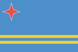
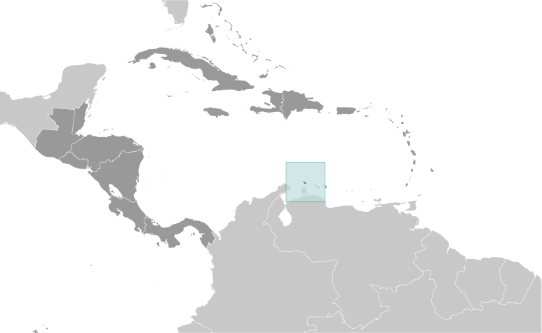
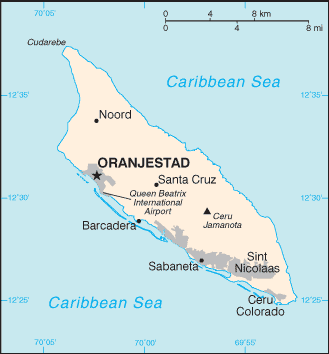

# Aruba

_part of the Kingdom of the Netherlands_

## Introduction

**_Background:_**   
Discovered and claimed for Spain in 1499, Aruba was acquired by the Dutch in 1636. The island's economy has been dominated by three main industries. A 19th century gold rush was followed by prosperity brought on by the opening in 1924 of an oil refinery. The last decades of the 20th century saw a boom in the tourism industry. Aruba seceded from the Netherlands Antilles in 1986 and became a separate, autonomous member of the Kingdom of the Netherlands. Movement toward full independence was halted at Aruba's request in 1990.

## Geography

**_Location:_**   
Caribbean, island in the Caribbean Sea, north of Venezuela

**_Geographic coordinates:_**   
12 30 N, 69 58 W

**_Map references:_**   
Central America and the Caribbean

**_Area:_**   
**total:** 180 sq km   
**land:** 180 sq km   
**water:** 0 sq km

**_Area - comparative:_**   
slightly larger than Washington, DC

**_Land boundaries:_**   
0 km

**_Coastline:_**   
68.5 km

**_Maritime claims:_**   
**territorial sea:** 12 nm

**_Climate:_**   
tropical marine; little seasonal temperature variation

**_Terrain:_**   
flat with a few hills; scant vegetation

**_Elevation extremes:_**   
**lowest point:** Caribbean Sea 0 m   
**highest point:** Ceru Jamanota 188 m

**_Natural resources:_**   
NEGL; white sandy beaches

**_Land use:_**   
**arable land:** 11.11%   
**permanent crops:** 0%   
**other:** 88.89% (2005)

**_Irrigated land:_**   
NA

**_Natural hazards:_**   
hurricanes; lies outside the Caribbean hurricane belt and is rarely threatened

**_Environment - current issues:_**   
NA

**_Geography - note:_**   
a flat, riverless island renowned for its white sand beaches; its tropical climate is moderated by constant trade winds from the Atlantic Ocean; the temperature is almost constant at about 27 degrees Celsius (81 degrees Fahrenheit)

## People and Society

**_Nationality:_**   
**noun:** Aruban(s)   
**adjective:** Aruban; Dutch

**_Ethnic groups:_**   
Dutch 82.1%, Colombian 6.6%, Venezuelan 2.2%, Dominican 2.2%, Haitian 1.2%, other 5.5%, unspecified 0.1% (2010 est.)

**_Languages:_**   
Papiamento (a Spanish-Portuguese-Dutch-English dialect) 69.4%, Spanish 13.7%, English (widely spoken) 7.1%, Dutch (official) 6.1%, Chinese 1.5%, other 1.7%, unspecified 0.4% (2010 est.)

**_Religions:_**   
Roman Catholic 75.3%, Protestant 4.9% (includes Methodist .9%, Adventist .9%, Anglican .4%, other Protestant 2.7%), Jehovah's Witness 1.7%, other 12%, none 5.5%, unspecified 0.5% (2010 est.)

**_Population:_**   
110,663 (July 2014 est.)

**_Age structure:_**   
**0-14 years:** 17.8% (male 9,852/female 9,797)   
**15-24 years:** 13.5% (male 7,469/female 7,427)   
**25-54 years:** 43% (male 22,981/female 24,615)   
**55-64 years:** 13.5% (male 6,804/female 8,093)   
**65 years and over:** 12.3% (male 5,346/female 8,279) (2014 est.)

**_Dependency ratios:_**   
**total dependency ratio:** 44.1 %   
**youth dependency ratio:** 27.1 %   
**elderly dependency ratio:** 16.9 %   
**potential support ratio:** 5.9 (2014 est.)

**_Median age:_**   
**total:** 38.8 years   
**male:** 36.9 years   
**female:** 40.6 years (2014 est.)

**_Population growth rate:_**   
1.36% (2014 est.)

**_Birth rate:_**   
12.65 births/1,000 population (2014 est.)

**_Death rate:_**   
8.09 deaths/1,000 population (2014 est.)

**_Net migration rate:_**   
9.04 migrant(s)/1,000 population (2014 est.)

**_Urbanization:_**   
**urban population:** 46.8% of total population (2011)   
**rate of urbanization:** 0.54% annual rate of change (2010-15 est.)

**_Major urban areas - population:_**   
ORANJESTAD (capital) 37,000 (2011)

**_Sex ratio:_**   
**at birth:** 1.02 male(s)/female   
**0-14 years:** 1.01 male(s)/female   
**15-24 years:** 1.01 male(s)/female   
**25-54 years:** 0.93 male(s)/female   
**55-64 years:** 0.9 male(s)/female   
**65 years and over:** 0.65 male(s)/female   
**total population:** 0.9 male(s)/female (2014 est.)

**_Infant mortality rate:_**   
**total:** 11.74 deaths/1,000 live births   
**male:** 15.44 deaths/1,000 live births   
**female:** 7.97 deaths/1,000 live births (2014 est.)

**_Life expectancy at birth:_**   
**total population:** 76.35 years   
**male:** 73.3 years   
**female:** 79.47 years (2014 est.)

**_Total fertility rate:_**   
1.84 children born/woman (2014 est.)

**_Drinking water source:_**   
**improved:** urban: 97.8% of population; rural: 97.8% of population; total: 97.8% of population   
**unimproved:** urban: 2.2% of population; rural: 2.2% of population; total: 2.2% of population (2012 est.)

**_Sanitation facility access:_**   
**improved:** urban: 97.7% of population; rural: 97.7% of population; total: 97.7% of population   
**unimproved:** urban: 2.3% of population; rural: 2.3% of population; total: 2.3% of population (2012 est.)

**_HIV/AIDS - adult prevalence rate:_**   
NA

**_HIV/AIDS - people living with HIV/AIDS:_**   
NA

**_HIV/AIDS - deaths:_**   
NA

**_Education expenditures:_**   
6% of GDP (2011)

**_Literacy:_**   
**definition:** age 15 and over can read and write   
**total population:** 96.8%   
**male:** 96.9%   
**female:** 96.7% (2010 est.)

**_School life expectancy (primary to tertiary education):_**   
**total:** 13 years   
**male:** 13 years   
**female:** 14 years (2011)

**_Unemployment, youth ages 15-24:_**   
**total:** 23.2%   
**male:** 24.1%   
**female:** 22.9% (2007)

## Government

**_Country name:_**   
**conventional long form:** none   
**conventional short form:** Aruba

**_Dependency status:_**   
constituent country of the Kingdom of the Netherlands; full autonomy in internal affairs obtained in 1986 upon separation from the Netherlands Antilles; Dutch Government responsible for defense and foreign affairs

**_Government type:_**   
parliamentary democracy

**_Capital:_**   
**name:** Oranjestad   
**geographic coordinates:** 12 31 N, 70 02 W   
**time difference:** UTC-4 (1 hour ahead of Washington, DC, during Standard Time)

**_Administrative divisions:_**   
none (part of the Kingdom of the Netherlands)

**_Independence:_**   
none (part of the Kingdom of the Netherlands)

**_National holiday:_**   
Flag Day, 18 March (1976)

**_Constitution:_**   
previous 1947, 1955; latest drafted and approved August 1985, enacted 1 January 1986 (regulates governance of Aruba, but is subordinate to the Charter for the Kingdom of the Netherlands); note - in October 2010, following dissolution of the Netherlands Antilles, Aruba became a constituent country within the Kingdom of the Netherlands (2013)

**_Legal system:_**   
civil law system based on the Dutch civil code

**_Suffrage:_**   
18 years of age; universal

**_Executive branch:_**   
**chief of state:** King WILLEM-ALEXANDER of the Netherlands (since 30 April 2013); represented by Governor General Fredis REFUNJOL (since 11 May 2004)   
**head of government:** Prime Minister Michiel "Mike" Godfried EMAN (since 30 October 2009)   
**cabinet:** Council of Ministers elected by the Staten   
**elections:** the monarchy is hereditary; governor general appointed for a six-year term by the monarch; prime minister and deputy prime minister elected by the Staten for four-year terms; election last held on 25 September 2009 (next to be held by September 2013)   
**election results:** Michiel "Mike" Godfried EMAN elected prime minister; percent of legislative vote - NA

**_Legislative branch:_**   
unicameral Legislature or Staten (21 seats; members elected by direct popular vote to serve four-year terms)   
**elections:** last held on 27 September 2013 (next to be held in 2017)   
**election results:** percent of vote by party - NA; seats by party - AVP 13, MEP 8

**_Judicial branch:_**   
**highest court(s):** Joint Court of Justice of Aruba, Curacao, Sint Maarten, and of Bonaire, Sint Eustatitus and Saba or "Joint Court of Justice" (consists of the presiding judge, NA members, and NA substitutes); final appeals heard by the Supreme Court, in The Hague, Netherlands; note - prior to 2010, the Joint Court of Justice was the Common Court of Justice of the Netherlands Antilles and Aruba   
**judge selection and term of office:** Joint Court judges appointed by the monarch for life   
**subordinate courts:** Courts in First Instance

**_Political parties and leaders:_**   
Aliansa/Aruban Social Movement or MSA [Robert WEVER]   
Aruban Liberal Organization or OLA [Glenbert CROES]   
Aruban Patriotic Movement or MPA [Monica ARENDS-KOCK]   
Aruban Patriotic Party or PPA [Benny NISBET]   
Aruban People's Party or AVP [Michiel "Mike" EMAN]   
People's Electoral Movement Party or MEP [Nelson O. ODUBER]   
Real Democracy or PDR [Andin BIKKER]   
RED [Rudy LAMPE]   
Workers Political Platform or PTT [Gregorio WOLFF]

**_Political pressure groups and leaders:_**   
**other:** environmental groups

**_International organization participation:_**   
Caricom (observer), FATF, ILO, IMF, Interpol, IOC, ITUC (NGOs), UNESCO (associate), UNWTO (associate), UPU

**_Diplomatic representation in the US:_**   
none (represented by the Kingdom of the Netherlands); note - Mr. Henry BAARH, Minister Plenipotentiary for Aruba at the Embassy of the Kingdom of the Netherlands

**_Diplomatic representation from the US:_**   
the US does not have an embassy in Aruba; the Consul General to Curacao, currently Consul General Valerie BELON, is accredited to Aruba

**_Flag description:_**   
blue, with two narrow, horizontal, yellow stripes across the lower portion and a red, four-pointed star outlined in white in the upper hoist-side corner; the star represents Aruba and its red soil and white beaches, its four points the four major languages (Papiamento, Dutch, Spanish, English) as well as the four points of a compass, to indicate that its inhabitants come from all over the world; the blue symbolizes Caribbean waters and skies; the stripes represent the island's two main "industries": the flow of tourists to the sun-drenched beaches and the flow of minerals from the earth

**_National anthem:_**   
**name:** "Aruba Deshi Tera" (Aruba Precious Country)   
**lyrics/music:** Juan Chabaya 'Padu' LAMPE/Rufo Inocencio WEVER   
**note:** local anthem adopted 1986; as part of the Kingdom of the Netherlands, "Het Wilhelmus" is official (see Netherlands)

## Economy

**_Economy - overview:_**   
Tourism and offshore banking are the mainstays of the small open Aruban economy. Tourist arrivals have rebounded strongly following a dip after the 11 September 2001 attacks. Tourism now accounts for over 80 % of economic activity. Over 1.5 million tourists per year visit Aruba, with 75% of those from the US. The rapid growth of the tourism sector has resulted in a substantial expansion of other activities. Construction continues to boom with hotel capacity five times the 1985 level. Aruba is heavily dependent on imports and is making efforts to expand exports to achieve a more desirable trade balance. Aruba weathered two major shocks in recent years: fallout from the global financial crisis, which had its largest impact on tourism, and the closure of its oil refinery in 2009. Economic recovery is progressing gradually, but output is still 12% below its pre-crisis level. Aruba’s banking sector withstood the recession well, and unemployment has significantly decreased.

**_GDP (purchasing power parity):_**   
$2.516 billion (2009 est.)   
$2.258 billion (2005 est.)   
$2.205 billion (2004 est.)

**_GDP (official exchange rate):_**   
$2.516 billion (2009 est.)

**_GDP - real growth rate:_**   
2.4% (2005 est.)

**_GDP - per capita (PPP):_**   
$25,300 (2011 est.)

**_GDP - composition, by sector of origin:_**   
**agriculture:** 0.4%   
**industry:** 33.3%   
**services:** 66.3% (2002 est.)

**_Agriculture - products:_**   
aloes; livestock; fish

**_Industries:_**   
tourism, transshipment facilities, banking

**_Industrial production growth rate:_**   
NA%

**_Labor force:_**   
51,610   
**note:** of the 51,610 workers aged 15 and over in the labor force, 32,252 were born in Aruba and 19,353 came from abroad; foreign workers are 38% of the employed population (2007 est.)

**_Labor force - by occupation:_**   
**agriculture:** NA%   
**industry:** NA%   
**services:** NA%   
**note:** most employment is in wholesale and retail trade, followed by hotels and restaurants

**_Unemployment rate:_**   
6.9% (2005 est.)

**_Population below poverty line:_**   
NA%

**_Household income or consumption by percentage share:_**   
**lowest 10%:** NA%   
**highest 10%:** NA%

**_Budget:_**   
**revenues:** $625.1 million   
**expenditures:** $813.9 million (2013 est.)

**_Taxes and other revenues:_**   
24.8% of GDP (2013 est.)

**_Budget surplus (+) or deficit (-):_**   
-7.5% of GDP (2013 est.)

**_Public debt:_**   
67% of GDP (2013)   
55% of GDP (2012)

**_Fiscal year:_**   
calendar year

**_Inflation rate (consumer prices):_**   
-2% (2013 est.)   
0.6% (2012 est.)

**_Central bank discount rate:_**   
1% (31 December 2010 est.)   
3% (31 December 2009 est.)

**_Commercial bank prime lending rate:_**   
10.5% (31 December 2013 est.)   
8.4% (31 December 2012 est.)

**_Stock of narrow money:_**   
$1.022 billion (31 December 2012 est.)   
$868.5 million (31 December 2011 est.)

**_Stock of broad money:_**   
$1.91 billion (31 December 2012 est.)   
$1.765 billion (31 December 2011 est.)

**_Stock of domestic credit:_**   
$1.594 billion (31 December 2012 est.)   
$1.448 billion (31 December 2011 est.)

**_Exports:_**   
$2.222 billion (2013 est.)   
$1.389 billion (2012 est.)

**_Exports - commodities:_**   
live animals and animal products, art and collectibles, machinery and electrical equipment, transport equipment

**_Exports - partners:_**   
Colombia 39.4%, Venezuela 29.3%, US 13%, Netherlands Antilles 4.1% (2012)

**_Imports:_**   
$3.162 billion (2013 est.)   
$2.039 billion (2012 est.)

**_Imports - commodities:_**   
machinery and electrical equipment, crude oil for refining and reexport, chemicals; foodstuffs

**_Imports - partners:_**   
US 46.4%, Netherlands 11.5%, UK 5.4% (2012)

**_Debt - external:_**   
$533.4 million (2005 est.)

**_Exchange rates:_**   
Aruban guilders/florins per US dollar -   
1.79 (2013 est.)   
1.79 (2012 est.)

## Energy

**_Electricity - production:_**   
980 million kWh (2010 est.)

**_Electricity - consumption:_**   
911.4 million kWh (2010 est.)

**_Electricity - exports:_**   
0 kWh (2012 est.)

**_Electricity - imports:_**   
0 kWh (2012 est.)

**_Electricity - installed generating capacity:_**   
266,000 kW (2010 est.)

**_Electricity - from fossil fuels:_**   
88.7% of total installed capacity (2010 est.)

**_Electricity - from nuclear fuels:_**   
0% of total installed capacity (2010 est.)

**_Electricity - from hydroelectric plants:_**   
0% of total installed capacity (2010 est.)

**_Electricity - from other renewable sources:_**   
11.3% of total installed capacity (2010 est.)

**_Crude oil - production:_**   
2,811 bbl/day (2012 est.)

**_Crude oil - exports:_**   
0 bbl/day (2010 est.)

**_Crude oil - imports:_**   
228,800 bbl/day (2010 est.)

**_Crude oil - proved reserves:_**   
0 bbl (1 January 2013 est.)

**_Refined petroleum products - production:_**   
234,200 bbl/day (2010 est.)

**_Refined petroleum products - consumption:_**   
5,661 bbl/day (2011 est.)

**_Refined petroleum products - exports:_**   
234,200 bbl/day (2010 est.)

**_Refined petroleum products - imports:_**   
6,725 bbl/day (2010 est.)

**_Natural gas - production:_**   
1 cu m (2011 est.)

**_Natural gas - consumption:_**   
1 cu m (2010 est.)

**_Natural gas - exports:_**   
1 cu m (2011 est.)

**_Natural gas - imports:_**   
1 cu m (2011 est.)

**_Natural gas - proved reserves:_**   
0 cu m (1 January 2013 est.)

**_Carbon dioxide emissions from consumption of energy:_**   
1.237 million Mt (2011 est.)

## Communications

**_Telephones - main lines in use:_**   
43,000 (2012)

**_Telephones - mobile cellular:_**   
135,000 (2012)

**_Telephone system:_**   
**general assessment:** modern fully automatic telecommunications system   
**domestic:** increased competition through privatization; 3 mobile-cellular service providers are now licensed   
**international:** country code - 297; landing site for the PAN-AM submarine telecommunications cable system that extends from the US Virgin Islands through Aruba to Venezuela, Colombia, Panama, and the west coast of South America; extensive interisland microwave radio relay links (2007)

**_Broadcast media:_**   
2 commercial TV stations; cable TV subscription service provides access to foreign channels; about 20 commercial radio stations broadcast (2007)

**_Internet country code:_**   
.aw

**_Internet hosts:_**   
40,560 (2012)

**_Internet users:_**   
24,000 (2009)

## Transportation

**_Airports:_**   
1 (2013)

**_Airports - with paved runways:_**   
**total:** 1   
**2,438 to 3,047 m:** 1 (2013)

**_Ports and terminals:_**   
**major seaport(s):** Barcadera, Oranjestad   
**oil terminal(s):** Sint Nicolaas   
**cruise port(s):** Oranjestad

## Military

**_Military branches:_**   
no regular military forces (2011)

**_Manpower available for military service:_**   
**males age 16-49:** 24,891   
**females age 16-49:** 26,202 (2010 est.)

**_Manpower fit for military service:_**   
**males age 16-49:** 20,527   
**females age 16-49:** 21,493 (2010 est.)

**_Manpower reaching militarily significant age annually:_**   
**male:** 767   
**female:** 743 (2010 est.)

**_Military - note:_**   
defense is the responsibility of the Netherlands; the Aruba security services focus on organized crime and terrorism (2011)

## Transnational Issues

**_Disputes - international:_**   
none

**_Illicit drugs:_**   
transit point for US- and Europe-bound narcotics with some accompanying money-laundering activity; relatively high percentage of population consumes cocaine

............................................................   
_Page last updated on June 23, 2014_
