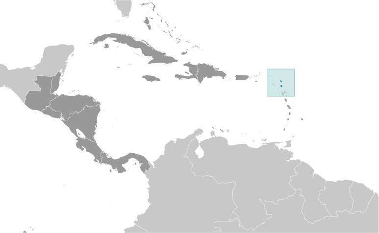

# Antigua and Barbuda

## Introduction

**_Background:_**   
The Siboney were the first people to inhabit the islands of Antigua and Barbuda in 2400 B.C., but Arawak Indians populated the islands when COLUMBUS landed on his second voyage in 1493. Early Spanish and French settlements were succeeded by an English colony in 1667. Slavery, established to run the sugar plantations on Antigua, was abolished in 1834. The islands became an independent state within the British Commonwealth of Nations in 1981.

## Geography

**_Location:_**   
Caribbean, islands between the Caribbean Sea and the North Atlantic Ocean, east-southeast of Puerto Rico

**_Geographic coordinates:_**   
17 03 N, 61 48 W

**_Map references:_**   
Central America and the Caribbean

**_Area:_**   
**total:** 442.6 sq km (Antigua 280 sq km; Barbuda 161 sq km)   
**land:** 442.6 sq km   
**water:** 0 sq km   
**note:** includes Redonda, 1.6 sq km

**_Area - comparative:_**   
2.5 times the size of Washington, DC

**_Land boundaries:_**   
0 km

**_Coastline:_**   
153 km

**_Maritime claims:_**   
**territorial sea:** 12 nm   
**contiguous zone:** 24 nm   
**exclusive economic zone:** 200 nm   
**continental shelf:** 200 nm or to the edge of the continental margin

**_Climate:_**   
tropical maritime; little seasonal temperature variation

**_Terrain:_**   
mostly low-lying limestone and coral islands, with some higher volcanic areas

**_Elevation extremes:_**   
**lowest point:** Caribbean Sea 0 m   
**highest point:** Boggy Peak 402 m

**_Natural resources:_**   
NEGL; pleasant climate fosters tourism

**_Land use:_**   
**arable land:** 9.09%   
**permanent crops:** 2.27%   
**other:** 88.64% (2011)

**_Irrigated land:_**   
1.3 sq km (2003)

**_Total renewable water resources:_**   
0.05 cu km (2011)

**_Freshwater withdrawal (domestic/industrial/agricultural):_**   
**total:** 0.01 cu km/yr (63%/21%/15%)   
**per capita:** 97.67 cu m/yr (2005)

**_Natural hazards:_**   
hurricanes and tropical storms (July to October); periodic droughts

**_Environment - current issues:_**   
water management - a major concern because of limited natural freshwater resources - is further hampered by the clearing of trees to increase crop production, causing rainfall to run off quickly

**_Environment - international agreements:_**   
**party to:** Biodiversity, Climate Change, Climate Change-Kyoto Protocol, Desertification, Endangered Species, Environmental Modification, Hazardous Wastes, Law of the Sea, Marine Dumping, Ozone Layer Protection, Ship Pollution, Wetlands, Whaling   
**signed, but not ratified:** none of the selected agreements

**_Geography - note:_**   
Antigua has a deeply indented shoreline with many natural harbors and beaches; Barbuda has a large western harbor

## People and Society

**_Nationality:_**   
**noun:** Antiguan(s), Barbudan(s)   
**adjective:** Antiguan, Barbudan

**_Ethnic groups:_**   
black 91%, mixed 4.4%, white 1.7%, other 2.9% (2001 census)

**_Languages:_**   
English (official), local dialects

**_Religions:_**   
Protestant 76.4% (Anglican 25.7%, Seventh-Day Adventist 12.3%, Pentecostal 10.6%, Moravian 10.5%, Methodist 7.9%, Baptist 4.9%, Church of God 4.5%), Roman Catholic 10.4%, other Christian 5.4%, other 2%, none or unspecified 5.8% (2001 census)

**_Population:_**   
91,295 (July 2014 est.)

**_Age structure:_**   
**0-14 years:** 24.3% (male 11,289/female 10,932)   
**15-24 years:** 16.8% (male 7,588/female 7,723)   
**25-54 years:** 42.6% (male 17,789/female 21,137)   
**55-64 years:** 8.9% (male 3,694/female 4,441)   
**65 years and over:** 7.3% (male 2,886/female 3,816) (2014 est.)

**_Dependency ratios:_**   
**total dependency ratio:** 46.4 %   
**youth dependency ratio:** 35.9 %   
**elderly dependency ratio:** 10.4 %   
**potential support ratio:** 9.6 (2014 est.)

**_Median age:_**   
**total:** 31.1 years   
**male:** 29.4 years   
**female:** 32.6 years (2014 est.)

**_Population growth rate:_**   
1.25% (2014 est.)

**_Birth rate:_**   
15.94 births/1,000 population (2014 est.)

**_Death rate:_**   
5.7 deaths/1,000 population (2014 est.)

**_Net migration rate:_**   
2.23 migrant(s)/1,000 population (2014 est.)

**_Urbanization:_**   
**urban population:** 29.8% of total population (2011)   
**rate of urbanization:** 0.96% annual rate of change (2010-15 est.)

**_Major urban areas - population:_**   
SAINT JOHN'S (capital) 27,000 (2011)

**_Sex ratio:_**   
**at birth:** 1.05 male(s)/female   
**0-14 years:** 1.03 male(s)/female   
**15-24 years:** 0.98 male(s)/female   
**25-54 years:** 0.84 male(s)/female   
**55-64 years:** 0.9 male(s)/female   
**65 years and over:** 0.76 male(s)/female   
**total population:** 0.9 male(s)/female (2014 est.)

**_Infant mortality rate:_**   
**total:** 13.29 deaths/1,000 live births   
**male:** 15.3 deaths/1,000 live births   
**female:** 11.17 deaths/1,000 live births (2014 est.)

**_Life expectancy at birth:_**   
**total population:** 76.12 years   
**male:** 74.04 years   
**female:** 78.3 years (2014 est.)

**_Total fertility rate:_**   
2.03 children born/woman (2014 est.)

**_Health expenditures:_**   
5.9% of GDP (2011)

**_Physicians density:_**   
0.17 physicians/1,000 population (1999)

**_Hospital bed density:_**   
2.1 beds/1,000 population (2011)

**_Drinking water source:_**   
**improved:** urban: 97.9% of population; rural: 97.9% of population; total: 97.9% of population   
**unimproved:** urban: 2.1% of population; rural: 2.1% of population; total: 2.1% of population (2012 est.)

**_Sanitation facility access:_**   
**improved:** urban: 91.4% of population; rural: 91.4% of population; total: 91.4% of population   
**unimproved:** urban: 8.6% of population; rural: 8.6% of population; total: 8.6% of population (2011 est.)

**_HIV/AIDS - adult prevalence rate:_**   
NA

**_HIV/AIDS - people living with HIV/AIDS:_**   
NA

**_HIV/AIDS - deaths:_**   
NA

**_Obesity - adult prevalence rate:_**   
25.6% (2008)

**_Education expenditures:_**   
2.4% of GDP (2009)

**_Literacy:_**   
**definition:** age 15 and over has completed five or more years of schooling   
**total population:** 99%   
**male:** 98.4%   
**female:** 99.4% (2011 est.)

**_School life expectancy (primary to tertiary education):_**   
**total:** 14 years   
**male:** 13 years   
**female:** 15 years (2012)

**_Unemployment, youth ages 15-24:_**   
**total:** 19.9%   
**male:** 18.4%   
**female:** 21.6% (2001)

## Government

**_Country name:_**   
**conventional long form:** none   
**conventional short form:** Antigua and Barbuda

**_Government type:_**   
constitutional monarchy with a parliamentary system of government and a Commonwealth realm

**_Capital:_**   
**name:** Saint John's   
**geographic coordinates:** 17 07 N, 61 51 W   
**time difference:** UTC-4 (1 hour ahead of Washington, DC, during Standard Time)

**_Administrative divisions:_**   
6 parishes and 2 dependencies\*; Barbuda\*, Redonda\*, Saint George, Saint John, Saint Mary, Saint Paul, Saint Peter, Saint Philip

**_Independence:_**   
1 November 1981 (from the UK)

**_National holiday:_**   
Independence Day (National Day), 1 November (1981)

**_Constitution:_**   
several previous; latest presented 31 July 1981, effective 31 October 1981 (Antigua and Barbuda Constitutional Order 1981) (2011)

**_Legal system:_**   
common law based on the English model

**_International law organization participation:_**   
has not submitted an ICJ jurisdiction declaration; accepts ICCt jurisdiction

**_Suffrage:_**   
18 years of age; universal

**_Executive branch:_**   
**chief of state:** Queen ELIZABETH II (since 6 February 1952); represented by Governor General Louisse LAKE-TACK (since 17 July 2007)   
**head of government:** Prime Minister Gaston BROWNE (since 13 June 2014)   
**cabinet:** Council of Ministers appointed by the governor general on the advice of the prime minister   
**elections:** the monarchy is hereditary; governor general appointed by the monarch on the advice of the prime minister; following legislative elections, the leader of the majority party or the leader of the majority coalition usually appointed prime minister by the governor general

**_Legislative branch:_**   
bicameral Parliament consists of the Senate (17 seats; members appointed by the governor general) and the House of Representatives (17 seats; members are elected by proportional representation to serve five-year terms)   
**elections:** House of Representatives - last held on 12 June 2014 (next to be held in 2019)   
**election results:** percent of vote by party - ALP 56.4% UPP 42%; seats by party - ALP 14, UPP 3

**_Judicial branch:_**   
**highest court(s):** the Eastern Caribbean Supreme Court (ECSC) is the itinerant superior court of record for the 9-member Organization of Eastern Caribbean States to include Antigua and Barbuda; the ECSC - headquartered on St. Lucia - is headed by the chief justice and is comprised of the Court of Appeal with 3 justices and the High Court with 16 judges; sittings of the Court of Appeal and High Court rotate among the 9 member states; 2 High Court judges reside on Antigua and Barbuda; note - Antigua and Barbuda replaced the Judicial Committee of the Privy Council in London as the final appellate court; also a member of the Caribbean Court of Justice   
**judge selection and term of office:** Eastern Caribbean Supreme Court Chief Justice appointed by the Her Majesty, Queen ELIZABETH II; other justices and judges appointed by the Judicial and Legal Services Commission; Court of Appeal justices appointed for life with mandatory retirement at age 65; High Court judges appointed for life with mandatory retirement at age 62   
**subordinate courts:** Industrial Court; Magistrates' Courts

**_Political parties and leaders:_**   
Antigua Labor Party or ALP [Gaston BROWNE]   
Barbuda People's Movement or BPM [Trevor WALKER]   
Barbuda People's Movement for Change [Arthur NIBBS]   
Barbudans for a Better Barbuda [Ordrick SAMUEL]   
United Progressive Party or UPP [W. Baldwin SPENCER] (a coalition of three parties - Antigua Caribbean Liberation Movement or ACLM, Progressive Labor Movement or PLM, United National Democratic Party or UNDP)

**_Political pressure groups and leaders:_**   
Antigua Trades and Labor Union or ATLU [Wigley GEORGE]   
People's Democratic Movement or PDM [Hugh MARSHALL]

**_International organization participation:_**   
ACP, AOSIS, C, Caricom, CDB, CELAC, FAO, G-77, IBRD, ICAO, ICC (NGOs), ICRM, IDA, IFAD, IFC, IFRCS, ILO, IMF, IMO, IMSO, Interpol, IOC, IOM, ISO (subscriber), ITU, ITUC (NGOs), MIGA, NAM, OAS, OECS, OPANAL, OPCW, Petrocaribe, UN, UNCTAD, UNESCO, UPU, WFTU (NGOs), WHO, WIPO, WMO, WTO

**_Diplomatic representation in the US:_**   
**chief of mission:** Ambassador Deborah Mae LOVELL (since 8 March 2005)   
**chancery:** 3216 New Mexico Avenue NW, Washington, DC 20016   
**telephone:** [1] (202) 362-5122   
**FAX:** [1] (202) 362-5525   
**consulate(s) general:** Miami, New York

**_Diplomatic representation from the US:_**   
the US does not have an embassy in Antigua and Barbuda; the US Ambassador to Barbados is accredited to Antigua and Barbuda

**_Flag description:_**   
red, with an inverted isosceles triangle based on the top edge of the flag; the triangle contains three horizontal bands of black (top), light blue, and white, with a yellow rising sun in the black band; the sun symbolizes the dawn of a new era, black represents the African heritage of most of the population, blue is for hope, and red is for the dynamism of the people; the "V" stands for victory; the successive yellow, blue, and white coloring is also meant to evoke the country's tourist attractions of sun, sea, and sand

**_National anthem:_**   
**name:** "Fair Antigua, We Salute Thee"   
**lyrics/music:** Novelle Hamilton RICHARDS/Walter Garnet Picart CHAMBERS   
**note:** adopted 1967; as a Commonwealth country, in addition to the national anthem, "God Save the Queen" serves as the royal anthem (see United Kingdom)

## Economy

**_Economy - overview:_**   
Tourism continues to dominate Antigua and Barbuda's economy, accounting for nearly 60% of GDP and 40% of investment. The dual-island nation's agricultural production is focused on the domestic market and constrained by a limited water supply and a labor shortage stemming from the lure of higher wages in tourism and construction. Manufacturing comprises enclave-type assembly for export with major products being bedding, handicrafts, and electronic components. Prospects for economic growth in the medium term will continue to depend on tourist arrivals from the US, Canada, and Europe and potential damages from natural disasters. After taking office in 2004, the SPENCER government adopted an ambitious fiscal reform program and was successful in reducing its public debt-to-GDP ratio from approximately 130% in 2010 to 89% in 2012. In 2009, Antigua's economy was severely hit by the global economic crisis and suffered from the collapse of its largest private sector employer, a steep decline in tourism, a rise in debt, and a sharp economic contraction between 2009-11. Antigua has not yet returned to its pre-crisis growth levels.

**_GDP (purchasing power parity):_**   
$1.61 billion (2013 est.)   
$1.583 billion (2012 est.)   
$1.558 billion (2011 est.)   
**note:** data are in 2013 US dollars

**_GDP (official exchange rate):_**   
$1.22 billion (2013 est.)

**_GDP - real growth rate:_**   
1.7% (2013 est.)   
1.6% (2012 est.)   
-3% (2011 est.)

**_GDP - per capita (PPP):_**   
$18,400 (2013 est.)   
$18,100 (2012 est.)   
$17,800 (2011 est.)   
**note:** data are in 2013 US dollars

**_Gross national saving:_**   
18% of GDP (2013 est.)   
18% of GDP (2012 est.)   
18.4% of GDP (2011 est.)

**_GDP - composition, by end use:_**   
**household consumption:** 55.8%   
**government consumption:** 14.9%   
**investment in fixed capital:** 28%   
**investment in inventories:** 0.1%   
**exports of goods and services:** 46.2%   
**imports of goods and services:** -45%; (2013 est.)

**_GDP - composition, by sector of origin:_**   
**agriculture:** 2.2%   
**industry:** 16.4%   
**services:** 81.4% (2013 est.)

**_Agriculture - products:_**   
cotton, fruits, vegetables, bananas, coconuts, cucumbers, mangoes, sugarcane; livestock

**_Industries:_**   
tourism, construction, light manufacturing (clothing, alcohol, household appliances)

**_Industrial production growth rate:_**   
1% (2013 est.)

**_Labor force:_**   
30,000 (1991)

**_Labor force - by occupation:_**   
**agriculture:** 7%   
**industry:** 11%   
**services:** 82% (1983)

**_Unemployment rate:_**   
11% (2001 est.)

**_Population below poverty line:_**   
NA%

**_Household income or consumption by percentage share:_**   
**lowest 10%:** NA%   
**highest 10%:** NA%

**_Budget:_**   
**revenues:** $239.5 million   
**expenditures:** $248.7 million (2012 est.)

**_Taxes and other revenues:_**   
19.6% of GDP (2012 est.)

**_Budget surplus (+) or deficit (-):_**   
-0.8% of GDP (2012 est.)

**_Public debt:_**   
89% of GDP (2012 est.)   
130% of GDP (2010 est.)

**_Fiscal year:_**   
1 April - 31 March

**_Inflation rate (consumer prices):_**   
3% (2013 est.)   
3.4% (2012 est.)

**_Central bank discount rate:_**   
6.5% (31 December 2010 est.)   
6.5% (31 December 2009 est.)

**_Commercial bank prime lending rate:_**   
10.3% (31 December 2013 est.)   
10.13% (31 December 2012 est.)

**_Stock of narrow money:_**   
$213 million (31 December 2013 est.)   
$205.2 million (31 December 2012 est.)

**_Stock of broad money:_**   
$1.044 billion (31 December 2013 est.)   
$1.033 billion (31 December 2012 est.)

**_Stock of domestic credit:_**   
$1.111 billion (31 December 2013 est.)   
$1.111 billion (31 December 2012 est.)

**_Current account balance:_**   
-$164.8 million (2013 est.)   
-$78.5 million (2012 est.)

**_Exports:_**   
$55 million (2013 est.)   
$56.7 million (2012 est.)

**_Exports - commodities:_**   
petroleum products, bedding, handicrafts, electronic components, transport equipment, food and live animals

**_Imports:_**   
$340.8 million (2013 est.)   
$402.7 million (2012 est.)

**_Imports - commodities:_**   
food and live animals, machinery and transport equipment, manufactures, chemicals, oil

**_Debt - external:_**   
$441.2 million (31 December 2012)   
$458 million (June 2010)

**_Exchange rates:_**   
East Caribbean dollars (XCD) per US dollar -   
2.7 (2013 est.)   
2.7 (2012 est.)   
2.7 (2010 est.)   
2.7 (2009)

## Energy

**_Electricity - production:_**   
115 million kWh (2010 est.)

**_Electricity - consumption:_**   
107 million kWh (2010 est.)

**_Electricity - exports:_**   
0 kWh (2012 est.)

**_Electricity - imports:_**   
0 kWh (2012 est.)

**_Electricity - installed generating capacity:_**   
27,000 kW (2010 est.)

**_Electricity - from fossil fuels:_**   
100% of total installed capacity (2010 est.)

**_Electricity - from nuclear fuels:_**   
0% of total installed capacity (2010 est.)

**_Electricity - from hydroelectric plants:_**   
0% of total installed capacity (2010 est.)

**_Electricity - from other renewable sources:_**   
0% of total installed capacity (2010 est.)

**_Crude oil - production:_**   
0 bbl/day (2012 est.)

**_Crude oil - exports:_**   
0 bbl/day (2010 est.)

**_Crude oil - imports:_**   
0 bbl/day (2010 est.)

**_Crude oil - proved reserves:_**   
0 bbl (1 January 2013 est.)

**_Refined petroleum products - production:_**   
0 bbl/day (2010 est.)

**_Refined petroleum products - consumption:_**   
5,000 bbl/day (2011 est.)

**_Refined petroleum products - exports:_**   
240 bbl/day (2010 est.)

**_Refined petroleum products - imports:_**   
4,790 bbl/day (2010 est.)

**_Natural gas - production:_**   
0 cu m (2011 est.)

**_Natural gas - consumption:_**   
0 cu m (2010 est.)

**_Natural gas - exports:_**   
0 cu m (2011 est.)

**_Natural gas - imports:_**   
0 cu m (2011 est.)

**_Natural gas - proved reserves:_**   
0 cu m (1 January 2013 est.)

**_Carbon dioxide emissions from consumption of energy:_**   
731,600 Mt (2011 est.)

## Communications

**_Telephones - main lines in use:_**   
35,000 (2012)

**_Telephones - mobile cellular:_**   
179,800 (2012)

**_Telephone system:_**   
**general assessment:** good automatic telephone system   
**domestic:** fixed-line teledensity roughly 40 per 100 persons; mobile-cellular teledensity is some 200 per 100 persons   
**international:** country code - 1-268; landing points for the East Caribbean Fiber System (ECFS) and the Global Caribbean Network (GCN) submarine cable systems with links to other islands in the eastern Caribbean extending from the British Virgin Islands to Trinidad; satellite earth stations - 2; tropospheric scatter to Saba (Netherlands) and Guadeloupe (France) (2011)

**_Broadcast media:_**   
state-controlled Antigua and Barbuda Broadcasting Service (ABS) operates 1 TV station; multi-channel cable TV subscription services are available; ABS operates 1 radio station; roughly 15 radio stations, some broadcasting on multiple frequencies (2007)

**_Internet country code:_**   
.ag

**_Internet hosts:_**   
11,532 (2012)

**_Internet users:_**   
65,000 (2009)

## Transportation

**_Airports:_**   
3 (2013)

**_Airports - with paved runways:_**   
**total:** 2   
**2,438 to 3,047 m:** 1   
**under 914 m:** 1 (2013)

**_Airports - with unpaved runways:_**   
**total:** 1   
**under 914 m:** 1 (2013)

**_Roadways:_**   
**total:** 1,170 km   
**paved:** 386 km   
**unpaved:** 784 km (2011)

**_Merchant marine:_**   
**total:** 1,257   
**by type:** bulk carrier 49, cargo 753, carrier 6, chemical tanker 4, container 407, liquefied gas 12, refrigerated cargo 7, roll on/roll off 17, vehicle carrier 2   
**foreign-owned:** 1,215 (Albania 1, Colombia 1, Denmark 20, Estonia 10, Germany 1094, Greece 4, Iceland 10, Latvia 16, Lithuania 3, Mexico 1, Netherlands 17, Norway 9, NZ 2, Poland 2, Russia 3, Switzerland 7, Turkey 7, UK 1, US 7) (2010)

**_Ports and terminals:_**   
**major seaport(s):** Saint John's

## Military

**_Military branches:_**   
Ministry of National Security, Royal Antigua and Barbuda Defense Force (includes Antigua and Barbuda Coast Guard) (2012)

**_Military service age and obligation:_**   
18 years of age for voluntary military service; no conscription; Governor-General has powers to call up men for national service and set the age at which they could be called up (2012)

**_Manpower available for military service:_**   
**males age 16-49:** 21,141   
**females age 16-49:** 24,056 (2010 est.)

**_Manpower fit for military service:_**   
**males age 16-49:** 17,676   
**females age 16-49:** 19,960 (2010 est.)

**_Manpower reaching militarily significant age annually:_**   
**male:** 806   
**female:** 799 (2010 est.)

## Transnational Issues

**_Disputes - international:_**   
none

**_Illicit drugs:_**   
considered a minor transshipment point for narcotics bound for the US and Europe; more significant as an offshore financial center

............................................................   
_Page last updated on June 23, 2014_
