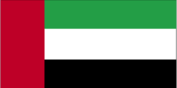
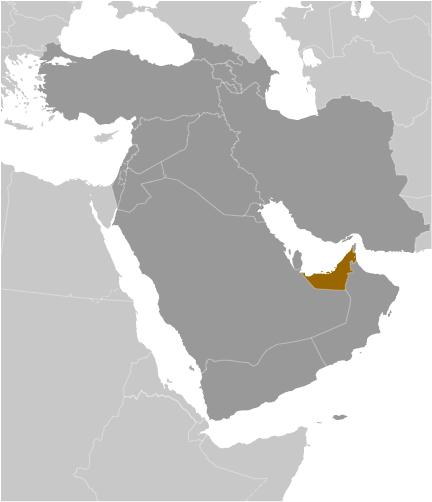
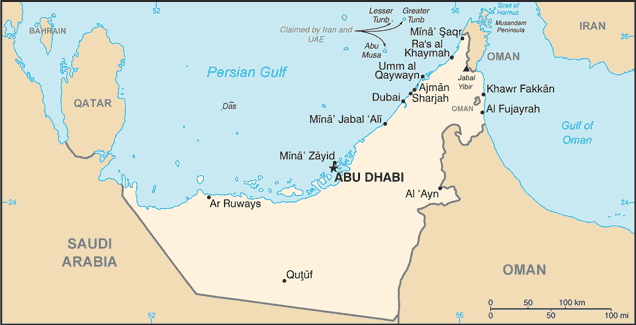

# United Arab Emirates

## Introduction

**_Background:_**   
The Trucial States of the Persian Gulf coast granted the UK control of their defense and foreign affairs in 19th century treaties. In 1971, six of these states - Abu Dhabi, 'Ajman, Al Fujayrah, Ash Shariqah, Dubayy, and Umm al Qaywayn - merged to form the United Arab Emirates (UAE). They were joined in 1972 by Ra's al Khaymah. The UAE's per capita GDP is on par with those of leading West European nations. Its high oil revenues and its moderate foreign policy stance have allowed the UAE to play a vital role in the affairs of the region. For more than three decades, oil and global finance drove the UAE's economy. However, in 2008-09, the confluence of falling oil prices, collapsing real estate prices, and the international banking crisis hit the UAE especially hard. The UAE has essentially avoided the "Arab Spring" unrest seen elsewhere in the Middle East, though in March 2011, political activists and intellectuals signed a petition calling for greater public participation in governance that was widely circulated on the Internet. In an effort to stem potential further unrest, the government announced a multi-year, $1.6-billion infrastructure investment plan for the poorer northern emirates and aggressively pursued advocates of political reform.

## Geography

**_Location:_**   
Middle East, bordering the Gulf of Oman and the Persian Gulf, between Oman and Saudi Arabia

**_Geographic coordinates:_**   
24 00 N, 54 00 E

**_Map references:_**   
Middle East

**_Area:_**   
**total:** 83,600 sq km   
**land:** 83,600 sq km   
**water:** 0 sq km

**_Area - comparative:_**   
slightly smaller than Maine

**_Land boundaries:_**   
**total:** 1,066 km   
**border countries:** Oman 609 km, Saudi Arabia 457 km

**_Coastline:_**   
1,318 km

**_Maritime claims:_**   
**territorial sea:** 12 nm   
**contiguous zone:** 24 nm   
**exclusive economic zone:** 200 nm   
**continental shelf:** 200 nm or to the edge of the continental margin

**_Climate:_**   
desert; cooler in eastern mountains

**_Terrain:_**   
flat, barren coastal plain merging into rolling sand dunes of vast desert wasteland; mountains in east

**_Elevation extremes:_**   
**lowest point:** Persian Gulf 0 m   
**highest point:** Jabal Yibir 1,527 m

**_Natural resources:_**   
petroleum, natural gas

**_Land use:_**   
**arable land:** 0.61%   
**permanent crops:** 0.5%   
**other:** 98.9% (2011)

**_Irrigated land:_**   
920 sq km (2010)

**_Total renewable water resources:_**   
0.15 cu km (2011)

**_Freshwater withdrawal (domestic/industrial/agricultural):_**   
**total:** 3.99 cu km/yr (15%/2%/83%)   
**per capita:** 739.5 cu m/yr (2005)

**_Natural hazards:_**   
frequent sand and dust storms

**_Environment - current issues:_**   
lack of natural freshwater resources compensated by desalination plants; desertification; beach pollution from oil spills

**_Environment - international agreements:_**   
**party to:** Biodiversity, Climate Change, Climate Change-Kyoto Protocol, Desertification, Endangered Species, Hazardous Wastes, Marine Dumping, Ozone Layer Protection   
**signed, but not ratified:** Law of the Sea

**_Geography - note:_**   
strategic location along southern approaches to Strait of Hormuz, a vital transit point for world crude oil

## People and Society

**_Nationality:_**   
**noun:** Emirati(s)   
**adjective:** Emirati

**_Ethnic groups:_**   
Emirati 19%, other Arab and Iranian 23%, South Asian 50%, other expatriates (includes Westerners and East Asians) 8% (1982)   
**note:** less than 20% are UAE citizens (1982)

**_Languages:_**   
Arabic (official), Persian, English, Hindi, Urdu

**_Religions:_**   
Muslim (Islam; official) 76%, Christian 9%, other (primarily Hindu and Buddhist, less than 5% of the population consists of Parsi, Baha'i, Druze, Sikh, Ahmadi, Ismaili, Dawoodi Bohra Muslim, and Jewish) 15%   
**note:** represents the total population; about 85% of the population consists of noncitizens (2005 est.)

**_Population:_**   
5,628,805   
**note:** estimate is based on the results of the 2005 census that included a significantly higher estimate of net immigration of non-citizens than previous estimates; the United Arab Emirates' National Bureau of Statistics estimated the country's total population to have been 8,264,070 in 2010, based on census data; immigrants make up more than 80% of the total population, according to UN data (2013) (July 2014 est.)

**_Age structure:_**   
**0-14 years:** 20.7% (male 597,476/female 570,275)   
**15-24 years:** 13.7% (male 457,647/female 311,673)   
**25-54 years:** 61.5% (male 2,639,018/female 820,915)   
**55-64 years:** 3.1% (male 132,718/female 43,624)   
**65 years and over:** 1% (male 35,071/female 20,388) (2014 est.)

**_Dependency ratios:_**   
**total dependency ratio:** 19.3 %   
**youth dependency ratio:** 18.8 %   
**elderly dependency ratio:** 0.5 %   
**potential support ratio:** 182.8 (2014 est.)

**_Median age:_**   
**total:** 30.3 years   
**male:** 32 years   
**female:** 25 years (2014 est.)

**_Population growth rate:_**   
2.71% (2014 est.)

**_Birth rate:_**   
15.54 births/1,000 population (2014 est.)

**_Death rate:_**   
1.99 deaths/1,000 population (2014 est.)

**_Net migration rate:_**   
13.58 migrant(s)/1,000 population (2014 est.)

**_Urbanization:_**   
**urban population:** 84.4% of total population (2011)   
**rate of urbanization:** 2.52% annual rate of change (2010-15 est.)

**_Major urban areas - population:_**   
ABU DHABI (capital) 942,000; Dubai 1.978 million; Sharjah 983,000 (2011)

**_Sex ratio:_**   
**at birth:** 1.05 male(s)/female   
**0-14 years:** 1.05 male(s)/female   
**15-24 years:** 1.47 male(s)/female   
**25-54 years:** 3.22 male(s)/female   
**55-64 years:** 2.19 male(s)/female   
**65 years and over:** 1.77 male(s)/female   
**total population:** 2.19 male(s)/female (2014 est.)

**_Maternal mortality rate:_**   
12 deaths/100,000 live births (2010)

**_Infant mortality rate:_**   
**total:** 10.92 deaths/1,000 live births   
**male:** 12.73 deaths/1,000 live births   
**female:** 9.01 deaths/1,000 live births (2014 est.)

**_Life expectancy at birth:_**   
**total population:** 77.09 years   
**male:** 74.49 years   
**female:** 79.83 years (2014 est.)

**_Total fertility rate:_**   
2.36 children born/woman (2014 est.)

**_Health expenditures:_**   
3.3% of GDP (2011)

**_Physicians density:_**   
1.93 physicians/1,000 population (2007)

**_Hospital bed density:_**   
1.9 beds/1,000 population (2008)

**_Drinking water source:_**   
**improved:** urban: 99.6% of population; rural: 100% of population; total: 99.6% of population   
**unimproved:** urban: 0.4% of population; rural: 0% of population; total: 0.4% of population (2012 est.)

**_Sanitation facility access:_**   
**improved:** urban: 98% of population; rural: 95.2% of population; total: 97.5% of population   
**unimproved:** urban: 2% of population; rural: 4.8% of population; total: 2.5% of population (2012 est.)

**_HIV/AIDS - adult prevalence rate:_**   
0.2% (2001 est.)

**_HIV/AIDS - people living with HIV/AIDS:_**   
NA

**_HIV/AIDS - deaths:_**   
NA

**_Obesity - adult prevalence rate:_**   
32.7% (2008)

**_Education expenditures:_**   
NA

**_Literacy:_**   
**definition:** age 15 and over can read and write   
**total population:** 90%   
**male:** 89.5%   
**female:** 91.5% (2005 est.)

**_Unemployment, youth ages 15-24:_**   
**total:** 12.1%   
**male:** 7.9%   
**female:** 21.8% (2008)

## Government

**_Country name:_**   
**conventional long form:** United Arab Emirates   
**conventional short form:** none   
**local long form:** Al Imarat al Arabiyah al Muttahidah   
**local short form:** none   
**former:** Trucial Oman, Trucial States   
**abbreviation:** UAE

**_Government type:_**   
federation with specified powers delegated to the UAE federal government and other powers reserved to member emirates

**_Capital:_**   
**name:** Abu Dhabi   
**geographic coordinates:** 24 28 N, 54 22 E   
**time difference:** UTC+4 (9 hours ahead of Washington, DC, during Standard Time)

**_Administrative divisions:_**   
7 emirates (imarat, singular - imarah); Abu Zaby (Abu Dhabi), 'Ajman, Al Fujayrah, Ash Shariqah (Sharjah), Dubayy (Dubai), Ra's al Khaymah, Umm al Qaywayn

**_Independence:_**   
2 December 1971 (from the UK)

**_National holiday:_**   
Independence Day, 2 December (1971)

**_Constitution:_**   
previous 1971 (provisional); latest drafted in 1979, became permanent May 1996; amended 2009 (2012)

**_Legal system:_**   
mixed legal system of Islamic law and civil law

**_International law organization participation:_**   
has not submitted an ICJ jurisdiction declaration; non-party state to the ICCt

**_Suffrage:_**   
limited; note - rulers of the seven emirates each select a proportion of voters for the Federal National Council (FNC) that together account for about 12 percent of Emirati citizens

**_Executive branch:_**   
**chief of state:** President KHALIFA bin Zayid Al-Nuhayyan (since 3 November 2004), ruler of Abu Zaby (Abu Dhabi) (since 4 November 2004); Vice President and Prime Minister MUHAMMAD BIN RASHID Al-Maktum (since 5 January 2006)   
**head of government:** Prime Minister Vice President MUHAMMAD BIN RASHID Al-Maktum (since 5 January 2006); Deputy Prime Ministers SAIF bin Zayid Al-Nuhayyan (since 11 May 2009) and MANSUR bin Zayid Al-Nuhayyan (since 11 May 2009)   
**cabinet:** Council of Ministers appointed by the president   
**note:** there is also a Federal Supreme Council (FSC) composed of the seven emirate rulers; the FSC is the highest constitutional authority in the UAE; establishes general policies and sanctions federal legislation; meets four times a year; Abu Zaby (Abu Dhabi) and Dubayy (Dubai) rulers have effective veto power   
**elections:** president and vice president elected by the FSC for five-year terms (no term limits) from among the seven FSC members; election last held 3 November 2004 upon the death of the UAE's Founding Father and first President ZAYID bin Sultan Al Nuhayyan (next election NA); prime minister and deputy prime minister appointed by the president   
**election results:** KHALIFA bin Zayid Al-Nuhayyan elected president by a unanimous vote of the FSC; MUHAMMAD bin Rashid Al-Maktum unanimously affirmed vice president after the 2006 death of his brother Sheikh MAKTUM bin Rashid Al-Maktum

**_Legislative branch:_**   
unicameral Federal National Council (FNC) or Majlis al-Ittihad al-Watani (40 seats; 20 members appointed by the rulers of the constituent states, 20 members elected to serve four-year terms)   
**elections:** last held on 24 September 2011 (next to be held in 2015); note - the electoral college was expanded from 6,689 voters in the December 2006 election to 129,274 in the September 2011 election; elections for candidates rather than party lists; 469 candidates including 85 women ran for 20 contested FNC seats   
**election results:** elected seats by emirate - Abu Dhabi 4, Dubai 4, Sharjah 3, Ras al-Khaimah 3, Ajman 2, Fujairah 2, Umm al-Quwain 2; note - number of appointed seats for each emirate are same as elected seats

**_Judicial branch:_**   
**highest court(s):** Federal Supreme Court (consists of the court president and 4 judges)   
**judge selection and term of office:** judges appointed by the federal president following approval by the Federal Supreme Council, which includes the rulers of the 7 emirates; judge term NA   
**subordinate courts:** Federal Court of Cassation (determines the constitutionality of laws promulgated at the federal and local (emirate) levels; federal level courts of first instance and appeals courts; each emirate has its own court system

**_Political parties and leaders:_**   
none; political parties are not allowed

**_Political pressure groups and leaders:_**   
NA

**_International organization participation:_**   
ABEDA, AfDB (nonregional member), AFESD, AMF, BIS, CAEU, CICA, FAO, G-77, GCC, IAEA, IBRD, ICAO, ICC (national committees), ICRM, IDA, IDB, IFAD, IFC, IFRCS, IHO, ILO, IMF, IMO, IMSO, Interpol, IOC, IPU, ISO, ITSO, ITU, LAS, MIGA, NAM, OAPEC, OIC, OIF (observer), OPCW, OPEC, PCA, UN, UNCTAD, UNESCO, UNIDO, UPU, WCO, WHO, WIPO, WMO, WTO

**_Diplomatic representation in the US:_**   
**chief of mission:** Ambassador Yusif bin Mani bin Said al-UTAYBA (since 25 July 2008)   
**chancery:** 3522 International Court NW, Suite 400, Washington, DC 20008   
**telephone:** [1] (202) 243-2400   
**FAX:** [1] (202) 243-2432

**_Diplomatic representation from the US:_**   
**chief of mission:** Ambassador Michael H. CORBIN (since 25 July 2011)   
**embassy:** Embassies District, Plot 38 Sector W59-02, Street No. 4, Abu Dhabi   
**mailing address:** P. O. Box 4009, Abu Dhabi   
**telephone:** [971] (2) 414-2200   
**FAX:** [971] (2) 414-2603   
**consulate(s) general:** Dubai

**_Flag description:_**   
three equal horizontal bands of green (top), white, and black with a wider vertical red band on the hoist side; the flag incorporates all four Pan-Arab colors, which in this case represent fertility (green), neutrality (white), petroleum resources (black), and unity (red); red was the traditional color incorporated into all flags of the emirates before their unification

**_National symbol(s):_**   
golden falcon

**_National anthem:_**   
**name:** "Nashid al-watani al-imarati" (National Anthem of the UAE)   
**lyrics/music:** AREF Al Sheikh Abdullah Al Hassan/Mohamad Abdel WAHAB   
**note:** music adopted 1971, lyrics adopted 1996; Mohamad Abdel WAHAB also composed the music for the anthem of Tunisia

## Economy

**_Economy - overview:_**   
The UAE has an open economy with a high per capita income and a sizable annual trade surplus. Successful efforts at economic diversification have reduced the portion of GDP based on oil and gas output to 25%. Since the discovery of oil in the UAE more than 30 years ago, the country has undergone a profound transformation from an impoverished region of small desert principalities to a modern state with a high standard of living. The government has increased spending on job creation and infrastructure expansion and is opening up utilities to greater private sector involvement. In April 2004, the UAE signed a Trade and Investment Framework Agreement with Washington and in November 2004 agreed to undertake negotiations toward a Free Trade Agreement with the US; however, those talks have not moved forward. The country's Free Trade Zones - offering 100% foreign ownership and zero taxes - are helping to attract foreign investors. The global financial crisis, tight international credit, and deflated asset prices constricted the economy in 2009. UAE authorities tried to blunt the crisis by increasing spending and boosting liquidity in the banking sector. The crisis hit Dubai hardest, as it was heavily exposed to depressed real estate prices. Dubai lacked sufficient cash to meet its debt obligations, prompting global concern about its solvency. The UAE Central Bank and Abu Dhabi-based banks bought the largest shares. In December 2009 Dubai received an additional $10 billion loan from the emirate of Abu Dhabi. Dependence on oil, a large expatriate workforce, and growing inflation pressures are significant long-term challenges. The UAE's strategic plan for the next few years focuses on diversification and creating more opportunities for nationals through improved education and increased private sector employment.

**_GDP (purchasing power parity):_**   
$269.8 billion (2013 est.)   
$259.3 billion (2012 est.)   
$248.5 billion (2011 est.)   
**note:** data are in 2013 US dollars

**_GDP (official exchange rate):_**   
$390 billion (2013 est.)

**_GDP - real growth rate:_**   
4% (2013 est.)   
4.4% (2012 est.)   
3.9% (2011 est.)

**_GDP - per capita (PPP):_**   
$29,900 (2013 est.)   
$29,600 (2012 est.)   
$29,200 (2011 est.)   
**note:** data are in 2013 US dollars

**_Gross national saving:_**   
36.8% of GDP (2013 est.)   
40% of GDP (2012 est.)   
37.6% of GDP (2011 est.)

**_GDP - composition, by end use:_**   
**household consumption:** 51.9%   
**government consumption:** 7%   
**investment in fixed capital:** 23.1%   
**investment in inventories:** 0.7%   
**exports of goods and services:** 96%   
**imports of goods and services:** -78.8%; (2013 est.)

**_GDP - composition, by sector of origin:_**   
**agriculture:** 0.6%   
**industry:** 61.1%   
**services:** 38.2% (2013 est.)

**_Agriculture - products:_**   
dates, vegetables, watermelons; poultry, eggs, dairy products; fish

**_Industries:_**   
petroleum and petrochemicals; fishing, aluminum, cement, fertilizers, commercial ship repair, construction materials, handicrafts, textiles

**_Industrial production growth rate:_**   
3.3% (2013 est.)

**_Labor force:_**   
4.588 million   
**note:** expatriates account for about 85% of the work force (2013 est.)

**_Labor force - by occupation:_**   
**agriculture:** 7%   
**industry:** 15%   
**services:** 78% (2000 est.)

**_Unemployment rate:_**   
2.4% (2001)

**_Population below poverty line:_**   
19.5% (2003)

**_Household income or consumption by percentage share:_**   
**lowest 10%:** NA%   
**highest 10%:** NA%

**_Budget:_**   
**revenues:** $138 billion   
**expenditures:** $118.3 billion (2013 est.)

**_Taxes and other revenues:_**   
35.4% of GDP (2013 est.)

**_Budget surplus (+) or deficit (-):_**   
5% of GDP (2013 est.)

**_Public debt:_**   
41.7% of GDP (2013 est.)   
42.6% of GDP (2012 est.)

**_Fiscal year:_**   
calendar year

**_Inflation rate (consumer prices):_**   
1.3% (2013 est.)   
0.7% (2012 est.)

**_Central bank discount rate:_**   
NA%

**_Stock of narrow money:_**   
NA% (31 December 2013 est.)   
$81.46 billion (31 December 2012 est.)

**_Stock of broad money:_**   
$260.2 billion (31 December 2013 est.)   
$234.8 billion (31 December 2012 est.)

**_Stock of domestic credit:_**   
$308.1 billion (31 December 2013 est.)   
$293.4 billion (31 December 2012 est.)

**_Market value of publicly traded shares:_**   
$67.95 billion (31 December 2012 est.)   
$71.33 billion (31 December 2011)   
$77.08 billion (31 December 2010 est.)

**_Current account balance:_**   
$52.67 billion (2013 est.)   
$66.56 billion (2012 est.)

**_Exports:_**   
$368.9 billion (2013 est.)   
$350.1 billion (2012 est.)

**_Exports - commodities:_**   
crude oil 45%, natural gas, reexports, dried fish, dates

**_Exports - partners:_**   
Japan 15.4%, India 13.4%, Iran 10.7%, Thailand 5.5%, Singapore 5.5%, South Korea 5.3% (2012)

**_Imports:_**   
$249.6 billion (2013 est.)   
$221.9 billion (2012 est.)

**_Imports - commodities:_**   
machinery and transport equipment, chemicals, food

**_Imports - partners:_**   
India 17%, China 13.7%, US 10.5%, Germany 5.1%, Japan 4.2% (2012)

**_Reserves of foreign exchange and gold:_**   
$58.04 billion (31 December 2013 est.)   
$47.04 billion (31 December 2012 est.)

**_Debt - external:_**   
$167.9 billion (31 December 2013 est.)   
$162.3 billion (31 December 2012 est.)

**_Stock of direct foreign investment - at home:_**   
$103 billion (31 December 2013 est.)   
$92.96 billion (31 December 2012 est.)

**_Stock of direct foreign investment - abroad:_**   
$61.96 billion (31 December 2013 est.)   
$58.46 billion (31 December 2012 est.)

**_Exchange rates:_**   
Emirati dirhams (AED) per US dollar -   
3.673 (2013 est.)   
3.6725 (2012 est.)   
3.6725 (2010 est.)   
3.673 (2009)   
3.6725 (2008)

## Energy

**_Electricity - production:_**   
102.7 billion kWh (2011 est.)

**_Electricity - consumption:_**   
85.17 billion kWh (2010 est.)

**_Electricity - exports:_**   
0 kWh (2012 est.)

**_Electricity - imports:_**   
0 kWh (2012 est.)

**_Electricity - installed generating capacity:_**   
23.25 million kW (2010 est.)

**_Electricity - from fossil fuels:_**   
100% of total installed capacity (2010 est.)

**_Electricity - from nuclear fuels:_**   
0% of total installed capacity (2010 est.)

**_Electricity - from hydroelectric plants:_**   
0% of total installed capacity (2010 est.)

**_Electricity - from other renewable sources:_**   
0% of total installed capacity (2010 est.)

**_Crude oil - production:_**   
3.213 million bbl/day (2012 est.)

**_Crude oil - exports:_**   
2.142 million bbl/day (2010 est.)

**_Crude oil - imports:_**   
0 bbl/day (2010 est.)

**_Crude oil - proved reserves:_**   
97.8 billion bbl (1 January 2013 est.)

**_Refined petroleum products - production:_**   
371,500 bbl/day (2010 est.)

**_Refined petroleum products - consumption:_**   
572,100 bbl/day (2011 est.)

**_Refined petroleum products - exports:_**   
382,300 bbl/day (2010 est.)

**_Refined petroleum products - imports:_**   
351,400 bbl/day (2010 est.)

**_Natural gas - production:_**   
52.31 billion cu m (2011 est.)

**_Natural gas - consumption:_**   
60.54 billion cu m (2010 est.)

**_Natural gas - exports:_**   
5.18 billion cu m (2011 est.)

**_Natural gas - imports:_**   
17.44 billion cu m (2011 est.)

**_Natural gas - proved reserves:_**   
6.089 trillion cu m (1 January 2013 est.)

**_Carbon dioxide emissions from consumption of energy:_**   
245.4 million Mt (2011 est.)

## Communications

**_Telephones - main lines in use:_**   
1.967 million (2012)

**_Telephones - mobile cellular:_**   
13.775 million (2012)

**_Telephone system:_**   
**general assessment:** modern fiber-optic integrated services; digital network with rapidly growing use of mobile-cellular telephones; key centers are Abu Dhabi and Dubai   
**domestic:** microwave radio relay, fiber optic and coaxial cable   
**international:** country code - 971; linked to the international submarine cable FLAG (Fiber-Optic Link Around the Globe); landing point for both the SEA-ME-WE-3 and SEA-ME-WE-4 submarine cable networks; satellite earth stations - 3 Intelsat (1 Atlantic Ocean and 2 Indian Ocean) and 1 Arabsat; tropospheric scatter to Bahrain; microwave radio relay to Saudi Arabia (2011)

**_Broadcast media:_**   
except for the many organizations now operating in Dubai's Media Free Zone, most TV and radio stations remain government-owned; widespread use of satellite dishes provides access to pan-Arab and other international broadcasts (2007)

**_Internet country code:_**   
.ae

**_Internet hosts:_**   
337,804 (2012)

**_Internet users:_**   
3.449 million (2009)

## Transportation

**_Airports:_**   
43 (2013)

**_Airports - with paved runways:_**   
**total:** 25   
**over 3,047 m:** 12   
**2,438 to 3,047 m:** 3   
**1,524 to 2,437 m:** 5   
**914 to 1,523 m:** 3   
**under 914 m:** 2 (2013)

**_Airports - with unpaved runways:_**   
**total:** 18   
**over 3,047 m:** 1   
**2,438 to 3,047 m:** 1   
**1,524 to 2,437 m:** 4   
**914 to 1,523 m:** 6   
**under 914 m:** 6 (2013)

**_Heliports:_**   
5 (2013)

**_Pipelines:_**   
condensate 533 km; gas 3,277 km; liquid petroleum gas 300 km; oil 3,287 km; oil/gas/water 24 km; refined products 218 km; water 99 km (2013)

**_Roadways:_**   
**total:** 4,080 km   
**paved:** 4,080 km (includes 253 km of expressways) (2008)

**_Merchant marine:_**   
**total:** 61   
**by type:** bulk carrier 3, cargo 13, chemical tanker 8, container 7, liquefied gas 1, passenger/cargo 1, petroleum tanker 24, roll on/roll off 4   
**foreign-owned:** 13 (Greece 3, Kuwait 10)   
**registered in other countries:** 253 (Bahamas 23, Barbados 1, Belize 3, Cambodia 2, Comoros 8, Cyprus 3, Georgia 2, Gibraltar 5, Honduras 1, Hong Kong 1, India 4, Iran 2, Jordan 2, Liberia 37, Malta 1, Marshall Islands 12, Mexico 1, Netherlands 4, North Korea 2, Panama 83, Papua New Guinea 6, Philippines 1, Saint Kitts and Nevis 8, Saint Vincent and the Grenadines 3, Saudi Arabia 6, Sierra Leone 1, Singapore 10, Tanzania 3, Togo 1, UK 8, Vanuatu 1, unknown 8) (2010)

**_Ports and terminals:_**   
**major seaport(s):** Al Fujayrah, Mina' Jabal 'Ali (Dubai), Khor Fakkan (Khawr Fakkan), Mubarraz Island, Mina' Rashid (Dubai), Mina' Saqr (Ra's al Khaymah)   
**container port(s) (TEUs):** Dubai Port (12,617,595), Khor Fakkan (Khawr Fakkan) (3,234,101)   
**LNG terminal(s) (export):** Das Island

## Military

**_Military branches:_**   
United Arab Emirates Armed Forces: Critical Infrastructure Coastal Patrol Agency (CNIA), Land Forces, Navy, Air Force and Air Defense, Border and Coast Guard Directorate (BCGD) (2012)

**_Military service age and obligation:_**   
18 years of age for voluntary military service; 18 years of age for officers and women; no conscription; 16-22 years of age for candidates for the UAE Naval College (2012)

**_Manpower available for military service:_**   
**males age 16-49:** 2,676,928 (includes non-nationals)   
**females age 16-49:** 981,649 (2010 est.)

**_Manpower fit for military service:_**   
**males age 16-49:** 2,229,366   
**females age 16-49:** 842,759 (2010 est.)

**_Manpower reaching militarily significant age annually:_**   
**male:** 27,439   
**female:** 24,419 (2010 est.)

**_Military expenditures:_**   
NA% (2012)   
5.5% of GDP (2011)   
NA% (2010)

## Transnational Issues

**_Disputes - international:_**   
boundary agreement was signed and ratified with Oman in 2003 for entire border, including Oman's Musandam Peninsula and Al Madhah enclaves, but contents of the agreement and detailed maps showing the alignment have not been published; Iran and UAE dispute Tunb Islands and Abu Musa Island, which Iran occupies

**_Illicit drugs:_**   
the UAE is a drug transshipment point for traffickers given its proximity to Southwest Asian drug-producing countries; the UAE's position as a major financial center makes it vulnerable to money laundering; anti-money-laundering controls improving, but informal banking remains unregulated

............................................................   
_Page last updated on June 23, 2014_
