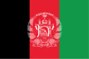
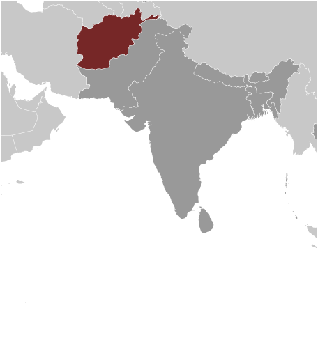
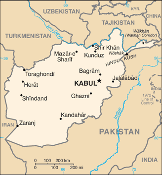

# Afghanistan

## Introduction

**_Background:_**   
Ahmad Shah DURRANI unified the Pashtun tribes and founded Afghanistan in 1747. The country served as a buffer between the British and Russian Empires until it won independence from notional British control in 1919. A brief experiment in democracy ended in a 1973 coup and a 1978 communist counter-coup. The Soviet Union invaded in 1979 to support the tottering Afghan communist regime, touching off a long and destructive war. The USSR withdrew in 1989 under relentless pressure by internationally supported anti-communist mujahedin rebels. A series of subsequent civil wars saw Kabul finally fall in 1996 to the Taliban, a hardline Pakistani-sponsored movement that emerged in 1994 to end the country's civil war and anarchy. Following the 11 September 2001 terrorist attacks, a US, Allied, and anti-Taliban Northern Alliance military action toppled the Taliban for sheltering Osama BIN LADIN. The UN-sponsored Bonn Conference in 2001 established a process for political reconstruction that included the adoption of a new constitution, a presidential election in 2004, and National Assembly elections in 2005. In December 2004, Hamid KARZAI became the first democratically elected president of Afghanistan and the National Assembly was inaugurated the following December. KARZAI was re-elected in August 2009 for a second term. Despite gains toward building a stable central government, a resurgent Taliban and continuing provincial instability - particularly in the south and the east - remain serious challenges for the Afghan Government.

## Geography

**_Location:_**   
Southern Asia, north and west of Pakistan, east of Iran

**_Geographic coordinates:_**   
33 00 N, 65 00 E

**_Map references:_**   
Asia

**_Area:_**   
**total:** 652,230 sq km   
**land:** 652,230 sq km   
**water:** 0 sq km

**_Area - comparative:_**   
almost six time the size of Virginia; slightly smaller than Texas

**_Land boundaries:_**   
**total:** 5,987 km   
**border countries:** China 91 km, Iran 921 km, Pakistan 2,670 km, Tajikistan 1,357 km, Turkmenistan 804 km, Uzbekistan 144 km

**_Coastline:_**   
0 km (landlocked)

**_Maritime claims:_**   
none (landlocked)

**_Climate:_**   
arid to semiarid; cold winters and hot summers

**_Terrain:_**   
mostly rugged mountains; plains in north and southwest

**_Elevation extremes:_**   
**lowest point:** Amu Darya 258 m   
**highest point:** Noshak 7,485 m

**_Natural resources:_**   
natural gas, petroleum, coal, copper, chromite, talc, barites, sulfur, lead, zinc, iron ore, salt, precious and semiprecious stones

**_Land use:_**   
**arable land:** 11.95%   
**permanent crops:** 0.18%   
**other:** 87.87% (2011)

**_Irrigated land:_**   
32,080 sq km (2003)

**_Total renewable water resources:_**   
65.33 cu km (2011)

**_Freshwater withdrawal (domestic/industrial/agricultural):_**   
**total:** 20.28 cu km/yr (1%/1%/98%)   
**per capita:** 823.1 cu m/yr (2005)

**_Natural hazards:_**   
damaging earthquakes occur in Hindu Kush mountains; flooding; droughts

**_Environment - current issues:_**   
limited natural freshwater resources; inadequate supplies of potable water; soil degradation; overgrazing; deforestation (much of the remaining forests are being cut down for fuel and building materials); desertification; air and water pollution

**_Environment - international agreements:_**   
**party to:** Biodiversity, Climate Change, Desertification, Endangered Species, Environmental Modification, Marine Dumping, Ozone Layer Protection   
**signed, but not ratified:** Hazardous Wastes, Law of the Sea, Marine Life Conservation

**_Geography - note:_**   
landlocked; the Hindu Kush mountains that run northeast to southwest divide the northern provinces from the rest of the country; the highest peaks are in the northern Vakhan (Wakhan Corridor)

## People and Society

**_Nationality:_**   
**noun:** Afghan(s)   
**adjective:** Afghan

**_Ethnic groups:_**   
Pashtun 42%, Tajik 27%, Hazara 9%, Uzbek 9%, Aimak 4%, Turkmen 3%, Baloch 2%, other 4%

**_Languages:_**   
Afghan Persian or Dari (official) 50%, Pashto (official) 35%, Turkic languages (primarily Uzbek and Turkmen) 11%, 30 minor languages (primarily Balochi and Pashai) 4%, much bilingualism, but Dari functions as the lingua franca   
**note:** the Turkic languages Uzbek and Turkmen, as well as Balochi, Pashai, Nuristani, and Pamiri are the third official languages in areas where the majority speaks them

**_Religions:_**   
Sunni Muslim 80%, Shia Muslim 19%, other 1%

**_Population:_**   
31,822,848 (July 2014 est.)

**_Age structure:_**   
**0-14 years:** 42% (male 6,793,832/female 6,579,388)   
**15-24 years:** 22.2% (male 3,600,264/female 3,464,781)   
**25-54 years:** 29.4% (male 4,771,323/female 4,586,963)   
**55-64 years:** 3.9% (male 603,197/female 622,539)   
**65 years and over:** 2.5% (male 371,753/female 428,808) (2014 est.)

**_Dependency ratios:_**   
**total dependency ratio:** 93.1 %   
**youth dependency ratio:** 88.4 %   
**elderly dependency ratio:** 4.6 %   
**potential support ratio:** 21.5 (2014 est.)

**_Median age:_**   
**total:** 18.1 years   
**male:** 18.1 years   
**female:** 18.2 years (2014 est.)

**_Population growth rate:_**   
2.29% (2014 est.)

**_Birth rate:_**   
38.84 births/1,000 population (2014 est.)

**_Death rate:_**   
14.12 deaths/1,000 population (2014 est.)

**_Net migration rate:_**   
-1.83 migrant(s)/1,000 population (2014 est.)

**_Urbanization:_**   
**urban population:** 23.5% of total population (2011)   
**rate of urbanization:** 4.41% annual rate of change (2010-15 est.)

**_Major urban areas - population:_**   
KABUL (capital) 3.097 million (2011)

**_Sex ratio:_**   
**at birth:** 1.05 male(s)/female   
**0-14 years:** 1.03 male(s)/female   
**15-24 years:** 1.04 male(s)/female   
**25-54 years:** 1.04 male(s)/female   
**55-64 years:** 1.03 male(s)/female   
**65 years and over:** 0.87 male(s)/female   
**total population:** 1.03 male(s)/female (2014 est.)

**_Mother's mean age at first birth:_**   
20.1   
**note:** median age at first birth among women 25-29 (2010 est.)

**_Maternal mortality rate:_**   
460 deaths/100,000 live births (2010)

**_Infant mortality rate:_**   
**total:** 117.23 deaths/1,000 live births   
**male:** 124.89 deaths/1,000 live births   
**female:** 109.18 deaths/1,000 live births (2014 est.)

**_Life expectancy at birth:_**   
**total population:** 50.49 years   
**male:** 49.17 years   
**female:** 51.88 years (2014 est.)

**_Total fertility rate:_**   
5.43 children born/woman (2014 est.)

**_Contraceptive prevalence rate:_**   
21.8% (2010)

**_Health expenditures:_**   
9.6% of GDP (2011)

**_Physicians density:_**   
0.19 physicians/1,000 population (2010)

**_Hospital bed density:_**   
0.4 beds/1,000 population (2010)

**_Drinking water source:_**   
**improved:** urban: 89.9% of population; rural: 56.1% of population; total: 64.2% of population   
**unimproved:** urban: 10.1% of population; rural: 43.9% of population; total: 35.8% of population (2012 est.)

**_Sanitation facility access:_**   
**improved:** urban: 46.8% of population; rural: 23.4% of population; total: 29% of population   
**unimproved:** urban: 53.2% of population; rural: 76.6% of population; total: 71% of population (2012 est.)

**_HIV/AIDS - adult prevalence rate:_**   
0.1% (2012 est.)

**_HIV/AIDS - people living with HIV/AIDS:_**   
4,300 (2012 est.)

**_HIV/AIDS - deaths:_**   
300 (2012 est.)

**_Major infectious diseases:_**   
**degree of risk:** intermediate   
**food or waterborne diseases:** bacterial diarrhea, hepatitis A, and typhoid fever   
**vectorborne disease:** malaria   
**animal contact disease:** rabies   
**note:** highly pathogenic H5N1 avian influenza has been identified in this country; it poses a negligible risk with extremely rare cases possible among US citizens who have close contact with birds (2013)

**_Obesity - adult prevalence rate:_**   
2.2% (2008)

**_Children under the age of 5 years underweight:_**   
32.9% (2004)

**_Education expenditures:_**   
NA

**_Literacy:_**   
**definition:** age 15 and over can read and write   
**total population:** 28.1%   
**male:** 43.1%   
**female:** 12.6% (2000 est.)

**_School life expectancy (primary to tertiary education):_**   
**total:** 9 years   
**male:** 11 years   
**female:** 7 years (2011)

**_Child labor - children ages 5-14:_**   
**total number:** 3,252,243   
**percentage:** 25 %   
**note:** data on child labor in Afghanistan is uncertain and may be higher than the estimated 25% of children ages 5-14 derived from 2011 survey results; UNICEF estimated that 30% of children ages 5-14 in 2011 were engaged in child labor (2008 est.)

## Government

**_Country name:_**   
**conventional long form:** Islamic Republic of Afghanistan   
**conventional short form:** Afghanistan   
**local long form:** Jamhuri-ye Islami-ye Afghanistan   
**local short form:** Afghanistan   
**former:** Republic of Afghanistan

**_Government type:_**   
Islamic republic

**_Capital:_**   
**name:** Kabul   
**geographic coordinates:** 34 31 N, 69 11 E   
**time difference:** UTC+4.5 (9.5 hours ahead of Washington, DC, during Standard Time)

**_Administrative divisions:_**   
34 provinces (welayat, singular - welayat); Badakhshan, Badghis, Baghlan, Balkh, Bamyan, Daykundi, Farah, Faryab, Ghazni, Ghor, Helmand, Herat, Jowzjan, Kabul, Kandahar, Kapisa, Khost, Kunar, Kunduz, Laghman, Logar, Nangarhar, Nimroz, Nuristan, Paktika, Paktiya, Panjshir, Parwan, Samangan, Sar-e Pul, Takhar, Uruzgan, Wardak, Zabul

**_Independence:_**   
19 August 1919 (from UK control over Afghan foreign affairs)

**_National holiday:_**   
Independence Day, 19 August (1919)

**_Constitution:_**   
several previous; latest drafted 14 December 2003 - 4 January 2004, signed 16 January 2004, ratified 26 January 2004 (2012)

**_Legal system:_**   
mixed legal system of civil, customary, and Islamic law

**_International law organization participation:_**   
has not submitted an ICJ jurisdiction declaration; accepts ICCt jurisdiction

**_Suffrage:_**   
18 years of age; universal

**_Executive branch:_**   
**chief of state:** President of the Islamic Republic of Afghanistan Hamid KARZAI (since 7 December 2004); First Vice President Yunis QANUNI (since March 2014); Second Vice President Abdul Karim KHALILI (since 7 December 2004); note - the president is both the chief of state and head of government   
**head of government:** President of the Islamic Republic of Afghanistan Hamid KARZAI (since 7 December 2004); First Vice President Yunis QANUNI (March 2014); Second Vice President Abdul Karim KHALILI (since 7 December 2004)   
**cabinet:** 25 ministers; note - ministers are appointed by the president and approved by the National Assembly   
**elections:** the president is elected by direct vote for a five-year term (eligible for a second term); if no candidate receives 50% or more of the vote in the first round of voting, the two candidates with the most votes will participate in a second round; first round of last election held on 5 April 2014 (second round held on 14 June 2014)   
**election results:** first round results - Abdullah ABDULLAH 45%, Ashraf GHANI Ahmadzai 31.6%, Zalmai RASOUL 11.4%, other 12%; second round results - expected on 22 July

**_Legislative branch:_**   
the bicameral National Assembly consists of the Meshrano Jirga or House of Elders (102 seats, two-thirds of members elected from provincial councils for four-year terms, and one-third nominated by the president for five-year terms) and the Wolesi Jirga or House of People (no more than 250 seats; members directly elected for five-year terms)   
**note:** the constitution allows the government to convene a constitutional Loya Jirga (Grand Council) on issues of independence, national sovereignty, and territorial integrity; it can amend the provisions of the constitution and prosecute the president; it is made up of members of the National Assembly and chairpersons of the provincial and district councils; no Loya Jirga of this type has ever been held, and district councils have never been elected   
**elections:** last held on 18 September 2010 (next expected in 2015)   
**election results:** results by party - NA; note - ethnicity is the main factor influencing political alliances; approximate percentage of seats by ethnic group - Pashtun 39%, Hazara 24%, Tajik 21%, Uzbek 6%, other 10% (including Aimak, Arab, Baloch, Nuristani, Pahhai, Turkmen, Turkic); women hold 69 seats

**_Judicial branch:_**   
**highest court(s):** Supreme Court or Stera Mahkama (consists of the Supreme Court Chief and 8 justices organized into criminal, public security, civil, and commercial divisions or dewans)   
**judge selection and term of office:** court chief and justices appointed by the president with the approval of the Wolesi Jirga; court chief and justices serve single 10-year terms   
**subordinate courts:** Appeals Courts; Primary Courts; Special Courts for issues including narcotics, security, property, family, and juveniles

**_Political parties and leaders:_**   
note - the Ministry of Justice licensed 84 political parties as of December 2012

**_Political pressure groups and leaders:_**   
**other:** religious groups, tribal leaders, ethnically based groups, Taliban

**_International organization participation:_**   
ADB, CICA, CP, ECO, EITI (candidate country), FAO, G-77, IAEA, IBRD, ICAO, ICC (NGOs), ICRM, IDA, IDB, IFAD, IFC, IFRCS, ILO, IMF, Interpol, IOC, IOM, IPU, ISO (correspondent), ITSO, ITU, MIGA, MINUSMA, NAM, OIC, OPCW, OSCE (partner), SAARC, SACEP, SCO (observer), UN, UNCTAD, UNESCO, UNIDO, UNWTO, UPU, WCO, WFTU (NGOs), WHO, WIPO, WMO, WTO

**_Diplomatic representation in the US:_**   
**chief of mission:** Ambassador Eklil Ahmad HAKIMI (since 16 February 2011)   
**chancery:** 2341 Wyoming Avenue NW, Washington, DC 20008   
**telephone:** [1] (202) 483-6410   
**FAX:** [1] (202) 483-6488   
**consulate(s) general:** Los Angeles, New York

**_Diplomatic representation from the US:_**   
**chief of mission:** Ambassador (vacant); Charge d'Affaires Richard YONEOKA   
**embassy:** The Great Masood Road, Kabul   
**mailing address:** U.S. Embassy Kabul, APO, AE 09806   
**telephone:** [93] 0700 108 001   
**FAX:** [93] 0700 108 564

**_Flag description:_**   
three equal vertical bands of black (hoist side), red, and green, with the national emblem in white centered on the red band and slightly overlapping the other two bands; the center of the emblem features a mosque with pulpit and flags on either side, below the mosque are numerals for the solar year 1298 (1919 in the Gregorian calendar, the year of Afghan independence from the UK); this central image is circled by a border consisting of sheaves of wheat on the left and right, in the upper-center is an Arabic inscription of the Shahada (Muslim creed) below which are rays of the rising sun over the Takbir (Arabic expression meaning "God is great"), and at bottom center is a scroll bearing the name Afghanistan; black signifies the past, red is for the blood shed for independence, and green can represent either hope for the future, agricultural prosperity, or Islam   
**note:** Afghanistan had more changes to its national flag in the 20th century than any other country; the colors black, red, and green appeared on most of them

**_National symbol(s):_**   
lion

**_National anthem:_**   
**name:** "Milli Surood" (National Anthem)   
**lyrics/music:** Abdul Bari JAHANI/Babrak WASA   
**note:** adopted 2006; the 2004 constitution of the post-Taliban government mandated that a new national anthem should be written containing the phrase "Allahu Akbar" (God is Great) and mentioning the names of Afghanistan's ethnic groups

## Economy

**_Economy - overview:_**   
Afghanistan's economy is recovering from decades of conflict. The economy has improved significantly since the fall of the Taliban regime in 2001 largely because of the infusion of international assistance, the recovery of the agricultural sector, and service sector growth. Despite the progress of the past few years, Afghanistan is extremely poor, landlocked, and highly dependent on foreign aid. Much of the population continues to suffer from shortages of housing, clean water, electricity, medical care, and jobs. Criminality, insecurity, weak governance, lack of infrastructure, and the Afghan Government's difficulty in extending rule of law to all parts of the country pose challenges to future economic growth. Afghanistan's living standards are among the lowest in the world. The international community remains committed to Afghanistan's development, pledging over $67 billion at nine donors' conferences between 2003-10. In July 2012, the donors at the Tokyo conference pledged an additional $16 billion in civilian aid through 2015. Despite this help, the Government of Afghanistan will need to overcome a number of challenges, including low revenue collection, anemic job creation, high levels of corruption, weak government capacity, and poor public infrastructure. Afghanistan's growth rate slowed markedly in 2013.

**_GDP (purchasing power parity):_**   
$45.3 billion (2013 est.)   
$34.25 billion (2012 est.)   
$30.45 billion (2011 est.)   
**note:** data are in 2013 US dollars

**_GDP (official exchange rate):_**   
$20.65 billion (2013 est.)

**_GDP - real growth rate:_**   
3.1% (2013 est.)   
12.5% (2012 est.)   
6.1% (2011 est.)

**_GDP - per capita (PPP):_**   
$1,100 (2013 est.)   
$1,100 (2012 est.)   
$1,000 (2011 est.)   
**note:** data are in 2013 US dollars

**_GDP - composition, by end use:_**   
**household consumption:** 96.5%   
**government consumption:** 23.3%   
**investment in fixed capital:** 25.4%   
**investment in inventories:** 0%   
**exports of goods and services:** 18.1%   
**imports of goods and services:** -63.4%; (2011 est.)

**_GDP - composition, by sector of origin:_**   
**agriculture:** 20%   
**industry:** 25.6%   
**services:** 54.4%   
**note:** data exclude opium production (2011 est.)

**_Agriculture - products:_**   
opium, wheat, fruits, nuts; wool, mutton, sheepskins, lambskins

**_Industries:_**   
small-scale production of bricks, textiles, soap, furniture, shoes, fertilizer, apparel, food products, non-alcoholic beverages, mineral water, cement; handwoven carpets; natural gas, coal, copper

**_Industrial production growth rate:_**   
NA%

**_Labor force:_**   
7.512 million (2012 est.)

**_Labor force - by occupation:_**   
**agriculture:** 78.6%   
**industry:** 5.7%   
**services:** 15.7% (FY08/09 est.)

**_Unemployment rate:_**   
35% (2008 est.)   
40% (2005 est.)

**_Population below poverty line:_**   
36% (FY08/09)

**_Household income or consumption by percentage share:_**   
**lowest 10%:** 3.8%   
**highest 10%:** 24% (2008)

**_Budget:_**   
**revenues:** $2.333 billion   
**expenditures:** $4.122 billion (2012 est.)

**_Taxes and other revenues:_**   
11.3% of GDP (2012 est.)

**_Budget surplus (+) or deficit (-):_**   
-8.7% of GDP (2012 est.)

**_Fiscal year:_**   
21 December - 20 December

**_Inflation rate (consumer prices):_**   
6.8% (2012 est.)   
5.7% (2011 est.)

**_Commercial bank prime lending rate:_**   
15% (31 December 2012 est.)   
15.15% (31 December 2011 est.)

**_Stock of narrow money:_**   
$6.121 billion (31 December 2012 est.)   
$5.928 billion (31 December 2011 est.)

**_Stock of broad money:_**   
$6.499 billion (31 December 2012 est.)   
$6.351 billion (31 December 2011 est.)

**_Stock of domestic credit:_**   
$-819.6 million (31 December 2012 est.)   
$-520.2 million (31 December 2011 est.)

**_Market value of publicly traded shares:_**   
$NA

**_Current account balance:_**   
-$743.9 million (2011 est.)   
-$736 million (2010 est.)

**_Exports:_**   
$376 million (2012 est.)   
$388.5 million (2011 est.)   
**note:** not including illicit exports or reexports

**_Exports - commodities:_**   
opium, fruits and nuts, handwoven carpets, wool, cotton, hides and pelts, precious and semi-precious gems

**_Exports - partners:_**   
Pakistan 32.2%, India 27%, Tajikistan 8.5%, US 6.2% (2012)

**_Imports:_**   
$6.39 billion (2012 est.)   
$5.154 billion (2011 est.)

**_Imports - commodities:_**   
machinery and other capital goods, food, textiles, petroleum products

**_Imports - partners:_**   
Pakistan 24.3%, US 18%, Russia 8.7%, India 5.8%, China 5.6%, Germany 4.4% (2012)

**_Reserves of foreign exchange and gold:_**   
$5.983 billion (31 December 2012 est.)   
$5.268 billion (31 December 2011 est.)

**_Debt - external:_**   
$1.28 billion (FY10/11)   
$2.7 billion (FY08/09)

**_Exchange rates:_**   
afghanis (AFA) per US dollar -   
50.92 (2012 est.)   
46.75 (2011 est.)   
46.45 (2010)

## Energy

**_Electricity - production:_**   
986.1 million kWh (2010 est.)

**_Electricity - consumption:_**   
2.489 billion kWh (2010 est.)

**_Electricity - exports:_**   
0 kWh (2012 est.)

**_Electricity - imports:_**   
1.572 billion kWh (2010 est.)

**_Electricity - installed generating capacity:_**   
489,100 kW (2010 est.)

**_Electricity - from fossil fuels:_**   
23.5% of total installed capacity (2010 est.)

**_Electricity - from nuclear fuels:_**   
0% of total installed capacity (2010 est.)

**_Electricity - from hydroelectric plants:_**   
76.5% of total installed capacity (2010 est.)

**_Electricity - from other renewable sources:_**   
0% of total installed capacity (2010 est.)

**_Crude oil - production:_**   
1,950 bbl/day (2012 est.)

**_Crude oil - exports:_**   
0 bbl/day (2010 est.)

**_Crude oil - imports:_**   
0 bbl/day (2010 est.)

**_Crude oil - proved reserves:_**   
NA bbl (1 January 2013 est.)

**_Refined petroleum products - production:_**   
0 bbl/day (2010 est.)

**_Refined petroleum products - consumption:_**   
4,229 bbl/day (2011 est.)

**_Refined petroleum products - exports:_**   
0 bbl/day (2010 est.)

**_Refined petroleum products - imports:_**   
36,250 bbl/day (2010 est.)

**_Natural gas - production:_**   
140 million cu m (2011 est.)

**_Natural gas - consumption:_**   
140 million cu m (2010 est.)

**_Natural gas - exports:_**   
0 cu m (2011 est.)

**_Natural gas - imports:_**   
0 cu m (2011 est.)

**_Natural gas - proved reserves:_**   
49.55 billion cu m (1 January 2013 est.)

**_Carbon dioxide emissions from consumption of energy:_**   
6.589 million Mt (2011 est.)

## Communications

**_Telephones - main lines in use:_**   
13,500 (2012)

**_Telephones - mobile cellular:_**   
18 million (2012)

**_Telephone system:_**   
**general assessment:** limited fixed-line telephone service; an increasing number of Afghans utilize mobile-cellular phone networks   
**domestic:** aided by the presence of multiple providers, mobile-cellular telephone service continues to improve rapidly; the Afghan Ministry of Communications and Information claims that more than 90 percent of the population live in areas with access to mobile-cellular services   
**international:** country code - 93; multiple VSAT's provide international and domestic voice and data connectivity (2012)

**_Broadcast media:_**   
state-owned broadcaster, Radio Television Afghanistan (RTA), operates a series of radio and television stations in Kabul and the provinces; an estimated 150 private radio stations, 50 TV stations, and about a dozen international broadcasters are available (2007)

**_Internet country code:_**   
.af

**_Internet hosts:_**   
223 (2012)

**_Internet users:_**   
1 million (2009)

**_Communications - note:_**   

## Transportation

**_Airports:_**   
52 (2013)

**_Airports - with paved runways:_**   
**total:** 23   
**over 3,047 m:** 4   
**2,438 to 3,047 m:** 4   
**1,524 to 2,437 m:** 11   
**914 to 1,523 m:** 2   
**under 914 m:** 2 (2013)

**_Airports - with unpaved runways:_**   
**total:** 29   
**2,438 to 3,047 m:** 4   
**1,524 to 2,437 m:** 13   
**914 to 1,523 m:** 6   
**under 914 m:** 6 (2013)

**_Heliports:_**   
9 (2013)

**_Pipelines:_**   
gas 466 km (2013)

**_Roadways:_**   
**total:** 42,150 km   
**paved:** 12,350 km   
**unpaved:** 29,800 km (2006)

**_Waterways:_**   
1,200 km; (chiefly Amu Darya, which handles vessels up to 500 DWT) (2011)

**_Ports and terminals:_**   
**ariver port(s):** Kheyrabad, Shir Khan

## Military

**_Military branches:_**   
Afghan Armed Forces: Afghan National Army (ANA, includes Afghan Air Force (AAF)) (2011)

**_Military service age and obligation:_**   
18 is the legal minimum age for voluntary military service; no conscription (2012)

**_Manpower available for military service:_**   
**males age 16-49:** 7,056,339   
**females age 16-49:** 6,653,419 (2010 est.)

**_Manpower fit for military service:_**   
**males age 16-49:** 4,050,222   
**females age 16-49:** 3,797,087 (2010 est.)

**_Manpower reaching militarily significant age annually:_**   
**male:** 392,116   
**female:** 370,295 (2010 est.)

**_Military expenditures:_**   
NA% (2012)   
4.74% of GDP (2011)   
NA% (2010)

## Transnational Issues

**_Disputes - international:_**   
Afghan, Coalition, and Pakistan military meet periodically to clarify the alignment of the boundary on the ground and on maps; Afghan and Iranian commissioners have discussed boundary monument densification and resurvey; Iran protests Afghanistan's restricting flow of dammed Helmand River tributaries during drought; Pakistan has sent troops across and built fences along some remote tribal areas of its treaty-defined Durand Line border with Afghanistan which serve as bases for foreign terrorists and other illegal activities; Russia remains concerned about the smuggling of poppy derivatives from Afghanistan through Central Asian countries

**_Refugees and internally displaced persons:_**   
**refugees (country of origin):** 16,825 (Pakistan) (2013)   
**IDPs:** 667,158 (mostly Pashtuns and Kuchis displaced in the south and west due to drought and instability) (2014)

**_Trafficking in persons:_**   
**current situation:** Afghanistan is a source transit, and destination country for men, women, and children subjected to forced labor and sex trafficking, although domestic trafficking is more prevalent than transnational trafficking; Afghan men are subjected to forced labor and debt bondage in Iran, Pakistan, Greece, Turkey, and the Gulf states; Afghan women and girls are forced into prostitution and domestic servitude in Pakistan, Iran, and India, while women and girls from the Philippines, Pakistan, Iran, Tajikistan, and China are reportedly sexually exploited in Afghanistan; children are increasingly subjected to forced labor in carpet-making factories, domestic servitude, forced begging, and commercial sexual exploitation; some children are sold to settle debts   
**tier rating:** Tier 2 Watch List - Afghanistan does not fully comply with the minimum standards for the elimination of trafficking in persons; anti-trafficking law enforcement efforts have improved, though official complicity in human trafficking remains a problem; the first known convictions were made under the government's 2008 anti-trafficking law; Afghanistan has not developed or employed systematic procedures to identify trafficking victims or refer them to protective services and continues to rely on NGOs to provide the vast majority of victim assistance; the government has not made discernible progress in preventing human trafficking or protecting victims but has adopted an anti-trafficking action plan (2013)

**_Illicit drugs:_**   
world's largest producer of opium; poppy cultivation increased 57 percent, from 115,000 hectares in 2011 to 180,000 hectares in 2012; despite the increase in area under cultivation, the effects of poor weather and crop disease resulted in lower yield so potential opium production remained stable at 4,300 mt in 2012 compared to 4,400 mt in 2011; the Taliban and other antigovernment groups participate in and profit from the opiate trade, which is a key source of revenue for the Taliban inside Afghanistan; widespread corruption and instability impede counterdrug efforts; most of the heroin consumed in Europe and Eurasia is derived from Afghan opium; Afghanistan is also struggling to respond to a burgeoning domestic opiate addiction problem; vulnerable to drug money laundering through informal financial networks; regional source of hashish (2013)

............................................................   
_Page last updated on June 24, 2014_
