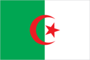
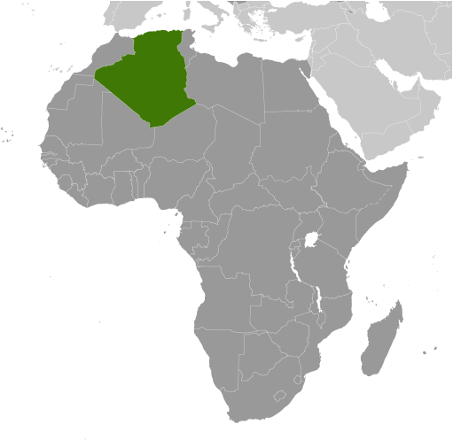
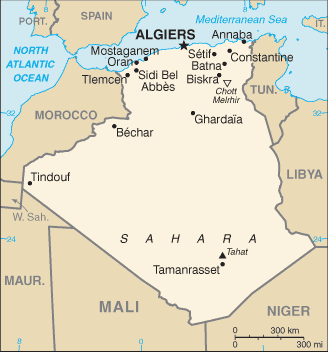

# Algeria

## Introduction

**_Background:_**   
After more than a century of rule by France, Algerians fought through much of the 1950s to achieve independence in 1962. Algeria's primary political party, the National Liberation Front (FLN), was established in 1954 as part of the struggle for independence and has largely dominated politics since. The Government of Algeria in 1988 instituted a multi-party system in response to public unrest, but the surprising first round success of the Islamic Salvation Front (FIS) in the December 1991 balloting led the Algerian army to intervene and postpone the second round of elections to prevent what the secular elite feared would be an extremist-led government from assuming power. The army began a crackdown on the FIS that spurred FIS supporters to begin attacking government targets. Fighting escalated into an insurgency, which saw intense violence from 1992-98, resulting in over 100,000 deaths - many attributed to indiscriminate massacres of villagers by extremists. The government gained the upper hand by the late-1990s, and FIS's armed wing, the Islamic Salvation Army, disbanded in January 2000. Abdelaziz BOUTEFLIKA, with the backing of the military, won the presidency in 1999 in an election widely viewed as fraudulent. He was reelected to a second term in 2004 and overwhelmingly won a third term in 2009, after the government amended the constitution in 2008 to remove presidential term limits. Longstanding problems continue to face BOUTEFLIKA, including large-scale unemployment, a shortage of housing, unreliable electrical and water supplies, government inefficiencies and corruption, and the continuing activities of extremist militants. The Salafist Group for Preaching and Combat (GSPC) in 2006 merged with al-Qa'ida to form al-Qa'ida in the Lands of the Islamic Maghreb, which has launched an ongoing series of kidnappings and bombings targeting the Algerian Government and Western interests. The government in 2011 introduced some political reforms in response to the Arab Spring, including lifting the 19-year-old state of emergency restrictions and increasing women's quotas for elected assemblies. Parliamentary elections in May 2012 and municipal and provincial elections in November 2012 saw continued dominance by the FLN, with Islamist opposition parties performing poorly. Political protest activity in the country remained low in 2013, but small, sometimes violent socioeconomic demonstrations by disparate groups continued to be a common occurrence. Parliament in 2014 is expected to revise the constitution.

## Geography

**_Location:_**   
Northern Africa, bordering the Mediterranean Sea, between Morocco and Tunisia

**_Geographic coordinates:_**   
28 00 N, 3 00 E

**_Map references:_**   
Africa

**_Area:_**   
**total:** 2,381,741 sq km   
**land:** 2,381,741 sq km   
**water:** 0 sq km

**_Area - comparative:_**   
slightly less than 3.5 times the size of Texas

**_Land boundaries:_**   
**total:** 6,734 km   
**border countries:** Libya 989 km, Mali 1,359 km, Mauritania 460 km, Morocco 1,900 km, Niger 951 km, Tunisia 1,034 km, Western Sahara 41 km

**_Coastline:_**   
998 km

**_Maritime claims:_**   
**territorial sea:** 12 nm   
**exclusive fishing zone:** 32-52 nm

**_Climate:_**   
arid to semiarid; mild, wet winters with hot, dry summers along coast; drier with cold winters and hot summers on high plateau; sirocco is a hot, dust/sand-laden wind especially common in summer

**_Terrain:_**   
mostly high plateau and desert; some mountains; narrow, discontinuous coastal plain

**_Elevation extremes:_**   
**lowest point:** Chott Melrhir -40 m   
**highest point:** Tahat 3,003 m

**_Natural resources:_**   
petroleum, natural gas, iron ore, phosphates, uranium, lead, zinc

**_Land use:_**   
**arable land:** 3.15%   
**permanent crops:** 0.38%   
**other:** 96.46% (2011)

**_Irrigated land:_**   
5,694 sq km (2003)

**_Total renewable water resources:_**   
11.67 cu km (2011)

**_Freshwater withdrawal (domestic/industrial/agricultural):_**   
**total:** 5.72 cu km/yr (26%/16%/58%)   
**per capita:** 182 cu m/yr (2005)

**_Natural hazards:_**   
mountainous areas subject to severe earthquakes; mudslides and floods in rainy season

**_Environment - current issues:_**   
soil erosion from overgrazing and other poor farming practices; desertification; dumping of raw sewage, petroleum refining wastes, and other industrial effluents is leading to the pollution of rivers and coastal waters; Mediterranean Sea, in particular, becoming polluted from oil wastes, soil erosion, and fertilizer runoff; inadequate supplies of potable water

**_Environment - international agreements:_**   
**party to:** Biodiversity, Climate Change, Climate Change-Kyoto Protocol, Desertification, Endangered Species, Environmental Modification, Hazardous Wastes, Law of the Sea, Ozone Layer Protection, Ship Pollution, Wetlands   
**signed, but not ratified:** none of the selected agreements

**_Geography - note:_**   
largest country in Africa

## People and Society

**_Nationality:_**   
**noun:** Algerian(s)   
**adjective:** Algerian

**_Ethnic groups:_**   
Arab-Berber 99%, European less than 1%   
**note:** although almost all Algerians are Berber in origin (not Arab), only a minority identify themselves as Berber, about 15% of the total population; these people live mostly in the mountainous region of Kabylie east of Algiers; the Berbers are also Muslim but identify with their Berber rather than Arab cultural heritage; Berbers have long agitated, sometimes violently, for autonomy; the government is unlikely to grant autonomy but has offered to begin sponsoring teaching Berber language in schools

**_Languages:_**   
Arabic (official), French (lingua franca), Berber dialects: Kabylie Berber (Tamazight), Chaouia Berber (Tachawit), Mzab Berber, Tuareg Berber (Tamahaq)

**_Religions:_**   
Muslim (official; predominantly Sunni) 99%, other (includes Christian and Jewish)

**_Population:_**   
38,813,722 (July 2014 est.)

**_Age structure:_**   
**0-14 years:** 28.4% (male 5,641,148/female 5,378,207)   
**15-24 years:** 17.4% (male 3,451,069/female 3,291,166)   
**25-54 years:** 42.8% (male 8,398,770/female 8,209,634)   
**55-64 years:** 6.2% (male 1,230,865/female 1,186,832)   
**65 years and over:** 5.2% (male 931,769/female 1,094,262) (2014 est.)

**_Dependency ratios:_**   
**total dependency ratio:** 48.5 %   
**youth dependency ratio:** 41.6 %   
**elderly dependency ratio:** 6.8 %   
**potential support ratio:** 14.6 (2014 est.)

**_Median age:_**   
**total:** 27.3 years   
**male:** 27 years   
**female:** 27.5 years (2014 est.)

**_Population growth rate:_**   
1.88% (2014 est.)

**_Birth rate:_**   
23.99 births/1,000 population (2014 est.)

**_Death rate:_**   
4.31 deaths/1,000 population (2014 est.)

**_Net migration rate:_**   
-0.93 migrant(s)/1,000 population (2014 est.)

**_Urbanization:_**   
**urban population:** 73% of total population (2011)   
**rate of urbanization:** 2.49% annual rate of change (2010-15 est.)

**_Major urban areas - population:_**   
ALGIERS (capital) 2.916 million; Oran 783,000 (2011)

**_Sex ratio:_**   
**at birth:** 1.05 male(s)/female   
**0-14 years:** 1.05 male(s)/female   
**15-24 years:** 1.05 male(s)/female   
**25-54 years:** 1.02 male(s)/female   
**55-64 years:** 1.03 male(s)/female   
**65 years and over:** 0.84 male(s)/female   
**total population:** 1.03 male(s)/female (2014 est.)

**_Maternal mortality rate:_**   
97 deaths/100,000 live births (2010)

**_Infant mortality rate:_**   
**total:** 21.76 deaths/1,000 live births   
**male:** 23.54 deaths/1,000 live births   
**female:** 19.9 deaths/1,000 live births (2014 est.)

**_Life expectancy at birth:_**   
**total population:** 76.39 years   
**male:** 75.12 years   
**female:** 77.72 years (2014 est.)

**_Total fertility rate:_**   
2.78 children born/woman (2014 est.)

**_Contraceptive prevalence rate:_**   
61.4% (2006)

**_Health expenditures:_**   
3.9% of GDP (2011)

**_Physicians density:_**   
1.21 physicians/1,000 population (2007)

**_Hospital bed density:_**   
1.7 beds/1,000 population (2004)

**_Drinking water source:_**   
**improved:** urban: 85.5% of population; rural: 79.5% of population; total: 83.9% of population   
**unimproved:** urban: 14.5% of population; rural: 20.5% of population; total: 16.1% of population (2012 est.)

**_Sanitation facility access:_**   
**improved:** urban: 97.6% of population; rural: 88.4% of population; total: 95.2% of population   
**unimproved:** urban: 2.4% of population; rural: 11.6% of population; total: 4.8% of population (2012 est.)

**_HIV/AIDS - adult prevalence rate:_**   
0.1%; note - no country specific models provided (2009 est.)

**_HIV/AIDS - people living with HIV/AIDS:_**   
18,000 (2009 est.)

**_HIV/AIDS - deaths:_**   
fewer than 1,000 (2009 est.)

**_Obesity - adult prevalence rate:_**   
16% (2008)

**_Children under the age of 5 years underweight:_**   
3.7% (2005)

**_Education expenditures:_**   
4.3% of GDP (2008)

**_Literacy:_**   
**definition:** age 15 and over can read and write   
**total population:** 72.6%   
**male:** 81.3%   
**female:** 63.9% (2006 est.)

**_School life expectancy (primary to tertiary education):_**   
**total:** 14 years   
**male:** 12 years   
**female:** 14 years (2011)

**_Child labor - children ages 5-14:_**   
**total number:** 304,358   
**percentage:** 5 % (2006 est.)

**_Unemployment, youth ages 15-24:_**   
**total:** 28.4%   
**male:** 19.1%   
**female:** 38.2% (2011)

## Government

**_Country name:_**   
**conventional long form:** People's Democratic Republic of Algeria   
**conventional short form:** Algeria   
**local long form:** Al Jumhuriyah al Jaza'iriyah ad Dimuqratiyah ash Sha'biyah   
**local short form:** Al Jaza'ir

**_Government type:_**   
republic

**_Capital:_**   
**name:** Algiers   
**geographic coordinates:** 36 45 N, 3 03 E   
**time difference:** UTC+1 (6 hours ahead of Washington, DC, during Standard Time)

**_Administrative divisions:_**   
48 provinces (wilayas, singular - wilaya); Adrar, Ain Defla, Ain Temouchent, Alger, Annaba, Batna, Bechar, Bejaia, Biskra, Blida, Bordj Bou Arreridj, Bouira, Boumerdes, Chlef, Constantine, Djelfa, El Bayadh, El Oued, El Tarf, Ghardaia, Guelma, Illizi, Jijel, Khenchela, Laghouat, Mascara, Medea, Mila, Mostaganem, M'Sila, Naama, Oran, Ouargla, Oum el Bouaghi, Relizane, Saida, Setif, Sidi Bel Abbes, Skikda, Souk Ahras, Tamanrasset, Tebessa, Tiaret, Tindouf, Tipaza, Tissemsilt, Tizi Ouzou, Tlemcen

**_Independence:_**   
5 July 1962 (from France)

**_National holiday:_**   
Revolution Day, 1 November (1954)

**_Constitution:_**   
adopted 8 September 1963; amended several times, last in 2008 (2013)

**_Legal system:_**   
mixed legal system of French civil law and Islamic law; judicial review of legislative acts in ad hoc Constitutional Council composed of various public officials including several Supreme Court justices

**_International law organization participation:_**   
has not submitted an ICJ jurisdiction declaration; non-party state to the ICCt

**_Suffrage:_**   
18 years of age; universal

**_Executive branch:_**   
**hief of state:** President Abdelaziz BOUTEFLIKA (since 28 April 1999)   
**head of government:** Prime Minister Abdelmalek SELLAL (since 28 April 2014)   
**cabinet:** Cabinet of Ministers appointed by the president; note - on 5 May 2014, a new cabinet was announced   
**elections:** president elected by popular vote for a five-year term (no term limits); election last held on 17 April 2014 (next to be held in April 2019)   
**election results:** Abdelaziz BOUTEFLIKA reelected president for a fourth term; percent of vote - Abdelaziz BOUTEFLIKA 81.5%, Ali BENFLIS 12.2%, Abdelaziz ELAID 3.4%, other 2.9%; voter turnout - 51.7%

**_Legislative branch:_**   
bicameral Parliament consists of the Council of the Nation (upper house; 144 seats; one-third of the members appointed by the president, two-thirds elected by indirect vote to serve six-year terms; the constitution requires half the Council to be renewed every three years) and the National People's Assembly (lower house; 462 seats; members elected by popular vote to serve five-year terms)   
**elections:** Council of the Nation - last held on 29 December 2012 (next to be held in December 2017); National People's Assembly - last held on 10 May 2012 (next to be held in 2017)   
**election results:** Council of the Nation election of 29 December 2009 - percent of vote by party - NA; seats by party - NA; National People's Assembly election of 10 May 2012 - percent of vote by party - NA; seats by party - FLN 221, RND 70, AAV 47, FFS 21, PT 17, FNA 9, El Adala 7, MPA 6, PFJ 5, FC 4, PNSD 4, other 32, independents 19

**_Judicial branch:_**   
**highest court(s):** Supreme Court or Cour Supreme (consists of 150 judges organized into four divisions: civil and commercial; social security and labor; criminal; and administrative; Constitutional Council (consists of 9 members including the court president); note - Algeria's judicial system does not include sharia courts   
**judge selection and term of office:** Supreme Court judges appointed by the High Council of Magistracy, an administrative body presided over by the president of the republic, and includes the republic vice-president and several members; judge tenure NA; Constitutional Council members - 3 appointed by the president of the republic, 2 each by the two houses of the Parliament, 1 by the Supreme Court, and 1 by the Council of State; Council president and members appointed for single 6-year terms with half of the membership renewed every 3 years   
**subordinate courts:** appellate or wilaya courts; first instance or daira tribunals

**_Political parties and leaders:_**   
Algerian National Front or FNA [Moussa TOUATI]; Algerian Popular Movement or MPA [Amara BENYOUNES]; Algerian Rally [Ali ZAGHDOUD]; Algeria's Hope Rally or TAJ [Amar GHOUL]; Dignity or El Karama [Mohamed BENHAMOU]; Front for Change or FC [Abdelmadjid MENASRA]; Front for Justice and Development or El Adala [Abdallah DJABALLAH]; Future Front or El Mostakbel [Abdelaziz BELAID]; Green Algeria Alliance or AAV (includes Movement for National Reform, Islamic Renaissance Movement, and Movement of the Society of Peace or Hamas); Islamic Renaissance Movement or EnNahda Movement [Mohamed DHOUIBI]; Movement of the Society of Peace or MSP [Abderrazak MOKRI]; National Democratic Rally (Rassemblement National Democratique) or RND [Bensalah ABDELKADER]; National Liberation Front or FLN [Amar SAIDANI]; National Party for Solidarity and Development or PNSD; National Reform Movement or Islah [Djahid YOUNSI] (see Green Algeria Alliance); New Dawn Party or PFJ; New Generation or Jil Jadid [Soufiane DJILALI]; New Light Party [Bedreddine BELBAZ]; Oath of 1954 or Ahd 54 [Ali Fawzi REBAINE]; Party of Justice and Liberty [Mohammed SAID]; Rally for Culture and Democracy or RCD [Mohcine BELABBAS]; Socialist Forces Front or FFS [Mustafa BOUCHACHI]; Workers Party or PT [Louisa HANOUNE]   
**note:** a law banning political parties based on religion was enacted in March 1997

**_Political pressure groups and leaders:_**   
The Algerian Human Rights League or LADDH [Noureddine BENISSAD]; SOS Disparus [Nacera DUTOUR]; Youth Action Rally or RAJ

**_International organization participation:_**   
ABEDA, AfDB, AFESD, AMF, AMU, AU, BIS, CAEU, CD, FAO, G-15, G-24, G-77, IAEA, IBRD, ICAO, ICC (national committees), ICRM, IDA, IDB, IFAD, IFC, IFRCS, IHO, ILO, IMF, IMO, IMSO, Interpol, IOC, IOM, IPU, ISO, ITSO, ITU, ITUC (NGOs), LAS, MIGA, MONUSCO, NAM, OAPEC, OAS (observer), OIC, OPCW, OPEC, OSCE (partner), UN, UNCTAD, UNESCO, UNHCR, UNIDO, UNITAR, UNWTO, UPU, WCO, WHO, WIPO, WMO, WTO (observer)

**_Diplomatic representation in the US:_**   
**chief of mission:** Ambassador Abdallah BAALI (since 5 November 2008)   
**chancery:** 2118 Kalorama Road NW, Washington, DC 20008   
**telephone:** [1] (202) 265-2800   
**FAX:** [1] (202) 986-5906   
**consulate(s) general:** New York

**_Diplomatic representation from the US:_**   
**chief of mission:** Ambassador Henry S. ENSHER (since July 2011)   
**embassy:** 05 Chemin Cheikh Bachir, El-Ibrahimi, El-Biar 16030 Algiers   
**mailing address:** B. P. 408, Alger-Gare, 16030 Algiers   
**telephone:** [213] 770-08-2000   
**FAX:** [213] 770-08-2064

**_Flag description:_**   
two equal vertical bands of green (hoist side) and white; a red, five-pointed star within a red crescent centered over the two-color boundary; the colors represent Islam (green), purity and peace (white), and liberty (red); the crescent and star are also Islamic symbols, but the crescent is more closed than those of other Muslim countries because the Algerians believe the long crescent horns bring happiness

**_National symbol(s):_**   
star and crescent; fennec fox

**_National anthem:_**   
**name:** "Kassaman" (We Pledge)   
**lyrics/music:** Mufdi ZAKARIAH/Mohamed FAWZI   
**note:** adopted 1962; ZAKARIAH wrote "Kassaman" as a poem while imprisoned in Algiers by French colonial forces

## Economy

**_Economy - overview:_**   
Algeria's economy remains dominated by the state, a legacy of the country's socialist postindependence development model. In recent years the Algerian Government has halted the privatization of state-owned industries and imposed restrictions on imports and foreign involvement in its economy. Hydrocarbons have long been the backbone of the economy, accounting for roughly 60% of budget revenues, 30% of GDP, and over 95% of export earnings. Algeria has the 10th-largest reserves of natural gas in the world and is the sixth-largest gas exporter. It ranks 16th in oil reserves. Strong revenues from hydrocarbon exports have brought Algeria relative macroeconomic stability, with foreign currency reserves approaching $200 billion and a large budget stabilization fund available for tapping. In addition, Algeria's external debt is extremely low at about 2% of GDP. However, Algeria has struggled to develop non-hydrocarbon industries because of heavy regulation and an emphasis on state-driven growth. The government's efforts have done little to reduce high youth unemployment rates or to address housing shortages. A wave of economic protests in February and March 2011 prompted the Algerian Government to offer more than $23 billion in public grants and retroactive salary and benefit increases, moves which continue to weigh on public finances. Long-term economic challenges include diversifying the economy away from its reliance on hydrocarbon exports, bolstering the private sector, attracting foreign investment, and providing adequate jobs for younger Algerians.

**_GDP (purchasing power parity):_**   
$284.7 billion (2013 est.)   
$276.2 billion (2012 est.)   
$267.4 billion (2011 est.)   
**note:** data are in 2013 US dollars

**_GDP (official exchange rate):_**   
$215.7 billion (2013 est.)

**_GDP - real growth rate:_**   
3.1% (2013 est.)   
3.3% (2012 est.)   
2.6% (2011 est.)

**_GDP - per capita (PPP):_**   
$7,500 (2013 est.)   
$7,400 (2012 est.)   
$7,300 (2011 est.)   
**note:** data are in 2013 US dollars

**_Gross national saving:_**   
45.5% of GDP (2013 est.)   
44.4% of GDP (2012 est.)   
47.7% of GDP (2011 est.)

**_GDP - composition, by end use:_**   
**household consumption:** 33.7%   
**government consumption:** 20.6%   
**investment in fixed capital:** 32.9%   
**investment in inventories:** 8.2%   
**exports of goods and services:** 33.3%   
**imports of goods and services:** -28.7%; (2013 est.)

**_GDP - composition, by sector of origin:_**   
**agriculture:** 9.4%   
**industry:** 62.6%   
**services:** 28% (2013 est.)

**_Agriculture - products:_**   
wheat, barley, oats, grapes, olives, citrus, fruits; sheep, cattle

**_Industries:_**   
petroleum, natural gas, light industries, mining, electrical, petrochemical, food processing

**_Industrial production growth rate:_**   
2.5% (2013 est.)

**_Labor force:_**   
11.15 million (2013 est.)

**_Labor force - by occupation:_**   
**agriculture:** 14%   
**industry:** 13.4%   
**construction and public works:** 10%   
**trade:** 14.6%   
**government:** 32%   
**other:** 16% (2003 est.)

**_Unemployment rate:_**   
10.3% (2013 est.)   
10.7% (2012 est.)

**_Population below poverty line:_**   
23% (2006 est.)

**_Household income or consumption by percentage share:_**   
**lowest 10%:** 2.8%   
**highest 10%:** 26.8% (1995)

**_Distribution of family income - Gini index:_**   
35.3 (1995)

**_Budget:_**   
**revenues:** $80.55 billion   
**expenditures:** $85.58 billion (2013 est.)

**_Taxes and other revenues:_**   
37.3% of GDP (2013 est.)

**_Budget surplus (+) or deficit (-):_**   
-2.3% of GDP (2013 est.)

**_Public debt:_**   
13.2% of GDP (2013 est.)   
8.3% of GDP (2012 est.)   
**note:** data cover central government debt; the data include debt issued by subnational entities, as well as intra-governmental debt

**_Fiscal year:_**   
calendar year

**_Inflation rate (consumer prices):_**   
3.9% (2013 est.)   
8.9% (2012 est.)

**_Central bank discount rate:_**   
4% (31 December 2010 est.)   
4% (31 December 2009 est.)

**_Commercial bank prime lending rate:_**   
8% (31 December 2013 est.)   
8% (31 December 2012 est.)

**_Stock of narrow money:_**   
$92.91 billion (31 December 2013 est.)   
$98.36 billion (31 December 2012 est.)

**_Stock of broad money:_**   
$140.2 billion (31 December 2013 est.)   
$141 billion (31 December 2012 est.)

**_Stock of domestic credit:_**   
$-4.337 billion (31 December 2013 est.)   
$-4.363 billion (31 December 2012 est.)

**_Market value of publicly traded shares:_**   
$NA

**_Current account balance:_**   
$6.697 billion (2013 est.)   
$12.3 billion (2012 est.)

**_Exports:_**   
$68.25 billion (2013 est.)   
$71.74 billion (2012 est.)

**_Exports - commodities:_**   
petroleum, natural gas, and petroleum products 97%

**_Exports - partners:_**   
Italy 16%, US 15%, Spain 10.9%, France 8.5%, Netherlands 7.3%, Canada 7.1%, UK 5.1%, Brazil 4.7% (2012)

**_Imports:_**   
$55.02 billion (2013 est.)   
$51.57 billion (2012 est.)

**_Imports - commodities:_**   
capital goods, foodstuffs, consumer goods

**_Imports - partners:_**   
France 12.8%, China 11.8%, Italy 10.3%, Spain 8.6%, Germany 5.2% (2012)

**_Reserves of foreign exchange and gold:_**   
$192.5 billion (31 December 2013 est.)   
$191.6 billion (31 December 2012 est.)

**_Debt - external:_**   
$5.278 billion (31 December 2013 est.)   
$5.639 billion (31 December 2012 est.)

**_Stock of direct foreign investment - at home:_**   
$25.02 billion (31 December 2013 est.)   
$23.26 billion (31 December 2012 est.)

**_Stock of direct foreign investment - abroad:_**   
$2.433 billion (31 December 2013 est.)   
$2.133 billion (31 December 2012 est.)

**_Exchange rates:_**   
Algerian dinars (DZD) per US dollar -   
78.77 (2013 est.)   
77.536 (2012 est.)   
74.386 (2010 est.)   
72.65 (2009)   
63.25 (2008)

## Energy

**_Electricity - production:_**   
46.25 billion kWh (2011 est.)

**_Electricity - consumption:_**   
33.68 billion kWh (2010 est.)

**_Electricity - exports:_**   
803 million kWh (2010 est.)

**_Electricity - imports:_**   
736 million kWh (2010 est.)

**_Electricity - installed generating capacity:_**   
11.33 million kW (2010 est.)

**_Electricity - from fossil fuels:_**   
97.5% of total installed capacity (2010 est.)

**_Electricity - from nuclear fuels:_**   
0% of total installed capacity (2010 est.)

**_Electricity - from hydroelectric plants:_**   
2.5% of total installed capacity (2010 est.)

**_Electricity - from other renewable sources:_**   
0% of total installed capacity (2010 est.)

**_Crude oil - production:_**   
1.875 million bbl/day (2012 est.)

**_Crude oil - exports:_**   
1.097 million bbl/day (2010 est.)

**_Crude oil - imports:_**   
6,400 bbl/day (2010 est.)

**_Crude oil - proved reserves:_**   
12.2 billion bbl (1 January 2013 est.)

**_Refined petroleum products - production:_**   
571,400 bbl/day (2010 est.)

**_Refined petroleum products - consumption:_**   
316,400 bbl/day (2011 est.)

**_Refined petroleum products - exports:_**   
471,900 bbl/day (2010 est.)

**_Refined petroleum products - imports:_**   
17,270 bbl/day (2010 est.)

**_Natural gas - production:_**   
82.76 billion cu m (2011 est.)

**_Natural gas - consumption:_**   
28.82 billion cu m (2010 est.)

**_Natural gas - exports:_**   
52.02 billion cu m (2011 est.)

**_Natural gas - imports:_**   
0 cu m (2011 est.)

**_Natural gas - proved reserves:_**   
4.504 trillion cu m (1 January 2013 est.)

**_Carbon dioxide emissions from consumption of energy:_**   
117.2 million Mt (2011 est.)

## Communications

**_Telephones - main lines in use:_**   
3.2 million (2012)

**_Telephones - mobile cellular:_**   
37.692 million (2012)

**_Telephone system:_**   
**general assessment:** privatization of Algeria's telecommunications sector began in 2000; three mobile cellular licenses have been issued and, in 2005, a consortium led by Egypt's Orascom Telecom won a 15-year license to build and operate a fixed-line network in Algeria; the license will allow Orascom to develop high-speed data and other specialized services and contribute to meeting the large unfulfilled demand for basic residential telephony; Internet broadband services began in 2003   
**domestic:** a limited network of fixed lines with a teledensity of less than 10 telephones per 100 persons has been offset by the rapid increase in mobile-cellular subscribership; in 2011, mobile-cellular teledensity was roughly 100 telephones per 100 persons   
**international:** country code - 213; landing point for the SEA-ME-WE-4 fiber-optic submarine cable system that provides links to Europe, the Middle East, and Asia; microwave radio relay to Italy, France, Spain, Morocco, and Tunisia; coaxial cable to Morocco and Tunisia; participant in Medarabtel; satellite earth stations - 51 (Intelsat, Intersputnik, and Arabsat) (2011)

**_Broadcast media:_**   
state-run Radio-Television Algerienne operates the broadcast media and carries programming in Arabic, Berber dialects, and French; use of satellite dishes is widespread, providing easy access to European and Arab satellite stations; state-run radio operates several national networks and roughly 40 regional radio stations (2007)

**_Internet country code:_**   
.dz

**_Internet hosts:_**   
676 (2012)

**_Internet users:_**   
4.7 million (2009)

## Transportation

**_Airports:_**   
157 (2013)

**_Airports - with paved runways:_**   
**total:** 64   
**over 3,047 m:** 12   
**2,438 to 3,047 m:** 29   
**1,524 to 2,437 m:** 17   
**914 to 1,523 m:** 5   
**under 914 m:** 1 (2013)

**_Airports - with unpaved runways:_**   
**total:** 93   
**2,438 to 3,047 m:** 2   
**1,524 to 2,437 m:** 18   
**914 to 1,523 m:** 39   
**under 914 m:** 34 (2013)

**_Heliports:_**   
3 (2013)

**_Pipelines:_**   
condensate 2,600 km; gas 16,415 km; liquid petroleum gas 3,447 km; oil 7,036 km; refined products 144 km (2013)

**_Railways:_**   
**total:** 3,973 km   
**standard gauge:** 2,888 km 1.435-m gauge (283 km electrified)   
**narrow gauge:** 1,085 km 1.055-m gauge (2008)

**_Roadways:_**   
**total:** 113,655 km   
**paved:** 87,605 km (includes 645 km of expressways)   
**unpaved:** 26,050 km (2010)

**_Merchant marine:_**   
**total:** 38   
**by type:** bulk carrier 6, cargo 8, chemical tanker 3, liquefied gas 11, passenger/cargo 3, petroleum tanker 4, roll on/roll off 3   
**foreign-owned:** 15 (UK, 15) (2010)

**_Ports and terminals:_**   
**major seaport(s):** Algiers, Annaba, Arzew, Bejaia, Djendjene, Jijel, Mostaganem, Oran, Skikda   
**LNG terminal(s) (export):** Bethioua, Skikida

## Military

**_Military branches:_**   
People's National Army (Armee Nationale Populaire, ANP), Land Forces (Forces Terrestres, FT), Navy of the Republic of Algeria (Marine de la Republique Algerienne, MRA), Air Force (Al-Quwwat al-Jawwiya al-Jaza'eriya, QJJ), Territorial Air Defense Force (2009)

**_Military service age and obligation:_**   
17 is the legal minimum age for voluntary military service; 19-30 years of age for compulsory service; conscript service obligation is 18 months (6 months basic training, 12 months civil projects) (2012)

**_Manpower available for military service:_**   
**males age 16-49:** 10,273,129   
**females age 16-49:** 10,114,552 (2010 est.)

**_Manpower fit for military service:_**   
**males age 16-49:** 8,622,897   
**females age 16-49:** 8,626,222 (2010 est.)

**_Manpower reaching militarily significant age annually:_**   
**male:** 342,895   
**female:** 330,098 (2010 est.)

**_Military expenditures:_**   
4.48% of GDP (2012)   
4.36% of GDP (2011)   
4.48% of GDP (2010)

## Transnational Issues

**_Disputes - international:_**   
Algeria and many other states reject Moroccan administration of Western Sahara; the Polisario Front, exiled in Algeria, represents the Sahrawi Arab Democratic Republic; Algeria's border with Morocco remains an irritant to bilateral relations, each nation accusing the other of harboring militants and arms smuggling; dormant disputes include Libyan claims of about 32,000 sq km still reflected on its maps of southeastern Algeria and the National Liberation Front's (FLN) assertions of a claim to Chirac Pastures in southeastern Morocco

**_Refugees and internally displaced persons:_**   
**refugees (country of origin):** 90,000 (Western Saharan Sahrawi, mostly living in Algerian-sponsored camps in the southwestern Algerian town of Tindouf); 1,500 (Mali) (2013)   
**IDPs:** undetermined (civil war during 1990s) (2012)

**_Trafficking in persons:_**   
**current situation:** Algeria is a transit and, to a lesser extent, a destination and source country for women, and, to a lesser extent, men subjected to forced labor and sex trafficking; criminal networks, which sometimes extend to sub-Saharan Africa and to Europe, are involved in both human smuggling and trafficking; sub-Saharan adults enter Algeria voluntarily but illegally, often with the aid of smugglers, for onward travel to Europe, but some of the women are forced into prostitution; some Algerian women are also forced into prostitution; some sub-Saharan men, mostly from Mali, are forced into domestic servitude

............................................................   
_Page last updated on June 23, 2014_
