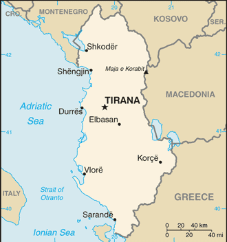

# Albania

## Introduction

**_Background:_**   
Albania declared its independence from the Ottoman Empire in 1912, but was conquered by Italy in 1939, and occupied by Germany in 1943. Communist partisans took over the country in 1944. Albania allied itself first with the USSR (until 1960), and then with China (to 1978). In the early 1990s, Albania ended 46 years of xenophobic communist rule and established a multiparty democracy. The transition has proven challenging as successive governments have tried to deal with high unemployment, widespread corruption, dilapidated infrastructure, powerful organized crime networks, and combative political opponents. Albania has made progress in its democratic development since first holding multiparty elections in 1991, but deficiencies remain. International observers judged elections to be largely free and fair since the restoration of political stability following the collapse of pyramid schemes in 1997; however, each of Albania's post-communist elections have been marred by claims of electoral fraud. The 2009 general elections resulted in a coalition government, the first such in the country's history. In 2013, general elections achieved a peaceful transition of power and a second successive coalition government. Albania joined NATO in April 2009 and is a potential candidate for EU accession. Although Albania's economy continues to grow, it has slowed, and the country is still one of the poorest in Europe. A large informal economy and an inadequate energy and transportation infrastructure remain obstacles.

## Geography

**_Location:_**   
Southeastern Europe, bordering the Adriatic Sea and Ionian Sea, between Greece in the south and Montenegro and Kosovo to the north

**_Geographic coordinates:_**   
41 00 N, 20 00 E

**_Map references:_**   
Europe

**_Area:_**   
**total:** 28,748 sq km   
**land:** 27,398 sq km   
**water:** 1,350 sq km

**_Area - comparative:_**   
slightly smaller than Maryland

**_Land boundaries:_**   
**total:** 691 km   
**border countries:** Greece 212 km, Kosovo 112 km, Macedonia 181 km, Montenegro 186 km

**_Coastline:_**   
362 km

**_Maritime claims:_**   
**territorial sea:** 12 nm   
**continental shelf:** 200 m depth or to the depth of exploitation

**_Climate:_**   
mild temperate; cool, cloudy, wet winters; hot, clear, dry summers; interior is cooler and wetter

**_Terrain:_**   
mostly mountains and hills; small plains along coast

**_Elevation extremes:_**   
**lowest point:** Adriatic Sea 0 m   
**highest point:** Maja e Korabit (Golem Korab) 2,764 m

**_Natural resources:_**   
petroleum, natural gas, coal, bauxite, chromite, copper, iron ore, nickel, salt, timber, hydropower

**_Land use:_**   
**arable land:** 21.63%   
**permanent crops:** 2.57%   
**other:** 75.79% (2011)

**_Irrigated land:_**   
1,884 sq km (2006)

**_Total renewable water resources:_**   
41.7 cu km (2011)

**_Freshwater withdrawal (domestic/industrial/agricultural):_**   
**total:** 1.31 cu km/yr (43%/18%/39%)   
**per capita:** 413.6 cu m/yr (2006)

**_Natural hazards:_**   
destructive earthquakes; tsunamis occur along southwestern coast; floods; drought

**_Environment - current issues:_**   
deforestation; soil erosion; water pollution from industrial and domestic effluents

**_Environment - international agreements:_**   
**party to:** Air Pollution, Biodiversity, Climate Change, Climate Change-Kyoto Protocol, Desertification, Endangered Species, Hazardous Wastes, Law of the Sea, Ozone Layer Protection, Wetlands   
**signed, but not ratified:** none of the selected agreements

**_Geography - note:_**   
strategic location along Strait of Otranto (links Adriatic Sea to Ionian Sea and Mediterranean Sea)

## People and Society

**_Nationality:_**   
**noun:** Albanian(s)   
**adjective:** Albanian

**_Ethnic groups:_**   
Albanian 82.6%, Greek 0.9%, other 1% (including Vlach, Roma (Gypsy), Macedonian, Montenegrin, and Egyptian), unspecified 15.5% (2011 est.)

**_Languages:_**   
Albanian 98.8% (official - derived from Tosk dialect), Greek 0.5%, other 0.6% (including Macedonian, Roma, Vlach, Turkish, Italian, and Serbo-Croatian), unspecified 0.1% (2011 est.)

**_Religions:_**   
Muslim 56.7%, Roman Catholic 10%, Orthodox 6.8%, atheist 2.5%, Bektashi (a Sufi order) 2.1%, other 5.7%, unspecified 16.2%   
**note:** all mosques and churches were closed in 1967 and religious observances prohibited; in November 1990, Albania began allowing private religious practice (2011 est.)

**_Population:_**   
3,020,209 (July 2014 est.)

**_Age structure:_**   
**0-14 years:** 19.3% (male 307,275/female 274,634)   
**15-24 years:** 19.2% (male 297,851/female 282,498)   
**25-54 years:** 40% (male 574,820/female 633,729)   
**55-64 years:** 10.5% (male 157,014/female 158,602)   
**65 years and over:** 11.1% (male 157,143/female 176,643) (2014 est.)

**_Dependency ratios:_**   
**total dependency ratio:** 44.9 %   
**youth dependency ratio:** 29 %   
**elderly dependency ratio:** 15.9 %   
**potential support ratio:** 6.3 (2014 est.)

**_Median age:_**   
**total:** 31.6 years   
**male:** 30.3 years   
**female:** 32.9 years (2014 est.)

**_Population growth rate:_**   
0.3% (2014 est.)

**_Birth rate:_**   
12.73 births/1,000 population (2014 est.)

**_Death rate:_**   
6.47 deaths/1,000 population (2014 est.)

**_Net migration rate:_**   
-3.31 migrant(s)/1,000 population (2014 est.)

**_Urbanization:_**   
**urban population:** 53.4% of total population (2011)   
**rate of urbanization:** 2.27% annual rate of change (2010-15 est.)

**_Major urban areas - population:_**   
TIRANA (capital) 419,000 (2011)

**_Sex ratio:_**   
**at birth:** 1.11 male(s)/female   
**0-14 years:** 1.12 male(s)/female   
**15-24 years:** 1.05 male(s)/female   
**25-54 years:** 0.91 male(s)/female   
**55-64 years:** 0.98 male(s)/female   
**65 years and over:** 0.89 male(s)/female   
**total population:** 0.98 male(s)/female (2014 est.)

**_Mother's mean age at first birth:_**   
23.4 (2010 est.)

**_Maternal mortality rate:_**   
27 deaths/100,000 live births (2010)

**_Infant mortality rate:_**   
**total:** 13.19 deaths/1,000 live births   
**male:** 14.68 deaths/1,000 live births   
**female:** 11.54 deaths/1,000 live births (2014 est.)

**_Life expectancy at birth:_**   
**total population:** 77.96 years   
**male:** 75.33 years   
**female:** 80.86 years (2014 est.)

**_Total fertility rate:_**   
1.5 children born/woman (2014 est.)

**_Contraceptive prevalence rate:_**   
69.3% (2008/09)

**_Health expenditures:_**   
6.3% of GDP (2011)

**_Physicians density:_**   
1.11 physicians/1,000 population (2011)

**_Hospital bed density:_**   
2.4 beds/1,000 population (2011)

**_Drinking water source:_**   
**improved:** urban: 97.3% of population; rural: 93.8% of population; total: 95.7% of population   
**unimproved:** urban: 2.7% of population; rural: 6.2% of population; total: 4.3% of population (2012 est.)

**_Sanitation facility access:_**   
**improved:** urban: 95.3% of population; rural: 86.3% of population; total: 91.2% of population   
**unimproved:** urban: 4.7% of population; rural: 13.7% of population; total: 8.8% of population (2012 est.)

**_HIV/AIDS - adult prevalence rate:_**   
NA

**_HIV/AIDS - people living with HIV/AIDS:_**   
NA

**_HIV/AIDS - deaths:_**   
NA

**_Obesity - adult prevalence rate:_**   
21.3% (2008)

**_Children under the age of 5 years underweight:_**   
6.3% (2009)

**_Education expenditures:_**   
3.3% of GDP (2007)

**_Literacy:_**   
**definition:** age 9 and over can read and write   
**total population:** 96.8%   
**male:** 98%   
**female:** 95.7% (2011 est.)

**_School life expectancy (primary to tertiary education):_**   
**total:** 10 years   
**male:** 10 years   
**female:** 10 years (2001)

**_Child labor - children ages 5-14:_**   
**total number:** 72,818   
**percentage:** 12 % (2005 est.)

**_Unemployment, youth ages 15-24:_**   
**total:** 22.5%   
**male:** 23.8%   
**female:** 20.7% (2011)

## Government

**_Country name:_**   
**conventional long form:** Republic of Albania   
**conventional short form:** Albania   
**local long form:** Republika e Shqiperise   
**local short form:** Shqiperia   
**former:** People's Socialist Republic of Albania

**_Government type:_**   
parliamentary democracy

**_Capital:_**   
**name:** Tirana (Tirane)   
**geographic coordinates:** 41 19 N, 19 49 E   
**time difference:** UTC+1 (6 hours ahead of Washington, DC, during Standard Time)   
**daylight saving time:** +1hr, begins last Sunday in March; ends last Sunday in October

**_Administrative divisions:_**   
12 counties (qarqe, singular - qark); Berat, Diber, Durres, Elbasan, Fier, Gjirokaster, Korce, Kukes, Lezhe, Shkoder, Tirane, Vlore

**_Independence:_**   
28 November 1912 (from the Ottoman Empire)

**_National holiday:_**   
Independence Day, 28 November (1912) also known as Flag Day

**_Constitution:_**   
several previous; latest approved by parliament 21 October 1998, adopted by popular referendum 22 November 1998, promulgated 28 November 1998; amended 2007, 2008, 2012 (2014)

**_Legal system:_**   
civil law system except in the northern rural areas where customary law known as the "Code of Leke" prevails

**_International law organization participation:_**   
has not submitted an ICJ jurisdiction declaration; accepts ICCt jurisdiction

**_Suffrage:_**   
18 years of age; universal

**_Executive branch:_**   
**chief of state:** President of the Republic Bujar NISHANI (since 24 July 2012)   
**head of government:** Prime Minister Edi Rama (since 10 September 2013)   
**cabinet:** Council of Ministers proposed by the prime minister, nominated by the president, and approved by parliament   
**elections:** president is elected by the Assembly for a five-year term and is eligible for a second term (a candidate needs a three-fifths majority of the Assembly's 140 votes (84 votes) in one of the first three rounds of voting or a simple majority in round four or five to become president; up to five rounds of voting are held, if necessary); four election rounds held between 30 May and 11 June 2012 (next election to be held in 2017); prime minister appointed by the president on the proposal of the party or coalition of parties that has the majority of seats in the Assembly   
**election results:** Bujar NISHANI elected president on fourth round of voting; Assembly vote (for first three rounds three-fifths majority, 84 votes, required; fourth round, a simple majority of votes is required): Bujar NISHANI 73 votes

**_Legislative branch:_**   
unicameral Assembly or Kuvendi (140 deputies elected through a regional proportional system from multi-name lists of parties or party coalitions according to their respective order; elected for a four-year term)   
**elections:** last held on 23 June 2013 (next to be held in 2017)   
**election results:** percent of vote by party- PS 41.36%, PD 30.63%, LSI 10.46%, PR 3.02%, PDIU 2.61%, other 11.92%; seats by party- PS 65, PD 50, LSI 16, PDIU 4, PR 3, other 2   
**note:** seats by parliamentary group as of March 2014 - ASHE 85, APMI 55

**_Judicial branch:_**   
**highest court(s):** Constitutional Court (consists of 9 judges, including a chairman); Court of Cassation (consists of 14 judges, including the chief justice)   
**judge selection and term of office:** Constitutional Court judges appointed by the president with the consent of the Assembly to serve single 9-year terms; chairman elected by the People's Assembly for single 3-year term; Court of Cassation judges, including the chairman, appointed by the president with the consent of the Assembly to serve single, 9-year terms)   
**subordinate courts:** Courts of Appeal; Courts of First Instance

**_Political parties and leaders:_**   
**Alliance for Employment, Welfare, and Integration or APMI (coalition of 25 centrist and center-right parties) [Sali BERISHA]:** Christian Democratic Party or PDK [Nard NDOKA]; Democratic Party or PD [Lulzim BASHA]; Movement for National Development of LZHK [Dashamir SHEHI]; Party for Justice, Integration and Unity or PDIU [Shpetim IDRIZI]; Republican Party or PR [Fatmir MEDIU];   
**Alliance for a European Albania or ASHE (coalition of 37 opposition parties from far left to right wing) [Edi RAMA]:** Christian Democratic Party of PKD [Mark FRROKU]; Socialist Movement for Integration or LSI [Ilir META]; Socialist Party or PS [Edi RAMA]; Union for Human Rights Party or PBDNJ [Vangjel DULE];   
**other parties:** New Democratic Spirit or FRD [Bamir TOPI]; Red and Black Alliance [Kreshnik SPAHIU]   
**note:** only the major parties of each coalition are listed

**_Political pressure groups and leaders:_**   
Confederation of Trade Unions of Albania or KSSH [Kol NIKOLLAJ]   
Omonia [Vasil BOLLANO]   
Union of Independent Trade Unions of Albania or BSPSH [Gezim KALAJA]

**_International organization participation:_**   
BSEC, CD, CE, CEI, EAPC, EBRD, EITI (candidate country), FAO, IAEA, IBRD, ICAO, ICC (national committees), ICRM, IDA, IDB, IFAD, IFC, IFRCS, ILO, IMF, IMO, Interpol, IOC, IOM, IPU, ISO (correspondent), ITU, ITUC (NGOs), MIGA, NATO, OAS (observer), OIC, OIF, OPCW, OSCE, PCA, SELEC, UN, UNCTAD, UNESCO, UNIDO, UNWTO, UPU, WCO, WFTU (NGOs), WHO, WIPO, WMO, WTO

**_Diplomatic representation in the US:_**   
**chief of mission:** Ambassador Gilbert GALANXHI (since 5 January 2011)   
**chancery:** 1312 18th Street NW, 4th Floor, Washington, DC 20036   
**telephone:** [1] (202) 223-4942   
**FAX:** [1] (202) 628-7342   
**consulate(s) general:** New York

**_Diplomatic representation from the US:_**   
**chief of mission:** Ambassador Alexander ARVIZU (since 10 November 2010)   
**embassy:** Rruga e Elbasanit, 103, Tirana   
**mailing address:** US Department of State, 9510 Tirana Place, Dulles, VA 20189-9510   
**telephone:** [355] (4) 2247-285   
**FAX:** [355] (4) 2232-222

**_Flag description:_**   
red with a black two-headed eagle in the center; the design is claimed to be that of 15th-century hero George Kastrioti SKANDERBEG, who led a successful uprising against the Turks that resulted in a short-lived independence for some Albanian regions (1443-78); an unsubstantiated explanation for the eagle symbol is the tradition that Albanians see themselves as descendants of the eagle; they refer to themselves as "Shqipetare," which translates as "sons of the eagle"

**_National symbol(s):_**   
double-headed eagle

**_National anthem:_**   
**name:** "Hymni i Flamurit" (Hymn to the Flag)   
**lyrics/music:** Aleksander Stavre DRENOVA/Ciprian PORUMBESCU   
**note:** adopted 1912

## Economy

**_Economy - overview:_**   
Albania, a formerly closed, centrally-planned state, is making the difficult transition to a more modern open-market economy. Albania managed to weather the first waves of the global financial crisis but, more recently, its negative effects have put some pressure on the Albanian economy. While the government is focused on establishing a favorable business climate through the simplification of licensing requirements and tax codes, it entered into a new arrangement with the IMF for additional financial and technical support. Remittances, a significant catalyst for economic growth declined from 12-15% of GDP before the 2008 financial crisis to 7% of GDP in 2012, mostly from Albanians residing in Greece and Italy. The agricultural sector, which accounts for almost half of employment but only about one-fifth of GDP, is limited primarily to small family operations and subsistence farming, because of a lack of modern equipment, unclear property rights, and the prevalence of small, inefficient plots of land. Complex tax codes and licensing requirements, a weak judicial system, poor enforcement of contracts and property issues, and antiquated infrastructure contribute to Albania's poor business environment and makes attracting foreign investment more difficult. Inward FDI is among the lowest in the region, but the government has embarked on an ambitious program to improve the business climate through fiscal and legislative reforms. Albania’s energy supply has improved in recent years mostly due to upgraded transmission capacities that Albania has developed with its neighboring countries. However, technical and non-technical losses - including energy theft and non-payment - continue to be a threat to the financial viability of the entire system. Also, with help from international donors, the government is taking steps to improve the poor national road and rail network, a long-standing barrier to sustained economic growth. The country will continue to face challenges from increasing public debt, having exceeded its former statutory limit of 60% of GDP in 2013. Strong trade, remittance, and banking sector ties with Greece and Italy make Albania vulnerable to spillover effects of debt crises and weak growth in the euro zone.

**_GDP (purchasing power parity):_**   
$28.34 billion (2013 est.)   
$28.14 billion (2012 est.)   
$27.78 billion (2011 est.)   
**note:** data are in 2013 US dollars; Albania has an informal, and unreported, sector that may be as large as 50% of official GDP

**_GDP (official exchange rate):_**   
$12.8 billion (2013 est.)

**_GDP - real growth rate:_**   
0.7% (2013 est.)   
1.3% (2012 est.)   
3.1% (2011 est.)

**_GDP - per capita (PPP):_**   
$10,700 (2013 est.)   
$10,400 (2012 est.)   
$9,900 (2011 est.)   
**note:** data are in 2013 US dollars

**_Gross national saving:_**   
14.1% of GDP (2013 est.)   
13.6% of GDP (2012 est.)   
13.6% of GDP (2011 est.)

**_GDP - composition, by end use:_**   
**household consumption:** 87.6%   
**government consumption:** 8.4%   
**investment in fixed capital:** 25%   
**investment in inventories:** -2.6%   
**exports of goods and services:** 36%   
**imports of goods and services:** -54.4%; (2013 est.)

**_GDP - composition, by sector of origin:_**   
**agriculture:** 19.5%   
**industry:** 12%   
**services:** 68.5%; (2011 est.)

**_Agriculture - products:_**   
wheat, corn, potatoes, vegetables, fruits, sugar beets, grapes; meat, dairy products; sheep

**_Industries:_**   
food and tobacco products; textiles and clothing; lumber, oil, cement, chemicals, mining, basic metals, hydropower

**_Industrial production growth rate:_**   
3.1% (2013 est.)

**_Labor force:_**   
1.098 million (2013 est.)

**_Labor force - by occupation:_**   
**agriculture:** 54.6%   
**industry:** 12.8%   
**services:** 32.6%; (December 2012 est)

**_Unemployment rate:_**   
16.9% (2013 est.)   
14.4% (2012 est.)   
**note:** these are official rates that may not include those working at near-subsistence farming

**_Population below poverty line:_**   
14.3% (2012 est.)

**_Household income or consumption by percentage share:_**   
**lowest 10%:** 3.5%   
**highest 10%:** 29% (2008)

**_Distribution of family income - Gini index:_**   
34.5 (2008)   
26.7 (2005)

**_Budget:_**   
**revenues:** $3.074 billion   
**expenditures:** $3.858 billion (2013 est.)

**_Taxes and other revenues:_**   
24% of GDP (2013 est.)

**_Budget surplus (+) or deficit (-):_**   
-6.1% of GDP (2013 est.)

**_Public debt:_**   
70.5% of GDP (2013 est.)   
62.5% of GDP (2012 est.)

**_Fiscal year:_**   
calendar year

**_Inflation rate (consumer prices):_**   
1.7% (2013 est.)   
2.1% (2012 est.)

**_Central bank discount rate:_**   
$NA (31 December 2013 est.)   
4% (31 December 2012 est.)

**_Commercial bank prime lending rate:_**   
9.52% (31 December 2013 est.)   
10.28% (31 December 2012 est.)

**_Stock of narrow money:_**   
$2.791 billion (31 December 2013 est.)   
$2.652 billion (31 December 2012 est.)

**_Stock of broad money:_**   
$6.539 billion (31 December 2013 est.)   
$6.316 billion (31 December 2012 est.)

**_Stock of domestic credit:_**   
$5.17 billion (31 December 2013 est.)   
$5.233 billion (31 December 2012 est.)

**_Market value of publicly traded shares:_**   
$NA

**_Current account balance:_**   
-$1.28 billion (2013 est.)   
-$1.316 billion (2012 est.)

**_Exports:_**   
$2.323 billion (2013 est.)   
$2.1 billion (2012 est.)

**_Exports - commodities:_**   
textiles and footwear; asphalt, metals and metallic ores, crude oil; vegetables, fruits, tobacco

**_Exports - partners:_**   
Italy 51.1%, Spain 9.2%, Turkey 6.3%, Greece 4.4% (2012)

**_Imports:_**   
$4.835 billion (2013 est.)   
$4.985 billion (2012 est.)

**_Imports - commodities:_**   
machinery and equipment, foodstuffs, textiles, chemicals

**_Imports - partners:_**   
Italy 31.9%, Greece 9.5%, China 6.4%, Germany 6%, Turkey 5.7% (2012)

**_Reserves of foreign exchange and gold:_**   
$2.827 billion (31 December 2013 est.)   
$2.784 billion (31 December 2012 est.)

**_Debt - external:_**   
$3.213 billion (31 December 2013 est.)   
$2.957 billion (31 December 2012 est.)

**_Stock of direct foreign investment - at home:_**   
$4.226 billion (31 December 2011)   
$3.534 billion (31 December 2010)

**_Exchange rates:_**   
leke (ALL) per US dollar -   
109.2 (2013 est.)   
108.19 (2012 est.)   
103.94 (2010 est.)   
94.98 (2009)   
79.546 (2008)

## Energy

**_Electricity - production:_**   
6.987 billion kWh (2013 est.)

**_Electricity - consumption:_**   
4.551 billion kWh (2013 est.)

**_Electricity - exports:_**   
1.424 billion kWh (2013 est.)

**_Electricity - imports:_**   
2.322 billion kWh (2013 est.)

**_Electricity - installed generating capacity:_**   
1.726 million kW (2012 est.)

**_Electricity - from fossil fuels:_**   
5.6% of total installed capacity (2012 est.)

**_Electricity - from nuclear fuels:_**   
0% of total installed capacity (2012 est.)

**_Electricity - from hydroelectric plants:_**   
94.4% of total installed capacity (2012 est.)

**_Electricity - from other renewable sources:_**   
0% of total installed capacity (2012 est.)

**_Crude oil - production:_**   
23,930 bbl/day (2013 est.)

**_Crude oil - exports:_**   
23,320 bbl/day (2013 est.)

**_Crude oil - imports:_**   
0 bbl/day (2013 est.)

**_Crude oil - proved reserves:_**   
172.4 million bbl (1 January 2013 est.)

**_Refined petroleum products - production:_**   
3,121 bbl/day (2010 est.)

**_Refined petroleum products - consumption:_**   
38,390 bbl/day (2011 est.)

**_Refined petroleum products - exports:_**   
68 bbl/day (2010 est.)

**_Refined petroleum products - imports:_**   
22,810 bbl/day (2010 est.)

**_Natural gas - production:_**   
0 cu m (2012 est.)

**_Natural gas - consumption:_**   
0 cu m (2012 est.)

**_Natural gas - exports:_**   
0 cu m (2012 est.)

**_Natural gas - imports:_**   
0 cu m (2012 est.)

**_Natural gas - proved reserves:_**   
849.5 million cu m (1 January 2013 est.)

**_Carbon dioxide emissions from consumption of energy:_**   
4.183 million Mt (2011 est.)

## Communications

**_Telephones - main lines in use:_**   
312,000 (2012)

**_Telephones - mobile cellular:_**   
3.5 million (2012)

**_Telephone system:_**   
**general assessment:** despite new investment in fixed lines, teledensity remains low with roughly 10 fixed lines per 100 people; mobile-cellular telephone use is widespread and generally effective   
**domestic:** offsetting the shortage of fixed line capacity, mobile-cellular phone service has been available since 1996; by 2011 multiple companies were providing mobile services and mobile teledensity had reached 100 per 100 persons; Internet broadband services initiated in 2005 but growth has been slow; Internet cafes are popular in Tirana and have started to spread outside the capital   
**international:** country code - 355; submarine cable provides connectivity to Italy, Croatia, and Greece; the Trans-Balkan Line, a combination submarine cable and land fiber-optic system, provides additional connectivity to Bulgaria, Macedonia, and Turkey; international traffic carried by fiber-optic cable and, when necessary, by microwave radio relay from the Tirana exchange to Italy and Greece (2011)

**_Broadcast media:_**   
3 public TV networks, one of which transmits by satellite to Albanian-language communities in neighboring countries; more than 60 private TV stations; many viewers can pick up Italian and Greek TV broadcasts via terrestrial reception; cable TV service is available; 2 public radio networks and roughly 25 private radio stations; several international broadcasters are available (2010)

**_Internet country code:_**   
.al

**_Internet hosts:_**   
15,528 (2012)

**_Internet users:_**   
1.3 million (2009)

## Transportation

**_Airports:_**   
4 (2013)

**_Airports - with paved runways:_**   
**total:** 4   
**2,438 to 3,047 m:** 3   
**1,524 to 2,437 m:** 1 (2013)

**_Airports - with unpaved runways:_**   
**total:** 1   
**914 to 1,523 m:** 1 (2012)

**_Heliports:_**   
1 (2013)

**_Pipelines:_**   
gas 331 km; oil 249 km (2013)

**_Railways:_**   
**total:** 339 km   
**standard gauge:** 339 km 1.435-m gauge (2009)

**_Roadways:_**   
**total:** 18,000 km   
**paved:** 7,020 km   
**unpaved:** 10,980 km (2002)

**_Waterways:_**   
41 km (on the Bojana River) (2011)

**_Merchant marine:_**   
**total:** 17   
**by type:** cargo 16, roll on/roll off 1   
**foreign-owned:** 1 (Turkey 1)   
**registered in other countries:** 5 (Antigua and Barbuda 1, Panama 4) (2010)

**_Ports and terminals:_**   
**major seaport(s):** Durres, Sarande, Shengjin, Vlore

## Military

**_Military branches:_**   
Land Forces Command, Navy Force Command, Air Forces Command (2013)

**_Military service age and obligation:_**   
19 is the legal minimum age for voluntary military service; 18 is the legal minimum age in case of general/partial compulsory mobilization (2012)

**_Manpower available for military service:_**   
**males age 16-49:** 731,111   
**females age 16-49:** 780,216 (2010 est.)

**_Manpower fit for military service:_**   
**males age 16-49:** 622,379   
**females age 16-49:** 660,715 (2010 est.)

**_Manpower reaching militarily significant age annually:_**   
**male:** 31,986   
**female:** 29,533 (2010 est.)

**_Military expenditures:_**   
1.47% of GDP (2012)   
1.52% of GDP (2011)   
1.47% of GDP (2010)

## Transnational Issues

**_Disputes - international:_**   
none

**_Refugees and internally displaced persons:_**   
**stateless persons:** 7,443 (2012)

**_Trafficking in persons:_**   
**current situation:** Albania is a source country for men, women, and children subjected to sex trafficking and forced labor; Albanian victims of sexual exploitation are trafficked within Albania and in Greece, Italy, Macedonia, Kosovo, Belgium, the Netherlands, Germany, Switzerland, Ireland, and the UK; some Albanian women become sex trafficking victims after accepting offers of legitimate jobs; Albanian children are forced to beg or perform other forms of forced labor; Filipino victims of labor trafficking were identified in Albania during 2012   
**tier rating:** Tier 2 Watch List - Albania does not fully comply with the minimum standards for the elimination of trafficking; however, it is making significant efforts to do so; the government decreased its trafficking investigations, prosecutions, and convictions over the last year and, because of inconsistent implementation of operating procedures, continues to punish victims for unlawful acts that are a direct result of being subjected to sex trafficking; the high turnover rate of law enforcement personnel prevents progress at the local level in identifying and protecting trafficking victims; removal of the national anti-trafficking coordinator hinders efforts to implement the 2011 national action plan against trafficking; the government provides limited funding to NGO shelters (2013)

**_Illicit drugs:_**   
increasingly active transshipment point for Southwest Asian opiates, hashish, and cannabis transiting the Balkan route and - to a lesser extent - cocaine from South America destined for Western Europe; limited opium and expanding cannabis production; ethnic Albanian narcotrafficking organizations active and expanding in Europe; vulnerable to money laundering associated with regional trafficking in narcotics, arms, contraband, and illegal aliens

............................................................   
_Page last updated on June 23, 2014_
