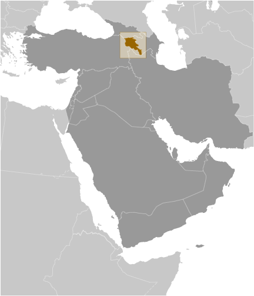
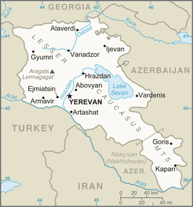

# Armenia

## Introduction

**_Background:_**   
Armenia prides itself on being the first nation to formally adopt Christianity (early 4th century). Despite periods of autonomy, over the centuries Armenia came under the sway of various empires including the Roman, Byzantine, Arab, Persian, and Ottoman. During World War I in the western portion of Armenia, Ottoman Turkey instituted a policy of forced resettlement coupled with other harsh practices that resulted in at least 1 million Armenian deaths. The eastern area of Armenia was ceded by the Ottomans to Russia in 1828; this portion declared its independence in 1918, but was conquered by the Soviet Red Army in 1920. Armenian leaders remain preoccupied by the long conflict with Azerbaijan over Nagorno-Karabakh, a primarily Armenian-populated region, assigned to Soviet Azerbaijan in the 1920s by Moscow. Armenia and Azerbaijan began fighting over the area in 1988; the struggle escalated after both countries attained independence from the Soviet Union in 1991. By May 1994, when a cease-fire took hold, ethnic Armenian forces held not only Nagorno-Karabakh but also a significant portion of Azerbaijan proper. The economies of both sides have been hurt by their inability to make substantial progress toward a peaceful resolution. Turkey closed the common border with Armenia in 1993 in support of Azerbaijan in its conflict with Armenia over control of Nagorno-Karabakh and surrounding areas, further hampering Armenian economic growth. In 2009, senior Armenian leaders began pursuing rapprochement with Turkey, aiming to secure an opening of the border, but Turkey has not yet ratified the Protocols normalizing relations between the two countries. In September 2013, President SARGSIAN announced Armenia would join Russia, Belarus, and Kazakhstan as a member of the Eurasian Economic Union.

## Geography

**_Location:_**   
Southwestern Asia, between Turkey (to the west) and Azerbaijan

**_Geographic coordinates:_**   
40 00 N, 45 00 E

**_Map references:_**   
Middle East

**_Area:_**   
**total:** 29,743 sq km   
**land:** 28,203 sq km   
**water:** 1,540 sq km

**_Area - comparative:_**   
slightly smaller than Maryland

**_Land boundaries:_**   
**total:** 1,570 km   
**border countries:** Azerbaijan 996 km, Georgia 219 km, Iran 44 km, Turkey 311 km

**_Coastline:_**   
0 km (landlocked)

**_Maritime claims:_**   
none (landlocked)

**_Climate:_**   
highland continental, hot summers, cold winters

**_Terrain:_**   
Armenian Highland with mountains; little forest land; fast flowing rivers; good soil in Aras River valley

**_Elevation extremes:_**   
**lowest point:** Debed River 400 m   
**highest point:** Aragats Lerrnagagat' 4,090 m

**_Natural resources:_**   
small deposits of gold, copper, molybdenum, zinc, bauxite

**_Land use:_**   
**arable land:** 14.47%   
**permanent crops:** 1.8%   
**other:** 83.74% (2011)

**_Irrigated land:_**   
2,735 sq km (2006)

**_Total renewable water resources:_**   
7.77 cu km (2011)

**_Freshwater withdrawal (domestic/industrial/agricultural):_**   
**total:** 2.86 cu km/yr (40%/6%/54%)   
**per capita:** 929.7 cu m/yr (2010)

**_Natural hazards:_**   
occasionally severe earthquakes; droughts

**_Environment - current issues:_**   
soil pollution from toxic chemicals such as DDT; the energy crisis of the 1990s led to deforestation when citizens scavenged for firewood; pollution of Hrazdan (Razdan) and Aras Rivers; the draining of Sevana Lich (Lake Sevan), a result of its use as a source for hydropower, threatens drinking water supplies; restart of Metsamor nuclear power plant in spite of its location in a seismically active zone

**_Environment - international agreements:_**   
**party to:** Air Pollution, Biodiversity, Climate Change, Climate Change-Kyoto Protocol, Desertification, Environmental Modification, Hazardous Wastes, Law of the Sea, Ozone Layer Protection, Wetlands   
**signed, but not ratified:** Air Pollution-Persistent Organic Pollutants

**_Geography - note:_**   
landlocked in the Lesser Caucasus Mountains; Sevana Lich (Lake Sevan) is the largest lake in this mountain range

## People and Society

**_Nationality:_**   
**noun:** Armenian(s)   
**adjective:** Armenian

**_Ethnic groups:_**   
Armenian 98.1%, Yezidi (Kurd) 1.1%, other 0.7% (2011 est.)

**_Languages:_**   
Armenian (official) 97.9%, Kurdish (spoken by Yezidi minority) 1%, other 1% (2011 est.)

**_Religions:_**   
Armenian Apostolic 92.6%, Evangelical 1%, other 2.4%, none 1.1%, unspecified 2.9% (2011 est.)

**_Population:_**   
3,060,631 (July 2014 est.)

**_Age structure:_**   
**0-14 years:** 19.1% (male 312,955/female 272,065)   
**15-24 years:** 15.2% (male 236,317/female 228,943)   
**25-54 years:** 43.5% (male 638,141/female 693,397)   
**55-64 years:** 11.7% (male 161,102/female 195,714)   
**65 years and over:** 10.5% (male 128,568/female 193,429) (2014 est.)

**_Dependency ratios:_**   
**total dependency ratio:** 44.1 %   
**youth dependency ratio:** 29.1 %   
**elderly dependency ratio:** 14.9 %   
**potential support ratio:** 6.7 (2014 est.)

**_Median age:_**   
**total:** 33.7 years   
**male:** 31.8 years   
**female:** 35.8 years (2014 est.)

**_Population growth rate:_**   
-0.13% (2014 est.)

**_Birth rate:_**   
13.92 births/1,000 population (2014 est.)

**_Death rate:_**   
9.3 deaths/1,000 population (2014 est.)

**_Net migration rate:_**   
-5.88 migrant(s)/1,000 population (2014 est.)

**_Urbanization:_**   
**urban population:** 64.1% of total population (2011)   
**rate of urbanization:** 0.34% annual rate of change (2010-15 est.)

**_Major urban areas - population:_**   
YEREVAN (capital) 1.116 million (2011)

**_Sex ratio:_**   
**at birth:** 1.14 male(s)/female   
**0-14 years:** 1.15 male(s)/female   
**15-24 years:** 1.03 male(s)/female   
**25-54 years:** 0.92 male(s)/female   
**55-64 years:** 0.93 male(s)/female   
**65 years and over:** 0.59 male(s)/female   
**total population:** 0.89 male(s)/female (2014 est.)

**_Mother's mean age at first birth:_**   
23.5 (2011 est.)

**_Maternal mortality rate:_**   
30 deaths/100,000 live births (2010)

**_Infant mortality rate:_**   
**total:** 13.97 deaths/1,000 live births   
**male:** 15.39 deaths/1,000 live births   
**female:** 12.36 deaths/1,000 live births (2014 est.)

**_Life expectancy at birth:_**   
**total population:** 74.12 years   
**male:** 70.9 years   
**female:** 77.78 years (2014 est.)

**_Total fertility rate:_**   
1.64 children born/woman (2014 est.)

**_Contraceptive prevalence rate:_**   
54.9% (2010)

**_Health expenditures:_**   
4.3% of GDP (2011)

**_Physicians density:_**   
2.85 physicians/1,000 population (2011)

**_Hospital bed density:_**   
4 beds/1,000 population (2011)

**_Drinking water source:_**   
**improved:** urban: 99.7% of population; rural: 100% of population; total: 99.8% of population   
**unimproved:** urban: 0.3% of population; rural: 0% of population; total: 0.2% of population (2012 est.)

**_Sanitation facility access:_**   
**improved:** urban: 95.9% of population; rural: 80.9% of population; total: 90.5% of population   
**unimproved:** urban: 4.1% of population; rural: 19.1% of population; total: 9.5% of population (2012 est.)

**_HIV/AIDS - adult prevalence rate:_**   
0.2% (2012 est.)

**_HIV/AIDS - people living with HIV/AIDS:_**   
3,500 (2012 est.)

**_HIV/AIDS - deaths:_**   
200 (2012 est.)

**_Obesity - adult prevalence rate:_**   
24% (2008)

**_Children under the age of 5 years underweight:_**   
5.3% (2010)

**_Education expenditures:_**   
3.3% of GDP (2012)

**_Literacy:_**   
**definition:** age 15 and over can read and write   
**total population:** 99.6%   
**male:** 99.7%   
**female:** 99.5% (2011 est.)

**_School life expectancy (primary to tertiary education):_**   
**total:** 12 years   
**male:** 11 years   
**female:** 14 years (2009)

**_Child labor - children ages 5-14:_**   
**total number:** 19,596   
**percentage:** 4 %   
**note:** data represents children ages 7-17 (2007 est.)

**_Unemployment, youth ages 15-24:_**   
**total:** 39.2%   
**male:** 35%   
**female:** 45% (2011)

## Government

**_Country name:_**   
**conventional long form:** Republic of Armenia   
**conventional short form:** Armenia   
**local long form:** Hayastani Hanrapetut'yun   
**local short form:** Hayastan   
**former:** Armenian Soviet Socialist Republic, Armenian Republic

**_Government type:_**   
republic

**_Capital:_**   
**name:** Yerevan   
**geographic coordinates:** 40 10 N, 44 30 E   
**time difference:** UTC+4 (9 hours ahead of Washington, DC, during Standard Time)

**_Administrative divisions:_**   
11 provinces (marzer, singular - marz); Aragatsotn, Ararat, Armavir, Geghark'unik', Kotayk', Lorri, Shirak, Syunik', Tavush, Vayots' Dzor, Yerevan

**_Independence:_**   
21 September 1991 (from the Soviet Union)

**_National holiday:_**   
Independence Day, 21 September (1991)

**_Constitution:_**   
previous 1915, 1978; latest adopted 5 July 1995; amended 2005 (2013)

**_Legal system:_**   
civil law system

**_International law organization participation:_**   
has not submitted an ICJ jurisdiction declaration; non-party state to the ICCt

**_Suffrage:_**   
18 years of age; universal

**_Executive branch:_**   
**chief of state:** President Serzh SARGSIAN (since 9 April 2008)   
**head of government:** Prime Minister Hovik ABRAHAMYAN (since 13 April 2014)   
**cabinet:** Council of Ministers appointed by the prime minister   
**elections:** president elected by popular vote for a five-year term (eligible for a second term); election last held on 18 February 2013 (next to be held February 2018); prime minister appointed by the president based on majority or plurality support in parliament; the prime minister and Council of Ministers must resign if the National Assembly refuses to accept their program   
**election results:** Serzh SARGSIAN reelected president; percent of vote - Serzh SARGSIAN 58.6%, Raffi HOVHANNISIAN 36.7%, Hrant BAGRATIAN 2.2%, other 2.5%

**_Legislative branch:_**   
unicameral National Assembly (Parliament) or Azgayin Zhoghov (131 seats; members elected by popular vote, 90 members elected by party list and 41 by direct vote; to serve five-year terms)   
**elections:** last held on 6 May 2012 (next to be held in the spring of 2017)   
**election results:** percent of vote by party - RPA 44%, Prosperous Armenia 30.1%, ANC 7.1%, Heritage Party 5.8%, ARF (Dashnak) 5.7%, Rule of Law 5.5%, other 1.8%; seats by party - RPA 69, Prosperous Armenia 37, ANC 7, Heritage Party 5, ARF (Dashnak) 5, Rule of Law 6, independent 2

**_Judicial branch:_**   
**highest court(s):** Court of Cassation (consists of the court chairman and organized into a criminal chamber and a civil and administrative chamber, each with a court chairman and 2 judges); Constitutional Court (consists of 9 judges)   
**judge selection and term of office:** Court of Cassation judges nominated by the Judicial Council, a 9-member body of selected judges and legal scholars; judges appointed by the president; Constitutional Court judges - 4 appointed by the president, and 5 elected by National Assembly; judges of both courts can serve until retirement at age 65   
**subordinate courts:** 2 Courts of Appeal (for civil cases and for criminal and military cases); district courts; Administrative Court

**_Political parties and leaders:_**   
Armenian National Congress or ANC (bloc of independent and opposition parties) [Levon TER-PETROSSIAN]   
Armenian National Movement or ANM [Ararat ZURABIAN]   
Armenian Revolutionary Federation ("Dashnak" Party) or ARF [Hrant MARKARIAN]   
Heritage Party [Raffi HOVHANNISIAN]   
People's Party of Armenia [Stepan DEMIRCHIAN]   
Prosperous Armenia [Gagik TSARUKIAN]   
Republican Party of Armenia or RPA [Serzh SARGSIAN]   
Rule of Law Party (Orinats Yerkir) [Artur BAGHDASARIAN]

**_Political pressure groups and leaders:_**   
Aylentrank (Impeachment Alliance) [Nikol PASHINIAN]   
Yerkrapah Union [Manvel GRIGORIAN]

**_International organization participation:_**   
ADB, BSEC, CD, CE, CIS, CSTO, EAEC (observer), EAPC, EBRD, FAO, GCTU, IAEA, IBRD, ICAO, ICC (NGOs), ICRM, IDA, IFAD, IFC, IFRCS, ILO, IMF, Interpol, IOC, IOM, IPU, ISO, ITSO, ITU, MIGA, NAM (observer), OAS (observer), OIF, OPCW, OSCE, PFP, UN, UNCTAD, UNESCO, UNIDO, UNIFIL, UNWTO, UPU, WCO, WFTU (NGOs), WHO, WIPO, WMO, WTO

**_Diplomatic representation in the US:_**   
**chief of mission:** Ambassador Tatoul MARKARIAN (since 26 May 2005)   
**chancery:** 2225 R Street NW, Washington, DC 20008   
**telephone:** [1] (202) 319-1976   
**FAX:** [1] (202) 319-2982   
**consulate(s) general:** Glendale (CA), Los Angeles

**_Diplomatic representation from the US:_**   
**chief of mission:** Ambassador John HEFFERN (since 6 October 2011)   
**embassy:** 1 American Ave., Yerevan 0082   
**mailing address:** American Embassy Yerevan, US Department of State, 7020 Yerevan Place, Washington, DC 20521-7020   
**telephone:** [374](10) 464-700   
**FAX:** [374](10) 464-742

**_Flag description:_**   
three equal horizontal bands of red (top), blue, and orange; the color red recalls the blood shed for liberty, blue the Armenian skies as well as hope, and orange the land and the courage of the workers who farm it

**_National symbol(s):_**   
Mount Ararat; eagle; lion

**_National anthem:_**   
**name:** "Mer Hayrenik""(Our Fatherland)   
**lyrics/music:** Mikael NALBANDIAN/Barsegh KANACHYAN   
**note:** adopted 1991; based on the anthem of the Democratic Republic of Armenia (1918-1922) but with different lyrics

## Economy

**_Economy - overview:_**   
After several years of double-digit economic growth, Armenia faced a severe economic recession with GDP declining more than 14% in 2009, despite large loans from multilateral institutions. Sharp declines in the construction sector and workers' remittances, particularly from Russia, led the downturn. The economy began to recover in 2010 with 2.1% growth, and has grown even faster in the three years since then. Under the old Soviet central planning system, Armenia developed a modern industrial sector, supplying machine tools, textiles, and other manufactured goods to sister republics, in exchange for raw materials and energy. Armenia has since switched to small-scale agriculture and away from the large agroindustrial complexes of the Soviet era. Armenia's geographic isolation, a narrow export base, and pervasive monopolies in important business sectors have made it particularly vulnerable to the sharp deterioration in the global economy and the economic downturn in Russia. Since August 2011, Armenia has experienced a sharp currency depreciation. Armenia has only two open trade borders - Iran and Georgia - because its borders with Azerbaijan and Turkey have been closed since 1991 and 1993, respectively, as a result of Armenia's ongoing conflict with Azerbaijan over the separatist Nagorno-Karabakh region. Armenia is particularly dependent on Russian commercial and governmental support and most key Armenian infrastructure is Russian-owned and/or managed, especially in the energy sector. The electricity distribution system was privatized in 2002 and bought by Russia's RAO-UES in 2005. Natural gas is primarily imported from Russia but construction of a pipeline to deliver natural gas from Iran to Armenia was completed in December 2008, and gas deliveries expanded after the April 2010 completion of the Yerevan Thermal Power Plant. Armenia's severe trade imbalance has been offset somewhat by international aid, remittances from Armenians working abroad, and foreign direct investment. Armenia joined the WTO in January 2003. The government made some improvements in tax and customs administration in recent years, but anti-corruption measures have been ineffective and the economic downturn has led to a sharp drop in tax revenue and forced the government to accept large loan packages from Russia, the IMF, and other international financial institutions. Amendments to tax legislation, including the introduction of the first ever "luxury tax" in 2011, aim to increase the ratio of budget revenues to GDP, which still remains at low levels. Armenia will need to pursue additional economic reforms and to strengthen the rule of law in order to regain economic growth and improve economic competitiveness and employment opportunities, especially given its economic isolation from two of its nearest neighbors, Turkey and Azerbaijan.

**_GDP (purchasing power parity):_**   
$20.61 billion (2013 est.)   
$19.7 billion (2012 est.)   
$18.38 billion (2011 est.)   
**note:** data are in 2013 US dollars

**_GDP (official exchange rate):_**   
$10.44 billion (2013 est.)

**_GDP - real growth rate:_**   
4.6% (2013 est.)   
7.2% (2012 est.)   
4.7% (2011 est.)

**_GDP - per capita (PPP):_**   
$6,300 (2013 est.)   
$6,000 (2012 est.)   
$5,600 (2011 est.)   
**note:** data are in 2013 US dollars

**_Gross national saving:_**   
16.2% of GDP (2013 est.)   
13.2% of GDP (2012 est.)   
16.1% of GDP (2011 est.)

**_GDP - composition, by end use:_**   
**household consumption:** 84.7%   
**government consumption:** 13%   
**investment in fixed capital:** 22.7%   
**investment in inventories:** -0.9%   
**exports of goods and services:** 23.6%   
**imports of goods and services:** -43.1%; (2013 est.)

**_GDP - composition, by sector of origin:_**   
**agriculture:** 20.6%   
**industry:** 37.3%   
**services:** 42.1% (2013 est.)

**_Agriculture - products:_**   
fruit (especially grapes), vegetables; livestock

**_Industries:_**   
diamond processing, metal-cutting machine tools, forging and pressing machines, electric motors, tires, knitted wear, hosiery, shoes, silk fabric, chemicals, trucks, instruments, microelectronics, jewelry, software, food processing, brandy, mining

**_Industrial production growth rate:_**   
3.9% (2013 est.)

**_Labor force:_**   
1.394 million (2013 est.)

**_Labor force - by occupation:_**   
**agriculture:** 44.2%   
**industry:** 16.8%   
**services:** 39% (2008 est.)

**_Unemployment rate:_**   
17.3% (2012 est.)   
18.4% (2011 est.)

**_Population below poverty line:_**   
35.8% (2010 est.)

**_Household income or consumption by percentage share:_**   
**lowest 10%:** 3.7%   
**highest 10%:** 25.4% (2008)

**_Distribution of family income - Gini index:_**   
30.9 (2008)   
44.4 (1996)

**_Budget:_**   
**revenues:** $2.677 billion   
**expenditures:** $2.707 billion (2013 est.)

**_Taxes and other revenues:_**   
25.6% of GDP (2013 est.)

**_Budget surplus (+) or deficit (-):_**   
-0.3% of GDP (2013 est.)

**_Public debt:_**   
37.7% of GDP (2013 est.)   
41.4% of GDP (2012 est.)

**_Fiscal year:_**   
calendar year

**_Inflation rate (consumer prices):_**   
6.2% (2013 est.)   
2.6% (2012 est.)

**_Central bank discount rate:_**   
$NA (11 January 2012)   
7.25% (2 December 2008)   
**note:** this is the Refinancing Rate, the key monetary policy instrument of the Armenian National Bank

**_Commercial bank prime lending rate:_**   
16.5% (31 December 2013 est.)   
17.23% (31 December 2012 est.)   
**note:** average lending rate on loans up to one year

**_Stock of narrow money:_**   
$1.418 billion (31 December 2013 est.)   
$1.352 billion (31 December 2012 est.)

**_Stock of broad money:_**   
$2.051 billion (31 December 2013 est.)   
$1.829 billion (31 December 2012 est.)

**_Stock of domestic credit:_**   
$4.355 billion (31 December 2012 est.)   
$3.548 billion (31 December 2011 est.)

**_Market value of publicly traded shares:_**   
$132.1 million (31 December 2012 est.)   
$139.6 million (31 December 2011)   
$144.8 million (31 December 2010 est.)

**_Current account balance:_**   
-$720.6 million (2013 est.)   
-$1.052 billion (2012 est.)

**_Exports:_**   
$1.653 billion (2013 est.)   
$1.588 billion (2012 est.)

**_Exports - commodities:_**   
pig iron, unwrought copper, nonferrous metals, diamonds, mineral products, foodstuffs, energy

**_Exports - partners:_**   
Russia 19.6%, Germany 10.7%, Bulgaria 9.1%, Belgium 8.9%, Iran 6.9%, US 6.1%, Canada 6%, Georgia 5.7%, Netherlands 5.6%, Switzerland 5% (2012)

**_Imports:_**   
$3.459 billion (2013 est.)   
$3.656 billion (2012 est.)

**_Imports - commodities:_**   
natural gas, petroleum, tobacco products, foodstuffs, diamonds

**_Imports - partners:_**   
Russia 20%, Germany 11%, Bulgaria 9%, Belgium 9%, Iran 6.5%, US 6.1%, Canada 5.9%, Netherlands 5.6%, Georgia 5.6%, Switzerland 5.2% (2012 est.)

**_Reserves of foreign exchange and gold:_**   
$1.863 billion (31 December 2013 est.)   
$1.799 billion (31 December 2012 est.)

**_Debt - external:_**   
$7.839 billion (31 December 2013 est.)   
$7.633 billion (31 December 2012 est.)

**_Exchange rates:_**   
drams (AMD) per US dollar -   
410.5 (2013 est.)   
401.76 (2012 est.)   
373.66 (2010 est.)   
363.28 (2009)   
303.93 (2008)

## Energy

**_Electricity - production:_**   
7.432 billion kWh (2011 est.)

**_Electricity - consumption:_**   
5.8 billion kWh (2011 est.)

**_Electricity - exports:_**   
1.36 billion kWh (2011 est.)

**_Electricity - imports:_**   
246 million kWh (2010 est.)

**_Electricity - installed generating capacity:_**   
3.472 million kW (2010 est.)

**_Electricity - from fossil fuels:_**   
55.6% of total installed capacity (2010 est.)

**_Electricity - from nuclear fuels:_**   
10.8% of total installed capacity (2010 est.)

**_Electricity - from hydroelectric plants:_**   
33.5% of total installed capacity (2010 est.)

**_Electricity - from other renewable sources:_**   
0.1% of total installed capacity (2010 est.)

**_Crude oil - production:_**   
0 bbl/day (2013 est.)

**_Crude oil - exports:_**   
0 bbl/day (2013 est.)

**_Crude oil - imports:_**   
0 bbl/day (2013 est.)

**_Crude oil - proved reserves:_**   
0 bbl (1 January 2013 est.)

**_Refined petroleum products - production:_**   
0 bbl/day (2013 est.)

**_Refined petroleum products - consumption:_**   
45,300 bbl/day (2011 est.)

**_Refined petroleum products - exports:_**   
32 bbl/day (2010 est.)

**_Refined petroleum products - imports:_**   
46,550 bbl/day (2010 est.)

**_Natural gas - production:_**   
0 cu m (2013 est.)

**_Natural gas - consumption:_**   
2.1 billion cu m (2013 est.)

**_Natural gas - exports:_**   
0 cu m (2013 est.)

**_Natural gas - imports:_**   
2.1 billion cu m (2013 est.)

**_Natural gas - proved reserves:_**   
0 cu m (1 January 2013 est.)

**_Carbon dioxide emissions from consumption of energy:_**   
11.74 million Mt (2011 est.)

## Communications

**_Telephones - main lines in use:_**   
584,000 (2012)

**_Telephones - mobile cellular:_**   
3.223 million (2012)

**_Telephone system:_**   
**general assessment:** telecommunications investments have made major inroads in modernizing and upgrading the outdated telecommunications network inherited from the Soviet era; now 100% privately owned and undergoing modernization and expansion; mobile-cellular services monopoly terminated in late 2004 and a second provider began operations in mid-2005   
**domestic:** reliable modern fixed-line and mobile-cellular services are available across Yerevan in major cities and towns; significant but ever-shrinking gaps remain in mobile-cellular coverage in rural areas   
**international:** country code - 374; Yerevan is connected to the Trans-Asia-Europe fiber-optic cable through Iran; additional international service is available by microwave radio relay and landline connections to the other countries of the Commonwealth of Independent States, through the Moscow international switch, and by satellite to the rest of the world; satellite earth stations - 3 (2008)

**_Broadcast media:_**   
2 public TV networks operating alongside more than 40 privately owned TV stations that provide local to near nationwide coverage; major Russian broadcast stations are widely available; subscription cable TV services are available in most regions; Public Radio of Armenia is a national, state-run broadcast network that operates alongside about 20 privately owned radio stations; several major international broadcasters are available (2008)

**_Internet country code:_**   
.am

**_Internet hosts:_**   
194,142 (2012)

**_Internet users:_**   
208,200 (2009)

## Transportation

**_Airports:_**   
11 (2013)

**_Airports - with paved runways:_**   
**total:** 10   
**over 3,047 m:** 2   
**2,438 to 3,047 m:** 2   
**1,524 to 2,437 m:** 4   
**914 to 1,523 m:** 2 (2013)

**_Airports - with unpaved runways:_**   
**total:** 1   
**914 to 1,523 m:** 1 (2013)

**_Pipelines:_**   
gas 2,233 km (2013)

**_Railways:_**   
**total:** 869 km   
**broad gauge:** 869 km 1.520-m gauge (818 km electrified)   
**note:** some lines are out of service (2009)

**_Roadways:_**   
**total:** 7,705 km (2012)

## Military

**_Military branches:_**   
Armenian Armed Forces: Ground Forces, Air Force and Air Defense; "Nagorno-Karabakh Republic": Nagorno-Karabakh Self-Defense Force (NKSDF) (2011)

**_Military service age and obligation:_**   
18-27 years of age for voluntary or compulsory military service; 2-year conscript service obligation; 17 year olds are eligible to become cadets at military higher education institutes, where they are classified as military personnel (2012)

**_Manpower available for military service:_**   
**males age 16-49:** 805,847   
**females age 16-49:** 854,296 (2010 est.)

**_Manpower fit for military service:_**   
**males age 16-49:** 644,372   
**females age 16-49:** 717,272 (2010 est.)

**_Manpower reaching militarily significant age annually:_**   
**male:** 23,470   
**female:** 21,417 (2010 est.)

**_Military expenditures:_**   
3.92% of GDP (2012)   
3.87% of GDP (2011)   
3.92% of GDP (2010)

## Transnational Issues

**_Disputes - international:_**   
the dispute over the break-away Nagorno-Karabakh region and the Armenian military occupation of surrounding lands in Azerbaijan remains the primary focus of regional instability; residents have evacuated the former Soviet-era small ethnic enclaves in Armenia and Azerbaijan; Turkish authorities have complained that blasting from quarries in Armenia might be damaging the medieval ruins of Ani, on the other side of the Arpacay valley; in 2009, Swiss mediators facilitated an accord reestablishing diplomatic ties between Armenia and Turkey, but neither side has ratified the agreement and the rapprochement effort has faltered; local border forces struggle to control the illegal transit of goods and people across the porous, undemarcated Armenian, Azerbaijani, and Georgian borders; ethnic Armenian groups in the Javakheti region of Georgia seek greater autonomy from the Georgian Government

**_Refugees and internally displaced persons:_**   
**refugees (country of origin):** 11,090 (Syria - ethnic Armenians) (2013)   
**IDPs:** 8,400 (conflict with Azerbaijan over Nagorno-Karabakh) (2009)   
**stateless persons:** 35 (2012)

**_Illicit drugs:_**   
illicit cultivation of small amount of cannabis for domestic consumption; minor transit point for illicit drugs - mostly opium and hashish - moving from Southwest Asia to Russia and to a lesser extent the rest of Europe

............................................................   
_Page last updated on June 23, 2014_
