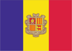
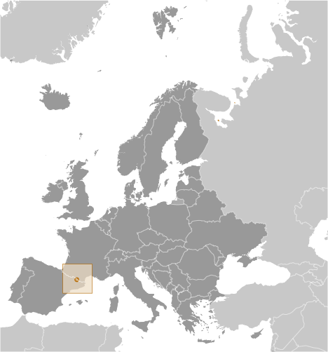
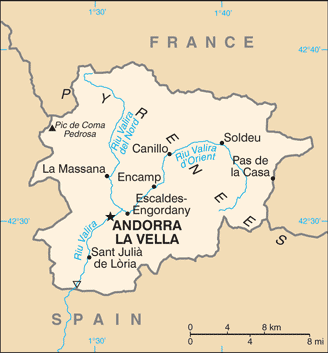

# Andorra

## Introduction

**_Background:_**   
The landlocked Principality of Andorra is one of the smallest states in Europe, nestled high in the Pyrenees between the French and Spanish borders. For 715 years, from 1278 to 1993, Andorrans lived under a unique co-principality, ruled by French and Spanish leaders (from 1607 onward, the French chief of state and the Bishop of Urgell). In 1993, this feudal system was modified with the introduction of a modern, constitution; the co-princes remained as titular heads of state, but the government transformed into a parliamentary democracy. Andorra has become a popular tourist destination visited by approximately ten million people each year drawn by the winter sports, summer climate, and duty-free shopping. Andorra has also become a wealthy international commercial center because of its mature banking sector and low taxes. As part of its effort to modernize its economy, Andorra has opened to foreign investment, and engaged in other reforms, such as advancing tax initiatives aimed at supporting a broader infrastructure. Although not a member of the European Union (EU), Andorra enjoys a special relationship with the EU and uses the euro as its national currency.

## Geography

**_Location:_**   
Southwestern Europe, Pyrenees mountains, on the border between France and Spain

**_Geographic coordinates:_**   
42 30 N, 1 30 E

**_Map references:_**   
Europe

**_Area:_**   
**total:** 468 sq km   
**land:** 468 sq km   
**water:** 0 sq km

**_Area - comparative:_**   
2.5 times the size of Washington, DC

**_Land boundaries:_**   
**total:** 118 km   
**border countries:** France 55 km, Spain 63 km

**_Coastline:_**   
0 km (landlocked)

**_Maritime claims:_**   
none (landlocked)

**_Climate:_**   
temperate; snowy, cold winters and warm, dry summers

**_Terrain:_**   
rugged mountains dissected by narrow valleys

**_Elevation extremes:_**   
**lowest point:** Riu Runer 840 m   
**highest point:** Pic de Coma Pedrosa 2,946 m

**_Natural resources:_**   
hydropower, mineral water, timber, iron ore, lead

**_Land use:_**   
**arable land:** 5.32%   
**permanent crops:** 0%   
**other:** 94.68% (2011)

**_Irrigated land:_**   
NA

**_Natural hazards:_**   
avalanches

**_Environment - current issues:_**   
deforestation; overgrazing of mountain meadows contributes to soil erosion; air pollution; wastewater treatment and solid waste disposal

**_Environment - international agreements:_**   
**party to:** Biodiversity, Desertification, Hazardous Wastes, Ozone Layer Protection   
**signed, but not ratified:** none of the selected agreements

**_Geography - note:_**   
landlocked; straddles a number of important crossroads in the Pyrenees

## People and Society

**_Nationality:_**   
**noun:** Andorran(s)   
**adjective:** Andorran

**_Ethnic groups:_**   
Spanish 43%, Andorran 33%, Portuguese 11%, French 7%, other 6% (1998)

**_Languages:_**   
Catalan (official), French, Castilian, Portuguese

**_Religions:_**   
Roman Catholic (predominant)

**_Population:_**   
85,458 (July 2014 est.)

**_Age structure:_**   
**0-14 years:** 15.3% (male 6,708/female 6,379)   
**15-24 years:** 9.2% (male 4,078/female 3,766)   
**25-54 years:** 48.7% (male 21,395/female 20,231)   
**55-64 years:** 12.5% (male 5,756/female 4,957)   
**65 years and over:** 14.3% (male 6,145/female 6,043) (2014 est.)

**_Median age:_**   
**total:** 42.4 years   
**male:** 42.6 years   
**female:** 42.2 years (2014 est.)

**_Population growth rate:_**   
0.17% (2014 est.)

**_Birth rate:_**   
8.48 births/1,000 population (2014 est.)

**_Death rate:_**   
6.82 deaths/1,000 population (2014 est.)

**_Net migration rate:_**   
0 migrant(s)/1,000 population (2014 est.)

**_Urbanization:_**   
**urban population:** 87.3% of total population (2011)   
**rate of urbanization:** 0.93% annual rate of change (2010-15 est.)

**_Major urban areas - population:_**   
ANDORRA LA VELLA (capital) 23,000 (2011)

**_Sex ratio:_**   
**at birth:** 1.07 male(s)/female   
**0-14 years:** 1.05 male(s)/female   
**15-24 years:** 1.08 male(s)/female   
**25-54 years:** 1.06 male(s)/female   
**55-64 years:** 1.07 male(s)/female   
**65 years and over:** 1 male(s)/female   
**total population:** 1.07 male(s)/female (2014 est.)

**_Infant mortality rate:_**   
**total:** 3.69 deaths/1,000 live births   
**male:** 3.68 deaths/1,000 live births   
**female:** 3.7 deaths/1,000 live births (2014 est.)

**_Life expectancy at birth:_**   
**total population:** 82.65 years   
**male:** 80.51 years   
**female:** 84.92 years (2014 est.)

**_Total fertility rate:_**   
1.38 children born/woman (2014 est.)

**_Health expenditures:_**   
7.2% of GDP (2011)

**_Physicians density:_**   
3.91 physicians/1,000 population (2009)

**_Hospital bed density:_**   
2.5 beds/1,000 population (2009)

**_Drinking water source:_**   
**improved:** urban: 100% of population; rural: 100% of population; total: 100% of population   
**unimproved:** urban: 0% of population; rural: 0% of population; total: 0% of population (2012 est.)

**_Sanitation facility access:_**   
**improved:** urban: 100% of population; rural: 100% of population; total: 100% of population   
**unimproved:** urban: 0% of population; rural: 0% of population; total: 0% of population (2012 est.)

**_HIV/AIDS - adult prevalence rate:_**   
NA

**_HIV/AIDS - people living with HIV/AIDS:_**   
NA

**_HIV/AIDS - deaths:_**   
NA

**_Obesity - adult prevalence rate:_**   
25.2% (2008)

**_Education expenditures:_**   
NA

**_Literacy:_**   
**definition:** age 15 and over can read and write   
**total population:** 100%   
**male:** 100%   
**female:** 100%

## Government

**_Country name:_**   
**conventional long form:** Principality of Andorra   
**conventional short form:** Andorra   
**local long form:** Principat d'Andorra   
**local short form:** Andorra

**_Government type:_**   
parliamentary democracy (since March 1993) that retains as its chiefs of state a co-principality; the two princes are the President of France and Bishop of Urgell, whose diocese is located in neighboring Spain; both co-princes maintain offices and representatives in Andorra

**_Capital:_**   
**name:** Andorra la Vella   
**geographic coordinates:** 42 30 N, 1 31 E   
**time difference:** UTC+1 (6 hours ahead of Washington, DC during Standard Time)   
**daylight saving time:** +1hr, begins last Sunday in March; ends last Sunday in October

**_Administrative divisions:_**   
7 parishes (parroquies, singular - parroquia); Andorra la Vella, Canillo, Encamp, Escaldes-Engordany, La Massana, Ordino, Sant Julia de Loria

**_Independence:_**   
1278 (formed under the joint sovereignty of the French Count of Foix and the Spanish Bishop of Urgell)

**_National holiday:_**   
Our Lady of Meritxell Day, 8 September (1278)

**_Constitution:_**   
drafted 1991, approved by referendum 14 March 1993, effective 28 April 1993 (2013)

**_Legal system:_**   
mixed legal system of civil and customary law with the influence of canon law

**_International law organization participation:_**   
has not submitted an ICJ jurisdiction declaration; accepts ICCt jurisdiction

**_Suffrage:_**   
18 years of age; universal

**_Executive branch:_**   
**chief of state:** French Co-Prince Francois HOLLANDE (since 15 May 2012); represented by Christian FREMONT (since September 2008) and Spanish Coprince Archbishop Joan-Enric VIVES i Sicilia (since 12 May 2003); represented by Nemesi MARQUES i Oste (since 30 July 2003)   
**head of government:** Head of Government (or Cap de Govern) Antoni MARTI PETIT (since 12 May 2011)   
**cabinet:** Executive Council of nine ministers designated by the Head of Government   
**elections:** Head of Government elected by the General Council (Andorran Parliament) and formally appointed by the co-princes for a four-year term; election last held on 3 April 2011 (next to be held in April 2015)   
**election results:** Antoni MARTI PETIT was elected Head of Government; percent of General Council vote - 79%; note - the leader of the party which wins a majority of seats in the General Council is usually elected Head of Government

**_Legislative branch:_**   
unicameral General Council of the Valleys or Consell General de las Valls (a minimum of 28 seats; members are elected by direct popular vote, 14 from a single national constituency and 14 to represent each of the seven parishes; to serve four-year terms); note - each voter casts two separate ballots - one for the national list, one for the parish list   
**elections:** last held on 3 April 2011 (next to be held in April 2015)   
**election results:** percent of vote by party - DA 55%, PS 35%, Andorra for Change 7%, VA 3%; seats by party - DA 22, PS 6; note - numbers of votes and percentages are for the respective national list; number of seats include seats won by the parish lists

**_Judicial branch:_**   
**highest court(s):** Supreme Court of Justice of Andorra or Tribunal Superior de la Justicia d'Andorra (consists of the court president and 8 judges organized into civil, criminal, and administrative chambers); Constitutional Court or Tribunal Constitucional (consists of 4 magistrates)   
**judge selection and term of office:** Supreme Court president and judges appointed by the Supreme Council of Justice, a 5-member judicial policy and administrative body appointed 1 each by the co-princes, 1 by the General Council, 1 by the executive council president, and 1 by the courts; judges serve 6-year renewable terms; Constitutional magistrates appointed 2 by the co-princes and 2 by the General Council; magistrates' appointments limited to two consecutive 8-year terms   
**subordinate courts:** Tribunal of Judges or Tribunal de Batlles; Tribunal of the Courts or Tribunal de Corts

**_Political parties and leaders:_**   
there are four political parties at the national level:   
Andorra for Change or ApC [Eusebio NOMEN CALVET]   
Democrats for Andorra or DA [Antoni MARTI PETIT], coalition including Liberal Party (PRA) and Reformist Coalition   
Greens of Andorra or VA [Isabel LOZANO MUNOZ]   
Social Democratic Party or PS [Jaume BARTUMEU CASSANY]   
**note:** there are also several smaller parties at the Parish level (one is Lauredian Union)

**_International organization participation:_**   
CE, FAO, ICAO, ICC (NGOs), ICRM, IFRCS, Interpol, IOC, IPU, ITU, OIF, OPCW, OSCE, UN, UNCTAD, UNESCO, Union Latina, UNWTO, WCO, WHO, WIPO, WTO (observer)

**_Diplomatic representation in the US:_**   
**chief of mission:** Ambassador Narcis CASAL de Fonsdeviela (since 2 November 2009)   
**chancery:** 2 United Nations Plaza, 25th Floor, New York, NY 10017   
**telephone:** [1] (212) 750-8064   
**FAX:** [1] (212) 750-6630

**_Diplomatic representation from the US:_**   
the US does not have an embassy in Andorra; the US Ambassador to Spain is accredited to Andorra; US interests in Andorra are represented by the US Consulate General's office in Barcelona (Spain); mailing address: Paseo Reina Elisenda de Montcada, 23, 08034 Barcelona, Spain; telephone: [34] (93) 280-2227; FAX: [34] (93) 280-6175

**_Flag description:_**   
three vertical bands of blue (hoist side), yellow, and red, with the national coat of arms centered in the yellow band; the latter band is slightly wider than the other two so that the ratio of band widths is 8:9:8; the coat of arms features a quartered shield with the emblems of (starting in the upper left and proceeding clockwise): Urgell, Foix, Bearn, and Catalonia; the motto reads VIRTUS UNITA FORTIOR (Strength United is Stronger); the flag combines the blue and red French colors with the red and yellow of Spain to show Franco-Spanish protection   
**note:** similar to the flags of Chad and Romania, which do not have a national coat of arms in the center, and the flag of Moldova, which does bear a national emblem

**_National anthem:_**   
**name:** "El Gran Carlemany" (The Great Charlemagne)   
**lyrics/music:** Joan BENLLOCH i VIVO/Enric MARFANY BONS   
**note:** adopted 1921; the anthem provides a brief history of Andorra in a first person narrative

## Economy

**_Economy - overview:_**   
Tourism, retail sales, and finance are the mainstays of Andorra's tiny, well-to-do economy, accounting for more than three-quarters of GDP. Andorra's duty-free status for some products and its summer and winter resorts attract millions of visitors annually, although the economic downturn in neighboring countries has curtailed the number of tourists. Andorra's comparative advantage as a tax haven eroded when the borders of neighboring France and Spain opened; its bank secrecy laws have been relaxed under pressure from the EU and OECD. Agricultural production is limited - only 5% of the land is arable - and most food has to be imported, making the economy vulnerable to changes in fuel and food prices. The principal livestock is sheep. Manufacturing output and exports consist mainly of perfumes and cosmetic products, products of the printing industry, electrical machinery and equipment, clothing, tobacco products, and furniture. Andorra is a member of the EU Customs Union and is treated as an EU member for trade in manufactured goods (no tariffs) and as a non-EU member for agricultural products. Andorra uses the euro and is effectively subject to the monetary policy of the European Central Bank. Slower growth in Spain and France has dimmed Andorra's economic prospects. Since 2010, a drop in tourism contributed to a contraction in GDP and a sharp deterioration of public finances, prompting the government to begin implementing several austerity measures to reduce the budget deficit, including levying a special corporate tax. To bring in new revenue and diversify future sources of economic growth, the government approved in July 2012 a new foreign investment law opening investment to foreign capital.

**_GDP (purchasing power parity):_**   
$3.163 billion (2012 est.)   
$3.214 billion (2011 est.)   
$3.227 billion (2010 est.)   
**note:** data are in 2012 US dollars

**_GDP (official exchange rate):_**   
$4.8 billion (2012 est.)

**_GDP - real growth rate:_**   
-1.6% (2012 est.)   
-0.4% (2011 est.)   
-1.9% (2010 est.)

**_GDP - per capita (PPP):_**   
$37,200 (2011 est.)   
$37,700 (2010 est.)   
$37,900 (2009 est.)

**_GDP - composition, by sector of origin:_**   
**agriculture:** 14%   
**industry:** 79%   
**services:** 6% (2011 est.)

**_Agriculture - products:_**   
small quantities of rye, wheat, barley, oats, vegetables, tobacco; sheep, cattle

**_Industries:_**   
tourism (particularly skiing), banking, timber, furniture

**_Industrial production growth rate:_**   
NA%

**_Labor force:_**   
36,060 (2012)

**_Labor force - by occupation:_**   
**agriculture:** 0.4%   
**industry:** 4.7%   
**services:** 94.9% (2010)

**_Unemployment rate:_**   
4% (2012 est.)   
1.9% (2011 est.)

**_Population below poverty line:_**   
NA% (2008)

**_Household income or consumption by percentage share:_**   
**lowest 10%:** NA%   
**highest 10%:** NA%

**_Budget:_**   
**revenues:** $1.029 billion   
**expenditures:** $1.041 billion (2012)

**_Taxes and other revenues:_**   
21.4% of GDP (2012)

**_Budget surplus (+) or deficit (-):_**   
-0.3% of GDP (2012)

**_Public debt:_**   
41.1% of GDP (2012)   
37.7% of GDP (2011)

**_Fiscal year:_**   
calendar year

**_Inflation rate (consumer prices):_**   
1.1% (2012 est.)   
-2.5% (2011 est.)

**_Exports:_**   
$70 million (2012 est.)   
$72 million (2011 est.)

**_Exports - commodities:_**   
tobacco products, furniture

**_Imports:_**   
$1.43 billion (2012 est.)   
$1.501 billion (2011 est.)

**_Imports - commodities:_**   
consumer goods, food, fuel, electricity

**_Debt - external:_**   
$NA

**_Exchange rates:_**   
euros (EUR) per US dollar -   
0.7778 (2013 est.)   
0.7185 (2012 est.)   
0.755 (2010 est.)   
0.7198 (2009 est.)   
0.6827 (2008 est.)

## Energy

**_Electricity - production:_**   
91.24 million kWh (2011)

**_Electricity - consumption:_**   
562.4 million kWh (2012)

**_Electricity - exports:_**   
0 kWh (2012 est.)

**_Electricity - imports:_**   
0 kWh (2012 est.)

**_Electricity - installed generating capacity:_**   
520,000 kW

**_Electricity - from fossil fuels:_**   
61.3% of total installed capacity

**_Electricity - from nuclear fuels:_**   
0% of total installed capacity (2010)

**_Electricity - from hydroelectric plants:_**   
23.3% of total installed capacity

## Communications

**_Telephones - main lines in use:_**   
39,000 (2012)

**_Telephones - mobile cellular:_**   
65,000 (2012)

**_Telephone system:_**   
**general assessment:** modern automatic telephone system   
**domestic:** modern system with microwave radio relay connections between exchanges   
**international:** country code - 376; landline circuits to France and Spain (2012)

**_Broadcast media:_**   
1 public TV station and 2 public radio stations; about 10 commercial radio stations; good reception of radio and TV broadcasts from stations in France and Spain; upgraded to terrestrial digital TV broadcasting in 2007; roughly 25 international TV channels available (2012)

**_Internet country code:_**   
.ad

**_Internet hosts:_**   
28,383 (2012)

**_Internet users:_**   
67,100 (2009)

## Transportation

**_Roadways:_**   
**total:** 320 km (2008)

## Military

**_Military branches:_**   
no regular military forces, Police Service of Andorra (2011)

**_Manpower available for military service:_**   
**males age 16-49:** 22,390 (2010 est.)

**_Manpower fit for military service:_**   
**males age 16-49:** 17,977   
**females age 16-49:** 17,069 (2010 est.)

**_Manpower reaching militarily significant age annually:_**   
**male:** 397   
**female:** 347 (2010 est.)

**_Military - note:_**   
defense is the responsibility of France and Spain

## Transnational Issues

**_Disputes - international:_**   
none

............................................................   
_Page last updated on June 23, 2014_
