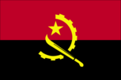
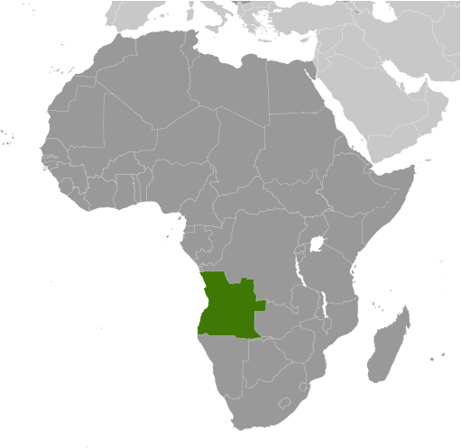
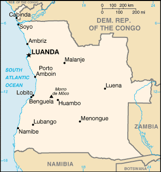

# Angola

## Introduction

**_Background:_**   
Angola is still rebuilding its country since the end of a 27-year civil war in 2002. Fighting between the Popular Movement for the Liberation of Angola (MPLA), led by Jose Eduardo DOS SANTOS, and the National Union for the Total Independence of Angola (UNITA), led by Jonas SAVIMBI, followed independence from Portugal in 1975. Peace seemed imminent in 1992 when Angola held national elections, but fighting picked up again in 1993. Up to 1.5 million lives may have been lost - and 4 million people displaced - during the more than a quarter century of fighting. SAVIMBI's death in 2002 ended UNITA's insurgency and cemented the MPLA's hold on power. President DOS SANTOS pushed through a new constitution in 2010; elections held in 2012 saw him installed as president.

## Geography

**_Location:_**   
Southern Africa, bordering the South Atlantic Ocean, between Namibia and Democratic Republic of the Congo

**_Geographic coordinates:_**   
12 30 S, 18 30 E

**_Map references:_**   
Africa

**_Area:_**   
**total:** 1,246,700 sq km   
**land:** 1,246,700 sq km   
**water:** 0 sq km

**_Area - comparative:_**   
slightly less than twice the size of Texas

**_Land boundaries:_**   
**total:** 5,369 km   
**border countries:** Democratic Republic of the Congo 2,646 km (of which 225 km is the boundary of discontiguous Cabinda Province), Republic of the Congo 231 km, Namibia 1,427 km, Zambia 1,065 km

**_Coastline:_**   
1,600 km

**_Maritime claims:_**   
**territorial sea:** 12 nm   
**contiguous zone:** 24 nm   
**exclusive economic zone:** 200 nm

**_Climate:_**   
semiarid in south and along coast to Luanda; north has cool, dry season (May to October) and hot, rainy season (November to April)

**_Terrain:_**   
narrow coastal plain rises abruptly to vast interior plateau

**_Elevation extremes:_**   
**lowest point:** Atlantic Ocean 0 m   
**highest point:** Morro de Moco 2,620 m

**_Natural resources:_**   
petroleum, diamonds, iron ore, phosphates, copper, feldspar, gold, bauxite, uranium

**_Land use:_**   
**arable land:** 3.29%   
**permanent crops:** 0.23%   
**other:** 96.48% (2011)

**_Irrigated land:_**   
855.3 sq km (2005)

**_Total renewable water resources:_**   
148 cu km (2011)

**_Freshwater withdrawal (domestic/industrial/agricultural):_**   
**total:** 0.71 cu km/yr (45%/34%/21%)   
**per capita:** 40.27 cu m/yr (2005)

**_Natural hazards:_**   
locally heavy rainfall causes periodic flooding on the plateau

**_Environment - current issues:_**   
overuse of pastures and subsequent soil erosion attributable to population pressures; desertification; deforestation of tropical rain forest, in response to both international demand for tropical timber and to domestic use as fuel, resulting in loss of biodiversity; soil erosion contributing to water pollution and siltation of rivers and dams; inadequate supplies of potable water

**_Environment - international agreements:_**   
**party to:** Biodiversity, Climate Change, Climate Change-Kyoto Protocol, Desertification, Law of the Sea, Marine Dumping, Ozone Layer Protection, Ship Pollution   
**signed, but not ratified:** none of the selected agreements

**_Geography - note:_**   
the province of Cabinda is an exclave, separated from the rest of the country by the Democratic Republic of the Congo

## People and Society

**_Nationality:_**   
**noun:** Angolan(s)   
**adjective:** Angolan

**_Ethnic groups:_**   
Ovimbundu 37%, Kimbundu 25%, Bakongo 13%, mestico (mixed European and native African) 2%, European 1%, other 22%

**_Languages:_**   
Portuguese (official), Bantu and other African languages

**_Religions:_**   
indigenous beliefs 47%, Roman Catholic 38%, Protestant 15% (1998 est.)

**_Population:_**   
19,088,106 (July 2014 est.)

**_Age structure:_**   
**0-14 years:** 43.2% (male 4,206,929/female 4,043,618)   
**15-24 years:** 20.5% (male 1,992,955/female 1,923,932)   
**25-54 years:** 29.3% (male 2,822,164/female 2,777,147)   
**55-64 years:** 4% (male 370,181/female 389,885)   
**65 years and over:** 2.9% (male 259,637/female 301,658) (2014 est.)

**_Dependency ratios:_**   
**total dependency ratio:** 98.7 %   
**youth dependency ratio:** 93.9 %   
**elderly dependency ratio:** 4.8 %   
**potential support ratio:** 21 (2014 est.)

**_Median age:_**   
**total:** 17.9 years   
**male:** 17.7 years   
**female:** 18.1 years (2014 est.)

**_Population growth rate:_**   
2.78% (2014 est.)

**_Birth rate:_**   
38.97 births/1,000 population (2014 est.)

**_Death rate:_**   
11.67 deaths/1,000 population (2014 est.)

**_Net migration rate:_**   
0.47 migrant(s)/1,000 population (2014 est.)

**_Urbanization:_**   
**urban population:** 59.2% of total population (2011)   
**rate of urbanization:** 3.97% annual rate of change (2010-15 est.)

**_Major urban areas - population:_**   
LUANDA (capital) 5.068 million; Huambo 1.098 million (2011)

**_Sex ratio:_**   
**at birth:** 1.05 male(s)/female   
**0-14 years:** 1.04 male(s)/female   
**15-24 years:** 1.04 male(s)/female   
**25-54 years:** 1.02 male(s)/female   
**55-64 years:** 1.02 male(s)/female   
**65 years and over:** 0.86 male(s)/female   
**total population:** 1.02 male(s)/female (2014 est.)

**_Mother's mean age at first birth:_**   
18 (2008-09 est.)

**_Maternal mortality rate:_**   
450 deaths/100,000 live births (2010)

**_Infant mortality rate:_**   
**total:** 79.99 deaths/1,000 live births   
**male:** 83.74 deaths/1,000 live births   
**female:** 76.05 deaths/1,000 live births (2014 est.)

**_Life expectancy at birth:_**   
**total population:** 55.29 years   
**male:** 54.16 years   
**female:** 56.47 years (2014 est.)

**_Total fertility rate:_**   
5.43 children born/woman (2014 est.)

**_Contraceptive prevalence rate:_**   
17.7% (2009)

**_Health expenditures:_**   
3.5% of GDP (2011)

**_Physicians density:_**   
0.17 physicians/1,000 population (2009)

**_Hospital bed density:_**   
0.8 beds/1,000 population (2005)

**_Drinking water source:_**   
**improved:** urban: 67.6% of population; rural: 34.3% of population; total: 54.3% of population   
**unimproved:** urban: 32.4% of population; rural: 65.7% of population; total: 45.7% of population (2012 est.)

**_Sanitation facility access:_**   
**improved:** urban: 86.8% of population; rural: 20.1% of population; total: 60.1% of population   
**unimproved:** urban: 13.2% of population; rural: 79.9% of population; total: 39.9% of population (2012 est.)

**_HIV/AIDS - adult prevalence rate:_**   
2.3% (2012 est.)

**_HIV/AIDS - people living with HIV/AIDS:_**   
248,800 (2012 est.)

**_HIV/AIDS - deaths:_**   
12,600 (2012 est.)

**_Major infectious diseases:_**   
**degree of risk:** very high   
**food or waterborne diseases:** bacterial and protozoal diarrhea, hepatitis A, typhoid fever   
**vectorborne diseases:** dengue fever, malaria   
**water contact disease:** schistosomiasis   
**animal contact disease:** rabies (2013)

**_Obesity - adult prevalence rate:_**   
6.4% (2008)

**_Children under the age of 5 years underweight:_**   
15.6% (2007)

**_Education expenditures:_**   
3.5% of GDP (2010)

**_Literacy:_**   
**definition:** age 15 and over can read and write   
**total population:** 70.4%   
**male:** 82.6%   
**female:** 58.6% (2011 est.)

**_School life expectancy (primary to tertiary education):_**   
**total:** 11 years   
**male:** 14 years   
**female:** 9 years (2011)

**_Child labor - children ages 5-14:_**   
**total number:** 832,895   
**percentage:** 24 % (2001 est.)

## Government

**_Country name:_**   
**conventional long form:** Republic of Angola   
**conventional short form:** Angola   
**local long form:** Republica de Angola   
**local short form:** Angola   
**former:** People's Republic of Angola

**_Government type:_**   
republic; multiparty presidential regime

**_Capital:_**   
**name:** Luanda   
**geographic coordinates:** 8 50 S, 13 13 E   
**time difference:** UTC+1 (6 hours ahead of Washington, DC, during Standard Time)

**_Administrative divisions:_**   
18 provinces (provincias, singular - provincia); Bengo, Benguela, Bie, Cabinda, Cunene, Huambo, Huila, Kwando Kubango, Kwanza Norte, Kwanza Sul, Luanda, Lunda Norte, Lunda Sul, Malanje, Moxico, Namibe, Uige, Zaire

**_Independence:_**   
11 November 1975 (from Portugal)

**_National holiday:_**   
Independence Day, 11 November (1975)

**_Constitution:_**   
previous 1975, 1992; latest adopted 5 February 2010 (2013)

**_Legal system:_**   
civil legal system based on Portuguese civil law; no judicial review of legislation

**_International law organization participation:_**   
has not submitted an ICJ jurisdiction declaration; non-party state to the ICCt

**_Suffrage:_**   
18 years of age; universal

**_Executive branch:_**   
**chief of state:** President Jose Eduardo DOS SANTOS (since 21 September 1979); Vice President Manuel Domingos VICENTE (since 26 September 2012); note - the president is both chief of state and head of government   
**head of government:** President Jose Eduardo DOS SANTOS (since 21 September 1979); Vice President Manuel Domingos VICENTE (since 26 September 2012)   
**cabinet:** Council of Ministers appointed by the president   
**elections:** president indirectly elected by National Assembly for a five-year term (eligible for a second consecutive or discontinuous term) under the 2010 constitution; note - according to the 2010 constitution, ballots are cast for parties rather than candidates, the majority leader is appointed president; following the results of the 2012 legislative elections DOS SANTOS became president (eligible for a second term)   
**election results:** NA; as leader of the MPLA, Jose Eduardo DOS SANTOS became pesident following legislative elections on 31 August 2012; DOS SANTOS was inaugurated on 26 September 2012 to serve the first of a possible two terms under the 2010 constitution

**_Legislative branch:_**   
unicameral National Assembly or Assembleia Nacional (220 seats; members elected by proportional vote to serve five-year terms)   
**elections:** last held on 31 August 2012 (next to be held in 2017)   
**election results:** percent of vote by party - MPLA 71.8%, UNITA 18.7%, CASA-CE 6.0%, PRS 1.7%, FNLA 1.1%, other 0.7%; seats by party - MPLA 175, UNITA 32, CASA-CE 8, PRS 3, FNLA 2

**_Judicial branch:_**   
**highest court(s):** Supreme Court or Tribunal da Relacao (consists of the chief justice and NA judges; Constitutional Court or Tribunal Constitucional (consists of 11 members)   
**judge selection and term of office:** Supreme Court judges appointed by the president upon recommendation of the Supreme Judicial Council, an 18-member body presided over by the president; judge tenure NA; Constitutional Court judges - 4 nominated by the president, 4 elected by National Assembly, 2 elected by Supreme National Council, 1 elected by competitive submission of curricula; judges serve single 7-year terms   
**subordinate courts:** provincial and municipal courts

**_Political parties and leaders:_**   
Broad Convergence for the Salvation of Angola Electoral Coalition or CASA-CE [Abel CHIVUKUVUKU]   
National Front for the Liberation of Angola or FNLA [Lucas NGONDA]   
National Union for the Total Independence of Angola or UNITA [Isaias SAMAKUVA] (largest opposition party)   
Popular Movement for the Liberation of Angola or MPLA [Jose Eduardo DOS SANTOS] (ruling party in power since 1975)   
Social Renewal Party or PRS [Eduardo KUANGANA]   
**note:** 4 other parties qualified to participate in the national election in August 2012

**_Political pressure groups and leaders:_**   
Front for the Liberation of the Enclave of Cabinda or FLEC [N'zita Henriques TIAGO]   
**note:** FLEC's small-scale armed struggle for the independence of Cabinda Province persists despite the signing of a peace accord with the government in August 2006; Several factions of FLEC have broken off over the past 30 years, including the FLEC-PM [Rodrigues Mingas], which was responsible for a deadly attack on the Togolese soccer team in 2010

**_International organization participation:_**   
ACP, AfDB, AU, CPLP, FAO, G-77, IAEA, IBRD, ICAO, ICRM, IDA, IFAD, IFC, IFRCS, ILO, IMF, IMO, Interpol, IOC, IOM, IPU, ISO (correspondent), ITSO, ITU, ITUC (NGOs), MIGA, NAM, OAS (observer), OPEC, SADC, UN, UNCTAD, UNESCO, UNIDO, Union Latina, UNWTO, UPU, WCO, WFTU (NGOs), WHO, WIPO, WMO, WTO

**_Diplomatic representation in the US:_**   
**chief of mission:** Ambassador Alberto do Carmo BENTO RIBEIRO (since 1 September 2011)   
**chancery:** 2108 16th Street NW, Washington, DC 20009   
**telephone:** [1] (202) 785-1156   
**FAX:** [1] (202) 785-1258   
**consulate(s) general:** Houston, New York

**_Diplomatic representation from the US:_**   
**chief of mission:** Ambassador (vacant); Charge d'Affaires Heather C. Merritt   
**embassy:** number 32 Rua Houari Boumedienne (in the Miramar area of Luanda), Luanda   
**mailing address:** international mail: Caixa Postal 6468, Luanda; pouch: US Embassy Luanda, US Department of State, 2550 Luanda Place, Washington, DC 20521-2550   
**telephone:** [244] (222) 64-1000   
**FAX:** [244] (222) 64-1232

**_Flag description:_**   
two equal horizontal bands of red (top) and black with a centered yellow emblem consisting of a five-pointed star within half a cogwheel crossed by a machete (in the style of a hammer and sickle); red represents liberty, black the African continent, the symbols characterize workers and peasants

**_National symbol(s):_**   
Palanca Negra Gigante (giant black sable antelope)

**_National anthem:_**   
**name:** "Angola Avante" (Forward Angola)   
**lyrics/music:** Manuel Rui Alves MONTEIRO/Rui Alberto Vieira Dias MINGAO   
**note:** adopted 1975

## Economy

**_Economy - overview:_**   
Angola's high growth rate in recent years was driven by high international prices for its oil. Angola became a member of OPEC in late 2006 and its current assigned a production quota of 1.65 million barrels a day (bbl/day). Oil production and its supporting activities contribute about 85% of GDP. Diamond exports contribute an additional 5%. Subsistence agriculture provides the main livelihood for most of the people, but half of the country's food is still imported. Increased oil production supported growth averaging more than 17% per year from 2004 to 2008. A postwar reconstruction boom and resettlement of displaced persons has led to high rates of growth in construction and agriculture as well. Much of the country's infrastructure is still damaged or undeveloped from the 27-year-long civil war. Land mines left from the war still mar the countryside, even though peace was established after the death of rebel leader Jonas SAVIMBI in February 2002. Since 2005, the government has used billions of dollars in credit lines from China, Brazil, Portugal, Germany, Spain, and the EU to rebuild Angola's public infrastructure. The global recession that started in 2008 temporarily stalled economic growth. Lower prices for oil and diamonds during the global recession slowed GDP growth to 2.4% in 2009, and many construction projects stopped because Luanda accrued $9 billion in arrears to foreign construction companies when government revenue fell in 2008 and 2009. Angola abandoned its currency peg in 2009, and in November 2009 signed onto an IMF Stand-By Arrangement loan of $1.4 billion to rebuild international reserves. Consumer inflation declined from 325% in 2000 to about 10% in 2012. Higher oil prices have helped Angola turn a budget deficit of 8.6% of GDP in 2009 into an surplus of 12% of GDP in 2012. Corruption, especially in the extractive sectors, also is a major challenge.

**_GDP (purchasing power parity):_**   
$131.8 billion (2013 est.)   
$124.8 billion (2012 est.)   
$118.7 billion (2011 est.)   
**note:** data are in 2013 US dollars

**_GDP (official exchange rate):_**   
$124 billion (2013 est.)

**_GDP - real growth rate:_**   
5.6% (2013 est.)   
5.2% (2012 est.)   
3.9% (2011 est.)

**_GDP - per capita (PPP):_**   
$6,300 (2013 est.)   
$6,200 (2012 est.)   
$6,000 (2011 est.)   
**note:** data are in 2013 US dollars

**_Gross national saving:_**   
19.1% of GDP (2013 est.)   
23.8% of GDP (2012 est.)   
24% of GDP (2011 est.)

**_GDP - composition, by end use:_**   
**household consumption:** 49.2%   
**government consumption:** 20%   
**investment in fixed capital:** 11.4%   
**investment in inventories:** -0.1%   
**exports of goods and services:** 59.2%   
**imports of goods and services:** -39.7%; (2013 est.)

**_GDP - composition, by sector of origin:_**   
**agriculture:** 10.2%   
**industry:** 61.4%   
**services:** 28.4% (2011 est.)

**_Agriculture - products:_**   
bananas, sugarcane, coffee, sisal, corn, cotton, cassava (manioc, tapioca), tobacco, vegetables, plantains; livestock; forest products; fish

**_Industries:_**   
petroleum; diamonds, iron ore, phosphates, feldspar, bauxite, uranium, and gold; cement; basic metal products; fish processing; food processing, brewing, tobacco products, sugar; textiles; ship repair

**_Industrial production growth rate:_**   
5.5% (2013 est.)

**_Labor force:_**   
9.018 million (2013 est.)

**_Labor force - by occupation:_**   
**agriculture:** 85%   
**industry and services:** 15% (2003 est.)

**_Unemployment rate:_**   
NA%

**_Population below poverty line:_**   
40.5% (2006 est.)

**_Household income or consumption by percentage share:_**   
**lowest 10%:** 0.6%   
**highest 10%:** 44.7% (2000)

**_Budget:_**   
**revenues:** $52.75 billion   
**expenditures:** $48.48 billion (2013 est.)

**_Taxes and other revenues:_**   
42.5% of GDP (2013 est.)

**_Budget surplus (+) or deficit (-):_**   
3.4% of GDP (2013 est.)

**_Public debt:_**   
14.7% of GDP (2013 est.)   
17.2% of GDP (2012 est.)

**_Fiscal year:_**   
calendar year

**_Inflation rate (consumer prices):_**   
8.9% (2013 est.)   
10.3% (2012 est.)

**_Central bank discount rate:_**   
$NA (31 December 2010 est.)   
30% (31 December 2009 est.)

**_Commercial bank prime lending rate:_**   
15% (31 December 2013 est.)   
16.81% (31 December 2012 est.)

**_Stock of narrow money:_**   
$16.95 billion (31 December 2013 est.)   
$13.31 billion (31 December 2012 est.)

**_Stock of broad money:_**   
$50.71 billion (31 December 2013 est.)   
$40.34 billion (31 December 2012 est.)

**_Stock of domestic credit:_**   
NA% (31 December 2013 est.)   
$20.45 billion (31 December 2012 est.)

**_Current account balance:_**   
$10.69 billion (2013 est.)   
$13.85 billion (2012 est.)

**_Exports:_**   
$70.84 billion (2013 est.)   
$71.09 billion (2012 est.)

**_Exports - commodities:_**   
crude oil, diamonds, refined petroleum products, coffee, sisal, fish and fish products, timber, cotton

**_Exports - partners:_**   
China 46.3%, US 13.9%, India 10.1%, South Africa 4.2% (2012)

**_Imports:_**   
$26.09 billion (2013 est.)   
$23.72 billion (2012 est.)

**_Imports - commodities:_**   
machinery and electrical equipment, vehicles and spare parts; medicines, food, textiles, military goods

**_Imports - partners:_**   
China 20.9%, Portugal 19.5%, US 7.7%, South Africa 7.1%, Brazil 5.9% (2012)

**_Reserves of foreign exchange and gold:_**   
$37.94 billion (31 December 2013 est.)   
$33.41 billion (31 December 2012 est.)

**_Debt - external:_**   
$22.71 billion (31 December 2013 est.)   
$21.85 billion (31 December 2012 est.)

**_Stock of direct foreign investment - at home:_**   
$17.15 billion (31 December 2012 est.)   
$12.15 billion (31 December 2011 est.)

**_Stock of direct foreign investment - abroad:_**   
$12.87 billion (31 December 2013 est.)   
$9.877 billion (31 December 2012 est.)

**_Exchange rates:_**   
kwanza (AOA) per US dollar -   
95.97 (2013 est.)   
95.468 (2012 est.)   
91.906 (2010 est.)   
79.33 (2009)   
75.023 (2008)

## Energy

**_Electricity - production:_**   
5.118 billion kWh (2010 est.)

**_Electricity - consumption:_**   
4.592 billion kWh (2010 est.)

**_Electricity - exports:_**   
0 kWh (2012 est.)

**_Electricity - imports:_**   
0 kWh (2012 est.)

**_Electricity - installed generating capacity:_**   
1.155 million kW (2010 est.)

**_Electricity - from fossil fuels:_**   
56.9% of total installed capacity (2010 est.)

**_Electricity - from nuclear fuels:_**   
0% of total installed capacity (2010 est.)

**_Electricity - from hydroelectric plants:_**   
43.1% of total installed capacity (2010 est.)

**_Electricity - from other renewable sources:_**   
0% of total installed capacity (2010 est.)

**_Crude oil - production:_**   
1.872 million bbl/day (2012 est.)

**_Crude oil - exports:_**   
1.928 million bbl/day (2010 est.)

**_Crude oil - imports:_**   
0 bbl/day (2010 est.)

**_Crude oil - proved reserves:_**   
10.47 billion bbl (1 January 2013 est.)

**_Refined petroleum products - production:_**   
38,760 bbl/day (2010 est.)

**_Refined petroleum products - consumption:_**   
79,430 bbl/day (2011 est.)

**_Refined petroleum products - exports:_**   
17,750 bbl/day (2010 est.)

**_Refined petroleum products - imports:_**   
55,740 bbl/day (2010 est.)

**_Natural gas - production:_**   
752 million cu m (2011 est.)

**_Natural gas - consumption:_**   
733 million cu m (2010 est.)

**_Natural gas - exports:_**   
0 cu m (2011 est.)

**_Natural gas - imports:_**   
0 cu m (2011 est.)

**_Natural gas - proved reserves:_**   
366 billion cu m (1 January 2013 est.)

**_Carbon dioxide emissions from consumption of energy:_**   
26.97 million Mt (2011 est.)

## Communications

**_Telephones - main lines in use:_**   
303,000 (2012)

**_Telephones - mobile cellular:_**   
9.8 million (2012)

**_Telephone system:_**   
**general assessment:** limited system; state-owned telecom had monopoly for fixed-lines until 2005; demand outstripped capacity, prices were high, and services poor; Telecom Namibia, through an Angolan company, became the first private licensed operator in Angola's fixed-line telephone network; by 2010, the number of fixed-line providers had expanded to 5; Angola Telecom established mobile-cellular service in Luanda in 1993 and the network has been extended to larger towns; a privately owned, mobile-cellular service provider began operations in 2001   
**domestic:** only about two fixed-lines per 100 persons; mobile-cellular teledensity about 50 telephones per 100 persons in 2011   
**international:** country code - 244; landing point for the SAT-3/WASC fiber-optic submarine cable that provides connectivity to Europe and Asia; satellite earth stations - 29 (2009)

**_Broadcast media:_**   
state controls all broadcast media with nationwide reach; state-owned Televisao Popular de Angola (TPA) provides terrestrial TV service on 2 channels; a third TPA channel is available via cable and satellite; TV subscription services are available; state-owned Radio Nacional de Angola (RNA) broadcasts on 5 stations; about a half dozen private radio stations broadcast locally (2008)

**_Internet country code:_**   
.ao

**_Internet hosts:_**   
20,703 (2012)

**_Internet users:_**   
606,700 (2009)

## Transportation

**_Airports:_**   
176 (2013)

**_Airports - with paved runways:_**   
**total:** 31   
**over 3,047 m:** 7   
**2,438 to 3,047 m:** 8   
**1,524 to 2,437 m:** 12   
**914 to 1,523 m:** 4 (2013)

**_Airports - with unpaved runways:_**   
**total:** 145   
**over 3,047 m:** 2   
**2,438 to 3,047 m:** 3   
**1,524 to 2,437 m:** 31   
**914 to 1,523 m:** 66   
**under 914 m:** 43 (2013)

**_Heliports:_**   
1 (2013)

**_Pipelines:_**   
gas 352 km; liquid petroleum gas 85 km; oil 1,065 km; oil/gas/water 5 km (2013)

**_Railways:_**   
**total:** 2,764 km   
**narrow gauge:** 2,641 km 1.067-m gauge; 123 km 0.600-m gauge (2008)

**_Roadways:_**   
**total:** 51,429 km   
**paved:** 5,349 km   
**unpaved:** 46,080 km (2001)

**_Waterways:_**   
1,300 km (2011)

**_Merchant marine:_**   
**total:** 7   
**by type:** cargo 1, chemical tanker 1, passenger/cargo 2, petroleum tanker 2, roll on/roll off 1   
**foreign-owned:** 1 (Spain 1)   
**registered in other countries:** 17 (Bahamas 6, Curacao 2, Cyprus 1, Liberia 1, Malta 7) (2010)

**_Ports and terminals:_**   
**major seaport(s):** Cabinda, Lobito, Luanda, Namibe

## Military

**_Military branches:_**   
Angolan Armed Forces (Forcas Armadas Angolanas, FAA): Army, Navy (Marinha de Guerra Angola, MGA), Angolan National Air Force (Forca Aerea Nacional Angolana, FANA; under operational control of the Army) (2012)

**_Military service age and obligation:_**   
20-45 years of age for compulsory male and 18-45 years for voluntary male military service (registration at age 18 is mandatory); 20-45 years of age for voluntary female service; conscript service obligation - 2 years; Angolan citizenship required; the Navy (MGA) is entirely staffed with volunteers (2013)

**_Manpower available for military service:_**   
**males age 16-49:** 3,062,438   
**females age 16-49:** 2,964,262 (2010 est.)

**_Manpower fit for military service:_**   
**males age 16-49:** 1,546,781   
**females age 16-49:** 1,492,308 (2010 est.)

**_Manpower reaching militarily significant age annually:_**   
**male:** 155,476   
**female:** 152,054 (2010 est.)

**_Military expenditures:_**   
3.63% of GDP (2012)   
3.5% of GDP (2011)   
3.63% of GDP (2010)

## Transnational Issues

**_Disputes - international:_**   
Democratic Republic of Congo accuses Angola of shifting monuments

**_Refugees and internally displaced persons:_**   
**refugees (country of origin):** 21,104 (Democratic Republic of Congo) (2013)   
**IDPs:** 19,500 (27-year civil war ending in 2002) (2005)

**_Trafficking in persons:_**   
**current situation:** Angola is a source and destination country for men, women, and children subjected to sex trafficking and forced labor in agriculture, construction, domestic service, and diamond mines; some Angolan girls are forced into domestic prostitution, while some Angolan boys are taken to Namibia as forced laborers or are forced to be cross-border couriers; women and children are also forced into domestic service in South Africa, the Democratic Republic of the Congo, Namibia, and European countries; Vietnamese, Brazilian, and Chinese women are trafficked to Angola for prostitution, while Chinese, Southeast Asian, Namibian, and possibly Congolese migrants are subjected to forced labor in Angola's construction industry   
**tier rating:** Tier 2 Watch List - Angola does not fully comply with the minimum standards for the elimination of trafficking; however, it is making significant efforts to do so; authorities opened one internal labor trafficking investigation but have not initiated the prosecution of any trafficking offenders, has never convicted a trafficking offender, and does not have a law specifically prohibiting all forms of trafficking; the government has not adopted amendments to the penal code reflecting the 2010 constitutional provision prohibiting human trafficking and has not finalized draft anti-trafficking legislation; the government has made minimal efforts to protect trafficking victims but continues to lack a systematic process for identifying trafficking victims and providing legal remedies to victims (2013)

**_Illicit drugs:_**   
used as a transshipment point for cocaine destined for Western Europe and other African states, particularly South Africa

............................................................   
_Page last updated on June 23, 2014_
