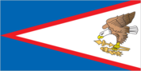
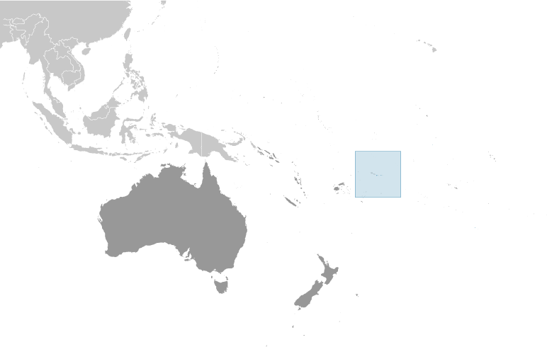
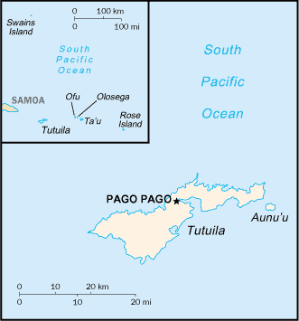

# American Samoa

_territory of the US_

## Introduction

**_Background:_**   
Settled as early as 1000 B.C., Samoa was not reached by European explorers until the 18th century. International rivalries in the latter half of the 19th century were settled by an 1899 treaty in which Germany and the US divided the Samoan archipelago. The US formally occupied its portion - a smaller group of eastern islands with the excellent harbor of Pago Pago - the following year.

## Geography

**_Location:_**   
Oceania, group of islands in the South Pacific Ocean, about half way between Hawaii and New Zealand

**_Geographic coordinates:_**   
14 20 S, 170 00 W

**_Map references:_**   
Oceania

**_Area:_**   
**total:** 199 sq km   
**land:** 199 sq km   
**water:** 0 sq km   
**note:** includes Rose Island and Swains Island

**_Area - comparative:_**   
slightly larger than Washington, DC

**_Land boundaries:_**   
0 km

**_Coastline:_**   
116 km

**_Maritime claims:_**   
**territorial sea:** 12 nm   
**exclusive economic zone:** 200 nm

**_Climate:_**   
tropical marine, moderated by southeast trade winds; annual rainfall averages about 3 m; rainy season (November to April), dry season (May to October); little seasonal temperature variation

**_Terrain:_**   
five volcanic islands with rugged peaks and limited coastal plains, two coral atolls (Rose Island, Swains Island)

**_Elevation extremes:_**   
**lowest point:** Pacific Ocean 0 m   
**highest point:** Lata Mountain 964 m

**_Natural resources:_**   
pumice, pumicite

**_Land use:_**   
**arable land:** 9.5%   
**permanent crops:** 15%   
**other:** 75.5% (2011)

**_Irrigated land:_**   
NA

**_Natural hazards:_**   
typhoons common from December to March   
**volcanism:** limited volcanic activity on the Ofu and Olosega Islands; neither has erupted since the 19th century

**_Environment - current issues:_**   
limited natural freshwater resources; the water division of the government has spent substantial funds in the past few years to improve water catchments and pipelines

**_Geography - note:_**   
Pago Pago has one of the best natural deepwater harbors in the South Pacific Ocean, sheltered by shape from rough seas and protected by peripheral mountains from high winds; strategic location in the South Pacific Ocean

## People and Society

**_Nationality:_**   
**noun:** American Samoan(s) (US nationals)   
**adjective:** American Samoan

**_Ethnic groups:_**   
Native Hawaiian and other Pacific Islander 91.6%, Asian 2.8%, white 1.1%, mixed 4.2%, other 0.3% (2000 est.)

**_Languages:_**   
Samoan 90.6% (closely related to Hawaiian and other Polynesian languages), English 2.9%, Tongan 2.4%, other Pacific islander 2.1%, other 2%   
**note:** most people are bilingual (2000 census)

**_Religions:_**   
Christian Congregationalist 50%, Roman Catholic 20%, Protestant and other 30%

**_Population:_**   
54,517 (July 2014 est.)

**_Age structure:_**   
**0-14 years:** 24.9% (male 6,671/female 6,917)   
**15-24 years:** 20.2% (male 5,468/female 5,565)   
**25-54 years:** 41.7% (male 11,694/female 11,056)   
**55-64 years:** 8.2% (male 2,211/female 2,260)   
**65 years and over:** 4.9% (male 1,234/female 1,441) (2014 est.)

**_Median age:_**   
**total:** 28.3 years   
**male:** 28.8 years   
**female:** 27.8 years (2014 est.)

**_Population growth rate:_**   
-0.35% (2014 est.)

**_Birth rate:_**   
22.87 births/1,000 population (2014 est.)

**_Death rate:_**   
4.68 deaths/1,000 population (2014 est.)

**_Net migration rate:_**   
-21.64 migrant(s)/1,000 population (2014 est.)

**_Urbanization:_**   
**urban population:** 93.2% of total population (2011)   
**rate of urbanization:** 1.87% annual rate of change (2010-15 est.)

**_Major urban areas - population:_**   
PAGO PAGO (capital) 64,000 (2011)

**_Sex ratio:_**   
**at birth:** 1.06 male(s)/female   
**0-14 years:** 0.96 male(s)/female   
**15-24 years:** 0.98 male(s)/female   
**25-54 years:** 1.06 male(s)/female   
**55-64 years:** 1 male(s)/female   
**65 years and over:** 0.86 male(s)/female   
**total population:** 1.01 male(s)/female (2014 est.)

**_Infant mortality rate:_**   
**total:** 8.92 deaths/1,000 live births   
**male:** 11.47 deaths/1,000 live births   
**female:** 6.21 deaths/1,000 live births (2014 est.)

**_Life expectancy at birth:_**   
**total population:** 74.91 years   
**male:** 71.96 years   
**female:** 78.04 years (2014 est.)

**_Total fertility rate:_**   
2.98 children born/woman (2014 est.)

**_Drinking water source:_**   
**improved:** urban: 100% of population; rural: 100% of population; total: 100% of population   
**unimproved:** urban: 0% of population; rural: 0% of population; total: 0% of population (2012 est.)

**_Sanitation facility access:_**   
**improved:** urban: 62.5% of population; rural: 62.5% of population; total: 62.5% of population   
**unimproved:** urban: 37.5% of population; rural: 37.5% of population; total: 37.5% of population (2012 est.)

**_HIV/AIDS - adult prevalence rate:_**   
NA

**_HIV/AIDS - people living with HIV/AIDS:_**   
NA

**_HIV/AIDS - deaths:_**   
NA

**_Obesity - adult prevalence rate:_**   
74.6% (2007)

**_Literacy:_**   
**definition:** age 15 and over can read and write   
**total population:** 97%   
**male:** 98%   
**female:** 97% (1980 est.)

## Government

**_Country name:_**   
**conventional long form:** Territory of American Samoa   
**conventional short form:** American Samoa   
**abbreviation:** AS

**_Dependency status:_**   
unincorporated and unorganized territory of the US; administered by the Office of Insular Affairs, US Department of the Interior

**_Government type:_**   
NA

**_Capital:_**   
**name:** Pago Pago   
**geographic coordinates:** 14 16 S, 170 42 W   
**time difference:** UTC-11 (6 hours behind Washington, DC, during Standard Time)

**_Administrative divisions:_**   
none (territory of the US); there are no first-order administrative divisions as defined by the US Government, but there are three districts and two islands\* at the second order; Eastern, Manu'a, Rose Island\*, Swains Island\*, Western

**_Independence:_**   
none (territory of the US)

**_National holiday:_**   
Flag Day, 17 April (1900)

**_Constitution:_**   
ratified 2 June 1966, effective 1 July 1967 (2013)

**_Legal system:_**   
mixed legal system of US common law and customary law

**_Suffrage:_**   
18 years of age; universal

**_Executive branch:_**   
**chief of state:** President Barack H. OBAMA (since 20 January 2009); Vice President Joseph R. BIDEN (since 20 January 2009)   
**head of government:** Governor Lolo Matalasi MOLIGA (since 3 January 2013)   
**cabinet:** Cabinet made up of 12 department directors   
**elections:** under the US Constitution, residents of unincorporated territories, such as American Samoa, do not vote in elections for US president and vice president; however, they may vote in Democratic and Republican presidential primary elections; governor and lieutenant governor elected on the same ticket by popular vote for four-year terms (eligible for a second term); election last held on 6 November 2012 with a runoff held on 20 November 2012 (next to be held in November 2016)   
**election results:** runoff election percent of vote - Lolo Matalasi MOLIGA 52.9%, Faoa Aitofele SUNIA 47.1%

**_Legislative branch:_**   
bicameral Fono or Legislative Assembly consists of the Senate (18 seats; members are elected from local chiefs to serve four-year terms) and the House of Representatives (21 seats; 20 members are elected by popular vote and 1 is an appointed, nonvoting delegate from Swains Island; members serve two-year terms)   
**elections:** House of Representatives - last held on 6 November 2012 (next to be held in November 2014); Senate - last held on 6 November 2012 (next to be held in November 2016)   
**election results:** Senate - percent of vote by party - NA; seats by party - independents 18; House of Representatives - percent of vote by party - NA; seats by party - independents 20   
**note:** American Samoa elects one nonvoting representative to the US House of Representatives; election last held on 6 November 2012 (next to be held in November 2014); results - Eni F. H. FALEOMAVAEGA reelected as delegate

**_Judicial branch:_**   
**highest court(s):** High Court of American Samoa (consists of the chief justice, associate chief justice, and 6 Samoan associate judges and organized into trial, family, drug, and appellate divisions); note - American Samoa has no US federal courts   
**judge selection and term of office:** chief justice and associate chief justice appointed by the US Secretary of the Interior to serve for life; Samoan associate judges appointed by the governor to serve for life   
**subordinate courts:** district and village courts

**_Political parties and leaders:_**   
Democratic Party [Oreta M. TOGAFAU]   
Republican Party [Tautai A. F. FAALEVAO]

**_Political pressure groups and leaders:_**   
Population Pressure LAS (addresses the growing population pressures)

**_International organization participation:_**   
AOSIS, Interpol (subbureau), IOC, PIF (observer), SPC, UPU

**_Diplomatic representation in the US:_**   
none (territory of the US)

**_Diplomatic representation from the US:_**   
none (territory of the US)

**_Flag description:_**   
blue, with a white triangle edged in red that is based on the fly side and extends to the hoist side; a brown and white American bald eagle flying toward the hoist side is carrying two traditional Samoan symbols of authority, a war club known as a "Fa'alaufa'i" (upper; left talon), and a coconut fiber fly whisk known as a "Fue" (lower; right talon); the combination of symbols broadly mimics that seen on the US Great Seal and reflects the relationship between the United States and American Samoa

**_National anthem:_**   
**name:** "Amerika Samoa" (American Samoa)   
**lyrics/music:** Mariota Tiumalu TUIASOSOPO/Napoleon Andrew TUITELELEAPAGA   
**note:** local anthem adopted 1950; as a territory of the United States, "The Star-Spangled Banner" is official (see United States)

## Economy

**_Economy - overview:_**   
American Samoa has a traditional Polynesian economy in which more than 90% of the land is communally owned. Economic activity is strongly linked to the US with which American Samoa conducts most of its commerce. Tuna fishing and tuna processing plants are the backbone of the private sector with canned tuna the primary export. The two tuna canneries account for 80% of employment. In late September 2009, an earthquake and the resulting tsunami devastated American Samoa and nearby Samoa, disrupting transportation and power generation, and resulting in about 200 deaths. The US Federal Emergency Management Agency is overseeing a relief program of nearly $25 million. Transfers from the US Government add substantially to American Samoa's economic well being. Attempts by the government to develop a larger and broader economy are restrained by Samoa's remote location, its limited transportation, and its devastating hurricanes. Tourism is a promising developing sector.

**_GDP (purchasing power parity):_**   
$575.3 million (2007 est.)   
$510.1 million (2003 est.)

**_GDP (official exchange rate):_**   
$462.2 million (2005)

**_GDP - real growth rate:_**   
3% (2003)

**_GDP - per capita (PPP):_**   
$8,000 (2007 est.)   
$5,800 (2005 est.)

**_GDP - composition, by sector of origin:_**   
**agriculture:** NA%   
**industry:** NA%   
**services:** NA%

**_Agriculture - products:_**   
bananas, coconuts, vegetables, taro, breadfruit, yams, copra, pineapples, papayas; dairy products, livestock

**_Industries:_**   
tuna canneries (largely supplied by foreign fishing vessels), handicrafts

**_Industrial production growth rate:_**   
NA%

**_Labor force:_**   
17,630 (2005)

**_Unemployment rate:_**   
29.8% (2005)

**_Population below poverty line:_**   
NA%

**_Household income or consumption by percentage share:_**   
**lowest 10%:** NA%   
**highest 10%:** NA%

**_Budget:_**   
**revenues:** $155.4 million   
**expenditures:** $183.6 million (2007 est.)

**_Taxes and other revenues:_**   
33.6% of GDP (2007)

**_Budget surplus (+) or deficit (-):_**   
-6.1% of GDP (2007)

**_Fiscal year:_**   
1 October - 30 September

**_Inflation rate (consumer prices):_**   
NA%

**_Exports:_**   
$445.6 million (FY04 est.)

**_Exports - commodities:_**   
canned tuna 93%

**_Imports:_**   
$308.8 million (FY04 est.)

**_Imports - commodities:_**   
raw materials for canneries, food, petroleum products, machinery and parts

**_Debt - external:_**   
$NA

**_Exchange rates:_**   
the US dollar is used

## Energy

**_Electricity - production:_**   
155 million kWh (2011 est.)

**_Electricity - consumption:_**   
147.9 million kWh (2010 est.)

**_Electricity - exports:_**   
0 kWh (2012 est.)

**_Electricity - imports:_**   
0 kWh (2012 est.)

**_Electricity - installed generating capacity:_**   
60,000 kW (2010 est.)

**_Electricity - from fossil fuels:_**   
100% of total installed capacity (2010 est.)

**_Electricity - from nuclear fuels:_**   
0% of total installed capacity (2010 est.)

**_Electricity - from hydroelectric plants:_**   
0% of total installed capacity (2010 est.)

**_Electricity - from other renewable sources:_**   
0% of total installed capacity (2010 est.)

**_Crude oil - production:_**   
0 bbl/day (2012 est.)

**_Crude oil - exports:_**   
0 bbl/day (2010 est.)

**_Crude oil - imports:_**   
0 bbl/day (2010 est.)

**_Crude oil - proved reserves:_**   
0 bbl (1 January 2013 est.)

**_Refined petroleum products - production:_**   
0 bbl/day (2010 est.)

**_Refined petroleum products - consumption:_**   
5,115 bbl/day (2011 est.)

**_Refined petroleum products - exports:_**   
0 bbl/day (2010 est.)

**_Refined petroleum products - imports:_**   
2,003 bbl/day (2010 est.)

**_Natural gas - production:_**   
0 cu m (2011 est.)

**_Natural gas - consumption:_**   
0 cu m (2010 est.)

**_Natural gas - exports:_**   
0 cu m (2011 est.)

**_Natural gas - imports:_**   
0 cu m (2011 est.)

**_Natural gas - proved reserves:_**   
0 cu m (1 January 2013 est.)

**_Carbon dioxide emissions from consumption of energy:_**   
426,200 Mt (2011 est.)

## Communications

**_Telephones - main lines in use:_**   
10,000 (2012)

**_Telephone system:_**   
**general assessment:** good telex, telegraph, facsimile, and cellular telephone services   
**domestic:** domestic satellite system with 1 Comsat earth station   
**international:** country code - 1-684; satellite earth station - 1 (Intelsat-Pacific Ocean)

**_Broadcast media:_**   
3 TV stations; multi-channel pay TV services are available; about a dozen radio stations, some of which are repeater stations (2009)

**_Internet country code:_**   
.as

**_Internet hosts:_**   
2,387 (2012)

**_Internet users:_**   
NA

## Transportation

**_Airports:_**   
3 (2013)

**_Airports - with paved runways:_**   
**total:** 3   
**over 3,047 m:** 1   
**914 to 1,523 m:** 1   
**under 914 m:** 1 (2013)

**_Roadways:_**   
**total:** 241 km (2008)

**_Ports and terminals:_**   
**major seaport(s):** Pago Pago

## Military

**_Manpower fit for military service:_**   
**males age 16-49:** 14,562   
**females age 16-49:** 14,129 (2010 est.)

**_Manpower reaching militarily significant age annually:_**   
**male:** 775   
**female:** 762 (2010 est.)

**_Military - note:_**   
defense is the responsibility of the US

## Transnational Issues

**_Disputes - international:_**   
Tokelau included American Samoa's Swains Island (Olosega) in its 2006 draft independence constitution

............................................................   
_Page last updated on June 23, 2014_
