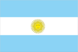
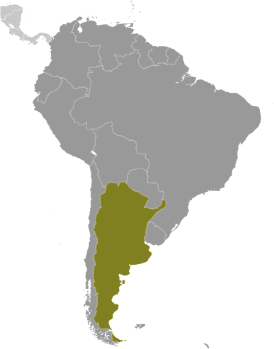
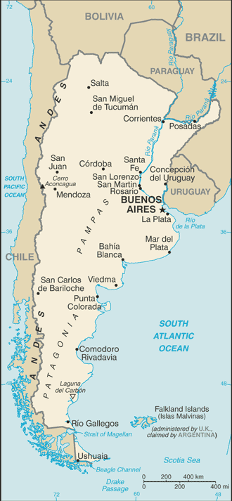

# Argentina

## Introduction

**_Background:_**   
In 1816, the United Provinces of the Rio Plata declared their independence from Spain. After Bolivia, Paraguay, and Uruguay went their separate ways, the area that remained became Argentina. The country's population and culture were heavily shaped by immigrants from throughout Europe, with Italy and Spain providing the largest percentage of newcomers from 1860 to 1930. Up until about the mid-20th century, much of Argentina's history was dominated by periods of internal political conflict between Federalists and Unitarians and between civilian and military factions. After World War II, an era of Peronist populism and direct and indirect military interference in subsequent governments was followed by a military junta that took power in 1976. Democracy returned in 1983 after a failed bid to seize the Falkland Islands (Islas Malvinas) by force, and has persisted despite numerous challenges, the most formidable of which was a severe economic crisis in 2001-02 that led to violent public protests and the successive resignations of several presidents. In January 2013, Argentina assumed a nonpermanent seat on the UN Security Council for the 2013-14 term.

## Geography

**_Location:_**   
Southern South America, bordering the South Atlantic Ocean, between Chile and Uruguay

**_Geographic coordinates:_**   
34 00 S, 64 00 W

**_Map references:_**   
South America

**_Area:_**   
**total:** 2,780,400 sq km   
**land:** 2,736,690 sq km   
**water:** 43,710 sq km

**_Area - comparative:_**   
slightly less than three-tenths the size of the US

**_Land boundaries:_**   
**total:** 11,968 km   
**border countries:** Bolivia 942 km, Brazil 1,263 km, Chile 6,691 km, Paraguay 2,531 km, Uruguay 541 km

**_Coastline:_**   
4,989 km

**_Maritime claims:_**   
**territorial sea:** 12 nm   
**contiguous zone:** 24 nm   
**exclusive economic zone:** 200 nm   
**continental shelf:** 200 nm or to the edge of the continental margin

**_Climate:_**   
mostly temperate; arid in southeast; subantarctic in southwest

**_Terrain:_**   
rich plains of the Pampas in northern half, flat to rolling plateau of Patagonia in south, rugged Andes along western border

**_Elevation extremes:_**   
**lowest point:** Laguna del Carbon -105 m (located between Puerto San Julian and Comandante Luis Piedra Buena in the province of Santa Cruz)   
**highest point:** Cerro Aconcagua 6,960 m (located in the northwestern corner of the province of Mendoza; highest point in South America)

**_Natural resources:_**   
fertile plains of the pampas, lead, zinc, tin, copper, iron ore, manganese, petroleum, uranium

**_Land use:_**   
**arable land:** 13.68%   
**permanent crops:** 0.36%   
**other:** 85.96% (2011)

**_Irrigated land:_**   
15,500 sq km (2003)

**_Total renewable water resources:_**   
814 cu km (2011)

**_Freshwater withdrawal (domestic/industrial/agricultural):_**   
**total:** 32.57 cu km/yr (23%/13%/64%)   
**per capita:** 864.9 cu m/yr (2005)

**_Natural hazards:_**   
San Miguel de Tucuman and Mendoza areas in the Andes subject to earthquakes; pamperos are violent windstorms that can strike the pampas and northeast; heavy flooding in some areas   
**volcanism:** volcanic activity in the Andes Mountains along the Chilean border; Copahue (elev. 2,997 m) last erupted in 2000; other historically active volcanoes include Llullaillaco, Maipo, Planchon-Peteroa, San Jose, Tromen, Tupungatito, and Viedma

**_Environment - current issues:_**   
environmental problems (urban and rural) typical of an industrializing economy such as deforestation, soil degradation, desertification, air pollution, and water pollution   
**note:** Argentina is a world leader in setting voluntary greenhouse gas targets

**_Environment - international agreements:_**   
**party to:** Antarctic-Environmental Protocol, Antarctic-Marine Living Resources, Antarctic Seals, Antarctic Treaty, Biodiversity, Climate Change, Climate Change-Kyoto Protocol, Desertification, Endangered Species, Environmental Modification, Hazardous Wastes, Law of the Sea, Marine Dumping, Ozone Layer Protection, Ship Pollution, Wetlands, Whaling   
**signed, but not ratified:** Marine Life Conservation

**_Geography - note:_**   
second-largest country in South America (after Brazil); strategic location relative to sea lanes between the South Atlantic and the South Pacific Oceans (Strait of Magellan, Beagle Channel, Drake Passage); diverse geophysical landscapes range from tropical climates in the north to tundra in the far south; Cerro Aconcagua is the Western Hemisphere's tallest mountain, while Laguna del Carbon is the lowest point in the Western Hemisphere

## People and Society

**_Nationality:_**   
**noun:** Argentine(s)   
**adjective:** Argentine

**_Ethnic groups:_**   
white (mostly Spanish and Italian) 97%, mestizo (mixed white and Amerindian ancestry), Amerindian, or other non-white groups 3%

**_Languages:_**   
Spanish (official), Italian, English, German, French, indigenous (Mapudungun, Quechua)

**_Religions:_**   
nominally Roman Catholic 92% (less than 20% practicing), Protestant 2%, Jewish 2%, other 4%

**_Demographic profile:_**   
Argentina's population continues to grow but at a slower rate because of its steadily declining birth rate. Argentina's fertility decline began earlier than in the rest of Latin America, occurring most rapidly between the early 20th century and the 1950s and then becoming more gradual. Life expectancy has been improving, most notably among the young and the poor. While the population under age 15 is shrinking, the youth cohort - ages 15-24 - is the largest in Argentina's history and will continue to bolster the working-age population. If this large working-age population is well-educated and gainfully employed, Argentina is likely to experience an economic boost and possibly higher per capita savings and investment. Although literacy and primary school enrollment are nearly universal, grade repetition is problematic and secondary school completion is low. Both of these issues vary widely by region and socioeconomic group.   
Argentina has been primarily a country of immigration for most of its history, welcoming European immigrants after its independence in the 19th century and attracting especially large numbers from Spain and Italy. European immigration diminished in the 1950s, when Argentina's military dictatorships tightened immigration rules and European economies rebounded. Regional migration, however, continued to supply low-skilled workers and today it accounts for three-quarters of Argentina's immigrant population. The first waves of highly skilled Argentine emigrant workers headed mainly to the United States and Spain in the 1960s and 1970s. The ongoing European economic crisis is driving the return migration of some Argentinean and other Latin American nationals, as well as the immigration of Europeans to South America, where Argentina is a key recipient.

**_Population:_**   
43,024,374 (July 2014 est.)

**_Age structure:_**   
**0-14 years:** 24.9% (male 5,486,989/female 5,233,968)   
**15-24 years:** 15.7% (male 3,445,086/female 3,301,168)   
**25-54 years:** 38.9% (male 8,345,893/female 8,391,445)   
**55-64 years:** 9.1% (male 1,895,965/female 2,017,330)   
**65 years and over:** 11.4% (male 2,036,545/female 2,869,985) (2014 est.)

**_Dependency ratios:_**   
**total dependency ratio:** 54.1 %   
**youth dependency ratio:** 37 %   
**elderly dependency ratio:** 17.1 %   
**potential support ratio:** 5.9 (2014 est.)

**_Median age:_**   
**total:** 31.2 years   
**male:** 30.1 years   
**female:** 32.3 years (2014 est.)

**_Population growth rate:_**   
0.95% (2014 est.)

**_Birth rate:_**   
16.88 births/1,000 population (2014 est.)

**_Death rate:_**   
7.34 deaths/1,000 population (2014 est.)

**_Net migration rate:_**   
0 migrant(s)/1,000 population (2014 est.)

**_Urbanization:_**   
**urban population:** 92.5% of total population (2011)   
**rate of urbanization:** 1.01% annual rate of change (2010-15 est.)

**_Major urban areas - population:_**   
BUENOS AIRES (capital) 13.528 million; Cordoba 1.556 million; Rosario 1.283 million; Mendoza 957,000; San Miguel de Tucuman 868,000; La Plata 759,000 (2011)

**_Sex ratio:_**   
**at birth:** 1.05 male(s)/female   
**0-14 years:** 1.05 male(s)/female   
**15-24 years:** 1.04 male(s)/female   
**25-54 years:** 1 male(s)/female   
**55-64 years:** 0.97 male(s)/female   
**65 years and over:** 0.7 male(s)/female   
**total population:** 0.97 male(s)/female (2014 est.)

**_Maternal mortality rate:_**   
77 deaths/100,000 live births (2010)

**_Infant mortality rate:_**   
**total:** 9.96 deaths/1,000 live births   
**male:** 11.15 deaths/1,000 live births   
**female:** 8.71 deaths/1,000 live births (2014 est.)

**_Life expectancy at birth:_**   
**total population:** 77.51 years   
**male:** 74.28 years   
**female:** 80.91 years (2014 est.)

**_Total fertility rate:_**   
2.25 children born/woman (2014 est.)

**_Contraceptive prevalence rate:_**   
78.9% (2004/05)

**_Health expenditures:_**   
8.1% of GDP (2011)

**_Physicians density:_**   
3.16 physicians/1,000 population (2004)

**_Hospital bed density:_**   
4.5 beds/1,000 population (2011)

**_Drinking water source:_**   
**improved:** urban: 99% of population; rural: 95.3% of population; total: 98.7% of population   
**unimproved:** urban: 1% of population; rural: 4.7% of population; total: 1.3% of population (2012 est.)

**_Sanitation facility access:_**   
**improved:** urban: 97.1% of population; rural: 99.4% of population; total: 97.2% of population   
**unimproved:** urban: 2.9% of population; rural: 0.6% of population; total: 2.8% of population (2012 est.)

**_HIV/AIDS - adult prevalence rate:_**   
0.4% (2012 est.)

**_HIV/AIDS - people living with HIV/AIDS:_**   
97,900 (2012 est.)

**_HIV/AIDS - deaths:_**   
3,700 (2012 est.)

**_Obesity - adult prevalence rate:_**   
29.7% (2008)

**_Children under the age of 5 years underweight:_**   
2.3% (2005)

**_Education expenditures:_**   
6.3% of GDP (2011)

**_Literacy:_**   
**definition:** age 10 and over can read and write   
**total population:** 97.9%   
**male:** 97.8%   
**female:** 97.9% (2011 est.)

**_School life expectancy (primary to tertiary education):_**   
**total:** 17 years   
**male:** 16 years   
**female:** 18 years (2011)

**_Child labor - children ages 5-14:_**   
**total number:** 435,252   
**percentage:** 7 %   
**note:** data represents children ages 5-13 (2003 est.)

**_Unemployment, youth ages 15-24:_**   
**total:** 18.3%   
**male:** 15.3%   
**female:** 23.1% (2011)

## Government

**_Country name:_**   
**conventional long form:** Argentine Republic   
**conventional short form:** Argentina   
**local long form:** Republica Argentina   
**local short form:** Argentina

**_Government type:_**   
republic

**_Capital:_**   
**name:** Buenos Aires   
**geographic coordinates:** 34 35 S, 58 40 W   
**time difference:** UTC-3 (2 hours ahead of Washington, DC, during Standard Time)   
**daylight saving time:** none scheduled for 2014

**_Administrative divisions:_**   
23 provinces (provincias, singular - provincia) and 1 autonomous city\*; Buenos Aires, Catamarca, Chaco, Chubut, Ciudad Autonoma de Buenos Aires\*, Cordoba, Corrientes, Entre Rios, Formosa, Jujuy, La Pampa, La Rioja, Mendoza, Misiones, Neuquen, Rio Negro, Salta, San Juan, San Luis, Santa Cruz, Santa Fe, Santiago del Estero, Tierra del Fuego - Antartida e Islas del Atlantico Sur (Tierra del Fuego), Tucuman   
**note:** the US does not recognize any claims to Antarctica

**_Independence:_**   
9 July 1816 (from Spain)

**_National holiday:_**   
Revolution Day, 25 May (1810)

**_Constitution:_**   
several previous; latest effective 11 May 1853; amended many times, last in 1994 (2013)

**_Legal system:_**   
civil law system based on West European legal systems; note - as of January 2013, Congress was deliberating a government-backed reform to the civil code

**_International law organization participation:_**   
has not submitted an ICJ jurisdiction declaration; accepts ICCt jurisdiction

**_Suffrage:_**   
18-70 years of age; universal and compulsory; 16-17 years of age - optional

**_Executive branch:_**   
**chief of state:** President Cristina FERNANDEZ DE KIRCHNER (since 10 December 2007); Vice President Amado BOUDOU (since 10 December 2011); note - the president is both chief of state and head of government   
**head of government:** President Cristina FERNANDEZ DE KIRCHNER (since 10 December 2007); Vice President Amado BOUDOU (since 10 December 2011)   
**cabinet:** Cabinet appointed by the president   
**elections:** president and vice president elected on the same ticket by popular vote for four-year terms (eligible for a second consecutive term); election last held on 23 October 2011 (next election to be held in October 2015)   
**election results:** Cristina FERNANDEZ DE KIRCHNER reelected president; percent of vote - Cristina FERNANDEZ DE KIRCHNER 54%, Hermes BINNER 16.9%, Ricardo ALFONSIN 11.1%, Alberto Rodriguez SAA 8%, Eduardo DUHALDE 5.9%, other 4.1%

**_Legislative branch:_**   
bicameral National Congress or Congreso Nacional consists of the Senate (72 seats; members are elected by direct vote; presently one-third of the members elected every two years to serve six-year terms) and the Chamber of Deputies (257 seats; members are elected by direct vote; one-half of the members elected every two years to serve four-year terms)   
**elections:** Senate - last held on 27 October 2013 (next to be held October 2015); Chamber of Deputies - last held on 27 October 2013 (next to be held October 2015)   
**election results:** Senate - percent of vote by bloc or party - NA; seats by bloc or party - FpV 32, UCR 17, dissident Peronists 7, FAP and UNEN 7, FpV allies 6, PRO and allies 3, other 6; Chamber of Deputies - percent of vote by bloc or party - NA; seats by bloc or party - FpV 18, FpV allies 14, UCR 10, dissident Peronists 34, FAP and UNEN 21, PRO 16, CC 3, other 14

**_Judicial branch:_**   
**highest court(s):** Supreme Court or Corte Suprema (consists of the court president, vice-president, and 5 judges); note - Argentina has a system of federal and provincial courts   
**judge selection and term of office:** judges nominated by the president and approved by the Senate; judges serve for life   
**subordinate courts:** federal level appellate, district, and territorial courts; provincial level supreme, appellate, and first instance courts

**_Political parties and leaders:_**   
Broad Progressive Front or FAP [Hermes BINNER]   
Civic Coalition or CC (a broad coalition loosely affiliated with Elisa CARRIO)   
Dissident Peronists (PJ Disidente) or Federal Peronism (a sector of the Justicialist Party opposed to the Kirchners)   
Front for Victory or FpV (a broad coalition, including elements of the PJ, UCR, and numerous provincial parties) [Cristina FERNANDEZ DE KIRCHNER]   
Peronist (or Justicialist) Party or PJ [vacant]   
Radical Civic Union or UCR [Mario BARLETTA]   
Republican Proposal or PRO [Mauricio MACRI]   
Socialist Party or PS [Ruben GIUSTINIANI]   
numerous provincial parties

**_Political pressure groups and leaders:_**   
Argentine Association of Pharmaceutical Labs (CILFA)   
Argentine Industrial Union (manufacturers' association)   
Argentine Rural Confederation or CRA (small to medium landowners' association)   
Argentine Rural Society (large landowners' association)   
Central of Argentine Workers or CTA (a union for employed and unemployed workers)   
General Confederation of Labor or CGT (Peronist-leaning umbrella labor organization)   
Roman Catholic Church   
White and Blue CGT (dissident CGT labor confederation)   
**other:** business organizations, Peronist-dominated labor movement, Piquetero groups (popular protest organizations that can be either pro or anti-government), students

**_International organization participation:_**   
AfDB (nonregional member), Australia Group, BCIE, BIS, CAN (associate), CD, CELAC, FAO, FATF, G-15, G-20, G-24, G-77, IADB, IAEA, IBRD, ICAO, ICC (national committees), ICRM, IDA, IFAD, IFC, IFRCS, IHO, ILO, IMF, IMO, IMSO, Interpol, IOC, IOM, IPU, ISO, ITSO, ITU, ITUC (NGOs), LAES, LAIA, Mercosur, MIGA, MINURSO, MINUSTAH, NAM (observer), NSG, OAS, OPANAL, OPCW, Paris Club (associate), PCA, SICA (observer), UN, UN Security Council (temporary), UNASUR, UNCTAD, UNESCO, UNFICYP, UNHCR, UNIDO, Union Latina (observer), UNTSO, UNWTO, UPU, WCO, WFTU (NGOs), WHO, WIPO, WMO, WTO, ZC

**_Diplomatic representation in the US:_**   
**chief of mission:** Ambassador Maria Cecilia NAHON (since 19 February 2013)   
**chancery:** 1600 New Hampshire Avenue NW, Washington, DC 20009   
**telephone:** [1] (202) 238-6400   
**FAX:** [1] (202) 332-3171   
**consulate(s) general:** Atlanta, Chicago, Houston, Los Angeles, Miami, New York

**_Diplomatic representation from the US:_**   
**chief of mission:** Ambassador (vacant); Charge d'Affaires Kevin K. SULLIVAN (since June 2013)   
**embassy:** Avenida Colombia 4300, C1425GMN Buenos Aires   
**mailing address:** international mail: use embassy street address; APO address: US Embassy Buenos Aires, Unit 4334, APO AA 34034   
**telephone:** [54] (11) 5777-4533   
**FAX:** [54] (11) 5777-4240

**_Flag description:_**   
three equal horizontal bands of light blue (top), white, and light blue; centered in the white band is a radiant yellow sun with a human face known as the Sun of May; the colors represent the clear skies and snow of the Andes; the sun symbol commemorates the appearance of the sun through cloudy skies on 25 May 1810 during the first mass demonstration in favor of independence; the sun features are those of Inti, the Inca god of the sun

**_National symbol(s):_**   
Sun of May (a sun-with-face symbol)

**_National anthem:_**   
**name:** "Himno Nacional Argentino" (Argentine National Anthem)   
**lyrics/music:** Vicente LOPEZ y PLANES/Jose Blas PARERA   
**note:** adopted 1813; Vicente LOPEZ was inspired to write the anthem after watching a play about the 1810 May Revolution against Spain

## Economy

**_Economy - overview:_**   
Argentina benefits from rich natural resources, a highly literate population, an export-oriented agricultural sector, and a diversified industrial base. Although one of the world's wealthiest countries 100 years ago, Argentina suffered during most of the 20th century from recurring economic crises, persistent fiscal and current account deficits, high inflation, mounting external debt, and capital flight. A severe depression, growing public and external indebtedness, and an unprecedented bank run culminated in 2001 in the most serious economic, social, and political crisis in the country's turbulent history. Interim President Adolfo RODRIGUEZ SAA declared a default - at the time the largest ever - on the government's foreign debt in December of that year, and abruptly resigned only a few days after taking office. His successor, Eduardo DUHALDE, announced an end to the peso's decade-long 1-to-1 peg to the US dollar in early 2002. The economy bottomed out that year, with real GDP 18% smaller than in 1998 and almost 60% of Argentines under the poverty line. Real GDP rebounded to grow by an average 8.5% annually over the subsequent six years, taking advantage of previously idled industrial capacity and labor, an audacious debt restructuring and reduced debt burden, excellent international financial conditions, and expansionary monetary and fiscal policies. Inflation also increased, however, during the administration of President Nestor KIRCHNER, which responded with price restraints on businesses, as well as export taxes and restraints, and beginning in 2007, with understating inflation data. Cristina FERNANDEZ DE KIRCHNER succeeded her husband as President in late 2007, and the rapid economic growth of previous years began to slow sharply the following year as government policies held back exports and the world economy fell into recession. The economy in 2010 rebounded strongly from the 2009 recession, but has slowed since late 2011 even as the government continued to rely on expansionary fiscal and monetary policies, which have kept inflation in the double digits. The government expanded state intervention in the economy throughout 2012. In May 2012 the Congress approved the nationalization of the oil company YPF from Spain's Repsol. The government expanded formal and informal measures to restrict imports during the year, including a requirement for pre-registration and pre-approval of all imports. In July 2012 the government also further tightened currency controls in an effort to bolster foreign reserves and stem capital flight. During 2013, the government continued with a mix expansionary fiscal and monetary policies and foreign exchange and imports controls to limit the drain in Central Bank foreign reserves, which nevertheless dropped US $12 billion during the year. GDP grew 3% and inflation remained steady at 25%, according to private estimates. In October 2013, the government settled long-standing international arbitral disputes (including with three US firms) dating back to before and following the 2002 Argentine financial crisis. In early 2014, the government embraced a series of more orthodox economic policies. It devalued the peso 20%, substantially tightened monetary and fiscal policies, and took measures to mend ties with the international financial community, including: engaging with the IMF to improve its economic data reporting, reaching a compensation agreement with Repsol for the expropriation of YPF, and presenting a proposal to pay its arrears to the Paris Club.

**_GDP (purchasing power parity):_**   
$771 billion (2013 est.)   
$745.2 billion (2012 est.)   
$731.3 billion (2011 est.)   
**note:** data are in 2013 US dollars

**_GDP (official exchange rate):_**   
$484.6 billion (2013 est.)

**_GDP - real growth rate:_**   
3.5% (2013 est.)   
1.9% (2012 est.)   
8.9% (2011 est.)

**_GDP - per capita (PPP):_**   
$18,600 (2013 est.)   
$18,200 (2012 est.)   
$18,000 (2011 est.)   
**note:** data are in 2013 US dollars

**_Gross national saving:_**   
24.6% of GDP (2013 est.)   
24% of GDP (2012 est.)   
25.6% of GDP (2011 est.)

**_GDP - composition, by end use:_**   
**household consumption:** 55.5%   
**government consumption:** 18%   
**investment in fixed capital:** 22%   
**investment in inventories:** 3.1%   
**exports of goods and services:** 20.3%   
**imports of goods and services:** -18.9%; (2013 est.)

**_GDP - composition, by sector of origin:_**   
**agriculture:** 9.3%   
**industry:** 29.7%   
**services:** 61% (2013 est.)

**_Agriculture - products:_**   
sunflower seeds, lemons, soybeans, grapes, corn, tobacco, peanuts, tea, wheat; livestock

**_Industries:_**   
food processing, motor vehicles, consumer durables, textiles, chemicals and petrochemicals, printing, metallurgy, steel

**_Industrial production growth rate:_**   
2.7%   
**note:** based on private sector estimates (2013 est.)

**_Labor force:_**   
17.32 million   
**note:** urban areas only (2013 est.)

**_Labor force - by occupation:_**   
**agriculture:** 5%   
**industry:** 23%   
**services:** 72% (2009 est.)

**_Unemployment rate:_**   
7.5% (2013 est.)   
7.2% (2012 est.)

**_Population below poverty line:_**   
30%   
**note:** data are based on private estimates (2010)

**_Household income or consumption by percentage share:_**   
**lowest 10%:** 1.5%   
**highest 10%:** 32.3% (2010 est.)

**_Distribution of family income - Gini index:_**   
45.8 (2009)

**_Budget:_**   
**revenues:** $129.6 billion   
**expenditures:** $145.3 billion (2013 est.)

**_Taxes and other revenues:_**   
26.8% of GDP (2013 est.)

**_Budget surplus (+) or deficit (-):_**   
-3.2% of GDP (2013 est.)

**_Public debt:_**   
45.8% of GDP (2013 est.)   
44.8% of GDP (2012 est.)

**_Fiscal year:_**   
calendar year

**_Inflation rate (consumer prices):_**   
20.8% (2013 est.)   
25.3% (2012 est.)   
**note:** data are derived from private estimates

**_Central bank discount rate:_**   
NA%

**_Commercial bank prime lending rate:_**   
16.4% (31 December 2013 est.)   
14.06% (31 December 2012 est.)

**_Stock of narrow money:_**   
$70.25 billion (31 December 2013 est.)   
$65.63 billion (31 December 2012 est.)

**_Stock of broad money:_**   
$145 billion (31 December 2013 est.)   
$145.9 billion (31 December 2012 est.)

**_Stock of domestic credit:_**   
$157.7 billion (31 December 2013 est.)   
NA% (31 December 2012 est.)

**_Market value of publicly traded shares:_**   
$34.24 billion (31 December 2012 est.)   
$43.58 billion (31 December 2011)   
$63.91 billion (31 December 2010 est.)

**_Current account balance:_**   
-$2.371 billion (2013 est.)   
$106.9 million (2012 est.)

**_Exports:_**   
$85.08 billion (2013 est.)   
$80.91 billion (2012 est.)

**_Exports - commodities:_**   
soybeans and derivatives, petroleum and gas, vehicles, corn, wheat

**_Exports - partners:_**   
Brazil 20.4%, China 7.4%, Chile 6%, US 5.2% (2012)

**_Imports:_**   
$71.3 billion (2013 est.)   
$65.55 billion (2012 est.)

**_Imports - commodities:_**   
machinery, motor vehicles, petroleum and natural gas, organic chemicals, plastics

**_Imports - partners:_**   
Brazil 27.2%, US 15.6%, China 11.9%, Germany 4.5% (2012)

**_Reserves of foreign exchange and gold:_**   
$33.65 billion (31 December 2013 est.)   
$43.25 billion (31 December 2012 est.)

**_Debt - external:_**   
$111.5 billion (31 December 2013 est.)   
$113.7 billion (31 December 2012 est.)

**_Stock of direct foreign investment - at home:_**   
$115.9 billion (31 December 2013 est.)   
$107.1 billion (31 December 2012 est.)

**_Stock of direct foreign investment - abroad:_**   
$34.21 billion (31 December 2013 est.)   
$32.91 billion (31 December 2012 est.)

**_Exchange rates:_**   
Argentine pesos (ARS) per US dollar -   
5.447 (2013 est.)   
4.5369 (2012 est.)   
3.8963 (2010 est.)   
3.7101 (2009)   
3.1636 (2008)

## Energy

**_Electricity - production:_**   
119.3 billion kWh (2010 est.)

**_Electricity - consumption:_**   
111.1 billion kWh (2010 est.)

**_Electricity - exports:_**   
1.701 billion kWh (2010 est.)

**_Electricity - imports:_**   
10.3 billion kWh (2010 est.)

**_Electricity - installed generating capacity:_**   
32.87 million kW (2010 est.)

**_Electricity - from fossil fuels:_**   
66.2% of total installed capacity (2010 est.)

**_Electricity - from nuclear fuels:_**   
3.1% of total installed capacity (2010 est.)

**_Electricity - from hydroelectric plants:_**   
27.6% of total installed capacity (2010 est.)

**_Electricity - from other renewable sources:_**   
0.2% of total installed capacity (2010 est.)

**_Crude oil - production:_**   
723,200 bbl/day (2012 est.)

**_Crude oil - exports:_**   
90,920 bbl/day (2010 est.)

**_Crude oil - imports:_**   
0 bbl/day (2010 est.)

**_Crude oil - proved reserves:_**   
2.805 billion bbl (1 January 2013 est.)

**_Refined petroleum products - production:_**   
622,200 bbl/day (2010 est.)

**_Refined petroleum products - consumption:_**   
678,100 bbl/day (2011 est.)

**_Refined petroleum products - exports:_**   
94,500 bbl/day (2010 est.)

**_Refined petroleum products - imports:_**   
76,550 bbl/day (2010 est.)

**_Natural gas - production:_**   
38.77 billion cu m (2011 est.)

**_Natural gas - consumption:_**   
43.29 billion cu m (2010 est.)

**_Natural gas - exports:_**   
200 million cu m (2011 est.)

**_Natural gas - imports:_**   
7.57 billion cu m (2011 est.)

**_Natural gas - proved reserves:_**   
332.5 billion cu m (1 January 2013 est.)

**_Carbon dioxide emissions from consumption of energy:_**   
190.6 million Mt (2011 est.)

## Communications

**_Telephones - main lines in use:_**   
10 million (2012)

**_Telephones - mobile cellular:_**   
58.6 million (2012)

**_Telephone system:_**   
**general assessment:** in 1998 Argentina opened its telecommunications market to competition and foreign investment encouraging the growth of modern telecommunications technology; fiber-optic cable trunk lines are being installed between all major cities; major networks are entirely digital and the availability of telephone service is improving   
**domestic:** microwave radio relay, fiber-optic cable, and a domestic satellite system with 40 earth stations serve the trunk network; fixed-line teledensity is increasing gradually and mobile-cellular subscribership is increasing rapidly; broadband Internet services are gaining ground   
**international:** country code - 54; landing point for the Atlantis-2, UNISUR, South America-1, and South American Crossing/Latin American Nautilus submarine cable systems that provide links to Europe, Africa, South and Central America, and US; satellite earth stations - 112; 2 international gateways near Buenos Aires (2011)

**_Broadcast media:_**   
government owns a TV station and a radio network; more than 2 dozen TV stations and hundreds of privately owned radio stations; high rate of cable TV subscription usage (2007)

**_Internet country code:_**   
.ar

**_Internet hosts:_**   
11.232 million (2012)

**_Internet users:_**   
13.694 million (2009)

## Transportation

**_Airports:_**   
1,138 (2013)

**_Airports - with paved runways:_**   
**total:** 161   
**over 3,047 m:** 4   
**2,438 to 3,047 m:** 29   
**1,524 to 2,437 m:** 65   
**914 to 1,523 m:** 53   
**under 914 m:** 10 (2013)

**_Airports - with unpaved runways:_**   
**total:** 977   
**over 3,047 m:** 1   
**2,438 to 3,047 m:** 1   
**1,524 to 2,437 m:** 43   
**914 to 1,523 m:** 484   
**under 914 m:** 448 (2013)

**_Heliports:_**   
2 (2013)

**_Pipelines:_**   
gas 29,930 km; liquid petroleum gas 41 km; oil 6,248 km; refined products 3,631 km (2013)

**_Railways:_**   
**total:** 36,966 km   
**broad gauge:** 26,475 km 1.676-m gauge (94 km electrified)   
**standard gauge:** 2,780 km 1.435-m gauge (42 km electrified)   
**narrow gauge:** 7,711 km 1.000-m gauge (2008)

**_Roadways:_**   
**total:** 231,374 km   
**paved:** 69,412 km (includes 734 km of expressways)   
**unpaved:** 161,962 km (2004)

**_Waterways:_**   
11,000 km (2012)

**_Merchant marine:_**   
**total:** 36   
**by type:** bulk carrier 1, cargo 5, chemical tanker 6, container 1, passenger/cargo 1, petroleum tanker 18, refrigerated cargo 4   
**foreign-owned:** 14 (Brazil 1, Chile 6, Spain 3, Taiwan 2, UK 2)   
**registered in other countries:** 15 (Liberia 1, Panama 5, Paraguay 5, Uruguay 1, unknown 3) (2010)

**_Ports and terminals:_**   
**major seaport(s):** Bahia Blanca, Buenos Aires, La Plata, Punta Colorada, Ushuaia   
**river port(s):** Arroyo Seco, Rosario, San Lorenzo-San Martin (Parana)   
**container port(s) (TEUs):** Buenos Aires (1,851,701)   
**LNG terminal(s) (import):** Bahia Blanca

## Military

**_Military branches:_**   
Argentine Army (Ejercito Argentino), Navy of the Argentine Republic (Armada Republica; includes naval aviation and naval infantry), Argentine Air Force (Fuerza Aerea Argentina, FAA) (2013)

**_Military service age and obligation:_**   
18-24 years of age for voluntary military service (18-21 requires parental consent); no conscription; if the number of volunteers fails to meet the quota of recruits for a particular year, Congress can authorize the conscription of citizens turning 18 that year for a period not exceeding one year (2012)

**_Manpower available for military service:_**   
**males age 16-49:** 10,038,967   
**females age 16-49:** 9,959,134 (2010 est.)

**_Manpower fit for military service:_**   
**males age 16-49:** 8,458,362   
**females age 16-49:** 8,414,460 (2010 est.)

**_Manpower reaching militarily significant age annually:_**   
**male:** 339,503   
**female:** 323,170 (2010 est.)

**_Military expenditures:_**   
0.91% of GDP (2012)   
0.9% of GDP (2011)   
0.91% of GDP (2010)

**_Military - note:_**   
the Argentine military is a well-organized force constrained by the country's prolonged economic hardship; the country has recently experienced a strong recovery, and the military is implementing a modernization plan aimed at making the ground forces lighter and more responsive (2008)

## Transnational Issues

**_Disputes - international:_**   
Argentina continues to assert its claims to the UK-administered Falkland Islands (Islas Malvinas), South Georgia, and the South Sandwich Islands in its constitution, forcibly occupying the Falklands in 1982, but in 1995 agreed to no longer seek settlement by force; UK continues to reject Argentine requests for sovereignty talks; territorial claim in Antarctica partially overlaps UK and Chilean claims; uncontested dispute between Brazil and Uruguay over Braziliera/Brasiliera Island in the Quarai/Cuareim River leaves the tripoint with Argentina in question; in 2010, the ICJ ruled in favor of Uruguay's operation of two paper mills on the Uruguay River, which forms the border with Argentina; the two countries formed a joint pollution monitoring regime; the joint boundary commission, established by Chile and Argentina in 2001 has yet to map and demarcate the delimited boundary in the inhospitable Andean Southern Ice Field (Campo de Hielo Sur); contraband smuggling, human trafficking, and illegal narcotic trafficking are problems in the porous areas of the border with Bolivia

**_Illicit drugs:_**   
a transshipment country for cocaine headed for Europe, heroin headed for the US, and ephedrine and pseudoephedrine headed for Mexico; some money-laundering activity, especially in the Tri-Border Area; law enforcement corruption; a source for precursor chemicals; increasing domestic consumption of drugs in urban centers, especially cocaine base and synthetic drugs (2008)

............................................................   
_Page last updated on June 23, 2014_
