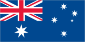

# Australia

## Introduction

**_Background:_**   
Prehistoric settlers arrived on the continent from Southeast Asia at least 40,000 years before the first Europeans began exploration in the 17th century. No formal territorial claims were made until 1770, when Capt. James COOK took possession of the east coast in the name of Great Britain (all of Australia was claimed as British territory in 1829 with the creation of the colony of Western Australia). Six colonies were created in the late 18th and 19th centuries; they federated and became the Commonwealth of Australia in 1901. The new country took advantage of its natural resources to rapidly develop agricultural and manufacturing industries and to make a major contribution to the Allied effort in World Wars I and II. In recent decades, Australia has become an internationally competitive, advanced market economy due in large part to economic reforms adopted in the 1980s and its location in one of the fastest growing regions of the world economy. Long-term concerns include aging of the population, pressure on infrastructure, and environmental issues such as floods, droughts, and bushfires. Australia is the driest inhabited continent on earth, making it particularly vulnerable to the challenges of climate change. Australia is home to 10 per cent of the world's biodiversity, and a great number of its flora and fauna exist nowhere else in the world. In January 2013, Australia assumed a nonpermanent seat on the UN Security Council for the 2013-14 term.

## Geography

**_Location:_**   
Oceania, continent between the Indian Ocean and the South Pacific Ocean

**_Geographic coordinates:_**   
27 00 S, 133 00 E

**_Map references:_**   
Oceania

**_Area:_**   
**total:** 7,741,220 sq km   
**land:** 7,682,300 sq km   
**water:** 58,920 sq km   
**note:** includes Lord Howe Island and Macquarie Island

**_Area - comparative:_**   
slightly smaller than the US contiguous 48 states

**_Land boundaries:_**   
0 km

**_Coastline:_**   
25,760 km

**_Maritime claims:_**   
**territorial sea:** 12 nm   
**contiguous zone:** 24 nm   
**exclusive economic zone:** 200 nm   
**continental shelf:** 200 nm or to the edge of the continental margin

**_Climate:_**   
generally arid to semiarid; temperate in south and east; tropical in north

**_Terrain:_**   
mostly low plateau with deserts; fertile plain in southeast

**_Elevation extremes:_**   
**lowest point:** Lake Eyre -15 m   
**highest point:** Mount Kosciuszko 2,229 m

**_Natural resources:_**   
bauxite, coal, iron ore, copper, tin, gold, silver, uranium, nickel, tungsten, rare earth elements, mineral sands, lead, zinc, diamonds, natural gas, petroleum   
**note:** Australia is the world's largest net exporter of coal accounting for 29% of global coal exports

**_Land use:_**   
**arable land:** 6.16% (includes about 27 million hectares of cultivated grassland)   
**permanent crops:** 0.05%   
**other:** 93.79% (2011)

**_Irrigated land:_**   
25,460 sq km (2006)

**_Total renewable water resources:_**   
492 cu km (2011)

**_Freshwater withdrawal (domestic/industrial/agricultural):_**   
**total:** 22.58 cu km/yr (27%/18%/55%)   
**per capita:** 1,152 cu m/yr (2010)

**_Natural hazards:_**   
cyclones along the coast; severe droughts; forest fires   
**volcanism:** volcanic activity on Heard and McDonald Islands

**_Environment - current issues:_**   
soil erosion from overgrazing, industrial development, urbanization, and poor farming practices; soil salinity rising due to the use of poor quality water; desertification; clearing for agricultural purposes threatens the natural habitat of many unique animal and plant species; the Great Barrier Reef off the northeast coast, the largest coral reef in the world, is threatened by increased shipping and its popularity as a tourist site; limited natural freshwater resources

**_Environment - international agreements:_**   
**party to:** Antarctic-Environmental Protocol, Antarctic-Marine Living Resources, Antarctic Seals, Antarctic Treaty, Biodiversity, Climate Change, Climate Change-Kyoto Protocol, Desertification, Endangered Species, Environmental Modification, Hazardous Wastes, Law of the Sea, Marine Dumping, Marine Life Conservation, Ozone Layer Protection, Ship Pollution, Tropical Timber 83, Tropical Timber 94, Wetlands, Whaling   
**signed, but not ratified:** none of the selected agreements

**_Geography - note:_**   
world's smallest continent but sixth-largest country; the largest country in Oceania, the largest country entirely in the Southern Hemisphere, and the largest country without land borders; the only continent without glaciers; population concentrated along the eastern and southeastern coasts; the invigorating sea breeze known as the "Fremantle Doctor" affects the city of Perth on the west coast and is one of the most consistent winds in the world

## People and Society

**_Nationality:_**   
**noun:** Australian(s)   
**adjective:** Australian

**_Ethnic groups:_**   
white 92%, Asian 7%, aboriginal and other 1%

**_Languages:_**   
English 76.8%, Mandarin 1.6%, Italian 1.4%, Arabic 1.3%, Greek 1.2%, Cantonese 1.2%, Vietnamese 1.1%, other 10.4%, unspecified 5% (2011 est.)

**_Religions:_**   
Protestant 28.8% (Anglican 17.1%, Uniting Church 5.0%, Presbyterian and Reformed 2.8%, Baptist, 1.6%, Lutheran 1.2%, Pentecostal 1.1%), Catholic 25.3%, Eastern Orthodox 2.6%, other Christian 4.5%, Buddhist 2.5%, Muslim 2.2%, Hindu 1.3%, other 8.4%, unspecified 2.2%, none 22.3%   
**note:** percentages add up to more than 100% due to rounding (2006 est.)

**_Population:_**   
22,507,617 (July 2014 est.)

**_Age structure:_**   
**0-14 years:** 18% (male 2,075,316/female 1,969,645)   
**15-24 years:** 13.3% (male 1,534,947/female 1,457,250)   
**25-54 years:** 41.8% (male 4,783,473/female 4,626,603)   
**55-64 years:** 11.8% (male 1,321,246/female 1,341,329)   
**65 years and over:** 15.1% (male 1,569,197/female 1,828,611) (2014 est.)

**_Dependency ratios:_**   
**total dependency ratio:** 51 %   
**youth dependency ratio:** 28.9 %   
**elderly dependency ratio:** 22.1 %   
**potential support ratio:** 4.5 (2014 est.)

**_Median age:_**   
**total:** 38.3 years   
**male:** 37.5 years   
**female:** 39 years (2014 est.)

**_Population growth rate:_**   
1.09% (2014 est.)

**_Birth rate:_**   
12.19 births/1,000 population (2014 est.)

**_Death rate:_**   
7.07 deaths/1,000 population (2014 est.)

**_Net migration rate:_**   
5.74 migrant(s)/1,000 population (2014 est.)

**_Urbanization:_**   
**urban population:** 89.2% of total population (2011)   
**rate of urbanization:** 1.49% annual rate of change (2010-15 est.)

**_Major urban areas - population:_**   
Sydney 4.543 million; Melbourne 3.961 million; Brisbane 2.039 million; Perth 1.649 million; Adelaide 1.198 million; CANBERRA (capital) 399,000 (2011)

**_Sex ratio:_**   
**at birth:** 1.06 male(s)/female   
**0-14 years:** 1.05 male(s)/female   
**15-24 years:** 1.05 male(s)/female   
**25-54 years:** 1.03 male(s)/female   
**55-64 years:** 1.01 male(s)/female   
**65 years and over:** 0.85 male(s)/female   
**total population:** 1.01 male(s)/female (2014 est.)

**_Mother's mean age at first birth:_**   
30.5 (2006 est.)

**_Maternal mortality rate:_**   
7 deaths/100,000 live births (2010)

**_Infant mortality rate:_**   
**total:** 4.43 deaths/1,000 live births   
**male:** 4.74 deaths/1,000 live births   
**female:** 4.1 deaths/1,000 live births (2014 est.)

**_Life expectancy at birth:_**   
**total population:** 82.07 years   
**male:** 79.63 years   
**female:** 84.64 years (2014 est.)

**_Total fertility rate:_**   
1.77 children born/woman (2014 est.)

**_Contraceptive prevalence rate:_**   
72.3%   
**note:** percent of women aged 18-44 (2005)

**_Health expenditures:_**   
9% of GDP (2011)

**_Physicians density:_**   
3.85 physicians/1,000 population (2010)

**_Hospital bed density:_**   
3.9 beds/1,000 population (2010)

**_Drinking water source:_**   
**improved:** urban: 100% of population; rural: 100% of population; total: 100% of population   
**unimproved:** urban: 0% of population; rural: 0% of population; total: 0% of population (2012 est.)

**_Sanitation facility access:_**   
**improved:** urban: 100% of population; rural: 100% of population; total: 100% of population   
**unimproved:** urban: 0% of population; rural: 0% of population; total: 0% of population (2012 est.)

**_HIV/AIDS - adult prevalence rate:_**   
0.1% (2009 est.)

**_HIV/AIDS - people living with HIV/AIDS:_**   
20,000 (2009 est.)

**_HIV/AIDS - deaths:_**   
fewer than 100 (2009 est.)

**_Obesity - adult prevalence rate:_**   
26.8% (2008)

**_Children under the age of 5 years underweight:_**   
0.2% (2007)

**_Education expenditures:_**   
5.6% of GDP (2010)

**_Literacy:_**   
**definition:** age 15 and over can read and write   
**total population:** 99%   
**male:** 99%   
**female:** 99% (2003 est.)

**_School life expectancy (primary to tertiary education):_**   
**total:** 20 years   
**male:** 19 years   
**female:** 20 years (2011)

**_Unemployment, youth ages 15-24:_**   
**total:** 11.7%   
**male:** 12.4%   
**female:** 11% (2012)

## Government

**_Country name:_**   
**conventional long form:** Commonwealth of Australia   
**conventional short form:** Australia

**_Government type:_**   
federal parliamentary democracy and a Commonwealth realm

**_Capital:_**   
**name:** Canberra   
**geographic coordinates:** 35 16 S, 149 08 E   
**time difference:** UTC+10 (15 hours ahead of Washington, DC, during Standard Time)   
**daylight saving time:** +1hr, begins first Sunday in October; ends first Sunday in April   
**note:** Australia has three time zones

**_Administrative divisions:_**   
6 states and 2 territories\*; Australian Capital Territory\*, New South Wales, Northern Territory\*, Queensland, South Australia, Tasmania, Victoria, Western Australia

**_Dependent areas:_**   
Ashmore and Cartier Islands, Christmas Island, Cocos (Keeling) Islands, Coral Sea Islands, Heard Island and McDonald Islands, Macquarie Island, Norfolk Island

**_Independence:_**   
1 January 1901 (from the federation of UK colonies)

**_National holiday:_**   
Australia Day (commemorates the arrival of the First Fleet of Australian settlers), 26 January (1788); ANZAC Day (commemorates the anniversary of the landing of troops of the Australian and New Zealand Army Corps during World War I at Gallipoli, Turkey), 25 April (1915)

**_Constitution:_**   
9 July 1900; effective 1 January 1901; amended several times, last in 1977; note - a referendum to amend the constitution to reflect the Aboriginal and Torres Strait Islander Peoples Recognition Act 2013 is to be completed by the end of 2014 (2013)

**_Legal system:_**   
common law system based on the English model

**_International law organization participation:_**   
accepts compulsory ICJ jurisdiction with reservations; accepts ICCt jurisdiction

**_Suffrage:_**   
18 years of age; universal and compulsory

**_Executive branch:_**   
**chief of state:** Queen of Australia ELIZABETH II (since 6 February 1952); represented by Governor General Sir Peter COSGROVE (since 28 March 2014)   
**head of government:** Prime Minister Anthony John "Tony" ABBOTT (since 18 September 2013); Deputy Prime Minister Warren TRUSS (since 18 September 2013)   
**cabinet:** prime minister nominates, from among members of Parliament, candidates who are subsequently sworn in by the governor general to serve as government ministers   
**elections:** the monarchy is hereditary; governor general appointed by the monarch on the recommendation of the prime minister; following legislative elections, the leader of the majority party or leader of a majority coalition is sworn in as prime minister by the governor general

**_Legislative branch:_**   
bicameral Federal Parliament consists of the Senate (76 seats; 12 members from each of the six states and 2 from each of the two mainland territories; one-half of state members are elected every three years by popular vote to serve six-year terms while all territory members are elected every three years) and the House of Representatives (150 seats; members elected by popular vote to serve terms of up to three-years; no state can have fewer than 5 representatives)   
**elections:** Senate - last held on 7 September 2013; House of Representatives - last held on 7 September 2013 (the latest a simultaneous half-Senate and House of Representative elections can be held is 30 November 2016)   
**election results:** Senate NA; House of Representatives - percent of vote by party - Liberal/National Coalition 53.45%, Australian Labor Party 46.55%; seats by party - Liberal/National Coalition 90 (Liberal 58, Liberal National 22, Nationals 9, Country Liberals 1), Australian Labor Party 55, Australian Greens Party 1, Katter's Australian Party 1, Palmer United Party 1, independents 2

**_Judicial branch:_**   
**highest court(s):** High Court of Australia (consists of 7 justices, including the chief justice); note - each of the 6 states, 2 territories, and Norfolk Island has a Supreme Court; the High Court is the final appellate court beyond the state and territory supreme courts   
**judge selection and term of office:** justices appointed by the governor-general in council for life with mandatory retirement at age 70   
**subordinate courts:** subordinate courts at the federal level: Federal Court; Federal Magistrates' Courts of Australia; Family Court; subordinate courts at the state and territory level: Local Court - New South Wales; Magistrates' Courts – Victoria, Queensland, South Australia, Western Australia, Tasmania, Northern Territory, Australian Capital Territory; District Courts – New South Wales, Queensland, South Australia, Western Australia; County Court – Victoria; Family Court – Western Australia; Court of Petty Sessions – Norfolk Island

**_Political parties and leaders:_**   
Australian Greens Party [Christine MILNE]   
Australian Labor Party [Bill SHORTEN]   
Country Liberal Party [Terry MILLS]   
Family First Party [Steve FIELDING]   
Katter's Australian Party [Bob KATTER]   
Liberal National Party of Queensland [Campbell NEWMAN]   
Liberal Party [Tony ABBOTT]   
National Party of Australia [Warren TRUSS]   
Palmer United Party [Clive PALMER]

**_Political pressure groups and leaders:_**   
**other:** business groups, environmental groups, social groups, trade unions

**_International organization participation:_**   
ADB, ANZUS, APEC, ARF, ASEAN (dialogue partner), Australia Group, BIS, C, CD, CP, EAS, EBRD, EITI (implementing country), FAO, FATF, G-20, IAEA, IBRD, ICAO, ICC (national committees), ICRM, IDA, IEA, IFC, IFRCS, IHO, ILO, IMF, IMO, IMSO, Interpol, IOC, IOM, IPU, ISO, ITSO, ITU, ITUC (NGOs), MIGA, NEA, NSG, OECD, OPCW, OSCE (partner), Pacific Alliance (observer), Paris Club, PCA, PIF, SAARC (observer), SICA (observer), Sparteca, SPC, UN, UN Security Council (temporary), UNCTAD, UNESCO, UNHCR, UNMISS, UNMIT, UNRWA, UNTSO, UNWTO, UPU, WCO, WFTU (NGOs), WHO, WIPO, WMO, WTO, ZC

**_Diplomatic representation in the US:_**   
**chief of mission:** Ambassador Kim Christian BEAZLEY (since 7 February 2010)   
**chancery:** 1601 Massachusetts Avenue NW, Washington, DC 20036   
**telephone:** [1] (202) 797-3000   
**FAX:** [1] (202) 797-3168   
**consulate(s) general:** Atlanta, Chicago, Honolulu, Los Angeles, New York, San Francisco

**_Diplomatic representation from the US:_**   
**chief of mission:** Ambassador John BERRY (since 25 September 2013)   
**embassy:** Moonah Place, Yarralumla, Canberra, Australian Capital Territory 2600   
**mailing address:** APO AP 96549   
**telephone:** [61] (02) 6214-5600   
**FAX:** [61] (02) 6214-5970   
**consulate(s) general:** Melbourne, Perth, Sydney

**_Flag description:_**   
blue with the flag of the UK in the upper hoist-side quadrant and a large seven-pointed star in the lower hoist-side quadrant known as the Commonwealth or Federation Star, representing the federation of the colonies of Australia in 1901; the star depicts one point for each of the six original states and one representing all of Australia's internal and external territories; on the fly half is a representation of the Southern Cross constellation in white with one small, five-pointed star and four larger, seven-pointed stars

**_National symbol(s):_**   
Southern Cross constellation (five, seven-pointed stars); kangaroo; emu

**_National anthem:_**   
**name:** "Advance Australia Fair"   
**lyrics/music:** Peter Dodds McCORMICK   
**note:** adopted 1984; although originally written in the late 19th century, the anthem did not become used for all official occasions until 1984; as a Commonwealth country, in addition to the national anthem, "God Save the Queen" is also played at Royal functions (see United Kingdom)

## Economy

**_Economy - overview:_**   
The Australian economy has experienced continuous growth and features low unemployment, contained inflation, very low public debt, and a strong and stable financial system. By 2012, Australia had experienced more than 20 years of continued economic growth, averaging 3.5% a year. Demand for resources and energy from Asia and especially China has grown rapidly, creating a channel for resources investments and growth in commodity exports. The high Australian dollar has hurt the manufacturing sector, while the services sector is the largest part of the Australian economy, accounting for about 70% of GDP and 75% of jobs. Australia was comparatively unaffected by the global financial crisis as the banking system has remained strong and inflation is under control. Australia has benefited from a dramatic surge in its terms of trade in recent years, stemming from rising global commodity prices. Australia is a significant exporter of natural resources, energy, and food. Australia's abundant and diverse natural resources attract high levels of foreign investment and include extensive reserves of coal, iron, copper, gold, natural gas, uranium, and renewable energy sources. A series of major investments, such as the US$40 billion Gorgon Liquid Natural Gas project, will significantly expand the resources sector. Australia is an open market with minimal restrictions on imports of goods and services. The process of opening up has increased productivity, stimulated growth, and made the economy more flexible and dynamic. Australia plays an active role in the World Trade Organization, APEC, the G20, and other trade forums. Australia has bilateral free trade agreements (FTAs) with Chile, Malaysia, New Zealand, Singapore, Thailand, and the US, has a regional FTA with ASEAN and New Zealand, is negotiating agreements with China, India, Indonesia, Japan, and the Republic of Korea, as well as with its Pacific neighbors and the Gulf Cooperation Council countries, and is also working on the Trans-Pacific Partnership Agreement with Brunei Darussalam, Canada, Chile, Malaysia, Mexico, New Zealand, Peru, Singapore, the US, and Vietnam.

**_GDP (purchasing power parity):_**   
$998.3 billion (2013 est.)   
$974.2 billion (2012 est.)   
$939.7 billion (2011 est.)   
**note:** data are in 2013 US dollars

**_GDP (official exchange rate):_**   
$1.488 trillion (2013 est.)

**_GDP - real growth rate:_**   
2.5% (2013 est.)   
3.7% (2012 est.)   
2.4% (2011 est.)

**_GDP - per capita (PPP):_**   
$43,000 (2013 est.)   
$42,500 (2012 est.)   
$41,700 (2011 est.)   
**note:** data are in 2013 US dollars

**_Gross national saving:_**   
24.4% of GDP (2013 est.)   
25.2% of GDP (2012 est.)   
25.1% of GDP (2011 est.)

**_GDP - composition, by end use:_**   
**household consumption:** 54.6%   
**government consumption:** 17.8%   
**investment in fixed capital:** 27.4%   
**investment in inventories:** 0.1%   
**exports of goods and services:** 20.9%   
**imports of goods and services:** -20.8%; (2013 est.)

**_GDP - composition, by sector of origin:_**   
**agriculture:** 3.8%   
**industry:** 27.4%   
**services:** 68.7% (2013 est.)

**_Agriculture - products:_**   
wheat, barley, sugarcane, fruits; cattle, sheep, poultry

**_Industries:_**   
mining, industrial and transportation equipment, food processing, chemicals, steel

**_Industrial production growth rate:_**   
3.2% (2013 est.)

**_Labor force:_**   
12.44 million (2013 est.)

**_Labor force - by occupation:_**   
**agriculture:** 3.6%   
**industry:** 21.1%   
**services:** 75% (2009 est.)

**_Unemployment rate:_**   
5.7% (2013 est.)   
5.2% (2012 est.)

**_Population below poverty line:_**   
NA%

**_Household income or consumption by percentage share:_**   
**lowest 10%:** 2%   
**highest 10%:** 25.4% (1994)

**_Distribution of family income - Gini index:_**   
30.3 (2008)   
35.2 (1994)

**_Budget:_**   
**revenues:** $494.3 billion   
**expenditures:** $514.4 billion (2013 est.)

**_Taxes and other revenues:_**   
33.2% of GDP (2013 est.)

**_Budget surplus (+) or deficit (-):_**   
-1.3% of GDP (2013 est.)

**_Public debt:_**   
32.6% of GDP (2013 est.)   
32.4% of GDP (2012 est.)

**_Fiscal year:_**   
1 July - 30 June

**_Inflation rate (consumer prices):_**   
2.4% (2013 est.)   
1.8% (2012 est.)

**_Central bank discount rate:_**   
3% (February 2013 est.)   
4.35% (31 December 2010 est.)   
**note:** this is the Reserve Bank of Australia's "cash rate target," or policy rate

**_Commercial bank prime lending rate:_**   
6.2% (31 December 2013 est.)   
6.98% (31 December 2012 est.)

**_Stock of narrow money:_**   
$526.5 billion (31 December 2013 est.)   
$534.8 billion (31 December 2012 est.)

**_Stock of broad money:_**   
$1.661 trillion (31 December 2013 est.)   
$1.648 trillion (31 December 2012 est.)

**_Stock of domestic credit:_**   
$2.222 trillion (31 December 2013 est.)   
$2.255 trillion (31 December 2012 est.)

**_Market value of publicly traded shares:_**   
$NA (31 December 2012 est.)   
$1.198 trillion (31 December 2011)   
$1.455 trillion (31 December 2010 est.)

**_Current account balance:_**   
-$44.9 billion (2013 est.)   
-$57.14 billion (2012 est.)

**_Exports:_**   
$251.7 billion (2013 est.)   
$257.9 billion (2012 est.)

**_Exports - commodities:_**   
coal, iron ore, gold, meat, wool, alumina, wheat, machinery and transport equipment

**_Exports - partners:_**   
China 29.5%, Japan 19.3%, South Korea 8%, India 4.9% (2012)

**_Imports:_**   
$245.8 billion (2013 est.)   
$263 billion (2012 est.)

**_Imports - commodities:_**   
machinery and transport equipment, computers and office machines, telecommunication equipment and parts; crude oil and petroleum products

**_Imports - partners:_**   
China 18.4%, US 11.7%, Japan 7.9%, Singapore 6%, Germany 4.6%, Thailand 4.2%, South Korea 4.1% (2012)

**_Reserves of foreign exchange and gold:_**   
$48.8 billion (31 December 2013 est.)   
$49.15 billion (31 December 2012 est.)

**_Debt - external:_**   
$1.506 trillion (31 December 2013 est.)   
$1.497 trillion (31 December 2012 est.)

**_Stock of direct foreign investment - at home:_**   
$661.6 billion (31 December 2013 est.)   
$610.8 billion (31 December 2012 est.)

**_Stock of direct foreign investment - abroad:_**   
$440.1 billion (31 December 2013 est.)   
$426 billion (31 December 2012 est.)

**_Exchange rates:_**   
Australian dollars (AUD) per US dollar -   
1.031 (2013 est.)   
0.9658 (2012 est.)   
1.0902 (2010)   
1.2822 (2009)   
1.2059 (2008)

## Energy

**_Electricity - production:_**   
225.5 billion kWh (2011 est.)

**_Electricity - consumption:_**   
213.5 billion kWh (2010 est.)

**_Electricity - exports:_**   
0 kWh (2012 est.)

**_Electricity - imports:_**   
0 kWh (2012 est.)

**_Electricity - installed generating capacity:_**   
59.13 million kW (2010 est.)

**_Electricity - from fossil fuels:_**   
78.7% of total installed capacity (2010 est.)

**_Electricity - from nuclear fuels:_**   
0% of total installed capacity (2010 est.)

**_Electricity - from hydroelectric plants:_**   
13.6% of total installed capacity (2010 est.)

**_Electricity - from other renewable sources:_**   
5.1% of total installed capacity (2010 est.)

**_Crude oil - production:_**   
519,100 bbl/day (2012 est.)

**_Crude oil - exports:_**   
314,100 bbl/day (2010 est.)

**_Crude oil - imports:_**   
475,900 bbl/day (2010 est.)

**_Crude oil - proved reserves:_**   
1.433 billion bbl (1 January 2013 est.)

**_Refined petroleum products - production:_**   
675,200 bbl/day (2010 est.)

**_Refined petroleum products - consumption:_**   
1.023 million bbl/day (2011 est.)

**_Refined petroleum products - exports:_**   
70,810 bbl/day (2010 est.)

**_Refined petroleum products - imports:_**   
304,100 bbl/day (2010 est.)

**_Natural gas - production:_**   
48.24 billion cu m (2012 est.)

**_Natural gas - consumption:_**   
33.39 billion cu m (2010 est.)

**_Natural gas - exports:_**   
30.27 billion cu m (2012 est.)

**_Natural gas - imports:_**   
10.92 billion cu m (2012 est.)

**_Natural gas - proved reserves:_**   
1.219 trillion cu m (1 January 2013 est.)

**_Carbon dioxide emissions from consumption of energy:_**   
392.3 million Mt (2011 est.)

## Communications

**_Telephones - main lines in use:_**   
10.47 million (2012)

**_Telephones - mobile cellular:_**   
24.4 million (2012)

**_Telephone system:_**   
**general assessment:** excellent domestic and international service   
**domestic:** domestic satellite system; significant use of radiotelephone in areas of low population density; rapid growth of mobile telephones   
**international:** country code - 61; landing point for the SEA-ME-WE-3 optical telecommunications submarine cable with links to Asia, the Middle East, and Europe; the Southern Cross fiber optic submarine cable provides links to New Zealand and the United States; satellite earth stations - 10 Intelsat (4 Indian Ocean and 6 Pacific Ocean), 2 Inmarsat, 2 Globalstar, 5 other) (2007)

**_Broadcast media:_**   
the Australian Broadcasting Corporation (ABC) runs multiple national and local radio networks and TV stations, as well as Australia Network, a TV service that broadcasts throughout the Asia-Pacific region and is the main public broadcaster; Special Broadcasting Service (SBS), a second large public broadcaster, operates radio and TV networks broadcasting in multiple languages; several large national commercial TV networks, a large number of local commercial TV stations, and hundreds of commercial radio stations are accessible; cable and satellite systems are available (2008)

**_Internet country code:_**   
.au

**_Internet hosts:_**   
17.081 million (2012)

**_Internet users:_**   
15.81 million (2009)

## Transportation

**_Airports:_**   
480 (2013)

**_Airports - with paved runways:_**   
**total:** 349   
**over 3,047 m:** 11   
**2,438 to 3,047 m:** 14   
**1,524 to 2,437 m:** 155   
**914 to 1,523 m:** 155   
**under 914 m:** 14 (2013)

**_Airports - with unpaved runways:_**   
**total:** 131   
**1,524 to 2,437 m:** 16   
**914 to 1,523 m:** 101   
**under 914 m:** 14 (2013)

**_Heliports:_**   
1 (2013)

**_Pipelines:_**   
condensate/gas 637 km; gas 30,054 km; liquid petroleum gas 240 km; oil 3,609 km; oil/gas/water 110 km; refined products 72 km (2013)

**_Railways:_**   
**total:** 38,445 km   
**broad gauge:** 3,355 km 1.600-m gauge   
**standard gauge:** 21,674 km 1.435-m gauge (650 km electrified)   
**narrow gauge:** 9,539 km 1.067-m gauge (2,067 km electrified); 3,877 km 1.000-m gauge (2008)

**_Roadways:_**   
**total:** 823,217 km   
**paved:** 356,343 km   
**unpaved:** 466,874 km (2011)

**_Waterways:_**   
2,000 km (mainly used for recreation on Murray and Murray-Darling river systems) (2011)

**_Merchant marine:_**   
**total:** 41   
**by type:** bulk carrier 8, cargo 7, liquefied gas 4, passenger 6, passenger/cargo 6, petroleum tanker 5, roll on/roll off 5   
**foreign-owned:** 17 (Canada 5, Germany 2, Singapore 2, South Africa 1, UK 5, US 2)   
**registered in other countries:** 25 (Bahamas 1, Dominica 1, Fiji 2, Liberia 1, Netherlands 1, Panama 4, Singapore 12, Tonga 1, UK 1, US 1) (2010)

**_Ports and terminals:_**   
**major seaport(s):** Brisbane, Cairns, Darwin, Fremantle, Geelong, Gladstone, Hobart, Melbourne, Newcastle, Port Adelaide, Port Kembla, Sydney   
**dry bulk cargo port(s):** Dampier (iron ore), Dalrymple Bay (coal), Hay Point (coal), Port Hedland (iron ore), Port Walcott (iron ore)   
**container port(s) (TEUs):** Brisbane (1,004,983), Melbourne (2,467,967), Sydney (2,028,074)(2011)   
**LNG terminal(s) (export):** Darwin, Karratha

## Military

**_Military branches:_**   
Australian Defense Force (ADF): Australian Army; Royal Australian Navy (includes Naval Aviation Force); Royal Australian Air Force; Joint Operations Command (JOC) (2013)

**_Military service age and obligation:_**   
17 years of age for voluntary military service (with parental consent); no conscription; women allowed to serve in most combat roles, except the Army special forces (2013)

**_Manpower available for military service:_**   
**males age 16-49:** 5,316,464   
**females age 16-49:** 5,116,722 (2010 est.)

**_Manpower fit for military service:_**   
**males age 16-49:** 4,411,958   
**females age 16-49:** 4,239,985 (2010 est.)

**_Manpower reaching militarily significant age annually:_**   
**male:** 143,565   
**female:** 135,800 (2010 est.)

**_Military expenditures:_**   
1.71% of GDP (2012)   
1.84% of GDP (2011)   
1.71% of GDP (2010)

## Transnational Issues

**_Disputes - international:_**   
In 2007, Australia and Timor-Leste agreed to a 50-year development zone and revenue sharing arrangement and deferred a maritime boundary; Australia asserts land and maritime claims to Antarctica; Australia's 2004 submission to the Commission on the Limits of the Continental Shelf (CLCS) extends its continental margins over 3.37 million square kilometers, expanding its seabed roughly 30 percent beyond its claimed exclusive economic zone; all borders between Indonesia and Australia have been agreed upon bilaterally, but a 1997 treaty that would settle the last of their maritime and Exclusive Economic Zone (EEZ) boundary has yet to be ratified by Indonesia's legislature; Indonesian groups challenge Australia's claim to Ashmore Reef; Australia closed parts of the Ashmore and Cartier reserve to Indonesian traditional fishing

**_Refugees and internally displaced persons:_**   
**refugees (country of origin):** 8,368 (Afghanistan) (2013)

**_Illicit drugs:_**   
Tasmania is one of the world's major suppliers of licit opiate products; government maintains strict controls over areas of opium poppy cultivation and output of poppy straw concentrate; major consumer of cocaine and amphetamines

............................................................   
_Page last updated on June 23, 2014_
