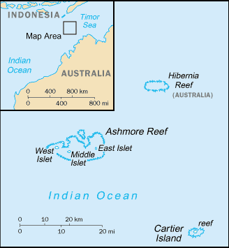

# Ashmore and Cartier Islands

_territory of Australia_

## Introduction

**_Background:_**   
These uninhabited islands came under Australian authority in 1931; formal administration began two years later. Ashmore Reef supports a rich and diverse avian and marine habitat; in 1983, it became a National Nature Reserve. Cartier Island, a former bombing range, became a marine reserve in 2000.

## Geography

**_Location:_**   
Southeastern Asia, islands in the Indian Ocean, midway between northwestern Australia and Timor island

**_Geographic coordinates:_**   
12 14 S, 123 05 E

**_Map references:_**   
Oceania

**_Area:_**   
**total:** 5 sq km   
**land:** 5 sq km   
**water:** 0 sq km   
**note:** includes Ashmore Reef (West, Middle, and East Islets) and Cartier Island

**_Area - comparative:_**   
about eight times the size of The Mall in Washington, DC

**_Land boundaries:_**   
0 km

**_Coastline:_**   
74.1 km

**_Maritime claims:_**   
**territorial sea:** 12 nm   
**contiguous zone:** 12 nm   
**exclusive fishing zone:** 200 nm   
**continental shelf:** 200 m depth or to the depth of exploitation

**_Climate:_**   
tropical

**_Terrain:_**   
low with sand and coral

**_Elevation extremes:_**   
**lowest point:** Indian Ocean 0 m   
**highest point:** unnamed location 3 m

**_Natural resources:_**   
fish

**_Land use:_**   
**arable land:** 0%   
**permanent crops:** 0%   
**other:** 100% (all grass and sand) (2011)

**_Natural hazards:_**   
surrounded by shoals and reefs that can pose maritime hazards

**_Environment - current issues:_**   
illegal killing of protected wildlife by traditional Indonesian fisherman, as well as fishing by non-traditional Indonesian vessels, are ongoing problems

**_Geography - note:_**   
Ashmore Reef National Nature Reserve established in August 1983; Cartier Island Marine Reserve established in 2000

## People and Society

**_Population:_**   
no indigenous inhabitants   
**note:** Indonesian fishermen are allowed access to the lagoon and fresh water at Ashmore Reef's West Island; access to East and Middle Islands is by permit only

## Government

**_Country name:_**   
**conventional long form:** Territory of Ashmore and Cartier Islands   
**conventional short form:** Ashmore and Cartier Islands

**_Dependency status:_**   
territory of Australia; administered from Canberra by the Department of Regional Australia, Local Government, Arts and Sport

**_Legal system:_**   
the laws of the Commonwealth of Australia and the laws of the Northern Territory of Australia, where applicable, apply

**_Diplomatic representation in the US:_**   
none (territory of Australia)

**_Diplomatic representation from the US:_**   
none (territory of Australia)

**_Flag description:_**   
the flag of Australia is used

## Economy

**_Economy - overview:_**   
no economic activity

## Transportation

**_Ports and terminals:_**   
none; offshore anchorage only

## Military

**_Military - note:_**   
defense is the responsibility of Australia; periodic visits by the Royal Australian Navy and Royal Australian Air Force

## Transnational Issues

**_Disputes - international:_**   
Australia has closed parts of the Ashmore and Cartier reserve to Indonesian traditional fishing; Indonesian groups challenge Australia's claim to Ashmore Reef

............................................................   
_Page last updated on March 27, 2014_
