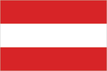
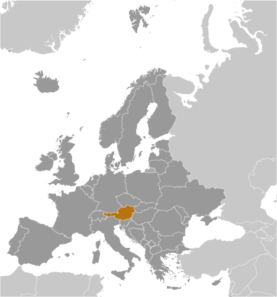
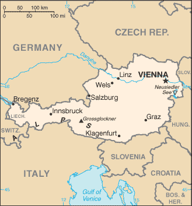

# Austria

## Introduction

**_Background:_**   
Once the center of power for the large Austro-Hungarian Empire, Austria was reduced to a small republic after its defeat in World War I. Following annexation by Nazi Germany in 1938 and subsequent occupation by the victorious Allies in 1945, Austria's status remained unclear for a decade. A State Treaty signed in 1955 ended the occupation, recognized Austria's independence, and forbade unification with Germany. A constitutional law that same year declared the country's "perpetual neutrality" as a condition for Soviet military withdrawal. The Soviet Union's collapse in 1991 and Austria's entry into the European Union in 1995 have altered the meaning of this neutrality. A prosperous, democratic country, Austria entered the EU Economic and Monetary Union in 1999.

## Geography

**_Location:_**   
Central Europe, north of Italy and Slovenia

**_Geographic coordinates:_**   
47 20 N, 13 20 E

**_Map references:_**   
Europe

**_Area:_**   
**total:** 83,871 sq km   
**land:** 82,445 sq km   
**water:** 1,426 sq km

**_Area - comparative:_**   
slightly smaller than Maine

**_Land boundaries:_**   
**total:** 2,524 km   
**border countries:** Czech Republic 402 km, Germany 801 km, Hungary 321 km, Italy 404 km, Liechtenstein 34 km, Slovakia 105 km, Slovenia 299 km, Switzerland 158 km

**_Coastline:_**   
0 km (landlocked)

**_Maritime claims:_**   
none (landlocked)

**_Climate:_**   
temperate; continental, cloudy; cold winters with frequent rain and some snow in lowlands and snow in mountains; moderate summers with occasional showers

**_Terrain:_**   
in the west and south mostly mountains (Alps); along the eastern and northern margins mostly flat or gently sloping

**_Elevation extremes:_**   
**lowest point:** Neusiedler See 115 m   
**highest point:** Grossglockner 3,798 m

**_Natural resources:_**   
oil, coal, lignite, timber, iron ore, copper, zinc, antimony, magnesite, tungsten, graphite, salt, hydropower

**_Land use:_**   
**arable land:** 16.25%   
**permanent crops:** 0.77%   
**other:** 82.98% (2011)

**_Irrigated land:_**   
1,170 sq km (2007)

**_Total renewable water resources:_**   
77.7 cu km (2011)

**_Freshwater withdrawal (domestic/industrial/agricultural):_**   
**total:** 3.66 cu km/yr (18%/79%/3%)   
**per capita:** 452.4 cu m/yr (2008)

**_Natural hazards:_**   
landslides; avalanches; earthquakes

**_Environment - current issues:_**   
some forest degradation caused by air and soil pollution; soil pollution results from the use of agricultural chemicals; air pollution results from emissions by coal- and oil-fired power stations and industrial plants and from trucks transiting Austria between northern and southern Europe

**_Environment - international agreements:_**   
**party to:** Air Pollution, Air Pollution-Nitrogen Oxides, Air Pollution-Persistent Organic Pollutants, Air Pollution-Sulfur 85, Air Pollution-Sulphur 94, Air Pollution-Volatile Organic Compounds, Antarctic Treaty, Biodiversity, Climate Change, Climate Change-Kyoto Protocol, Desertification, Endangered Species, Environmental Modification, Hazardous Wastes, Law of the Sea, Ozone Layer Protection, Ship Pollution, Tropical Timber 83, Tropical Timber 94, Wetlands, Whaling   
**signed, but not ratified:** none of the selected agreements

**_Geography - note:_**   
landlocked; strategic location at the crossroads of central Europe with many easily traversable Alpine passes and valleys; major river is the Danube; population is concentrated on eastern lowlands because of steep slopes, poor soils, and low temperatures elsewhere

## People and Society

**_Nationality:_**   
**noun:** Austrian(s)   
**adjective:** Austrian

**_Ethnic groups:_**   
Austrians 91.1%, former Yugoslavs 4% (includes Croatians, Slovenes, Serbs, and Bosniaks), Turks 1.6%, German 0.9%, other or unspecified 2.4% (2001 census)

**_Languages:_**   
German (official nationwide) 88.6%, Turkish 2.3%, Serbian 2.2%, Croatian (official in Burgenland) 1.6%, other (includes Slovene, official in Carinthia, and Hungarian, official in Burgenland) 5.3% (2001 census)

**_Religions:_**   
Roman Catholic 73.6%, Protestant 4.7%, Muslim 4.2%, other 3.5%, unspecified 2%, none 12% (2001 census)

**_Population:_**   
8,223,062 (July 2014 est.)

**_Age structure:_**   
**0-14 years:** 13.6% (male 573,146/female 546,596)   
**15-24 years:** 11.6% (male 488,564/female 468,891)   
**25-54 years:** 42.9% (male 1,766,729/female 1,756,880)   
**55-64 years:** 12.7% (male 515,913/female 528,988)   
**65 years and over:** 19.2% (male 670,750/female 906,605) (2014 est.)

**_Dependency ratios:_**   
**total dependency ratio:** 49.1 %   
**youth dependency ratio:** 21.6 %   
**elderly dependency ratio:** 27.6 %   
**potential support ratio:** 3.6 (2014 est.)

**_Median age:_**   
**total:** 44.3 years   
**male:** 43.2 years   
**female:** 45.3 years (2014 est.)

**_Population growth rate:_**   
0.01% (2014 est.)

**_Birth rate:_**   
8.76 births/1,000 population (2014 est.)

**_Death rate:_**   
10.38 deaths/1,000 population (2014 est.)

**_Net migration rate:_**   
1.76 migrant(s)/1,000 population (2014 est.)

**_Urbanization:_**   
**urban population:** 67.7% of total population (2011)   
**rate of urbanization:** 0.48% annual rate of change (2010-15 est.)

**_Major urban areas - population:_**   
VIENNA (capital) 1.72 million (2011)

**_Sex ratio:_**   
**at birth:** 1.05 male(s)/female   
**0-14 years:** 1.05 male(s)/female   
**15-24 years:** 1.04 male(s)/female   
**25-54 years:** 1.01 male(s)/female   
**55-64 years:** 0.95 male(s)/female   
**65 years and over:** 0.73 male(s)/female   
**total population:** 0.95 male(s)/female (2014 est.)

**_Mother's mean age at first birth:_**   
28.5 (2011 est.)

**_Maternal mortality rate:_**   
4 deaths/100,000 live births (2010)

**_Infant mortality rate:_**   
**total:** 4.16 deaths/1,000 live births   
**male:** 5.01 deaths/1,000 live births   
**female:** 3.27 deaths/1,000 live births (2014 est.)

**_Life expectancy at birth:_**   
**total population:** 80.17 years   
**male:** 77.25 years   
**female:** 83.24 years (2014 est.)

**_Total fertility rate:_**   
1.43 children born/woman (2014 est.)

**_Contraceptive prevalence rate:_**   
69.6%   
**note:** percent of women aged 18-46 (2009)

**_Health expenditures:_**   
10.6% of GDP (2011)

**_Physicians density:_**   
4.86 physicians/1,000 population (2010)

**_Hospital bed density:_**   
7.6 beds/1,000 population (2010)

**_Drinking water source:_**   
**improved:** urban: 100% of population; rural: 100% of population; total: 100% of population   
**unimproved:** urban: 0% of population; rural: 0% of population; total: 0% of population (2012 est.)

**_Sanitation facility access:_**   
**improved:** urban: 100% of population; rural: 100% of population; total: 100% of population   
**unimproved:** urban: 0% of population; rural: 0% of population; total: 0% of population (2012 est.)

**_HIV/AIDS - adult prevalence rate:_**   
0.3% (2009 est.)

**_HIV/AIDS - people living with HIV/AIDS:_**   
15,000 (2009 est.)

**_HIV/AIDS - deaths:_**   
fewer than 100 (2009 est.)

**_Obesity - adult prevalence rate:_**   
20.9% (2008)

**_Education expenditures:_**   
5.9% of GDP (2010)

**_Literacy:_**   
**definition:** age 15 and over can read and write   
**total population:** 98%   
**male:** NA   
**female:** NA

**_School life expectancy (primary to tertiary education):_**   
**total:** 16 years   
**male:** 15 years   
**female:** 16 years (2011)

**_Unemployment, youth ages 15-24:_**   
**total:** 8.3%   
**male:** 8.8%   
**female:** 8.7% (2012)

## Government

**_Country name:_**   
**conventional long form:** Republic of Austria   
**conventional short form:** Austria   
**local long form:** Republik Oesterreich   
**local short form:** Oesterreich

**_Government type:_**   
federal republic

**_Capital:_**   
**name:** Vienna   
**geographic coordinates:** 48 12 N, 16 22 E   
**time difference:** UTC+1 (6 hours ahead of Washington, DC, during Standard Time)   
**daylight saving time:** +1hr, begins last Sunday in March; ends last Sunday in October

**_Administrative divisions:_**   
9 states (Bundeslaender, singular - Bundesland); Burgenland, Karnten (Carinthia), Niederoesterreich (Lower Austria), Oberoesterreich (Upper Austria), Salzburg, Steiermark (Styria), Tirol (Tyrol), Vorarlberg, Wien (Vienna)

**_Independence:_**   
12 November 1918 (republic proclaimed); notable earlier dates: 976 (Margravate of Austria established); 17 September 1156 (Duchy of Austria founded); 11 August 1804 (Austrian Empire proclaimed)

**_National holiday:_**   
National Day, 26 October (1955); note - commemorates the passage of the law on permanent neutrality

**_Constitution:_**   
several previous; latest adopted 1 October 1920, revised 1929, replaced May 1934 (authoritarian-corporate constitution), replaced by German Weimar constitution in 1938 following German annexation; latest reinstated 1 May 1945 (1920 constitution with 1929 revisions); amended many times, last in 2008 (2013)

**_Legal system:_**   
civil law system; judicial review of legislative acts by the Constitutional Court

**_International law organization participation:_**   
accepts compulsory ICJ jurisdiction; accepts ICCt jurisdiction

**_Suffrage:_**   
16 years of age; universal

**_Executive branch:_**   
**chief of state:** President Heinz FISCHER (SPOe) (since 8 July 2004)   
**head of government:** Chancellor Werner FAYMANN (SPOe) (since 2 December 2008); Vice Chancellor Michael SPINDELEGGER (OeVP) (since 21 April 2011)   
**cabinet:** Council of Ministers chosen by the president on the advice of the chancellor   
**elections:** president elected for a six-year term (eligible for a second term) by direct popular vote and formally sworn into office before the Federal Assembly or Bundesversammlung; presidential election last held on 25 April 2010 (next to be held on 25 April 2016); chancellor formally chosen by the president but determined by the coalition parties forming a parliamentary majority; vice chancellor chosen by the president on the advice of the chancellor   
**election results:** Heinz FISCHER reelected president; percent of vote - Heinz FISCHER 79.33%, Barbara ROSENKRANZ 15.24%, Rudolf GEHRING 5.43%   
**note:** government coalition - SPOe and OeVP

**_Legislative branch:_**   
bicameral Federal Assembly or Bundesversammlung consists of Federal Council or Bundesrat (62 seats; delegates appointed by state parliaments with each state receiving 3 to 12 seats in proportion to its population; members serve five- or six-year terms) and the National Council or Nationalrat (183 seats; members elected by popular vote for a five-year term under a system of proportional representation with partially open party lists)   
**elections:** National Council - last held on 29 September 2013 (next to be held by September 2018)   
**election results:** National Council - percent of vote by party - SPOe 27.1%, OeVP 23.8%, FPOe 21.4%, Greens 11.5%, Team Stronach for Austria 5.8%, NEOS - The New Austria 4.8%, other 5.6%; seats by party - SPOe 53, OeVP 46, FPOe 42, Greens 22; Team Stronach for Austria 11, NEOS - The New Austria 9

**_Judicial branch:_**   
**highest court(s):** Supreme Court of Justice or Oberster Gerichtshof (consists of 85 judges organized into 17 senates or panels of five judges each); Constitutional Court or Verfassungsgerichtshof (consists of 20 judges including 6 substitutes; Administrative Court or Verwaltungsgerichtshof - 2 judges plus other members depending on the importance of the case)   
**judge selection and term of office:** Supreme Court judges nominated by executive branch departments and appointed by the president; judges serve for life; Constitutional Court judges nominated by several executive branch departments and approved by the president; judges serve for life; Administrative Court judges recommended by executive branch departments and appointed by the president; terms of judges and members determined by the president   
**subordinate courts:** Courts of Appeal (4); Regional Courts (20); district courts (120); county courts

**_Political parties and leaders:_**   
Alliance for the Future of Austria or BZOe [Josef BUCHER]   
Austrian People's Party or OeVP [Michael SPINDELEGGER]   
Communist Party of Austria or KPOe [Mirko MESSNER]   
Freedom Party of Austria or FPOe [Heinz Christian STRACHE]   
The Greens [Eva GLAWISCHNIG]   
NEOS - The New Austria [Matthias STROLZ]   
Social Democratic Party of Austria or SPOe [Werner FAYMANN]   
"Team Stronach for Austria" [Frank STRONACH]

**_Political pressure groups and leaders:_**   
Austrian Trade Union Federation or OeGB (nominally independent but primarily Social Democratic)   
Federal Economic Chamber   
Labor Chamber or AK (Social Democratic-leaning think tank)   
OeVP-oriented Association of Austrian Industrialists or IV   
Roman Catholic Church, including its chief lay organization, Catholic Action   
**other:** three composite leagues of the Austrian People's Party or OeVP representing business, labor, farmers, and other nongovernment organizations in the areas of environment and human rights

**_International organization participation:_**   
ADB (nonregional member), AfDB (nonregional member), Australia Group, BIS, BSEC (observer), CD, CE, CEI, CERN, EAPC, EBRD, ECB, EIB, EMU, ESA, EU, FAO, FATF, G-9, IADB, IAEA, IBRD, ICAO, ICC (national committees), ICRM, IDA, IEA, IFAD, IFC, IFRCS, IGAD (partners), ILO, IMF, IMO, Interpol, IOC, IOM, IPU, ISO, ITSO, ITU, ITUC (NGOs), MIGA, MINURSO, NEA, NSG, OAS (observer), OECD, OIF (observer), OPCW, OSCE, Paris Club, PCA, PFP, Schengen Convention, SELEC (observer), UN, UNCTAD, UNDOF, UNESCO, UNFICYP, UNHCR, UNIFIL, UNTSO, UNWTO, UPU, WCO, WFTU (NGOs), WHO, WIPO, WMO, WTO, ZC

**_Diplomatic representation in the US:_**   
**chief of mission:** Ambassador Hans Peter MANZ (since 2 December 2011)   
**chancery:** 3524 International Court NW, Washington, DC 20008-3035   
**telephone:** [1] (202) 895-6700   
**FAX:** [1] (202) 895-6750   
**consulate(s) general:** Chicago, Los Angeles, New York

**_Diplomatic representation from the US:_**   
**chief of mission:** Ambassador Alexa L. WESNER (since 6 September 2013)   
**embassy:** Boltzmanngasse 16, A-1090, Vienna   
**mailing address:** use embassy street address   
**telephone:** [43] (1) 31339-0   
**FAX:** [43] (1) 3100682

**_Flag description:_**   
three equal horizontal bands of red (top), white, and red; the flag design is certainly one of the oldest - if not the oldest - national banners in the world; according to tradition, in 1191, following a fierce battle in the Third Crusade, Duke Leopold V of Austria's white tunic became completely blood-spattered; upon removal of his wide belt or sash, a white band was revealed; the red-white-red color combination was subsequently adopted as his banner

**_National symbol(s):_**   
golden eagle, Alpine gentian, edelweiss

**_National anthem:_**   
**name:** "Bundeshymne" (Federal Hymn)   
**lyrics/music:** Paula von PRERADOVIC/Wolfgang Amadeus MOZART or Johann HOLZER (disputed)   
**note:** adopted 1947; the anthem is also known as "Land der Berge, Land am Strome" (Land of the Mountains, Land on the River); Austria adopted a new national anthem after World War II to replace the former imperial anthem composed by Franz Josef HAYDN, which had been appropriated by Germany in 1922 and was now associated with the Nazi regime

## Economy

**_Economy - overview:_**   
Austria, with its well-developed market economy, skilled labor force, and high standard of living, is closely tied to other EU economies, especially Germany's. Its economy features a large service sector, a sound industrial sector, and a small, but highly developed agricultural sector. Following several years of solid foreign demand for Austrian exports and record employment growth, the international financial crisis of 2008 and subsequent global economic downturn led to a sharp but brief recession. Austrian GDP contracted 3.8% in 2009 but saw positive growth of about 2% in 2010 and 2.7% in 2011. Growth fell to 0.6% in 2012. Unemployment did not rise as steeply in Austria as elsewhere in Europe, partly because the government subsidized reduced working hour schemes to allow companies to retain employees. The 2012 unemployment rate of 4.3% was the lowest within the EU. Stabilization measures, stimulus spending, and an income tax reform pushed the budget deficit to 4.5% in 2010 and 2.6% in 2011, from only about 0.9% in 2008. The international financial crisis of 2008 caused difficulties for Austria's largest banks whose extensive operations in central, eastern, and southeastern Europe faced large losses. The government provided bank support - including in some instances, nationalization - to support aggregate demand and stabilize the banking system. Austria's fiscal position compares favorably with other euro-zone countries, but it faces external risks, such as Austrian banks' continued exposure to Central and Eastern Europe as well as political and economic uncertainties caused by the European sovereign debt crisis. In 2011 the government attempted to pass a constitutional amendment limiting public debt to 60% of GDP by 2020, but it was unable to obtain sufficient support in parliament and instead passed the measure as a simple law. In March 2012, the Austrian parliament approved an austerity package consisting of a mix of expenditure cuts and new revenues that will bring public finances into balance by 2016. In 2012, the budget deficit rose to 3.1% of GDP.

**_GDP (purchasing power parity):_**   
$361 billion (2013 est.)   
$359.6 billion (2012 est.)   
$356.5 billion (2011 est.)   
**note:** data are in 2013 US dollars

**_GDP (official exchange rate):_**   
$417.9 billion (2013 est.)

**_GDP - real growth rate:_**   
0.4% (2013 est.)   
0.9% (2012 est.)   
2.8% (2011 est.)

**_GDP - per capita (PPP):_**   
$42,600 (2013 est.)   
$42,500 (2012 est.)   
$42,300 (2011 est.)   
**note:** data are in 2013 US dollars

**_Gross national saving:_**   
23.9% of GDP (2013 est.)   
24.4% of GDP (2012 est.)   
24.5% of GDP (2011 est.)

**_GDP - composition, by end use:_**   
**household consumption:** 54.6%   
**government consumption:** 19.2%   
**investment in fixed capital:** 20.8%   
**investment in inventories:** 0.5%   
**exports of goods and services:** 56.9%   
**imports of goods and services:** -52%; (2013 est.)

**_GDP - composition, by sector of origin:_**   
**agriculture:** 1.6%   
**industry:** 28.6%   
**services:** 69.8% (2013 est.)

**_Agriculture - products:_**   
grains, potatoes, wine, fruit; dairy products, cattle, pigs, poultry; lumber

**_Industries:_**   
construction, machinery, vehicles and parts, food, metals, chemicals, lumber and wood, paper and paperboard, communications equipment, tourism

**_Industrial production growth rate:_**   
0.5% (2013 est.)

**_Labor force:_**   
3.737 million (2013 est.)

**_Labor force - by occupation:_**   
**agriculture:** 5.5%   
**industry:** 26%   
**services:** 68.5% (2012 est.)

**_Unemployment rate:_**   
4.9% (2013 est.)   
4.4% (2012 est.)

**_Population below poverty line:_**   
6.2% (2012)

**_Household income or consumption by percentage share:_**   
**lowest 10%:** 4%   
**highest 10%:** 22% (2011)

**_Distribution of family income - Gini index:_**   
26.3 (2007)   
31 (1995)

**_Budget:_**   
**revenues:** $200 billion   
**expenditures:** $212.1 billion (2013 est.)

**_Taxes and other revenues:_**   
47.9% of GDP (2013 est.)

**_Budget surplus (+) or deficit (-):_**   
-2.9% of GDP (2013 est.)

**_Public debt:_**   
75.7% of GDP (2013 est.)   
74.1% of GDP (2012 est.)   
**note:** this is general government gross debt, defined in the Maastricht Treaty as consolidated general government gross debt at nominal value, outstanding at the end of the year; it covers the following categories of government liabilities (as defined in ESA95): currency and deposits (AF.2), securities other than shares excluding financial derivatives (AF.3, excluding AF.34), and loans (AF.4); the general government sector comprises the sub-sectors of central government, state government, local government and social security funds; as a percentage of GDP, the GDP used as a denominator is the gross domestic product in current year prices

**_Fiscal year:_**   
calendar year

**_Inflation rate (consumer prices):_**   
2.1% (2013 est.)   
2.6% (2012 est.)

**_Commercial bank prime lending rate:_**   
2.2% (31 December 2013 est.)   
2.5% (31 December 2012 est.)

**_Stock of narrow money:_**   
$204.5 billion (31 December 2013 est.)   
$201.1 billion (31 December 2012 est.)   
**note:** see entry for the European Union for money supply for the entire euro area; the European Central Bank (ECB) controls monetary policy for the 17 members of the Economic and Monetary Union (EMU); individual members of the EMU do not control the quantity of money circulating within their own borders

**_Stock of broad money:_**   
$419 billion (31 December 2013 est.)   
$414 billion (31 December 2012 est.)

**_Stock of domestic credit:_**   
$544.2 billion (31 December 2013 est.)   
$543 billion (31 December 2012 est.)

**_Market value of publicly traded shares:_**   
$106 billion (31 December 2012 est.)   
$82.37 billion (31 December 2011)   
$NA (31 December 2010 est.)

**_Current account balance:_**   
$10.6 billion (2013 est.)   
$7.085 billion (2012 est.)

**_Exports:_**   
$165.6 billion (2013 est.)   
$160.1 billion (2012 est.)

**_Exports - commodities:_**   
machinery and equipment, motor vehicles and parts, paper and paperboard, metal goods, chemicals, iron and steel, textiles, foodstuffs

**_Exports - partners:_**   
Germany 29.31%, Italy 6.25%, Switzerland 5.08%, United States 5%, France 4.27% (2013 est.)

**_Imports:_**   
$167.9 billion (2013 est.)   
$163.2 billion (2012 est.)

**_Imports - commodities:_**   
machinery and equipment, motor vehicles, chemicals, metal goods, oil and oil products; foodstuffs

**_Imports - partners:_**   
Germany 40.39%, Italy 6.13%, Switzerland 5.36% (2013 est.)

**_Reserves of foreign exchange and gold:_**   
$27.21 billion (31 December 2012 est.)   
$25.16 billion (31 December 2011 est.)

**_Debt - external:_**   
$812 billion (31 December 2012 est.)   
$786.1 billion (31 December 2011)

**_Stock of direct foreign investment - at home:_**   
$269.5 billion (31 December 2013 est.)   
$265.3 billion (31 December 2012 est.)

**_Stock of direct foreign investment - abroad:_**   
$345.2 billion (31 December 2013 est.)   
$331.4 billion (31 December 2012 est.)

**_Exchange rates:_**   
euros (EUR) per US dollar -   
0.7634 (2013 est.)   
0.7752 (2012 est.)   
0.755 (2010 est.)   
0.7198 (2009 est.)   
0.6827 (2008 est.)

## Energy

**_Electricity - production:_**   
69 billion kWh (2012 est.)

**_Electricity - consumption:_**   
63.8 billion kWh (2011 est.)

**_Electricity - exports:_**   
20.46 billion kWh (2012 est.)

**_Electricity - imports:_**   
23.26 billion kWh (2012 est.)

**_Electricity - installed generating capacity:_**   
21.11 million kW (2010 est.)

**_Electricity - from fossil fuels:_**   
27.5% of total installed capacity (2012 est.)

**_Electricity - from nuclear fuels:_**   
0% of total installed capacity (2012 est.)

**_Electricity - from hydroelectric plants:_**   
59.6% of total installed capacity (2012 est.)

**_Electricity - from other renewable sources:_**   
12.8% of total installed capacity (2012 est.)

**_Crude oil - production:_**   
29,480 bbl/day (2012 est.)

**_Crude oil - exports:_**   
0 bbl/day (2011 est.)

**_Crude oil - imports:_**   
139,000 bbl/day (2011 est.)

**_Crude oil - proved reserves:_**   
85 million bbl (1 January 2012 est.)

**_Refined petroleum products - production:_**   
159,200 bbl/day (2011 est.)

**_Refined petroleum products - consumption:_**   
210,700 bbl/day (2011 est.)

**_Refined petroleum products - exports:_**   
43,010 bbl/day (2011 est.)

**_Refined petroleum products - imports:_**   
117,100 bbl/day (2011 est.)

**_Natural gas - production:_**   
1.906 billion cu m (2012 est.)

**_Natural gas - consumption:_**   
9 billion cu m (2012 est.)

**_Natural gas - exports:_**   
34.75 billion cu m (2012 est.)

**_Natural gas - imports:_**   
42.56 billion cu m (2012 est.)

**_Natural gas - proved reserves:_**   
10.82 billion cu m (1 January 2013 est.)

**_Carbon dioxide emissions from consumption of energy:_**   
67.18 million Mt (2011 est.)

## Communications

**_Telephones - main lines in use:_**   
3.342 million (2012)

**_Telephones - mobile cellular:_**   
13.59 million (2012)

**_Telephone system:_**   
**general assessment:** highly developed and efficient   
**domestic:** fixed-line subscribership has been in decline since the mid-1990s with mobile-cellular subscribership eclipsing it by the late 1990s; the fiber-optic net is very extensive; all telephone applications and Internet services are available   
**international:** country code - 43; satellite earth stations - 15; in addition, there are about 600 VSATs (very small aperture terminals) (2007)

**_Broadcast media:_**   
Austria's public broadcaster, Osterreichischer Rundfunk (ORF), was the main broadcast source until commercial radio and TV service was introduced in the 1990s; cable and satellite TV are available, including German TV stations (2008)

**_Internet country code:_**   
.at

**_Internet hosts:_**   
3.512 million (2012)

**_Internet users:_**   
6.143 million (2009)

## Transportation

**_Airports:_**   
52 (2013)

**_Airports - with paved runways:_**   
**total:** 24   
**over 3,047 m:** 1   
**2,438 to 3,047 m:** 5   
**1,524 to 2,437 m:** 1   
**914 to 1,523 m:** 4   
**under 914 m:** 13 (2013)

**_Airports - with unpaved runways:_**   
**total:** 28   
**1,524 to 2,437 m:** 1   
**914 to 1,523 m:** 3   
**under 914 m:** 24 (2013)

**_Heliports:_**   
1 (2013)

**_Pipelines:_**   
gas 4,736 km; oil 663 km; refined products 157 km (2013)

**_Railways:_**   
**total:** 6,399 km   
**standard gauge:** 5,927 km 1.435-m gauge (3,853 km electrified)   
**narrow gauge:** 384 km 1.000-m gauge (15 km electrified); 88 km 0.760-m gauge (10 km electrified) (2008)

**_Roadways:_**   
**total:** 124,508 km   
**paved:** 124,508 km (includes 1,719 km of expressways) (2012)

**_Waterways:_**   
358 km (2011)

**_Merchant marine:_**   
**registered in other countries:** 3 (Cyprus 1, Kazakhstan 1, Saint Vincent and the Grenadines 1) (2010)

**_Ports and terminals:_**   
**river port(s):** Enns, Krems, Linz, Vienna (Danube)

## Military

**_Military branches:_**   
Land Forces (KdoLdSK), Air Forces (KdoLuSK)

**_Military service age and obligation:_**   
registration requirement at age 17, the legal minimum age for voluntary military service; 18 is the legal minimum age for compulsory service; males under the age of 35 must complete basic military training (6 month duration); males 18 to 50 years old in the militia or inactive reserve are subject to compulsory service (2012)

**_Manpower available for military service:_**   
**males age 16-49:** 1,941,110   
**females age 16-49:** 1,910,434 (2010 est.)

**_Manpower fit for military service:_**   
**males age 16-49:** 1,579,862   
**females age 16-49:** 1,554,130 (2010 est.)

**_Manpower reaching militarily significant age annually:_**   
**male:** 48,108   
**female:** 45,752 (2010 est.)

**_Military expenditures:_**   
0.81% of GDP (2012)   
0.82% of GDP (2011)   
0.81% of GDP (2010)

## Transnational Issues

**_Disputes - international:_**   
none

**_Refugees and internally displaced persons:_**   
**refugees (country of origin):** 19,577 (Russia); 11,906 (Afghanistan) (2013)   
**stateless persons:** 542 (2012)

**_Illicit drugs:_**   
transshipment point for Southwest Asian heroin and South American cocaine destined for Western Europe; increasing consumption of European-produced synthetic drugs

............................................................   
_Page last updated on June 23, 2014_
