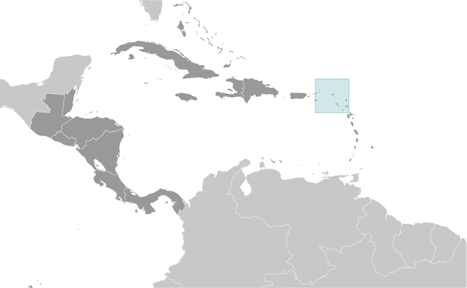
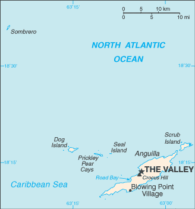

# Anguilla

_overseas territory of the UK_

## Introduction

**_Background:_**   
Colonized by English settlers from Saint Kitts in 1650, Anguilla was administered by Great Britain until the early 19th century, when the island - against the wishes of the inhabitants - was incorporated into a single British dependency along with Saint Kitts and Nevis. Several attempts at separation failed. In 1971, two years after a revolt, Anguilla was finally allowed to secede; this arrangement was formally recognized in 1980, with Anguilla becoming a separate British dependency.

## Geography

**_Location:_**   
Caribbean, islands between the Caribbean Sea and North Atlantic Ocean, east of Puerto Rico

**_Geographic coordinates:_**   
18 15 N, 63 10 W

**_Map references:_**   
Central America and the Caribbean

**_Area:_**   
**total:** 91 sq km   
**land:** 91 sq km   
**water:** 0 sq km

**_Area - comparative:_**   
about one-half the size of Washington, DC

**_Land boundaries:_**   
0 km

**_Coastline:_**   
61 km

**_Maritime claims:_**   
**territorial sea:** 3 nm   
**exclusive fishing zone:** 200 nm

**_Climate:_**   
tropical; moderated by northeast trade winds

**_Terrain:_**   
flat and low-lying island of coral and limestone

**_Elevation extremes:_**   
**lowest point:** Caribbean Sea 0 m   
**highest point:** Crocus Hill 65 m

**_Natural resources:_**   
salt, fish, lobster

**_Land use:_**   
**arable land:** 0%   
**permanent crops:** 0%   
**other:** 100% (mostly rock with sparse scrub oak, few trees, some commercial salt ponds) (2011)

**_Irrigated land:_**   
NA

**_Natural hazards:_**   
frequent hurricanes and other tropical storms (July to October)

**_Environment - current issues:_**   
supplies of potable water sometimes cannot meet increasing demand largely because of poor distribution system

**_Geography - note:_**   
the most northerly of the Leeward Islands in the Lesser Antilles

## People and Society

**_Nationality:_**   
**noun:** Anguillan(s)   
**adjective:** Anguillan

**_Ethnic groups:_**   
black (predominant) 90.1%, mixed, mulatto 4.6%, white 3.7%, other 1.5% (2001 census)

**_Languages:_**   
English (official)

**_Religions:_**   
Protestant 83.1% (Anglican 29%, Methodist 23.9%, other Protestant 30.2%), Roman Catholic 5.7%, other Christian 1.7%, other 5.2%, none or unspecified 4.3% (2001 census)

**_Population:_**   
16,086 (July 2014 est.)

**_Age structure:_**   
**0-14 years:** 23.3% (male 1,918/female 1,826)   
**15-24 years:** 14.1% (male 1,123/female 1,144)   
**25-54 years:** 45% (male 3,269/female 3,965)   
**55-64 years:** 9.4% (male 744/female 763)   
**65 years and over:** 8.3% (male 658/female 676) (2014 est.)

**_Median age:_**   
**total:** 34.1 years   
**male:** 32.4 years   
**female:** 35.7 years (2014 est.)

**_Population growth rate:_**   
2.06% (2014 est.)

**_Birth rate:_**   
12.68 births/1,000 population (2014 est.)

**_Death rate:_**   
4.54 deaths/1,000 population (2014 est.)

**_Net migration rate:_**   
12.43 migrant(s)/1,000 population (2014 est.)

**_Urbanization:_**   
**urban population:** 100% of total population (2011)   
**rate of urbanization:** 1.56% annual rate of change (2010-15 est.)

**_Major urban areas - population:_**   
THE VALLEY (capital) 2,000 (2011)

**_Sex ratio:_**   
**at birth:** 1.03 male(s)/female   
**0-14 years:** 1.05 male(s)/female   
**15-24 years:** 0.98 male(s)/female   
**25-54 years:** 0.82 male(s)/female   
**55-64 years:** 0.92 male(s)/female   
**65 years and over:** 0.96 male(s)/female   
**total population:** 0.93 male(s)/female (2014 est.)

**_Infant mortality rate:_**   
**total:** 3.4 deaths/1,000 live births   
**male:** 3.81 deaths/1,000 live births   
**female:** 2.97 deaths/1,000 live births (2014 est.)

**_Life expectancy at birth:_**   
**total population:** 81.2 years   
**male:** 78.61 years   
**female:** 83.86 years (2014 est.)

**_Total fertility rate:_**   
1.75 children born/woman (2014 est.)

**_Contraceptive prevalence rate:_**   
43%   
**note:** percent of women aged 15-45 (2003)

**_Drinking water source:_**   
**improved:** urban: 94.6% of population; total: 94.6% of population   
**unimproved:** urban: 5.4% of population; total: 5.4% of population (2012 est.)

**_Sanitation facility access:_**   
**improved:** urban: 97.9% of population; total: 97.9% of population   
**unimproved:** urban: 2.1% of population; total: 2.1% of population (2012 est.)

**_HIV/AIDS - adult prevalence rate:_**   
NA

**_HIV/AIDS - people living with HIV/AIDS:_**   
NA

**_HIV/AIDS - deaths:_**   
NA

**_Education expenditures:_**   
2.8% of GDP (2008)

**_Literacy:_**   
**definition:** age 12 and over can read and write   
**total population:** 95%   
**male:** 95%   
**female:** 95% (1984 est.)

**_School life expectancy (primary to tertiary education):_**   
**total:** 11 years   
**male:** 11 years   
**female:** 11 years (2008)

## Government

**_Country name:_**   
**conventional long form:** none   
**conventional short form:** Anguilla

**_Dependency status:_**   
overseas territory of the UK

**_Government type:_**   
NA

**_Capital:_**   
**name:** The Valley   
**geographic coordinates:** 18 13 N, 63 03 W   
**time difference:** UTC-4 (1 hour ahead of Washington, DC, during Standard Time)

**_Administrative divisions:_**   
none (overseas territory of the UK)

**_Independence:_**   
none (overseas territory of the UK)

**_National holiday:_**   
Anguilla Day, 30 May (1967)

**_Constitution:_**   
several previous; latest 1 April 1982; amended 1990 (2013)

**_Legal system:_**   
common law based on the English model

**_Suffrage:_**   
18 years of age; universal

**_Executive branch:_**   
**chief of state:** Queen ELIZABETH II (since 6 February 1952); represented by Governor Christina SCOTT (since 23 July 2013)   
**head of government:** Chief Minister Hubert HUGHES (since 16 February 2010)   
**cabinet:** Executive Council appointed by the governor from among the elected members of the House of Assembly   
**elections:** the monarchy is hereditary; governor appointed by the monarch; following legislative elections, the leader of the majority party or the leader of the majority coalition usually appointed chief minister by the governor

**_Legislative branch:_**   
unicameral House of Assembly (11 seats; 7 members elected by direct popular vote, 2 ex officio members, and 2 appointed; members serve five-year terms)   
**elections:** last held on 15 February 2010 (next to be held in 2015)   
**election results:** percent of vote by party - NA; seats by party - AUM 4, AUF 2, APP 1

**_Judicial branch:_**   
**highest court(s):** the Eastern Caribbean Supreme Court (ECSC) is the itinerant superior court of record for the 9-member Organization of Eastern Caribbean States to include Anguilla; the ECSC - headquartered on St. Lucia - is headed by the chief justice and is comprised of the Court of Appeal with 3 justices and the High Court with 16 judges; sittings of the Court of Appeal and High Court rotate among the 9 member states; High Court judges reside in 7 member states, though none resides on Anguilla   
**judge selection and term of office:** Eastern Caribbean Supreme Court chief justice appointed by Her Majesty, Queen ELIZABETH II; other justices and judges appointed by the Judicial and Legal Services Commission; Court of Appeal justices appointed for life with mandatory retirement at age 65; High Court judges appointed for life with mandatory retirement at age 62   
**subordinate courts:** Magistrate's Court; Juvenile Court

**_Political parties and leaders:_**   
Anguilla Progressive Party or APP [Brent DAVIS]   
Anguilla Strategic Alternative or ANSA [Edison BAIRD]   
Anguilla United Front or AUF [Osbourne FLEMING, Victor BANKS] (a coalition of the Anguilla Democratic Party or ADP and the Anguilla National Alliance or ANA)   
Anguilla United Movement or AUM [Hubert HUGHES]

**_International organization participation:_**   
Caricom (associate), CDB, Interpol (subbureau), OECS, UPU

**_Diplomatic representation in the US:_**   
none (overseas territory of the UK)

**_Diplomatic representation from the US:_**   
none (overseas territory of the UK)

**_Flag description:_**   
blue, with the flag of the UK in the upper hoist-side quadrant and the Anguillan coat of arms centered in the outer half of the flag; the coat of arms depicts three orange dolphins in an interlocking circular design on a white background with a turquoise-blue field below; the white in the background represents peace; the blue base symbolizes the surrounding sea, as well as faith, youth, and hope; the three dolphins stand for endurance, unity, and strength

**_National symbol(s):_**   
dolphin

**_National anthem:_**   
**name:** "God Bless Anguilla"   
**lyrics/music:** Alex RICHARDSON   
**note:** local anthem adopted 1981; as a territory of the United Kingdom, "God Save the Queen" is official (see United Kingdom)

## Economy

**_Economy - overview:_**   
Anguilla has few natural resources, and the economy depends heavily on luxury tourism, offshore banking, lobster fishing, and remittances from emigrants. Increased activity in the tourism industry has spurred the growth of the construction sector contributing to economic growth. Anguillan officials have put substantial effort into developing the offshore financial sector, which is small but growing. In the medium term, prospects for the economy will depend largely on the tourism sector and, therefore, on revived income growth in the industrialized nations as well as on favorable weather conditions.

**_GDP (purchasing power parity):_**   
$175.4 million (2009 est.)   
$191.7 million (2008 est.)   
$108.9 million (2004 est.)

**_GDP (official exchange rate):_**   
$175.4 million (2009 est.)

**_GDP - real growth rate:_**   
-8.5% (2009 est.)

**_GDP - per capita (PPP):_**   
$12,200 (2008 est.)

**_GDP - composition, by end use:_**   
**household consumption:** 74.5%   
**government consumption:** 20.1%   
**investment in fixed capital:** 22.1%   
**exports of goods and services:** 43.7%   
**imports of goods and services:** -60.4%; (2013 est.)

**_GDP - composition, by sector of origin:_**   
**agriculture:** 2.5%   
**industry:** 23.6%   
**services:** 73.8% (2013 est.)

**_Agriculture - products:_**   
small quantities of tobacco, vegetables; cattle raising

**_Industries:_**   
tourism, boat building, offshore financial services

**_Industrial production growth rate:_**   
2% (2013 est.)

**_Labor force:_**   
6,049 (2001)

**_Labor force - by occupation:_**   
**agriculture/fishing/forestry/mining:** 4%   
**manufacturing:** 3%   
**construction:** 18%   
**transportation and utilities:** 10%   
**commerce:** 36%   
**services:** 29% (2000 est.)

**_Unemployment rate:_**   
8% (2002)

**_Population below poverty line:_**   
23% (2002)

**_Household income or consumption by percentage share:_**   
**lowest 10%:** NA%   
**highest 10%:** NA%

**_Budget:_**   
**revenues:** $69.52 million   
**expenditures:** $78.37 million (2012 est.)

**_Taxes and other revenues:_**   
39.6% of GDP (2012 est.)

**_Budget surplus (+) or deficit (-):_**   
-5% of GDP (2012 est.)

**_Public debt:_**   
20% of GDP (2013 est.)   
21.7% of GDP (2012 est.)

**_Fiscal year:_**   
1 April - 31 March

**_Inflation rate (consumer prices):_**   
3.1% (2013 est.)   
4.4% (2012 est.)

**_Central bank discount rate:_**   
6.5% (31 December 2010 est.)   
6.5% (31 December 2009 est.)

**_Commercial bank prime lending rate:_**   
9.4% (31 December 2013 est.)   
9.38% (31 December 2012 est.)

**_Stock of narrow money:_**   
$16.89 million (31 December 2013 est.)   
NA% (31 December 2012 est.)

**_Stock of broad money:_**   
$384.4 million (31 December 2013 est.)   
$373.2 million (31 December 2012 est.)

**_Stock of domestic credit:_**   
$498.1 million (31 December 2013 est.)   
$483.3 million (31 December 2012 est.)

**_Current account balance:_**   
-$54.3 million (2013 est.)   
-$44.8 million (2012 est.)

**_Exports:_**   
$12.2 million (2013 est.)   
$7.3 million (2012 est.)

**_Exports - commodities:_**   
lobster, fish, livestock, salt, concrete blocks, rum

**_Imports:_**   
$140.1 million (2013 est.)   
$129.3 million (2012 est.)

**_Imports - commodities:_**   
fuels, foodstuffs, manufactures, chemicals, trucks, textiles

**_Debt - external:_**   
$8.8 million (1998)

**_Exchange rates:_**   
East Caribbean dollars (XCD) per US dollar -   
2.7 (2013 est.)   
2.7 (2012 est.)   
2.7 (2010 est.), 2.7 (2009)

## Communications

**_Telephones - main lines in use:_**   
6,000 (2012)

**_Telephones - mobile cellular:_**   
26,000 (2012)

**_Telephone system:_**   
**general assessment:** modern internal telephone system   
**domestic:** fixed-line teledensity is roughly 40 per 100 persons; mobile-cellular teledensity is roughly 170 per 100 persons   
**international:** country code - 1-264; landing point for the East Caribbean Fiber System submarine cable with links to 13 other islands in the eastern Caribbean extending from the British Virgin Islands to Trinidad; microwave radio relay to island of Saint Martin/Sint Maarten (2011)

**_Broadcast media:_**   
1 private TV station; multi-channel cable TV subscription services are available; about 10 radio stations, one of which is government-owned (2007)

**_Internet country code:_**   
.ai

**_Internet hosts:_**   
269 (2012)

**_Internet users:_**   
3,700 (2009)

## Transportation

**_Airports:_**   
2 (2013)

**_Airports - with paved runways:_**   
**total:** 1   
**1,524 to 2,437 m:** 1 (2013)

**_Airports - with unpaved runways:_**   
**total:** 1   
**under 914 m:** 1 (2013)

**_Roadways:_**   
**total:** 175 km   
**paved:** 82 km   
**unpaved:** 93 km (2004)

**_Ports and terminals:_**   
**major seaport(s):** Blowing Point, Road Bay

## Military

**_Manpower available for military service:_**   
**males age 16-49:** 3,641 (2010 est.)

**_Manpower fit for military service:_**   
**males age 16-49:** 3,009   
**females age 16-49:** 3,397 (2010 est.)

**_Manpower reaching militarily significant age annually:_**   
**male:** 111   
**female:** 113 (2010 est.)

**_Military - note:_**   
defense is the responsibility of the UK

## Transnational Issues

**_Disputes - international:_**   
none

**_Illicit drugs:_**   
transshipment point for South American narcotics destined for the US and Europe

............................................................   
_Page last updated on June 23, 2014_
