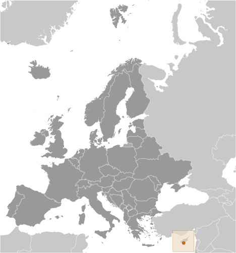
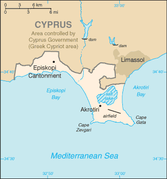

# Akrotiri

_UK Sovereign Base Area_

## Introduction

**_Background:_**   
By terms of the 1960 Treaty of Establishment that created the independent Republic of Cyprus, the UK retained full sovereignty and jurisdiction over two areas of almost 254 square kilometers - Akrotiri and Dhekelia. The southernmost and smallest of these is the Akrotiri Sovereign Base Area, which is also referred to as the Western Sovereign Base Area.

## Geography

**_Location:_**   
Eastern Mediterranean, peninsula on the southwest coast of Cyprus

**_Geographic coordinates:_**   
34 37 N, 32 58 E

**_Map references:_**   
Europe

**_Area:_**   
**total:** 123 sq km   
**note:** includes a salt lake and wetlands

**_Area - comparative:_**   
about 0.7 times the size of Washington, DC

**_Land boundaries:_**   
**total:** 48 km   
**border countries:** Cyprus 48 km

**_Coastline:_**   
56.3 km

**_Climate:_**   
temperate; Mediterranean with hot, dry summers and cool winters

**_Environment - current issues:_**   
hunting around the salt lake; note - breeding place for loggerhead and green turtles; only remaining colony of griffon vultures is on the base

**_Geography - note:_**   
British extraterritorial rights also extended to several small off-post sites scattered across Cyprus; of the Sovereign Base Area (SBA) land, 60% is privately owned and farmed, 20% is owned by the Ministry of Defense, and 20% is SBA Crown land

## People and Society

**_Languages:_**   
English, Greek

**_Population:_**   
approximately 15,700 live on the Sovereign Base Areas of Akrotiri and Dhekelia including 7,700 Cypriots, 3,600 Service and UK-based contract personnel, and 4,400 dependents

## Government

**_Country name:_**   
**conventional long form:** none   
**conventional short form:** Akrotiri

**_Dependency status:_**   
a special form of UK overseas territory; administered by an administrator who is also the Commander, British Forces Cyprus

**_Capital:_**   
**name:** Episkopi Cantonment (base administrative center for Akrotiri and Dhekelia)   
**geographic coordinates:** 34 40 N, 32 51 E   
**time difference:** UTC+2 (7 hours ahead of Washington, DC, during Standard Time)   
**daylight saving time:** +1hr, begins last Sunday in March; ends last Sunday in October

**_Constitution:_**   
presented 3 August 1960, effective 16 August 1960; amended 1966 (The Sovereign Base Areas of Akrotiri and Dhekelia Order in Council 1960, serves as a basic legal document) (2013)

**_Legal system:_**   
laws applicable to the Cypriot population are, as far as possible, the same as the laws of the Republic of Cyprus; note - the Sovereign Base Area Administration has its own court system to deal with civil and criminal matters

**_Executive branch:_**   
**chief of state:** Queen ELIZABETH II (since 6 February 1952)   
**head of government:** Administrator Major General Richard CRIPWELL (since January 2013); note - reports to the British Ministry of Defense; the Chief Officer is responsible for the day-to-day running of the civil government of the Sovereign Bases   
**elections:** none; the monarchy is hereditary; the administrator appointed by the monarch

**_Judicial branch:_**   
**highest court(s):** Senior Judges' Court (consists of several visiting judges from England and Wales)   
**judge selection and term of office:** judges appointment and tenure NA   
**subordinate courts:** Resident Judges' Court; Courts Martial

**_Diplomatic representation in the US:_**   
none (overseas territory of the UK)

**_Diplomatic representation from the US:_**   
none (overseas territory of the UK)

**_Flag description:_**   
the flag of the UK is used

**_National anthem:_**   
**note:** as a United Kingdom area of special sovereignty, "God Save the Queen" is official (see United Kingdom)

## Economy

**_Economy - overview:_**   
Economic activity is limited to providing services to the military and their families located in Akrotiri. All food and manufactured goods must be imported.

**_Exchange rates:_**   
**note:** uses the euro

## Communications

**_Broadcast media:_**   
British Forces Broadcast Service (BFBS) provides multi-channel satellite TV service as well as BFBS radio broadcasts to the Akrotiri Sovereign Base (2009)

## Military

**_Military - note:_**   
defense is the responsibility of the UK; Akrotiri has a full RAF base, headquarters for British Forces Cyprus, and Episkopi Support Unit

............................................................   
_Page last updated on June 22, 2014_
