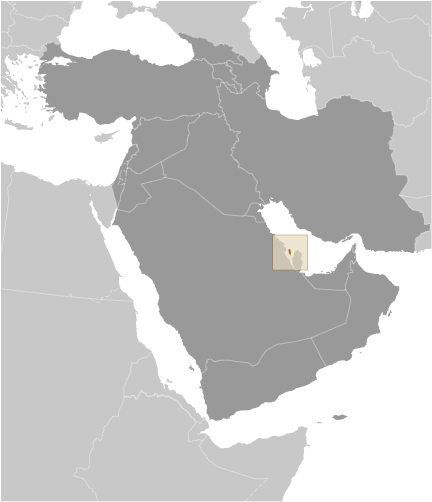

# Bahrain

## Introduction

**_Background:_**   
In 1783, the Sunni Al-Khalifa family took power in Bahrain. In order to secure these holdings, it entered into a series of treaties with the UK during the 19th century that made Bahrain a British protectorate. The archipelago attained its independence in 1971. Facing declining oil reserves, Bahrain has turned to petroleum processing and refining and has become an international banking center. Bahrain's small size and central location among Gulf countries require it to play a delicate balancing act in foreign affairs among its larger neighbors. The Sunni-led government has struggled to manage relations with its large Shia-majority population. In early 2011, amid Arab uprisings elsewhere in the region, the Bahraini Government confronted similar protests at home with police and military action, including deploying Gulf Cooperation Council security forces to Bahrain. Sporadic clashes between demonstrators and security forces continue in Bahrain. Ongoing dissatisfaction with the political status quo has led to a broader discussion termed the Bahrain National Dialogue, a process that convenes members of the executive, parliament, and political societies in an attempt to reach a political agreement.

## Geography

**_Location:_**   
Middle East, archipelago in the Persian Gulf, east of Saudi Arabia

**_Geographic coordinates:_**   
26 00 N, 50 33 E

**_Map references:_**   
Middle East

**_Area:_**   
**total:** 760 sq km   
**land:** 760 sq km   
**water:** 0 sq km

**_Area - comparative:_**   
3.5 times the size of Washington, DC

**_Land boundaries:_**   
0 km

**_Coastline:_**   
161 km

**_Maritime claims:_**   
**territorial sea:** 12 nm   
**contiguous zone:** 24 nm   
**continental shelf:** extending to boundaries to be determined

**_Climate:_**   
arid; mild, pleasant winters; very hot, humid summers

**_Terrain:_**   
mostly low desert plain rising gently to low central escarpment

**_Elevation extremes:_**   
**lowest point:** Persian Gulf 0 m   
**highest point:** Jabal ad Dukhan 122 m

**_Natural resources:_**   
oil, associated and nonassociated natural gas, fish, pearls

**_Land use:_**   
**arable land:** 1.79%   
**permanent crops:** 3.95%   
**other:** 94.26% (2011)

**_Irrigated land:_**   
40.15 sq km (2003)

**_Total renewable water resources:_**   
0.12 cu km (2011)

**_Freshwater withdrawal (domestic/industrial/agricultural):_**   
**total:** 0.36 cu km/yr (50%/6%/45%)   
**per capita:** 386 cu m/yr (2003)

**_Natural hazards:_**   
periodic droughts; dust storms

**_Environment - current issues:_**   
desertification resulting from the degradation of limited arable land, periods of drought, and dust storms; coastal degradation (damage to coastlines, coral reefs, and sea vegetation) resulting from oil spills and other discharges from large tankers, oil refineries, and distribution stations; lack of freshwater resources (groundwater and seawater are the only sources for all water needs)

**_Environment - international agreements:_**   
**party to:** Biodiversity, Climate Change, Climate Change-Kyoto Protocol, Desertification, Hazardous Wastes, Law of the Sea, Ozone Layer Protection, Wetlands   
**signed, but not ratified:** none of the selected agreements

**_Geography - note:_**   
close to primary Middle Eastern petroleum sources; strategic location in Persian Gulf, through which much of the Western world's petroleum must transit to reach open ocean

## People and Society

**_Nationality:_**   
**noun:** Bahraini(s)   
**adjective:** Bahraini

**_Ethnic groups:_**   
Bahraini 46%, Asian 45.5%, other Arabs 4.7%, African 1.6%, European 1%, other 1.2% (includes Gulf Co-operative country nationals, North and South Americans, and Oceanians) (2010 est.)

**_Languages:_**   
Arabic (official), English, Farsi, Urdu

**_Religions:_**   
Muslim 70.3%, Christian 14.5%, Hindu 9.8%, Buddhist 2.5%, Jewish 0.6%, folk religion

**_Population:_**   
1,314,089   
**note:** immigrants make up almost 55% of the total population, according to UN data (2013) (July 2014 est.)

**_Age structure:_**   
**0-14 years:** 19.7% (male 131,698/female 127,663)   
**15-24 years:** 15.9% (male 117,156/female 91,477)   
**25-54 years:** 56.2% (male 483,449/female 254,627)   
**55-64 years:** 5.5% (male 47,172/female 25,354)   
**65 years and over:** 2.7% (male 17,106/female 18,387) (2014 est.)

**_Dependency ratios:_**   
**total dependency ratio:** 30.9 %   
**youth dependency ratio:** 27.9 %   
**elderly dependency ratio:** 3 %   
**potential support ratio:** 33.3 (2014 est.)

**_Median age:_**   
**total:** 31.6 years   
**male:** 33 years   
**female:** 28.8 years (2014 est.)

**_Population growth rate:_**   
2.49% (2014 est.)

**_Birth rate:_**   
13.92 births/1,000 population (2014 est.)

**_Death rate:_**   
2.67 deaths/1,000 population (2014 est.)

**_Net migration rate:_**   
13.6 migrant(s)/1,000 population (2014 est.)

**_Urbanization:_**   
**urban population:** 88.7% of total population (2011)   
**rate of urbanization:** 2.21% annual rate of change (2010-15 est.)

**_Major urban areas - population:_**   
MANAMA (capital) 262,000 (2011)

**_Sex ratio:_**   
**at birth:** 1.03 male(s)/female   
**0-14 years:** 1.03 male(s)/female   
**15-24 years:** 1.28 male(s)/female   
**25-54 years:** 1.9 male(s)/female   
**55-64 years:** 1.54 male(s)/female   
**65 years and over:** 0.91 male(s)/female   
**total population:** 1.54 male(s)/female (2014 est.)

**_Maternal mortality rate:_**   
20 deaths/100,000 live births (2010)

**_Infant mortality rate:_**   
**total:** 9.68 deaths/1,000 live births   
**male:** 10.69 deaths/1,000 live births   
**female:** 8.65 deaths/1,000 live births (2014 est.)

**_Life expectancy at birth:_**   
**total population:** 78.58 years   
**male:** 76.4 years   
**female:** 80.81 years (2014 est.)

**_Total fertility rate:_**   
1.81 children born/woman (2014 est.)

**_Health expenditures:_**   
3.8% of GDP (2011)

**_Physicians density:_**   
1.49 physicians/1,000 population (2010)

**_Hospital bed density:_**   
1.8 beds/1,000 population (2009)

**_Drinking water source:_**   
**improved:** urban: 100% of population; rural: 100% of population; total: 100% of population   
**unimproved:** urban: 0% of population; rural: 0% of population; total: 0% of population (2012 est.)

**_Sanitation facility access:_**   
**improved:** urban: 99.2% of population; rural: 99.2% of population; total: 99.2% of population   
**unimproved:** urban: 0.8% of population; rural: 0.8% of population; total 0.8% of population (2012 est.)

**_HIV/AIDS - adult prevalence rate:_**   
0.2% (2001 est.)

**_HIV/AIDS - people living with HIV/AIDS:_**   
fewer than 600 (2007 est.)

**_HIV/AIDS - deaths:_**   
fewer than 200 (2003 est.)

**_Obesity - adult prevalence rate:_**   
32.9% (2008)

**_Education expenditures:_**   
2.6% of GDP (2012)

**_Literacy:_**   
**definition:** age 15 and over can read and write   
**total population:** 94.6%   
**male:** 96.1%   
**female:** 91.6% (2010 est.)

**_Child labor - children ages 5-14:_**   
**total number:** 5,530   
**percentage:** 5 % (2000 est.)

**_Unemployment, youth ages 15-24:_**   
**total:** 5%   
**male:** 2.5%   
**female:** 11.6% (2010)

## Government

**_Country name:_**   
**conventional long form:** Kingdom of Bahrain   
**conventional short form:** Bahrain   
**local long form:** Mamlakat al Bahrayn   
**local short form:** Al Bahrayn   
**former:** Dilmun, State of Bahrain

**_Government type:_**   
constitutional monarchy

**_Capital:_**   
**name:** Manama   
**geographic coordinates:** 26 14 N, 50 34 E   
**time difference:** UTC+3 (8 hours ahead of Washington, DC, during Standard Time)

**_Administrative divisions:_**   
5 governorates (muhafazat, singular - muhafazah); Asamah (Capital), Janubiyah (Southern), Muharraq, Shamaliyah (Northern), Wasat (Central)   
**note:** each governorate administered by an appointed governor

**_Independence:_**   
15 August 1971 (from the UK)

**_National holiday:_**   
National Day, 16 December (1971); note - 15 August 1971 was the date of independence from the UK, 16 December 1971 was the date of independence from British protection

**_Constitution:_**   
adopted 14 February 2002; amended 2012 (2012)

**_Legal system:_**   
mixed legal system of Islamic law, English common law, Egyptian civil, criminal, and commercial codes; customary law

**_International law organization participation:_**   
has not submitted an ICJ jurisdiction declaration; non-party state to the ICCt

**_Suffrage:_**   
20 years of age; universal; note - Bahraini Cabinet in May 2011 endorsed a draft law lowering eligibility to 18 years

**_Executive branch:_**   
**chief of state:** King HAMAD bin Isa Al-Khalifa (since 6 March 1999); Crown Prince SALMAN bin Hamad Al-Khalifa (son of the monarch, born 21 October 1969)   
**head of government:** Prime Minister KHALIFA bin Salman Al-Khalifa (since 1971); First Deputy Prime Minister SALMAN bin Hamad Al Khalifa (since 11 March 2013); Deputy Prime Ministers ALI bin Khalifa bin Salman Al-Khalifa, Jawad bin Salim al-ARAIDH, KHALID bin Abdallah Al Khalifa, MUHAMMAD bin Mubarak Al-Khalifa   
**cabinet:** Cabinet appointed by the monarch   
**elections:** the monarchy is hereditary; prime minister appointed by the monarch

**_Legislative branch:_**   
bicameral National Assembly consists of the Shura Council or Consultative Council (40 members appointed by the King) and the Council of Representatives or Chamber of Deputies (40 seats; members directly elected to serve four-year terms)   
**elections:** Council of Representatives - last held in two rounds on 23 and 30 October 2010 (next election to be held in fall 2014); byelections to fill 18 vacated seats held in two rounds on 24 September and 1 October 2011   
**election results:** Council of Representatives (2010) - percent of vote by society - NA; seats by society - Wifaq (Shia) 18, Asalah (Sunni Salafi) 3, Minbar (Sunni Muslim Brotherhood) 2, independents 17; Council of Representatives byelection for 18 seats vacated by Wifaq (2011) - seats by society - independent Sunni 8, independent Shia 8, other 2; note - Bahrain has societies rather than parties

**_Judicial branch:_**   
**highest court(s):** Court of Cassation (consists of a chairman and 3 judges); Constitutional Court (consists of a president and 6 members); note - the judiciary of Bahrain is divided into the civil law and sharia law courts   
**judge selection and term of office:** Court of Cassation and Constitutional Court judges appointed by royal decree and serve for a specified tenure   
**subordinate courts:** High Court of Appeal; middle and lower civil courts; higher and lower shariah courts, and the High Shariah Court of Appeal

**_Political parties and leaders:_**   
**note:** political parties are prohibited but political societies were legalized per a July 2005 law   
**progovernment:** Arab Islamic Center Society [Ahmad Sanad AL-BENALI]; Constitutional Gathering Society; Islamic Asalah [Abd al-Halim MURAD]; Islamic Saff Society [Abdullah Khalil BU GHAMAR]; Islamic Shura Society; Movement of National Justice Society [Muhi al-Din KHAN]; National Action Charter Society [Muhammad AL-BUAYNAYN]; National Dialogue Society; National Islamic Minbar [Ali AHMAD]; National Unity Gathering [Abdullah AL-HUWAYHI]   
**oppositon:** National Democratic Action Society [Ibrahim SHARIF]; National Democratic Assembly [Hasan AL-ALI]; National Fraternity Society [Musa AL-ANSARI]; National Progressive Tribune [Abd al-Nabi SALMAN]; Unitary National Democratic Assemblage [Fadhil ABBAS]; Wifaq National Islamic Society [Ali SALMAN]

**_Political pressure groups and leaders:_**   
**Sunni:** Al-Fatih Awakening   
**Shia:** 14 February Revolution Youth Coalition; Bahrain Islamic Freedom Movement [Said SHIHABI]; Haqq Movement [Hasan MUSHAYMA]; Islamic Amal [Muhammad Ali AL-MAHFUDH]; Khalas [Abd al-Rauf AL-SHAYIB]; Wafa Islamic Society [Abd al-Wahab HUSAYN]

**_International organization participation:_**   
ABEDA, AFESD, AMF, CAEU, CICA, FAO, G-77, GCC, IAEA, IBRD, ICAO, ICC (national committees), ICRM, IDA, IDB, IFC, IFRCS, IHO, ILO, IMF, IMO, IMSO, Interpol, IOC, IOM (observer), IPU, ISO, ITSO, ITU, ITUC (NGOs), LAS, MIGA, NAM, OAPEC, OIC, OPCW, PCA, UN, UNCTAD, UNESCO, UNIDO, UNWTO, UPU, WCO, WFTU (NGOs), WHO, WIPO, WMO, WTO

**_Diplomatic representation in the US:_**   
**chief of mission:** Ambassador Shaikh ABDULLA Mohamed Rashed Al Khalifa (since 26 November 2013)   
**chancery:** 3502 International Drive NW, Washington, DC 20008   
**telephone:** [1] (202) 342-1111   
**FAX:** [1] (202) 362-2192   
**consulate(s) general:** New York

**_Diplomatic representation from the US:_**   
**chief of mission:** Ambassador Thomas C. KRAJESKI (since 26 October 2011)   
**embassy:** Building #979, Road 3119 (next to Al-Ahli Sports Club), Block 331, Zinj District, Manama   
**mailing address:** PSC 451, Box 660, FPO AE 09834-5100; international mail: American Embassy, Box 26431, Manama   
**telephone:** [973] 1724-2700   
**FAX:** [973] 1727-0547

**_Flag description:_**   
red, the traditional color for flags of Persian Gulf states, with a white serrated band (five white points) on the hoist side; the five points represent the five pillars of Islam   
**note:** until 2002 the flag had eight white points, but this was reduced to five to avoid confusion with the Qatari flag

**_National anthem:_**   
**name:** "Bahrainona" (Our Bahrain)   
**lyrics/music:** unknown   
**note:** adopted 1971; although Mohamed Sudqi AYYASH wrote the original lyrics, they were changed in 2002 following the transformation of Bahrain from an emirate to a kingdom

## Economy

**_Economy - overview:_**   
Bahrain has made great efforts to diversify its economy; its highly developed communication and transport facilities make Bahrain home to numerous multinational firms with business in the Gulf. As part of its diversification plans, Bahrain implemented a Free Trade Agreement (FTA) with the US in August 2006, the first FTA between the US and a Gulf state. Bahrain's economy, however, continues to depend heavily on oil. In 2012, petroleum production and refining accounted for 77% of Bahrain's export receipts, 87% of government revenues, and 19% of GDP. Other major economic activities are production of aluminum - Bahrain's second biggest export after oil - finance, and construction. Bahrain competes with Malaysia as a worldwide center for Islamic banking and continues to seek new natural gas supplies as feedstock to support its expanding petrochemical and aluminum industries. In 2011 Bahrain experienced economic setbacks as a result of domestic unrest, however, the economy recovered in 2012-13, partly as a result of improved tourism. Some economic policies aimed at restoring confidence in Bahrain's economy, such as the suspension of an expatriate labor tax and frequent bailouts of Gulf Air, will make Bahrain's long-term economic challenges - youth unemployment and the growth of government debt - more difficult to address.

**_GDP (purchasing power parity):_**   
$34.96 billion (2013 est.)   
$33.48 billion (2012 est.)   
$31.95 billion (2011 est.)   
**note:** data are in 2013 US dollars

**_GDP (official exchange rate):_**   
$28.36 billion (2013 est.)

**_GDP - real growth rate:_**   
4.4% (2013 est.)   
4.8% (2012 est.)   
2.1% (2011 est.)

**_GDP - per capita (PPP):_**   
$29,800 (2013 est.)   
$29,100 (2012 est.)   
$28,300 (2011 est.)   
**note:** data are in 2013 US dollars

**_Gross national saving:_**   
27.6% of GDP (2013 est.)   
27.6% of GDP (2012 est.)   
27.5% of GDP (2011 est.)

**_GDP - composition, by end use:_**   
**household consumption:** 39.8%   
**government consumption:** 15.6%   
**investment in fixed capital:** 20.7%   
**investment in inventories:** 0.8%   
**exports of goods and services:** 74.8%   
**imports of goods and services:** -51.7%; (2013 est.)

**_GDP - composition, by sector of origin:_**   
**agriculture:** 0.3%   
**industry:** 46.7%   
**services:** 53% (2013 est.)

**_Agriculture - products:_**   
fruit, vegetables; poultry, dairy products; shrimp, fish

**_Industries:_**   
petroleum processing and refining, aluminum smelting, iron pelletization, fertilizers, Islamic and offshore banking, insurance, ship repairing, tourism

**_Industrial production growth rate:_**   
4.7% (2013 est.)

**_Labor force:_**   
716,500   
**note:** 44% of the population in the 15-64 age group is non-national (2013 est.)

**_Labor force - by occupation:_**   
**agriculture:** 1%   
**industry:** 79%   
**services:** 20% (1997 est.)

**_Unemployment rate:_**   
15% (2005 est.)

**_Population below poverty line:_**   
NA%

**_Household income or consumption by percentage share:_**   
**lowest 10%:** NA%   
**highest 10%:** NA%

**_Budget:_**   
**revenues:** $8.143 billion   
**expenditures:** $9.232 billion (2013 est.)

**_Taxes and other revenues:_**   
28.7% of GDP (2013 est.)

**_Budget surplus (+) or deficit (-):_**   
-3.8% of GDP (2013 est.)

**_Public debt:_**   
61.2% of GDP (2013 est.)   
54.2% of GDP (2012 est.)

**_Fiscal year:_**   
calendar year

**_Inflation rate (consumer prices):_**   
3.1% (2013 est.)   
2.8% (2012 est.)

**_Commercial bank prime lending rate:_**   
6.8% (31 December 2013 est.)   
6.05% (31 December 2012 est.)

**_Stock of narrow money:_**   
$7.431 billion (31 December 2013 est.)   
$6.944 billion (31 December 2012 est.)

**_Stock of broad money:_**   
$23.93 billion (31 December 2013 est.)   
$22.51 billion (31 December 2012 est.)

**_Stock of domestic credit:_**   
$25.96 billion (31 December 2013 est.)   
$22.19 billion (31 December 2012 est.)

**_Market value of publicly traded shares:_**   
$16.06 billion (31 December 2012 est.)   
$17.15 billion (31 December 2011)   
$20.43 billion (31 December 2010 est.)

**_Current account balance:_**   
$1.907 billion (2013 est.)   
$2.221 billion (2012 est.)

**_Exports:_**   
$20.69 billion (2013 est.)   
$20.39 billion (2012 est.)

**_Exports - commodities:_**   
petroleum and petroleum products, aluminum, textiles

**_Exports - partners:_**   
Saudi Arabia 3.3%, India 2.2%, UAE 2.2%, South Korea 2% (2012)

**_Imports:_**   
$14.41 billion (2013 est.)   
$13.24 billion (2012 est.)

**_Imports - commodities:_**   
crude oil, machinery, chemicals

**_Imports - partners:_**   
Saudi Arabia 27.4%, US 9.6%, China 9.5%, Japan 6.4%, India 4.9%, France 4.7% (2012)

**_Reserves of foreign exchange and gold:_**   
$5.933 billion (31 December 2013 est.)   
$5.211 billion (31 December 2012 est.)

**_Debt - external:_**   
$28.82 billion (31 December 2013 est.)   
$27.54 billion (31 December 2012 est.)

**_Stock of direct foreign investment - at home:_**   
$17.81 billion (31 December 2013 est.)   
$16.83 billion (31 December 2012 est.)

**_Stock of direct foreign investment - abroad:_**   
$10.86 billion (31 December 2013 est.)   
$9.699 billion (31 December 2012 est.)

**_Exchange rates:_**   
Bahraini dinars (BHD) per US dollar -   
0.376 (2013 est.)   
0.376 (2012 est.)   
0.376 (2010 est.)   
0.376 (2009)   
0.376 (2008)

## Energy

**_Electricity - production:_**   
13.16 billion kWh (2011 est.)

**_Electricity - consumption:_**   
12.97 billion kWh (2011 est.)

**_Electricity - exports:_**   
0 kWh (2012 est.)

**_Electricity - imports:_**   
214 million kWh (2011 est.)

**_Electricity - installed generating capacity:_**   
3.169 million kW (2010 est.)

**_Electricity - from fossil fuels:_**   
100% of total installed capacity (2011 est.)

**_Electricity - from nuclear fuels:_**   
0% of total installed capacity (2011 est.)

**_Electricity - from hydroelectric plants:_**   
0% of total installed capacity (2011 est.)

**_Electricity - from other renewable sources:_**   
0% of total installed capacity (2011 est.)

**_Crude oil - production:_**   
49,160 bbl/day (2012 est.)

**_Crude oil - exports:_**   
152,600 bbl/day (2012 est.)

**_Crude oil - imports:_**   
256,000 bbl/day (2011 est.)

**_Crude oil - proved reserves:_**   
124.6 million bbl (1 January 2013 est.)

**_Refined petroleum products - production:_**   
270,800 bbl/day (2012 est.)

**_Refined petroleum products - consumption:_**   
51,450 bbl/day (2012 est.)

**_Refined petroleum products - exports:_**   
226,000 bbl/day (2012 est.)

**_Refined petroleum products - imports:_**   
0 bbl/day (2012 est.)

**_Natural gas - production:_**   
12.62 billion cu m (2011 est.)

**_Natural gas - consumption:_**   
12.77 billion cu m (2010 est.)

**_Natural gas - exports:_**   
0 cu m (2011 est.)

**_Natural gas - imports:_**   
0 cu m (2011 est.)

**_Natural gas - proved reserves:_**   
92.03 billion cu m (1 January 2013 est.)

**_Carbon dioxide emissions from consumption of energy:_**   
29.7 million Mt (2011 est.)

## Communications

**_Telephones - main lines in use:_**   
290,000 (2012)

**_Telephones - mobile cellular:_**   
2.125 million (2012)

**_Telephone system:_**   
**general assessment:** modern system   
**domestic:** modern fiber-optic integrated services; digital network with rapidly growing use of mobile-cellular telephones   
**international:** country code - 973; landing point for the Fiber-Optic Link Around the Globe (FLAG) submarine cable network that provides links to Asia, Middle East, Europe, and US; tropospheric scatter to Qatar and UAE; microwave radio relay to Saudi Arabia; satellite earth station - 1 (2007)

**_Broadcast media:_**   
state-run Bahrain Radio and Television Corporation (BRTC) operates 5 terrestrial TV networks and several radio stations; satellite TV systems provide access to international broadcasts; 1 private FM station directs broadcasts to Indian listeners; radio and TV broadcasts from countries in the region are available (2007)

**_Internet country code:_**   
.bh

**_Internet hosts:_**   
47,727 (2012)

**_Internet users:_**   
419,500 (2009)

## Transportation

**_Airports:_**   
4 (2013)

**_Airports - with paved runways:_**   
**total:** 4   
**over 3,047 m:** 3   
**914 to 1,523 m:** 1 (2013)

**_Heliports:_**   
1 (2013)

**_Pipelines:_**   
gas 20 km; oil 54 km (2013)

**_Roadways:_**   
**total:** 4,122 km   
**paved:** 3,392 km   
**unpaved:** 730 km (2010)

**_Merchant marine:_**   
**total:** 8   
**by type:** bulk carrier 2, container 4, petroleum tanker 2   
**foreign-owned:** 5 (Kuwait 5)   
**registered in other countries:** 5 (Honduras 5) (2010)

**_Ports and terminals:_**   
**major seaport(s):** Mina' Salman, Sitrah

## Military

**_Military branches:_**   
Bahrain Defense Force (BDF): Royal Bahraini Army (RBA), Royal Bahraini Navy (RBN), Royal Bahraini Air Force (RBAF), Royal Bahraini Air Defense Force (RBADF) (2013)

**_Military service age and obligation:_**   
18 years of age for voluntary military service; 15 years of age for NCOs, technicians, and cadets; no conscription (2012)

**_Manpower available for military service:_**   
**males age 16-49:** 508,863   
**females age 16-49:** 290,801 (2010 est.)

**_Manpower fit for military service:_**   
**males age 16-49:** 423,757   
**females age 16-49:** 245,302 (2010 est.)

**_Manpower reaching militarily significant age annually:_**   
**male:** 8,988   
**female:** 8,117 (2010 est.)

**_Military expenditures:_**   
3.14% of GDP (2012)   
3.02% of GDP (2011)   
3.14% of GDP (2010)

## Transnational Issues

**_Disputes - international:_**   
none

**_Trafficking in persons:_**   
**current situation:** Bahrain is a destination country for men and women subjected to forced labor and sex trafficking; unskilled and domestic workers from India, Pakistan, Nepal, Sri Lanka, Bangladesh, Indonesia, Thailand, the Philippines, Ethiopia, Ghana, and Eritrea migrate willingly to Bahrain, but some face conditions of forced labor through the withholding of passports, restrictions on movement, nonpayment, threats, and abuse; many Bahraini labor recruitment agencies and some employers charge foreign workers exorbitant fees that make them vulnerable to forced labor and debt bondage; domestic workers are particularly vulnerable to forced labor and sexual exploitation because they are not protected under labor laws; women from Thailand, the Philippines, Morocco, Jordan, Syria, Lebanon, China, Vietnam, Russia, Ukraine, and Eastern European countries are forced into prostitution in Bahrain

............................................................   
_Page last updated on June 23, 2014_
