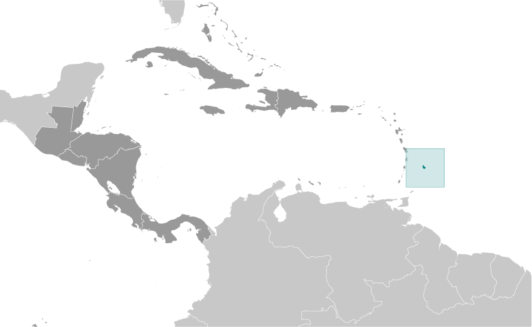
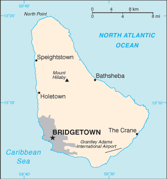

# Barbados

## Introduction

**_Background:_**   
The island was uninhabited when first settled by the British in 1627. African slaves worked the sugar plantations established on the island until 1834 when slavery was abolished. The economy remained heavily dependent on sugar, rum, and molasses production through most of the 20th century. The gradual introduction of social and political reforms in the 1940s and 1950s led to complete independence from the UK in 1966. In the 1990s, tourism and manufacturing surpassed the sugar industry in economic importance.

## Geography

**_Location:_**   
Caribbean, island in the North Atlantic Ocean, northeast of Venezuela

**_Geographic coordinates:_**   
13 10 N, 59 32 W

**_Map references:_**   
Central America and the Caribbean

**_Area:_**   
**total:** 430 sq km   
**land:** 430 sq km   
**water:** 0 sq km

**_Area - comparative:_**   
2.5 times the size of Washington, DC

**_Land boundaries:_**   
0 km

**_Coastline:_**   
97 km

**_Maritime claims:_**   
**territorial sea:** 12 nm   
**exclusive economic zone:** 200 nm

**_Climate:_**   
tropical; rainy season (June to October)

**_Terrain:_**   
relatively flat; rises gently to central highland region

**_Elevation extremes:_**   
**lowest point:** Atlantic Ocean 0 m   
**highest point:** Mount Hillaby 336 m

**_Natural resources:_**   
petroleum, fish, natural gas

**_Land use:_**   
**arable land:** 27.91%   
**permanent crops:** 2.33%   
**other:** 69.77% (2011)

**_Irrigated land:_**   
54.35 sq km (2003)

**_Total renewable water resources:_**   
0.08 cu km (2011)

**_Freshwater withdrawal (domestic/industrial/agricultural):_**   
**total:** 0.1 cu km/yr (20%/26%/54%)   
**per capita:** 371.3 cu m/yr (2009)

**_Natural hazards:_**   
infrequent hurricanes; periodic landslides

**_Environment - current issues:_**   
pollution of coastal waters from waste disposal by ships; soil erosion; illegal solid waste disposal threatens contamination of aquifers

**_Environment - international agreements:_**   
**party to:** Biodiversity, Climate Change, Climate Change-Kyoto Protocol, Desertification, Endangered Species, Hazardous Wastes, Law of the Sea, Marine Dumping, Ozone Layer Protection, Ship Pollution, Wetlands   
**signed, but not ratified:** none of the selected agreements

**_Geography - note:_**   
easternmost Caribbean island

## People and Society

**_Nationality:_**   
**noun:** Barbadian(s) or Bajan (colloquial)   
**adjective:** Barbadian or Bajan (colloquial)

**_Ethnic groups:_**   
black 92.4%, white 2.7%, mixed 3.1%, East Indian 1.3%, other 0.2%, unspecified 0.2% (2010 est.)

**_Languages:_**   
English (official), Bajan (English-based creole language, widely spoken in informal settings)

**_Religions:_**   
Protestant 66.3% (includes Anglican 23.9%, other Pentecostal 19.5%, Adventist 5.9%, Methodist 4.2%, Wesleyan 3.4%, Nazarene 3.2%, Church of God 2.4%, Baptist 1.8%, Moravian 1.2%, other Protestant .8%), Roman Catholic 3.8%, other Christian 5.4% (includes Jehovah's Witness 2.0%, other 3.4%), Rastafarian 1%, other 1.5%, none 20.6%, unspecified 1.2% (2010 est.)

**_Population:_**   
289,680 (July 2014 est.)

**_Age structure:_**   
**0-14 years:** 18.4% (male 26,709/female 26,716)   
**15-24 years:** 13.6% (male 19,705/female 19,754)   
**25-54 years:** 45% (male 64,821/female 65,394)   
**55-64 years:** 12.5% (male 16,837/female 19,286)   
**65 years and over:** 10.5% (male 12,068/female 18,390) (2014 est.)

**_Dependency ratios:_**   
**total dependency ratio:** 42.6 %   
**youth dependency ratio:** 26.8 %   
**elderly dependency ratio:** 15.8 %   
**potential support ratio:** 6.3 (2014 est.)

**_Median age:_**   
**total:** 37.6 years   
**male:** 36.5 years   
**female:** 38.7 years (2014 est.)

**_Population growth rate:_**   
0.33% (2014 est.)

**_Birth rate:_**   
11.97 births/1,000 population (2014 est.)

**_Death rate:_**   
8.41 deaths/1,000 population (2014 est.)

**_Net migration rate:_**   
-0.3 migrant(s)/1,000 population (2014 est.)

**_Urbanization:_**   
**urban population:** 44.4% of total population (2011)   
**rate of urbanization:** 1.35% annual rate of change (2010-15 est.)

**_Major urban areas - population:_**   
BRIDGETOWN (capital) 122,000 (2011)

**_Sex ratio:_**   
**at birth:** 1.01 male(s)/female   
**0-14 years:** 1 male(s)/female   
**15-24 years:** 1 male(s)/female   
**25-54 years:** 0.99 male(s)/female   
**55-64 years:** 0.94 male(s)/female   
**65 years and over:** 0.65 male(s)/female   
**total population:** 0.94 male(s)/female (2014 est.)

**_Maternal mortality rate:_**   
51 deaths/100,000 live births (2010)

**_Infant mortality rate:_**   
**total:** 10.93 deaths/1,000 live births   
**male:** 12.58 deaths/1,000 live births   
**female:** 9.26 deaths/1,000 live births (2014 est.)

**_Life expectancy at birth:_**   
**total population:** 74.99 years   
**male:** 72.64 years   
**female:** 77.37 years (2014 est.)

**_Total fertility rate:_**   
1.68 children born/woman (2014 est.)

**_Health expenditures:_**   
7.7% of GDP (2011)

**_Physicians density:_**   
1.81 physicians/1,000 population (2005)

**_Hospital bed density:_**   
6.6 beds/1,000 population (2010)

**_Drinking water source:_**   
**improved:** urban: 99.8% of population; rural: 99.8% of population; total: 99.8% of population   
**unimproved:** urban: 0.2% of population; rural: 0.2% of population; total: 0.2% of population (2012 est.)

**_Sanitation facility access:_**   
**improved:** urban: 91.6% of population; rural: 91.6% of population; total: 91.6% of population   
**unimproved:** urban: 8.4% of population; rural: 8.4% of population; total: 8.4% of population (2006 est.)

**_HIV/AIDS - adult prevalence rate:_**   
0.9% (2012 est.)

**_HIV/AIDS - people living with HIV/AIDS:_**   
1,500 (2012 est.)

**_HIV/AIDS - deaths:_**   
NA (2009 est.)

**_Obesity - adult prevalence rate:_**   
34.7% (2008)

**_Education expenditures:_**   
5.6% of GDP (2012)

**_Literacy:_**   
**definition:** age 15 and over has ever attended school   
**total population:** 99.7%   
**male:** 99.7%   
**female:** 99.7% (2002 est.)

**_School life expectancy (primary to tertiary education):_**   
**total:** 15 years   
**male:** 14 years   
**female:** 17 years (2011)

**_Unemployment, youth ages 15-24:_**   
**total:** 26.2%   
**male:** 24.1%   
**female:** 28.7% (2003)

## Government

**_Country name:_**   
**conventional long form:** none   
**conventional short form:** Barbados

**_Government type:_**   
parliamentary democracy and a Commonwealth realm

**_Capital:_**   
**name:** Bridgetown   
**geographic coordinates:** 13 06 N, 59 37 W   
**time difference:** UTC-4 (1 hour ahead of Washington, DC, during Standard Time)

**_Administrative divisions:_**   
11 parishes and 1 city\*; Bridgetown\*, Christ Church, Saint Andrew, Saint George, Saint James, Saint John, Saint Joseph, Saint Lucy, Saint Michael, Saint Peter, Saint Philip, Saint Thomas

**_Independence:_**   
30 November 1966 (from the UK)

**_National holiday:_**   
Independence Day, 30 November (1966)

**_Constitution:_**   
adopted 22 November 1966, effective 30 November 1966; amended several times, last in 2003 (2011)

**_Legal system:_**   
English common law; no judicial review of legislative acts

**_International law organization participation:_**   
accepts compulsory ICJ jurisdiction with reservations; accepts ICCt jurisdiction

**_Suffrage:_**   
18 years of age; universal

**_Executive branch:_**   
**chief of state:** Queen ELIZABETH II (since 6 February 1952); represented by Governor General Elliot BELGRAVE (since 1 June 2012)   
**head of government:** Prime Minister Freundel STUART (since 23 October 2010)   
**cabinet:** Cabinet appointed by the governor general on the advice of the prime minister   
**elections:** the monarchy is hereditary; governor general appointed by the monarch; following legislative elections, the leader of the majority party or the leader of the majority coalition is usually appointed prime minister by the governor general; the prime minister recommends the deputy prime minister

**_Legislative branch:_**   
bicameral Parliament consists of the Senate (21 seats; members appointed by the governor general - 12 on the advice of the Prime Minister, 2 on the advice of the opposition leader, and 7 at his discretion) and the House of Assembly (30 seats; members are elected by direct popular vote to serve five-year terms)   
**elections:** House of Assembly - last held on 21 February 2013 (next to be called in 2018)   
**election results:** House of Assembly - percent of vote by party - DLP 51.3%, BLP 48.3%, other 0.4%; seats by party - DLP 16, BLP 14

**_Judicial branch:_**   
**highest court(s):** Supreme Court (consists of the High Court with 8 justices) and the Court of Appeal (consists of the chief Justice and president of the court and 4 justices; note - Barbados, a member of the Caribbean Court of Justice, replaced the Judicial Committee of the Privy Council (in London) as the final court of appeal   
**judge selection and term of office:** Supreme Court chief justice appointed by the governor-general on the recommendation of the prime minister and opposition leader of Parliament; other justices appointed by the governor-general on the recommendation of the Judicial and Legal Service Commission, a 5-member independent body consisting of the Supreme Court chief justice, the commission head, and governor-general appointees recommended by the prime minister; justices serve until mandatory retirement at age 65   
**subordinate courts:** Magistrates' Courts

**_Political parties and leaders:_**   
Barbados Labor Party or BLP [Owen ARTHUR]   
Democratic Labor Party or DLP [Freundel STUART]   
People's Empowerment Party or PEP [David COMISSIONG]

**_Political pressure groups and leaders:_**   
Barbados Secondary Teachers' Union or BSTU [Mary REDMAN]   
Barbados Union of Teachers or BUT [Karen BEST]   
Congress of Trade Unions and Staff Associations of Barbados or CTUSAB, (includes the BWU, NUPW, BUT, and BSTU) [Leroy TROTMAN]   
Barbados Workers Union or BWU [Linda BROOKS]   
Clement Payne Labor Union [David COMISSIONG]   
National Union of Public Workers [Walter MALONEY]

**_International organization participation:_**   
ACP, AOSIS, C, Caricom, CDB, CELAC, FAO, G-77, IADB, IBRD, ICAO, ICRM, IDA, IFAD, IFC, IFRCS, ILO, IMF, IMO, Interpol, IOC, ISO, ITSO, ITU, ITUC (NGOs), LAES, MIGA, NAM, OAS, OPANAL, OPCW, UN, UNCTAD, UNESCO, UNIDO, UPU, WCO, WFTU (NGOs), WHO, WIPO, WMO, WTO

**_Diplomatic representation in the US:_**   
**chief of mission:** Ambassador John E. BEALE (since 29 January 2009)   
**chancery:** 2144 Wyoming Avenue NW, Washington, DC 20008   
**telephone:** [1] (202) 939-9200   
**FAX:** [1] (202) 332-7467   
**consulate(s) general:** Miami, New York   
**consulate(s):** Los Angeles

**_Diplomatic representation from the US:_**   
**chief of mission:** Ambassador Larry L. PALMER (since 9 May 2012); note - also accredited to Antigua and Barbuda, Dominica, Grenada, Saint Kitts and Nevis, Saint Lucia, and Saint Vincent and the Grenadines   
**embassy:** U.S. Embassy, Wildey Business Park, Wildey, St. Michael BB 14006   
**mailing address:** P. O. Box 302, Bridgetown BB 11000; (Department Name) Unit 3120, DPO AA 34055   
**telephone:** [1] (246) 227-4000   
**FAX:** [1] (246) 431-0179

**_Flag description:_**   
three equal vertical bands of blue (hoist side), gold, and blue with the head of a black trident centered on the gold band; the band colors represent the blue of the sea and sky and the gold of the beaches; the trident head represents independence and a break with the past (the colonial coat of arms contained a complete trident)

**_National symbol(s):_**   
Neptune's trident

**_National anthem:_**   
**name:** "The National Anthem of Barbados"   
**lyrics/music:** Irving BURGIE/C. Van Roland EDWARDS   
**note:** adopted 1966; the anthem is also known as "In Plenty and In Time of Need"

## Economy

**_Economy - overview:_**   
Barbados is the wealthiest and most developed country in the Eastern Caribbean and enjoys one of the highest per capita incomes in Latin America. Historically, the Barbadian economy was dependent on sugarcane cultivation and related activities. However, in recent years the economy has diversified into light industry and tourism with about four-fifths of GDP and of exports being attributed to services. Offshore finance and information services are important foreign exchange earners and thrive from having the same time zone as eastern US financial centers and a relatively highly educated workforce. Barbados' tourism, financial services, and construction industries have been hard hit since the onset of the global economic crisis in 2008. Barbados' public debt-to-GDP ratio rose from 56% in 2008 to 90.5% in 2013. Growth prospects are limited because of a weak tourism outlook and planned austerity measures.

**_GDP (purchasing power parity):_**   
$7.004 billion (2013 est.)   
$7.056 billion (2012 est.)   
$7.056 billion (2011 est.)   
**note:** data are in 2013 US dollars

**_GDP (official exchange rate):_**   
$4.262 billion (2013 est.)

**_GDP - real growth rate:_**   
-0.8% (2013 est.)   
0% (2012 est.)   
0.8% (2011 est.)

**_GDP - per capita (PPP):_**   
$25,100 (2013 est.)   
$25,400 (2012 est.)   
$25,400 (2011 est.)   
**note:** data are in 2013 US dollars

**_Gross national saving:_**   
9% of GDP (2013 est.)   
9.4% of GDP (2012 est.)   
3.4% of GDP (2011 est.)

**_GDP - composition, by end use:_**   
**household consumption:** 81.7%   
**government consumption:** 15.4%   
**investment in fixed capital:** 14.3%   
**investment in inventories:** 1.9%   
**exports of goods and services:** 40.5%   
**imports of goods and services:** -53.8%; (2013 est.)

**_GDP - composition, by sector of origin:_**   
**agriculture:** 3.1%   
**industry:** 13.9%   
**services:** 83% (2013 est.)

**_Agriculture - products:_**   
sugarcane, vegetables, cotton

**_Industries:_**   
tourism, sugar, light manufacturing, component assembly for export

**_Industrial production growth rate:_**   
-0.7% (2013 est.)

**_Labor force:_**   
141,800 (2013 est.)

**_Labor force - by occupation:_**   
**agriculture:** 10%   
**industry:** 15%   
**services:** 75% (1996 est.)

**_Unemployment rate:_**   
11.4% (2013 est.)   
11.6% (2012 est.)

**_Population below poverty line:_**   
NA%

**_Household income or consumption by percentage share:_**   
**lowest 10%:** NA%   
**highest 10%:** NA%

**_Budget:_**   
**revenues:** $1.15 billion (2013 est.)   
**expenditures:** $1.45 billion (2013 est.)

**_Taxes and other revenues:_**   
27% of GDP (2013 est.)

**_Budget surplus (+) or deficit (-):_**   
-7% of GDP (2013 est.)

**_Public debt:_**   
90.5% of GDP (2013 est.)   
85.6% of GDP (2012 est.)

**_Fiscal year:_**   
1 April - 31 March

**_Inflation rate (consumer prices):_**   
2.1% (2013 est.)   
4.8% (2012 est.)

**_Central bank discount rate:_**   
7% (31 December 2010 est.)   
7% (31 December 2009 est.)

**_Commercial bank prime lending rate:_**   
8.5% (31 December 2013 est.)   
8.7% (31 December 2012 est.)

**_Stock of narrow money:_**   
$1.749 billion (31 December 2013 est.)   
$1.711 billion (31 December 2012 est.)

**_Stock of broad money:_**   
$4.229 billion (31 December 2013 est.)   
$4.198 billion (31 December 2012 est.)

**_Stock of domestic credit:_**   
$5.035 billion (31 December 2013 est.)   
$4.874 billion (31 December 2012 est.)

**_Market value of publicly traded shares:_**   
$4.495 billion (31 December 2012 est.)   
$NA (31 December 2011)   
$4.366 billion (31 December 2010 est.)

**_Current account balance:_**   
-$276.6 million (2013 est.)   
-$204.4 million (2012 est.)

**_Exports:_**   
$1.051 billion (2013 est.)   
$1.039 billion (2012 est.)

**_Exports - commodities:_**   
manufactures, sugar and molasses, rum, other foods and beverages, chemicals, electrical components

**_Exports - partners:_**   
Trinidad and Tobago 20.8%, US 11.9%, St. Lucia 9.7%, St. Vincent and the Grenadines 6%, Jamaica 5.6%, Antigua and Barbuda 4.9%, St. Kitts and Nevis 4.6%, UK 4.4% (2012)

**_Imports:_**   
$1.674 billion (2013 est.)   
$1.584 billion (2012 est.)

**_Imports - commodities:_**   
consumer goods, machinery, foodstuffs, construction materials, chemicals, fuel, electrical components

**_Imports - partners:_**   
Trinidad and Tobago 35.9%, US 26.9%, China 5.6% (2012)

**_Reserves of foreign exchange and gold:_**   
$712.6 million (31 December 2013 est.)   
$839.7 million (31 December 2012 est.)

**_Debt - external:_**   
$4.49 billion (2010 est.)   
$668 million (2003 est.)

**_Exchange rates:_**   
Barbadian dollars (BBD) per US dollar -   
2 (2013 est.)   
2 (2012 est.)   
2 (2010 est.)   
**note:** the Barbadian dollar is pegged to the US dollar

## Energy

**_Electricity - production:_**   
1.002 billion kWh (2011 est.)

**_Electricity - consumption:_**   
986 million kWh (2010 est.)

**_Electricity - exports:_**   
0 kWh (2012 est.)

**_Electricity - imports:_**   
0 kWh (2012 est.)

**_Electricity - installed generating capacity:_**   
239,000 kW (2010 est.)

**_Electricity - from fossil fuels:_**   
100% of total installed capacity (2010 est.)

**_Electricity - from nuclear fuels:_**   
0% of total installed capacity (2010 est.)

**_Electricity - from hydroelectric plants:_**   
0% of total installed capacity (2010 est.)

**_Electricity - from other renewable sources:_**   
0% of total installed capacity (2010 est.)

**_Crude oil - production:_**   
1,001 bbl/day (2012 est.)

**_Crude oil - exports:_**   
764.5 bbl/day (2010 est.)

**_Crude oil - imports:_**   
0 bbl/day (2010 est.)

**_Crude oil - proved reserves:_**   
2.26 million bbl (1 January 2013 est.)

**_Refined petroleum products - production:_**   
31 bbl/day (2010 est.)

**_Refined petroleum products - consumption:_**   
8,339 bbl/day (2011 est.)

**_Refined petroleum products - exports:_**   
0 bbl/day (2010 est.)

**_Refined petroleum products - imports:_**   
8,736 bbl/day (2010 est.)

**_Natural gas - production:_**   
20 million cu m (2010 est.)

**_Natural gas - consumption:_**   
20 million cu m (2010 est.)

**_Natural gas - exports:_**   
0 cu m (2011 est.)

**_Natural gas - imports:_**   
0 cu m (2011 est.)

**_Natural gas - proved reserves:_**   
113.3 million cu m (1 January 2013 est.)

**_Carbon dioxide emissions from consumption of energy:_**   
1.442 million Mt (2011 est.)

## Communications

**_Telephones - main lines in use:_**   
144,000 (2012)

**_Telephones - mobile cellular:_**   
347,000 (2012)

**_Telephone system:_**   
**general assessment:** island-wide automatic telephone system   
**domestic:** fixed-line teledensity of roughly 50 per 100 persons; mobile-cellular telephone density approaching 125 per 100 persons   
**international:** country code - 1-246; landing point for the East Caribbean Fiber System (ECFS) submarine cable with links to 13 other islands in the eastern Caribbean extending from the British Virgin Islands to Trinidad; satellite earth stations - 1 (Intelsat - Atlantic Ocean); tropospheric scatter to Trinidad and Saint Lucia (2009)

**_Broadcast media:_**   
government-owned Caribbean Broadcasting Corporation (CBC) operates the lone terrestrial TV station; CBC also operates a multi-channel cable TV subscription service; roughly a dozen radio stations, consisting of a CBC-operated network operating alongside privately owned radio stations (2007)

**_Internet country code:_**   
.bb

**_Internet hosts:_**   
1,524 (2012)

**_Internet users:_**   
188,000 (2008)

## Transportation

**_Airports:_**   
1 (2013)

**_Airports - with paved runways:_**   
**total:** 1   
**over 3,047 m:** 1 (2013)

**_Pipelines:_**   
gas 33 km; oil 64 km; refined products 6 km (2013)

**_Roadways:_**   
**total:** 1,600 km   
**paved:** 1,600 km (2011)

**_Merchant marine:_**   
**total:** 109   
**by type:** bulk carrier 23, cargo 52, chemical tanker 13, container 6, passenger 1, passenger/cargo 1, petroleum tanker 8, refrigerated cargo 4, roll on/roll off 1   
**foreign-owned:** 83 (Canada 11, Greece 14, Iran 5, Lebanon 2, Norway 38, Sweden 4, Syria 1, Turkey 1, UAE 1, UK 6) (2010)

**_Ports and terminals:_**   
**major seaport(s):** Bridgetown

## Military

**_Military branches:_**   
Royal Barbados Defense Force: Troops Command, Barbados Coast Guard (2011)

**_Military service age and obligation:_**   
18 years of age for voluntary military service, or earlier with parental consent; no conscription (2013)

**_Manpower available for military service:_**   
**males age 16-49:** 73,820   
**females age 16-49:** 73,835 (2010 est.)

**_Manpower fit for military service:_**   
**males age 16-49:** 58,125   
**females age 16-49:** 58,016 (2010 est.)

**_Manpower reaching militarily significant age annually:_**   
**male:** 1,842   
**female:** 1,849 (2010 est.)

**_Military - note:_**   
the Royal Barbados Defense Force includes a land-based Troop Command and a small Coast Guard; the primary role of the land element is island defense against external aggression; the Command consists of a single, part-time battalion with a small regular cadre deployed throughout the island; the cadre increasingly supports the police in patrolling the coastline for smuggling and other illicit activities (2007)

## Transnational Issues

**_Disputes - international:_**   
Barbados and Trinidad and Tobago abide by the April 2006 Permanent Court of Arbitration decision delimiting a maritime boundary and limiting catches of flying fish in Trinidad and Tobago's exclusive economic zone; joins other Caribbean states to counter Venezuela's claim that Aves Island sustains human habitation, a criterion under the UN Convention on the Law of the Sea, which permits Venezuela to extend its Economic Exclusion Zone/continental shelf over a large portion of the eastern Caribbean Sea

**_Trafficking in persons:_**   
**current situation:** Barbados is a source and destination country for men, women, and children subjected to sex trafficking and forced labor; legal and illegal female migrants from Jamaica, the Dominican Republic, and Guyana seem most vulnerable to forced prostitution; Barbadian and immigrant children are prostituted in exchange for material goods; in the past, foreigners are reported to have been forced to work in the domestic service, agriculture, and construction industries   
**tier rating:** Tier 2 Watch List - Barbados does not fully comply with the minimum standards for the elimination of trafficking; however, it is making significant efforts to do so; the country was granted a waiver of an otherwise required downgrade to Tier 3 because the government adopted a national action plan on human trafficking that specifies implementing agencies and addresses prosecution, protection, and prevention measures; the government conducted at least two sex trafficking investigations in 2012, as opposed to none in the previous year but did not report any prosecutions or convictions of trafficking offenses; Barbadian law does not appear to prohibit all forms of human trafficking and does not prescribe sufficiently stringent penalties; government efforts to prevent human trafficking included broadcasting short public awareness messages, holding town hall meetings, and funding a hotline (2013)

**_Illicit drugs:_**   
one of many Caribbean transshipment points for narcotics bound for Europe and the US; offshore financial center

............................................................   
_Page last updated on June 23, 2014_
