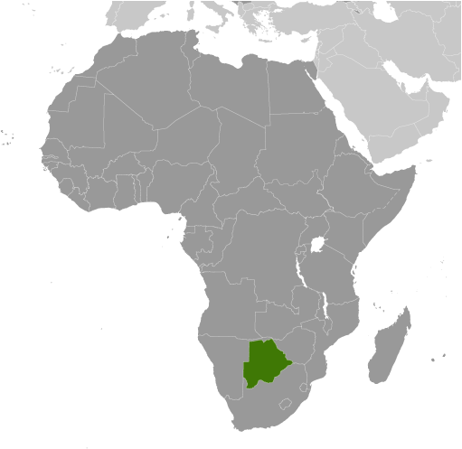
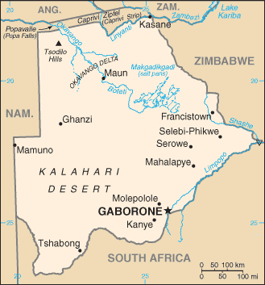

# Botswana

## Introduction

**_Background:_**   
Formerly the British protectorate of Bechuanaland, Botswana adopted its new name upon independence in 1966. More than four decades of uninterrupted civilian leadership, progressive social policies, and significant capital investment have created one of the most stable economies in Africa. Mineral extraction, principally diamond mining, dominates economic activity, though tourism is a growing sector due to the country's conservation practices and extensive nature preserves. Botswana has one of the world's highest known rates of HIV/AIDS infection, but also one of Africa's most progressive and comprehensive programs for dealing with the disease.

## Geography

**_Location:_**   
Southern Africa, north of South Africa

**_Geographic coordinates:_**   
22 00 S, 24 00 E

**_Map references:_**   
Africa

**_Area:_**   
**total:** 581,730 sq km   
**land:** 566,730 sq km   
**water:** 15,000 sq km

**_Area - comparative:_**   
slightly smaller than Texas

**_Land boundaries:_**   
**total:** 4,347.1 km   
**border countries:** Namibia 1,544 km, South Africa 1,969 km, Zambia 0.1 km, Zimbabwe 834 km

**_Coastline:_**   
0 km (landlocked)

**_Maritime claims:_**   
none (landlocked)

**_Climate:_**   
semiarid; warm winters and hot summers

**_Terrain:_**   
predominantly flat to gently rolling tableland; Kalahari Desert in southwest

**_Elevation extremes:_**   
**lowest point:** junction of the Limpopo and Shashe Rivers 513 m   
**highest point:** Tsodilo Hills 1,489 m

**_Natural resources:_**   
diamonds, copper, nickel, salt, soda ash, potash, coal, iron ore, silver

**_Land use:_**   
**arable land:** 0.45%   
**permanent crops:** 0%   
**other:** 99.55% (2011)

**_Irrigated land:_**   
14.39 sq km (2003)

**_Total renewable water resources:_**   
12.24 cu km (2011)

**_Freshwater withdrawal (domestic/industrial/agricultural):_**   
**total:** 0.19 cu km/yr (42%/19%/39%)   
**per capita:** 107.3 cu m/yr (2005)

**_Natural hazards:_**   
periodic droughts; seasonal August winds blow from the west, carrying sand and dust across the country, which can obscure visibility

**_Environment - current issues:_**   
overgrazing; desertification; limited freshwater resources

**_Environment - international agreements:_**   
**party to:** Biodiversity, Climate Change, Climate Change-Kyoto Protocol, Desertification, Endangered Species, Hazardous Wastes, Law of the Sea, Ozone Layer Protection, Wetlands   
**signed, but not ratified:** none of the selected agreements

**_Geography - note:_**   
landlocked; population concentrated in eastern part of the country

## People and Society

**_Nationality:_**   
**noun:** Motswana (singular), Batswana (plural)   
**adjective:** Motswana (singular), Batswana (plural)

**_Ethnic groups:_**   
Tswana (or Setswana) 79%, Kalanga 11%, Basarwa 3%, other, including Kgalagadi and white 7%

**_Languages:_**   
Setswana 78.2%, Kalanga 7.9%, Sekgalagadi 2.8%, English (official) 2.1%, other 8.6%, unspecified 0.4% (2001 census)

**_Religions:_**   
Christian 71.6%, Badimo 6%, other 1.4%, unspecified 0.4%, none 20.6% (2001 census)

**_Population:_**   
2,155,784   
**note:** estimates for this country explicitly take into account the effects of excess mortality due to AIDS; this can result in lower life expectancy, higher infant mortality, higher death rates, lower population growth rates, and changes in the distribution of population by age and sex than would otherwise be expected (July 2014 est.)

**_Age structure:_**   
**0-14 years:** 32.9% (male 361,717/female 348,150)   
**15-24 years:** 21.6% (male 231,576/female 234,852)   
**25-54 years:** 37% (male 422,182/female 375,836)   
**55-64 years:** 4.4% (male 42,099/female 52,917)   
**65 years and over:** 4% (male 34,567/female 51,888) (2014 est.)

**_Dependency ratios:_**   
**total dependency ratio:** 58.6 %   
**youth dependency ratio:** 52.8 %   
**elderly dependency ratio:** 5.9 %   
**potential support ratio:** 17.1 (2014 est.)

**_Median age:_**   
**total:** 22.9 years   
**male:** 22.9 years   
**female:** 22.8 years (2014 est.)

**_Population growth rate:_**   
1.26% (2014 est.)

**_Birth rate:_**   
21.34 births/1,000 population (2014 est.)

**_Death rate:_**   
13.32 deaths/1,000 population (2014 est.)

**_Net migration rate:_**   
4.62 migrant(s)/1,000 population   
**note:** there is an increasing flow of Zimbabweans into South Africa and Botswana in search of better economic opportunities (2014 est.)

**_Urbanization:_**   
**urban population:** 61.7% of total population (2011)   
**rate of urbanization:** 2.07% annual rate of change (2010-15 est.)

**_Major urban areas - population:_**   
GABORONE (capital) 202,000 (2011)

**_Sex ratio:_**   
**at birth:** 1.03 male(s)/female   
**0-14 years:** 1.04 male(s)/female   
**15-24 years:** 0.99 male(s)/female   
**25-54 years:** 1.12 male(s)/female   
**55-64 years:** 1.03 male(s)/female   
**65 years and over:** 0.67 male(s)/female   
**total population:** 1.02 male(s)/female (2014 est.)

**_Mother's mean age at first birth:_**   
19 (2007 est.)

**_Maternal mortality rate:_**   
160 deaths/100,000 live births (2010)

**_Infant mortality rate:_**   
**total:** 9.38 deaths/1,000 live births   
**male:** 9.77 deaths/1,000 live births   
**female:** 8.99 deaths/1,000 live births (2014 est.)

**_Life expectancy at birth:_**   
**total population:** 54.06 years   
**male:** 55.75 years   
**female:** 52.32 years (2014 est.)

**_Total fertility rate:_**   
2.37 children born/woman (2014 est.)

**_Contraceptive prevalence rate:_**   
52.8%   
**note:** percent of women aged 12-49 (2007/08)

**_Health expenditures:_**   
5.1% of GDP (2011)

**_Physicians density:_**   
0.34 physicians/1,000 population (2006)

**_Hospital bed density:_**   
1.8 beds/1,000 population (2010)

**_Drinking water source:_**   
**improved:** urban: 99.3% of population; rural: 92.8% of population; total: 96.8% of population   
**unimproved:** urban: 0.7% of population; rural: 7.2% of population; total: 3.2% of population (2012 est.)

**_Sanitation facility access:_**   
**improved:** urban: 77.9% of population; rural: 41.8% of population; total: 64.3% of population   
**unimproved:** urban: 22.1% of population; rural: 58.2% of population; total: 35.7% of population (2012 est.)

**_HIV/AIDS - adult prevalence rate:_**   
23% (2012 est.)

**_HIV/AIDS - people living with HIV/AIDS:_**   
337,700 (2012 est.)

**_HIV/AIDS - deaths:_**   
5,700 (2012 est.)

**_Major infectious diseases:_**   
**degree of risk:** high   
**food or waterborne diseases:** bacterial diarrhea, hepatitis A, and typhoid fever   
**vectorborne disease:** malaria (2013)

**_Obesity - adult prevalence rate:_**   
11.2% (2008)

**_Children under the age of 5 years underweight:_**   
11.2% (2008)

**_Education expenditures:_**   
9.5% of GDP (2009)

**_Literacy:_**   
**definition:** age 15 and over can read and write   
**total population:** 85.1%   
**male:** 84.6%   
**female:** 85.6% (2011 est.)

**_School life expectancy (primary to tertiary education):_**   
**total:** 12 years   
**male:** 12 years   
**female:** 12 years (2006)

**_Child labor - children ages 5-14:_**   
**total number:** 45,036   
**percentage:** 9 %   
**note:** data represents children ages 7-17 (2006 est.)

**_Unemployment, youth ages 15-24:_**   
**total:** 13.6%   
**male:** 13.2%   
**female:** 14% (2000)

## Government

**_Country name:_**   
**conventional long form:** Republic of Botswana   
**conventional short form:** Botswana   
**local long form:** Republic of Botswana   
**local short form:** Botswana   
**former:** Bechuanaland

**_Government type:_**   
parliamentary republic

**_Capital:_**   
**name:** Gaborone   
**geographic coordinates:** 24 38 S, 25 54 E   
**time difference:** UTC+2 (7 hours ahead of Washington, DC, during Standard Time)

**_Administrative divisions:_**   
10 districts and 6 town councils\*; Central, Chobe, Francistown\*, Gaborone\*, Ghanzi, Jwaneng\*, Kgalagadi, Kgatleng, Kweneng, Lobatse\*, North East, North West, Selebi-Phikwe\*, South East, Southern, Sowa Town

**_Independence:_**   
30 September 1966 (from the UK)

**_National holiday:_**   
Independence Day (Botswana Day), 30 September (1966)

**_Constitution:_**   
previous 1960 (preindependence); latest adopted March 1965, effective 30 September 1966; amended several times, last in 2006 (2006)

**_Legal system:_**   
mixed legal system of civil law influenced by the Roman-Dutch model and also customary and common law

**_International law organization participation:_**   
accepts compulsory ICJ jurisdiction with reservations; accepts ICCt jurisdiction

**_Suffrage:_**   
18 years of age; universal

**_Executive branch:_**   
**chief of state:** President Seretse Khama Ian KHAMA (since 1 April 2008); Vice President Ponatshego KEDIKILWE (since 2 August 2012); note - the president is both chief of state and head of government   
**head of government:** President Seretse Khama Ian KHAMA (since 1 April 2008); Vice President Ponatshego KEDIKILWE (since 2 August 2012)   
**cabinet:** Cabinet appointed by the president   
**elections:** president indirectly elected for a five-year term (eligible for a second term); election last held on 20 October 2009 (next to be held in October 2014); vice president appointed by the president   
**election results:** Seretse Khama Ian KHAMA elected president; percent of National Assembly vote - NA

**_Legislative branch:_**   
bicameral Parliament consists of the House of Chiefs (a largely advisory 35-member body with 8 ex-officio members consisting of the chiefs of the principal tribes, and 27 non-permanent members serving five-year terms, of which 22 are indirectly elected with the remaining 5 appointed by the President) and the National Assembly (63 seats; 57 members directly elected by popular vote, 4 appointed by the majority party, and 2, the President and Attorney General, serve as ex-officio members; members serve five-year terms)   
**elections:** National Assembly elections last held on 16 October 2009 (next to be held in 2014)   
**election results:** percent of vote by party - BDP 53.3%, BNF 21.9%, BCP 19.2%, BAM 2.3%, other 3.3%; seats by party - BDP 45, BNF 6, BCP 4, BAM 1, other 1

**_Judicial branch:_**   
**highest court(s):** Court of Appeal, High Court (each consists of a chief justice and number of other judges as prescribed by the Parliament)   
**judge selection and term of office:** Court of Appeal and High Court chief justices appointed by the president and other judges appointed by the president upon the advice of the Judicial Service Commission; all judges appointed to serve until age 70   
**subordinate courts:** Industrial Court (with circuits scheduled monthly in the capital city and in three districts); Magistrates Courts (one in each district); Customary Court of Appeal; Paramount Chief's Court/Urban Customary Court; Senior Chief's Representative Court; Chief's Representative’s Court; Headman's Court

**_Political parties and leaders:_**   
Botswana Alliance Movement or BAM [Ephraim Lepetu SETSHWAELO]; Botswana Congress Party or BCP [Dumelang SALESHANDO]; Botswana Democratic Party or BDP [Ian KHAMA]; Botswana Movement for Democracy or BMD [Gomolemo MOTSWALEDI]; Botswana National Front or BNF [Duma BOKO]; Botswana Peoples Party or BPP [Motlatsi MOLAPISI]; MELS Movement of Botswana or MELS [Themba JOINA]; New Democratic Front or NDF [Dick BAYFORD]   
**note:** a number of minor parties joined forces in 1999 to form the BAM but did not capture any parliamentary seats - includes the United Action Party [Ephraim Lepetu SETSHWAELO]; the Independence Freedom Party or IFP [Motsamai MPHO]; the Botswana Progressive Union [D. K. KWELE]

**_Political pressure groups and leaders:_**   
First People of the Kalahari (Bushman organization); Pitso Ya Ba Tswana; Society for the Promotion of Ikalanga Language (Kalanga elites)   
**other:** diamond mining companies

**_International organization participation:_**   
ACP, AfDB, AU, C, CD, FAO, G-77, IAEA, IBRD, ICAO, ICRM, IDA, IFAD, IFC, IFRCS, ILO, IMF, Interpol, IOC, IOM, IPU, ISO, ITSO, ITU, ITUC (NGOs), MIGA, NAM, OPCW, SACU, SADC, UN, UNCTAD, UNESCO, UNIDO, UNWTO, UPU, WCO, WFTU (NGOs), WHO, WIPO, WMO, WTO

**_Diplomatic representation in the US:_**   
**chief of mission:** Ambassador Tebelelo Mazile SERETSE (since 16 February 2011)   
**chancery:** 1531-1533 New Hampshire Avenue NW, Washington, DC 20036   
**telephone:** [1] (202) 244-4990   
**FAX:** [1] (202) 244-4164

**_Diplomatic representation from the US:_**   
**chief of mission:** Ambassador Michelle D. GAVIN (since 15 June 2011)   
**embassy:** Embassy Drive, Government Enclave (off Khama Crescent), Gaborone   
**mailing address:** Embassy Enclave, P. O. Box 90, Gaborone   
**telephone:** [267] 395-3982   
**FAX:** [267] 318-0232

**_Flag description:_**   
light blue with a horizontal white-edged black stripe in the center; the blue symbolizes water in the form of rain, while the black and white bands represent racial harmony

**_National symbol(s):_**   
zebra

**_National anthem:_**   
**name:** "Fatshe leno la rona" (Our Land)   
**lyrics/music:** Kgalemang Tumedisco MOTSETE   
**note:** adopted 1966

## Economy

**_Economy - overview:_**   
Botswana has maintained one of the world's highest economic growth rates since independence in 1966. However, economic growth was negative in 2009, with the industrial sector shrinking by 30%, after the global crisis reduced demand for Botswana's diamonds. Although the economy recovered in 2010, GDP growth has again slowed. Through fiscal discipline and sound management, Botswana transformed itself from one of the poorest countries in the world to a middle-income country with a per capita GDP of $16,400 in 2013. Two major investment services rank Botswana as the best credit risk in Africa. Diamond mining has fueled much of the expansion and currently accounts for more than one-third of GDP, 70-80% of export earnings, and about one-third of the government's revenues. Botswana's heavy reliance on a single luxury export was a critical factor in the sharp economic contraction of 2009. Tourism, financial services, subsistence farming, and cattle raising are other key sectors. According to official government statistics, unemployment reached 17.8% in 2009, but unofficial estimates run much higher. The prevalence of HIV/AIDS is second highest in the world and threatens Botswana's impressive economic gains. An expected leveling off in diamond production within the next two decades overshadows long-term prospects. A major international diamond company signed a 10-year deal with Botswana in 2012 to move its rough stone sorting and trading division from London to Gaborone by the end of 2013. The move may support Botswana's downstream diamond industry.

**_GDP (purchasing power parity):_**   
$34 billion (2013 est.)   
$32.71 billion (2012 est.)   
$31.4 billion (2011 est.)   
**note:** data are in 2013 US dollars

**_GDP (official exchange rate):_**   
$15.53 billion (2013 est.)

**_GDP - real growth rate:_**   
3.9% (2013 est.)   
4.2% (2012 est.)   
6.1% (2011 est.)

**_GDP - per capita (PPP):_**   
$16,400 (2013 est.)   
$15,900 (2012 est.)   
$15,500 (2011 est.)   
**note:** data are in 2013 US dollars

**_Gross national saving:_**   
33.7% of GDP (2013 est.)   
28.9% of GDP (2012 est.)   
41.1% of GDP (2011 est.)

**_GDP - composition, by end use:_**   
**household consumption:** 51.6%   
**government consumption:** 18.3%   
**investment in fixed capital:** 34.1%   
**investment in inventories:** -1.2%   
**exports of goods and services:** 47%   
**imports of goods and services:** -49.8%; (2013 est.)

**_GDP - composition, by sector of origin:_**   
**agriculture:** 1.9%   
**industry:** 35.7%   
**services:** 62.4% (2013 est.)

**_Agriculture - products:_**   
livestock, sorghum, maize, millet, beans, sunflowers, groundnuts

**_Industries:_**   
diamonds, copper, nickel, salt, soda ash, potash, coal, iron ore, silver; livestock processing; textiles

**_Industrial production growth rate:_**   
7.2% (2013 est.)

**_Labor force:_**   
1.308 million (2013 est.)

**_Labor force - by occupation:_**   
**agriculture:** NA%   
**industry:** NA%   
**services:** NA%

**_Unemployment rate:_**   
17.8% (2009 est.)   
7.5% (2007 est.)

**_Population below poverty line:_**   
30.3% (2003)

**_Household income or consumption by percentage share:_**   
**lowest 10%:** NA%   
**highest 10%:** NA%

**_Distribution of family income - Gini index:_**   
63 (1993)

**_Budget:_**   
**revenues:** $5.04 billion   
**expenditures:** $4.952 billion (2013 est.)

**_Taxes and other revenues:_**   
32.4% of GDP (2013 est.)

**_Budget surplus (+) or deficit (-):_**   
0.6% of GDP (2013 est.)

**_Public debt:_**   
17.9% of GDP (2013 est.)   
17.4% of GDP (2012 est.)

**_Fiscal year:_**   
1 April - 31 March

**_Inflation rate (consumer prices):_**   
6.1% (2013 est.)   
7.5% (2012 est.)

**_Central bank discount rate:_**   
9.5% (31 December 2010 est.)   
10% (31 December 2009 est.)

**_Commercial bank prime lending rate:_**   
10% (31 December 2013 est.)   
11% (31 December 2012 est.)

**_Stock of narrow money:_**   
$1.517 billion (31 December 2013 est.)   
$1.358 billion (31 December 2012 est.)

**_Stock of broad money:_**   
$8.293 billion (31 December 2013 est.)   
$7.635 billion (31 December 2012 est.)

**_Stock of domestic credit:_**   
$1.38 billion (31 December 2013 est.)   
$2.111 billion (31 December 2012 est.)

**_Market value of publicly traded shares:_**   
$4.588 billion (31 December 2012 est.)   
$4.107 billion (31 December 2011)   
$4.076 billion (31 December 2010 est.)

**_Current account balance:_**   
$1.375 billion (2013 est.)   
-$795.2 million (2012 est.)

**_Exports:_**   
$7.569 billion (2013 est.)   
$6.011 billion (2012 est.)

**_Exports - commodities:_**   
diamonds, copper, nickel, soda ash, meat, textiles

**_Imports:_**   
$7.389 billion (2013 est.)   
$7.918 billion (2012 est.)

**_Imports - commodities:_**   
foodstuffs, machinery, electrical goods, transport equipment, textiles, fuel and petroleum products, wood and paper products, metal and metal products

**_Reserves of foreign exchange and gold:_**   
$7.933 billion (31 December 2013 est.)   
$7.628 billion (31 December 2012 est.)

**_Debt - external:_**   
$2.416 billion (31 December 2013 est.)   
$2.443 billion (31 December 2012 est.)

**_Exchange rates:_**   
pulas (BWP) per US dollar -   
8.732 (2013 est.)   
7.6181 (2012 est.)   
6.7936 (2010 est.)   
7.1551 (2009)   
6.7907 (2008)

## Energy

**_Electricity - production:_**   
429.6 million kWh (2010 est.)

**_Electricity - consumption:_**   
3.118 billion kWh (2011 est.)

**_Electricity - exports:_**   
0 kWh (2012 est.)

**_Electricity - imports:_**   
2.985 billion kWh (2010 est.)

**_Electricity - installed generating capacity:_**   
132,000 kW (2011 est.)

**_Electricity - from fossil fuels:_**   
100% of total installed capacity (2010 est.)

**_Electricity - from nuclear fuels:_**   
0% of total installed capacity (2010 est.)

**_Electricity - from hydroelectric plants:_**   
0% of total installed capacity (2010 est.)

**_Electricity - from other renewable sources:_**   
0% of total installed capacity (2010 est.)

**_Crude oil - production:_**   
0 bbl/day (2012 est.)

**_Crude oil - exports:_**   
0 bbl/day (2010 est.)

**_Crude oil - imports:_**   
0 bbl/day (2010 est.)

**_Crude oil - proved reserves:_**   
0 bbl (1 January 2013 est.)

**_Refined petroleum products - production:_**   
0 bbl/day (2010 est.)

**_Refined petroleum products - consumption:_**   
15,420 bbl/day (2011 est.)

**_Refined petroleum products - exports:_**   
0 bbl/day (2010 est.)

**_Refined petroleum products - imports:_**   
19,360 bbl/day (2010 est.)

**_Natural gas - production:_**   
0 cu m (2011 est.)

**_Natural gas - consumption:_**   
0 cu m (2010 est.)

**_Natural gas - exports:_**   
0 cu m (2011 est.)

**_Natural gas - imports:_**   
0 cu m (2011 est.)

**_Natural gas - proved reserves:_**   
0 cu m (1 January 2013 est.)

**_Carbon dioxide emissions from consumption of energy:_**   
3.843 million Mt (2011 est.)

## Communications

**_Telephones - main lines in use:_**   
160,500 (2012)

**_Telephones - mobile cellular:_**   
3.082 million (2012)

**_Telephone system:_**   
**general assessment:** Botswana is participating in regional development efforts; expanding fully digital system with fiber-optic cables linking the major population centers in the east as well as a system of open-wire lines, microwave radio relays links, and radiotelephone communication stations   
**domestic:** fixed-line teledensity has declined in recent years and now stands at roughly 7 telephones per 100 persons; mobile-cellular teledensity now pushing 140 telephones per 100 persons   
**international:** country code - 267; international calls are made via satellite, using international direct dialing; 2 international exchanges; digital microwave radio relay links to Namibia, Zambia, Zimbabwe, and South Africa; satellite earth station - 1 Intelsat (Indian Ocean) (2011)

**_Broadcast media:_**   
2 TV stations - 1 state-owned and 1 privately owned; privately owned satellite TV subscription service is available; 2 state-owned national radio stations; 3 privately owned radio stations broadcast locally (2007)

**_Internet country code:_**   
.bw

**_Internet hosts:_**   
1,806 (2012)

**_Internet users:_**   
120,000 (2009)

## Transportation

**_Airports:_**   
74 (2013)

**_Airports - with paved runways:_**   
**total:** 10   
**over 3,047 m:** 2   
**2,438 to 3,047 m:** 1   
**1,524 to 2,437 m:** 6   
**914 to 1,523 m:** 1 (2013)

**_Airports - with unpaved runways:_**   
**total:** 64   
**1,524 to 2,437 m:** 5   
**914 to 1,523 m:** 46   
**under 914 m:** 13 (2013)

**_Railways:_**   
**total:** 888 km   
**narrow gauge:** 888 km 1.067-m gauge (2008)

**_Roadways:_**   
**total:** 17,916 km   
**note:** includes 8,916 km of Public Highway Network roads (6,116 km paved and 2,800 km unpaved) and other 9,000 km of District Council roads (2011)

## Military

**_Military branches:_**   
Botswana Defense Force (BDF): Ground Forces Command, Air Wing Command, Defense Logistics Command, Special Forces Group (2013)

**_Military service age and obligation:_**   
18 is the legal minimum age for voluntary military service; no conscription (2012)

**_Manpower available for military service:_**   
**males age 16-49:** 557,647   
**females age 16-49:** 531,095 (2010 est.)

**_Manpower fit for military service:_**   
**males age 16-49:** 340,949   
**females age 16-49:** 302,332 (2010 est.)

**_Manpower reaching militarily significant age annually:_**   
**male:** 23,649   
**female:** 23,063 (2010 est.)

**_Military expenditures:_**   
2.31% of GDP (2012)   
2.43% of GDP (2011)   
2.31% of GDP (2010)

## Transnational Issues

**_Disputes - international:_**   
none

............................................................   
_Page last updated on June 23, 2014_
