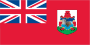
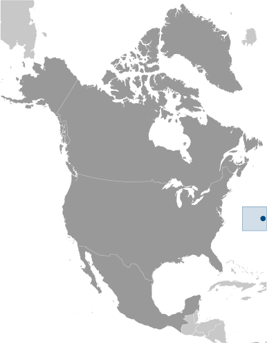
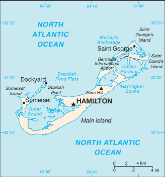

# Bermuda

_overseas territory of the UK_

## Introduction

**_Background:_**   
Bermuda was first settled in 1609 by shipwrecked English colonists headed for Virginia. Self-governing since 1620, Bermuda is the oldest and most populous of the British overseas territories. Vacationing to the island to escape North American winters first developed in Victorian times. Tourism continues to be important to the island's economy, although international business has overtaken it in recent years. Bermuda has also developed into a highly successful offshore financial center. A referendum on independence from the UK was soundly defeated in 1995.

## Geography

**_Location:_**   
North America, group of islands in the North Atlantic Ocean, east of South Carolina (US)

**_Geographic coordinates:_**   
32 20 N, 64 45 W

**_Map references:_**   
North America

**_Area:_**   
**total:** 54 sq km   
**land:** 54 sq km   
**water:** 0 sq km

**_Area - comparative:_**   
about one-third the size of Washington, DC

**_Land boundaries:_**   
0 km

**_Coastline:_**   
103 km

**_Maritime claims:_**   
**territorial sea:** 12 nm   
**exclusive fishing zone:** 200 nm

**_Climate:_**   
subtropical; mild, humid; gales, strong winds common in winter

**_Terrain:_**   
low hills separated by fertile depressions

**_Elevation extremes:_**   
**lowest point:** Atlantic Ocean 0 m   
**highest point:** Town Hill 76 m

**_Natural resources:_**   
limestone, pleasant climate fostering tourism

**_Land use:_**   
**arable land:** 14.8%   
**permanent crops:** 0%   
**other:** 85.2% (55% developed, 45% rural/open space) (2011)

**_Irrigated land:_**   
NA

**_Natural hazards:_**   
hurricanes (June to November)

**_Environment - current issues:_**   
sustainable development

**_Geography - note:_**   
consists of about 138 coral islands and islets with ample rainfall, but no rivers or freshwater lakes; some land was leased by the US Government from 1941 to 1995

## People and Society

**_Nationality:_**   
**noun:** Bermudian(s)   
**adjective:** Bermudian

**_Ethnic groups:_**   
black 53.8%, white 31%, mixed 7.5%, other 7.1%, unspecified 0.6% (2010 est.)

**_Languages:_**   
English (official), Portuguese

**_Religions:_**   
Protestant 46.1% (Anglican 15.8%, African Methodist Episcopal 8.6%, Seventh Day Adventist 6.7, Pentecostal 3.5%, Methodist 2.7%, Presbyterian 2.0 %, Church of God 1.6%, Baptist 1.2%, Salvation Army 1.1%, Bretheren 1.0%, other Protestant 2.0%), Roman Catholic 14.5%, Jehovah's Witness 1.3%, other Christian 9.1%, Muslim 1%, other 3.9%, none 17.8%, unspecified 6.2% (2010 est.)

**_Population:_**   
69,839 (July 2014 est.)

**_Age structure:_**   
**0-14 years:** 17.5% (male 6,165/female 6,031)   
**15-24 years:** 12.2% (male 4,275/female 4,267)   
**25-54 years:** 39.3% (male 13,706/female 13,741)   
**55-64 years:** 14.6% (male 4,813/female 5,368)   
**65 years and over:** 16.4% (male 4,821/female 6,652) (2014 est.)

**_Median age:_**   
**total:** 42.9 years   
**male:** 41.1 years   
**female:** 44.6 years (2014 est.)

**_Population growth rate:_**   
0.52% (2014 est.)

**_Birth rate:_**   
11.35 births/1,000 population (2014 est.)

**_Death rate:_**   
8.06 deaths/1,000 population (2014 est.)

**_Net migration rate:_**   
1.92 migrant(s)/1,000 population (2014 est.)

**_Urbanization:_**   
**urban population:** 100% of total population (2011)   
**rate of urbanization:** 0.19% annual rate of change (2010-15 est.)

**_Major urban areas - population:_**   
HAMILTON (capital) 11,000 (2011)

**_Sex ratio:_**   
**at birth:** 1.02 male(s)/female   
**0-14 years:** 1.02 male(s)/female   
**15-24 years:** 1 male(s)/female   
**25-54 years:** 1 male(s)/female   
**55-64 years:** 0.94 male(s)/female   
**65 years and over:** 0.72 male(s)/female   
**total population:** 0.94 male(s)/female (2014 est.)

**_Infant mortality rate:_**   
**total:** 2.48 deaths/1,000 live births   
**male:** 2.58 deaths/1,000 live births   
**female:** 2.37 deaths/1,000 live births (2014 est.)

**_Life expectancy at birth:_**   
**total population:** 81.04 years   
**male:** 77.83 years   
**female:** 84.31 years (2014 est.)

**_Total fertility rate:_**   
1.95 children born/woman (2014 est.)

**_HIV/AIDS - adult prevalence rate:_**   
0.3% (2005 est.)

**_HIV/AIDS - people living with HIV/AIDS:_**   
163 (2005 est.)

**_HIV/AIDS - deaths:_**   
392 (2005 est.)

**_Education expenditures:_**   
2.6% of GDP (2010)

**_Literacy:_**   
**definition:** age 15 and over can read and write   
**total population:** 98%   
**male:** 98%   
**female:** 99% (2005 est.)

**_School life expectancy (primary to tertiary education):_**   
**total:** 12 years   
**male:** 11 years   
**female:** 13 years (2011)

**_Unemployment, youth ages 15-24:_**   
**total:** 10.8%   
**male:** 14.3%   
**female:** 7.6% (2000)

## Government

**_Country name:_**   
**conventional long form:** none   
**conventional short form:** Bermuda   
**former:** Somers Islands

**_Dependency status:_**   
overseas territory of the UK

**_Government type:_**   
parliamentary; self-governing territory

**_Capital:_**   
**name:** Hamilton   
**geographic coordinates:** 32 17 N, 64 47 W   
**time difference:** UTC-4 (1 hour ahead of Washington, DC, during Standard Time)   
**daylight saving time:** +1hr, begins second Sunday in March; ends first Sunday in November

**_Administrative divisions:_**   
9 parishes and 2 municipalities\*; Devonshire, Hamilton, Hamilton\*, Paget, Pembroke, Saint George\*, Saint George's, Sandys, Smith's, Southampton, Warwick

**_Independence:_**   
none (overseas territory of the UK)

**_National holiday:_**   
Bermuda Day, 24 May

**_Constitution:_**   
several previous (dating to 1684); latest entered into force 8 June 1968; amended several times, last in 2003 (2013)

**_Legal system:_**   
English common law

**_International law organization participation:_**   
has not submitted an ICJ jurisdiction declaration; non-party state to the ICCt

**_Suffrage:_**   
18 years of age; universal

**_Executive branch:_**   
**chief of state:** Queen ELIZABETH II (since 6 February 1952); represented by Governor George FERGUSSON (since 23 May 2012)   
**head of government:** Premier Michael DUNKLEY (since 20 May 2014)   
**cabinet:** Cabinet nominated by the premier, appointed by the governor   
**elections:** the monarchy is hereditary; governor appointed by the monarch; following legislative elections, the leader of the majority party or the leader of the majority coalition usually appointed premier by the governor

**_Legislative branch:_**   
bicameral Parliament consists of the Senate (11 seats; members appointed by the governor, the premier, and the opposition to serve a five-year term) and the House of Assembly (36 seats; members are elected by popular vote to serve up to five-year terms)   
**elections:** last held on 17 December 2012 (next to be held not later than 2017)   
**election results:** percent of vote by party - OBA 51.7%, PLP 46.1%, other 2.2%; seats by party - OBA 19, PLP 17

**_Judicial branch:_**   
**highest court(s):** Court of Appeal (consists of the court president and 4 justices); Supreme Court (consists of the chief justice, 4 puisne judges, and 1 associate justice); note - the Judicial Committee of the Privy Council, in London, is the court of last resort   
**judge selection and term of office:** Court of Appeal justice appointed by the governor; justice tenure by individual appointment; Supreme Court judges nominated by the Judicial and Legal Services Commission and appointed by the governor; judge tenure NA   
**subordinate courts:** commercial court (began in 2006); magistrates' courts

**_Political parties and leaders:_**   
Progressive Labor Party or PLP [Marc BEAN]; One Bermuda Alliance or OBA [Thad HOLLIS]

**_Political pressure groups and leaders:_**   
Association of Bermuda Insurers and Reinsurers or ABIR [Bradley KADING]; Association of Bermuda International Companies or ABIC [George HUTCHINGS]; Bermuda Employer's Council [Keith JENSEN]; Bermuda Industrial Union or BIU [Chris Furbert]; Bermuda Public Services Union or BPSU [Kevin GRANT and Ed BALL]; Bermuda Union of Teachers [Michael CHARLES]

**_International organization participation:_**   
Caricom (associate), ICC (NGOs), Interpol (subbureau), IOC, ITUC (NGOs), UPU, WCO

**_Diplomatic representation in the US:_**   
none (overseas territory of the UK)

**_Diplomatic representation from the US:_**   
**chief of mission:** Consul General Robert SETTJE (since August 2012)   
**consulate(s) general:** Crown Hill, 16 Middle Road, Devonshire DVO3   
**mailing address:** P. O. Box HM325, Hamilton HMBX; American Consulate General Hamilton, US Department of State, 5300 Hamilton Place, Washington, DC 20520-5300   
**telephone:** [1] (441) 295-1342   
**FAX:** [1] (441) 295-1592, 296-9233

**_Flag description:_**   
red, with the flag of the UK in the upper hoist-side quadrant and the Bermudian coat of arms (a white shield with a red lion standing on a green grassy field holding a scrolled shield showing the sinking of the ship Sea Venture off Bermuda in 1609) centered on the outer half of the flag; it was the shipwreck of the vessel, filled with English colonists originally bound for Virginia, that led to settling of Bermuda   
**note:** the flag is unusual in that it is only British overseas territory that uses a red ensign, all others use blue

**_National symbol(s):_**   
red lion

**_National anthem:_**   
**name:** "Hail to Bermuda"   
**lyrics/music:** Bette JOHNS   
**note:** serves as a local anthem; as a territory of the United Kingdom, "God Save the Queen" is official (see United Kingdom)

## Economy

**_Economy - overview:_**   
Despite four years of recession and a public debt of $1.4 billion, Bermuda enjoys the fourth highest per capita income in the world, about 70% higher than that of the US. The average cost of a single-family home in 2012 was $1.1 million. Its economy is primarily based on international business and the provision of financial services to that sector, and to a lesser extent tourism. A number of reinsurance companies relocated to the island following the 11 September 2001 attacks on the US and again after Hurricanes Katrina, Rita, and Wilma in 2005, contributing to the expansion of an already robust international business sector. Bermuda's tourism industry - which derives over 80% of its visitors from the US - continues to struggle and has dropped in its relevant importance to the economy, although it is still important as a job creator. Bermuda must import almost everything. Agriculture is limited due to the small size of the island and Bermuda's industrial sector is small.

**_GDP (purchasing power parity):_**   
$5.6 billion (2011 est.)   
$5.803 billion (2010 est.)

**_GDP (official exchange rate):_**   
$5.6 billion (2011)

**_GDP - real growth rate:_**   
-3.5% (2011)

**_GDP - per capita (PPP):_**   
$86,000 (2011 est.)

**_GDP - composition, by end use:_**   
**household consumption:** 29.4%   
**government consumption:** 15%   
**investment in fixed capital:** 23.3%   
**investment in inventories:** 0%   
**exports of goods and services:** 64.8%   
**imports of goods and services:** -32.5%; (2013 est.)

**_GDP - composition, by sector of origin:_**   
**agriculture:** 0.7%   
**industry:** 5.7%   
**services:** 93.5% (2013 est.)

**_Agriculture - products:_**   
bananas, vegetables, citrus, flowers; dairy products, honey

**_Industries:_**   
international business, tourism, light manufacturing

**_Industrial production growth rate:_**   
1% (2013 est.)

**_Labor force:_**   
37,400 (2011)

**_Labor force - by occupation:_**   
**agriculture and fishing:** 3%   
**laborers:** 17%   
**clerical:** 19%   
**professional and technical:** 21%   
**administrative and managerial:** 15%   
**sales:** 7%   
**services:** 19% (2004 est.)

**_Unemployment rate:_**   
8% (2012 est.)

**_Population below poverty line:_**   
11% (2008 est.)

**_Household income or consumption by percentage share:_**   
**lowest 10%:** NA%   
**highest 10%:** NA%

**_Budget:_**   
**revenues:** $973.2 million   
**expenditures:** $1.115 billion (FY11/12)

**_Taxes and other revenues:_**   
17.4% of GDP (FY11/12 est.)

**_Budget surplus (+) or deficit (-):_**   
-2.5% of GDP (FY11/12 est.)

**_Fiscal year:_**   
1 April - 31 March

**_Inflation rate (consumer prices):_**   
1.8% (2013 est.)   
2.4% (2012 est.)

**_Market value of publicly traded shares:_**   
$1.487 billion (31 December 2012 est.)   
$1.436 billion (31 December 2011)   
$1.535 billion (31 December 2010 est.)

**_Exports:_**   
$13 million (2013 est.)   
$12 million (2012 est.)

**_Exports - commodities:_**   
reexports of pharmaceuticals

**_Exports - partners:_**   
Australia 17%, US 14.8%, Indonesia 12.6% (2012)

**_Imports:_**   
$925 million (2013 est.)   
$900 million (2012 est.)

**_Imports - commodities:_**   
clothing, fuels, machinery and transport equipment, construction materials, chemicals, food and live animals

**_Imports - partners:_**   
South Korea 46.2%, US 21%, Singapore 9.9%, China 7%, Turkmenistan 4.8% (2012)

**_Debt - external:_**   
$1.4 billion (2012 est.)

**_Stock of direct foreign investment - at home:_**   
$NA

**_Stock of direct foreign investment - abroad:_**   
$NA

**_Exchange rates:_**   
Bermudian dollars (BMD) per US dollar -   
1 (2013 est.)   
1 (2012 est.)

## Energy

**_Electricity - production:_**   
675 million kWh (2011 est.)

**_Electricity - consumption:_**   
638.4 million kWh (2010 est.)

**_Electricity - exports:_**   
0 kWh (2012 est.)

**_Electricity - imports:_**   
0 kWh (2012 est.)

**_Electricity - installed generating capacity:_**   
165,000 kW (2011 est.)

**_Electricity - from fossil fuels:_**   
98.2% of total installed capacity (2012 est.)

**_Electricity - from nuclear fuels:_**   
0% of total installed capacity (2012 est.)

**_Electricity - from hydroelectric plants:_**   
0% of total installed capacity (2012 est.)

**_Electricity - from other renewable sources:_**   
1.8% of total installed capacity   
**note:** the Tynes Bay Waste Treatment Facility turns waste to electric energy (2012 est.)

**_Crude oil - production:_**   
0 bbl/day (2012 est.)

**_Crude oil - exports:_**   
0 bbl/day (2010 est.)

**_Crude oil - imports:_**   
0 bbl/day (2010 est.)

**_Crude oil - proved reserves:_**   
0 bbl (1 January 2013 est.)

**_Refined petroleum products - production:_**   
0 bbl/day (2012 est.)

**_Refined petroleum products - consumption:_**   
2,747 bbl/day (2012 est.)

**_Refined petroleum products - exports:_**   
0 bbl/day (2012 est.)

**_Refined petroleum products - imports:_**   
2,747 bbl/day (2012 est.)

**_Natural gas - production:_**   
0 cu m (2012 est.)

**_Natural gas - consumption:_**   
0 cu m (2012 est.)

**_Natural gas - exports:_**   
0 cu m (2012 est.)

**_Natural gas - imports:_**   
0 cu m (2012 est.)

**_Natural gas - proved reserves:_**   
0 cu m (1 January 2013 est.)

**_Carbon dioxide emissions from consumption of energy:_**   
776,900 Mt (2011 est.)

## Communications

**_Telephones - main lines in use:_**   
69,000 (2012)

**_Telephones - mobile cellular:_**   
91,000 (2012)

**_Telephone system:_**   
**general assessment:** a good, fully automatic digital telephone system with fiber-optic trunk lines   
**domestic:** the system has a high fixed-line teledensity coupled with a mobile-cellular teledensity of roughly 125 per 100 persons   
**international:** country code - 1-441; landing points for the GlobeNet, Gemini Bermuda, CBUS, and the Challenger Bermuda-1 (CB-1) submarine cables; satellite earth stations - 3 (2010)

**_Broadcast media:_**   
3 TV stations; cable and satellite TV subscription services are available; roughly 13 radio stations operating (2012)

**_Internet country code:_**   
.bm

**_Internet hosts:_**   
20,040 (2012)

**_Internet users:_**   
54,000 (2009)

## Transportation

**_Airports:_**   
1 (2013)

**_Airports - with paved runways:_**   
**total:** 1   
**2,438 to 3,047 m:** 1 (2013)

**_Roadways:_**   
**total:** 447 km   
**paved:** 447 km   
**note:** 225 km public roads; 222 km private roads (2010)

**_Merchant marine:_**   
**total:** 139   
**by type:** bulk carrier 22, chemical tanker 3, container 14, liquefied gas 43, passenger 27, passenger/cargo 2, petroleum tanker 19, refrigerated cargo 9   
**foreign-owned:** 105 (France 1, Germany 14, Greece 8, Hong Kong 4, Ireland 1, Israel 3, Japan 2, Monaco 2, Nigeria 11, Norway 5, Sweden 14, UK 14, US 26)   
**registered in other countries:** 241 (Bahamas 15, Cyprus 1, France 5, Greece 3, Hong Kong 20, Isle of Man 7, Liberia 4, Malta 15, Marshall Islands 35, Netherlands 1, Norway 24, Panama 27, Philippines 47, Saint Vincent and the Grenadines 1, Singapore 25, UK 6, US 5) (2010)

**_Ports and terminals:_**   
**major seaport(s):** Hamilton, Ireland Island, Saint George

## Military

**_Military branches:_**   
Bermuda Regiment (2012)

**_Military service age and obligation:_**   
18-45 years of age for voluntary male or female enlistment in the Bermuda Regiment; males must register at age 18 and may be subject to conscription; term of service is 38 months for volunteers or conscripts (2012)

**_Manpower available for military service:_**   
**males age 16-49:** 15,081 (2010 est.)

**_Manpower fit for military service:_**   
**males age 16-49:** 12,323   
**females age 16-49:** 12,174 (2010 est.)

**_Manpower reaching militarily significant age annually:_**   
**male:** 433   
**female:** 410 (2010 est.)

**_Military - note:_**   
defense is the responsibility of the UK

## Transnational Issues

**_Disputes - international:_**   
none

............................................................   
_Page last updated on June 23, 2014_
