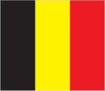
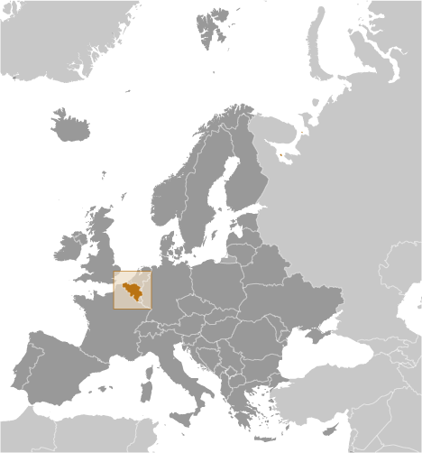
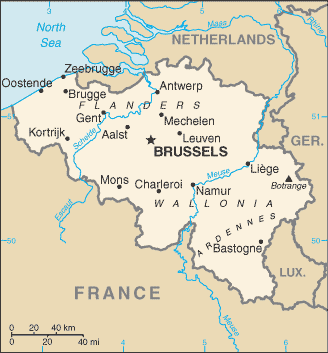

# Belgium

## Introduction

**_Background:_**   
Belgium became independent from the Netherlands in 1830; it was occupied by Germany during World Wars I and II. The country prospered in the past half century as a modern, technologically advanced European state and member of NATO and the EU. Political divisions between the Dutch-speaking Flemings of the north and the French-speaking Walloons of the south have led in recent years to constitutional amendments granting these regions formal recognition and autonomy. Its capital, Brussels, is home to numerous international organizations including the EU and NATO.

## Geography

**_Location:_**   
Western Europe, bordering the North Sea, between France and the Netherlands

**_Geographic coordinates:_**   
50 50 N, 4 00 E

**_Map references:_**   
Europe

**_Area:_**   
**total:** 30,528 sq km   
**land:** 30,278 sq km   
**water:** 250 sq km

**_Area - comparative:_**   
about the size of Maryland

**_Land boundaries:_**   
**total:** 1,297 km   
**border countries:** France 556 km, Germany 133 km, Luxembourg 130 km, Netherlands 478 km

**_Coastline:_**   
66.5 km

**_Maritime claims:_**   
**territorial sea:** 12 nm   
**contiguous zone:** 24 nm   
**exclusive economic zone:** geographic coordinates define outer limit   
**continental shelf:** median line with neighbors

**_Climate:_**   
temperate; mild winters, cool summers; rainy, humid, cloudy

**_Terrain:_**   
flat coastal plains in northwest, central rolling hills, rugged mountains of Ardennes Forest in southeast

**_Elevation extremes:_**   
**lowest point:** North Sea 0 m   
**highest point:** Botrange 694 m

**_Natural resources:_**   
construction materials, silica sand, carbonates

**_Land use:_**   
**arable land:** 27.06%   
**permanent crops:** 0.72%   
**other:** 72.22%   
**note:** includes Luxembourg (2011)

**_Irrigated land:_**   
233.5 sq km (2007)

**_Total renewable water resources:_**   
18.3 cu km (2011)

**_Freshwater withdrawal (domestic/industrial/agricultural):_**   
**total:** 6.22 cu km/yr (12%/88%/1%)   
**per capita:** 589.8 cu m/yr (2007)

**_Natural hazards:_**   
flooding is a threat along rivers and in areas of reclaimed coastal land, protected from the sea by concrete dikes

**_Environment - current issues:_**   
the environment is exposed to intense pressures from human activities: urbanization, dense transportation network, industry, extensive animal breeding and crop cultivation; air and water pollution also have repercussions for neighboring countries; uncertainties regarding federal and regional responsibilities (now resolved) had slowed progress in tackling environmental challenges

**_Environment - international agreements:_**   
**party to:** Air Pollution, Air Pollution-Nitrogen Oxides, Air Pollution-Persistent Organic Pollutants, Air Pollution-Sulfur 85, Air Pollution-Sulfur 94, Air Pollution-Volatile Organic Compounds, Antarctic-Environmental Protocol, Antarctic-Marine Living Resources, Antarctic Seals, Antarctic Treaty, Biodiversity, Climate Change, Climate Change-Kyoto Protocol, Desertification, Endangered Species, Environmental Modification, Hazardous Wastes, Law of the Sea, Marine Dumping, Marine Life Conservation, Ozone Layer Protection, Ship Pollution, Tropical Timber 83, Tropical Timber 94, Wetlands, Whaling   
**signed, but not ratified:** none of the selected agreements

**_Geography - note:_**   
crossroads of Western Europe; most West European capitals within 1,000 km of Brussels, the seat of both the European Union and NATO

## People and Society

**_Nationality:_**   
**noun:** Belgian(s)   
**adjective:** Belgian

**_Ethnic groups:_**   
Fleming 58%, Walloon 31%, mixed or other 11%

**_Languages:_**   
Dutch (official) 60%, French (official) 40%, German (official) less than 1%, legally bilingual (Dutch and French)

**_Religions:_**   
Roman Catholic 75%, other (includes Protestant) 25%

**_Population:_**   
10,449,361 (July 2014 est.)

**_Age structure:_**   
**0-14 years:** 15.6% (male 830,980/female 797,624)   
**15-24 years:** 11.7% (male 624,486/female 598,904)   
**25-54 years:** 40.4% (male 2,131,869/female 2,086,212)   
**55-64 years:** 13.3% (male 690,395/female 704,284)   
**65 years and over:** 19% (male 836,685/female 1,147,922) (2014 est.)

**_Dependency ratios:_**   
**total dependency ratio:** 54.8 %   
**youth dependency ratio:** 26.4 %   
**elderly dependency ratio:** 28.4 %   
**potential support ratio:** 3.5 (2014 est.)

**_Median age:_**   
**total:** 43.1 years   
**male:** 41.7 years   
**female:** 44.4 years (2014 est.)

**_Population growth rate:_**   
0.05% (2014 est.)

**_Birth rate:_**   
9.99 births/1,000 population (2014 est.)

**_Death rate:_**   
10.76 deaths/1,000 population (2014 est.)

**_Net migration rate:_**   
1.22 migrant(s)/1,000 population (2014 est.)

**_Urbanization:_**   
**urban population:** 97.5% of total population (2011)   
**rate of urbanization:** 0.32% annual rate of change (2010-15 est.)

**_Major urban areas - population:_**   
BRUSSELS (capital) 1.949 million; Antwerp 959,000 (2011)

**_Sex ratio:_**   
**at birth:** 1.05 male(s)/female   
**0-14 years:** 1.04 male(s)/female   
**15-24 years:** 1.04 male(s)/female   
**25-54 years:** 1.02 male(s)/female   
**55-64 years:** 0.96 male(s)/female   
**65 years and over:** 0.72 male(s)/female   
**total population:** 0.96 male(s)/female (2014 est.)

**_Mother's mean age at first birth:_**   
28 (2010 est.)

**_Maternal mortality rate:_**   
8 deaths/100,000 live births (2010)

**_Infant mortality rate:_**   
**total:** 4.18 deaths/1,000 live births   
**male:** 4.67 deaths/1,000 live births   
**female:** 3.66 deaths/1,000 live births (2014 est.)

**_Life expectancy at birth:_**   
**total population:** 79.92 years   
**male:** 76.76 years   
**female:** 83.22 years (2014 est.)

**_Total fertility rate:_**   
1.65 children born/woman (2014 est.)

**_Contraceptive prevalence rate:_**   
70.4%   
**note:** percent of women aged 18-49 (2010)

**_Health expenditures:_**   
10.6% of GDP (2011)

**_Physicians density:_**   
3.78 physicians/1,000 population (2010)

**_Hospital bed density:_**   
6.5 beds/1,000 population (2011)

**_Drinking water source:_**   
**improved:** urban: 100% of population; rural: 100% of population; total: 100% of population   
**unimproved:** urban: 0% of population; rural: 0% of population; total: 0% of population (2012 est.)

**_Sanitation facility access:_**   
**improved:** urban: 100% of population; rural: 100% of population; total: 100% of population   
**unimproved:** urban: 0% of population; rural: 0% of population; total: 0% of population (2012 est.)

**_HIV/AIDS - adult prevalence rate:_**   
0.2% (2009 est.)

**_HIV/AIDS - people living with HIV/AIDS:_**   
14,000 (2009 est.)

**_HIV/AIDS - deaths:_**   
fewer than 100 (2009 est.)

**_Obesity - adult prevalence rate:_**   
22.1% (2008)

**_Education expenditures:_**   
6.6% of GDP (2010)

**_Literacy:_**   
**definition:** age 15 and over can read and write   
**total population:** 99%   
**male:** 99%   
**female:** 99% (2003 est.)

**_School life expectancy (primary to tertiary education):_**   
**total:** 16 years   
**male:** 16 years   
**female:** 17 years (2011)

**_Unemployment, youth ages 15-24:_**   
**total:** 19.8%   
**male:** 20.4%   
**female:** 19.8% (2012)

## Government

**_Country name:_**   
**conventional long form:** Kingdom of Belgium   
**conventional short form:** Belgium   
**local long form:** Royaume de Belgique (French)/Koninkrijk Belgie (Dutch)/Koenigreich Belgien (German)   
**local short form:** Belgique/Belgie/Belgien

**_Government type:_**   
federal parliamentary democracy under a constitutional monarchy

**_Capital:_**   
**name:** Brussels   
**geographic coordinates:** 50 50 N, 4 20 E   
**time difference:** UTC+1 (6 hours ahead of Washington, DC, during Standard Time)   
**daylight saving time:** +1hr, begins last Sunday in March; ends last Sunday in October

**_Administrative divisions:_**   
3 regions (French: regions, singular - region; Dutch: gewesten, singular - gewest); Brussels-Capital Region, also known as Brussels Hoofdstedelijk Gewest (Dutch), Region de Bruxelles-Capitale (French long form), Bruxelles-Capitale (French short form); Flemish Region (Flanders), also known as Vlaams Gewest (Dutch long form), Vlaanderen (Dutch short form), Region Flamande (French long form), Flandre (French short form); Walloon Region (Wallonia), also known as Region Wallone (French long form), Wallonie (French short form), Waals Gewest (Dutch long form), Wallonie (Dutch short form)   
**note:** as a result of the 1993 constitutional revision that furthered devolution into a federal state, there are now three levels of government (federal, regional, and linguistic community) with a complex division of responsibilities

**_Independence:_**   
4 October 1830 (a provisional government declared independence from the Netherlands); 21 July 1831 (King LEOPOLD I ascended to the throne)

**_National holiday:_**   
21 July (1831) ascension to the Throne of King LEOPOLD I

**_Constitution:_**   
drafted 25 November 1830, approved 7 February 1831, entered into force 26 July 1831, revised 14 July 1993 (creating a federal state); amended many times, last in 2012 (2012)

**_Legal system:_**   
civil law system based on the French Civil Code; note - Belgian law continues to be modified in conformance with the legislative norms mandated by the European Union; judicial review of legislative acts

**_International law organization participation:_**   
accepts compulsory ICJ jurisdiction with reservations; accepts ICCt jurisdiction

**_Suffrage:_**   
18 years of age; universal and compulsory

**_Executive branch:_**   
**chief of state:** King PHILIPPE (since 21 July 2013); Heir Apparent Princess ELISABETH, daughter of the monarch   
**head of government:** Prime Minister Elio DI RUPO (since 6 December 2011); Deputy Prime Minister Alexander DE CROO (since 22 October 2012); Deputy Prime Minister Joelle MILQUET (since 20 March 2008); Deputy Prime Minister Laurette ONKELINX (since 30 December 2008); Deputy Prime Minister Didier REYNDERS (since 30 December 2008); Depurty Prime Minister Johan VANDE LANOTTE (since i6 December 2011); Deputy Prime Minister Pieter DE CREM (since 5 March 2013)   
**cabinet:** Council of Ministers are formally appointed by the monarch   
**elections:** the monarchy is hereditary and constitutional; following legislative elections, the leader of the majority party or the leader of the majority coalition usually appointed prime minister by the monarch and approved by parliament

**_Legislative branch:_**   
bicameral Parliament consists of a Senate or Senaat in Dutch, Senat in French (71 seats indirectly elected serve five-year terms) and a Chamber of Deputies or Kamer van Volksvertegenwoordigers in Dutch, Chambre des Representants in French (150 seats; members directly elected by popular vote on the basis of proportional representation to serve five-year terms)   
**elections:** Chamber of Deputies - last held on 23 May 2014 (next to be held May 2019); note - elections will coincide with the EU's elections   
**election results:** Chamber of Deputies - percent of vote by party - N-VA 20.3%, PS 11.7%, CD&amp;V 11.6%, Open VLD 9.8%, MR 9.6%, SP.A 8.8%, Groen! 5.3%, CDH 5.0% Workers' Party 3.7%, VB 3.7%, Ecolo 3.3%, FDF 1.8%, the People's Party 1.5%, other 7.2%; seats by party - N-VA 33, PS 23, CD&amp;V 18, Open VLD 14, MR 20, SP.A 13, Groen! 6, CDH 9, Workers' Party 2, VB 3, Ecolo 6, FDF 2, the People's Party 1   
**note:** as a result of the 1993 constitutional revision that furthered devolution into a federal state, there are now three levels of government (federal, regional, and linguistic community) with a complex division of responsibilities; this reality leaves six governments, each with its own legislative assembly

**_Judicial branch:_**   
**highest court(s):** Constitutional Court or Grondwettelijk Hof in Dutch and Cour constitutionelle in French (consists of 12 judges - 6 Dutch-speaking and 6 French-speaking); Supreme Court of Justice or Hof van Cassatie in Dutch and Cour de Cassation in French (court organized into 3 chambers: civil and commercial; criminal; social, fiscal, and armed forces; each chamber includes a Dutch division and a French division, each with a chairperson and 5-6 judges)   
**judge selection and term of office:** Constitutional Court judges appointed by the monarch from candidates submitted by Parliament; judges appointed for life with mandatory retirement at age 70; Supreme Court judges appointed by the monarch from candidates submitted by the High Council of Justice, a 44-member independent body of judicial and non-judicial members; judges appointed for life   
**subordinate courts:** Courts of Appeal; regional courts; specialized courts for administrative, commercial, labor, and audit issues; magistrate's courts; justices of the peace

**_Political parties and leaders:_**   
**Flemish parties:** Christian Democratic and Flemish or CD&amp;V [Wouter BEKE]; Flemish Liberals and Democrats or Open VLD [Gwendolyn RUTTEN]; Groen! [Wouter VAN BESIEN] (formerly AGALEV, Flemish Greens); Libertarian, Direct, Democratic or LDD (formerly Dedecker's List) [Jean-Marie DEDECKER]; New Flemish Alliance or N-VA [Bart DE WEVER]; People's Party [Mischael MODRIKAMEN]; Social Progressive Alternative or SP.A [Bruno TOBBACK]; Vlaams Belang (Flemish Interest) or VB [Gerolf ANNEMANS]   
**Francophone parties:** Ecolo (Francophone Greens) [Olivier DELEUZE, Emily HOYOS]; Francophone Federalist Democrats [Olivier MAINGAIN]; Humanist and Democratic Center or CDH [Benoit LUTGEN]; Reform Movement or MR [Charles MICHEL]; Socialist Party or PS [Elio DI RUPO]; Workers' Party [Peter Mertens]; other minor parties

**_Political pressure groups and leaders:_**   
Federation of Enterprises in Belgium [Pieter TIMMERMANS/Pierre Alain DE SMEDT]; Confederation of Christan Trade Unions [Luc CORTEBEECK/Claude ROLIN]; Belgian General Federation of Labor [Rudy DE LEEUW/Anne DEMELENNE]   
**other:** trade unions; numerous other associations representing bankers, manufacturers, middle-class artisans, and the legal and medical professions; various organizations representing the cultural interests of Flanders and Wallonia; various peace groups such as Pax Christi and groups representing immigrants

**_International organization participation:_**   
ADB (nonregional members), AfDB (nonregional members), Australia Group, Benelux, BIS, CD, CE, CERN, EAPC, EBRD, ECB, EIB, EITI (implementing country), EMU, ESA, EU, FAO, FATF, G-9, G-10, IADB, IAEA, IBRD, ICAO, ICC (national committees), ICRM, IDA, IEA, IFAD, IFC, IFRCS, IGAD (partners), IHO, ILO, IMF, IMO, IMSO, Interpol, IOC, IOM, IPU, ISO, ITSO, ITU, ITUC (NGOs), MIGA, MONUSCO, NATO, NEA, NSG, OAS (observer), OECD, OIF, OPCW, OSCE, Paris Club, PCA, Schengen Convention, SELEC (observer), UN, UNCTAD, UNESCO, UNHCR, UNIDO, UNIFIL, UNRWA, UNTSO, UPU, WCO, WHO, WIPO, WMO, WTO, ZC

**_Diplomatic representation in the US:_**   
**chief of mission:** Ambassador Johan VERBEKE (since 10 March 2014)   
**chancery:** 3330 Garfield Street NW, Washington, DC 20008   
**telephone:** [1] (202) 333-6900   
**FAX:** [1] (202) 338-4960   
**consulate(s) general:** Atlanta, Los Angeles, New York

**_Diplomatic representation from the US:_**   
**chief of mission:** Ambassador Denise BAUER (since 7 August 2013)   
**embassy:** 27 Boulevard du Regent [Regentlaan], B-1000 Brussels   
**mailing address:** PSC 82, Box 002, APO AE 09710   
**telephone:** [32] (2) 811-4000   
**FAX:** [32] (2) 811-4500

**_Flag description:_**   
three equal vertical bands of black (hoist side), yellow, and red; the vertical design was based on the flag of France; the colors are those of the arms of the duchy of Brabant (yellow lion with red claws and tongue on a black field)

**_National symbol(s):_**   
lion

**_National anthem:_**   
**name:** "La Brabanconne" (The Song of Brabant)   
**lyrics/music:** Louis-Alexandre DECHET[French] Victor CEULEMANS [Dutch]/Francois VAN CAMPENHOUT   
**note:** adopted 1830; Louis-Alexandre DECHET was an actor at the theater in which the revolution against the Netherlands began; according to legend, he wrote the lyrics with a group of young people in a Brussels cafe

## Economy

**_Economy - overview:_**   
This modern, open, and private-enterprise-based economy has capitalized on its central geographic location, highly developed transport network, and diversified industrial and commercial base. Industry is concentrated mainly in the more heavily-populated region of Flanders in the north. With few natural resources, Belgium imports substantial quantities of raw materials and exports a large volume of manufactures, making its economy vulnerable to volatility in world markets. Roughly three-quarters of Belgium's trade is with other EU countries, and Belgium has benefited most from its proximity to Germany. In 2013 Belgian GDP grew by 0.1%, the unemployment rate increased to 8.8% from 7.6% the previous year, and the government reduced the budget deficit from a peak of 6% of GDP in 2009 to 3.2%. Despite the relative improvement in Belgium's budget deficit, public debt hovers around 100% of GDP, a factor that has contributed to investor perceptions that the country is increasingly vulnerable to spillover from the euro-zone crisis. Belgian banks were severely affected by the international financial crisis in 2008 with three major banks receiving capital injections from the government, and the nationalization of the Belgian retail arm of a Franco-Belgian bank.

**_GDP (purchasing power parity):_**   
$421.7 billion (2013 est.)   
$421.3 billion (2012 est.)   
$422.5 billion (2011 est.)   
**note:** data are in 2013 US dollars

**_GDP (official exchange rate):_**   
$507.4 billion (2013 est.)

**_GDP - real growth rate:_**   
0.1% (2013 est.)   
-0.3% (2012 est.)   
1.8% (2011 est.)

**_GDP - per capita (PPP):_**   
$37,800 (2013 est.)   
$38,000 (2012 est.)   
$38,400 (2011 est.)   
**note:** data are in 2013 US dollars

**_Gross national saving:_**   
19.2% of GDP (2013 est.)   
19.6% of GDP (2012 est.)   
20.8% of GDP (2011 est.)

**_GDP - composition, by end use:_**   
**household consumption:** 53.7%   
**government consumption:** 25%   
**investment in fixed capital:** 20.2%   
**investment in inventories:** 0.8%   
**exports of goods and services:** 81.8%   
**imports of goods and services:** -81.5%; (2013 est.)

**_GDP - composition, by sector of origin:_**   
**agriculture:** 0.8%   
**industry:** 22.6%   
**services:** 76.6% (2013 est.)

**_Agriculture - products:_**   
sugar beets, fresh vegetables, fruits, grain, tobacco; beef, veal, pork, milk

**_Industries:_**   
engineering and metal products, motor vehicle assembly, transportation equipment, scientific instruments, processed food and beverages, chemicals, base metals, textiles, glass, petroleum

**_Industrial production growth rate:_**   
0.2% (2013 est.)

**_Labor force:_**   
5.15 million (2013 est.)

**_Labor force - by occupation:_**   
**agriculture:** 2%   
**industry:** 25%   
**services:** 73% (2007 est.)

**_Unemployment rate:_**   
8.8% (2013 est.)   
7.6% (2012 est.)

**_Population below poverty line:_**   
15.2% (2007 est.)

**_Household income or consumption by percentage share:_**   
**lowest 10%:** 3.4%   
**highest 10%:** 28.4% (2006)

**_Distribution of family income - Gini index:_**   
28 (2005)   
28.7 (1996)

**_Budget:_**   
**revenues:** $241.9 billion   
**expenditures:** $258.2 billion (2013 est.)

**_Taxes and other revenues:_**   
47.7% of GDP (2013 est.)

**_Budget surplus (+) or deficit (-):_**   
-3.2% of GDP (2013 est.)

**_Public debt:_**   
102.4% of GDP (2013 est.)   
99.6% of GDP (2012 est.)   
**note:** data cover general government debt, and includes debt instruments issued (or owned) by government entities other than the treasury; the data include treasury debt held by foreign entities; the data include debt issued by subnational entities, as well as intra-governmental debt; intra-governmental debt consists of treasury borrowings from surpluses in the social funds, such as for retirement, medical care, and unemployment; debt instruments for the social funds are not sold at public auctions; general government debt is defined by the Maastricht definition and calculated by the National Bank of Belgium as consolidated gross debt; the debt is defined in European Regulation EC479/2009 concerning the implementation of the protocol on the excessive deficit procedure annexed to the Treaty on European Union (Treaty of Maastricht) of 7 February 1992; the sub-sectors of consolidated gross debt are: federal government, communities and regions, local government, and social security funds

**_Fiscal year:_**   
calendar year

**_Inflation rate (consumer prices):_**   
1.3% (2013 est.)   
2.6% (2012 est.)

**_Central bank discount rate:_**   
0.75% (31 December 2013)   
1.5% (31 December 2010)   
**note:** this is the European Central Bank's rate on the marginal lending facility, which offers overnight credit to banks in the euro area

**_Commercial bank prime lending rate:_**   
3.5% (31 December 2013 est.)   
3.62% (31 December 2012 est.)

**_Stock of narrow money:_**   
$185.1 billion (31 December 2013 est.)   
$185.7 billion (31 December 2012 est.)   
**note:** see entry for the European Union for money supply in the euro area; the European Central Bank (ECB) controls monetary policy for the 17 members of the Economic and Monetary Union (EMU); individual members of the EMU do not control the quantity of money circulating within their own borders

**_Stock of broad money:_**   
$591.7 billion (31 December 2013 est.)   
$585 billion (31 December 2012 est.)

**_Stock of domestic credit:_**   
$581.4 billion (31 December 2013 est.)   
$574.8 billion (31 December 2012 est.)

**_Market value of publicly traded shares:_**   
$NA (31 December 2012 est.)   
$NA (31 December 2011)   
$269.3 billion (31 December 2010 est.)

**_Current account balance:_**   
-$9.1 billion (2013 est.)   
-$6.65 billion (2012 est.)

**_Exports:_**   
$295.3 billion (2013 est.)   
$302.4 billion (2012 est.)

**_Exports - commodities:_**   
machinery and equipment, chemicals, finished diamonds, metals and metal products, foodstuffs

**_Exports - partners:_**   
Germany 18%, France 16.1%, Netherlands 13%, UK 7.3%, US 5.3%, Italy 4.4% (2012)

**_Imports:_**   
$310.2 billion (2013 est.)   
$311.1 billion (2012 est.)

**_Imports - commodities:_**   
raw materials, machinery and equipment, chemicals, raw diamonds, pharmaceuticals, foodstuffs, transportation equipment, oil products

**_Imports - partners:_**   
Netherlands 20.9%, Germany 14.2%, France 10.6%, US 6.1%, UK 5.5%, Ireland 4.4% (2012)

**_Reserves of foreign exchange and gold:_**   
$30.77 billion (31 December 2012 est.)   
$29.43 billion (31 December 2011 est.)

**_Debt - external:_**   
$1.424 trillion (31 December 2012 est.)   
$1.417 trillion (31 December 2011)

**_Stock of direct foreign investment - at home:_**   
$1.195 trillion (31 December 2013 est.)   
$1.159 trillion (31 December 2012 est.)

**_Stock of direct foreign investment - abroad:_**   
$1.215 trillion (31 December 2013 est.)   
$1.185 trillion (31 December 2012 est.)

**_Exchange rates:_**   
euros (EUR) per US dollar -   
0.7634 (2013 est.)   
0.7752 (2012 est.)   
0.755 (2010 est.)   
0.7198 (2009 est.)   
0.6827 (2008 est.)

## Energy

**_Electricity - production:_**   
83.37 billion kWh (2011 est.)

**_Electricity - consumption:_**   
84.68 billion kWh (2010 est.)

**_Electricity - exports:_**   
6.911 billion kWh (2012 est.)

**_Electricity - imports:_**   
16.85 billion kWh (2012 est.)

**_Electricity - installed generating capacity:_**   
18.32 million kW (2010 est.)

**_Electricity - from fossil fuels:_**   
43.6% of total installed capacity (2010 est.)

**_Electricity - from nuclear fuels:_**   
32.3% of total installed capacity (2010 est.)

**_Electricity - from hydroelectric plants:_**   
0.6% of total installed capacity (2010 est.)

**_Electricity - from other renewable sources:_**   
16.3% of total installed capacity (2010 est.)

**_Crude oil - production:_**   
10,530 bbl/day (2012 est.)

**_Crude oil - exports:_**   
0 bbl/day (2010 est.)

**_Crude oil - imports:_**   
667,700 bbl/day (2010 est.)

**_Crude oil - proved reserves:_**   
0 bbl (1 January 2013 est.)

**_Refined petroleum products - production:_**   
720,000 bbl/day (2010 est.)

**_Refined petroleum products - consumption:_**   
644,400 bbl/day (2011 est.)

**_Refined petroleum products - exports:_**   
442,800 bbl/day (2010 est.)

**_Refined petroleum products - imports:_**   
355,100 bbl/day (2010 est.)

**_Natural gas - production:_**   
0 cu m (2011 est.)

**_Natural gas - consumption:_**   
13.46 billion cu m (2011 est.)

**_Natural gas - exports:_**   
21.18 billion cu m (2012 est.)

**_Natural gas - imports:_**   
38.9 billion cu m (2012 est.)

**_Natural gas - proved reserves:_**   
0 cu m (1 January 2013 est.)

**_Carbon dioxide emissions from consumption of energy:_**   
131.1 million Mt (2011 est.)

## Communications

**_Telephones - main lines in use:_**   
4.631 million (2012)

**_Telephones - mobile cellular:_**   
12.88 million (2012)

**_Telephone system:_**   
**general assessment:** highly developed, technologically advanced, and completely automated domestic and international telephone and telegraph facilities   
**domestic:** nationwide mobile-cellular telephone system; extensive cable network; limited microwave radio relay network   
**international:** country code - 32; landing point for a number of submarine cables that provide links to Europe, the Middle East, and Asia; satellite earth stations - 7 (Intelsat - 3) (2007)

**_Broadcast media:_**   
a segmented market with the three major communities (Flemish, French, and German-speaking) each having responsibility for their own broadcast media; multiple TV channels exist for each community; additionally, in excess of 90% of households are connected to cable and can access broadcasts of TV stations from neighboring countries; each community has a public radio network co-existing with private broadcasters (2007)

**_Internet country code:_**   
.be

**_Internet hosts:_**   
5.192 million (2012)

**_Internet users:_**   
8.113 million (2009)

## Transportation

**_Airports:_**   
41 (2013)

**_Airports - with paved runways:_**   
**total:** 26   
**over 3,047 m:** 6   
**2,438 to 3,047 m:** 9   
**1,524 to 2,437 m:** 2   
**914 to 1,523 m:** 1   
**under 914 m:** 8 (2013)

**_Airports - with unpaved runways:_**   
**total:** 15   
**under 914 m:** 15 (2013)

**_Heliports:_**   
1 (2013)

**_Pipelines:_**   
gas 3,139 km; oil 154 km; refined products 535 km (2013)

**_Railways:_**   
**total:** 3,233 km   
**standard gauge:** 3,233 km 1.435-m gauge (2,950 km electrified) (2008)

**_Roadways:_**   
**total:** 154,012 km   
**paved:** 120,514 km (includes 1,756 km of expressways)   
**unpaved:** 33,498 km (2010)

**_Waterways:_**   
2,043 km (1,528 km in regular commercial use) (2012)

**_Merchant marine:_**   
**total:** 87   
**by type:** bulk carrier 23, cargo 15, chemical tanker 5, container 4, liquefied gas 23, passenger 2, petroleum tanker 8, roll on/roll off 7   
**foreign-owned:** 15 (Denmark 4, France 7, Russia 1, UK 2, US 1)   
**registered in other countries:** 107 (Bahamas 6, Cambodia 1, Cyprus 3, France 7, Gibraltar 1, Greece 17, Hong Kong 26, Liberia 1, Luxembourg 11, Malta 7, Marshall Islands 1, Mozambique 2, North Korea 1, Panama 1, Portugal 8, Russia 4, Saint Kitts and Nevis 1, Saint Vincent and the Grenadines 7, Singapore 1, Vanuatu 1) (2010)

**_Ports and terminals:_**   
**major seaport(s):** Oostende, Zeebrugge   
**river port(s):** Antwerp, Gent (Schelde River); Brussels (Senne River); Liege (Meuse River)   
**container port(s) (TEUs):** Antwerp (8,664,243), Zeebrugge (2,207,257) (2011)   
**LNG terminal(s) (import):** Zeebrugge

## Military

**_Military branches:_**   
Belgian Armed Forces: Land Operations Command, Naval Operations Command, Air Operations Command (2012)

**_Military service age and obligation:_**   
18 years of age for male and female voluntary military service; conscription abolished in 1994 (2012)

**_Manpower available for military service:_**   
**males age 16-49:** 2,359,232   
**females age 16-49:** 2,291,689 (2010 est.)

**_Manpower fit for military service:_**   
**males age 16-49:** 1,934,957   
**females age 16-49:** 1,877,268 (2010 est.)

**_Manpower reaching militarily significant age annually:_**   
**male:** 59,665   
**female:** 57,142 (2010 est.)

**_Military expenditures:_**   
1.05% of GDP (2012)   
1.08% of GDP (2011)   
1.05% of GDP (2010)

## Transnational Issues

**_Disputes - international:_**   
none

**_Refugees and internally displaced persons:_**   
**stateless persons:** 3,898 (2012)

**_Illicit drugs:_**   
growing producer of synthetic drugs and cannabis; transit point for US-bound ecstasy; source of precursor chemicals for South American cocaine processors; transshipment point for cocaine, heroin, hashish, and marijuana entering Western Europe; despite a strengthening of legislation, the country remains vulnerable to money laundering related to narcotics, automobiles, alcohol, and tobacco; significant domestic consumption of ecstasy

............................................................   
_Page last updated on June 23, 2014_
