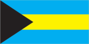
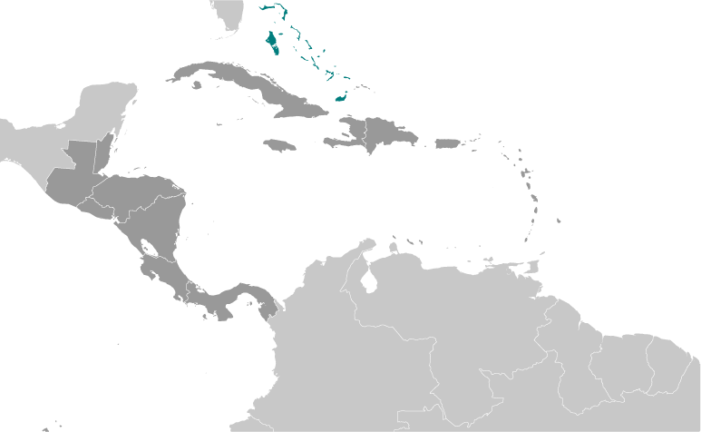
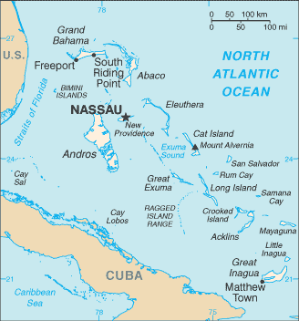

# Bahamas, The

## Introduction

**_Background:_**   
Lucayan Indians inhabited the islands when Christopher COLUMBUS first set foot in the New World on San Salvador in 1492. British settlement of the islands began in 1647; the islands became a colony in 1783. Since attaining independence from the UK in 1973, The Bahamas has prospered through tourism, international banking, and investment management. Because of its location, the country is a major transshipment point for illegal drugs, particularly shipments to the US and Europe, and its territory is used for smuggling illegal migrants into the US.

## Geography

**_Location:_**   
chain of islands in the North Atlantic Ocean, southeast of Florida, northeast of Cuba

**_Geographic coordinates:_**   
24 15 N, 76 00 W

**_Map references:_**   
Central America and the Caribbean

**_Area:_**   
**total:** 13,880 sq km   
**land:** 10,010 sq km   
**water:** 3,870 sq km

**_Area - comparative:_**   
slightly smaller than Connecticut

**_Land boundaries:_**   
0 km

**_Coastline:_**   
3,542 km

**_Maritime claims:_**   
**territorial sea:** 12 nm   
**exclusive economic zone:** 200 nm

**_Climate:_**   
tropical marine; moderated by warm waters of Gulf Stream

**_Terrain:_**   
long, flat coral formations with some low rounded hills

**_Elevation extremes:_**   
**lowest point:** Atlantic Ocean 0 m   
**highest point:** Mount Alvernia on Cat Island 63 m

**_Natural resources:_**   
salt, aragonite, timber, arable land

**_Land use:_**   
**arable land:** 0.65%   
**permanent crops:** 0.29%   
**other:** 99.06% (2011)

**_Irrigated land:_**   
10 sq km (2003)

**_Total renewable water resources:_**   
0.02 cu km (2011)

**_Natural hazards:_**   
hurricanes and other tropical storms cause extensive flood and wind damage

**_Environment - current issues:_**   
coral reef decay; solid waste disposal

**_Environment - international agreements:_**   
**party to:** Biodiversity, Climate Change, Climate Change-Kyoto Protocol, Desertification, Endangered Species, Hazardous Wastes, Law of the Sea, Ozone Layer Protection, Ship Pollution, Wetlands   
**signed, but not ratified:** none of the selected agreements

**_Geography - note:_**   
strategic location adjacent to US and Cuba; extensive island chain of which 30 are inhabited

## People and Society

**_Nationality:_**   
**noun:** Bahamian(s)   
**adjective:** Bahamian

**_Ethnic groups:_**   
black 90.6%, white 4.7%, black and white 2.1%, other 1.9%, unspecified 0.7% (2010 est.)

**_Languages:_**   
English (official), Creole (among Haitian immigrants)

**_Religions:_**   
Protestant 69.9% (includes Baptist 34.9%, Anglican 13.7%, Pentecostal 8.9% Seventh Day Adventist 4.4%, Methodist 3.6%, Church of God 1.9%, Brethren 1.6%), Roman Catholic 12%, other Christian 13% (includes Jehovah's Witness 1.1%), other 0.6%, none 1.9%, unspecified 2.6% (2010 est.)

**_Population:_**   
321,834   
**note:** estimates for this country explicitly take into account the effects of excess mortality due to AIDS; this can result in lower life expectancy, higher infant mortality, higher death rates, lower population growth rates, and changes in the distribution of population by age and sex than would otherwise be expected (July 2014 est.)

**_Age structure:_**   
**0-14 years:** 23.2% (male 37,962/female 36,857)   
**15-24 years:** 17.4% (male 28,387/female 27,639)   
**25-54 years:** 44.1% (male 70,765/female 71,038)   
**55-64 years:** 8.3% (male 11,882/female 14,885)   
**65 years and over:** 7% (male 8,591/female 13,828) (2014 est.)

**_Dependency ratios:_**   
**total dependency ratio:** 40.9 %   
**youth dependency ratio:** 29.6 %   
**elderly dependency ratio:** 11.3 %   
**potential support ratio:** 8.9 (2014 est.)

**_Median age:_**   
**total:** 31.2 years   
**male:** 30.1 years   
**female:** 32.3 years (2014 est.)

**_Population growth rate:_**   
0.87% (2014 est.)

**_Birth rate:_**   
15.65 births/1,000 population (2014 est.)

**_Death rate:_**   
7 deaths/1,000 population (2014 est.)

**_Net migration rate:_**   
0 migrant(s)/1,000 population (2014 est.)

**_Urbanization:_**   
**urban population:** 84.3% of total population (2011)   
**rate of urbanization:** 1.37% annual rate of change (2010-15 est.)

**_Major urban areas - population:_**   
NASSAU (capital) 254,000 (2011)

**_Sex ratio:_**   
**at birth:** 1.03 male(s)/female   
**0-14 years:** 1.03 male(s)/female   
**15-24 years:** 1.03 male(s)/female   
**25-54 years:** 1 male(s)/female   
**55-64 years:** 0.96 male(s)/female   
**65 years and over:** 0.62 male(s)/female   
**total population:** 0.96 male(s)/female (2014 est.)

**_Maternal mortality rate:_**   
47 deaths/100,000 live births (2010)

**_Infant mortality rate:_**   
**total:** 12.5 deaths/1,000 live births   
**male:** 12.51 deaths/1,000 live births   
**female:** 12.49 deaths/1,000 live births (2014 est.)

**_Life expectancy at birth:_**   
**total population:** 71.93 years   
**male:** 69.48 years   
**female:** 74.46 years (2014 est.)

**_Total fertility rate:_**   
1.97 children born/woman (2014 est.)

**_Health expenditures:_**   
7.7% of GDP (2011)

**_Physicians density:_**   
2.82 physicians/1,000 population (2008)

**_Hospital bed density:_**   
3.1 beds/1,000 population (2010)

**_Drinking water source:_**   
**improved:** urban: 98.4% of population; rural: 98.4% of population; total: 98.4% of population   
**unimproved:** urban: 1.6% of population; rural: 1.6% of population; total: 1.6% of population (2012 est.)

**_Sanitation facility access:_**   
**improved:** urban: 92% of population; rural: 92% of population; total: 92% of population   
**unimproved:** urban: 8% of population; rural: 8% of population; total: 8% of population (2012 est.)

**_HIV/AIDS - adult prevalence rate:_**   
3.3% (2012 est.)

**_HIV/AIDS - people living with HIV/AIDS:_**   
7,000 (2012 est.)

**_HIV/AIDS - deaths:_**   
300 (2012 est.)

**_Obesity - adult prevalence rate:_**   
34.7% (2008)

**_Education expenditures:_**   
NA

**_Literacy:_**   
**definition:** age 15 and over can read and write   
**total population:** 95.6%   
**male:** 94.7%   
**female:** 96.5% (2003 est.)

**_Unemployment, youth ages 15-24:_**   
**total:** 30.8%   
**male:** 29.6%   
**female:** 32.2% (2012)

## Government

**_Country name:_**   
**conventional long form:** Commonwealth of The Bahamas   
**conventional short form:** The Bahamas

**_Government type:_**   
constitutional parliamentary democracy and a Commonwealth realm

**_Capital:_**   
**name:** Nassau   
**geographic coordinates:** 25 05 N, 77 21 W   
**time difference:** UTC-5 (same time as Washington, DC, during Standard Time)   
**daylight saving time:** +1hr, begins second Sunday in March; ends first Sunday in November

**_Administrative divisions:_**   
31 districts; Acklins Islands, Berry Islands, Bimini, Black Point, Cat Island, Central Abaco, Central Andros, Central Eleuthera, City of Freeport, Crooked Island and Long Cay, East Grand Bahama, Exuma, Grand Cay, Harbour Island, Hope Town, Inagua, Long Island, Mangrove Cay, Mayaguana, Moore's Island, North Abaco, North Andros, North Eleuthera, Ragged Island, Rum Cay, San Salvador, South Abaco, South Andros, South Eleuthera, Spanish Wells, West Grand Bahama

**_Independence:_**   
10 July 1973 (from the UK)

**_National holiday:_**   
Independence Day, 10 July (1973)

**_Constitution:_**   
previous 1964 (preindependence); latest adopted 20 June 1973, effective 10 July 1973; amended many times, last in 2002; note - in 2012, a constitutional commission was appointed to review and recommend constitutional changes (2013)

**_Legal system:_**   
common law system based on the English model

**_International law organization participation:_**   
has not submitted an ICJ jurisdiction declaration; non-party state to the ICCt

**_Suffrage:_**   
18 years of age; universal

**_Executive branch:_**   
**chief of state:** Queen ELIZABETH II (since 6 February 1952); represented by Governor General Sir Arthur A. FOULKES (since 14 April 2010)   
**head of government:** Prime Minister Perry CHRISTIE (since 8 May 2012)   
**cabinet:** Cabinet appointed by the governor general on the prime minister's recommendation   
**elections:** the monarchy is hereditary; governor general appointed by the monarch; following legislative elections, the leader of the majority party or the leader of the majority coalition is usually appointed prime minister by the governor general; the prime minister recommends the deputy prime minister

**_Legislative branch:_**   
bicameral Parliament consists of the Senate (16 seats; members appointed by the governor general upon the advice of the prime minister and the opposition leader to serve five-year terms) and the House of Assembly (38 seats; members elected by direct popular vote to serve five-year terms); the government may dissolve the parliament and call elections at any time   
**elections:** last held on 7 May 2012 (next to be held by May 2017)   
**election results:** percent of vote by party - NA; seats by party - PLP 30, FNM 8

**_Judicial branch:_**   
**highest court(s):** The Bahamas Court of Appeal (consists of the court president and 4 justices, sitting in panels of 3 justices); note - as of 2008, the Bahamas was not a party to the agreement establishing the Caribbean Court of Justice as the highest appellate court for the 15-member Caribbean Community (CARICOM); the Judicial Committee of the Privy Council (in London) serves as the final court of appeal for the Bahamas   
**judge selection and term of office:** Court of Appeal justices appointed by the governor-general on the advice of the prime minister and in consultation with the Judicial and Legal Services Commission; justices appointed for life with mandatory retirement at age 68-70   
**subordinate courts:** Supreme Court; Industrial Tribunal; Stipendiary and Magistrates Courts; Family Island Administrators

**_Political parties and leaders:_**   
Free National Movement or FNM [Hubert MINNIS]   
Progressive Liberal Party or PLP [Perry CHRISTIE]

**_Political pressure groups and leaders:_**   
Friends of the Environment   
**other:** trade unions

**_International organization participation:_**   
ACP, AOSIS, C, Caricom, CDB, CELAC, FAO, G-77, IADB, IBRD, ICAO, ICRM, IDA, IFAD, IFC, IFRCS, ILO, IMF, IMO, IMSO, Interpol, IOC, IOM, ITSO, ITU, LAES, MIGA, NAM, OAS, OPANAL, OPCW, Petrocaribe, UN, UNCTAD, UNESCO, UNIDO, UNWTO, UPU, WCO, WHO, WIPO, WMO, WTO (observer)

**_Diplomatic representation in the US:_**   
**chief of mission:** Ambassador Dr. Eugene Glenwood NEWRY (since 3 December 2013)   
**chancery:** 2220 Massachusetts Avenue NW, Washington, DC 20008   
**telephone:** [1] (202) 319-2660   
**FAX:** [1] (202) 319-2668   
**consulate(s) general:** Atlanta, Miami, New York

**_Diplomatic representation from the US:_**   
**chief of mission:** Ambassador (vacant); Charge d' Affaires John DINKELMAN (since November 2011)   
**embassy:** 42 Queen Street, Nassau, New Providence   
**mailing address:** local or express mail address: P. O. Box N-8197, Nassau; US Department of State, 3370 Nassau Place, Washington, DC 20521-3370   
**telephone:** [1] (242) 322-1181, 328-2206 (after hours)   
**FAX:** [1] (242) 328-2206

**_Flag description:_**   
three equal horizontal bands of aquamarine (top), gold, and aquamarine, with a black equilateral triangle based on the hoist side; the band colors represent the golden beaches of the islands surrounded by the aquamarine sea; black represents the vigor and force of a united people, while the pointing triangle indicates the enterprise and determination of the Bahamian people to develop the rich resources of land and sea

**_National symbol(s):_**   
blue marlin; flamingo

**_National anthem:_**   
**name:** "March On, Bahamaland!"   
**lyrics/music:** Timothy GIBSON   
**note:** adopted 1973; as a Commonwealth country, in addition to the national anthem, "God Save the Queen" serves as the royal anthem (see United Kingdom)

## Economy

**_Economy - overview:_**   
The Bahamas is one of the wealthiest Caribbean countries with an economy heavily dependent on tourism and offshore banking. Tourism together with tourism-driven construction and manufacturing accounts for approximately 60% of GDP and directly or indirectly employs half of the archipelago's labor force. Financial services constitute the second-most important sector of the Bahamian economy and, when combined with business services, account for about 35% of GDP. Manufacturing and agriculture combined contribute less than a 10th of GDP and show little growth, despite government incentives aimed at those sectors. The economy of The Bahamas shrank at an average pace of 0.8% annually between 2007-2011, and tourism, financial services, and construction - pillars of the national economy - remain subdued. Conditions are improving in the tourism sector, however, due to steady foreign investment led activity. New resort and marina developments are likely to provide sustained employment opportunities.

**_GDP (purchasing power parity):_**   
$11.4 billion (2013 est.)   
$11.19 billion (2012 est.)   
$10.98 billion (2011 est.)   
**note:** data are in 2013 US dollars

**_GDP (official exchange rate):_**   
$8.373 billion (2013 est.)

**_GDP - real growth rate:_**   
1.9% (2013 est.)   
1.8% (2012 est.)   
1.7% (2011 est.)

**_GDP - per capita (PPP):_**   
$32,000 (2013 est.)   
$31,800 (2012 est.)   
$31,500 (2011 est.)   
**note:** data are in 2013 US dollars

**_Gross national saving:_**   
14.3% of GDP (2013 est.)   
19.3% of GDP (2012 est.)   
17.8% of GDP (2011 est.)

**_GDP - composition, by end use:_**   
**household consumption:** 68.7%   
**government consumption:** 15.5%   
**investment in fixed capital:** 34.4%   
**investment in inventories:** 0%   
**exports of goods and services:** 45.8%   
**imports of goods and services:** -64.4%; (2013 est.)

**_GDP - composition, by sector of origin:_**   
**agriculture:** 2.1%   
**industry:** 7.1%   
**services:** 90.8% (2013 est.)

**_Agriculture - products:_**   
citrus, vegetables; poultry

**_Industries:_**   
tourism, banking, oil bunkering, maritime industries, transshipment, salt, rum, aragonite, pharmaceuticals

**_Industrial production growth rate:_**   
1.5% (2013 est.)

**_Labor force:_**   
196,900 (2013 est.)

**_Labor force - by occupation:_**   
**agriculture:** 3%   
**industry:** 11%   
**tourism:** 49%   
**other services:** 37% (2011 est.)

**_Unemployment rate:_**   
16.2% (2013 est.)   
14% (2012 est.)

**_Population below poverty line:_**   
9.3% (2010 est.)

**_Household income or consumption by percentage share:_**   
**lowest 10%:** 1%   
**highest 10%:** 22% (2007)

**_Budget:_**   
**revenues:** $1.41 billion   
**expenditures:** $2.1 billion (2012 est.)

**_Taxes and other revenues:_**   
16.8% of GDP (2012 est.)

**_Budget surplus (+) or deficit (-):_**   
-8.2% of GDP (2012 est.)

**_Fiscal year:_**   
1 July - 30 June

**_Inflation rate (consumer prices):_**   
1% (2013 est.)   
2% (2012 est.)

**_Central bank discount rate:_**   
4.5% (1 January 2014 est.)   
4.5% (31 December 2012 est.)

**_Commercial bank prime lending rate:_**   
4.75% (31 December 2013 est.)   
4.75% (31 December 2012 est.)

**_Stock of narrow money:_**   
$1.435 billion (31 December 2013 est.)   
$1.575 billion (31 December 2012 est.)

**_Stock of broad money:_**   
$6.329 billion (31 December 2013 est.)   
$6.088 billion (31 December 2012 est.)

**_Stock of domestic credit:_**   
$9.2 billion (31 December 2013 est.)   
$8.653 billion (31 December 2012 est.)

**_Market value of publicly traded shares:_**   
$NA (31 December 2012 est.)

**_Current account balance:_**   
-$1.372 billion (2013 est.)   
-$1.424 billion (2012 est.)

**_Exports:_**   
$960 million (2013 est.)   
$984 million (2012 est.)

**_Exports - commodities:_**   
crawfish, aragonite, crude salt, polystyrene products

**_Exports - partners:_**   
Singapore 25.1%, US 20.6%, Dominican Republic 12.9%, Ecuador 9.4%, Canada 5.8%, Switzerland 4.1%, China 4.1% (2012)

**_Imports:_**   
$3.245 billion (2013 est.)   
$3.386 billion (2012 est.)

**_Imports - commodities:_**   
machinery and transport equipment, manufactures, chemicals, mineral fuels; food and live animals

**_Imports - partners:_**   
US 30.1%, India 20.3%, Singapore 8.7%, South Korea 6.8%, China 5%, Colombia 4.5%, Canada 4.2% (2012)

**_Reserves of foreign exchange and gold:_**   
$830 million (31 December 2013 est.)   
$846.9 million (31 December 2012 est.)

**_Debt - external:_**   
$17.56 billion (31 December 2013 est.)   
$16.35 billion (31 December 2012 est.)

**_Exchange rates:_**   
Bahamian dollars (BSD) per US dollar -   
1 (2013 est.)   
1 (2012 est.)   
1 (2010 est.)   
1 (2008 est.)   
1 (2007 est.)

## Energy

**_Electricity - production:_**   
1.93 billion kWh (2010 est.)

**_Electricity - consumption:_**   
1.795 billion kWh (2010 est.)

**_Electricity - exports:_**   
0 kWh (2012 est.)

**_Electricity - imports:_**   
0 kWh (2012 est.)

**_Electricity - installed generating capacity:_**   
493,000 kW (2010 est.)

**_Electricity - from fossil fuels:_**   
100% of total installed capacity (2012 est.)

**_Electricity - from nuclear fuels:_**   
0% of total installed capacity (2012 est.)

**_Electricity - from hydroelectric plants:_**   
0% of total installed capacity (2012 est.)

**_Electricity - from other renewable sources:_**   
0% of total installed capacity (2012 est.)

**_Crude oil - production:_**   
0 bbl/day (2012 est.)

**_Crude oil - exports:_**   
0 bbl/day (2010 est.)

**_Crude oil - imports:_**   
0 bbl/day (2010 est.)

**_Crude oil - proved reserves:_**   
0 bbl (1 January 2013 est.)

**_Refined petroleum products - production:_**   
0 bbl/day (2010 est.)

**_Refined petroleum products - consumption:_**   
36,300 bbl/day (2011 est.)

**_Refined petroleum products - exports:_**   
41,770 bbl/day (2010 est.)

**_Refined petroleum products - imports:_**   
64,600 bbl/day (2010 est.)

**_Natural gas - production:_**   
0 cu m (2011 est.)

**_Natural gas - consumption:_**   
0 cu m (2010 est.)

**_Natural gas - exports:_**   
0 cu m (2011 est.)

**_Natural gas - imports:_**   
0 cu m (2011 est.)

**_Natural gas - proved reserves:_**   
0 cu m (1 January 2009 est.)

**_Carbon dioxide emissions from consumption of energy:_**   
4.734 million Mt (2011 est.)

## Communications

**_Telephones - main lines in use:_**   
137,000 (2012)

**_Telephones - mobile cellular:_**   
254,000 (2012)

**_Telephone system:_**   
**general assessment:** modern facilities   
**domestic:** totally automatic system; highly developed; the Bahamas Domestic Submarine Network links 14 of the islands and is designed to satisfy increasing demand for voice and broadband Internet services   
**international:** country code - 1-242; landing point for the Americas Region Caribbean Ring System (ARCOS-1) fiber-optic submarine cable that provides links to South and Central America, parts of the Caribbean, and the US; satellite earth stations - 2 (2007)

**_Broadcast media:_**   
2 TV stations operated by government-owned, commercially run Broadcasting Corporation of the Bahamas (BCB); multi-channel cable TV subscription service is available; about 15 radio stations operating with BCB operating a multi-channel radio broadcasting network alongside privately owned radio stations (2007)

**_Internet country code:_**   
.bs

**_Internet hosts:_**   
20,661 (2012)

**_Internet users:_**   
115,800 (2009)

## Transportation

**_Airports:_**   
61 (2013)

**_Airports - with paved runways:_**   
**total:** 24   
**over 3,047 m:** 2   
**2,438 to 3,047 m:** 2   
**1,524 to 2,437 m:** 13   
**914 to 1,523 m:** 7 (2013)

**_Airports - with unpaved runways:_**   
**total:** 37   
**1,524 to 2,437 m:** 4   
**914 to 1,523 m:** 16   
**under 914 m:** 17 (2013)

**_Heliports:_**   
1 (2013)

**_Roadways:_**   
**total:** 2,700 km   
**paved:** 1,620 km   
**unpaved:** 1,080 km (2011)

**_Merchant marine:_**   
**total:** 1,160   
**by type:** barge carrier 1, bulk carrier 238, cargo 170, carrier 2, chemical tanker 87, combination ore/oil 8, container 57, liquefied gas 71, passenger 102, passenger/cargo 26, petroleum tanker 225, refrigerated cargo 97, roll on/roll off 13, specialized tanker 2, vehicle carrier 61   
**foreign-owned:** 1,063 (Angola 6, Australia 1, Belgium 6, Bermuda 15, Brazil 1, Canada 96, Croatia 1, Cyprus 23, Denmark 69, Finland 8, France 15, Germany 30, Greece 225, Guernsey 6, Hong Kong 3, Indonesia 2, Ireland 3, Italy 1, Japan 88, Jordan 2, Kuwait 1, Malaysia 13, Monaco 8, Montenegro 2, Netherlands 23, Nigeria 2, Norway 186, Poland 34, Saudi Arabia 16, Singapore 7, South Korea 1, Spain 6, Sweden 11, Switzerland 1, Thailand 4, Turkey 3, UAE 23, UK 18, US 109)   
**registered in other countries:** 6 (Panama 6) (2010)

**_Ports and terminals:_**   
**major seaport(s):** Freeport, Nassau, South Riding Point   
**container port(s) (TEUs):** Freeport (1,116,272)(2011)   
**cruise port(s):** Nassau

## Military

**_Military branches:_**   
Royal Bahamas Defense Force: Land Force, Navy, Air Wing (2011)

**_Military service age and obligation:_**   
18 years of age for voluntary male and female service; no conscription (2012)

**_Manpower available for military service:_**   
**males age 16-49:** 85,568 (2010 est.)

**_Manpower fit for military service:_**   
**males age 16-49:** 63,429   
**females age 16-49:** 64,645 (2010 est.)

**_Manpower reaching militarily significant age annually:_**   
**male:** 2,829   
**female:** 2,750 (2010 est.)

## Transnational Issues

**_Disputes - international:_**   
disagrees with the US on the alignment of the northern axis of a potential maritime boundary

**_Illicit drugs:_**   
transshipment point for cocaine and marijuana bound for US and Europe; offshore financial center

............................................................   
_Page last updated on June 23, 2014_
