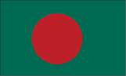
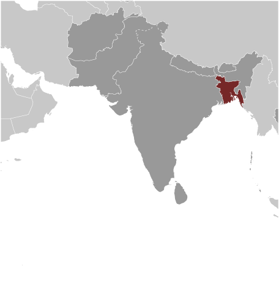
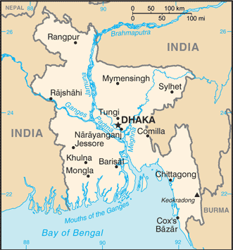

# Bangladesh

## Introduction

**_Background:_**   
Muslim conversions and settlement in the region now referred to as Bangladesh began in the 10th century, primarily from Arab and Persian traders and preachers. Europeans began to set up trading posts in the area in the 16th century. Eventually the area known as Bengal, primarily Hindu in the western section and mostly Muslim in the eastern half, became part of British India. Partition in 1947 resulted in an eastern wing of Pakistan in the Muslim-majority area, which became East Pakistan. Calls for greater autonomy and animosity between the eastern and western wings of Pakistan led to a Bengali independence movement. That movement, led by the Awami League (AL) and supported by India, won independence for Bangladesh in a brief war in 1971, during which at least 300,000 civilians died. The post-independence, AL government faced daunting challenges and in 1975 was overthrown by the military, triggering a series of military coups that resulted in a military-backed government and subsequent creation of the Bangladesh Nationalist Party (BNP). That government also ended in a coup in 1981, followed by military-backed rule until democratic elections in 1991. The BNP and AL have alternately held power since then, with the exception of a military-backed, emergency caretaker regime that suspended parliamentary elections planned for January 2007 in an effort to reform the political system and root out corruption. That government returned the country to fully democratic rule in December 2008 with the election of the AL and Prime Minister Sheikh HASINA. In January 2014, the AL won the national election by an overwhelming majority after the BNP boycotted, extending HASINA's term as prime minister. With the help of international development assistance, Bangladesh has made great progress in food security since independence, and the economy has grown at an average of about 6 percent over the last two decades.

## Geography

**_Location:_**   
Southern Asia, bordering the Bay of Bengal, between Burma and India

**_Geographic coordinates:_**   
24 00 N, 90 00 E

**_Map references:_**   
Asia

**_Area:_**   
**total:** 143,998 sq km   
**land:** 130,168 sq km   
**water:** 13,830 sq km

**_Area - comparative:_**   
slightly smaller than Iowa

**_Land boundaries:_**   
**total:** 4,413 km   
**border countries:** Burma 271 km, India 4,142 km

**_Coastline:_**   
580 km

**_Maritime claims:_**   
**territorial sea:** 12 nm   
**contiguous zone:** 18 nm   
**exclusive economic zone:** 200 nm   
**continental shelf:** up to the outer limits of the continental margin

**_Climate:_**   
tropical; mild winter (October to March); hot, humid summer (March to June); humid, warm rainy monsoon (June to October)

**_Terrain:_**   
mostly flat alluvial plain; hilly in southeast

**_Elevation extremes:_**   
**lowest point:** Indian Ocean 0 m   
**highest point:** Keokradong 1,230 m

**_Natural resources:_**   
natural gas, arable land, timber, coal

**_Land use:_**   
**arable land:** 52.97%   
**permanent crops:** 6.25%   
**other:** 40.78% (2011)

**_Irrigated land:_**   
50,500 sq km (2008)

**_Total renewable water resources:_**   
1,227 cu km (2011)

**_Freshwater withdrawal (domestic/industrial/agricultural):_**   
**total:** 35.87 cu km/yr (10%/2%/88%)   
**per capita:** 238.3 cu m/yr (2008)

**_Natural hazards:_**   
droughts; cyclones; much of the country routinely inundated during the summer monsoon season

**_Environment - current issues:_**   
many people are landless and forced to live on and cultivate flood-prone land; waterborne diseases prevalent in surface water; water pollution, especially of fishing areas, results from the use of commercial pesticides; ground water contaminated by naturally occurring arsenic; intermittent water shortages because of falling water tables in the northern and central parts of the country; soil degradation and erosion; deforestation; severe overpopulation

**_Environment - international agreements:_**   
**party to:** Biodiversity, Climate Change, Climate Change-Kyoto Protocol, Desertification, Endangered Species, Environmental Modification, Hazardous Wastes, Law of the Sea, Ozone Layer Protection, Ship Pollution, Wetlands   
**signed, but not ratified:** none of the selected agreements

**_Geography - note:_**   
most of the country is situated on deltas of large rivers flowing from the Himalayas: the Ganges unites with the Jamuna (main channel of the Brahmaputra) and later joins the Meghna to eventually empty into the Bay of Bengal

## People and Society

**_Nationality:_**   
**noun:** Bangladeshi(s)   
**adjective:** Bangladeshi

**_Ethnic groups:_**   
Bengali 98%, other 2% (includes tribal groups, non-Bengali Muslims) (1998)

**_Languages:_**   
Bangla (official, also known as Bengali), English

**_Religions:_**   
Muslim 89.5%, Hindu 9.6%, other 0.9% (2004)

**_Population:_**   
166,280,712 (July 2014 est.)

**_Age structure:_**   
**0-14 years:** 32.3% (male 27,268,560/female 26,468,883)   
**15-24 years:** 18.8% (male 14,637,526/female 16,630,766)   
**25-54 years:** 38% (male 29,853,531/female 33,266,733)   
**55-64 years:** 5.9% (male 4,964,130/female 4,870,447)   
**65 years and over:** 5% (male 4,082,544/female 4,237,592) (2014 est.)

**_Dependency ratios:_**   
**total dependency ratio:** 52.2 %   
**youth dependency ratio:** 44.9 %   
**elderly dependency ratio:** 7.3 %   
**potential support ratio:** 13.6 (2014 est.)

**_Median age:_**   
**total:** 24.3 years   
**male:** 23.8 years   
**female:** 24.8 years (2014 est.)

**_Population growth rate:_**   
1.6% (2014 est.)

**_Birth rate:_**   
21.61 births/1,000 population (2014 est.)

**_Death rate:_**   
5.64 deaths/1,000 population (2014 est.)

**_Net migration rate:_**   
-0.02 migrant(s)/1,000 population (2014 est.)

**_Urbanization:_**   
**urban population:** 28.4% of total population (2011)   
**rate of urbanization:** 2.96% annual rate of change (2010-15 est.)

**_Major urban areas - population:_**   
DHAKA (capital) 15.391 million; Chittagong 5.239 million; Khulna 1.781 million; Rajshahi 932,000 (2011)

**_Sex ratio:_**   
**at birth:** 1.04 male(s)/female   
**0-14 years:** 1.03 male(s)/female   
**15-24 years:** 0.88 male(s)/female   
**25-54 years:** 0.9 male(s)/female   
**55-64 years:** 0.95 male(s)/female   
**65 years and over:** 0.96 male(s)/female   
**total population:** 0.95 male(s)/female (2014 est.)

**_Mother's mean age at first birth:_**   
18.1   
**note:** median age at first birth among women 25-29 (2011 est.)

**_Maternal mortality rate:_**   
240 deaths/100,000 live births (2010)

**_Infant mortality rate:_**   
**total:** 45.67 deaths/1,000 live births   
**male:** 48.15 deaths/1,000 live births   
**female:** 43.09 deaths/1,000 live births (2014 est.)

**_Life expectancy at birth:_**   
**total population:** 70.65 years   
**male:** 68.75 years   
**female:** 72.63 years (2014 est.)

**_Total fertility rate:_**   
2.45 children born/woman (2014 est.)

**_Contraceptive prevalence rate:_**   
61.2% (2011/12)

**_Health expenditures:_**   
3.7% of GDP (2011)

**_Physicians density:_**   
0.36 physicians/1,000 population (2011)

**_Hospital bed density:_**   
0.6 beds/1,000 population (2011)

**_Drinking water source:_**   
**improved:** urban: 85.8% of population; rural: 84.4% of population; total: 84.8% of population   
**unimproved:** urban: 14.2% of population; rural: 15.6% of population; total: 15.2% of population (2012 est.)

**_Sanitation facility access:_**   
**improved:** urban: 55.2% of population; rural: 57.8% of population; total: 57% of population   
**unimproved:** urban: 44.8% of population; rural: 42.2% of population; total: 43% of population (2012 est.)

**_HIV/AIDS - adult prevalence rate:_**   
0.1% (2012 est.)

**_HIV/AIDS - people living with HIV/AIDS:_**   
8,000 (2012 est.)

**_HIV/AIDS - deaths:_**   
400 (2012 est.)

**_Major infectious diseases:_**   
**degree of risk:** high   
**food or waterborne diseases:** bacterial and protozoal diarrhea, hepatitis A and E, and typhoid fever   
**vectorborne diseases:** dengue fever and malaria are high risks in some locations   
**water contact disease:** leptospirosis   
**animal contact disease:** rabies   
**note:** highly pathogenic H5N1 avian influenza has been identified in this country; it poses a negligible risk with extremely rare cases possible among US citizens who have close contact with birds (2013)

**_Obesity - adult prevalence rate:_**   
1.1% (2008)

**_Children under the age of 5 years underweight:_**   
36.8% (2011)

**_Education expenditures:_**   
2.2% of GDP (2009)

**_Literacy:_**   
**definition:** age 15 and over can read and write   
**total population:** 57.7%   
**male:** 62%   
**female:** 53.4% (2011 est.)

**_School life expectancy (primary to tertiary education):_**   
**total:** 10 years   
**male:** 10 years   
**female:** 10 years (2011)

**_Child labor - children ages 5-14:_**   
**total number:** 4,485,497   
**percentage:** 13 % (2006 est.)

**_Unemployment, youth ages 15-24:_**   
**total:** 9.3%   
**male:** 8%   
**female:** 13.6% (2005)

## Government

**_Country name:_**   
**conventional long form:** People's Republic of Bangladesh   
**conventional short form:** Bangladesh   
**local long form:** Gana Prajatantri Bangladesh   
**local short form:** Bangladesh   
**former:** East Bengal, East Pakistan

**_Government type:_**   
parliamentary democracy

**_Capital:_**   
**name:** Dhaka   
**geographic coordinates:** 23 43 N, 90 24 E   
**time difference:** UTC+6 (11 hours ahead of Washington, DC, during Standard Time)

**_Administrative divisions:_**   
7 divisions; Barisal, Chittagong, Dhaka, Khulna, Rajshahi, Rangpur, Sylhet

**_Independence:_**   
16 December 1971 (from West Pakistan)

**_National holiday:_**   
Independence Day, 26 March (1971); Victory Day; note - March 1971 is the date of the Awami League's declaration of an independent Bangladesh, and 16 December, known as Victory Day, memorializes the military victory over Pakistan and the official creation of the state of Bangladesh

**_Constitution:_**   
previous 1935, 1956, 1962 (preindependence); latest enacted 4 November 1972, effective 16 December 1972, suspended March 1982, restored November 1986; amended many times, last in 2011 (2011)

**_Legal system:_**   
mixed legal system of mostly English common law and Islamic law

**_International law organization participation:_**   
has not submitted an ICJ jurisdiction declaration; accepts ICCt jurisdiction

**_Suffrage:_**   
18 years of age; universal

**_Executive branch:_**   
**chief of state:** President Abdul HAMID (since 24 April 2013); note - Abdul HAMID served as acting president following the death of Zillur RAHMAN in March 2013; HAMID was subsequently elected by the National Parliament and was sworn in 24 April 2013   
**head of government:** Prime Minister Sheikh HASINA (since 6 January 2009; reelected 5 January 2014)   
**cabinet:** Cabinet selected by the prime minister and appointed by the president   
**elections:** president elected by National Parliament for a five-year term (eligible for a second term); last election held on 29 April 2013 (next must be held by 2018)   
**election results:** President Abdul HAMID was elected by the National Parliament unopposed

**_Legislative branch:_**   
unicameral National Parliament or Jatiya Sangsad; 300 seats (45 reserved for women) elected by popular vote from single territorial constituencies; members serve five-year terms   
**elections:** last held on 5 January 2014 (next to be held by January 2019); note - the 5 January 2014 poll was marred by widespread violence, boycotts, general strikes, and low voter turnout   
**election results:** percent of vote by party - AL-led Alliance 79%, JP 34%; seats by party - AL 234, JP 34, other 32

**_Judicial branch:_**   
**highest court(s):** Supreme Court of Bangladesh (organized into the Appellate Division with 7 justices and the High Court Division with 99 justices)   
**judge selection and term of office:** chief justice and justices appointed by the president; justices serve until retirement at age 67   
**subordinate courts:** civil courts include: Assistant Judge's Court; Joint District Judge's Court; Additional District Judge's Court; District Judge's Court; criminal courts include: Court of Sessions; Court of Metropolitan Sessions; special courts/tribunals; Metropolitan Magistrate Courts; Magistrate Court

**_Political parties and leaders:_**   
Awami League or AL [Sheikh HASINA]   
Communist Party of Bangladesh or CPB [Manjurul A. KHAN]   
Bangladesh Nationalist Front or BNF [Abdul Kalam AZADI]   
Bangladesh Nationalist Party or BNP [Khaleda ZIA]   
Bikalpa Dhara Bangladesh or BDB [Badrudozza CHOWDHURY]   
Islami Oikya Jote or IOJ [multiple leaders]   
Jatiya Party or JP (Ershad faction) [Hussain Mohammad ERSHAD]   
Liberal Democratic Party or LDP [Oli AHMED]   
National Socialist Party or JSD [KHALEQUZZAMAN]   
Tarikat Foundation [Syed Nozibul Bashar MAIZBHANDARI]   
Workers Party or WP [Rashed Khan MENON]

**_Political pressure groups and leaders:_**   
Advocacy to End Gender-based Violence through the MoWCA (Ministry of Women's and Children's Affairs)   
Ain o Salish Kendro (Law and Order Center)   
Bangladesh Rural Advancement Committee or BRAC   
Bangladesh Center for Worker Solidarity   
Federation of Bangladesh Chambers of Commerce and Industry   
Odikhar (Human Rights)   
**other:** associations of madrassa teachers; business associations, including those intended to promote international trade; development and advocacy NGOs associated with the Grameen Bank; environmentalists; Islamist groups; labor rights advocacy groups; nongovernmental organizations focused on poverty, alleviation, and socioeconomic international trade; religious leaders; tribal groups and advocacy organizations; union leaders

**_International organization participation:_**   
ADB, ARF, BIMSTEC, C, CD, CICA (observer), CP, D-8, FAO, G-77, IAEA, IBRD, ICAO, ICC (national committees), ICRM, IDA, IDB, IFAD, IFC, IFRCS, IHO, ILO, IMF, IMO, IMSO, Interpol, IOC, IOM, IPU, ISO, ITSO, ITU, ITUC (NGOs), MIGA, MINURSO, MINUSMA, MONUSCO, NAM, OIC, OPCW, PCA, SAARC, SACEP, UN, UNAMID, UNCTAD, UNESCO, UNHCR, UNIDO, UNIFIL, UNISFA, UNMIL, UNMISS, UNMIT, UNOCI, UNWTO, UPU, WCO, WFTU (NGOs), WHO, WIPO, WMO, WTO

**_Diplomatic representation in the US:_**   
**chief of mission:** Ambassador Akramul QADER (since 1 September 2009)   
**chancery:** 3510 International Drive NW, Washington, DC 20008   
**telephone:** [1] (202) 244-0183   
**FAX:** [1] (202) 244-7830/2771   
**consulate(s) general:** Los Angeles, New York

**_Diplomatic representation from the US:_**   
**chief of mission:** Ambassador Dan W. MOZENA (since 11 November 2011)   
**embassy:** Madani Avenue, Baridhara, Dhaka 1212   
**mailing address:** G. P. O. Box 323, Dhaka 1000   
**telephone:** [880] (2) 885-5500   
**FAX:** [880] (2) 882-3744

**_Flag description:_**   
green field with a large red disk shifted slightly to the hoist side of center; the red disk represents the rising sun and the sacrifice to achieve independence; the green field symbolizes the lush vegetation of Bangladesh

**_National symbol(s):_**   
Bengal tiger, water lily

**_National anthem:_**   
**name:** "Amar Shonar Bangla" (My Golden Bengal)   
**lyrics/music:** Rabindranath TAGORE   
**note:** adopted 1971; Rabindranath TAGORE, a Nobel laureate, also wrote India's national anthem

## Economy

**_Economy - overview:_**   
Bangladesh's economy has grown roughly 6% per year since 1996 despite political instability, poor infrastructure, corruption, insufficient power supplies, slow implementation of economic reforms, and the 2008-09 global financial crisis and recession. Although more than half of GDP is generated through the service sector, almost half of Bangladeshis are employed in the agriculture sector with rice as the single-most-important product. Garment exports, the backbone of Bangladesh’s industrial sector and 80% of total exports, surpassed $21 billion last year, 18% of GDP. The sector has remained resilient in recent years amidst a series of factory accidents that have killed over 1,000 workers and crippling strikes that shut down virtually all economic activity. Steady garment export growth combined with remittances from overseas Bangladeshis, which totaled almost $15 billion and 13% of GDP IN 2013, are the largest contributors to Bangladesh’s current account surplus and record foreign exchange holdings.

**_GDP (purchasing power parity):_**   
$324.6 billion (2013 est.)   
$307 billion (2012 est.)   
$289.2 billion (2011 est.)   
**note:** data are in 2013 US dollars

**_GDP (official exchange rate):_**   
$140.2 billion (2013 est.)

**_GDP - real growth rate:_**   
5.8% (2013 est.)   
6.1% (2012 est.)   
6.5% (2011 est.)

**_GDP - per capita (PPP):_**   
$2,100 (2013 est.)   
$2,000 (2012 est.)   
$1,900 (2011 est.)   
**note:** data are in 2013 US dollars

**_Gross national saving:_**   
28.3% of GDP (2013 est.)   
27% of GDP (2012 est.)   
25% of GDP (2011 est.)

**_GDP - composition, by end use:_**   
**household consumption:** 75.3%   
**government consumption:** 5.7%   
**investment in fixed capital:** 25.6%   
**investment in inventories:** 3.6%   
**exports of goods and services:** 24.5%   
**imports of goods and services:** -34.7%; (2013 est.)

**_GDP - composition, by sector of origin:_**   
**agriculture:** 17.2%   
**industry:** 28.9%   
**services:** 53.9% (2013 est.)

**_Agriculture - products:_**   
rice, jute, tea, wheat, sugarcane, potatoes, tobacco, pulses, oilseeds, spices, fruit; beef, milk, poultry

**_Industries:_**   
jute, cotton, garments, paper, leather, fertilizer, iron and steel, cement, petroleum products, tobacco, pharmaceuticals, ceramics, tea, salt, sugar, edible oils, soap and detergent, fabricated metal products, electricity, natural gas

**_Industrial production growth rate:_**   
9% (2013 est.)

**_Labor force:_**   
78.62 million   
**note:** extensive export of labor to Saudi Arabia, Kuwait, UAE, Oman, Qatar, and Malaysia; workers' remittances were $10.9 billion in FY09/10 (2013 est.)

**_Labor force - by occupation:_**   
**agriculture:** 47%   
**industry:** 13%   
**services:** 40% (2010 est.)

**_Unemployment rate:_**   
5% (2013 est.)   
5% (2012 est.)   
**note:** about 40% of the population is underemployed; many persons counted as employed work only a few hours a week and at low wages

**_Population below poverty line:_**   
31.5% (2010 est.)

**_Household income or consumption by percentage share:_**   
**lowest 10%:** 4%   
**highest 10%:** 27% (2010 est.)

**_Distribution of family income - Gini index:_**   
32.1 (2010)   
33.6 (1996)

**_Budget:_**   
**revenues:** $17.19 billion   
**expenditures:** $24.02 billion (2013 est.)

**_Taxes and other revenues:_**   
12.3% of GDP (2013 est.)

**_Budget surplus (+) or deficit (-):_**   
-4.9% of GDP (2013 est.)

**_Public debt:_**   
30.9% of GDP (2013 est.)   
32.2% of GDP (2012 est.)

**_Fiscal year:_**   
1 July - 30 June

**_Inflation rate (consumer prices):_**   
7.6% (2013 est.)   
6.6% (2012 est.)

**_Central bank discount rate:_**   
5% (31 December 2010 est.)   
5% (31 December 2009 est.)

**_Commercial bank prime lending rate:_**   
13% (31 December 2013 est.)   
13% (31 December 2012 est.)

**_Stock of narrow money:_**   
$17.11 billion (31 December 2013 est.)   
$14.85 billion (31 December 2012 est.)

**_Stock of broad money:_**   
$85.61 billion (31 December 2013 est.)   
$70.87 billion (31 December 2012 est.)

**_Stock of domestic credit:_**   
$93.38 billion (31 December 2013 est.)   
$79.32 billion (31 December 2012 est.)

**_Market value of publicly traded shares:_**   
$NA (February 2014 est.)   
$17.48 billion (31 December 2012)   
$23.55 billion (31 December 2011 est.)

**_Current account balance:_**   
$3.541 billion (2013 est.)   
$1.754 billion (2012 est.)

**_Exports:_**   
$26.91 billion (2013 est.)   
$24.92 billion (2012 est.)

**_Exports - commodities:_**   
garments, knitwear, agricultural products, frozen food (fish and seafood), jute and jute goods, leather

**_Exports - partners:_**   
US 18.7%, Germany 15.8%, UK 10.2%, France 6.2%, Spain 4.6%, Canada 4.3%, Italy 4% (2013 est.)

**_Imports:_**   
$32.94 billion (2013 est.)   
$32.29 billion (2012 est.)

**_Imports - commodities:_**   
machinery and equipment, chemicals, iron and steel, textiles, foodstuffs, petroleum products, cement

**_Imports - partners:_**   
China 21.7%, India 16.3%, Malaysia 5.2%, Republic of Korea 4.5%, Japan 4.1% (2013 est.)

**_Reserves of foreign exchange and gold:_**   
$15.74 billion (31 December 2013 est.)   
$12.75 billion (31 December 2012 est.)

**_Debt - external:_**   
$30.69 billion (31 December 2013 est.)   
$29.53 billion (31 December 2012 est.)

**_Stock of direct foreign investment - at home:_**   
$7.04 billion (31 December 2013 est.)   
$6.64 billion (31 December 2012 est.)

**_Stock of direct foreign investment - abroad:_**   
$110.1 million (31 December 2013 est.)   
$108.1 million (31 December 2012 est.)

**_Exchange rates:_**   
taka (BDT) per US dollar -   
78.19 (2013 est.)   
81.863 (2012 est.)   
69.649 (2010 est.)   
69.04 (2009)   
68.554 (2008)

## Energy

**_Electricity - production:_**   
40.08 billion kWh (2011 est.)

**_Electricity - consumption:_**   
38.89 billion kWh (2010 est.)

**_Electricity - exports:_**   
0 kWh (2012 est.)

**_Electricity - imports:_**   
500,000 kWh (2013 est.)

**_Electricity - installed generating capacity:_**   
10.26 million kW (2013 est.)

**_Electricity - from fossil fuels:_**   
97.7% of total installed capacity (2013 est.)

**_Electricity - from nuclear fuels:_**   
0% of total installed capacity (2013 est.)

**_Electricity - from hydroelectric plants:_**   
2.3% of total installed capacity (2013 est.)

**_Electricity - from other renewable sources:_**   
0% of total installed capacity (2013 est.)

**_Crude oil - production:_**   
5,452 bbl/day (2012 est.)

**_Crude oil - exports:_**   
0 bbl/day (2010 est.)

**_Crude oil - imports:_**   
23,620 bbl/day (2010 est.)

**_Crude oil - proved reserves:_**   
28 million bbl (1 January 2013 est.)

**_Refined petroleum products - production:_**   
22,710 bbl/day (2010 est.)

**_Refined petroleum products - consumption:_**   
108,900 bbl/day (2011 est.)

**_Refined petroleum products - exports:_**   
3,288 bbl/day (2010 est.)

**_Refined petroleum products - imports:_**   
84,490 bbl/day (2010 est.)

**_Natural gas - production:_**   
20.11 billion cu m (2011 est.)

**_Natural gas - consumption:_**   
19.91 billion cu m (2010 est.)

**_Natural gas - exports:_**   
0 cu m (2011 est.)

**_Natural gas - imports:_**   
0 cu m (2011 est.)

**_Natural gas - proved reserves:_**   
183.7 billion cu m (1 January 2013 est.)

**_Carbon dioxide emissions from consumption of energy:_**   
58.81 million Mt (2011 est.)

## Communications

**_Telephones - main lines in use:_**   
962,000 (2012)

**_Telephones - mobile cellular:_**   
97.18 million (2011)

**_Telephone system:_**   
**general assessment:** inadequate for a modern country; introducing digital systems; trunk systems include VHF and UHF microwave radio relay links, and some fiber-optic cable in cities   
**domestic:** fixed-line teledensity remains only about 1 per 100 persons; mobile-cellular telephone subscribership has been increasing rapidly and now exceeds 50 telephones per 100 persons   
**international:** country code - 880; landing point for the SEA-ME-WE-4 fiber-optic submarine cable system that provides links to Europe, the Middle East, and Asia; satellite earth stations - 6; international radiotelephone communications and landline service to neighboring countries (2011)

**_Broadcast media:_**   
state-owned Bangladesh Television (BTV) operates 1 terrestrial TV station, 3 radio networks, and about 10 local stations; 8 private satellite TV stations and 3 private radio stations also broadcasting; foreign satellite TV stations are gaining audience share in the large cities; several international radio broadcasters are available (2007)

**_Internet country code:_**   
.bd

**_Internet hosts:_**   
71,164 (2012)

**_Internet users:_**   
617,300 (2009)

## Transportation

**_Airports:_**   
18 (2013)

**_Airports - with paved runways:_**   
**total:** 16   
**over 3,047 m:** 2   
**2,438 to 3,047 m:** 2   
**1,524 to 2,437 m:** 6   
**914 to 1,523 m:** 1   
**under 914 m:** 5 (2013)

**_Airports - with unpaved runways:_**   
**total:** 2   
**1,524 to 2,437 m:** 1   
**under 914 m:** 1 (2013)

**_Heliports:_**   
3 (2013)

**_Pipelines:_**   
gas 2,950 km (2013)

**_Railways:_**   
**total:** 2,622 km   
**broad gauge:** 946 km 1.676-m gauge   
**narrow gauge:** 1,676 km 1.000-m gauge (2008)

**_Roadways:_**   
**total:** 21,269 km   
**paved:** 1,063 km   
**unpaved:** 20,206 km (2010)

**_Waterways:_**   
8,370 km (includes up to 3,060 km of main cargo routes; the network is reduced to 5,200 km in the dry season) (2011)

**_Merchant marine:_**   
**total:** 62   
**by type:** bulk carrier 25, cargo 28, chemical tanker 1, container 5, petroleum tanker 3   
**foreign-owned:** 8 (China 1, Singapore 7)   
**registered in other countries:** 10 (Comoros 1, Hong Kong 1, Panama 5, Saint Vincent and the Grenadines 1, Sierra Leone 1, Singapore 1) (2010)

**_Ports and terminals:_**   
**major seaport(s):** Chittagong   
**river port(s):** Mongla Port (Sela River)   
**container port(s):** Chittagong (1,392,104) (2011)

**_Transportation - note:_**   
the International Maritime Bureau reports the territorial waters of Bangladesh remain a risk for armed robbery against ships; attacks against vessels have decreased over the last few years in response to improved local security

## Military

**_Military branches:_**   
Bangladesh Defense Force: Bangladesh Army (Sena Bahini), Bangladesh Navy (Noh Bahini, BN), Bangladesh Air Force (Biman Bahini, BAF) (2013)

**_Military service age and obligation:_**   
16-19 years of age for voluntary military service; Bangladeshi birth and 10th grade education required; initial obligation 15 years (2012)

**_Manpower available for military service:_**   
**males age 16-49:** 36,520,491 (2010 est.)

**_Manpower fit for military service:_**   
**males age 16-49:** 30,486,086   
**females age 16-49:** 35,616,093 (2010 est.)

**_Manpower reaching militarily significant age annually:_**   
**male:** 1,606,963   
**female:** 1,689,442 (2010 est.)

**_Military expenditures:_**   
1.35% of GDP (2012)   
1.44% of GDP (2011)   
1.35% of GDP (2010)

## Transnational Issues

**_Disputes - international:_**   
Bangladesh referred its maritime boundary claims with Burma and India to the International Tribunal on the Law of the Sea; Indian Prime Minister Singh's September 2011 visit to Bangladesh resulted in the signing of a Protocol to the 1974 Land Boundary Agreement between India and Bangladesh, which had called for the settlement of longstanding boundary disputes over undemarcated areas and the exchange of territorial enclaves, but which had never been implemented; Bangladesh struggles to accommodate 29,000 Rohingya, Burmese Muslim minority from Arakan State, living as refugees in Cox's Bazar; Burmese border authorities are constructing a 200 km (124 mi) wire fence designed to deter illegal cross-border transit and tensions from the military build-up along border

**_Refugees and internally displaced persons:_**   
**refugees (country of origin):** 231,125 (Burma) (2013)   
**IDPs:** up to 280,000 (violence, human rights violations, religious persecution, natural disasters) (2013)

**_Illicit drugs:_**   
transit country for illegal drugs produced in neighboring countries

............................................................   
_Page last updated on June 23, 2014_
