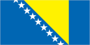
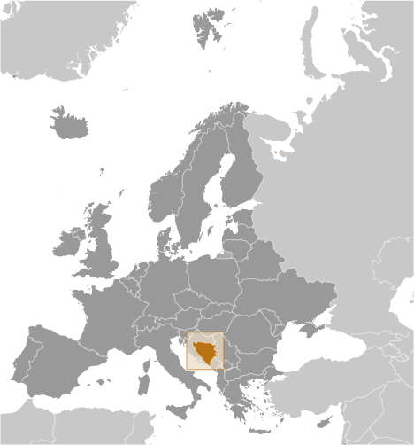
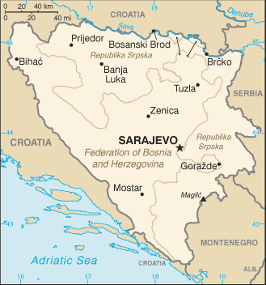

# Bosnia and Herzegovina

## Introduction

**_Background:_**   
Bosnia and Herzegovina declared sovereignty in October 1991 and independence from the former Yugoslavia on 3 March 1992 after a referendum boycotted by ethnic Serbs. The Bosnian Serbs - supported by neighboring Serbia and Montenegro - responded with armed resistance aimed at partitioning the republic along ethnic lines and joining Serb-held areas to form a "Greater Serbia." In March 1994, Bosniaks and Croats reduced the number of warring factions from three to two by signing an agreement creating a joint Bosniak/Croat Federation of Bosnia and Herzegovina. On 21 November 1995, in Dayton, Ohio, the warring parties initialed a peace agreement that ended three years of interethnic civil strife (the final agreement was signed in Paris on 14 December 1995). The Dayton Peace Accords retained Bosnia and Herzegovina's international boundaries and created a multi-ethnic and democratic government charged with conducting foreign, diplomatic, and fiscal policy. Also recognized was a second tier of government composed of two entities roughly equal in size: the Bosniak/Bosnian Croat Federation of Bosnia and Herzegovina and the Bosnian Serb-led Republika Srpska (RS). The Federation and RS governments are responsible for overseeing most government functions. Additionally, the Dayton Accords established the Office of the High Representative (OHR) to oversee the implementation of the civilian aspects of the agreement. The Peace Implementation Council (PIC) at its conference in Bonn in 1997 also gave the High Representative the authority to impose legislation and remove officials, the so-called "Bonn Powers." An original NATO-led international peacekeeping force (IFOR) of 60,000 troops assembled in 1995 was succeeded over time by a smaller, NATO-led Stabilization Force (SFOR). In 2004, European Union peacekeeping troops (EUFOR) replaced SFOR. Currently EUFOR deploys around 600 troops in theater in a policing capacity.

## Geography

**_Location:_**   
Southeastern Europe, bordering the Adriatic Sea and Croatia

**_Geographic coordinates:_**   
44 00 N, 18 00 E

**_Map references:_**   
Europe

**_Area:_**   
**total:** 51,197 sq km   
**land:** 51,187 sq km   
**water:** 10 sq km

**_Area - comparative:_**   
slightly smaller than West Virginia

**_Land boundaries:_**   
**total:** 1,543 km   
**border countries:** Croatia 956 km, Montenegro 242 km, Serbia 345 km

**_Coastline:_**   
20 km

**_Maritime claims:_**   
no data available

**_Climate:_**   
hot summers and cold winters; areas of high elevation have short, cool summers and long, severe winters; mild, rainy winters along coast

**_Terrain:_**   
mountains and valleys

**_Elevation extremes:_**   
**lowest point:** Adriatic Sea 0 m   
**highest point:** Maglic 2,386 m

**_Natural resources:_**   
coal, iron ore, bauxite, copper, lead, zinc, chromite, cobalt, manganese, nickel, clay, gypsum, salt, sand, timber, hydropower

**_Land use:_**   
**arable land:** 19.63%   
**permanent crops:** 1.99%   
**other:** 78.38% (2011)

**_Irrigated land:_**   
30 sq km (2003)

**_Total renewable water resources:_**   
37.5 cu km (2011)

**_Natural hazards:_**   
destructive earthquakes

**_Environment - current issues:_**   
air pollution from metallurgical plants; sites for disposing of urban waste are limited; water shortages and destruction of infrastructure because of the 1992-95 civil strife; deforestation

**_Environment - international agreements:_**   
**party to:** Air Pollution, Biodiversity, Climate Change, Climate Change-Kyoto Protocol, Desertification, Hazardous Wastes, Law of the Sea, Marine Life Conservation, Ozone Layer Protection, Wetlands   
**signed, but not ratified:** none of the selected agreements

**_Geography - note:_**   
within Bosnia and Herzegovina's recognized borders, the country is divided into a joint Bosniak/Croat Federation (about 51% of the territory) and the Bosnian Serb-led Republika Srpska or RS (about 49% of the territory); the region called Herzegovina is contiguous to Croatia and Montenegro, and traditionally has been settled by an ethnic Croat majority in the west and an ethnic Serb majority in the east

## People and Society

**_Nationality:_**   
**noun:** Bosnian(s), Herzegovinian(s)   
**adjective:** Bosnian, Herzegovinian

**_Ethnic groups:_**   
Bosniak 48%, Serb 37.1%, Croat 14.3%, other 0.6% (2000)   
**note:** Bosniak has replaced Muslim as an ethnic term in part to avoid confusion with the religious term Muslim - an adherent of Islam

**_Languages:_**   
Bosnian (official), Croatian (official), Serbian (official)

**_Religions:_**   
Muslim 40%, Orthodox 31%, Roman Catholic 15%, other 14%

**_Population:_**   
3,871,643 (July 2014 est.)

**_Age structure:_**   
**0-14 years:** 13.7% (male 272,812/female 256,152)   
**15-24 years:** 12.7% (male 255,074/female 238,428)   
**25-54 years:** 46.7% (male 906,265/female 899,870)   
**55-64 years:** 13.7% (male 253,045/female 276,769)   
**65 years and over:** 13.3% (male 199,515/female 313,713) (2014 est.)

**_Dependency ratios:_**   
**total dependency ratio:** 44.8 %   
**youth dependency ratio:** 22 %   
**elderly dependency ratio:** 22.7 %   
**potential support ratio:** 4.4 (2014 est.)

**_Median age:_**   
**total:** 40.8 years   
**male:** 39.4 years   
**female:** 42.2 years (2014 est.)

**_Population growth rate:_**   
-0.11% (2014 est.)

**_Birth rate:_**   
8.89 births/1,000 population (2014 est.)

**_Death rate:_**   
9.64 deaths/1,000 population (2014 est.)

**_Net migration rate:_**   
-0.38 migrant(s)/1,000 population (2014 est.)

**_Urbanization:_**   
**urban population:** 48.3% of total population (2011)   
**rate of urbanization:** 0.86% annual rate of change (2010-15 est.)

**_Major urban areas - population:_**   
SARAJEVO (capital) 389,000 (2011)

**_Sex ratio:_**   
**at birth:** 1.07 male(s)/female   
**0-14 years:** 1.07 male(s)/female   
**15-24 years:** 1.07 male(s)/female   
**25-54 years:** 1.01 male(s)/female   
**55-64 years:** 0.95 male(s)/female   
**65 years and over:** 0.63 male(s)/female   
**total population:** 0.95 male(s)/female (2014 est.)

**_Mother's mean age at first birth:_**   
26.3 (2011 est.)

**_Maternal mortality rate:_**   
8 deaths/100,000 live births (2010)

**_Infant mortality rate:_**   
**total:** 5.84 deaths/1,000 live births   
**male:** 5.91 deaths/1,000 live births   
**female:** 5.78 deaths/1,000 live births (2014 est.)

**_Life expectancy at birth:_**   
**total population:** 76.33 years   
**male:** 73.33 years   
**female:** 79.55 years (2014 est.)

**_Total fertility rate:_**   
1.26 children born/woman (2014 est.)

**_Contraceptive prevalence rate:_**   
45.8% (2012)

**_Health expenditures:_**   
10.2% of GDP (2011)

**_Physicians density:_**   
1.69 physicians/1,000 population (2010)

**_Hospital bed density:_**   
3.5 beds/1,000 population (2010)

**_Drinking water source:_**   
**improved:** urban: 99.6% of population; rural: 99.5% of population; total: 99.6% of population   
**unimproved:** urban: 0.4% of population; rural: 0.5% of population; total: 0.4% of population (2012 est.)

**_Sanitation facility access:_**   
**improved:** urban: 98.9% of population; rural: 92.1% of population; total: 95.4% of population   
**unimproved:** urban: 1.1% of population; rural: 7.9% of population; total: 4.6% of population (2012 est.)

**_HIV/AIDS - adult prevalence rate:_**   
less than 0.1% (2007 est.)

**_HIV/AIDS - people living with HIV/AIDS:_**   
900 (2007 est.)

**_HIV/AIDS - deaths:_**   
100 (2001 est.)

**_Obesity - adult prevalence rate:_**   
26.5% (2008)

**_Children under the age of 5 years underweight:_**   
1.5% (2012)

**_Education expenditures:_**   
NA

**_Literacy:_**   
**definition:** age 15 and over can read and write   
**total population:** 98%   
**male:** 99.5%   
**female:** 96.7% (2011 est.)

**_Child labor - children ages 5-14:_**   
**total number:** 24,722   
**percentage:** 5 % (2006 est.)

**_Unemployment, youth ages 15-24:_**   
**total:** 62.8%   
**male:** 62.8%   
**female:** 62.8% (2012)

## Government

**_Country name:_**   
**conventional long form:** none   
**conventional short form:** Bosnia and Herzegovina   
**local long form:** none   
**local short form:** Bosna i Hercegovina   
**former:** People's Republic of Bosnia and Herzegovina, Socialist Republic of Bosnia and Herzegovina

**_Government type:_**   
emerging federal democratic republic

**_Capital:_**   
**name:** Sarajevo   
**geographic coordinates:** 43 52 N, 18 25 E   
**time difference:** UTC+1 (6 hours ahead of Washington, DC, during Standard Time)   
**daylight saving time:** +1hr, begins last Sunday in March; ends last Sunday in October

**_Administrative divisions:_**   
2 first-order administrative divisions and 1 internationally supervised district\* - the Bosniak/Croat Federation of Bosnia and Herzegovina (Federacija Bosne i Hercegovine), the Bosnian Serb-led Republika Srpska, Brcko District (Brcko Distrikt)\*; note - Brcko District is in northeastern Bosnia and is a self-governing administrative unit under the sovereignty of Bosnia and Herzegovina and formally held in condominium between the two entities

**_Independence:_**   
1 March 1992 (from Yugoslavia; referendum for independence completed on 1 March 1992; independence declared on 3 March 1992)

**_National holiday:_**   
National Day (Statehood Day), 25 November (1943); note - observed only in the Federation of Bosnia and Herzegovina entity

**_Constitution:_**   
14 December 1995 (constitution included as part of the Dayton Peace Accords); amended several times, last in 2003; note - each of the entities has its own constitution (2011)

**_Legal system:_**   
civil law system; Constitutional Court review of legislative acts

**_International law organization participation:_**   
has not submitted an ICJ jurisdiction declaration; accepts ICCt jurisdiction

**_Suffrage:_**   
18 years of age, 16 if employed; universal

**_Executive branch:_**   
**chief of state:** Chairman of the Presidency Bakir IZETBEGOVIC (chairman since 10 March 2014; presidency member since 10 November 2010 - Bosniak) ; other members of the three-member presidency rotate every eight months: Zeljko KOMSIC (presidency member since 6 November 2006 - Croat); Nebojsa RADMANOVIC (presidency member since 6 November 2006 - Serb)   
**head of government:** Chairman of the Council of Ministers Vjekoslav BEVANDA (since 12 January 2012)   
**cabinet:** Council of Ministers nominated by the council chairman; approved by the state-level House of Representatives   
**elections:** the three members of the presidency (one Bosniak, one Croat, one Serb) elected by popular vote for a four-year term (eligible for a second term, but then ineligible for four years) by constituencies referring to the three ethnic groups; the candidate with the most votes in a constituency is elected; the chairmanship rotates every eight months and resumes where it left off following each general election; election last held on 3 October 2010 (next to be held in October 2014); the chairman of the Council of Ministers appointed by the presidency and confirmed by the state-level House of Representatives   
**election results:** percent of vote - Nebojsa RADMANOVIC with 48.9% of the votes for the Serb seat; Zeljko KOMSIC with 60.6% of the votes for the Croat seat; Bakir IZETBEGOVIC with 34.9% of the votes for the Bosniak seat   
**note:** President of the Federation of Bosnia and Herzegovina Zivko BUDIMIR (since 17 March 2011); Vice Presidents Svetozar PUDARIC (since 17 March 2011) and Mirsad KEBO (since 17 March 2007); President of the Republika Srpska Milorad DODIK (since 15 November 2010); Vice Presidents Enes SULJKANOVIC (since 15 November 2010) and Emil VLAJKI (since 15 November 2010)

**_Legislative branch:_**   
bicameral Parliamentary Assembly or Skupstina consists of the House of Peoples or Dom Naroda (15 seats, 5 Bosniak, 5 Croat, 5 Serb; members designated by the Bosniak/Croat Federation's House of Peoples and the Republika Srpska's National Assembly to serve four-year terms); and the state-level House of Representatives or Predstavnicki Dom (42 seats, 28 seats allocated for the Federation of Bosnia and Herzegovina and 14 seats for the Republika Srpska; members elected by popular vote on the basis of proportional representation to serve four-year terms); note - Bosnia's election law specifies four-year terms for the state and first-order administrative division entity legislatures   
**elections:** House of Peoples - last constituted in 9 June 2011 (next likely to be constituted in 2015); state-level House of Representatives - election last held on 3 October 2010 (next to be held in October 2014)   
**election results:** House of Peoples - percent of vote by party/coalition - NA; seats by party/coalition - NA; state-level House of Representatives - percent of vote by party/coalition - Federation votes: SDP BiH 26.1%, SDA 19.4%, SBB BiH 12.2%, HDZ BiH 11%, SBIH 7.3%, HDZ-1990/HSP BiH 4.9%, NSRzB 4.8%, DNZ 1.5%; Republika Srpska votes: SNSD 43.3%, SDS 22.2%, PDP 6.5%, DNS 4.6%; seats by party/coalition - SDP BiH 8, SNSD 8, SDA 7, SDS 4, SBB BiH 4, HDZ-BiH 3, SBiH 2, HDZ-1990/HSP BiH 2, NSRzB 1, DNZ 1, PDP 1, DNS 1   
**note:** the Bosniak/Croat Federation has a bicameral legislature that consists of a House of Peoples (58 seats - 17 Bosniak, 17 Croat, 17 Serb, 7 other); last constituted May 2011 (next likely to be constituted in 2015); and a House of Representatives (98 seats; members elected by popular vote to serve four-year terms); elections last held on 3 October 2010 (next to be held in October 2014); percent of vote by party - SDP BiH 24.5%, SDA 20.2%, SBB BiH 11.9%, HDZ BiH 10.6%, SBiH 7.6%, NSRzB 4.7%, HDZ 1990/HSP BiH 4.7%, A-SDA 1.9%, DNZ 1.5%, SNSD .9%; seats by party/coalition - SDP BiH 28, SDA 23, SBB BiH 13, HDZ-BiH 12, SBiH 9, NSRzB 5, HDZ-1990/HSP BiH 5, DNZ 1, A-SDA 1, SNSD 1; the Republika Srpska has a National Assembly (83 seats; members elected by popular vote to serve four-year terms); elections last held on 3 October 2010 (next to be held in October 2014); percent of vote by party - SNSD 38%, SDS 19%, PDP 7.6%, DNS 6%, SPRS 4.2%, DP 3.4%, SDP BiH 3%, SDA 2.7%, SRS RS 2.4%, NDS 2.1%; seats by party/coalition - SNSD 37, SDS 18, PDP 7, DNS 6, SPRS 4, DP 3, SDP BiH 3, SDA 2, NDS 2, SRS-RS 1; as a result of the 2002 constitutional reform process, a 28-member Republika Srpska Council of Peoples (COP) was established in the Republika Srpska National Assembly including 8 Croats, 8 Bosniaks, 8 Serbs, and 4 members of the smaller communities

**_Judicial branch:_**   
**highest court(s):** BiH Constitutional Court (consists of 9 members); Court of BiH (consists of 44 national judges and 7 international judges organized into three divisions - Administrative, Appellate, and Criminal, which includes a War Crimes Chamber)   
**judge selection and term of office:** BiH Constitutional Court judges - 4 selected by the Bosniak/Croat Federation's House of Representatives, 2 selected by the Republika Srpska's National Assembly, and 3 non-Bosnian judges selected by the president of the European Court of Human Rights; Court of BiH president and national judges appointed by the High Judicial and Prosecutorial Council; Court of BiH president appointed for renewable 6-year term; other national judges appointed to serve until age 70; international judges recommended by the president of the Court of BiH and appointed by the High Representative for Bosnia and Herzegovina; international judges appointed to serve until age 70   
**subordinate courts:** the Federation has 10 cantonal courts plus a number of municipal courts; the Republika Srpska has a supreme court, 5 district courts, and a number of municipal courts

**_Political parties and leaders:_**   
Activist Democratic Party or A-SDA   
Alliance for a Better Future of BiH or SBB BiH [Fahrudin RADONCIC]   
Alliance of Independent Social Democrats or SNSD [Milorad DODIK]   
Bosnian Party or BOSS [Mirnes AJANOVIC]   
Bosnian Patriotic Party or BPS [Sefer HALILOVIC]   
Civic Democratic Party or GDS [Ibrahim SPAHIC]   
Croat Peasants' Party-New Croat Initiative or HSS-NHI [Ante COLAK]   
Croatian Christian Democratic Union of Bosnia and Herzegovina or HKDU [Ivan MUSA]   
Croatian Democratic Union of Bosnia and Herzegovina or HDZ-BiH [Dragan COVIC]   
Croatian Democratic Union 1990 or HDZ-1990 [Martin RAGUZ]   
Croatian Party of Rights of Bosnia and Herzegovina or HSP BiH [Zvonko JURISIC]   
Democratic National Union or DNZ [Rifat DOLIC]   
Democratic Peoples' Alliance or DNS [Marko PAVIC]   
Liberal Democratic Party or LDS [Amir HUSARIC]   
Nasa Stranka or NS [Denis GRATZ]   
National Democratic Party or NDS   
New Socialist Party or NSP [Zdravko KRSMANOVIC]   
Party for Bosnia and Herzegovina or SBiH [Amer JERLAGIC]   
Party of Democratic Action or SDA [Sulejman TIHIC]   
Party of Democratic Progress or PDP [Mladen IVANIC]   
Party of Justice and Trust or SPP [Zivko BUDIMIR]   
People's Democratic Movement or NDP [Dragan CAVIC and Krsto JANDRIC] (unification of the Democratic Party or DP and the People's Democratic Party or NDS)   
'People's' Party of Work for Progress or NSRzB [Mladen IVANKOVIC-LIJANOVIC]   
Serb Democratic Party or SDS [Mladen BOSIC]   
Serb Radical Party of the Republika Srpska or SRS-RS [Milanko MIHAJLICA]   
Serb Radical Party-Dr. Vojislav Seselj or SRS-VS [Dejan SANTIC]   
Social Democratic Party of BiH or SDP BiH [Zlatko LAGUMDZIJA]   
Social Democratic Union or SDU [Miro LAZOVIC]   
Socialist Party of Republika Srpska or SPRS [Petar DJOKIC]

**_Political pressure groups and leaders:_**   
**other:** war veterans; displaced persons associations; family associations of missing persons; private media

**_International organization participation:_**   
BIS, CD, CE, CEI, EAPC, EBRD, FAO, G-77, IAEA, IBRD, ICAO, ICC (NGOs), ICRM, IDA, IFAD, IFC, IFRCS, ILO, IMF, IMO, IMSO, Interpol, IOC, IOM, IPU, ISO, ITSO, ITU, ITUC (NGOs), MIGA, MONUSCO, NAM (observer), OAS (observer), OIC (observer), OIF (observer), OPCW, OSCE, PFP, SELEC, UN, UNCTAD, UNESCO, UNIDO, UNWTO, UPU, WCO, WHO, WIPO, WMO, WTO (observer)

**_Diplomatic representation in the US:_**   
**chief of mission:** Ambassador Jadranka NEGODIC (since 19 July 2012)   
**chancery:** 2109 E Street NW, Washington, DC 20037   
**telephone:** [1] (202) 337-1500   
**FAX:** [1] (202) 337-1502   
**consulate(s) general:** Chicago, New York

**_Diplomatic representation from the US:_**   
**chief of mission:** Ambassador (vacant); Charge d'Affaires ad interim Nicholas M. HILL (since 24 August 2013)   
**embassy:** 1 Robert C. Frasure Street, 71000 Sarajevo   
**mailing address:** use embassy street address   
**telephone:** [387] (33) 704-000   
**FAX:** [387] (33) 659-722   
**branch office(s):** Banja Luka, Mostar

**_Flag description:_**   
a wide medium blue vertical band on the fly side with a yellow isosceles triangle abutting the band and the top of the flag; the remainder of the flag is medium blue with seven full five-pointed white stars and two half stars top and bottom along the hypotenuse of the triangle; the triangle approximates the shape of the country and its three points stand for the constituent peoples - Bosniaks, Croats, and Serbs; the stars represent Europe and are meant to be continuous (thus the half stars at top and bottom); the colors (white, blue, and yellow) are often associated with neutrality and peace, and traditionally are linked with Bosnia

**_National symbol(s):_**   
golden lily

**_National anthem:_**   
**name:** "Drzavna himna Bosne i Hercegovine" (The National Anthem of Bosnia and Herzegovina)   
**lyrics/music:** Dusan SESTIC and Benjamin ISOVIC/Dusan SESTIC   
**note:** music adopted 1999; lyrics adopted 2009

## Economy

**_Economy - overview:_**   
Bosnia has a transitional economy with limited market reforms. The economy relies heavily on the export of metals, energy, textiles and furniture as well as on remittances and foreign aid. A highly decentralized government hampers economic policy coordination and reform, while excessive bureaucracy and a segmented market discourage foreign investment. The interethnic warfare in Bosnia and Herzegovina caused production to plummet by 80% from 1992 to 1995 and unemployment to soar. With an uneasy peace in place, output recovered in 1996-99 but slowed in 2000-02 and picked up again during 2003-08, when GDP growth exceeded 5% per year. However, the country declined in 2009 reflecting local effects of the global economic crisis. GDP growth contracted again in 2012, but posted a small gain in 2013. Foreign banks, primarily from Austria and Italy, now control most of the banking sector. The konvertibilna marka (convertible mark or BAM) - the national currency introduced in 1998 - is pegged to the euro, and confidence in the currency and the banking sector has remained stable. Bosnia's private sector is growing slowly, but foreign investment has dropped sharply since 2007. Government spending - including transfer payments - remains high, at roughly 40% of GDP, because of redundant government offices at the state, entity and municipal level. Privatization of state enterprises has been slow, particularly in the Federation, where political division between ethnically-based political parties makes agreement on economic policy more difficult. High unemployment remains the most serious macroeconomic problem. Successful implementation of a value-added tax in 2006 provided a steady source of revenue for the government and helped rein in gray-market activity. National-level statistics have also improved over time but a large share of economic activity remains unofficial and unrecorded. Bosnia and Herzegovina became a full member of the Central European Free Trade Agreement in September 2007. Bosnia and Herzegovina's top economic priorities are: acceleration of integration into the EU; strengthening the fiscal system; public administration reform; World Trade Organization (WTO) membership; and securing economic growth by fostering a dynamic, competitive private sector. In 2009, Bosnia and Herzegovina was granted an International Monetary Fund (IMF) stand-by arrangement, necessitated by sharply increased social spending and a fiscal crisis exacerbated by the global economic downturn. Disbursement of IMF aid was suspended in 2011 after a parliamentary deadlock left Bosnia without a state-level government for over a year. The IMF concluded a new stand-by arrangement with Bosnia in October 2012 which aims to improve national policy coordination, continue fiscal contraction, improve crisis preparedness, and create an environment conducive to private sector development.

**_GDP (purchasing power parity):_**   
$32.16 billion (2013 est.)   
$31.9 billion (2012 est.)   
$32.26 billion (2011 est.)   
**note:** data are in 2013 US dollars

**_GDP (official exchange rate):_**   
$18.87 billion (2013 est.)

**_GDP - real growth rate:_**   
0.8% (2013 est.)   
-1.1% (2012 est.)   
1% (2011 est.)

**_GDP - per capita (PPP):_**   
$8,300 (2013 est.)   
$8,200 (2012 est.)   
$8,300 (2011 est.)   
**note:** data are in 2013 US dollars

**_Gross national saving:_**   
8.6% of GDP (2013 est.)   
6.3% of GDP (2012 est.)   
6.4% of GDP (2011 est.)

**_GDP - composition, by end use:_**   
**household consumption:** 82.1%   
**government consumption:** 22.1%   
**investment in fixed capital:** 17.7%   
**investment in inventories:** 1.5%   
**exports of goods and services:** 29%   
**imports of goods and services:** -52.4%; (2012 est.)

**_GDP - composition, by sector of origin:_**   
**agriculture:** 8.1%   
**industry:** 26.4%   
**services:** 65.5% (2013 est.)

**_Agriculture - products:_**   
wheat, corn, fruits, vegetables; livestock

**_Industries:_**   
steel, coal, iron ore, lead, zinc, manganese, bauxite, aluminum, motor vehicle assembly, textiles, tobacco products, wooden furniture, ammunition, domestic appliances, oil refining

**_Industrial production growth rate:_**   
11.7% (2013 est.)

**_Labor force:_**   
1.49 million (2012 est.)

**_Labor force - by occupation:_**   
**agriculture:** 18.9%   
**industry:** 29.8%   
**services:** 51.3% (2013)

**_Unemployment rate:_**   
44.3% (2013 est.)   
44.1% (2012 est.)   
**note:** official rate; actual rate is lower as many technically unemployed persons work in the gray economy

**_Population below poverty line:_**   
18.6% (2007 est.)

**_Household income or consumption by percentage share:_**   
**lowest 10%:** 2.7%   
**highest 10%:** 27.3% (2007)

**_Distribution of family income - Gini index:_**   
36.2 (2007)

**_Budget:_**   
**revenues:** $7.691 billion   
**expenditures:** $7.497 billion (2013 est.)

**_Taxes and other revenues:_**   
40.8% of GDP (2013 est.)

**_Budget surplus (+) or deficit (-):_**   
1% of GDP (2013 est.)

**_Public debt:_**   
45.9% of GDP (2013 est.)   
42.9% of GDP (2012 est.)   
**note:** data cover general government debt, and includes debt instruments issued (or owned) by government entities other than the treasury; the data include treasury debt held by foreign entities; the data include debt issued by subnational entities, as well as intra-governmental debt; intra-governmental debt consists of treasury borrowings from surpluses in the social funds, such as for retirement, medical care, and unemployment; debt instruments for the social funds are not sold at public auctions.

**_Fiscal year:_**   
calendar year

**_Inflation rate (consumer prices):_**   
0.2% (2013 est.)   
1.8% (2012 est.)

**_Commercial bank prime lending rate:_**   
6.73% (31 December 2013 est.)   
6.8% (31 December 2012 est.)

**_Stock of narrow money:_**   
$4.493 billion (31 December 2013 est.)   
$4.122 billion (31 December 2012 est.)

**_Stock of broad money:_**   
$10.8 billion (31 December 2013 est.)   
$10.21 billion (31 December 2012 est.)

**_Stock of domestic credit:_**   
$11 billion (31 December 2013 est.)   
$10.82 billion (31 December 2012 est.)

**_Market value of publicly traded shares:_**   
$NA

**_Current account balance:_**   
-$939.5 million (2013 est.)   
$1.639 billion (2012 est.)

**_Exports:_**   
$5.687 billion (2013 est.)   
$5.161 billion (2012 est.)

**_Exports - commodities:_**   
metals, clothing, wood products

**_Exports - partners:_**   
Germany 15.6%, Croatia 14.2%, Italy 12.1%, Serbia 9.1%, Austria 8.2%, Slovenia 8.1% (2012 est.)

**_Imports:_**   
$10.3 billion (2013 est.)   
$10.02 billion (2012 est.)

**_Imports - commodities:_**   
machinery and equipment, chemicals, fuels, foodstuffs

**_Imports - partners:_**   
Germany 11.4%, Russian Federation 9.9%, Serbia 9.8%, Italy 9.7%, China 6%, Slovenia 5%, Croatia 12.8% (2012 est.)

**_Reserves of foreign exchange and gold:_**   
$5.002 billion (31 January 2014 est.)   
$4.852 billion (31 January 2013 est.)

**_Debt - external:_**   
$11.14 billion (31 December 2013 est.)   
$10.81 billion (31 December 2012 est.)

**_Stock of direct foreign investment - at home:_**   
$7.721 billion   
$7.58 billion

**_Exchange rates:_**   
konvertibilna markas (BAM) per US dollar -   
1.42 (2013 est.)   
1.52 (2012 est.)   
1.4767 (2010 est.)   
1.4079 (2009)   
1.3083 (2008)

## Energy

**_Electricity - production:_**   
12.93 billion kWh (2012 est.)

**_Electricity - consumption:_**   
12.62 billion kWh (2012 est.)

**_Electricity - exports:_**   
1.569 billion kWh (2012 est.)

**_Electricity - imports:_**   
1.245 billion kWh (2012 est.)

**_Electricity - installed generating capacity:_**   
3.963 million kW (2012 est.)

**_Electricity - from fossil fuels:_**   
43.3% of total installed capacity (2012 est.)

**_Electricity - from nuclear fuels:_**   
0% of total installed capacity (2012 est.)

**_Electricity - from hydroelectric plants:_**   
53.2% of total installed capacity (2012 est.)

**_Electricity - from other renewable sources:_**   
3.5% of total installed capacity (2012 est.)

**_Crude oil - production:_**   
0 bbl/day (2012 est.)

**_Crude oil - exports:_**   
0 bbl/day (2012 est.)

**_Crude oil - imports:_**   
22,140 bbl/day (2010 est.)

**_Crude oil - proved reserves:_**   
0 bbl (1 January 2013 est.)

**_Refined petroleum products - production:_**   
22,430 bbl/day (2010 est.)

**_Refined petroleum products - consumption:_**   
27,540 bbl/day (2011 est.)

**_Refined petroleum products - exports:_**   
10,460 bbl/day (2010 est.)

**_Refined petroleum products - imports:_**   
16,330 bbl/day (2010 est.)

**_Natural gas - production:_**   
0 cu m (2013 est.)

**_Natural gas - consumption:_**   
256.9 million cu m (2013 est.)

**_Natural gas - exports:_**   
0 cu m (2013 est.)

**_Natural gas - imports:_**   
256.9 million cu m (2013 est.)

**_Natural gas - proved reserves:_**   
0 cu m (1 January 2013 est.)

**_Carbon dioxide emissions from consumption of energy:_**   
22.2 million Mt (2011 est.)

## Communications

**_Telephones - main lines in use:_**   
878,000 (2012)

**_Telephones - mobile cellular:_**   
3.35 million (2012)

**_Telephone system:_**   
**general assessment:** post-war reconstruction of the telecommunications network, aided by an internationally sponsored program, resulting in sharp increases in the number of fixed telephone lines available   
**domestic:** fixed-line teledensity roughly 25 per 100 persons; mobile-cellular subscribership has been increasing rapidly and, stands at roughly 80 telephones per 100 persons   
**international:** country code - 387; no satellite earth stations (2011)

**_Broadcast media:_**   
3 public TV broadcasters: Radio and TV of Bosnia and Herzegovina, Federation TV (operating 2 networks), and Republika Srpska Radio-TV; a local commercial network of 5 TV stations; 3 private, near-national TV stations and dozens of small independent TV stations broadcasting; 3 large public radio broadcasters and many private radio stations (2010)

**_Internet country code:_**   
.ba

**_Internet hosts:_**   
155,252 (2012)

**_Internet users:_**   
1.422 million (2009)

## Transportation

**_Airports:_**   
24 (2013)

**_Airports - with paved runways:_**   
**total:** 7   
**2,438 to 3,047 m:** 4   
**1,524 to 2,437 m:** 1   
**under 914 m:** 2 (2013)

**_Airports - with unpaved runways:_**   
**total:** 17   
**1,524 to 2,437 m:** 1   
**914 to 1,523 m:** 5   
**under 914 m:** 11 (2013)

**_Heliports:_**   
6 (2013)

**_Pipelines:_**   
gas 147 km; oil 9 km (2013)

**_Railways:_**   
**total:** 601 km   
**standard gauge:** 601 km 1.435-m gauge (392 km electrified) (2009)

**_Roadways:_**   
**total:** 22,926 km   
**paved:** 19,426 km (4,652 km of interurban roads)   
**unpaved:** 3,500 km (2010)

**_Waterways:_**   
(Sava River on northern border; open to shipping but use limited) (2011)

**_Ports and terminals:_**   
**river port(s):** Bosanska Gradiska, Bosanski Brod, Bosanski Samac, Brcko, Orasje (Sava River)

## Military

**_Military branches:_**   
Armed Forces of Bosnia and Herzegovina (AFBiH): Army of Bosnia and Herzegovina, Air and Air Defense Forces of Bosnia and Herzegovina (Zrakoplovstvo i Protuzracna Obrana, ZPO) (2013)

**_Military service age and obligation:_**   
18 years of age for voluntary military service; mandatory retirement at age 35 or after 15 years of service (2013)

**_Manpower available for military service:_**   
**males age 16-49:** 1,180,829   
**females age 16-49:** 1,143,919 (2010 est.)

**_Manpower fit for military service:_**   
**males age 16-49:** 968,242   
**females age 16-49:** 937,327 (2010 est.)

**_Manpower reaching militarily significant age annually:_**   
**male:** 26,601   
**female:** 24,879 (2010 est.)

**_Military expenditures:_**   
1.35% of GDP (2012)   
1.15% of GDP (2011)   
1.35% of GDP (2010)

## Transnational Issues

**_Disputes - international:_**   
Serbia delimited about half of the boundary with Bosnia and Herzegovina, but sections along the Drina River remain in dispute

**_Refugees and internally displaced persons:_**   
**refugees (country of origin):** 6,709 (Croatia) (2013)   
**IDPs:** 103,400 (Bosnian Croats, Serbs, and Bosniaks displaced by intern-ethnic violence, human rights violations, and armed conflict during the 1992-1995 war) (2013 est.)   
**stateless persons:** 4,500 (2012)

**_Illicit drugs:_**   
increasingly a transit point for heroin being trafficked to Western Europe; minor transit point for marijuana; remains highly vulnerable to money-laundering activity given a primarily cash-based and unregulated economy, weak law enforcement, and instances of corruption

............................................................   
_Page last updated on June 23, 2014_
