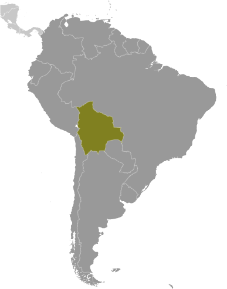
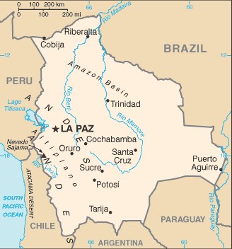

# Bolivia

## Introduction

**_Background:_**   
Bolivia, named after independence fighter Simon BOLIVAR, broke away from Spanish rule in 1825; much of its subsequent history has consisted of a series of nearly 200 coups and countercoups. Democratic civilian rule was established in 1982, but leaders have faced difficult problems of deep-seated poverty, social unrest, and illegal drug production. In December 2005, Bolivians elected Movement Toward Socialism leader Evo MORALES president - by the widest margin of any leader since the restoration of civilian rule in 1982 - after he ran on a promise to change the country's traditional political class and empower the nation's poor, indigenous majority. In December 2009, President MORALES easily won reelection, and his party took control of the legislative branch of the government, which will allow him to continue his process of change. In October 2011, the country held its first judicial elections to select judges for the four highest courts.

## Geography

**_Location:_**   
Central South America, southwest of Brazil

**_Geographic coordinates:_**   
17 00 S, 65 00 W

**_Map references:_**   
South America

**_Area:_**   
**total:** 1,098,581 sq km   
**land:** 1,083,301 sq km   
**water:** 15,280 sq km

**_Area - comparative:_**   
slightly less than three times the size of Montana

**_Land boundaries:_**   
**total:** 7,252 km   
**border countries:** Argentina 942 km, Brazil 3,403 km, Chile 942 km, Paraguay 753 km, Peru 1,212 km

**_Coastline:_**   
0 km (landlocked)

**_Maritime claims:_**   
none (landlocked)

**_Climate:_**   
varies with altitude; humid and tropical to cold and semiarid

**_Terrain:_**   
rugged Andes Mountains with a highland plateau (Altiplano), hills, lowland plains of the Amazon Basin

**_Elevation extremes:_**   
**lowest point:** Rio Paraguay 90 m   
**highest point:** Nevado Sajama 6,542 m

**_Natural resources:_**   
tin, natural gas, petroleum, zinc, tungsten, antimony, silver, iron, lead, gold, timber, hydropower

**_Land use:_**   
**arable land:** 3.49%   
**permanent crops:** 0.2%   
**other:** 96.31% (2011)

**_Irrigated land:_**   
1,282 sq km (2003)

**_Total renewable water resources:_**   
622.5 cu km (2011)

**_Freshwater withdrawal (domestic/industrial/agricultural):_**   
**total:** 2.64 cu km/yr (25%/14%/61%)   
**per capita:** 305.8 cu m/yr (2005)

**_Natural hazards:_**   
flooding in the northeast (March to April)   
**volcanism:** volcanic activity in Andes Mountains on the border with Chile; historically active volcanoes in this region are Irruputuncu (elev. 5,163 m), which last erupted in 1995, and Olca-Paruma

**_Environment - current issues:_**   
the clearing of land for agricultural purposes and the international demand for tropical timber are contributing to deforestation; soil erosion from overgrazing and poor cultivation methods (including slash-and-burn agriculture); desertification; loss of biodiversity; industrial pollution of water supplies used for drinking and irrigation

**_Environment - international agreements:_**   
**party to:** Biodiversity, Climate Change, Climate Change-Kyoto Protocol, Desertification, Endangered Species, Hazardous Wastes, Law of the Sea, Marine Dumping, Ozone Layer Protection, Ship Pollution, Tropical Timber 83, Tropical Timber 94, Wetlands   
**signed, but not ratified:** Environmental Modification, Marine Life Conservation

**_Geography - note:_**   
landlocked; shares control of Lago Titicaca, world's highest navigable lake (elevation 3,805 m), with Peru

## People and Society

**_Nationality:_**   
**noun:** Bolivian(s)   
**adjective:** Bolivian

**_Ethnic groups:_**   
Quechua 30%, mestizo (mixed white and Amerindian ancestry) 30%, Aymara 25%, white 15%

**_Languages:_**   
Spanish (official) 60.7%, Quechua (official) 21.2%, Aymara (official) 14.6%, Guarani (official), foreign languages 2.4%, other 1.2%   
**note:** Bolivia's 2009 constitution designates Spanish and all indigenous languages as official; 36 indigenous languages are specified, including some that are extinct (2001 census)

**_Religions:_**   
Roman Catholic 95%, Protestant (Evangelical Methodist) 5%

**_Demographic profile:_**   
Bolivia ranks at or near the bottom among Latin American countries in several areas of health and development, including poverty, education, fertility, malnutrition, mortality, and life expectancy. On the positive side, more children are being vaccinated and more pregnant women are getting prenatal care and having skilled health practitioners attend their births. Bolivia's income inequality is the highest in Latin America and one of the highest in the world. Public education is of poor quality, and educational opportunities are among the most unevenly distributed in Latin America, with girls and indigenous and rural children less likely to be literate or to complete primary school. The lack of access to education and family planning services helps to sustain Bolivia's high fertility rate - approximately three children per woman. Bolivia's lack of clean water and basic sanitation, especially in rural areas, contributes to health problems.   
Almost 7% of Bolivia's population lives abroad, primarily to work in Argentina, Brazil, Spain, and the United States. In recent years, more restrictive immigration policies in Europe and the United States have increased the flow of Bolivian emigrants to neighboring Argentina and Brazil.

**_Population:_**   
10,631,486 (July 2014 est.)

**_Age structure:_**   
**0-14 years:** 33.3% (male 1,805,121/female 1,737,794)   
**15-24 years:** 19.8% (male 1,063,823/female 1,037,320)   
**25-54 years:** 36.3% (male 1,878,736/female 1,979,819)   
**55-64 years:** 5.7% (male 280,809/female 322,057)   
**65 years and over:** 4.9% (male 232,514/female 293,493) (2014 est.)

**_Dependency ratios:_**   
**total dependency ratio:** 65.3 %   
**youth dependency ratio:** 57 %   
**elderly dependency ratio:** 8.2 %   
**potential support ratio:** 12.1 (2014 est.)

**_Median age:_**   
**total:** 23.4 years   
**male:** 22.6 years   
**female:** 24.1 years (2014 est.)

**_Population growth rate:_**   
1.6% (2014 est.)

**_Birth rate:_**   
23.28 births/1,000 population (2014 est.)

**_Death rate:_**   
6.59 deaths/1,000 population (2014 est.)

**_Net migration rate:_**   
-0.69 migrant(s)/1,000 population (2014 est.)

**_Urbanization:_**   
**urban population:** 66.8% of total population (2011)   
**rate of urbanization:** 2.18% annual rate of change (2010-15 est.)

**_Major urban areas - population:_**   
Santa Cruz 1.719 million; LA PAZ (capital) 1.715 million; Sucre (constitutional capital) 307,000 (2011)

**_Sex ratio:_**   
**at birth:** 1.05 male(s)/female   
**0-14 years:** 1.04 male(s)/female   
**15-24 years:** 1.03 male(s)/female   
**25-54 years:** 0.95 male(s)/female   
**55-64 years:** 0.98 male(s)/female   
**65 years and over:** 0.79 male(s)/female   
**total population:** 0.98 male(s)/female (2014 est.)

**_Mother's mean age at first birth:_**   
21.2   
**note:** median age at first birth among women 25-29 (2008 est.)

**_Maternal mortality rate:_**   
190 deaths/100,000 live births (2008)

**_Infant mortality rate:_**   
**total:** 38.61 deaths/1,000 live births   
**male:** 42.23 deaths/1,000 live births   
**female:** 34.81 deaths/1,000 live births (2014 est.)

**_Life expectancy at birth:_**   
**total population:** 68.55 years   
**male:** 65.78 years   
**female:** 71.45 years (2014 est.)

**_Total fertility rate:_**   
2.8 children born/woman (2014 est.)

**_Contraceptive prevalence rate:_**   
60.5% (2008)

**_Health expenditures:_**   
4.9% of GDP (2011)

**_Physicians density:_**   
1.22 physicians/1,000 population (2001)

**_Hospital bed density:_**   
1.1 beds/1,000 population (2011)

**_Drinking water source:_**   
**improved:** urban: 96% of population; rural: 71.9% of population; total: 88.1% of population   
**unimproved:** urban: 4% of population; rural: 28.1% of population; total: 11.9% of population (2012 est.)

**_Sanitation facility access:_**   
**improved:** urban: 57.5% of population; rural: 23.7% of population; total: 46.4% of population   
**unimproved:** urban: 42.5% of population; rural: 76.3% of population; total: 53.6% of population (2012 est.)

**_HIV/AIDS - adult prevalence rate:_**   
0.3% (2012 est.)

**_HIV/AIDS - people living with HIV/AIDS:_**   
15,900 (2012 est.)

**_HIV/AIDS - deaths:_**   
1,300 (2012 est.)

**_Major infectious diseases:_**   
**degree of risk:** very high   
**food or waterborne diseases:** bacterial diarrhea and hepatitis A   
**vectorborne diseases:** dengue fever, malaria, and yellow fever (2013)

**_Obesity - adult prevalence rate:_**   
17.9% (2008)

**_Children under the age of 5 years underweight:_**   
4.5% (2008)

**_Education expenditures:_**   
6.9% of GDP (2011)

**_Literacy:_**   
**definition:** age 15 and over can read and write   
**total population:** 91.2%   
**male:** 95.8%   
**female:** 86.8% (2009 est.)

**_School life expectancy (primary to tertiary education):_**   
**total:** 13 years   
**male:** 13 years   
**female:** 13 years (2007)

**_Child labor - children ages 5-14:_**   
**total number:** 553,323   
**percentage:** 26 %   
**note:** data represents children ages 5-13 (2008 est.)

**_Unemployment, youth ages 15-24:_**   
**total:** 6.2%   
**male:** 4.8%   
**female:** 7.8% (2009)

## Government

**_Country name:_**   
**conventional long form:** Plurinational State of Bolivia   
**conventional short form:** Bolivia   
**local long form:** Estado Plurinacional de Bolivia   
**local short form:** Bolivia

**_Government type:_**   
republic; note - the new constitution defines Bolivia as a "Social Unitarian State"

**_Capital:_**   
**name:** La Paz (administrative capital); Sucre (constitutional capital)   
**geographic coordinates:** 16 30 S, 68 09 W   
**time difference:** UTC-4 (1 hour ahead of Washington, DC, during Standard Time)

**_Administrative divisions:_**   
9 departments (departamentos, singular - departamento); Beni, Chuquisaca, Cochabamba, La Paz, Oruro, Pando, Potosi, Santa Cruz, Tarija

**_Independence:_**   
6 August 1825 (from Spain)

**_National holiday:_**   
Independence Day, 6 August (1825)

**_Constitution:_**   
many previous; latest drafted 6 August 2006 - 9 December 2008, approved by referendum 25 January 2009, effective 7 February 2009; amended 2013 (2013)

**_Legal system:_**   
civil law system with influences from Roman, Spanish, canon (religious), French, and indigenous law

**_International law organization participation:_**   
has not submitted an ICJ jurisdiction declaration; accepts ICCt jurisdiction

**_Suffrage:_**   
18 years of age, universal and compulsory

**_Executive branch:_**   
**chief of state:** President Juan Evo MORALES Ayma (since 22 January 2006); Vice President Alvaro GARCIA Linera (since 22 January 2006); note - the president is both chief of state and head of government   
**head of government:** President Juan Evo MORALES Ayma (since 22 January 2006); Vice President Alvaro GARCIA Linera (since 22 January 2006)   
**cabinet:** Cabinet appointed by the president   
**elections:** president and vice president elected on the same ticket by popular vote for a five-year term and are eligible for re-election once; election last held on 6 December 2009 (next to be held in 2014)   
**election results:** Juan Evo MORALES Ayma reelected president; percent of vote - Juan Evo MORALES Ayma 64%; Manfred REYES VILLA 26%; Samuel DORIA MEDINA Arana 6%; Rene JOAQUINO 2%; other 2%

**_Legislative branch:_**   
bicameral Plurinational Legislative Assembly or Asamblea Legislativa Plurinacional consists of Chamber of Senators or Camara de Senadores (36 seats; members are elected by proportional representation from party lists to serve five-year terms) and Chamber of Deputies or Camara de Diputados (130 seats total; 70 uninominal deputies directly elected from a single district, 7 "special" indigenous deputies directly elected from non-contiguous indigenous districts, and 53 plurinominal deputies elected by proportional representation from party lists; all deputies serve five-year terms)   
**elections:** Chamber of Senators and Chamber of Deputies - last held on 6 December 2009 (next to be held in 2014)   
**election results:** Chamber of Senators - percent of vote by party - NA; seats by party - MAS 26, PPB-CN 10; Chamber of Deputies - percent of vote by party - NA; seats by party - MAS 89, PPB-CN 36, UN 3, AS 2; note - as of 15 February 2013, the composition of the Chamber of Deputies was: MAS 88, PPB-CN 37, UN 3, AS 2

**_Judicial branch:_**   
**highest court(s):** Supreme Court or Tribunal Supremo de Justicia (consists of 12 judges); Plurinational Constitutional Tribunal (consists of 7 primary and 7 alternate magistrates); Plurinational Electoral Organ (consists of 7 members);   
**judge selection and term of office:** Supreme Court and Plurinational Constitutional Tribunal judges elected by popular vote from list of candidates pre-selected by Plurinational Legislative Assembly for 6-year terms); Plurinational Electoral Organ members - 6 judges elected by the Assembly and 1 appointed by the president; judges and members serve 6-year terms   
**note:** the 2009 constitution reformed the procedure for selecting judicial officials for the Supreme Court, Constitutional Tribunal, and the Plurinational Electoral Organ by direct national vote, which occurred in October 2011   
**subordinate courts:** Agro-Environmental Court; Council of the Judiciary; District Courts (in each of the 9 administrative departments)

**_Political parties and leaders:_**   
Bacada Indigena or BI   
Bolivia-National Convergence or PPB-CN [Adrian OLIVA]   
Fearless Movement or MSM [Juan DE GRANADO Cosio]   
Movement Toward Socialism or MAS [Juan Evo MORALES Ayma]   
National Unity or UN [Samuel DORIA MEDINA Arana]   
People or Gente [Roman LOAYZA]   
Social Alliance or AS [Rene JOAQUINO]   
Social Democratic Movement or MDS [Ruben COSTAS]

**_Political pressure groups and leaders:_**   
Bolivian Workers Central or COB   
Federation of Neighborhood Councils of El Alto or FEJUVE   
Landless Movement or MST   
National Coordinator for Change or CONALCAM   
Sole Confederation of Campesino Workers of Bolivia or CSUTCB   
**other:** Cocalero groups; indigenous organizations (including Confederation of Indigenous Peoples of Eastern Bolivia or CIDOB and National Council of Ayullus and Markas of Quollasuyu or CONAMAQ); Interculturales union or CSCIB; labor unions (including the Central Bolivian Workers' Union or COB and Cooperative Miners Federation or FENCOMIN)

**_International organization participation:_**   
CAN, CD, CELAC, FAO, G-77, IADB, IAEA, IBRD, ICAO, ICC (national committees), ICRM, IDA, IFAD, IFC, IFRCS, ILO, IMF, IMO, Interpol, IOC, IOM, IPU, ISO (correspondent), ITSO, ITU, LAES, LAIA, Mercosur (associate), MIGA, MINUSTAH, MONUSCO, NAM, OAS, OPANAL, OPCW, PCA, UN, UNASUR, UNCTAD, UNESCO, UNFICYP, UNIDO, Union Latina, UNISFA, UNMIL, UNMISS, UNOCI, UNWTO, UPU, WCO, WFTU (NGOs), WHO, WIPO, WMO, WTO

**_Diplomatic representation in the US:_**   
**chief of mission:** Ambassador (vacant); Charge d'Affaires Freddy BERSATTI Tudela   
**chancery:** 3014 Massachusetts Avenue NW, Washington, DC 20008   
**telephone:** [1] (202) 483-4410   
**FAX:** [1] (202) 328-3712   
**consulate(s) general:** Los Angeles, Miami, New York   
**note:** as of September 2008, the US has expelled the Bolivian ambassador to the US

**_Diplomatic representation from the US:_**   
**chief of mission:** Ambassador (vacant); Charge d'Affaires Aruna AMIRTHANAYAGAM (since 28 February 2014)   
**embassy:** Avenida Arce 2780, Casilla 425, La Paz   
**mailing address:** P. O. Box 425, La Paz; APO AA 34032   
**telephone:** [591] (2) 216-8000   
**FAX:** [591] (2) 216-8111   
**note:** in September 2008, the Bolivian Government expelled the US Ambassador to Bolivia, and the countries have yet to reinstate ambassadors

**_Flag description:_**   
three equal horizontal bands of red (top), yellow, and green with the coat of arms centered on the yellow band; red stands for bravery and the blood of national heroes, yellow for the nation's mineral resources, and green for the fertility of the land   
**note:** similar to the flag of Ghana, which has a large black five-pointed star centered in the yellow band; in 2009, a presidential decree made it mandatory for a so-called wiphala - a square, multi-colored flag representing the country's indigenous peoples - to be used alongside the traditional flag

**_National symbol(s):_**   
llama; Andean condor

**_National anthem:_**   
**name:** "Cancion Patriotica" (Patriotic Song)   
**lyrics/music:** Jose Ignacio de SANJINES/Leopoldo Benedetto VINCENTI   
**note:** adopted 1852

## Economy

**_Economy - overview:_**   
Bolivia is a resource rich country with strong growth attributed to captive markets for natural gas exports. However, the country remains one of the least developed countries in Latin America because of state-oriented policies that deter investment and growth. Following a disastrous economic crisis during the early 1980s, reforms spurred private investment, stimulated economic growth, and cut poverty rates in the 1990s. The period 2003-05 was characterized by political instability, racial tensions, and violent protests against plans - subsequently abandoned - to export Bolivia's newly discovered natural gas reserves to large Northern Hemisphere markets. In 2005, the government passed a controversial hydrocarbons law that imposed significantly higher royalties and required foreign firms then operating under risk-sharing contracts to surrender all production to the state energy company in exchange for a predetermined service fee. The global recession slowed growth, but Bolivia recorded the highest growth rate in South America during 2009. High commodity prices since 2010 sustained rapid growth and large trade surpluses. However, a lack of foreign investment in the key sectors of mining and hydrocarbons, along with conflict among social groups pose challenges for the Bolivian economy.

**_GDP (purchasing power parity):_**   
$59.11 billion (2013 est.)   
$55.35 billion (2012 est.)   
$52.63 billion (2011 est.)   
**note:** data are in 2013 US dollars

**_GDP (official exchange rate):_**   
$30.79 billion (2013 est.)

**_GDP - real growth rate:_**   
6.8% (2013 est.)   
5.2% (2012 est.)   
5.2% (2011 est.)

**_GDP - per capita (PPP):_**   
$5,500 (2013 est.)   
$5,200 (2012 est.)   
$4,900 (2011 est.)   
**note:** data are in 2013 US dollars

**_Gross national saving:_**   
25.7% of GDP (2013 est.)   
26% of GDP (2012 est.)   
24.9% of GDP (2011 est.)

**_GDP - composition, by end use:_**   
**household consumption:** 58.9%   
**government consumption:** 13.4%   
**investment in fixed capital:** 18%   
**investment in inventories:** 0.3%   
**exports of goods and services:** 47.8%   
**imports of goods and services:** -38.4%; (2013 est.)

**_GDP - composition, by sector of origin:_**   
**agriculture:** 9.2%   
**industry:** 38.5%   
**services:** 52.3% (2013 est.)

**_Agriculture - products:_**   
quinoa, soybeans, coffee, coca, cotton, corn, sugarcane, rice, potatoes; Brazil nuts; timber

**_Industries:_**   
mining, smelting, petroleum, food and beverages, tobacco, handicrafts, clothing, jewelry

**_Industrial production growth rate:_**   
5.6% (2013 est.)

**_Labor force:_**   
4.922 million (2012 est.)

**_Labor force - by occupation:_**   
**agriculture:** 32%   
**industry:** 27.4%   
**services:** 40.6% (2009 est.)

**_Unemployment rate:_**   
7.4% (2013 est.)   
7.5% (2012 est.)   
**note:** data are for urban areas; widespread underemployment

**_Population below poverty line:_**   
45%   
**note:** based on percent of population living on less than the international standard of $2/day (2011 est.)

**_Household income or consumption by percentage share:_**   
**lowest 10%:** 1.8%   
**highest 10%:** 46% (2012 est.)

**_Distribution of family income - Gini index:_**   
47 (2011)   
57.9 (1999)

**_Budget:_**   
**revenues:** $15.16 billion   
**expenditures:** $15.13 billion (2013 est.)

**_Taxes and other revenues:_**   
48.8% of GDP (2013 est.)

**_Budget surplus (+) or deficit (-):_**   
0.1% of GDP (2013 est.)

**_Public debt:_**   
36% of GDP (2013 est.)   
32.6% of GDP (2012 est.)   
**note:** data cover general government debt, and includes debt instruments issued by government entities other than the treasury; the data include treasury debt held by foreign entities; the data include debt issued by subnational entities

**_Fiscal year:_**   
calendar year

**_Inflation rate (consumer prices):_**   
6.5% (2013 est.)   
4.5% (2012 est.)

**_Central bank discount rate:_**   
4.5% (31 December 2013 est.)   
4% (31 december 2012 est.)

**_Commercial bank prime lending rate:_**   
11.41% (31 December 2013 est.)   
10.6% (31 December 2012 est.)

**_Stock of narrow money:_**   
$8.429 billion (31 December 2013 est.)   
$7.434 billion (31 December 2012 est.)

**_Stock of broad money:_**   
$20.19 billion (31 December 2013 est.)   
$17.4 billion (31 December 2012 est.)

**_Stock of domestic credit:_**   
$12.45 billion (31 December 2013 est.)   
$10.49 billion (31 December 2012 est.)

**_Market value of publicly traded shares:_**   
$9.684 billion (31 December 2013)   
$7.689 billion (31 December 2012)   
$6.089 billion (31 December 2011)

**_Current account balance:_**   
$1.012 billion (2013 est.)   
$2.259 billion (2012 est.)

**_Exports:_**   
$12.16 billion (2013 est.)   
$11.77 billion (2012 est.)

**_Exports - commodities:_**   
natural gas, soybeans and soy products, crude petroleum, zinc ore, tin

**_Exports - partners:_**   
Brazil 41.8%, US 18.4%, Argentina 7.3%, Peru 4.9% (2012)

**_Imports:_**   
$9.282 billion (2013 est.)   
$8.18 billion (2012 est.)

**_Imports - commodities:_**   
petroleum products, plastics, paper, aircraft and aircraft parts, prepared foods, automobiles, insecticides

**_Imports - partners:_**   
Chile 21.3%, Brazil 20.3%, Argentina 10.9%, US 10.1%, Peru 6.5%, Venezuela 6.2%, China 4.9% (2012)

**_Reserves of foreign exchange and gold:_**   
$14.43 billion (31 December 2013 est.)   
$13.93 billion (31 December 2012 est.)

**_Debt - external:_**   
$5.265 billion (31 December 2013 est.)   
$4.196 billion (31 December 2012 est.)

**_Stock of direct foreign investment - at home:_**   
$10.56 billion (31 December 2013)   
$8.809 billion (31 December 2012)

**_Stock of direct foreign investment - abroad:_**   
$0 (31 december 2013)   
$0 (31 December 2012)

**_Exchange rates:_**   
bolivianos (BOB) per US dollar -   
6.91 (2013 est.)   
6.94 (2012 est.)   
7.0167 (2010 est.)   
7.07 (2009)   
7.253 (2008)

## Energy

**_Electricity - production:_**   
7.375 billion kWh (2013 est.)

**_Electricity - consumption:_**   
6.944 billion kWh (2012 est.)

**_Electricity - exports:_**   
0 kWh (2013 est.)

**_Electricity - imports:_**   
0 kWh (2013 est.)

**_Electricity - installed generating capacity:_**   
1.365 million kW (2012 est.)

**_Electricity - from fossil fuels:_**   
63.6% of total installed capacity (2012 est.)

**_Electricity - from nuclear fuels:_**   
0% of total installed capacity (2012 est.)

**_Electricity - from hydroelectric plants:_**   
34.9% of total installed capacity (2012 est.)

**_Electricity - from other renewable sources:_**   
1.5% of total installed capacity (2012 est.)

**_Crude oil - production:_**   
51,200 bbl/day (2013 est.)

**_Crude oil - exports:_**   
60.71 bbl/day (2013 est.)

**_Crude oil - imports:_**   
0 bbl/day (2013 est.)

**_Crude oil - proved reserves:_**   
209.8 million bbl (1 January 2013 est.)

**_Refined petroleum products - production:_**   
40,000 bbl/day (2013 est.)

**_Refined petroleum products - consumption:_**   
55,560 bbl/day (2013 est.)

**_Refined petroleum products - exports:_**   
0 bbl/day (2013 est.)

**_Refined petroleum products - imports:_**   
15,560 bbl/day (2013 est.)

**_Natural gas - production:_**   
54.37 billion cu m (2013 est.)

**_Natural gas - consumption:_**   
9.432 billion cu m (2013 est.)

**_Natural gas - exports:_**   
44.94 billion cu m (2013 est.)

**_Natural gas - imports:_**   
0 cu m (2013 est.)

**_Natural gas - proved reserves:_**   
281.5 billion cu m (1 January 2013 est.)

**_Carbon dioxide emissions from consumption of energy:_**   
13.98 million Mt (2011 est.)

## Communications

**_Telephones - main lines in use:_**   
880,600 (2012)

**_Telephones - mobile cellular:_**   
9.494 million (2012)

**_Telephone system:_**   
**general assessment:** Bolivian National Telecommunications Company was privatized in 1995 but re-nationalized in 2007; the primary trunk system is being expanded and employs digital microwave radio relay; some areas are served by fiber-optic cable; system operations, reliability, and coverage have steadily improved.   
**domestic:** most telephones are concentrated in La Paz, Santa Cruz, and other capital cities; mobile-cellular telephone use expanding rapidly and, in 2011, teledensity reached about 80 per 100 persons   
**international:** country code - 591; satellite earth station - 1 Intelsat (Atlantic Ocean) (2011)

**_Broadcast media:_**   
large number of radio and TV stations broadcasting with private media outlets dominating; state-owned and private radio and TV stations generally operating freely, although both pro-government and anti-government groups have attacked media outlets in response to their reporting (2010)

**_Internet country code:_**   
.bo

**_Internet hosts:_**   
180,988 (2012)

**_Internet users:_**   
1.103 million (2009)

## Transportation

**_Airports:_**   
855 (2013)

**_Airports - with paved runways:_**   
**total:** 21   
**over 3,047 m:** 5   
**2,438 to 3,047 m:** 4   
**1,524 to 2,437 m:** 6   
**914 to 1,523 m:** 6 (2013)

**_Airports - with unpaved runways:_**   
**total:** 834   
**over 3,047 m:** 1   
**2,438 to 3,047 m:** 4   
**1,524 to 2,437 m:** 47   
**914 to 1,523 m:** 151   
**under 914 m:** 631 (2013)

**_Pipelines:_**   
gas 5,457 km; liquid petroleum gas 51 km; oil 2,511 km; refined products 1,627 km (2013)

**_Railways:_**   
**total:** 3,652 km   
**narrow gauge:** 3,652 km 1.000-m gauge (2010)

**_Roadways:_**   
**total:** 80,488 km   
**paved:** 11,993 km   
**unpaved:** 68,495 km (2010)

**_Waterways:_**   
10,000 km (commercially navigable almost exclusively in the northern and eastern parts of the country) (2012)

**_Merchant marine:_**   
**total:** 18   
**by type:** bulk carrier 1, cargo 14, petroleum tanker 1, roll on/roll off 2   
**foreign-owned:** 5 (Syria 4, UK 1, (2010)

**_Ports and terminals:_**   
**river port(s):** Puerto Aguirre (Paraguay/Parana)   
**note:** Bolivia has free port privileges in maritime ports in Argentina, Brazil, Chile, and Paraguay

## Military

**_Military branches:_**   
Bolivian Armed Forces: Bolivian Army (Ejercito Boliviano, EB), Bolivian Naval Force (Fuerza Naval Boliviana, FNB; includes Marines), Bolivian Air Force (Fuerza Aerea Boliviana, FAB) (2013)

**_Military service age and obligation:_**   
18-49 years of age for 12-month compulsory male and female military service; Bolivian citizenship required; 17 years of age for voluntary service; when annual number of volunteers falls short of goal, compulsory recruitment is effected, including conscription of boys as young as 14; 15-19 years of age for voluntary premilitary service, provides exemption from further military service (2013)

**_Manpower available for military service:_**   
**males age 16-49:** 2,472,490   
**females age 16-49:** 2,535,768 (2010 est.)

**_Manpower fit for military service:_**   
**males age 16-49:** 1,762,260   
**females age 16-49:** 2,013,281 (2010 est.)

**_Manpower reaching militarily significant age annually:_**   
**male:** 108,334   
**female:** 104,945 (2010 est.)

**_Military expenditures:_**   
1.47% of GDP (2012)   
1.47% of GDP (2011)   
1.47% of GDP (2010)

## Transnational Issues

**_Disputes - international:_**   
Chile and Peru rebuff Bolivia's reactivated claim to restore the Atacama corridor, ceded to Chile in 1884, but Chile offers instead unrestricted but not sovereign maritime access through Chile for Bolivian natural gas; contraband smuggling, human trafficking, and illegal narcotic trafficking are problems in the porous areas of the border with Argentina

**_Illicit drugs:_**   
world's third-largest cultivator of coca (after Colombia and Peru) with an estimated 30,000 hectares under cultivation in 2011, a decrease of 13 percent over 2010; third largest producer of cocaine, estimated at 265 metric tons potential pure cocaine in 2011, a 29 percent increase over 2010; transit country for Peruvian and Colombian cocaine destined for Brazil, Argentina, Chile, Paraguay, and Europe; weak border controls; some money-laundering activity related to narcotics trade; major cocaine consumption (2013)

............................................................   
_Page last updated on June 23, 2014_
