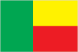
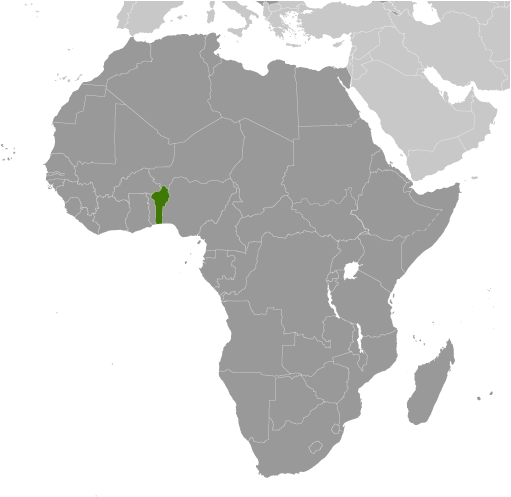
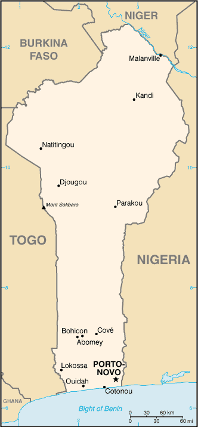

# Benin

## Introduction

**_Background:_**   
Present day Benin was the site of Dahomey, a West African kingdom that rose to prominence in about 1600 and over the next two and half centuries became a regional power, largely based on its slave trade. Coastal areas of Dahomey began to be controlled by the French in the second half of the 19th century; the entire kingdom was conquered by 1894. French Dahomey achieved independence in 1960; it changed its name to the Republic of Benin in 1975. A succession of military governments ended in 1972 with the rise to power of Mathieu KEREKOU and the establishment of a government based on Marxist-Leninist principles. A move to representative government began in 1989. Two years later, free elections ushered in former Prime Minister Nicephore SOGLO as president, marking the first successful transfer of power in Africa from a dictatorship to a democracy. KEREKOU was returned to power by elections held in 1996 and 2001, though some irregularities were alleged. KEREKOU stepped down at the end of his second term in 2006 and was succeeded by Thomas YAYI Boni, a political outsider and independent. YAYI, who won a second five-year term in March 2011, has attempted to stem corruption and has strongly promoted accelerating Benin's economic growth.

## Geography

**_Location:_**   
Western Africa, bordering the Bight of Benin, between Nigeria and Togo

**_Geographic coordinates:_**   
9 30 N, 2 15 E

**_Map references:_**   
Africa

**_Area:_**   
**total:** 112,622 sq km   
**land:** 110,622 sq km   
**water:** 2,000 sq km

**_Area - comparative:_**   
slightly smaller than Pennsylvania

**_Land boundaries:_**   
**total:** 2,123 km   
**border countries:** Burkina Faso 386 km, Niger 277 km, Nigeria 809 km, Togo 651 km

**_Coastline:_**   
121 km

**_Maritime claims:_**   
**territorial sea:** 200 nm

**_Climate:_**   
tropical; hot, humid in south; semiarid in north

**_Terrain:_**   
mostly flat to undulating plain; some hills and low mountains

**_Elevation extremes:_**   
**lowest point:** Atlantic Ocean 0 m   
**highest point:** Mont Sokbaro 658 m

**_Natural resources:_**   
small offshore oil deposits, limestone, marble, timber

**_Land use:_**   
**arable land:** 22.48%   
**permanent crops:** 2.61%   
**other:** 74.9% (2011)

**_Irrigated land:_**   
230.4 sq km (2008)

**_Total renewable water resources:_**   
26.39 cu km (2011)

**_Freshwater withdrawal (domestic/industrial/agricultural):_**   
**total:** 0.13 cu km/yr (32%/23%/45%)   
**per capita:** 18.74 cu m/yr (2001)

**_Natural hazards:_**   
hot, dry, dusty harmattan wind may affect north from December to March

**_Environment - current issues:_**   
inadequate supplies of potable water; poaching threatens wildlife populations; deforestation; desertification

**_Environment - international agreements:_**   
**party to:** Biodiversity, Climate Change, Climate Change-Kyoto Protocol, Desertification, Endangered Species, Environmental Modification, Hazardous Wastes, Law of the Sea, Ozone Layer Protection, Ship Pollution, Wetlands, Whaling   
**signed, but not ratified:** none of the selected agreements

**_Geography - note:_**   
sandbanks create difficult access to a coast with no natural harbors, river mouths, or islands

## People and Society

**_Nationality:_**   
**noun:** Beninese (singular and plural)   
**adjective:** Beninese

**_Ethnic groups:_**   
Fon and related 39.2%, Adja and related 15.2%, Yoruba and related 12.3%, Bariba and related 9.2%, Peulh and related 7%, Ottamari and related 6.1%, Yoa-Lokpa and related 4%, Dendi and related 2.5%, other 1.6% (includes Europeans), unspecified 2.9% (2002 census)

**_Languages:_**   
French (official), Fon and Yoruba (most common vernaculars in south), tribal languages (at least six major ones in north)

**_Religions:_**   
Catholic 27.1%, Muslim 24.4%, Vodoun 17.3%, Protestant 10.4% (Celestial 5%, Methodist 3.2%, other Protestant 2.2%), other Christian 5.3%, other 15.5% (2002 census)

**_Population:_**   
10,160,556   
**note:** estimates for this country explicitly take into account the effects of excess mortality due to AIDS; this can result in lower life expectancy, higher infant mortality, higher death rates, lower population growth rates, and changes in the distribution of population by age and sex than would otherwise be expected (July 2014 est.)

**_Age structure:_**   
**0-14 years:** 43.8% (male 2,269,896/female 2,179,026)   
**15-24 years:** 20.1% (male 1,036,963/female 1,001,400)   
**25-54 years:** 29.9% (male 1,530,283/female 1,504,201)   
**55-64 years:** 3.5% (male 149,883/female 205,701)   
**65 years and over:** 2.8% (male 112,830/female 170,373) (2014 est.)

**_Dependency ratios:_**   
**total dependency ratio:** 83 %   
**youth dependency ratio:** 77.7 %   
**elderly dependency ratio:** 5.3 %   
**potential support ratio:** 18.9 (2014 est.)

**_Median age:_**   
**total:** 17.7 years   
**male:** 17.4 years   
**female:** 18.1 years (2014 est.)

**_Population growth rate:_**   
2.81% (2014 est.)

**_Birth rate:_**   
36.51 births/1,000 population (2014 est.)

**_Death rate:_**   
8.39 deaths/1,000 population (2014 est.)

**_Net migration rate:_**   
0 migrant(s)/1,000 population (2014 est.)

**_Urbanization:_**   
**urban population:** 44.9% of total population (2011)   
**rate of urbanization:** 4.12% annual rate of change (2010-15 est.)

**_Major urban areas - population:_**   
COTONOU (seat of government) 924,000; PORTO-NOVO (capital) 314,000 (2011)

**_Sex ratio:_**   
**at birth:** 1.05 male(s)/female   
**0-14 years:** 1.04 male(s)/female   
**15-24 years:** 1.04 male(s)/female   
**25-54 years:** 1.02 male(s)/female   
**55-64 years:** 1.01 male(s)/female   
**65 years and over:** 0.67 male(s)/female   
**total population:** 1.01 male(s)/female (2014 est.)

**_Mother's mean age at first birth:_**   
20.3   
**note:** median age at first birth among women 25-29 (2011-12 est.)

**_Maternal mortality rate:_**   
350 deaths/100,000 live births (2010)

**_Infant mortality rate:_**   
**total:** 57.09 deaths/1,000 live births   
**male:** 60.26 deaths/1,000 live births   
**female:** 53.76 deaths/1,000 live births (2014 est.)

**_Life expectancy at birth:_**   
**total population:** 61.07 years   
**male:** 59.75 years   
**female:** 62.47 years (2014 est.)

**_Total fertility rate:_**   
5.04 children born/woman (2014 est.)

**_Contraceptive prevalence rate:_**   
12.9% (2012)

**_Health expenditures:_**   
4.6% of GDP (2011)

**_Physicians density:_**   
0.06 physicians/1,000 population (2008)

**_Hospital bed density:_**   
0.5 beds/1,000 population (2010)

**_Drinking water source:_**   
**improved:** urban: 84.5% of population; rural: 69.1% of population; total: 76.1% of population   
**unimproved:** urban: 15.5% of population; rural: 30.9% of population; total: 23.9% of population (2012 est.)

**_Sanitation facility access:_**   
**improved:** urban: 25.3% of population; rural: 5.1% of population; total: 14.3% of population   
**unimproved:** urban: 74.7% of population; rural: 94.9% of population; total: 85.7% of population (2012 est.)

**_HIV/AIDS - adult prevalence rate:_**   
1.1% (2012 est.)

**_HIV/AIDS - people living with HIV/AIDS:_**   
71,500 (2012 est.)

**_HIV/AIDS - deaths:_**   
3,100 (2012 est.)

**_Major infectious diseases:_**   
**degree of risk:** very high   
**food or waterborne diseases:** bacterial and protozoal diarrhea, hepatitis A, and typhoid fever   
**vectorborne diseases:** dengue fever, malaria, and yellow fever   
**respiratory disease:** meningococcal meningitis   
**animal contact disease:** rabies (2013)

**_Obesity - adult prevalence rate:_**   
6% (2008)

**_Children under the age of 5 years underweight:_**   
20.2% (2006)

**_Education expenditures:_**   
5.3% of GDP (2010)

**_Literacy:_**   
**definition:** age 15 and over can read and write   
**total population:** 42.4%   
**male:** 55.2%   
**female:** 30.3% (2010 census)

**_School life expectancy (primary to tertiary education):_**   
**total:** 11 years   
**male:** 13 years   
**female:** 9 years (2011)

**_Child labor - children ages 5-14:_**   
**total number:** 1,020,981   
**percentage:** 46 % (2006 est.)

**_Unemployment, youth ages 15-24:_**   
**total:** 0.8%   
**male:** 1.1%   
**female:** 0.6% (2002)

## Government

**_Country name:_**   
**conventional long form:** Republic of Benin   
**conventional short form:** Benin   
**local long form:** Republique du Benin   
**local short form:** Benin   
**former:** Dahomey

**_Government type:_**   
republic

**_Capital:_**   
**name:** Porto-Novo (official capital); Cotonou (seat of government)   
**geographic coordinates:** 6 29 N, 2 37 E   
**time difference:** UTC+1 (6 hours ahead of Washington, DC, during Standard Time)

**_Administrative divisions:_**   
12 departments; Alibori, Atakora, Atlantique, Borgou, Collines, Kouffo, Donga, Littoral, Mono, Oueme, Plateau, Zou

**_Independence:_**   
1 August 1960 (from France)

**_National holiday:_**   
National Day, 1 August (1960)

**_Constitution:_**   
previous 1946, 1958 (preindependence); latest adopted by referendum 2 December 1990, promulgated 11 December 1990 (2012)

**_Legal system:_**   
civil law system modeled largely on the French system and some customary law

**_International law organization participation:_**   
has not submitted an ICJ jurisdiction declaration; accepts ICCt jurisdiction

**_Suffrage:_**   
18 years of age; universal

**_Executive branch:_**   
**chief of state:** President Thomas YAYI Boni (since 6 April 2006); note - the president is both chief of state and head of government   
**head of government:** President Thomas YAYI Boni (since 6 April 2006); Prime Minister Pascal KOUPAKI (since 28 May 2011)   
**cabinet:** Council of Ministers appointed by the president   
**elections:** president elected by popular vote for a five-year term (eligible for a second term); last held on 13 March 2011 (next to be held in March 2016)   
**election results:** Thomas YAYI Boni re-elected president; percent of vote - Thomas YAYI Boni 53.1%, Adrien HOUNGBEDJI 35.6%, Abdoulaye Bio TCHANE 6.1%, other 5.2%

**_Legislative branch:_**   
unicameral National Assembly or Assemblee Nationale (83 seats; members are elected by direct popular vote to serve four-year terms)   
**elections:** last held on 30 April 2011 (next to be held in 2015)   
**election results:** percent of vote by party - NA; seats by party - FCBE 41, UN 30, other 12

**_Judicial branch:_**   
**highest court(s):** Supreme Court or Cour Supreme (consists of the court president and 3 chamber presidents organized into an administrative division, judicial chamber, and chamber of accounts) Constitutional Court or Cour Constitutionnelle (consists of 7 members including the court president); High Court of Justice (consists of the Constitutional Court members, 6 members appointed by the National Assembly, and the Supreme Court president); note - jurisdiction of the High Court of Justice is to limited cases of high treason by the national president or members of the government   
**judge selection and term of office:** Supreme Court president and judges appointed by the national president upon the advice of the National Assembly; judges appointed for single renewable 5-year terms; Constitutional Court members - 4 appointed by the National Assembly and 3 by the national president; members appointed for single renewable 5-year terms; High Court of Justice "other" members elected by the National Assembly; member tenure NA   
**subordinate courts:** Court of Appeal or Cour d'Appel; district courts; village courts; Assize courts

**_Political parties and leaders:_**   
Be African Movement for Democracy and Progress or MADEP [Sefou FAGBOHOUN]; Alliance of Progress Forces or AFP; Benin Renaissance or RB [Rosine SOGLO]; Democratic Renewal Party or PRD [Adrien HOUNGBEDJI]; Force Cowrie for an Emerging Benin or FCBE [Yayi BONI]; Impulse for Progress and Democracy or IPD [Theophile NATA]; Key Force or FC [Lazare SÈHOUÉTO]; Movement for the People's Alternative or MAP [Olivier CAPO-CHICHI]; Rally for Democracy and Progress or RDP [Dominique HOUNGNINOU]; Social Democrat Party or PSD [Emmanuel GOLOU]; Union for Democracy and National Solidarity or UDS [Sacca LAFIA]; Union for the Relief or UPR [Issa SALIFOU]; Union Makes the Nation or UN [Adrien HOUNGBEDJI] (superceded Alliance for Dynamic Democracy or ADD)   
**note:** approximately 20 additional minor parties

**_Political pressure groups and leaders:_**   
**other:** economic groups; environmentalists; political groups; teachers' unions and other educational groups

**_International organization participation:_**   
ACP, AfDB, AU, CD, ECOWAS, Entente, FAO, FZ, G-77, IAEA, IBRD, ICAO, ICRM, IDA, IDB, IFAD, IFC, IFRCS, ILO, IMF, IMO, Interpol, IOC, IOM, IPU, ISO (correspondent), ITSO, ITU, ITUC (NGOs), MIGA, MINUSMA, MONUSCO, NAM, OAS (observer), OIC, OIF, OPCW, PCA, UN, UNCTAD, UNESCO, UNHCR, UNIDO, UNISFA, UNMIL, UNMISS, UNOCI, UNWTO, UPU, WAEMU, WCO, WFTU (NGOs), WHO, WIPO, WMO, WTO

**_Diplomatic representation in the US:_**   
**chief of mission:** Ambassador Omar AROUNA (since 21 May 2014)   
**chancery:** 2124 Kalorama Road NW, Washington, DC 20008   
**telephone:** [1] (202) 232-6656   
**FAX:** [1] (202) 265-1996

**_Diplomatic representation from the US:_**   
**chief of mission:** Ambassador Michael RAYNOR (since 24 May 2012)   
**embassy:** Rue Caporal Bernard Anani, Cotonou   
**mailing address:** 01 B. P. 2012, Cotonou   
**telephone:** [229] 21-30-06-50   
**FAX:** [229] 21-30-66-82

**_Flag description:_**   
two equal horizontal bands of yellow (top) and red (bottom) with a vertical green band on the hoist side; green symbolizes hope and revival, yellow wealth, and red courage   
**note:** uses the popular Pan-African colors of Ethiopia

**_National symbol(s):_**   
leopard

**_National anthem:_**   
**name:** "L'Aube Nouvelle" (The Dawn of a New Day)   
**lyrics/music:** Gilbert Jean DAGNON   
**note:** adopted 1960

## Economy

**_Economy - overview:_**   
The economy of Benin remains underdeveloped and dependent on subsistence agriculture, cotton production, and regional trade. Growth in real output had averaged almost 4% before the global recession and it has returned to roughly that level in 2011-12. Inflation has subsided over the past several years. In order to raise growth, Benin plans to attract more foreign investment, place more emphasis on tourism, facilitate the development of new food processing systems and agricultural products, and encourage new information and communication technology. Specific projects to improve the business climate by reforms to the land tenure system, the commercial justice system, and the financial sector were included in Benin's $307 million Millennium Challenge Account grant signed in February 2006. The 2001 privatization policy continues in telecommunications, water, electricity, and agriculture. The Paris Club and bilateral creditors have eased the external debt situation with Benin benefiting from a G-8 debt reduction announced in July 2005, while pressing for more rapid structural reforms. An insufficient electrical supply continues to adversely affect Benin's economic growth though the government recently has taken steps to increase domestic power production. Private foreign direct investment is small, and foreign aid accounts for the majority of investment in infrastructure projects. Cotton, a key export, suffered from flooding in 2010-11, but high prices supported export earnings. The government agreed to a 25% increase in civil servant salaries in 2011, following a series of strikes, increasing pressure on the national budget. Benin has appealed for international assistance to mitigate piracy against commercial shipping in its territory.

**_GDP (purchasing power parity):_**   
$16.65 billion (2013 est.)   
$15.86 billion (2012 est.)   
$15.04 billion (2011 est.)   
**note:** data are in 2013 US dollars

**_GDP (official exchange rate):_**   
$8.359 billion (2013 est.)

**_GDP - real growth rate:_**   
5% (2013 est.)   
5.4% (2012 est.)   
3.5% (2011 est.)

**_GDP - per capita (PPP):_**   
$1,600 (2013 est.)   
$1,600 (2012 est.)   
$1,500 (2011 est.)   
**note:** data are in 2013 US dollars

**_Gross national saving:_**   
9.9% of GDP (2013 est.)   
9% of GDP (2012 est.)   
7.9% of GDP (2011 est.)

**_GDP - composition, by end use:_**   
**household consumption:** NA cu m   
**government consumption:** 12.7%   
**investment in fixed capital:** 18.6%   
**investment in inventories:** 0.2%   
**exports of goods and services:** 13.2%   
**imports of goods and services:** -26%; (2013 est.)

**_GDP - composition, by sector of origin:_**   
**agriculture:** 31.6%   
**industry:** 12.9%   
**services:** 55.6% (2013 est.)

**_Agriculture - products:_**   
cotton, corn, cassava (manioc, tapioca), yams, beans, palm oil, peanuts, cashews; livestock

**_Industries:_**   
textiles, food processing, construction materials, cement

**_Industrial production growth rate:_**   
3.7% (2013 est.)

**_Labor force:_**   
3.662 million (2007 est.)

**_Unemployment rate:_**   
NA%

**_Population below poverty line:_**   
37.4% (2007 est.)

**_Household income or consumption by percentage share:_**   
**lowest 10%:** 3.1%   
**highest 10%:** 29% (2003)

**_Distribution of family income - Gini index:_**   
36.5 (2003)

**_Budget:_**   
**revenues:** $1.712 billion   
**expenditures:** $1.825 billion (2013 est.)

**_Taxes and other revenues:_**   
20.5% of GDP (2013 est.)

**_Budget surplus (+) or deficit (-):_**   
-1.3% of GDP (2013 est.)

**_Public debt:_**   
29.7% of GDP (2013 est.)   
31.9% of GDP (2012 est.)

**_Fiscal year:_**   
calendar year

**_Inflation rate (consumer prices):_**   
2.4% (2013 est.)   
6.8% (2012 est.)

**_Central bank discount rate:_**   
4.25% (31 December 2010 est.)   
4.25% (31 December 2009 est.)

**_Commercial bank prime lending rate:_**   
NA%

**_Stock of narrow money:_**   
$1.889 billion (31 December 2013 est.)   
$1.755 billion (31 December 2012 est.)

**_Stock of broad money:_**   
$3.06 billion (31 December 2013 est.)   
$2.943 billion (31 December 2012 est.)

**_Stock of domestic credit:_**   
$1.511 billion (31 December 2013 est.)   
$1.529 billion (31 December 2012 est.)

**_Market value of publicly traded shares:_**   
$NA

**_Current account balance:_**   
-$699.3 million (2013 est.)   
-$684.9 million (2012 est.)

**_Exports:_**   
$1.108 billion (2013 est.)   
$1.071 billion (2012 est.)

**_Exports - commodities:_**   
cotton, cashews, shea butter, textiles, palm products, seafood

**_Exports - partners:_**   
China 25%, India 23.5%, Lebanon 18.7%, Niger 4.3%, Nigeria 4% (2012)

**_Imports:_**   
$1.835 billion (2013 est.)   
$1.755 billion (2012 est.)

**_Imports - commodities:_**   
foodstuffs, capital goods, petroleum products

**_Imports - partners:_**   
China 37.2%, US 8.9%, India 6.7%, France 5.6%, Malaysia 5.3% (2012)

**_Reserves of foreign exchange and gold:_**   
$720.3 million (31 December 2013 est.)   
$712.8 million (31 December 2012 est.)

**_Debt - external:_**   
$1.236 billion (31 December 2013 est.)   
$1.123 billion (31 December 2012 est.)

**_Exchange rates:_**   
Communaute Financiere Africaine francs (XOF) per US dollar -   
500.7 (2013 est.)   
510.53 (2012 est.)   
495.28 (2010 est.)   
472.19 (2009)   
447.81 (2008)

## Energy

**_Electricity - production:_**   
142.1 million kWh (2010 est.)

**_Electricity - consumption:_**   
870.1 million kWh (2010 est.)

**_Electricity - exports:_**   
0 kWh (2012 est.)

**_Electricity - imports:_**   
935 million kWh (2010 est.)

**_Electricity - installed generating capacity:_**   
61,000 kW (2010 est.)

**_Electricity - from fossil fuels:_**   
98.4% of total installed capacity (2010 est.)

**_Electricity - from nuclear fuels:_**   
0% of total installed capacity (2010 est.)

**_Electricity - from hydroelectric plants:_**   
1.6% of total installed capacity (2010 est.)

**_Electricity - from other renewable sources:_**   
0% of total installed capacity (2010 est.)

**_Crude oil - production:_**   
0 bbl/day (2012 est.)

**_Crude oil - exports:_**   
0 bbl/day (2010 est.)

**_Crude oil - imports:_**   
0 bbl/day (2010 est.)

**_Crude oil - proved reserves:_**   
8 million bbl (1 January 2013 est.)

**_Refined petroleum products - production:_**   
0 bbl/day (2010 est.)

**_Refined petroleum products - consumption:_**   
29,170 bbl/day (2011 est.)

**_Refined petroleum products - exports:_**   
0 bbl/day (2010 est.)

**_Refined petroleum products - imports:_**   
34,840 bbl/day (2010 est.)

**_Natural gas - production:_**   
0 cu m (2011 est.)

**_Natural gas - consumption:_**   
0 cu m (2010 est.)

**_Natural gas - exports:_**   
0 cu m (2011 est.)

**_Natural gas - imports:_**   
0 cu m (2011 est.)

**_Natural gas - proved reserves:_**   
1.133 billion cu m (1 January 2013 est.)

**_Carbon dioxide emissions from consumption of energy:_**   
4.655 million Mt (2011 est.)

## Communications

**_Telephones - main lines in use:_**   
156,700 (2012)

**_Telephones - mobile cellular:_**   
8.408 million (2012)

**_Telephone system:_**   
**general assessment:** inadequate system of open-wire, microwave radio relay, and cellular connections; fixed-line network characterized by aging, deteriorating equipment   
**domestic:** fixed-line teledensity only about 2 per 100 persons; spurred by the presence of multiple mobile-cellular providers, cellular telephone subscribership has been increasing rapidly   
**international:** country code - 229; landing point for the SAT-3/WASC fiber-optic submarine cable that provides connectivity to Europe and Asia; long distance fiber-optic links with Togo, Burkina Faso, Niger, and Nigeria; satellite earth stations - 7 (Intelsat-Atlantic Ocean) (2008)

**_Broadcast media:_**   
state-run Office de Radiodiffusion et de Television du Benin (ORTB) operates a TV station with multiple channels giving it a wide broadcast reach; several privately owned TV stations broadcast from Cotonou; satellite TV subscription service is available; state-owned radio, under ORTB control, includes a national station supplemented by a number of regional stations; substantial number of privately owned radio broadcast stations; transmissions of a few international broadcasters are available on FM in Cotonou (2007)

**_Internet country code:_**   
.bj

**_Internet hosts:_**   
491 (2012)

**_Internet users:_**   
200,100 (2009)

## Transportation

**_Airports:_**   
6 (2013)

**_Airports - with paved runways:_**   
**total:** 1   
**1,524 to 2,437 m:** 1 (2013)

**_Airports - with unpaved runways:_**   
**total:** 5   
**2,438 to 3,047 m:** 2   
**1,524 to 2,437 m:** 1   
**914 to 1,523 m:** 2 (2013)

**_Railways:_**   
**total:** 438 km   
**narrow gauge:** 438 km 1.000-m gauge (2008)

**_Roadways:_**   
**total:** 16,000 km   
**paved:** 1,400 km   
**unpaved:** 14,600 km (2006)

**_Waterways:_**   
150 km (seasonal navigation on River Niger along northern border) (2011)

**_Ports and terminals:_**   
**major seaport(s):** Cotonou

## Military

**_Military branches:_**   
Benin Armed Forces (Forces Armees Beninoises, FAB): Army (l'Arme de Terre), Benin Navy (Forces Navales Beninois, FNB), Benin Air Force (Force Aerienne du Benin, FAB) (2013)

**_Military service age and obligation:_**   
18-35 years of age for selective compulsory and voluntary military service; a higher education diploma is required; both sexes are eligible for military service; conscript tour of duty - 18 months (2013)

**_Manpower available for military service:_**   
**males age 16-49:** 2,095,373   
**females age 16-49:** 2,038,351 (2010 est.)

**_Manpower fit for military service:_**   
**males age 16-49:** 1,385,065   
**females age 16-49:** 1,400,045 (2010 est.)

**_Manpower reaching militarily significant age annually:_**   
**male:** 108,496   
**female:** 104,526 (2010 est.)

**_Military expenditures:_**   
1.03% of GDP (2012)   
NA% (2011)   
1.03% of GDP (2010)

## Transnational Issues

**_Disputes - international:_**   
talks continue between Benin and Togo on funding the Adjrala hydroelectric dam on the Mona River; Benin retains a border dispute with Burkina Faso around the town of Koualou; location of Benin-Niger-Nigeria tripoint is unresolved

**_Illicit drugs:_**   
transshipment point used by traffickers for cocaine destined for Western Europe; vulnerable to money laundering due to poorly enforced financial regulations (2008)

............................................................   
_Page last updated on June 23, 2014_
