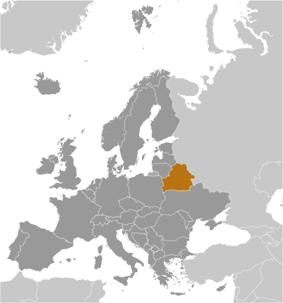

# Belarus

## Introduction

**_Background:_**   
After seven decades as a constituent republic of the USSR, Belarus attained its independence in 1991. It has retained closer political and economic ties to Russia than have any of the other former Soviet republics. Belarus and Russia signed a treaty on a two-state union on 8 December 1999 envisioning greater political and economic integration. Although Belarus agreed to a framework to carry out the accord, serious implementation has yet to take place. Since his election in July 1994 as the country's first directly elected president, Aleksandr LUKASHENKO has steadily consolidated his power through authoritarian means and a centralized economic system. Government restrictions on freedom of speech and the press, peaceful assembly, and religion remain in place.

## Geography

**_Location:_**   
Eastern Europe, east of Poland

**_Geographic coordinates:_**   
53 00 N, 28 00 E

**_Map references:_**   
Europe

**_Area:_**   
**total:** 207,600 sq km   
**land:** 202,900 sq km   
**water:** 4,700 sq km

**_Area - comparative:_**   
slightly smaller than Kansas

**_Land boundaries:_**   
**total:** 3,599 km   
**border countries:** Latvia 161 km, Lithuania 640 km, Poland 375 km, Russia 1,312 km, Ukraine 1,111 km

**_Coastline:_**   
0 km (landlocked)

**_Maritime claims:_**   
none (landlocked)

**_Climate:_**   
cold winters, cool and moist summers; transitional between continental and maritime

**_Terrain:_**   
generally flat and contains much marshland

**_Elevation extremes:_**   
**lowest point:** Nyoman River 90 m   
**highest point:** Dzyarzhynskaya Hara 346 m

**_Natural resources:_**   
timber, peat deposits, small quantities of oil and natural gas, granite, dolomitic limestone, marl, chalk, sand, gravel, clay

**_Land use:_**   
**arable land:** 26.63%   
**permanent crops:** 0.59%   
**other:** 72.78% (2011)

**_Irrigated land:_**   
1,150 sq km (2003)

**_Total renewable water resources:_**   
58 cu km (2011)

**_Freshwater withdrawal (domestic/industrial/agricultural):_**   
**total:** 4.34 cu km/yr (32%/65%/3%)   
**per capita:** 435.4 cu m/yr (2009)

**_Natural hazards:_**   
NA

**_Environment - current issues:_**   
soil pollution from pesticide use; southern part of the country contaminated with fallout from 1986 nuclear reactor accident at Chornobyl' in northern Ukraine

**_Environment - international agreements:_**   
**party to:** Air Pollution, Air Pollution-Nitrogen Oxides, Air Pollution-Sulfur 85, Biodiversity, Climate Change, Climate Change-Kyoto Protocol, Desertification, Endangered Species, Environmental Modification, Hazardous Wastes, Law of the Sea, Marine Dumping, Ozone Layer Protection, Ship Pollution, Wetlands   
**signed, but not ratified:** none of the selected agreements

**_Geography - note:_**   
landlocked; glacial scouring accounts for the flatness of Belarusian terrain and for its 11,000 lakes

## People and Society

**_Nationality:_**   
**noun:** Belarusian(s)   
**adjective:** Belarusian

**_Ethnic groups:_**   
Belarusian 83.7%, Russian 8.3%, Polish 3.1%, Ukrainian 1.7%, other 2.4%, unspecified 0.9% (2009 est.)

**_Languages:_**   
Belarusian (official) 23.4%, Russian (official) 70.2%, other 3.1% (includes small Polish- and Ukrainian-speaking minorities), unspecified 3.3% (2009 est.)

**_Religions:_**   
Eastern Orthodox 80%, other (including Roman Catholic, Protestant, Jewish, and Muslim) 20% (1997 est.)

**_Population:_**   
9,608,058 (July 2014 est.)

**_Age structure:_**   
**0-14 years:** 15.4% (male 759,285/female 717,118)   
**15-24 years:** 11.7% (male 575,907/female 544,170)   
**25-54 years:** 45.5% (male 2,141,419/female 2,227,433)   
**55-64 years:** 13.3% (male 562,639/female 716,216)   
**65 years and over:** 14.2% (male 430,225/female 933,646) (2014 est.)

**_Dependency ratios:_**   
**total dependency ratio:** 41.5 %   
**youth dependency ratio:** 22 %   
**elderly dependency ratio:** 19.6 %   
**potential support ratio:** 5.1 (2014 est.)

**_Median age:_**   
**total:** 39.4 years   
**male:** 36.3 years   
**female:** 42.4 years (2014 est.)

**_Population growth rate:_**   
-0.19% (2014 est.)

**_Birth rate:_**   
10.86 births/1,000 population (2014 est.)

**_Death rate:_**   
13.51 deaths/1,000 population (2014 est.)

**_Net migration rate:_**   
0.78 migrant(s)/1,000 population (2014 est.)

**_Urbanization:_**   
**urban population:** 75% of total population (2011)   
**rate of urbanization:** 0.21% annual rate of change (2010-15 est.)

**_Major urban areas - population:_**   
MINSK (capital) 1.861 million (2011)

**_Sex ratio:_**   
**at birth:** 1.06 male(s)/female   
**0-14 years:** 1.06 male(s)/female   
**15-24 years:** 1.06 male(s)/female   
**25-54 years:** 0.96 male(s)/female   
**55-64 years:** 0.87 male(s)/female   
**65 years and over:** 0.46 male(s)/female   
**total population:** 0.87 male(s)/female (2014 est.)

**_Mother's mean age at first birth:_**   
25.1 (2011 est.)

**_Maternal mortality rate:_**   
4 deaths/100,000 live births (2010)

**_Infant mortality rate:_**   
**total:** 3.64 deaths/1,000 live births   
**male:** 4.07 deaths/1,000 live births   
**female:** 3.19 deaths/1,000 live births (2014 est.)

**_Life expectancy at birth:_**   
**total population:** 72.15 years   
**male:** 66.53 years   
**female:** 78.1 years (2014 est.)

**_Total fertility rate:_**   
1.47 children born/woman (2014 est.)

**_Contraceptive prevalence rate:_**   
72.6% (2005)

**_Health expenditures:_**   
5.3% of GDP (2011)

**_Physicians density:_**   
3.76 physicians/1,000 population (2011)

**_Hospital bed density:_**   
11.1 beds/1,000 population (2011)

**_Drinking water source:_**   
**improved:** urban: 99.8% of population; rural: 99% of population; total: 99.6% of population   
**unimproved:** urban: 0.2% of population; rural: 1% of population; total: 0.4% of population (2012 est.)

**_Sanitation facility access:_**   
**improved:** urban: 94% of population; rural: 95.3% of population; total: 94.3% of population   
**unimproved:** urban: 6% of population; rural: 4.7% of population; total: 5.7% of population (2012 est.)

**_HIV/AIDS - adult prevalence rate:_**   
0.4% (2012 est.)

**_HIV/AIDS - people living with HIV/AIDS:_**   
23,200 (2012 est.)

**_HIV/AIDS - deaths:_**   
1,200 (2012 est.)

**_Obesity - adult prevalence rate:_**   
24.3% (2008)

**_Children under the age of 5 years underweight:_**   
1.3% (2005)

**_Education expenditures:_**   
5.1% of GDP (2012)

**_Literacy:_**   
**definition:** age 15 and over can read and write   
**total population:** 99.6%   
**male:** 99.8%   
**female:** 99.5% (2009 est.)

**_School life expectancy (primary to tertiary education):_**   
**total:** 16 years   
**male:** 15 years   
**female:** 16 years (2012)

**_Child labor - children ages 5-14:_**   
**total number:** 54,218   
**percentage:** 5 % (2005 est.)

**_Unemployment, youth ages 15-24:_**   
**total:** 12.6%   
**male:** 12.4%   
**female:** 12.6% (2009)

## Government

**_Country name:_**   
**conventional long form:** Republic of Belarus   
**conventional short form:** Belarus   
**local long form:** Respublika Byelarus'/Respublika Belarus'   
**local short form:** Byelarus'/Belarus'   
**former:** Belorussian (Byelorussian) Soviet Socialist Republic

**_Government type:_**   
republic in name, although in fact a dictatorship

**_Capital:_**   
**name:** Minsk   
**geographic coordinates:** 53 54 N, 27 34 E   
**time difference:** UTC+2 (7 hours ahead of Washington, DC, during Standard Time)

**_Administrative divisions:_**   
6 provinces (voblastsi, singular - voblasts') and 1 municipality\* (horad); Brest, Homyel' (Gomel), Horad Minsk\* (Minsk City), Hrodna (Grodno), Mahilyow (Mogilev), Minsk, Vitsyebsk (Vitebsk)   
**note:** administrative divisions have the same names as their administrative centers; Russian spelling provided for reference when different from Belarusian

**_Independence:_**   
25 August 1991 (from the Soviet Union)

**_National holiday:_**   
Independence Day, 3 July (1944); note - 3 July 1944 was the date Minsk was liberated from German troops, 25 August 1991 was the date of independence from the Soviet Union

**_Constitution:_**   
several previous; latest drafted between late 1991 and early 1994, signed 15 March 1994; amended 1996, 2004 (2013)

**_Legal system:_**   
civil law system; note - nearly all major codes (civil, civil procedure, criminal, criminal procedure, family and labor) have been revised and came into force in 1999 or 2000

**_International law organization participation:_**   
has not submitted an ICJ jurisdiction declaration; non-party state to the ICCt

**_Suffrage:_**   
18 years of age; universal

**_Executive branch:_**   
**chief of state:** president Aleksandr LUKASHENKO (since 20 July 1994); note - the US does not recognize the results of the 19 December 2010 elections under which the Central Election Commission of Belarus declared LUKASHENKO president   
**head of government:** prime minister Mikhail MYASNIKOVICH (since 28 December 2010); first deputy prime minister Vladimir SEMASHKO (since December 2003)   
**cabinet:** Council of Ministers   
**elections:** president elected by popular vote for a five-year term; first election took place on 23 June and 10 July 1994; according to the 1994 constitution, the next election should have been held in 1999, however, Aleksandr LUKASHENKO extended his term to 2001 via a November 1996 referendum; subsequent election held on 9 September 2001; an October 2004 referendum ended presidential term limits and allowed the president to run in a third (19 March 2006) and fourth election (19 December 2010); prime minister and deputy prime ministers appointed by the president   
**election results:** Aleksandr LUKASHENKO reelected president; percent of vote - Aleksandr LUKASHENKO 79.7%, Andrey SANNIKOV 2.6%, other candidates 17.7%; note - election marred by electoral fraud

**_Legislative branch:_**   
bicameral national assembly or natsionalnoye sobraniye consists of the Council of the Republic or Sovet Respubliki (64 seats; 56 members elected by regional and Minsk city councils and 8 members appointed by the president, to serve four-year terms) and the Chamber of Representatives or Palata Predstaviteley (110 seats; members elected by popular vote to serve four-year terms); note - the US does not recognize the legitimacy of the national assembly   
**elections:** Palata Predstaviteley - last held on 23 September 2012 (next to be held September 2016); OSCE observers determined that the election was neither free nor impartial and that vote counting was problematic in a number of polling stations; pro-LUKASHENKO candidates won every seat with no opposition representation in the chamber; international observers determined that the previous election, on 28 September 2008, despite minor improvements also fell short of democratic standards, with pro-LUKASHENKO candidates winning every seat   
**election results:** Sovet Respubliki - percent of vote by party - NA; seats by party - NA; Palata Predstaviteley - percent of vote by party - NA; seats by party - KPB 3, AP 1, Republican Party of Labor and Justice 1, no affiliation 105

**_Judicial branch:_**   
**highest court(s):** Supreme Court (consists of the chairman, deputy chairman, and NA judges); Constitutional Court (consists of 12 judges including a chairman and deputy chairman)   
**judge selection and term of office:** Supreme Court judges appointed by the president with the consent of the Council of the Republic; judges initially appointed for 5 years and evaluated for life appointment; Constitutional Court judges - 6 appointed by the president and 6 elected by the Chamber of Representatives; term of judges is 11 years with an age limit of 70   
**subordinate courts:** regional, district, city, town, and military courts

**_Political parties and leaders:_**   
**pro-government parties:** Belarusian Agrarian Party or AP [Mikhail SHIMANSKY]; Belarusian Patriotic Movement (Belarusian Patriotic Party) or BPR [Nikolay ULAKHOVICH, chairman]; Communist Party of Belarus or KPB [Igor KARPENKO]; Liberal Democratic Party or LDP [Sergey GAYDUKEVICH]; Republican Party of Labor and Justice [Vasiliy ZADNEPRYANYY]   
**opposition parties:** Belarusian Christian Democracy Party [Pavel SEVERINETS] (unregistered); Belarusian Party of the Left "Fair World" [Sergey KALYAKIN]; Belarusian Popular Front or BPF [Aleksey YANUKEVICH]; Belarusian Social-Democratic Hramada [Stanislav SHUSHKEVICH]; Belarusian Social Democratic Party Hramada ("Assembly") or BSDPH [Irina VESHTARD]; Belarusian Social Democratic Party People's Assembly ("Narodnaya Hramada") [Nikolay STATKEVICH] (unregistered); Christian Conservative Party or BPF [Zyanon PAZNIAK]; European Belarus Campaign [Andrey SANNIKOV]; Party of Freedom and Progress [Vladimir NOVOSYAD] (unregistered); "Tell the Truth" Campaign [Vladimir NEKLYAYEV]; United Civic Party or UCP [Anatoliy LEBEDKO]

**_Political pressure groups and leaders:_**   
Assembly of Pro-Democratic NGOs [Sergey MATSKEVICH] (unregistered)   
Belarusian Congress of Democratic Trade Unions [Aleksandr YAROSHUK]   
Belarusian Association of Journalists [Zhana LITVINA]   
Belarusian Helsinki Committee [Aleh HULAK]   
Belarusian Independence Bloc (unregistered) and For Freedom movement [Aleksandr MILINKEVICH]   
Belarusian Organization of Working Women [Irina ZHIKHAR]   
BPF-Youth [Andrus KRECHKA] (unregistered)   
Charter 97 [Andrey SANNIKOV] (unregistered)   
Perspektiva small business association [Anatol SHUMCHENKO]   
Nasha Vyasna ("Our Spring") human rights center [Ales BYALYATSKI] (unregistered)   
"Tell the Truth" Movement [Vladimir NEKLYAYEV] (unregistered)   
Women's Independent Democratic Movement [Ludmila PETINA]   
Young Belarus (Malady Belarus) [Zmitser KASPYAROVICH] (unregistered)   
Youth Front (Malady Front) [Zmitser DASHKEVICH] (unregistered)

**_International organization participation:_**   
BSEC (observer), CBSS (observer), CEI, CIS, CSTO, EAEC, EAPC, EBRD, FAO, GCTU, IAEA, IBRD, ICAO, ICC (NGOs), ICRM, IDA, IFC, IFRCS, ILO, IMF, IMSO, Interpol, IOC, IOM, IPU, ISO, ITU, ITUC (NGOs), MIGA, NAM, NSG, OPCW, OSCE, PCA, PFP, SCO (dialogue member), UN, UNCTAD, UNESCO, UNIDO, UNIFIL, UNWTO, UPU, WCO, WFTU (NGOs), WHO, WIPO, WMO, WTO (observer), ZC

**_Diplomatic representation in the US:_**   
**chief of mission:** Ambassador (vacant); Charge d'Affaires Oleg KRAVCHENKO   
**chancery:** 1619 New Hampshire Avenue NW, Washington, DC 20009   
**telephone:** [1] (202) 986-1604   
**FAX:** [1] (202) 986-1805   
**consulate(s) general:** New York

**_Diplomatic representation from the US:_**   
**chief of mission:** Ambassador (vacant); Charge d'Affaires Ethan GOLDRICH (since July 2012)   
**embassy:** 46 Starovilenskaya Street, Minsk 220002   
**mailing address:** PSC 78, Box B Minsk, APO 09723   
**telephone:** [375] (17) 210-12-83   
**FAX:** [375] (17) 234-7853

**_Flag description:_**   
red horizontal band (top) and green horizontal band one-half the width of the red band; a white vertical stripe on the hoist side bears Belarusian national ornamentation in red; the red band color recalls past struggles from oppression, the green band represents hope and the many forests of the country

**_National symbol(s):_**   
mounted knight known as Pahonia (the Chaser)

**_National anthem:_**   
**name:** "My, Bielarusy" (We Belarusians)   
**lyrics/music:** Mikhas KLIMKOVICH and Uladzimir KARYZNA/Nester SAKALOUSKI   
**note:** music adopted 1955, lyrics adopted 2002; after the fall of the Soviet Union, Belarus kept the music of its Soviet-era anthem but adopted new lyrics; also known as "Dziarzauny himn Respubliki Bielarus" (State Anthem of the Republic of Belarus)

## Economy

**_Economy - overview:_**   
As part of the former Soviet Union, Belarus had a relatively well-developed industrial base; it retained this industrial base - which is now outdated, energy inefficient, and dependent on subsidized Russian energy and preferential access to Russian markets - following the breakup of the USSR. The country also has a broad agricultural base which is inefficient and dependent on government subsidies. After an initial burst of capitalist reform from 1991-94, including privatization of state enterprises, creation of institutions of private property, and development of entrepreneurship, Belarus' economic development greatly slowed. About 80% of all industry remains in state hands, and foreign investment has been hindered by a climate hostile to business. A few banks, which had been privatized after independence, were renationalized. State banks account for 75% of the banking sector. Economic output, which had declined for several years following the collapse of the Soviet Union, revived in the mid-2000s thanks to the boom in oil prices. Belarus has only small reserves of crude oil, though it imports most of its crude oil and natural gas from Russia at prices substantially below the world market. Belarus exported refined oil products at market prices produced from Russian crude oil purchased at a steep discount. In late 2006, Russia began a process of rolling back its subsidies on oil and gas to Belarus. Tensions over Russian energy reached a peak in 2010, when Russia stopped the export of all subsidized oil to Belarus save for domestic needs. In December 2010, Russia and Belarus reached a deal to restart the export of discounted oil to Belarus. Little new foreign investment has occurred in recent years. In 2011, a financial crisis began, triggered by government directed salary hikes unsupported by commensurate productivity increases. The crisis was compounded by an increased cost in Russian energy inputs and an overvalued Belarusian ruble, and eventually led to a near three-fold devaluation of the Belarusian ruble in 2011. In November 2011, Belarus agreed to sell to Russia its remaining shares in Beltransgaz, the Belarusian natural gas pipeline operator, in exchange for reduced prices for Russian natural gas. Receiving more than half of a $3 billion loan from the Russian-dominated Eurasian Economic Community (EurAsEC) Bail-out Fund, a $1 billion loan from the Russian state-owned bank Sberbank, and the $2.5 billion sale of Beltranzgas to Russian state-owned Gazprom helped stabilize the situation in 2012; nevertheless, the Belarusian currency lost more than 60% of its value, as the rate of inflation reached new highs in 2011 and 2012, before calming in 2013. As of January 2014, the final tranche of the EurAsEC loan has been delayed, but in December 2013 Russia announced a new loan for Belarus of up to $2 billion for 2014. Notwithstanding foreign assistance, the Belarusian economy continues to struggle under the weight of high external debt servicing payments, a growing trade deficit, stagnant economic growth, and low foreign reserves.

**_GDP (purchasing power parity):_**   
$150.4 billion (2013 est.)   
$147.3 billion (2012 est.)   
$145 billion (2011 est.)   
**note:** data are in 2013 US dollars

**_GDP (official exchange rate):_**   
$69.24 billion (2013 est.)

**_GDP - real growth rate:_**   
2.1% (2013 est.)   
1.5% (2012 est.)   
5.5% (2011 est.)

**_GDP - per capita (PPP):_**   
$16,100 (2013 est.)   
$15,700 (2012 est.)   
$15,400 (2011 est.)   
**note:** data are in 2013 US dollars

**_Gross national saving:_**   
24.8% of GDP (2013 est.)   
31.8% of GDP (2012 est.)   
29.2% of GDP (2011 est.)

**_GDP - composition, by end use:_**   
**household consumption:** 46.3%   
**government consumption:** 15.3%   
**investment in fixed capital:** 30%   
**investment in inventories:** 0.7%   
**exports of goods and services:** 80.2%   
**imports of goods and services:** -72.5%; (2013 est.)

**_GDP - composition, by sector of origin:_**   
**agriculture:** 9.2%   
**industry:** 46.2%   
**services:** 44.7% (2013 est.)

**_Agriculture - products:_**   
grain, potatoes, vegetables, sugar beets, flax; beef, milk

**_Industries:_**   
metal-cutting machine tools, tractors, trucks, earthmovers, motorcycles, televisions, synthetic fibers, fertilizer, textiles, radios, refrigerators

**_Industrial production growth rate:_**   
1% (2013 est.)

**_Labor force:_**   
5 million (2009)

**_Labor force - by occupation:_**   
**agriculture:** 9.4%   
**industry:** 45.9%   
**services:** 44.7% (2005 est.)

**_Unemployment rate:_**   
1% (2009 est.)   
1.6% (2005)   
**note:** official registered unemployed; large number of underemployed workers

**_Population below poverty line:_**   
27.1% (2003 est.)

**_Household income or consumption by percentage share:_**   
**lowest 10%:** 3.8%   
**highest 10%:** 21.9% (2008)

**_Distribution of family income - Gini index:_**   
27.2 (2008)   
21.7 (1998)

**_Budget:_**   
**revenues:** $26.68 billion   
**expenditures:** $26.79 billion (2013 est.)

**_Taxes and other revenues:_**   
38.5% of GDP (2013 est.)

**_Budget surplus (+) or deficit (-):_**   
-0.2% of GDP (2013 est.)

**_Public debt:_**   
31.5% of GDP (2013 est.)   
31.5% of GDP (2012 est.)

**_Fiscal year:_**   
calendar year

**_Inflation rate (consumer prices):_**   
19% (2013 est.)   
59.1% (2012 est.)

**_Central bank discount rate:_**   
10.5% (31 December 2010 est.)   
13.5% (31 December 2009 est.)

**_Commercial bank prime lending rate:_**   
10% (31 December 2013 est.)   
19.49% (31 December 2012 est.)

**_Stock of narrow money:_**   
NA% (31 December 2013 est.)   
$4.018 billion (31 December 2012 est.)

**_Stock of broad money:_**   
$9.073 billion (31 December 2013 est.)   
$7.655 billion (31 December 2012 est.)

**_Stock of domestic credit:_**   
$22.68 billion (31 December 2013 est.)   
$19.82 billion (31 December 2012 est.)

**_Market value of publicly traded shares:_**   
$NA

**_Current account balance:_**   
-$4.245 billion (2013 est.)   
-$1.688 billion (2012 est.)

**_Exports:_**   
$42.06 billion (2013 est.)   
$45.57 billion (2012 est.)

**_Exports - commodities:_**   
machinery and equipment, mineral products, chemicals, metals, textiles, foodstuffs

**_Exports - partners:_**   
Russia 35.4%, Netherlands 16.4%, Ukraine 12.1%, Latvia 7.1% (2012)

**_Imports:_**   
$45.17 billion (2013 est.)   
$45.01 billion (2012 est.)

**_Imports - commodities:_**   
mineral products, machinery and equipment, chemicals, foodstuffs, metals

**_Imports - partners:_**   
Russia 59.4%, Germany 5.9%, China 5.1%, Ukraine 5% (2012)

**_Reserves of foreign exchange and gold:_**   
$4.513 billion (31 December 2013 est.)   
$5.809 billion (31 December 2012 est.)

**_Debt - external:_**   
$1.204 billion (31 December 2013 est.)   
$1.225 billion (31 December 2012 est.)

**_Exchange rates:_**   
Belarusian rubles (BYB/BYR) per US dollar -   
8,950.7 (2013 est.)   
8,336.9 (2012 est.)   
2,978.5 (2010 est.)   
2,789.49 (2009)   
2,130 (2008)

## Energy

**_Electricity - production:_**   
32.82 billion kWh (2010 est.)

**_Electricity - consumption:_**   
31.74 billion kWh (2010 est.)

**_Electricity - exports:_**   
5.067 billion kWh (2010 est.)

**_Electricity - imports:_**   
7.767 billion kWh (2010 est.)

**_Electricity - installed generating capacity:_**   
8.032 million kW (2010 est.)

**_Electricity - from fossil fuels:_**   
99.7% of total installed capacity (2010 est.)

**_Electricity - from nuclear fuels:_**   
0% of total installed capacity (2010 est.)

**_Electricity - from hydroelectric plants:_**   
0.2% of total installed capacity (2010 est.)

**_Electricity - from other renewable sources:_**   
0.1% of total installed capacity (2010 est.)

**_Crude oil - production:_**   
32,070 bbl/day (2012 est.)

**_Crude oil - exports:_**   
0 bbl/day (2010 est.)

**_Crude oil - imports:_**   
294,800 bbl/day (2010 est.)

**_Crude oil - proved reserves:_**   
198 million bbl (1 January 2013 est.)

**_Refined petroleum products - production:_**   
346,000 bbl/day (2010 est.)

**_Refined petroleum products - consumption:_**   
188,800 bbl/day (2011 est.)

**_Refined petroleum products - exports:_**   
224,200 bbl/day (2010 est.)

**_Refined petroleum products - imports:_**   
43,240 bbl/day (2010 est.)

**_Natural gas - production:_**   
220 million cu m (2011 est.)

**_Natural gas - consumption:_**   
21.82 billion cu m (2010 est.)

**_Natural gas - exports:_**   
0 cu m (2011 est.)

**_Natural gas - imports:_**   
21.02 billion cu m (2011 est.)

**_Natural gas - proved reserves:_**   
2.832 billion cu m (1 January 2013 est.)

**_Carbon dioxide emissions from consumption of energy:_**   
67.16 million Mt (2011 est.)

## Communications

**_Telephones - main lines in use:_**   
4.407 million (2012)

**_Telephones - mobile cellular:_**   
10.675 million (2012)

**_Telephone system:_**   
**general assessment:** Belarus lags behind its neighbors in upgrading telecommunications infrastructure; modernization of the network progressing with roughly two-thirds of switching equipment now digital   
**domestic:** state-owned Beltelcom is the sole provider of fixed-line local and long distance service; fixed-line teledensity is improving although rural areas continue to be underserved; multiple GSM mobile-cellular networks are experiencing rapid growth; mobile-cellular teledensity now exceeds 100 telephones per 100 persons   
**international:** country code - 375; Belarus is a member of the Trans-European Line (TEL), Trans-Asia-Europe (TAE) fiber-optic line, and has access to the Trans-Siberia Line (TSL); 3 fiber-optic segments provide connectivity to Latvia, Poland, Russia, and Ukraine; worldwide service is available to Belarus through this infrastructure; additional analog lines to Russia; Intelsat, Eutelsat, and Intersputnik earth stations (2008)

**_Broadcast media:_**   
4 state-controlled national TV channels; Polish and Russian TV broadcasts are available in some areas; state-run Belarusian Radio operates 3 national networks and an external service; Russian and Polish radio broadcasts are available (2007)

**_Internet country code:_**   
.by

**_Internet hosts:_**   
295,217 (2012)

**_Internet users:_**   
2.643 million (2009)

## Transportation

**_Airports:_**   
65 (2013)

**_Airports - with paved runways:_**   
**total:** 33   
**over 3,047 m:** 1   
**2,438 to 3,047 m:** 20   
**1,524 to 2,437 m:** 4   
**914 to 1,523 m:** 1   
**under 914 m:** 7 (2013)

**_Airports - with unpaved runways:_**   
**total:** 32   
**over 3,047 m:** 1   
**1,524 to 2,437 m:** 1   
**914 to 1,523 m:** 2   
**under 914 m:** 28 (2013)

**_Heliports:_**   
1 (2013)

**_Pipelines:_**   
gas 5,386 km; oil 1,589 km; refined products 1,730 km (2013)

**_Railways:_**   
**total:** 5,537 km   
**broad gauge:** 5,512 km 1.520-m gauge (874 km electrified)   
**standard gauge:** 25 km 1.435-m gauge (2008)

**_Roadways:_**   
**total:** 86,392 km   
**paved:** 74,651 km   
**unpaved:** 11,741 km (2010)

**_Waterways:_**   
2,500 km (major rivers are the west-flowing Western Dvina and Neman rivers and the south-flowing Dnepr River and its tributaries, the Berezina, Sozh, and Pripyat rivers) (2011)

**_Ports and terminals:_**   
**river port(s):** Mazyr (Prypyats')

## Military

**_Military branches:_**   
Belarus Armed Forces: Land Force, Air and Air Defense Force, Special Operations Force (2013)

**_Military service age and obligation:_**   
18-27 years of age for compulsory military service; conscript service obligation is 12-18 months, depending on academic qualifications; 17 year olds are eligible to become cadets at military higher education institutes, where they are classified as military personnel (2012)

**_Manpower available for military service:_**   
**males age 16-49:** 2,401,785   
**females age 16-49:** 2,429,653 (2010 est.)

**_Manpower fit for military service:_**   
**males age 16-49:** 1,693,626   
**females age 16-49:** 2,012,401 (2010 est.)

**_Manpower reaching militarily significant age annually:_**   
**male:** 51,855   
**female:** 48,760 (2010 est.)

**_Military expenditures:_**   
1.2% of GDP (2012)   
1.27% of GDP (2011)   
1.2% of GDP (2010)

## Transnational Issues

**_Disputes - international:_**   
boundary demarcated with Latvia and Lithuania; as a member state that forms part of the EU's external border, Poland has implemented strict Schengen border rules to restrict illegal immigration and trade along its border with Belarus

**_Refugees and internally displaced persons:_**   
**stateless persons:** 6,969 (2012)

**_Trafficking in persons:_**   
**current situation:** Belarus is a source, transit, and destination country for women, men, and children subjected to sex trafficking and forced labor; women and children are trafficked to European and Middle Eastern countries and within Belarus for sexual exploitation; Belarusian men, women, and children are found in forced labor in the construction industry and other sectors in Russia and Belarus; Belarusian men seeking work abroad are increasingly subjected to forced labor   
**tier rating:** Tier 2 Watch List - Belarus does not fully comply with the minimum standards for the elimination of trafficking; however, it is making significant efforts to do so; the government demonstrates decreased law enforcement efforts, conducting fewer trafficking investigations and convicting only one trafficking offender; while two new anti-trafficking laws were passed, they have not been fully implemented and government services to victims remain very limited; the government continues its efforts to prevent trafficking through public awareness campaigns and NGO-operated anti-trafficking hotlines (2013)

**_Illicit drugs:_**   
limited cultivation of opium poppy and cannabis, mostly for the domestic market; transshipment point for illicit drugs to and via Russia, and to the Baltics and Western Europe; a small and lightly regulated financial center; anti-money-laundering legislation does not meet international standards and was weakened further when know-your-customer requirements were curtailed in 2008; few investigations or prosecutions of money-laundering activities (2008)

............................................................   
_Page last updated on June 23, 2014_
