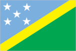
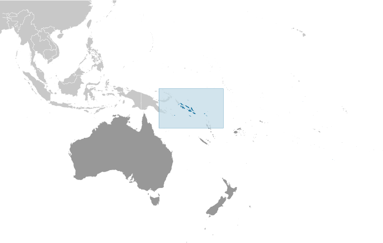
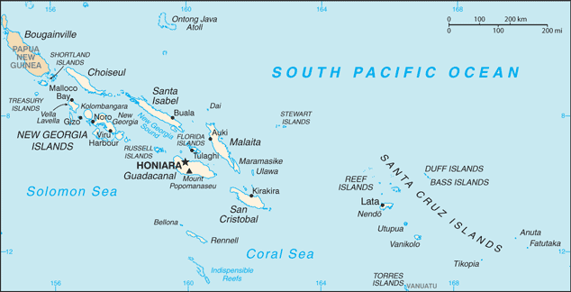

# Solomon Islands

## Introduction

**_Background:_**   
The UK established a protectorate over the Solomon Islands in the 1890s. Some of the most bitter fighting of World War II occurred on this archipelago. Self-government was achieved in 1976 and independence two years later. Ethnic violence, government malfeasance, and endemic crime have undermined stability and civil society. In June 2003, then Prime Minister Sir Allan KEMAKEZA sought the assistance of Australia in reestablishing law and order; the following month, an Australian-led multinational force arrived to restore peace and disarm ethnic militias. The Regional Assistance Mission to the Solomon Islands (RAMSI) has generally been effective in restoring law and order and rebuilding government institutions.

## Geography

**_Location:_**   
Oceania, group of islands in the South Pacific Ocean, east of Papua New Guinea

**_Geographic coordinates:_**   
8 00 S, 159 00 E

**_Map references:_**   
Oceania

**_Area:_**   
**total:** 28,896 sq km   
**land:** 27,986 sq km   
**water:** 910 sq km

**_Area - comparative:_**   
slightly smaller than Maryland

**_Land boundaries:_**   
0 km

**_Coastline:_**   
5,313 km

**_Maritime claims:_**   
measured from claimed archipelagic baselines   
**territorial sea:** 12 nm   
**exclusive economic zone:** 200 nm   
**continental shelf:** 200 nm

**_Climate:_**   
tropical monsoon; few extremes of temperature and weather

**_Terrain:_**   
mostly rugged mountains with some low coral atolls

**_Elevation extremes:_**   
**lowest point:** Pacific Ocean 0 m   
**highest point:** Mount Popomanaseu 2,310 m

**_Natural resources:_**   
fish, forests, gold, bauxite, phosphates, lead, zinc, nickel

**_Land use:_**   
**arable land:** 0.62%   
**permanent crops:** 2.25%   
**other:** 97.13% (2011)

**_Irrigated land:_**   
NA

**_Total renewable water resources:_**   
44.7 cu km (2011)

**_Natural hazards:_**   
typhoons, but rarely destructive; geologically active region with frequent earthquakes, tremors, and volcanic activity; tsunamis   
**volcanism:** Tinakula (elev. 851 m) has frequent eruption activity, while an eruption of Savo (elev. 485 m) could affect the capital Honiara on nearby Guadalcanal

**_Environment - current issues:_**   
deforestation; soil erosion; many of the surrounding coral reefs are dead or dying

**_Environment - international agreements:_**   
**party to:** Biodiversity, Climate Change, Climate Change-Kyoto Protocol, Desertification, Environmental Modification, Law of the Sea, Marine Dumping, Marine Life Conservation, Ozone Layer Protection, Whaling   
**signed, but not ratified:** none of the selected agreements

**_Geography - note:_**   
strategic location on sea routes between the South Pacific Ocean, the Solomon Sea, and the Coral Sea; on 2 April 2007 an undersea earthquake measuring 8.1 on the Richter scale occurred 345 km WNW of the capital Honiara; the resulting tsunami devastated coastal areas of Western and Choiseul provinces with dozens of deaths and thousands dislocated; the provincial capital of Gizo was especially hard hit

## People and Society

**_Nationality:_**   
**noun:** Solomon Islander(s)   
**adjective:** Solomon Islander

**_Ethnic groups:_**   
Melanesian 95.3%, Polynesian 3.1%, Micronesian 1.2%, other 0.3% (2009 est.)

**_Languages:_**   
Melanesian pidgin (in much of the country is lingua franca), English (official but spoken by only 1%-2% of the population), 120 indigenous languages

**_Religions:_**   
Protestant 73.4% (Church of Melanesia 31.9%, South Sea Evangelical 17.1%, Seventh Day Adventist 11.7%, United Church 10.1%, Christian Fellowship Church 2.5%), Roman Catholic 19.6%, other Christian 2.9%, other 4%, none 0.03%, unspecified 0.1% (2009 est.)

**_Population:_**   
609,883 (July 2014 est.)

**_Age structure:_**   
**0-14 years:** 36.2% (male 113,744/female 107,193)   
**15-24 years:** 20% (male 62,656/female 59,280)   
**25-54 years:** 35.4% (male 109,891/female 105,760)   
**55-64 years:** 4.4% (male 13,197/female 13,359)   
**65 years and over:** 4.1% (male 11,952/female 12,851) (2014 est.)

**_Dependency ratios:_**   
**total dependency ratio:** 76.3 %   
**youth dependency ratio:** 70.3 %   
**elderly dependency ratio:** 6 %   
**potential support ratio:** 16.8 (2014 est.)

**_Median age:_**   
**total:** 21.6 years   
**male:** 21.4 years   
**female:** 21.8 years (2014 est.)

**_Population growth rate:_**   
2.07% (2014 est.)

**_Birth rate:_**   
26.33 births/1,000 population (2014 est.)

**_Death rate:_**   
3.86 deaths/1,000 population (2014 est.)

**_Net migration rate:_**   
-1.78 migrant(s)/1,000 population (2014 est.)

**_Urbanization:_**   
**urban population:** 20.5% of total population (2011)   
**rate of urbanization:** 4.65% annual rate of change (2010-15 est.)

**_Major urban areas - population:_**   
HONIARA (capital) 68,000 (2011)

**_Sex ratio:_**   
**at birth:** 1.05 male(s)/female   
**0-14 years:** 1.06 male(s)/female   
**15-24 years:** 1.06 male(s)/female   
**25-54 years:** 1.04 male(s)/female   
**55-64 years:** 1.04 male(s)/female   
**65 years and over:** 0.95 male(s)/female   
**total population:** 1.04 male(s)/female (2014 est.)

**_Mother's mean age at first birth:_**   
21.6   
**note:** median age at first birth among women 25-29 (2006-07 est.)

**_Maternal mortality rate:_**   
93 deaths/100,000 live births (2010)

**_Infant mortality rate:_**   
**total:** 16.17 deaths/1,000 live births   
**male:** 18.43 deaths/1,000 live births   
**female:** 13.8 deaths/1,000 live births (2014 est.)

**_Life expectancy at birth:_**   
**total population:** 74.89 years   
**male:** 72.27 years   
**female:** 77.64 years (2014 est.)

**_Total fertility rate:_**   
3.36 children born/woman (2014 est.)

**_Contraceptive prevalence rate:_**   
34.6% (2006/07)

**_Health expenditures:_**   
8.8% of GDP (2011)

**_Physicians density:_**   
0.22 physicians/1,000 population (2009)

**_Hospital bed density:_**   
1.4 beds/1,000 population (2005)

**_Drinking water source:_**   
**improved:** urban: 93.2% of population; rural: 77.2% of population; total: 80.5% of population   
**unimproved:** urban: 6.8% of population; rural: 22.8% of population; total: 19.5% of population (2012 est.)

**_Sanitation facility access:_**   
**improved:** urban: 81.4% of population; rural: 15% of population; total: 28.8% of population   
**unimproved:** urban: 18.6% of population; rural: 85% of population; total: 71.2% of population (2012 est.)

**_HIV/AIDS - adult prevalence rate:_**   
NA

**_HIV/AIDS - people living with HIV/AIDS:_**   
NA

**_HIV/AIDS - deaths:_**   
NA

**_Obesity - adult prevalence rate:_**   
30% (2008)

**_Children under the age of 5 years underweight:_**   
11.5% (2007)

**_Education expenditures:_**   
7.3% of GDP (2010)

**_Literacy:_**   
**definition:** age 15 and over can read and write   
**total population:** 84.1%   
**male:** 88.9%   
**female:** 79.2%

**_School life expectancy (primary to tertiary education):_**   
**total:** 9 years   
**male:** 10 years   
**female:** 9 years (2007)

## Government

**_Country name:_**   
**conventional long form:** none   
**conventional short form:** Solomon Islands   
**local long form:** none   
**local short form:** Solomon Islands   
**former:** British Solomon Islands

**_Government type:_**   
parliamentary democracy and a Commonwealth realm

**_Capital:_**   
**name:** Honiara   
**geographic coordinates:** 9 26 S, 159 57 E   
**time difference:** UTC+11 (16 hours ahead of Washington, DC, during Standard Time)

**_Administrative divisions:_**   
9 provinces and 1 city\*; Central, Choiseul, Guadalcanal, Honiara\*, Isabel, Makira and Ulawa, Malaita, Rennell and Bellona, Temotu, Western

**_Independence:_**   
7 July 1978 (from the UK)

**_National holiday:_**   
Independence Day, 7 July (1978)

**_Constitution:_**   
adopted 31 May 1978, effective 7 July 1978; amended several times, last in 2010 (2012)

**_Legal system:_**   
mixed legal system of English common law and customary law

**_International law organization participation:_**   
has not submitted an ICJ jurisdiction declaration; non-party state to the ICCt

**_Suffrage:_**   
21 years of age; universal

**_Executive branch:_**   
**chief of state:** Queen ELIZABETH II (since 6 February 1952); represented by Governor General Frank KABUI (since 7 July 2009)   
**head of government:** Prime Minister Gordon Darcy LILO (since 16 November 2011)   
**cabinet:** Cabinet consists of 20 members appointed by the governor general on the advice of the prime minister from among the members of parliament   
**elections:** the monarchy is hereditary; governor general appointed by the monarch on the advice of parliament for up to five years (eligible for a second term); following legislative elections, the leader of the majority party or the leader of a majority coalition usually elected prime minister by parliament; deputy prime minister appointed by the governor general on the advice of the prime minister from among the members of parliament; Gordon Darcy LILO elected on 16 November 2011

**_Legislative branch:_**   
unicameral National Parliament (50 seats; members elected from single-member constituencies by popular vote to serve four-year terms)   
**elections:** last held on 4 August 2010 (next to be held in 2014)   
**election results:** percent of vote by party - NA; seats by party - SIDP 14, OUR 4, SIPRA 3, RDP 3, IDP 2, DDP 2, PCP 1, PFP 1, RUPP 1, SILP 1, SINP 1, independents 17

**_Judicial branch:_**   
**highest court(s):** Court of Appeal (consists of the court president, and ex officio members to include the High Court chief justice and its puisne judges); High Court (consists of the chief justice and puisne judges as prescribed by the National Parliament)   
**judge selection and term of office:** Court of Appeal and High Court president, chief justices, and puisne judges appointed by the governor-general upon recommendation of the Judicial and Legal Service Commission, chaired by the chief justice to include 5 members, mostly judicial officials and legal professionals; all judges appointed until retirement at age 60   
**subordinate courts:** Magistrates' Courts; local courts; Customary Land Appeal Court

**_Political parties and leaders:_**   
Direct Development Party or DDP [Dick HA'AMORI]   
Independent Democratic Party or IDP [Snyder RINI]   
People's Alliance Party or PAP [James MEKAB]   
People's Congress Party or PCP [Fred FONO]   
People's Federation Party or PFP [Rudolf DORA]   
Ownership, Unity, and Responsibility Party or OUR [Manasseh SOGAVARE]   
Reform Democratic Party or RDP [Danny PHILIP]   
Rural and Urban Political Party or RUPP [Samuel MANETOALI]   
Solomon Islands Democratic Party or SIDP [Steve ABANA]   
Solomon Islands Liberal Party or SILP [Derek SIKUA]   
Solomon Islands National Party or SINP [Francis HILLY]   
Solomon Islands Party for Rural Advancement or SIPRA [Job D. TAUSINGA]   
United Party [Sir Peter KENILOREA]   
**note:** in general, Solomon Islands politics is characterized by fluid coalitions

**_Political pressure groups and leaders:_**   
Isatabu Freedom Movement (IFM)   
Malaita Eagle Force (MEF)   
**note:** these rival armed ethnic factions crippled the Solomon Islands in a wave of violence from 1999 to 2003

**_International organization participation:_**   
ACP, ADB, AOSIS, C, EITI (candidate country), ESCAP, FAO, G-77, IBRD, ICAO, ICRM, IDA, IFAD, IFC, IFRCS, ILO, IMF, IMO, IOC, ITU, MIGA, OPCW, PIF, Sparteca, SPC, UN, UNCTAD, UNESCO, UPU, WFTU, WHO, WMO, WTO

**_Diplomatic representation in the US:_**   
**chief of mission:** Ambassador Collin David BECK (since 31 March 2004)   
**chancery:** 800 Second Avenue, Suite 400L, New York, NY 10017   
**telephone:** [1] (212) 599-6192, 6193   
**FAX:** [1] (212) 661-8925

**_Diplomatic representation from the US:_**   
the US does not have an embassy in the Solomon Islands; the US ambassador to Papua New Guinea, currently Ambassador Walter E. North, is accredited to the Solomon Islands

**_Flag description:_**   
divided diagonally by a thin yellow stripe from the lower hoist-side corner; the upper triangle (hoist side) is blue with five white five-pointed stars arranged in an X pattern; the lower triangle is green; blue represents the ocean; green the land; and yellow sunshine; the five stars stand for the five main island groups of the Solomon Islands

**_National anthem:_**   
**name:** "God Save Our Solomon Islands"   
**lyrics/music:** Panapasa BALEKANA and Matila BALEKANA/Panapasa BALEKANA   
**note:** adopted 1978

## Economy

**_Economy - overview:_**   
The bulk of the population depends on agriculture, fishing, and forestry for at least part of its livelihood. Most manufactured goods and petroleum products must be imported. The islands are rich in undeveloped mineral resources such as lead, zinc, nickel, and gold. Prior to the arrival of The Regional Assistance Mission to the Solomon Islands (RAMSI), severe ethnic violence, the closing of key businesses, and an empty government treasury culminated in economic collapse. RAMSI's efforts to restore law and order and economic stability have led to modest growth as the economy rebuilds.

**_GDP (purchasing power parity):_**   
$1.958 billion (2013 est.)   
$1.883 billion (2012 est.)   
$1.798 billion (2011 est.)   
**note:** data are in 2013 US dollars

**_GDP (official exchange rate):_**   
$1.099 billion (2013 est.)

**_GDP - real growth rate:_**   
4% (2013 est.)   
4.8% (2012 est.)   
10.7% (2011 est.)

**_GDP - per capita (PPP):_**   
$3,400 (2013 est.)   
$3,300 (2012 est.)   
$3,300 (2011 est.)   
**note:** data are in 2013 US dollars

**_GDP - composition, by sector of origin:_**   
**agriculture:** 50%   
**industry:** 10.6%   
**services:** 39.4% (2013 est.)

**_Agriculture - products:_**   
cocoa, coconuts, palm kernels, rice, fruit; cattle, pigs; fish; timber

**_Industries:_**   
fish (tuna), mining, timber

**_Industrial production growth rate:_**   
14% (2013 est.)

**_Labor force:_**   
202,500 (2007)

**_Labor force - by occupation:_**   
**agriculture:** 75%   
**industry:** 5%   
**services:** 20% (2000 est.)

**_Unemployment rate:_**   
NA%

**_Population below poverty line:_**   
NA%

**_Household income or consumption by percentage share:_**   
**lowest 10%:** NA%   
**highest 10%:** NA%

**_Budget:_**   
**revenues:** $437.3 million   
**expenditures:** $409.9 million (2013 est.)

**_Taxes and other revenues:_**   
39.8% of GDP (2013 est.)

**_Budget surplus (+) or deficit (-):_**   
2.5% of GDP (2013 est.)

**_Fiscal year:_**   
calendar year

**_Inflation rate (consumer prices):_**   
2.6% (2012 est.)   
2.6% (2012 est.)

**_Commercial bank prime lending rate:_**   
11.2% (31 December 2013 est.)   
11.28% (31 December 2012 est.)

**_Stock of narrow money:_**   
$335.3 million (31 December 2013 est.)   
$326.3 million (31 December 2012 est.)

**_Stock of broad money:_**   
$417.9 million (31 December 2013 est.)   
$417.4 million (31 December 2012 est.)

**_Stock of domestic credit:_**   
$41.38 million (31 December 2013 est.)   
$37.73 million (31 December 2012 est.)

**_Current account balance:_**   
-$1.2 million (2012 est.)   
-$60.6 million (2011 est.)

**_Exports:_**   
$493.1 million   
$415.2 million (2011 est.)

**_Exports - commodities:_**   
timber, fish, copra, palm oil, cocoa

**_Exports - partners:_**   
China 50.8%, Australia 17.5% (2012)

**_Imports:_**   
$446 million (2012 est.)   
$446 million (2012 est.)

**_Imports - commodities:_**   
food, plant and equipment, manufactured goods, fuels, chemicals

**_Imports - partners:_**   
Singapore 27.2%, Australia 25.7%, China 7.1%, NZ 4.9%, Malaysia 4.8% (2012)

**_Debt - external:_**   
$255.5 million (31 December 2011 est.)   
$166 million (2004)

**_Exchange rates:_**   
Solomon Islands dollars (SBD) per US dollar -   
7.318 (2013 est.)   
7.3552 (2012 est.)   
8.0645 (2010 est.)

## Energy

**_Electricity - production:_**   
82 million kWh (2010 est.)

**_Electricity - consumption:_**   
76.26 million kWh (2010 est.)

**_Electricity - exports:_**   
0 kWh (2012 est.)

**_Electricity - imports:_**   
0 kWh (2012 est.)

**_Electricity - installed generating capacity:_**   
36,000 kW (2010 est.)

**_Electricity - from fossil fuels:_**   
100% of total installed capacity (2010 est.)

**_Electricity - from nuclear fuels:_**   
0% of total installed capacity (2010 est.)

**_Electricity - from hydroelectric plants:_**   
0% of total installed capacity (2010 est.)

**_Electricity - from other renewable sources:_**   
0% of total installed capacity (2010 est.)

**_Crude oil - production:_**   
0 bbl/day (2012 est.)

**_Crude oil - exports:_**   
0 bbl/day (2010 est.)

**_Crude oil - imports:_**   
0 bbl/day (2010 est.)

**_Crude oil - proved reserves:_**   
0 bbl (1 January 2013 est.)

**_Refined petroleum products - production:_**   
0 bbl/day (2010 est.)

**_Refined petroleum products - consumption:_**   
1,728 bbl/day (2011 est.)

**_Refined petroleum products - exports:_**   
0 bbl/day (2010 est.)

**_Refined petroleum products - imports:_**   
1,463 bbl/day (2010 est.)

**_Natural gas - production:_**   
0 cu m (2011 est.)

**_Natural gas - consumption:_**   
0 cu m (2010 est.)

**_Natural gas - exports:_**   
0 cu m (2011 est.)

**_Natural gas - imports:_**   
0 cu m (2011 est.)

**_Natural gas - proved reserves:_**   
0 cu m (1 January 2013 est.)

**_Carbon dioxide emissions from consumption of energy:_**   
203,200 Mt (2011 est.)

## Communications

**_Telephones - main lines in use:_**   
8,060 (2012)

**_Telephones - mobile cellular:_**   
302,100 (2012)

**_Telephone system:_**   
**domestic:** mobile-cellular telephone density is about 50 per 100 persons   
**international:** country code - 677; satellite earth station - 1 Intelsat (Pacific Ocean) (2011)

**_Broadcast media:_**   
Solomon Islands Broadcasting Corporation (SIBC) is the sole TV broadcaster with 1 station; multi-channel pay-TV is available; SIBC operates 2 national radio stations and 2 provincial stations; 2 local commercial radio stations; Radio Australia is available via satellite feed (2009)

**_Internet country code:_**   
.sb

**_Internet hosts:_**   
4,370 (2012)

**_Internet users:_**   
10,000 (2009)

## Transportation

**_Airports:_**   
36 (2013)

**_Airports - with paved runways:_**   
**total:** 1   
**1,524 to 2,437 m:** 1 (2013)

**_Airports - with unpaved runways:_**   
**total:** 35   
**1,524 to 2,437 m:** 1   
**914 to 1,523 m:** 10   
**under 914 m:** 24 (2013)

**_Heliports:_**   
3 (2013)

**_Roadways:_**   
**total:** 1,390 km   
**paved:** 34 km   
**unpaved:** 1,356 km   
**note:** includes 920 km of private plantation roads (2011)

**_Ports and terminals:_**   
**major seaport(s):** Honiara, Malloco Bay, Viru Harbor, Tulaghi

## Military

**_Military branches:_**   
no regular military forces; Royal Solomon Islands Police Force (2013)

**_Manpower available for military service:_**   
**males age 16-49:** 142,913 (2010 est.)

**_Manpower fit for military service:_**   
**males age 16-49:** 118,921   
**females age 16-49:** 118,164 (2010 est.)

**_Manpower reaching militarily significant age annually:_**   
**male:** 6,483   
**female:** 6,098 (2010 est.)

## Transnational Issues

**_Disputes - international:_**   
since 2003, the Regional Assistance Mission to Solomon Islands, consisting of police, military, and civilian advisors drawn from 15 countries, has assisted in reestablishing and maintaining civil and political order while reinforcing regional stability and security

**_Trafficking in persons:_**   
**current situation:** The Solomon Islands is a source and destination country for local and Southeast Asian men and women subjected to forced labor and forced prostitution; women from China, Indonesia, Malaysia, and the Philippines are recruited for legitimate work and upon arrival are forced into prostitution; men from Indonesia and Malaysia recruited to work in the Solomon Islands' mining and logging industries may be subjected to forced labor; local children are forced into prostitution near foreign logging camps, on fishing vessels, and at hotel and other entertainment venues; some local children are also sold by their parents for marriage to foreign workers or put up for "informal adoption" and then find themselves forced into domestic servitude or forced prostitution

............................................................   
_Page last updated on June 23, 2014_
