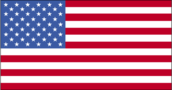
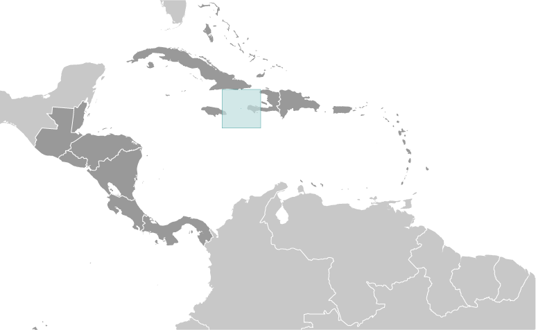
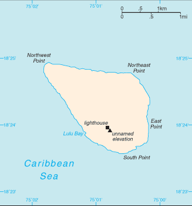

# Navassa Island

_territory of the US_

## Introduction

**_Background:_**   
This uninhabited island was claimed by the US in 1857 for its guano. Mining took place between 1865 and 1898. The lighthouse, built in 1917, was shut down in 1996 and administration of Navassa Island transferred from the US Coast Guard to the Department of the Interior. A 1998 scientific expedition to the island described it as a unique preserve of Caribbean biodiversity; the following year it became a National Wildlife Refuge and annual scientific expeditions have continued.

## Geography

**_Location:_**   
Caribbean, island in the Caribbean Sea, 35 miles west of Tiburon Peninsula of Haiti

**_Geographic coordinates:_**   
18 25 N, 75 02 W

**_Map references:_**   
Central America and the Caribbean

**_Area:_**   
**total:** 5.4 sq km   
**land:** 5.4 sq km   
**water:** 0 sq km

**_Area - comparative:_**   
about nine times the size of The Mall in Washington, DC

**_Land boundaries:_**   
0 km

**_Coastline:_**   
8 km

**_Maritime claims:_**   
**territorial sea:** 12 nm   
**exclusive economic zone:** 200 nm

**_Climate:_**   
marine, tropical

**_Terrain:_**   
raised coral and limestone plateau, flat to undulating; ringed by vertical white cliffs (9 to 15 m high)

**_Elevation extremes:_**   
**lowest point:** Caribbean Sea 0 m   
**highest point:** unnamed elevation on southwest side 77 m

**_Natural resources:_**   
guano

**_Land use:_**   
**arable land:** 0%   
**permanent crops:** 0%   
**other:** 100% (2011)

**_Natural hazards:_**   
hurricanes

**_Environment - current issues:_**   
NA

**_Geography - note:_**   
strategic location 160 km south of the US Naval Base at Guantanamo Bay, Cuba; mostly exposed rock with numerous solution holes (limestone sinkholes) but with enough grassland to support goat herds; dense stands of fig trees, scattered cactus

## People and Society

**_Population:_**   
uninhabited   
**note:** transient Haitian fishermen and others camp on the island

## Government

**_Country name:_**   
**conventional long form:** none   
**conventional short form:** Navassa Island

**_Dependency status:_**   
unorganized, unincorporated territory of the US; administered by the Fish and Wildlife Service, US Department of the Interior from the Caribbean Islands National Wildlife Refuge in Boqueron, Puerto Rico; in September 1996, the Coast Guard ceased operations and maintenance of Navassa Island Light, a 46-meter-tall lighthouse on the southern side of the island; there has also been a private claim advanced against the island

**_Legal system:_**   
the laws of the US, where applicable, apply

**_Diplomatic representation from the US:_**   
none (territory of the US)

**_Flag description:_**   
the flag of the US is used

## Economy

**_Economy - overview:_**   
Subsistence fishing and commercial trawling occur within refuge waters.

## Transportation

**_Ports and terminals:_**   
none; offshore anchorage only

## Military

**_Military - note:_**   
defense is the responsibility of the US

## Transnational Issues

**_Disputes - international:_**   
claimed by Haiti, source of subsistence fishing

............................................................   
_Page last updated on March 27, 2014_
