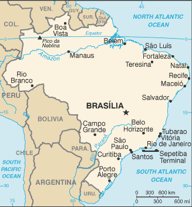

# Brazil

## Introduction

**_Background:_**   
Following more than three centuries under Portuguese rule, Brazil gained its independence in 1822, maintaining a monarchical system of government until the abolition of slavery in 1888 and the subsequent proclamation of a republic by the military in 1889. Brazilian coffee exporters politically dominated the country until populist leader Getulio VARGAS rose to power in 1930. By far the largest and most populous country in South America, Brazil underwent more than a half century of populist and military government until 1985, when the military regime peacefully ceded power to civilian rulers. Brazil continues to pursue industrial and agricultural growth and development of its interior. Exploiting vast natural resources and a large labor pool, it is today South America's leading economic power and a regional leader, one of the first in the area to begin an economic recovery. High income inequality and crime remain pressing problems, as well as recent years' slow down in economic growth.

## Geography

**_Location:_**   
Eastern South America, bordering the Atlantic Ocean

**_Geographic coordinates:_**   
10 00 S, 55 00 W

**_Map references:_**   
South America

**_Area:_**   
**total:** 8,514,877 sq km   
**land:** 8,459,417 sq km   
**water:** 55,460 sq km   
**note:** includes Arquipelago de Fernando de Noronha, Atol das Rocas, Ilha da Trindade, Ilhas Martin Vaz, and Penedos de Sao Pedro e Sao Paulo

**_Area - comparative:_**   
slightly smaller than the US

**_Land boundaries:_**   
**total:** 16,145 km   
**border countries:** Argentina 1,263 km, Bolivia 3,403 km, Colombia 1,790 km, French Guiana 649 km, Guyana 1,308 km, Paraguay 1,371 km, Peru 2,659 km, Suriname 515 km, Uruguay 1,050 km, Venezuela 2,137 km

**_Coastline:_**   
7,491 km

**_Maritime claims:_**   
**territorial sea:** 12 nm   
**contiguous zone:** 24 nm   
**exclusive economic zone:** 200 nm   
**continental shelf:** 200 nm or to edge of the continental margin

**_Climate:_**   
mostly tropical, but temperate in south

**_Terrain:_**   
mostly flat to rolling lowlands in north; some plains, hills, mountains, and narrow coastal belt

**_Elevation extremes:_**   
**lowest point:** Atlantic Ocean 0 m   
**highest point:** Pico da Neblina 2,994 m

**_Natural resources:_**   
bauxite, gold, iron ore, manganese, nickel, phosphates, platinum, tin, rare earth elements, uranium, petroleum, hydropower, timber

**_Land use:_**   
**arable land:** 8.45%   
**permanent crops:** 0.83%   
**other:** 90.72% (2011)

**_Irrigated land:_**   
54,000 sq km (2011)

**_Total renewable water resources:_**   
8,233 cu km (2011)

**_Freshwater withdrawal (domestic/industrial/agricultural):_**   
**total:** 58.07 cu km/yr (28%/17%/55%)   
**per capita:** 306 cu m/yr (2006)

**_Natural hazards:_**   
recurring droughts in northeast; floods and occasional frost in south

**_Environment - current issues:_**   
deforestation in Amazon Basin destroys the habitat and endangers a multitude of plant and animal species indigenous to the area; there is a lucrative illegal wildlife trade; air and water pollution in Rio de Janeiro, Sao Paulo, and several other large cities; land degradation and water pollution caused by improper mining activities; wetland degradation; severe oil spills

**_Environment - international agreements:_**   
**party to:** Antarctic-Environmental Protocol, Antarctic-Marine Living Resources, Antarctic Seals, Antarctic Treaty, Biodiversity, Climate Change, Climate Change-Kyoto Protocol, Desertification, Endangered Species, Environmental Modification, Hazardous Wastes, Law of the Sea, Marine Dumping, Ozone Layer Protection, Ship Pollution, Tropical Timber 83, Tropical Timber 94, Wetlands, Whaling   
**signed, but not ratified:** none of the selected agreements

**_Geography - note:_**   
largest country in South America and in the Southern Hemisphere; shares common boundaries with every South American country except Chile and Ecuador

## People and Society

**_Nationality:_**   
**noun:** Brazilian(s)   
**adjective:** Brazilian

**_Ethnic groups:_**   
white 47.7%, mulatto (mixed white and black) 43.1%, black 7.6%, Asian 1.1%, indigenous 0.4% (2010 est.)

**_Languages:_**   
Portuguese (official and most widely spoken language)   
**note:** less common languages include Spanish (border areas and schools), German, Italian, Japanese, English, and a large number of minor Amerindian languages

**_Religions:_**   
Roman Catholic 64.6%, other Catholic 0.4%, Protestant 22.2% (includes Adventist 6.5%, Assembly of God 2.0%, Christian Congregation of Brazil 1.2%, Universal Kingdom of God 1.0%, other Protestant 11.5%), other Christian 0.7%, Spiritist 2.2%, other 1.4%, none 8%, unspecified 0.4% (2010 est.)

**_Demographic profile:_**   
Brazil's rapid fertility decline since the 1960s is the main factor behind the country's slowing population growth rate, aging population, and fast-paced demographic transition. Brasilia has not taken full advantage of its large working-age population to develop its human capital and strengthen its social and economic institutions but is funding a study abroad program to bring advanced skills back to the country. The current favorable age structure will begin to shift around 2025, with the labor force shrinking and the elderly starting to compose an increasing share of the total population. Well-funded public pensions have nearly wiped out poverty among the elderly, and Bolsa Familia and other social programs have lifted tens of millions out of poverty. More than half of Brazil's population is considered middle class, but poverty and income inequality levels remain high; the Northeast, North, and Center-West, women, and black, mixed race, and indigenous populations are disproportionately affected. Disparities in opportunities foster social exclusion and contribute to Brazil's high crime rate, particularly violent crime in cities and favelas.   
Brazil has traditionally been a net recipient of immigrants, with its southeast being the prime destination. After the importation of African slaves was outlawed in the mid-19th century, Brazil sought Europeans (Italians, Portuguese, Spaniards, and Germans) and later Asians (Japanese) to work in agriculture, especially coffee cultivation. Recent immigrants come mainly from Argentina, Chile, and Andean countries (many are unskilled illegal migrants) or are returning Brazilian nationals. Since Brazil's economic downturn in the 1980s, emigration to the United States, Europe, and Japan has been rising but is negligible relative to Brazil's total population. The majority of these emigrants are well-educated and middle-class. Fewer Brazilian peasants are emigrating to neighboring countries to take up agricultural work.

**_Population:_**   
202,656,788 (July 2014 est.)

**_Age structure:_**   
**0-14 years:** 23.8% (male 24,534,129/female 23,606,332)   
**15-24 years:** 16.5% (male 16,993,708/female 16,521,057)   
**25-54 years:** 43.7% (male 43,910,790/female 44,674,915)   
**55-64 years:** 8.4% (male 8,067,022/female 9,036,519)   
**65 years and over:** 7.6% (male 6,507,069/female 8,805,247) (2014 est.)

**_Dependency ratios:_**   
**total dependency ratio:** 45.8 %   
**youth dependency ratio:** 34.4 %   
**elderly dependency ratio:** 11.3 %   
**potential support ratio:** 8.8 (2014 est.)

**_Median age:_**   
**total:** 30.7 years   
**male:** 29.9 years   
**female:** 31.5 years (2014 est.)

**_Population growth rate:_**   
0.8% (2014 est.)

**_Birth rate:_**   
14.72 births/1,000 population (2014 est.)

**_Death rate:_**   
6.54 deaths/1,000 population (2014 est.)

**_Net migration rate:_**   
-0.15 migrant(s)/1,000 population (2014 est.)

**_Urbanization:_**   
**urban population:** 84.6% of total population (2011)   
**rate of urbanization:** 1.15% annual rate of change (2010-15 est.)

**_Major urban areas - population:_**   
Sao Paulo 19.924 million; Rio de Janeiro 11.96 million; Belo Horizonte 5.487 million; Porto Alegre 3.933 million; Recife 3.733 million; BRASILIA (capital) 3.813 million (2011)

**_Sex ratio:_**   
**at birth:** 1.05 male(s)/female   
**0-14 years:** 1.04 male(s)/female   
**15-24 years:** 1.03 male(s)/female   
**25-54 years:** 0.98 male(s)/female   
**55-64 years:** 0.97 male(s)/female   
**65 years and over:** 0.74 male(s)/female   
**total population:** 0.98 male(s)/female (2014 est.)

**_Maternal mortality rate:_**   
56 deaths/100,000 live births (2010)

**_Infant mortality rate:_**   
**total:** 19.21 deaths/1,000 live births   
**male:** 22.47 deaths/1,000 live births   
**female:** 15.78 deaths/1,000 live births (2014 est.)

**_Life expectancy at birth:_**   
**total population:** 73.28 years   
**male:** 69.73 years   
**female:** 77 years (2014 est.)

**_Total fertility rate:_**   
1.79 children born/woman (2014 est.)

**_Contraceptive prevalence rate:_**   
80.3% (2006)

**_Health expenditures:_**   
8.9% of GDP (2011)

**_Physicians density:_**   
1.76 physicians/1,000 population (2008)

**_Hospital bed density:_**   
2.3 beds/1,000 population (2011)

**_Drinking water source:_**   
**improved:** urban: 99.7% of population; rural: 85.3% of population; total: 97.5% of population   
**unimproved:** urban: 0.3% of population; rural: 14.7% of population; total: 2.5% of population (2012 est.)

**_Sanitation facility access:_**   
**improved:** urban: 87% of population; rural: 49.2% of population; total: 81.3% of population   
**unimproved:** urban: 13% of population; rural: 50.8% of population; total: 18.7% of population (2012 est.)

**_HIV/AIDS - adult prevalence rate:_**   
NA

**_HIV/AIDS - people living with HIV/AIDS:_**   
NA

**_HIV/AIDS - deaths:_**   
NA

**_Obesity - adult prevalence rate:_**   
18.8% (2008)

**_Children under the age of 5 years underweight:_**   
2.2% (2007)

**_Education expenditures:_**   
5.8% of GDP (2010)

**_Literacy:_**   
**definition:** age 15 and over can read and write   
**total population:** 90.4%   
**male:** 90.1%   
**female:** 90.7% (2010 est.)

**_Child labor - children ages 5-14:_**   
**total number:** 959,942   
**percentage:** 3 %   
**note:** data represents children ages 5-13 (2009 est.)

**_Unemployment, youth ages 15-24:_**   
**total:** 15.4%   
**male:** 12.2%   
**female:** 19.8% (2011)

## Government

**_Country name:_**   
**conventional long form:** Federative Republic of Brazil   
**conventional short form:** Brazil   
**local long form:** Republica Federativa do Brasil   
**local short form:** Brasil

**_Government type:_**   
federal republic

**_Capital:_**   
**name:** Brasilia   
**geographic coordinates:** 15 47 S, 47 55 W   
**time difference:** UTC-3 (2 hours ahead of Washington, DC, during Standard Time)   
**daylight saving time:** +1hr, begins third Sunday in October; ends third Sunday in February   
**note:** Brazil has three time zones, including one for the Fernando de Noronha Islands

**_Administrative divisions:_**   
26 states (estados, singular - estado) and 1 federal district\* (distrito federal); Acre, Alagoas, Amapa, Amazonas, Bahia, Ceara, Distrito Federal\*, Espirito Santo, Goias, Maranhao, Mato Grosso, Mato Grosso do Sul, Minas Gerais, Para, Paraiba, Parana, Pernambuco, Piaui, Rio de Janeiro, Rio Grande do Norte, Rio Grande do Sul, Rondonia, Roraima, Santa Catarina, Sao Paulo, Sergipe, Tocantins

**_Independence:_**   
7 September 1822 (from Portugal)

**_National holiday:_**   
Independence Day, 7 September (1822)

**_Constitution:_**   
several previous; latest ratified 5 October 1988; amended many times, last in 2012 (2012)

**_Legal system:_**   
civil law; note - a new civil law code was enacted in 2002 replacing the 1916 code

**_International law organization participation:_**   
has not submitted an ICJ jurisdiction declaration; accepts ICCt jurisdiction

**_Suffrage:_**   
voluntary between 16 to under 18 years of age and over 70; compulsory 18 to 70 years of age; note - military conscripts by law cannot vote

**_Executive branch:_**   
**chief of state:** President Dilma ROUSSEFF (since 1 January 2011); Vice President Michel Miguel Elias TEMER Lulia (since 1 January 2011); note - the president is both chief of state and head of government   
**head of government:** President Dilma ROUSSEFF (since 1 January 2011); Vice President Michel Miguel Elias TEMER Lulia (since 1 January 2011)   
**cabinet:** Cabinet appointed by the president   
**elections:** president and vice president elected on the same ticket by popular vote for a single four-year term; election last held on 3 October 2010 with runoff on 31 October 2010 (next to be held on 5 October 2014 and, if necessary, a runoff election on 26 October 2014)   
**election results:** Dilma ROUSSEFF (PT) elected president in a runoff election; percent of vote - Dilma ROUSSEFF 56.01%, Jose SERRA (PSDB) 43.99%

**_Legislative branch:_**   
bicameral National Congress or Congresso Nacional consists of the Federal Senate or Senado Federal (81 seats; 3 members from each state and federal district elected according to the principle of majority to serve eight-year terms; one-third and two-thirds of members elected every four years, alternately) and the Chamber of Deputies or Camara dos Deputados (513 seats; members are elected by proportional representation to serve four-year terms)   
**elections:** Federal Senate - last held on 3 October 2010 for two-thirds of the Senate (next to be held in October 2014 for one-third of the Senate); Chamber of Deputies - last held on 3 October 2010 (next to be held in October 2014)   
**election results:** Federal Senate - percent of vote by party - NA; seats by party - PMDB 19, PT 15, PSDB 11, DEM (formerly PFL) 7, PTB 6, PP 4, PDT 4, PR 4, PSB 3, PCdoB 2, PSOL 2, other 4; Chamber of Deputies - percent of vote by party - NA; seats by party - PT 88, PMDB 79, PSDB 53, DEM (formerly PFL) 43, PP 41, PR 41, PSB 34, PDT 28, PTB 21, PSC 17, PCdoB 15, PPS 12, PPS 12, PRB 8, PMN 4, PSOL 3, other 26

**_Judicial branch:_**   
**highest court(s):** Supreme Federal Court (consists of 11 justices)   
**judge selection and term of office:** justices appointed by the president and approved by the Federal Senate; justices appointed to serve until mandatory retirement at age 70   
**subordinate courts:** Federal Appeals Court, Superior Court of Justice, Superior Electoral Court, regional federal courts; state court system

**_Political parties and leaders:_**   
Brazilian Communist Party or PCB [Ivan Martins PINHEIRO]   
Brazilian Democratic Movement Party or PMDB [Michel TEMER]   
Brazilian Labor Party or PTB [Benito GAMA]   
Brazilian Renewal Labor Party or PRTB [Jose Levy FIDELIX da Cruz]   
Brazilian Republican Party or PRB [Marcos Antonio PEREIRA]   
Brazilian Social Democracy Party or PSDB [Aecio NEVES]   
Brazilian Socialist Party or PSB [Eduardo CAMPOS]   
Christian Labor Party or PTC [Daniel TOURINHO]   
Christian Social Democratic Party or PSDC [Jose Maria EYMAEL]   
Communist Party of Brazil or PCdoB [Jose Renato RABELO]   
Democratic Labor Party or PDT [Carlos Roberto LUPI]   
the Democrats or DEM [Jose AGRIPINO] (formerly Liberal Front Party or PFL)   
Free Homeland Party or PPL [Sergio RUBENS]   
Green Party or PV [Jose Luiz PENNA]   
Humanist Party of Solidarity or PHS [Eduardo MACHADO]   
Labor Party of Brazil or PTdoB [Luis Henrique de Oliveira RESENDE]   
National Ecologic Party or PEN [Adilson Barroso OLIVEIRA]   
National Labor Party or PTN [Jose Masci de ABREU]   
National Mobilization Party or PMN [Oscar Noronha FILHO]   
Party of the Republic or PR [Alfredo NASCIMENTO]   
Popular Socialist Party or PPS [Roberto Joao Pereira FREIRE]   
Progressive Party or PP [Ciro NOGUEIRA]   
Progressive Republican Party or PRP [Ovasco Roma Altimari RESENDE]   
Social Christian Party or PSC [Vitor Jorge Abdala NOSSEIS]   
Social Democratic Party or PSD [Gilberto KASSAB]   
Social Liberal Party or PSL [Luciano Caldas BIVAR]   
Socialism and Freedom Party or PSOL [Luiz ARAUJO]   
United Socialist Workers' Party or PSTU [Jose Maria DE ALMEIDA]   
Workers' Cause Party or PCO [Rui Costa PIMENTA]   
Workers' Party or PT [Rui FALCAO]

**_Political pressure groups and leaders:_**   
Landless Workers' Movement or MST   
**other:** industrial federations; labor unions and federations; large farmers' associations; religious groups including evangelical Christian churches and the Catholic Church

**_International organization participation:_**   
AfDB (nonregional member), BIS, BRICS, CAN (associate), CD, CELAC, CPLP, FAO, FATF, G-15, G-20, G-24, G-77, IADB, IAEA, IBRD, ICAO, ICC (national committees), ICRM, IDA, IFAD, IFC, IFRCS, IHO, ILO, IMF, IMO, IMSO, Interpol, IOC, IOM, IPU, ISO, ITSO, ITU, ITUC (NGOs), LAES, LAIA, LAS (observer), Mercosur, MIGA, MINURSO, MINUSTAH, NAM (observer), NSG, OAS, OECD (Enhanced Engagement, OPANAL, OPCW, Paris Club (associate), PCA, SICA (observer), UN, UNASUR, UNCTAD, UNESCO, UNFICYP, UNHCR, UNIDO, UNIFIL, Union Latina, UNISFA, UNITAR, UNMIL, UNMISS, UNMIT, UNOCI, UNWTO, UPU, WCO, WFTU (NGOs), WHO, WIPO, WMO, WTO

**_Diplomatic representation in the US:_**   
**chief of mission:** Ambassador Mauro Luiz Iecker VIEIRA (since 11 January 2010)   
**chancery:** 3006 Massachusetts Avenue NW, Washington, DC 20008   
**telephone:** [1] (202) 238-2805   
**FAX:** [1] (202) 238-2827   
**consulate(s) general:** Atlanta, Boston, Chicago, Hartford (CT), Houston, Los Angeles, Miami, New York, San Francisco

**_Diplomatic representation from the US:_**   
**chief of mission:** Ambassador Liliana AYALDE (since 1 August 2013)   
**embassy:** Avenida das Nacoes, Quadra 801, Lote 3, Distrito Federal Cep 70403-900, Brasilia   
**mailing address:** Unit 7500, DPO, AA 34030   
**telephone:** [55] (61) 3312-7000   
**FAX:** [55] (61) 3225-9136   
**consulate(s) general:** Rio de Janeiro, Sao Paulo   
**consulate(s):** Recife

**_Flag description:_**   
green with a large yellow diamond in the center bearing a blue celestial globe with 27 white five-pointed stars; the globe has a white equatorial band with the motto ORDEM E PROGRESSO (Order and Progress); the current flag was inspired by the banner of the former Empire of Brazil (1822-1889); on the imperial flag, the green represented the House of Braganza of Pedro I, the first Emperor of Brazil, while the yellow stood for the Habsburg Family of his wife; on the modern flag the green represents the forests of the country and the yellow rhombus its mineral wealth; the blue circle and stars, which replaced the coat of arms of the original flag, depict the sky over Rio de Janeiro on the morning of 15 November 1889 - the day the Republic of Brazil was declared; the number of stars has changed with the creation of new states and has risen from an original 21 to the current 27 (one for each state and the Federal District)

**_National symbol(s):_**   
Southern Cross constellation

**_National anthem:_**   
**name:** "Hino Nacional Brasileiro" (Brazilian National Anthem)   
**lyrics/music:** Joaquim Osorio Duque ESTRADA/Francisco Manoel DA SILVA   
**note:** music adopted 1890, lyrics adopted 1922; the anthem's music, composed in 1822, was used unofficially for many years before it was adopted

## Economy

**_Economy - overview:_**   
Characterized by large and well-developed agricultural, mining, manufacturing, and service sectors, and a rapidly expanding middle class, Brazil's economy outweighs that of all other South American countries, and Brazil is expanding its presence in world markets. Since 2003, Brazil has steadily improved its macroeconomic stability, building up foreign reserves, and reducing its debt profile by shifting its debt burden toward real denominated and domestically held instruments. In 2008, Brazil became a net external creditor and two ratings agencies awarded investment grade status to its debt. After strong growth in 2007 and 2008, the onset of the global financial crisis hit Brazil in 2008. Brazil experienced two quarters of recession, as global demand for Brazil's commodity-based exports dwindled and external credit dried up. However, Brazil was one of the first emerging markets to begin a recovery. In 2010, consumer and investor confidence revived and GDP growth reached 7.5%, the highest growth rate in the past 25 years. Rising inflation led the authorities to take measures to cool the economy; these actions and the deteriorating international economic situation slowed growth in 2011-13. Unemployment is at historic lows and Brazil's traditionally high level of income inequality has declined for each of the last 14 years. Brazil's historically high interest rates have made it an attractive destination for foreign investors. Large capital inflows over the past several years have contributed to the appreciation of the currency, hurting the competitiveness of Brazilian manufacturing and leading the government to intervene in foreign exchange markets and raise taxes on some foreign capital inflows. President Dilma ROUSSEFF has retained the previous administration's commitment to inflation targeting by the central bank, a floating exchange rate, and fiscal restraint.

**_GDP (purchasing power parity):_**   
$2.416 trillion (2013 est.)   
$2.362 trillion (2012 est.)   
$2.342 trillion (2011 est.)   
**note:** data are in 2013 US dollars

**_GDP (official exchange rate):_**   
$2.19 trillion (2013 est.)

**_GDP - real growth rate:_**   
2.3% (2013 est.)   
0.9% (2012 est.)   
2.7% (2011 est.)

**_GDP - per capita (PPP):_**   
$12,100 (2013 est.)   
$11,900 (2012 est.)   
$11,900 (2011 est.)   
**note:** data are in 2013 US dollars

**_Gross national saving:_**   
14.8% of GDP (2013 est.)   
15.2% of GDP (2012 est.)   
17.6% of GDP (2011 est.)

**_GDP - composition, by end use:_**   
**household consumption:** 62.5%   
**government consumption:** 21.7%   
**investment in fixed capital:** 18.3%   
**investment in inventories:** 0%   
**exports of goods and services:** 12.4%   
**imports of goods and services:** -14.9%; (2013 est.)

**_GDP - composition, by sector of origin:_**   
**agriculture:** 5.5%   
**industry:** 26.4%   
**services:** 68.1%; (2013 est.)

**_Agriculture - products:_**   
coffee, soybeans, wheat, rice, corn, sugarcane, cocoa, citrus; beef

**_Industries:_**   
textiles, shoes, chemicals, cement, lumber, iron ore, tin, steel, aircraft, motor vehicles and parts, other machinery and equipment

**_Industrial production growth rate:_**   
3% (2013 est.)

**_Labor force:_**   
107.3 million (2013 est.)

**_Labor force - by occupation:_**   
**agriculture:** 15.7%   
**industry:** 13.3%   
**services:** 71%; (2011 est.)

**_Unemployment rate:_**   
5.7% (2013 est.)   
5.5% (2012 est.)

**_Population below poverty line:_**   
21.4%   
**note:** official Brazilian data show 4.2% of the population being below the "extreme" poverty line in 2011 (2009 est.)

**_Household income or consumption by percentage share:_**   
**lowest 10%:** 0.8%   
**highest 10%:** 42.9% (2009 est.)

**_Distribution of family income - Gini index:_**   
51.9 (2012)   
55.3 (2001)

**_Budget:_**   
**revenues:** $851.1 billion   
**expenditures:** $815.6 billion (2013 est.)

**_Taxes and other revenues:_**   
38.9% of GDP (2013 est.)

**_Budget surplus (+) or deficit (-):_**   
1.6% of GDP (2013 est.)

**_Public debt:_**   
59.2% of GDP (2013 est.)   
58.8% of GDP (2012 est.)

**_Fiscal year:_**   
calendar year

**_Inflation rate (consumer prices):_**   
6.2% (2013 est.)   
5.4% (2012 est.)

**_Central bank discount rate:_**   
10% (31 December 2013 est.)   
11% (31 December 2011 est.)

**_Commercial bank prime lending rate:_**   
26.9% (31 December 2013 est.)   
36.64% (31 December 2012 est.)

**_Stock of narrow money:_**   
$157.6 billion (31 December 2013 est.)   
$159.1 billion (31 December 2012 est.)

**_Stock of broad money:_**   
$870.8 billion (31 December 2013 est.)   
$863.5 billion (31 December 2012 est.)

**_Stock of domestic credit:_**   
$2.435 trillion (31 December 2013 est.)   
$2.381 trillion (31 December 2012 est.)

**_Market value of publicly traded shares:_**   
$1.23 trillion (31 December 2012 est.)   
$1.229 trillion (31 December 2011)   
$1.546 trillion (31 December 2010 est.)

**_Current account balance:_**   
-$77.63 billion (2013 est.)   
-$54.23 billion (2012 est.)

**_Exports:_**   
$244.8 billion (2013 est.)   
$242.6 billion (2012 est.)

**_Exports - commodities:_**   
transport equipment, iron ore, soybeans, footwear, coffee, autos

**_Exports - partners:_**   
China 17%, US 11.1%, Argentina 7.4%, Netherlands 6.2% (2012)

**_Imports:_**   
$241.4 billion (2013 est.)   
$223.2 billion (2012 est.)

**_Imports - commodities:_**   
machinery, electrical and transport equipment, chemical products, oil, automotive parts, electronics

**_Imports - partners:_**   
China 15.3%, US 14.6%, Argentina 7.4%, Germany 6.4%, South Korea 4.1% (2012)

**_Reserves of foreign exchange and gold:_**   
$378.3 billion (31 December 2013 est.)   
$373.1 billion (31 December 2012 est.)

**_Debt - external:_**   
$475.9 billion (31 December 2013 est.)   
$438.9 billion (31 December 2012 est.)

**_Stock of direct foreign investment - at home:_**   
$663.3 billion (31 December 2013 est.)   
$604.5 billion (31 December 2012 est.)

**_Stock of direct foreign investment - abroad:_**   
$179.6 billion (31 December 2013 est.)   
$177.1 billion (31 December 2012 est.)

**_Exchange rates:_**   
reals (BRL) per US dollar -   
2.153 (2013 est.)   
1.9546 (2012 est.)   
1.7592 (2010 est.)   
2 (2009)   
1.8644 (2008)

## Energy

**_Electricity - production:_**   
530.7 billion kWh (2011 est.)

**_Electricity - consumption:_**   
455.8 billion kWh (2010 est.)

**_Electricity - exports:_**   
2.544 billion kWh (2011 est.)

**_Electricity - imports:_**   
38.43 billion kWh (2011 est.)

**_Electricity - installed generating capacity:_**   
113.7 million kW (2010 est.)

**_Electricity - from fossil fuels:_**   
19.6% of total installed capacity (2010 est.)

**_Electricity - from nuclear fuels:_**   
1.8% of total installed capacity (2010 est.)

**_Electricity - from hydroelectric plants:_**   
71% of total installed capacity (2010 est.)

**_Electricity - from other renewable sources:_**   
7.7% of total installed capacity (2010 est.)

**_Crude oil - production:_**   
2.652 million bbl/day (2012 est.)

**_Crude oil - exports:_**   
619,100 bbl/day (2010 est.)

**_Crude oil - imports:_**   
343,600 bbl/day (2010 est.)

**_Crude oil - proved reserves:_**   
13.15 billion bbl (1 January 2013 est.)

**_Refined petroleum products - production:_**   
2.108 million bbl/day (2010 est.)

**_Refined petroleum products - consumption:_**   
2.594 million bbl/day (2011 est.)

**_Refined petroleum products - exports:_**   
158,400 bbl/day (2010 est.)

**_Refined petroleum products - imports:_**   
457,400 bbl/day (2010 est.)

**_Natural gas - production:_**   
17.03 billion cu m (2012 est.)

**_Natural gas - consumption:_**   
25.2 billion cu m (2010 est.)

**_Natural gas - exports:_**   
400 million cu m (2012 est.)

**_Natural gas - imports:_**   
13.3 billion cu m (2012 est.)

**_Natural gas - proved reserves:_**   
395.5 billion cu m (1 January 2013 est.)

**_Carbon dioxide emissions from consumption of energy:_**   
475.4 million Mt (2011 est.)

## Communications

**_Telephones - main lines in use:_**   
44.3 million (2012)

**_Telephones - mobile cellular:_**   
248.324 million (2012)

**_Telephone system:_**   
**general assessment:** good working system including an extensive microwave radio relay system and a domestic satellite system with 64 earth stations   
**domestic:** fixed-line connections have remained relatively stable in recent years and stand at about 20 per 100 persons; less expensive mobile-cellular technology has been a major driver in expanding telephone service to the lower-income segments of the population with mobile-cellular teledensity roughly 120 per 100 persons   
**international:** country code - 55; landing point for a number of submarine cables, including Americas-1, Americas-2, Atlantis-2, GlobeNet, South America-1, South American Crossing/Latin American Nautilus, and UNISUR that provide direct connectivity to South and Central America, the Caribbean, the US, Africa, and Europe; satellite earth stations - 3 Intelsat (Atlantic Ocean), 1 Inmarsat (Atlantic Ocean region east), connected by microwave relay system to Mercosur Brazilsat B3 satellite earth station (2011)

**_Broadcast media:_**   
state-run Radiobras operates a radio and a TV network; more than 1,000 radio stations and more than 100 TV channels operating - mostly privately owned; private media ownership highly concentrated (2007)

**_Internet country code:_**   
.br

**_Internet hosts:_**   
26.577 million (2012)

**_Internet users:_**   
75.982 million (2009)

## Transportation

**_Airports:_**   
4,093 (2013)

**_Airports - with paved runways:_**   
**total:** 698   
**over 3,047 m:** 7   
**2,438 to 3,047 m:** 27   
**1,524 to 2,437 m:** 179   
**914 to 1,523 m:** 436   
**under 914 m:** 49 (2013)

**_Airports - with unpaved runways:_**   
**total:** 3,395   
**1,524 to 2,437 m:** 92   
**914 to 1,523 m:** 1,619   
**under 914 m:** 1,684 (2013)

**_Heliports:_**   
13 (2013)

**_Pipelines:_**   
condensate/gas 251 km; gas 17,312 km; liquid petroleum gas 352 km; oil 4,831 km; refined products 4,722 km (2013)

**_Railways:_**   
**total:** 28,538 km   
**broad gauge:** 5,627 km 1.600-m gauge (467 km electrified)   
**standard gauge:** 194 km 1.440-m gauge   
**narrow gauge:** 22,717 km 1.000-m gauge (2008)

**_Roadways:_**   
**total:** 1,580,964 km   
**paved:** 212,798 km   
**unpaved:** 1,368,166 km   
**note:** does not include urban roads (2010)

**_Waterways:_**   
50,000 km (most in areas remote from industry and population) (2012)

**_Merchant marine:_**   
**total:** 109   
**by type:** bulk carrier 18, cargo 16, chemical tanker 7, container 13, liquefied gas 11, petroleum tanker 39, roll on/roll off 5   
**foreign-owned:** 27 (Chile 1, Denmark 3, Germany 6, Greece 1, Norway 3, Spain 12, Turkey 1)   
**registered in other countries:** 36 (Argentina 1, Bahamas 1, Ghana 1, Liberia 20, Marshall Islands 1, Panama 3, Singapore 9) (2010)

**_Ports and terminals:_**   
**major seaport(s):** Belem, Paranagua, Rio Grande, Rio de Janeiro, Santos, Sao Sebastiao, Tubarao   
**river port(s):** Manaus (Amazon)   
**dry bulk cargo port(s):** Sepetiba ore terminal   
**container ports (TEUs):** Santos (2,985,922), Itajai (983,985)(2011)   
**oil/gas terminal(s):** DTSE/Gegua oil terminal, Ilha Grande (Gebig), Guaiba Island terminal, Guamare oil terminal   
**LNG terminal(s) (import):** Pecem, Rio de Janiero

## Military

**_Military branches:_**   
Brazilian Army (Exercito Brasileiro, EB), Brazilian Navy (Marinha do Brasil (MB), includes Naval Air and Marine Corps (Corpo de Fuzileiros Navais)), Brazilian Air Force (Forca Aerea Brasileira, FAB) (2011)

**_Military service age and obligation:_**   
18-45 years of age for compulsory military service; conscript service obligation is 9-12 months; 17-45 years of age for voluntary service; an increasing percentage of the ranks are "long-service" volunteer professionals; women were allowed to serve in the armed forces beginning in early 1980s when the Brazilian Army became the first army in South America to accept women into career ranks; women serve in Navy and Air Force only in Women's Reserve Corps (2012)

**_Manpower available for military service:_**   
**males age 16-49:** 53,350,703   
**females age 16-49:** 53,433,918 (2010 est.)

**_Manpower fit for military service:_**   
**males age 16-49:** 38,993,989   
**females age 16-49:** 44,841,661 (2010 est.)

**_Manpower reaching militarily significant age annually:_**   
**male:** 1,733,168   
**female:** 1,672,477 (2010 est.)

**_Military expenditures:_**   
1.47% of GDP (2012)   
1.49% of GDP (2011)   
1.47% of GDP (2010)

## Transnational Issues

**_Disputes - international:_**   
uncontested boundary dispute between Brazil and Uruguay over Braziliera/Brasiliera Island in the Quarai/Cuareim River leaves the tripoint with Argentina in question; smuggling of firearms and narcotics continues to be an issue along the Uruguay-Brazil border; Colombian-organized illegal narcotics and paramilitary activities penetrate Brazil's border region with Venezuela

**_Illicit drugs:_**   
second-largest consumer of cocaine in the world; illicit producer of cannabis; trace amounts of coca cultivation in the Amazon region, used for domestic consumption; government has a large-scale eradication program to control cannabis; important transshipment country for Bolivian, Colombian, and Peruvian cocaine headed for Europe; also used by traffickers as a way station for narcotics air transshipments between Peru and Colombia; upsurge in drug-related violence and weapons smuggling; important market for Colombian, Bolivian, and Peruvian cocaine; illicit narcotics proceeds are often laundered through the financial system; significant illicit financial activity in the Tri-Border Area (2008)

............................................................   
_Page last updated on June 23, 2014_
