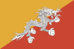
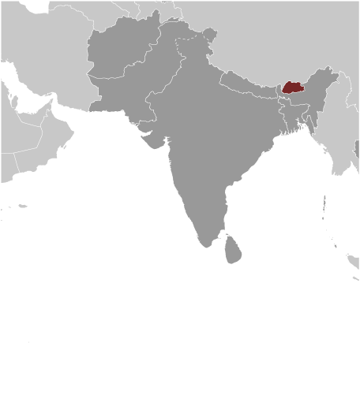
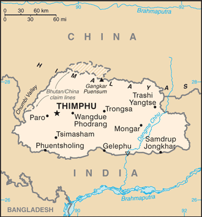

# Bhutan

## Introduction

**_Background:_**   
In 1865, Britain and Bhutan signed the Treaty of Sinchulu, under which Bhutan would receive an annual subsidy in exchange for ceding some border land to British India. Under British influence, a monarchy was set up in 1907; three years later, a treaty was signed whereby the British agreed not to interfere in Bhutanese internal affairs, and Bhutan allowed Britain to direct its foreign affairs. This role was assumed by independent India after 1947. Two years later, a formal Indo-Bhutanese accord returned to Bhutan the areas annexed by the British, formalized the annual subsidies the country received, and defined India's responsibilities in defense and foreign relations. In March 2005, King Jigme Singye WANGCHUCK unveiled the government's draft constitution - which introduced major democratic reforms - and pledged to hold a national referendum for its approval. In December 2006, the King abdicated the throne in favor of his son, Jigme Khesar Namgyel WANGCHUCK, in order to give him experience as head of state before the democratic transition. In early 2007, India and Bhutan renegotiated their treaty, eliminating the clause that stated that Bhutan would be "guided by" India in conducting its foreign policy, although Thimphu continues to coordinate closely with New Delhi. Elections for seating the country's first parliament were completed in March 2008; the king ratified the country's first constitution in July 2008. Bhutan experienced a peaceful turnover of power following parliamentary elections in 2013, which routed the incumbent party. The disposition of some 30,000 Bhutanese refugees - housed in two UN refugee camps in Nepal - remains unresolved.

## Geography

**_Location:_**   
Southern Asia, between China and India

**_Geographic coordinates:_**   
27 30 N, 90 30 E

**_Map references:_**   
Asia

**_Area:_**   
**total:** 38,394 sq km   
**land:** 38,394 sq km   
**water:** 0 sq km

**_Area - comparative:_**   
about one-half the size of Indiana

**_Land boundaries:_**   
**total:** 1,136 km   
**border countries:** China 477 km, India 659 km

**_Coastline:_**   
0 km (landlocked)

**_Maritime claims:_**   
none (landlocked)

**_Climate:_**   
varies; tropical in southern plains; cool winters and hot summers in central valleys; severe winters and cool summers in Himalayas

**_Terrain:_**   
mostly mountainous with some fertile valleys and savanna

**_Elevation extremes:_**   
**lowest point:** Drangeme Chhu 97 m   
**highest point:** Gangkar Puensum 7,570 m

**_Natural resources:_**   
timber, hydropower, gypsum, calcium carbonate

**_Land use:_**   
**arable land:** 2.49%   
**permanent crops:** 0.46%   
**other:** 97.06% (2011)

**_Irrigated land:_**   
319.1 sq km (2010)

**_Total renewable water resources:_**   
78 cu km (2011)

**_Freshwater withdrawal (domestic/industrial/agricultural):_**   
**total:** 0.34 cu km/yr (5%/1%/94%)   
**per capita:** 458 cu m/yr (2008)

**_Natural hazards:_**   
violent storms from the Himalayas are the source of the country's name, which translates as Land of the Thunder Dragon; frequent landslides during the rainy season

**_Environment - current issues:_**   
soil erosion; limited access to potable water

**_Environment - international agreements:_**   
**party to:** Biodiversity, Climate Change, Climate Change-Kyoto Protocol, Desertification, Endangered Species, Hazardous Wastes, Ozone Layer Protection   
**signed, but not ratified:** Law of the Sea

**_Geography - note:_**   
landlocked; strategic location between China and India; controls several key Himalayan mountain passes

## People and Society

**_Nationality:_**   
**noun:** Bhutanese (singular and plural)   
**adjective:** Bhutanese

**_Ethnic groups:_**   
Ngalop (also known as Bhote) 50%, ethnic Nepalese 35% (includes Lhotsampas - one of several Nepalese ethnic groups), indigenous or migrant tribes 15%

**_Languages:_**   
Sharchhopka 28%, Dzongkha (official) 24%, Lhotshamkha 22%, other 26% (includes foreign languages) (2005 est.)

**_Religions:_**   
Lamaistic Buddhist 75.3%, Indian- and Nepalese-influenced Hinduism 22.1%, other 2.6% (2005 est.)

**_Population:_**   
733,643   
**note:** the Factbook population estimate is consistent with the first modern census of Bhutan, conducted in 2005; previous Factbook population estimates for Bhutan, which were on the order of three times the total population reported here, were based on Bhutanese Government publications that did not include the census (July 2014 est.)

**_Age structure:_**   
**0-14 years:** 27.3% (male 102,196/female 97,923)   
**15-24 years:** 20.1% (male 75,327/female 72,472)   
**25-54 years:** 40.8% (male 159,868/female 139,236)   
**55-64 years:** 5.8% (male 22,769/female 19,699)   
**65 years and over:** 6% (male 23,153/female 21,000) (2014 est.)

**_Dependency ratios:_**   
**total dependency ratio:** 48.1 %   
**youth dependency ratio:** 40.8 %   
**elderly dependency ratio:** 7.2 %   
**potential support ratio:** 13.8 (2014 est.)

**_Median age:_**   
**total:** 26.2 years   
**male:** 26.8 years   
**female:** 25.6 years (2014 est.)

**_Population growth rate:_**   
1.13% (2014 est.)

**_Birth rate:_**   
18.12 births/1,000 population (2014 est.)

**_Death rate:_**   
6.78 deaths/1,000 population (2014 est.)

**_Net migration rate:_**   
0 migrant(s)/1,000 population (2014 est.)

**_Urbanization:_**   
**urban population:** 35.6% of total population (2011)   
**rate of urbanization:** 3.65% annual rate of change (2010-15 est.)

**_Major urban areas - population:_**   
THIMPHU (capital) 99,000 (2011)

**_Sex ratio:_**   
**at birth:** 1.05 male(s)/female   
**0-14 years:** 1.04 male(s)/female   
**15-24 years:** 1.04 male(s)/female   
**25-54 years:** 1.15 male(s)/female   
**55-64 years:** 1.09 male(s)/female   
**65 years and over:** 1.11 male(s)/female   
**total population:** 1.1 male(s)/female (2014 est.)

**_Maternal mortality rate:_**   
180 deaths/100,000 live births (2010)

**_Infant mortality rate:_**   
**total:** 37.89 deaths/1,000 live births   
**male:** 38.34 deaths/1,000 live births   
**female:** 37.42 deaths/1,000 live births (2014 est.)

**_Life expectancy at birth:_**   
**total population:** 68.98 years   
**male:** 68.06 years   
**female:** 69.95 years (2014 est.)

**_Total fertility rate:_**   
2.02 children born/woman (2014 est.)

**_Contraceptive prevalence rate:_**   
65.6% (2010)

**_Health expenditures:_**   
4.1% of GDP (2011)

**_Physicians density:_**   
0.07 physicians/1,000 population (2008)

**_Hospital bed density:_**   
1.8 beds/1,000 population (2011)

**_Drinking water source:_**   
**improved:** urban: 99.4% of population; rural: 97.3% of population; total: 98.1% of population   
**unimproved:** urban: 0.6% of population; rural: 2.7% of population; total: 1.9% of population (2012 est.)

**_Sanitation facility access:_**   
**improved:** urban: 74.5% of population; rural: 31.1% of population; total: 46.9% of population   
**unimproved:** urban: 25.5% of population; rural: 68.9% of population; total: 53.1% of population (2012 est.)

**_HIV/AIDS - adult prevalence rate:_**   
0.2% (2012 est.)

**_HIV/AIDS - people living with HIV/AIDS:_**   
1,100 (2012 est.)

**_HIV/AIDS - deaths:_**   
100 (2012 est.)

**_Major infectious diseases:_**   
**degree of risk:** high   
**food or waterborne diseases:** bacterial and protozoal diarrhea, hepatitis A, and typhoid fever   
**vectorborne diseases:** dengue fever and malaria (2013)

**_Obesity - adult prevalence rate:_**   
5.3% (2008)

**_Children under the age of 5 years underweight:_**   
12.8% (2010)

**_Education expenditures:_**   
4.7% of GDP (2011)

**_Literacy:_**   
**definition:** age 15 and over can read and write   
**total population:** 52.8%   
**male:** 65%   
**female:** 38.7% (2005 est.)

**_School life expectancy (primary to tertiary education):_**   
**total:** 13 years   
**male:** 13 years   
**female:** 13 years (2012)

**_Child labor - children ages 5-14:_**   
**total number:** 25,801   
**percentage:** 18 % (2010 est.)

**_Unemployment, youth ages 15-24:_**   
**total:** 7.2%   
**male:** 7.3%   
**female:** 7.2% (2012)

## Government

**_Country name:_**   
**conventional long form:** Kingdom of Bhutan   
**conventional short form:** Bhutan   
**local long form:** Druk Gyalkhap   
**local short form:** Druk Yul

**_Government type:_**   
constitutional monarchy

**_Capital:_**   
**name:** Thimphu   
**geographic coordinates:** 27 28 N, 89 38 E   
**time difference:** UTC+6 (11 hours ahead of Washington, DC, during Standard Time)

**_Administrative divisions:_**   
20 districts (dzongkhag, singular and plural); Bumthang, Chhukha, Chirang, Daga, Gasa, Geylegphug, Ha, Lhuntshi, Mongar, Paro, Pemagatsel, Punakha, Samchi, Samdrup Jongkhar, Shemgang, Tashigang, Tashi Yangtse, Thimphu, Tongsa, Wangdi Phodrang

**_Independence:_**   
1907 (became a unified kingdom under its first hereditary king)

**_National holiday:_**   
National Day (Ugyen WANGCHUCK became first hereditary king), 17 December (1907)

**_Constitution:_**   
previous (various royal decrees); first constitution drafted November 2001 - March 2005, ratified 18 July 2008 (2011)

**_Legal system:_**   
civil law based on Buddhist religious law

**_International law organization participation:_**   
has not submitted an ICJ jurisdiction declaration; non-party state to the ICCt

**_Suffrage:_**   
18 years of age; universal

**_Executive branch:_**   
**chief of state:** King Jigme Khesar Namgyel WANGCHUCK (since 14 December 2006); note - King Jigme Singye WANGCHUCK abdicated the throne on 14 December 2006 and his son immediately succeeded him; the nearly two-year delay between the former King's abdication and his son's coronation on 6 November 2008 was to ensure an astrologically auspicious coronation date and to give the new king, who had limited experience, deeper administrative expertise under the guidance of his father   
**head of government:** Prime Minister Tshering TOBGAY (since July 2013)   
**cabinet:** Council of Ministers (Lhengye Zhungtshog) nominated by the monarch in consultation with the prime minister and approved by the National Assembly; members serve fixed, five-year terms; the leader of the majority party is nominated as the prime minister   
**elections:** the monarchy is hereditary, but the 2008 constitution grants the Parliament authority to remove the monarch with two-thirds vote; election of a National Assembly last occurred in July 2013, resulting in the transfer of power to the former opposition party

**_Legislative branch:_**   
bicameral Parliament or Chi Tshog consists of the non-partisan National Council or Gyelyong Tshogde (25 seats; 20 members elected by each of the 20 administrative districts (dzongkhags) for four-year terms and 5 members appointed by the king); and the National Assembly or Tshogdu (47 seats; members nominated by the two parties and elected by direct, popular vote for five-year terms)   
**elections:** National Council election last held on 23 April 2013 (next to be held in 2017); National Assembly election (first round) held on 31 May 2013; second round on 13 July 2013   
**election results:** National Council - independents 20; note - all candidates required to run as independents; National Assembly - first round poll held on 31 May 2013 - percent of vote by party - DPT 44.52%; PDP 32.53%; DNT 17.04%; DCT 5.9%; second round poll held on 13 July 2013 - percent of vote by party - PDP 54.88%, DPT 45.12%; seats by party - PDP 32, DPT 15

**_Judicial branch:_**   
**highest court(s):** Supreme Court (consists of 5 justices including the chief justice ); note - the Supreme Court has sole jurisdiction in constitutional matters   
**judge selection and term of office:** Supreme Court chief justice appointed by the monarch upon the advice of the National Judicial Commission, a 4-member body to include the Legislative Committee of the National Assembly, the attorney general, the Chief Justice of Bhutan and the senior Associate Justice of the Supreme Court; other judges (drangpons) appointed by the monarch from among the High Court judges selected by the National Judicial Commission; chief justice serves a 5-year term or until reaching age 65 years, whichever is earlier; the four other judges serve 10-year terms or until age 65, whichever is earlier   
**subordinate courts:** High Court (first appellate court); District or Dzongkhag Courts; sub-district or Dungkhag Courts

**_Political parties and leaders:_**   
Bhutan Peace and Prosperity Party (Druk Phuensum Tshogpa) or DPT [Jigme THINLEY]; Bhutan Kuen-Nyam Party or BNK [Sonam TOBGAY]; People's Democratic Party or PDP [Tshering TOBGAY]; Druk Nymrub Tshogpa or DNT; Druck Chirwang Tshogpa or DCT

**_Political pressure groups and leaders:_**   
United Front for Democracy (exiled); Druk National Congress (exiled)   
**other:** Buddhist clergy; ethnic Nepalese organizations leading militant antigovernment campaign; Indian merchant community

**_International organization participation:_**   
ADB, BIMSTEC, CP, FAO, G-77, IBRD, ICAO, IDA, IFAD, IFC, IMF, Interpol, IOC, IOM (observer), ISO (correspondent), ITSO, ITU, NAM, OPCW, SAARC, SACEP, UN, UNCTAD, UNESCO, UNIDO, UNWTO, UPU, WCO, WHO, WIPO, WMO, WTO (observer)

**_Diplomatic representation in the US:_**   
none; note - the Permanent Mission to the UN for Bhutan has consular jurisdiction in the US; the permanent representative to the UN is Kunzang C. NAMGYEL (since February 2014); address: 343 East 43rd Street, New York, NY 10017; telephone [1] (212) 682-2268; FAX [1] (212) 661-0551   
**consulate(s) general:** New York

**_Diplomatic representation from the US:_**   
the US and Bhutan have no formal diplomatic relations, although frequent informal contact is maintained via the US embasssy in New Delhi (India) and Bhutan's Permanent Mission to the UN

**_Flag description:_**   
divided diagonally from the lower hoist-side corner; the upper triangle is yellow and the lower triangle is orange; centered along the dividing line is a large black and white dragon facing away from the hoist side; the dragon, called the Druk (Thunder Dragon), is the emblem of the nation; its white color stands for purity and the jewels in its claws symbolize wealth; the background colors represent spiritual and secular powers within Bhutan: the orange is associated with Buddhism, while the yellow denotes the ruling dynasty

**_National symbol(s):_**   
thunder dragon known as Druk

**_National anthem:_**   
**name:** "Druk tsendhen" (The Thunder Dragon Kingdom)   
**lyrics/music:** Gyaldun Dasho Thinley DORJI/Aku TONGMI   
**note:** adopted 1953

## Economy

**_Economy - overview:_**   
Bhutan's economy, small and less developed, is based largely on agriculture and forestry, which provide the main livelihood for more than half of the population. Because rugged mountains dominate the terrain and make the building of roads and other infrastructure difficult and expensive, industrial production is primarily of the cottage industry type. The economy is closely aligned with India's through strong trade and monetary links and is dependent on India for financial assistance and migrant laborers for development projects, especially for road construction. Multilateral development organizations administer most educational, social, and environment programs, and take into account the government's desire to protect the country's environment and cultural traditions. For example, the government, in its cautious expansion of the tourist sector, encourages visits by upscale, environmentally conscientious tourists. Complicated controls and uncertain policies in areas such as industrial licensing, trade, labor, and finance continue to hamper foreign investment. Bhutan’s largest export - hydropower to India - is creating employment and will probably sustain growth in the coming years. Only 5% of Bhutan’s 30,000 megawatt hydropower potential is currently tapped. The large amount of equipment needed to import materials to build hydropower plants has expanded Bhutan's trade and current account deficits. Bhutan’s GDP has rebounded strongly since the global recession began in 2008. Bhutan hopes to play a larger role in regional economic integration as a member of the South Asia Association for Regional Cooperation and the Bay of Bengal Initiative for Multi-Sectoral Technical and Economic Cooperation.

**_GDP (purchasing power parity):_**   
$5.235 billion (2013 est.)   
$4.947 billion (2012 est.)   
$4.529 billion (2011 est.)   
**note:** data are in 2013 US dollars

**_GDP (official exchange rate):_**   
$2.133 billion (2013 est.)

**_GDP - real growth rate:_**   
5.8% (2013 est.)   
9.2% (2012 est.)   
8.5% (2011 est.)

**_GDP - per capita (PPP):_**   
$7,000 (2013 est.)   
$6,700 (2012 est.)   
$6,100 (2011 est.)   
**note:** data are in 2013 US dollars

**_Gross national saving:_**   
29.6% of GDP (2013 est.)   
29.1% of GDP (2012 est.)   
29.2% of GDP (2011 est.)

**_GDP - composition, by end use:_**   
**household consumption:** 37.9%   
**government consumption:** 21.3%   
**investment in fixed capital:** 64%   
**investment in inventories:** -0.1%   
**exports of goods and services:** 28.6%   
**imports of goods and services:** -51.7%; (2013 est.)

**_GDP - composition, by sector of origin:_**   
**agriculture:** 13.8%   
**industry:** 41.2%   
**services:** 45% (2013 est.)

**_Agriculture - products:_**   
rice, corn, root crops, citrus; dairy products, eggs

**_Industries:_**   
cement, wood products, processed fruits, alcoholic beverages, calcium carbide, tourism

**_Industrial production growth rate:_**   
7% (2013 est.)

**_Labor force:_**   
336,400   
**note:** major shortage of skilled labor (2012)

**_Labor force - by occupation:_**   
**agriculture:** 62%   
**industry:** 19%   
**services:** 19% (2012 est.)

**_Unemployment rate:_**   
2.1% (2013)   
4% (2009)

**_Population below poverty line:_**   
12% (2012)

**_Household income or consumption by percentage share:_**   
**lowest 10%:** 2.3%   
**highest 10%:** 37.6% (2003)

**_Distribution of family income - Gini index:_**   
38.7   
38.1

**_Budget:_**   
**revenues:** $588.2 million   
**expenditures:** $639.5 million   
**note:** the government of India finances nearly one-quarter of Bhutan's budget expenditures (2013 est.)

**_Taxes and other revenues:_**   
27.6% of GDP (2013 est.)

**_Budget surplus (+) or deficit (-):_**   
-2.4% of GDP (2013 est.)

**_Public debt:_**   
38.9% of GDP (2013 est.)   
44.1% of GDP (2012 est.)

**_Fiscal year:_**   
1 July - 30 June

**_Inflation rate (consumer prices):_**   
11% (2013 est.)   
10.9% (2012 est.)

**_Central bank discount rate:_**   
NA%

**_Commercial bank prime lending rate:_**   
14% (31 December 2013 est.)   
14% (31 December 2012 est.)

**_Stock of narrow money:_**   
$224.9 million (31 December 2013 est.)   
$191.9 million (31 December 2012 est.)

**_Stock of broad money:_**   
$1.099 billion (31 December 2013 est.)   
$1.062 billion (31 December 2012 est.)

**_Stock of domestic credit:_**   
$915 million (31 December 2013 est.)   
$874.4 million (31 December 2012 est.)

**_Market value of publicly traded shares:_**   
$NA   
$283.4 million

**_Current account balance:_**   
$401.5 million (2013 est.)   
-$311.6 million (2012 est.)

**_Exports:_**   
$721.8 million (2012 est.)   
$662.2 million (2011 est.)

**_Exports - commodities:_**   
electricity (to India), ferrosilicon, cement, calcium carbide, copper wire, manganese, vegetable oil

**_Exports - partners:_**   
India 83.8%, Hong Kong 10.8% (2013 est.)

**_Imports:_**   
$1.28 billion (2012 est.)   
$1.185 billion (2011 est.)

**_Imports - commodities:_**   
fuel and lubricants, passenger cars, machinery and parts, fabrics, rice

**_Imports - partners:_**   
India 72.3%, South Korea 6% (2013 est.)

**_Debt - external:_**   
$1.275 billion (2011)   
$836 million (2009)

**_Stock of direct foreign investment - at home:_**   
$63.5 million

**_Exchange rates:_**   
ngultrum (BTN) per US dollar -   
56.61 (2013 est.)   
53.44 (2012 est.)   
45.73 (2010 est.)   
46.68 (2009 est.)   
43.51 (2008 est.)

## Energy

**_Electricity - production:_**   
7.23 billion kWh (2010 est.)

**_Electricity - consumption:_**   
1.68 billion kWh (2010 est.)

**_Electricity - exports:_**   
5.4 billion kWh (2010 est.)

**_Electricity - imports:_**   
20 million kWh (2010 est.)

**_Electricity - installed generating capacity:_**   
1.505 million kW (2010 est.)

**_Electricity - from fossil fuels:_**   
1.1% of total installed capacity (2010 est.)

**_Electricity - from nuclear fuels:_**   
0% of total installed capacity (2010 est.)

**_Electricity - from hydroelectric plants:_**   
98.9% of total installed capacity (2010 est.)

**_Electricity - from other renewable sources:_**   
0% of total installed capacity (2010 est.)

**_Crude oil - production:_**   
0 bbl/day (2012 est.)

**_Crude oil - exports:_**   
0 bbl/day (2010 est.)

**_Crude oil - imports:_**   
0 bbl/day (2010 est.)

**_Crude oil - proved reserves:_**   
0 bbl (1 January 2013 est.)

**_Refined petroleum products - production:_**   
0 bbl/day (2010 est.)

**_Refined petroleum products - consumption:_**   
1,719 bbl/day (2011 est.)

**_Refined petroleum products - exports:_**   
0 bbl/day (2010 est.)

**_Refined petroleum products - imports:_**   
1,998 bbl/day (2010 est.)

**_Natural gas - production:_**   
0 cu m (2011 est.)

**_Natural gas - consumption:_**   
0 cu m (2010 est.)

**_Natural gas - exports:_**   
0 cu m (2011 est.)

**_Natural gas - imports:_**   
0 cu m (2011 est.)

**_Natural gas - proved reserves:_**   
0 cu m (1 January 2013 est.)

**_Carbon dioxide emissions from consumption of energy:_**   
335,700 Mt (2011 est.)

## Communications

**_Telephones - main lines in use:_**   
27,000 (2012)

**_Telephones - mobile cellular:_**   
560,000 (2012)

**_Telephone system:_**   
**general assessment:** urban towns and district headquarters have telecommunications services   
**domestic:** low teledensity; domestic service is poor especially in rural areas; mobile-cellular service, started in 2003, is now widely available   
**international:** country code - 975; international telephone and telegraph service via landline and microwave relay through India; satellite earth station - 1 Intelsat (2012)

**_Broadcast media:_**   
state-owned TV station established in 1999; cable TV service offers dozens of Indian and other international channels; first radio station, privately launched in 1973, is now state-owned; 5 private radio stations are currently broadcasting (2012)

**_Internet country code:_**   
.bt

**_Internet hosts:_**   
14,590 (2012)

**_Internet users:_**   
50,000 (2009)

## Transportation

**_Airports:_**   
2 (2013)

**_Airports - with paved runways:_**   
**total:** 2   
**1,524 to 2,437 m:** 1   
**914 to 1,523 m:** 1 (2013)

**_Airports - with unpaved runways:_**   
**total:** 1   
**914 to 1,523 m:** 1 (2012)

**_Roadways:_**   
**total:** 8,050 km   
**paved:** 4,991 km (includes 622 km of expressways)   
**unpaved:** 3,059 km (2003)

## Military

**_Military branches:_**   
Royal Bhutan Army (includes Royal Bodyguard and Royal Bhutan Police) (2009)

**_Military service age and obligation:_**   
18 years of age for voluntary military service; no conscription; militia training is compulsory for males aged 20-25, over a 3-year period (2012)

**_Manpower available for military service:_**   
**males age 16-49:** 202,407   
**females age 16-49:** 180,349 (2010 est.)

**_Manpower fit for military service:_**   
**males age 16-49:** 157,664   
**females age 16-49:** 144,861 (2010 est.)

**_Manpower reaching militarily significant age annually:_**   
**male:** 7,363   
**female:** 7,095 (2010 est.)

## Transnational Issues

**_Disputes - international:_**   
lacking any treaty describing the boundary, Bhutan and China continue negotiations to establish a common boundary alignment to resolve territorial disputes arising from substantial cartographic discrepancies, the largest of which lie in Bhutan's northwest and along the Chumbi salient

............................................................   
_Page last updated on June 23, 2014_
