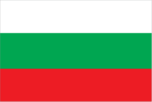
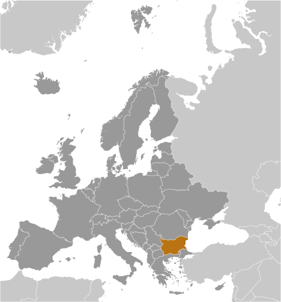
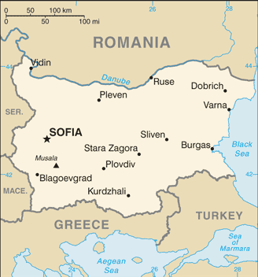

# Bulgaria

## Introduction

**_Background:_**   
The Bulgars, a Central Asian Turkic tribe, merged with the local Slavic inhabitants in the late 7th century to form the first Bulgarian state. In succeeding centuries, Bulgaria struggled with the Byzantine Empire to assert its place in the Balkans, but by the end of the 14th century the country was overrun by the Ottoman Turks. Northern Bulgaria attained autonomy in 1878 and all of Bulgaria became independent from the Ottoman Empire in 1908. Having fought on the losing side in both World Wars, Bulgaria fell within the Soviet sphere of influence and became a People's Republic in 1946. Communist domination ended in 1990, when Bulgaria held its first multiparty election since World War II and began the contentious process of moving toward political democracy and a market economy while combating inflation, unemployment, corruption, and crime. The country joined NATO in 2004 and the EU in 2007.

## Geography

**_Location:_**   
Southeastern Europe, bordering the Black Sea, between Romania and Turkey

**_Geographic coordinates:_**   
43 00 N, 25 00 E

**_Map references:_**   
Europe

**_Area:_**   
**total:** 110,879 sq km   
**land:** 108,489 sq km   
**water:** 2,390 sq km

**_Area - comparative:_**   
slightly larger than Tennessee

**_Land boundaries:_**   
**total:** 1,806 km   
**border countries:** Greece 472 km, Macedonia 162 km, Romania 605 km, Serbia 344 km, Turkey 223 km

**_Coastline:_**   
354 km

**_Maritime claims:_**   
**territorial sea:** 12 nm   
**contiguous zone:** 24 nm   
**exclusive economic zone:** 200 nm

**_Climate:_**   
temperate; cold, damp winters; hot, dry summers

**_Terrain:_**   
mostly mountains with lowlands in north and southeast

**_Elevation extremes:_**   
**lowest point:** Black Sea 0 m   
**highest point:** Musala 2,925 m

**_Natural resources:_**   
bauxite, copper, lead, zinc, coal, timber, arable land

**_Land use:_**   
**arable land:** 29.28%   
**permanent crops:** 1.44%   
**other:** 69.28% (2011)

**_Irrigated land:_**   
1,046 sq km (2007)

**_Total renewable water resources:_**   
21.3 cu km (2011)

**_Freshwater withdrawal (domestic/industrial/agricultural):_**   
**total:** 6.12 cu km/yr (16%/68%/16%)   
**per capita:** 821.8 cu m/yr (2009)

**_Natural hazards:_**   
earthquakes; landslides

**_Environment - current issues:_**   
air pollution from industrial emissions; rivers polluted from raw sewage, heavy metals, detergents; deforestation; forest damage from air pollution and resulting acid rain; soil contamination from heavy metals from metallurgical plants and industrial wastes

**_Environment - international agreements:_**   
**party to:** Air Pollution, Air Pollution-Nitrogen Oxides, Air Pollution-Persistent Organic Pollutants, Air Pollution-Sulfur 85, Air Pollution-Sulfur 94, Air Pollution-Volatile Organic Compounds, Antarctic-Environmental Protocol, Antarctic-Marine Living Resources, Antarctic Treaty, Biodiversity, Climate Change, Climate Change-Kyoto Protocol, Desertification, Endangered Species, Environmental Modification, Hazardous Wastes, Law of the Sea, Marine Dumping, Ozone Layer Protection, Ship Pollution, Wetlands   
**signed, but not ratified:** none of the selected agreements

**_Geography - note:_**   
strategic location near Turkish Straits; controls key land routes from Europe to Middle East and Asia

## People and Society

**_Nationality:_**   
**noun:** Bulgarian(s)   
**adjective:** Bulgarian

**_Ethnic groups:_**   
Bulgarian 76.9%, Turkish 8%, Roma 4.4%, other 0.7% (including Russian, Armenian, and Vlach), other (unknown) 10% (2011 est.)

**_Languages:_**   
Bulgarian (official) 76.8%, Turkish 8.2%, Roma 3.8%, other 0.7%, unspecified 10.5% (2011 est.)

**_Religions:_**   
Eastern Orthodox 59.4%, Muslim 7.8%, other (including Catholic, Protestant, Armenian Apostolic Orthodox, and Jewish) 1.7%, none 3.7%, unspecified 27.4% (2011 est.)

**_Population:_**   
6,924,716 (July 2014 est.)

**_Age structure:_**   
**0-14 years:** 14.2% (male 505,025/female 479,899)   
**15-24 years:** 10.1% (male 359,730/female 340,203)   
**25-54 years:** 42.4% (male 1,459,753/female 1,475,240)   
**55-64 years:** 14% (male 446,784/female 519,513)   
**65 years and over:** 19.3% (male 538,720/female 799,849) (2014 est.)

**_Dependency ratios:_**   
**total dependency ratio:** 50.3 %   
**youth dependency ratio:** 20.8 %   
**elderly dependency ratio:** 29.5 %   
**potential support ratio:** 3.4 (2014 est.)

**_Median age:_**   
**total:** 42.6 years   
**male:** 40.3 years   
**female:** 44.8 years (2014 est.)

**_Population growth rate:_**   
-0.83% (2014 est.)

**_Birth rate:_**   
8.92 births/1,000 population (2014 est.)

**_Death rate:_**   
14.3 deaths/1,000 population (2014 est.)

**_Net migration rate:_**   
-2.89 migrant(s)/1,000 population (2014 est.)

**_Urbanization:_**   
**urban population:** 73.1% of total population (2011)   
**rate of urbanization:** 0.1% annual rate of change (2010-15 est.)

**_Major urban areas - population:_**   
SOFIA (capital) 1.174 million (2011)

**_Sex ratio:_**   
**at birth:** 1.06 male(s)/female   
**0-14 years:** 1.05 male(s)/female   
**15-24 years:** 1.06 male(s)/female   
**25-54 years:** 0.99 male(s)/female   
**55-64 years:** 0.92 male(s)/female   
**65 years and over:** 0.68 male(s)/female   
**total population:** 0.92 male(s)/female (2014 est.)

**_Mother's mean age at first birth:_**   
26.3 (2011 est.)

**_Maternal mortality rate:_**   
11 deaths/100,000 live births (2010)

**_Infant mortality rate:_**   
**total:** 15.08 deaths/1,000 live births   
**male:** 18.07 deaths/1,000 live births   
**female:** 11.91 deaths/1,000 live births (2014 est.)

**_Life expectancy at birth:_**   
**total population:** 74.33 years   
**male:** 70.74 years   
**female:** 78.13 years (2014 est.)

**_Total fertility rate:_**   
1.44 children born/woman (2014 est.)

**_Contraceptive prevalence rate:_**   
69.2%   
**note:** percent of women age 20-49 (2007)

**_Health expenditures:_**   
7.6% of GDP (2010)

**_Physicians density:_**   
3.76 physicians/1,000 population (2010)

**_Hospital bed density:_**   
6.5 beds/1,000 population (2010)

**_Drinking water source:_**   
**improved:** urban: 99.6% of population; rural: 99% of population; total: 99.5% of population   
**unimproved:** urban: 0.4% of population; rural: 1% of population; total: 0.5% of population (2012 est.)

**_Sanitation facility access:_**   
**improved:** urban: 100% of population; rural: 100% of population; total: 100% of population   
**unimproved:** urban: 0% of population; rural: 0% of population; total: 0% of population (2012 est.)

**_HIV/AIDS - adult prevalence rate:_**   
0.1% (2009 est.)

**_HIV/AIDS - people living with HIV/AIDS:_**   
3,800 (2009 est.)

**_HIV/AIDS - deaths:_**   
fewer than 200 (2009 est.)

**_Obesity - adult prevalence rate:_**   
23.7% (2008)

**_Children under the age of 5 years underweight:_**   
1.6% (2004)

**_Education expenditures:_**   
4.1% of GDP (2010)

**_Literacy:_**   
**definition:** age 15 and over can read and write   
**total population:** 98.4%   
**male:** 98.7%   
**female:** 98% (2011 est.)

**_School life expectancy (primary to tertiary education):_**   
**total:** 14 years   
**male:** 14 years   
**female:** 15 years (2011)

**_Unemployment, youth ages 15-24:_**   
**total:** 28.1%   
**male:** 29.5%   
**female:** 26% (2012)

## Government

**_Country name:_**   
**conventional long form:** Republic of Bulgaria   
**conventional short form:** Bulgaria   
**local long form:** Republika Balgariya   
**local short form:** Balgariya

**_Government type:_**   
parliamentary democracy

**_Capital:_**   
**name:** Sofia   
**geographic coordinates:** 42 41 N, 23 19 E   
**time difference:** UTC+2 (7 hours ahead of Washington, DC, during Standard Time)   
**daylight saving time:** +1hr, begins last Sunday in March; ends last Sunday in October

**_Administrative divisions:_**   
28 provinces (oblasti, singular - oblast); Blagoevgrad, Burgas, Dobrich, Gabrovo, Khaskovo, Kurdzhali, Kyustendil, Lovech, Montana, Pazardzhik, Pernik, Pleven, Plovdiv, Razgrad, Ruse, Shumen, Silistra, Sliven, Smolyan, Sofiya (Sofia), Sofiya-Grad (Sofia City), Stara Zagora, Turgovishte, Varna, Veliko Turnovo, Vidin, Vratsa, Yambol

**_Independence:_**   
3 March 1878 (as an autonomous principality within the Ottoman Empire); 22 September 1908 (complete independence from the Ottoman Empire)

**_National holiday:_**   
Liberation Day, 3 March (1878)

**_Constitution:_**   
several previous; latest drafted between late 1990 and early 1991, adopted 12 July 1991; amended several times, last in 2007 (2007)

**_Legal system:_**   
civil law

**_International law organization participation:_**   
accepts compulsory ICJ jurisdiction with reservations; accepts ICCt jurisdiction

**_Suffrage:_**   
18 years of age; universal

**_Executive branch:_**   
**chief of state:** President Rosen PLEVNELIEV (since 22 January 2012); Vice President Margarita POPOVA (since 22 January 2012)   
**head of government:** Prime Minister Plamen ORESHARSKI (since 29 May 2013), Deputy Prime Ministers Zinaida ZLATANOVA (since 29 May 2013), Tsvetlin YOVCHEV (since June 2013), and Daniela BOBEVA (since June 2013)   
**cabinet:** Council of Ministers nominated by the prime minister and elected by the National Assembly   
**elections:** president and vice president elected on the same ticket by popular vote for a five-year term (eligible for a second term); election last held on 23 and 30 October 2011 (next to be held in 2016); chairman of the Council of Ministers (prime minister) elected by the National Assembly; deputy prime ministers nominated by the prime minister and elected by the National Assembly   
**election results:** Rosen PLEVNELIEV elected president in a runoff election; percent of vote - Rosen PLEVNELIEV 52.6%, Ivailo KALFIN 47.4%; Plamen ORESHARSKI elected prime minister; result of legislative vote - 120 to 97

**_Legislative branch:_**   
unicameral National Assembly or Narodno Sabranie (240 seats; members elected by popular vote to serve four-year terms)   
**elections:** last held on 12 May 2013 (next to be held spring 2017)   
**election results:** percent of vote by party - GERB 30.5%, BSP 26.6%, MRF 11.3%, Ataka 7.3%; seats by party - GERB 97, BSP 84, MRF 36, Ataka 23

**_Judicial branch:_**   
**highest court(s):** Supreme Court of Cassation (consists of a chairman and approximately 72 judges organized into penal, civil, and commercial colleges); Supreme Administrative Court (organized in 2 colleges with various panels of 5 judges each); Constitutional Court (consists of 12 justices); note - Constitutional Court resides outside the Judiciary   
**judge selection and term of office:** Supreme Court of Cassation and Supreme Administrative judges elected by the Supreme Judicial Council or SJC (consists of 25 members with extensive legal experience) and appointed by the president; judge tenure NA; Constitutional Court justices elected by the National Assembly and appointed by the president and the SJC; justices appointed for 9-year terms with renewal of four justices every 3 years   
**subordinate courts:** appeals courts; regional and district courts; administrative courts; courts martial

**_Political parties and leaders:_**   
Attack (Ataka) [Volen Nikolov SIDEROV]   
Bulgarian Socialist Party or BSP [Sergei STANISHEV]   
Bulgaria of the Citizens [Meglena KUNEVA]   
Citizens for the European Development of Bulgaria or GERB [Boyko BORISOV]   
Coalition for Bulgaria or CfB [Sergei STANISHEV] (coalition of parties dominated by BSP)   
Democrats for a Strong Bulgaria or DSB [Radan KANEV]   
Internal Macedonian Revolutionary Organization or IMRO [Krasimir KARAKACHANOV]   
Movement for Rights and Freedoms or MRF [Lyutvi MESTAN]   
National Front for the Salvation of Bulgaria or NFSB [Valeri SIMEONOV]   
National Movement for Stability and Progress or NDSV [Hristina HRISTOVA] (formerly National Movement Simeon II or NMS2)   
Order, Law, and Justice or RZS [Yane YANEV]   
Union of Democratic Forces or UDF [Bozhidar LUKARSKI]

**_Political pressure groups and leaders:_**   
Confederation of Independent Trade Unions of Bulgaria or CITUB   
Podkrepa Labor Confederation   
**other:** numerous regional, ethnic, and national interest groups with various agendas

**_International organization participation:_**   
Australia Group, BIS, BSEC, CD, CE, CEI, CERN, EAPC, EBRD, EIB, EU, FAO, G- 9, IAEA, IBRD, ICAO, ICC (national committees), ICRM, IDA, IFC, IFRCS, IHO (pending member), ILO, IMF, IMO, IMSO, Interpol, IOC, IOM, IPU, ISO, ITSO, ITU, ITUC (NGOs), MIGA, NATO, NSG, OAS (observer), OIF, OPCW, OSCE, PCA, SELEC, UN, UNCTAD, UNESCO, UNHCR, UNIDO, UNMIL, UNWTO, UPU, WCO, WFTU (NGOs), WHO, WIPO, WMO, WTO, ZC

**_Diplomatic representation in the US:_**   
**chief of mission:** Ambassador Elena POPTODOROVA (since 4 August 2010)   
**chancery:** 1621 22nd Street NW, Washington, DC 20008   
**telephone:** [1] (202) 387-0174   
**FAX:** [1] (202) 234-7973   
**consulate(s) general:** Chicago, Los Angeles, New York

**_Diplomatic representation from the US:_**   
**chief of mission:** Ambassador Marcie B. RIES (since 5 September 2012)   
**embassy:** 16 Kozyak Street, Sofia 1408   
**mailing address:** American Embassy Sofia, US Department of State, 5740 Sofia Place, Washington, DC 20521-5740   
**telephone:** [359] (2) 937-5100   
**FAX:** [359] (2) 937-5320

**_Flag description:_**   
three equal horizontal bands of white (top), green, and red; the pan-Slavic white-blue-red colors were modified by substituting a green band (representing freedom) for the blue   
**note:** the national emblem, formerly on the hoist side of the white stripe, has been removed

**_National symbol(s):_**   
lion

**_National anthem:_**   
**name:** "Mila Rodino" (Dear Homeland)   
**lyrics/music:** Tsvetan Tsvetkov RADOSLAVOV   
**note:** adopted 1964; the anthem was composed in 1885 by a student en route to fight in the Serbo-Bulgarian War

## Economy

**_Economy - overview:_**   
Bulgaria, a former Communist country that entered the EU on 1 January 2007, averaged more than 6% annual growth from 2004 to 2008, driven by significant amounts of bank lending, consumption, and foreign direct investment. Successive governments have demonstrated a commitment to economic reforms and responsible fiscal planning, but the global downturn sharply reduced domestic demand, exports, capital inflows, and industrial production. GDP contracted by 5.5% in 2009, and has been slow to recover in the years since. Despite having a favorable investment regime, including low, flat corporate income taxes, significant challenges remain. Corruption in public administration, a weak judiciary, and the presence of organized crime continue to hamper the country's investment climate and economic prospects.

**_GDP (purchasing power parity):_**   
$104.6 billion (2013 est.)   
$104.1 billion (2012 est.)   
$103.3 billion (2011 est.)   
**note:** data are in 2013 US dollars

**_GDP (official exchange rate):_**   
$53.7 billion (2013 est.)

**_GDP - real growth rate:_**   
0.5% (2013 est.)   
0.8% (2012 est.)   
1.8% (2011 est.)

**_GDP - per capita (PPP):_**   
$14,400 (2013 est.)   
$14,300 (2012 est.)   
$14,100 (2011 est.)   
**note:** data are in 2013 US dollars

**_Gross national saving:_**   
23.5% of GDP (2013 est.)   
22.5% of GDP (2012 est.)   
22% of GDP (2011 est.)

**_GDP - composition, by end use:_**   
**household consumption:** 70.4%   
**government consumption:** 7.9%   
**investment in fixed capital:** 21.3%   
**investment in inventories:** 2.5%   
**exports of goods and services:** 69.7%   
**imports of goods and services:** -71.8%; (2013 est.)

**_GDP - composition, by sector of origin:_**   
**agriculture:** 6.7%   
**industry:** 30.3%   
**services:** 63% (2013 est.)

**_Agriculture - products:_**   
vegetables, fruits, tobacco, wine, wheat, barley, sunflowers, sugar beets; livestock

**_Industries:_**   
electricity, gas, water; food, beverages, tobacco; machinery and equipment, base metals, chemical products, coke, refined petroleum, nuclear fuel

**_Industrial production growth rate:_**   
1% (2013 est.)

**_Labor force:_**   
2.551 million (2013 est.)

**_Labor force - by occupation:_**   
**agriculture:** 7.1%   
**industry:** 35.2%   
**services:** 57.7% (2009)

**_Unemployment rate:_**   
11.6% (2013 est.)   
11.1% (2012 est.)

**_Population below poverty line:_**   
21.8% (2008)

**_Household income or consumption by percentage share:_**   
**lowest 10%:** 2%   
**highest 10%:** 35.2% (2007)

**_Distribution of family income - Gini index:_**   
45.3 (2007)   
26 (2001)

**_Budget:_**   
**revenues:** $18.81 billion   
**expenditures:** $20.12 billion (2013 est.)

**_Taxes and other revenues:_**   
35% of GDP (2013 est.)

**_Budget surplus (+) or deficit (-):_**   
-2.4% of GDP (2013 est.)

**_Public debt:_**   
18.4% of GDP (2013 est.)   
16.3% of GDP (2012 est.)   
defined by the EU's Maastricht Treaty as consolidated general government gross debt at nominal value, outstanding at the end of the year in the following categories of government liabilities: currency and deposits, securities other than shares excluding financial derivatives, and loans; general government sector comprises the subsectors: central government, state government, local government, and social security funds

**_Fiscal year:_**   
calendar year

**_Inflation rate (consumer prices):_**   
1.5% (2013 est.)   
3% (2012 est.)

**_Central bank discount rate:_**   
$NA (31 December 2012 est.)   
0.22% (31 December 2011 est.)   
**note:** Bulgarian National Bank (BNB) has had no independent monetary policy since the introduction of the Currency Board regime in 1997; this is BNB's base interest rate

**_Commercial bank prime lending rate:_**   
9.1% (31 December 2013 est.)   
9.72% (31 December 2012 est.)

**_Stock of narrow money:_**   
$17.55 billion (31 December 2013 est.)   
$15.51 billion (31 December 2012 est.)

**_Stock of broad money:_**   
$45.84 billion (31 December 2013 est.)   
$41.53 billion (31 December 2012 est.)

**_Stock of domestic credit:_**   
$37.6 billion (31 December 2013 est.)   
$37.12 billion (31 December 2012 est.)

**_Market value of publicly traded shares:_**   
$6.666 billion (31 December 2012 est.)   
$8.253 billion (31 December 2011)   
$7.276 billion (31 December 2010 est.)

**_Current account balance:_**   
-$182.3 million (2013 est.)   
-$669.5 million (2012 est.)

**_Exports:_**   
$27.9 billion (2013 est.)   
$26.7 billion (2012 est.)

**_Exports - commodities:_**   
clothing, footwear, iron and steel, machinery and equipment, fuels

**_Exports - partners:_**   
Germany 10.4%, Turkey 9.1%, Italy 8.7%, Romania 8.2%, Greece 7.3%, France 4% (2012)

**_Imports:_**   
$32.88 billion (2013 est.)   
$31.15 billion (2012 est.)

**_Imports - commodities:_**   
machinery and equipment; metals and ores; chemicals and plastics; fuels, minerals, and raw materials

**_Imports - partners:_**   
Russia 20.9%, Germany 11.3%, Italy 6.7%, Romania 6.6%, Greece 6.1%, Turkey 4.6%, Spain 4.5% (2012)

**_Reserves of foreign exchange and gold:_**   
$20.69 billion (31 December 2013 est.)   
$20.5 billion (31 December 2012 est.)

**_Debt - external:_**   
$37.85 billion (31 December 2013 est.)   
$36.52 billion (31 December 2012 est.)

**_Stock of direct foreign investment - at home:_**   
$54.21 billion (31 December 2013 est.)   
$52.21 billion (31 December 2012 est.)

**_Stock of direct foreign investment - abroad:_**   
$1.939 billion (31 December 2013 est.)   
$1.82 billion (31 December 2012 est.)

**_Exchange rates:_**   
leva (BGN) per US dollar -   
1.478 (2013 est.)   
1.5221 (2012 est.)   
1.4774 (2010 est.)   
1.404 (2009)   
1.3171 (2008)

## Energy

**_Electricity - production:_**   
43.39 billion kWh (2010 est.)

**_Electricity - consumption:_**   
30.46 billion kWh (2010 est.)

**_Electricity - exports:_**   
12.11 billion kWh (2011 est.)

**_Electricity - imports:_**   
1.45 billion kWh (2011 est.)

**_Electricity - installed generating capacity:_**   
10.01 million kW (2010 est.)

**_Electricity - from fossil fuels:_**   
45.7% of total installed capacity (2010 est.)

**_Electricity - from nuclear fuels:_**   
19% of total installed capacity (2010 est.)

**_Electricity - from hydroelectric plants:_**   
21.8% of total installed capacity (2010 est.)

**_Electricity - from other renewable sources:_**   
4.8% of total installed capacity (2010 est.)

**_Crude oil - production:_**   
3,384 bbl/day (2012 est.)

**_Crude oil - exports:_**   
0 bbl/day (2012 est.)

**_Crude oil - imports:_**   
124,700 bbl/day (2010 est.)

**_Crude oil - proved reserves:_**   
15 million bbl (1 January 2013 est.)

**_Refined petroleum products - production:_**   
128,500 bbl/day (2010 est.)

**_Refined petroleum products - consumption:_**   
112,700 bbl/day (2011 est.)

**_Refined petroleum products - exports:_**   
73,740 bbl/day (2010 est.)

**_Refined petroleum products - imports:_**   
50,130 bbl/day (2010 est.)

**_Natural gas - production:_**   
410 million cu m (2011 est.)

**_Natural gas - consumption:_**   
2.54 billion cu m (2010 est.)

**_Natural gas - exports:_**   
0 cu m (2011 est.)

**_Natural gas - imports:_**   
2.64 billion cu m (2011 est.)

**_Natural gas - proved reserves:_**   
5.663 billion cu m (1 January 2013 est.)

**_Carbon dioxide emissions from consumption of energy:_**   
52.44 million Mt (2011 est.)

## Communications

**_Telephones - main lines in use:_**   
2.253 million (2012)

**_Telephones - mobile cellular:_**   
10.78 million (2012)

**_Telephone system:_**   
**general assessment:** inherited an extensive but antiquated telecommunications network from the Soviet era; quality has improved with a modern digital trunk line now connecting switching centers in most of the regions; remaining areas are connected by digital microwave radio relay   
**domestic:** the Bulgaria Telecommunications Company's fixed-line monopoly terminated in 2005 in an effort to upgrade fixed-line services; mobile-cellular teledensity, fostered by multiple service providers, has reached 150 telephones per 100 persons   
**international:** country code - 359; submarine cable provides connectivity to Ukraine and Russia; a combination submarine cable and land fiber-optic system provides connectivity to Italy, Albania, and Macedonia; satellite earth stations - 3 (1 Intersputnik in the Atlantic Ocean region, 2 Intelsat in the Atlantic and Indian Ocean regions) (2011)

**_Broadcast media:_**   
4 national terrestrial TV stations with 1 state-owned and 3 privately owned; a vast array of TV stations are available from cable and satellite TV providers; state-owned national radio broadcasts over 3 networks; large number of private radio stations broadcasting, especially in urban areas (2010)

**_Internet country code:_**   
.bg

**_Internet hosts:_**   
976,277 (2012)

**_Internet users:_**   
3.395 million (2009)

## Transportation

**_Airports:_**   
68 (2013)

**_Airports - with paved runways:_**   
**total:** 57   
**over 3,047 m:** 2   
**2,438 to 3,047 m:** 17   
**1,524 to 2,437 m:** 12   
**under 914 m:** 26 (2013)

**_Airports - with unpaved runways:_**   
**total:** 11   
**914 to 1,523 m:** 2   
**under 914 m:** 9 (2013)

**_Heliports:_**   
1 (2013)

**_Pipelines:_**   
gas 2,887 km; oil 346 km; refined products 378 km (2013)

**_Railways:_**   
**total:** 4,152 km   
**standard gauge:** 4,072 km 1.435-m gauge (2,863 km electrified)   
**narrow gauge:** 80 km 0.760-m gauge (2011)

**_Roadways:_**   
**total:** 19,512 km   
**paved:** 19,235 km (includes 458 km of expressways)   
**unpaved:** 277 km   
**note:** does not include Category IV local roads (2011)

**_Waterways:_**   
470 km (2009)

**_Merchant marine:_**   
**total:** 22   
**by type:** bulk carrier 9, cargo 8, liquefied gas 2, petroleum tanker 1, roll on/roll off 2   
**foreign-owned:** 14 (Germany 12, Russia 2)   
**registered in other countries:** 30 (Belize 1, Comoros 4, Georgia 1, Malta 8, Moldova 1, Panama 6, Saint Vincent and the Grenadines 9) (2010)

**_Ports and terminals:_**   
**major seaport(s):** Burgas, Varna (Black Sea)

## Military

**_Military branches:_**   
Bulgarian Armed Forces: Ground Forces, Naval Forces, Bulgarian Air Forces (Bulgarski Voennovazdyshni Sily, BVVS) (2011)

**_Military service age and obligation:_**   
18-27 years of age for voluntary military service; conscription ended in January 2008; service obligation 6-9 months (2012)

**_Manpower available for military service:_**   
**males age 16-49:** 1,637,470   
**females age 16-49:** 1,621,352 (2010 est.)

**_Manpower fit for military service:_**   
**males age 16-49:** 1,320,955   
**females age 16-49:** 1,337,616 (2010 est.)

**_Manpower reaching militarily significant age annually:_**   
**male:** 33,444   
**female:** 32,075 (2010 est.)

**_Military expenditures:_**   
1.46% of GDP (2012)   
1.55% of GDP (2011)   
1.46% of GDP (2010)

## Transnational Issues

**_Disputes - international:_**   
none

**_Illicit drugs:_**   
major European transshipment point for Southwest Asian heroin and, to a lesser degree, South American cocaine for the European market; limited producer of precursor chemicals; vulnerable to money laundering because of corruption, organized crime; some money laundering of drug-related proceeds through financial institutions (2008)

............................................................   
_Page last updated on June 23, 2014_
