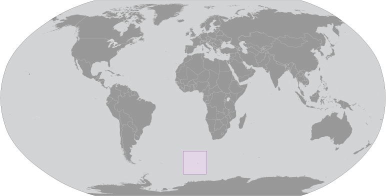

# Bouvet Island

_territory of Norway_

## Introduction

**_Background:_**   
This uninhabited, volcanic, Antarctic island is almost entirely covered by glaciers making it difficult to approach; it is recognized as the most remote island on Earth. Bouvet Island was discovered in 1739 by a French naval officer after whom it is named. No claim was made until 1825, when the British flag was raised. In 1928, the UK waived its claim in favor of Norway, which had occupied the island the previous year. In 1971, Norway designated Bouvet Island and the adjacent territorial waters a nature reserve. Since 1977, Norway has run an automated meteorological station and studied foraging strategies and distribution of fur seals and penguins on the island.

## Geography

**_Location:_**   
island in the South Atlantic Ocean, southwest of the Cape of Good Hope (South Africa)

**_Geographic coordinates:_**   
54 26 S, 3 24 E

**_Map references:_**   
Antarctic Region

**_Area:_**   
**total:** 49 sq km   
**land:** 49 sq km   
**water:** 0 sq km

**_Area - comparative:_**   
about 0.3 times the size of Washington, DC

**_Land boundaries:_**   
0 km

**_Coastline:_**   
29.6 km

**_Maritime claims:_**   
**territorial sea:** 4 nm

**_Climate:_**   
antarctic

**_Terrain:_**   
volcanic; coast is mostly inaccessible

**_Elevation extremes:_**   
**lowest point:** South Atlantic Ocean 0 m   
**highest point:** Olav Peak 935 m

**_Natural resources:_**   
none

**_Land use:_**   
**arable land:** 0%   
**permanent crops:** 0%   
**other:** 100% (93% ice) (2011)

**_Natural hazards:_**   
NA

**_Environment - current issues:_**   
NA

**_Geography - note:_**   
covered by glacial ice; declared a nature reserve by Norway

## People and Society

**_Population:_**   
uninhabited

## Government

**_Country name:_**   
**conventional long form:** none   
**conventional short form:** Bouvet Island

**_Dependency status:_**   
territory of Norway; administered by the Polar Department of the Ministry of Justice and Oslo Police

**_Legal system:_**   
the laws of Norway, where applicable, apply

**_Flag description:_**   
the flag of Norway is used

## Economy

**_Economy - overview:_**   
no economic activity; declared a nature reserve

## Communications

**_Internet country code:_**   
.bv

**_Internet hosts:_**   
6 (2012)

**_Communications - note:_**   
has an automatic meteorological station

## Transportation

**_Ports and terminals:_**   
none; offshore anchorage only

## Military

**_Military - note:_**   
defense is the responsibility of Norway

## Transnational Issues

**_Disputes - international:_**   
none

............................................................   
_Page last updated on March 27, 2014_
