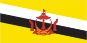
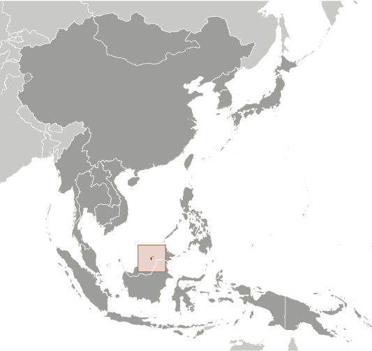
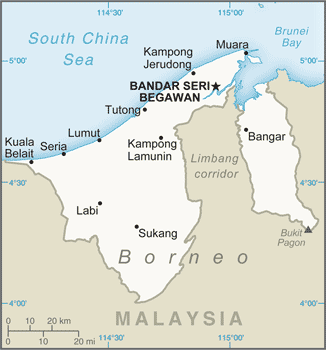

# Brunei

## Introduction

**_Background:_**   
The Sultanate of Brunei's influence peaked between the 15th and 17th centuries when its control extended over coastal areas of northwest Borneo and the southern Philippines. Brunei subsequently entered a period of decline brought on by internal strife over royal succession, colonial expansion of European powers, and piracy. In 1888, Brunei became a British protectorate; independence was achieved in 1984. The same family has ruled Brunei for over six centuries. Brunei benefits from extensive petroleum and natural gas fields, the source of one of the highest per capita GDPs in Asia.

## Geography

**_Location:_**   
Southeastern Asia, bordering the South China Sea and Malaysia

**_Geographic coordinates:_**   
4 30 N, 114 40 E

**_Map references:_**   
Southeast Asia

**_Area:_**   
**total:** 5,765 sq km   
**land:** 5,265 sq km   
**water:** 500 sq km

**_Area - comparative:_**   
slightly smaller than Delaware

**_Land boundaries:_**   
**total:** 266 km   
**border countries:** Malaysia 266 km

**_Coastline:_**   
161 km

**_Maritime claims:_**   
**territorial sea:** 12 nm   
**exclusive economic zone:** 200 nm or to median line

**_Climate:_**   
tropical; hot, humid, rainy

**_Terrain:_**   
flat coastal plain rises to mountains in east; hilly lowland in west

**_Elevation extremes:_**   
**lowest point:** South China Sea 0 m   
**highest point:** Bukit Pagon 1,850 m

**_Natural resources:_**   
petroleum, natural gas, timber

**_Land use:_**   
**arable land:** 0.52%   
**permanent crops:** 0.87%   
**other:** 98.61% (2011)

**_Irrigated land:_**   
10 sq km (2003)

**_Total renewable water resources:_**   
8.5 cu km (2011)

**_Freshwater withdrawal (domestic/industrial/agricultural):_**   
**total:** 0.09 cu km/yr (97%/0%/3%)   
**per capita:** 301.6 cu m/yr (2009)

**_Natural hazards:_**   
typhoons, earthquakes, and severe flooding are rare

**_Environment - current issues:_**   
seasonal smoke/haze resulting from forest fires in Indonesia

**_Environment - international agreements:_**   
**party to:** Biodiversity, Climate Change, Desertification, Endangered Species, Hazardous Wastes, Law of the Sea, Ozone Layer Protection, Ship Pollution   
**signed, but not ratified:** none of the selected agreements

**_Geography - note:_**   
close to vital sea lanes through South China Sea linking Indian and Pacific Oceans; two parts physically separated by Malaysia; almost an enclave within Malaysia

## People and Society

**_Nationality:_**   
**noun:** Bruneian(s)   
**adjective:** Bruneian

**_Ethnic groups:_**   
Malay 65.7%, Chinese 10.3%, other indigenous 3.4%, other 20.6% (2011 est.)

**_Languages:_**   
Malay (official), English, Chinese

**_Religions:_**   
Muslim (official) 78.8%, Christian 8.7%, Buddhist 7.8%, other (includes indigenous beliefs) 4.7% (2011 est.)

**_Population:_**   
422,675 (July 2014 est.)

**_Age structure:_**   
**0-14 years:** 24.2% (male 52,753/female 49,548)   
**15-24 years:** 17.3% (male 36,187/female 36,965)   
**25-54 years:** 46.9% (male 96,006/female 102,028)   
**55-64 years:** 7.6% (male 16,542/female 15,589)   
**65 years and over:** 4% (male 8,301/female 8,756) (2014 est.)

**_Dependency ratios:_**   
**total dependency ratio:** 41.8 %   
**youth dependency ratio:** 35.3 %   
**elderly dependency ratio:** 6.5 %   
**potential support ratio:** 15.5 (2014 est.)

**_Median age:_**   
**total:** 29.3 years   
**male:** 28.9 years   
**female:** 29.6 years (2014 est.)

**_Population growth rate:_**   
1.65% (2014 est.)

**_Birth rate:_**   
17.49 births/1,000 population (2014 est.)

**_Death rate:_**   
3.47 deaths/1,000 population (2014 est.)

**_Net migration rate:_**   
2.47 migrant(s)/1,000 population (2014 est.)

**_Urbanization:_**   
**urban population:** 76% of total population (2011)   
**rate of urbanization:** 2.13% annual rate of change (2010-15 est.)

**_Major urban areas - population:_**   
BANDAR SERI BEGAWAN (capital) 241,000   
**note:** the boundaries of the capital city were expanded in 2007, greatly increasing the city area; the population of the capital increased tenfold (2011)

**_Sex ratio:_**   
**at birth:** 1.05 male(s)/female   
**0-14 years:** 1.07 male(s)/female   
**15-24 years:** 0.98 male(s)/female   
**25-54 years:** 0.94 male(s)/female   
**55-64 years:** 0.99 male(s)/female   
**65 years and over:** 0.95 male(s)/female   
**total population:** 1 male(s)/female (2014 est.)

**_Maternal mortality rate:_**   
24 deaths/100,000 live births (2010)

**_Infant mortality rate:_**   
**total:** 10.48 deaths/1,000 live births   
**male:** 12.48 deaths/1,000 live births   
**female:** 8.39 deaths/1,000 live births (2014 est.)

**_Life expectancy at birth:_**   
**total population:** 76.77 years   
**male:** 74.46 years   
**female:** 79.19 years (2014 est.)

**_Total fertility rate:_**   
1.82 children born/woman (2014 est.)

**_Health expenditures:_**   
2.5% of GDP (2011)

**_Physicians density:_**   
1.36 physicians/1,000 population (2010)

**_Hospital bed density:_**   
2.8 beds/1,000 population (2011)

**_HIV/AIDS - adult prevalence rate:_**   
less than 0.1% (2003 est.)

**_HIV/AIDS - people living with HIV/AIDS:_**   
fewer than 200 (2003 est.)

**_HIV/AIDS - deaths:_**   
fewer than 200 (2003 est.)

**_Obesity - adult prevalence rate:_**   
7.5% (2008)

**_Education expenditures:_**   
3.5% of GDP (2013)

**_Literacy:_**   
**definition:** age 15 and over can read and write   
**total population:** 95.4%   
**male:** 97%   
**female:** 93.9% (2011 est.)

**_School life expectancy (primary to tertiary education):_**   
**total:** 15 years   
**male:** 14 years   
**female:** 15 years (2012)

## Government

**_Country name:_**   
**conventional long form:** Brunei Darussalam   
**conventional short form:** Brunei   
**local long form:** Negara Brunei Darussalam   
**local short form:** Brunei

**_Government type:_**   
constitutional sultanate (locally known as Malay Islamic Monarchy)

**_Capital:_**   
**name:** Bandar Seri Begawan   
**geographic coordinates:** 4 53 N, 114 56 E   
**time difference:** UTC+8 (13 hours ahead of Washington, DC, during Standard Time)

**_Administrative divisions:_**   
4 districts (daerah-daerah, singular - daerah); Belait, Brunei-Muara, Temburong, Tutong

**_Independence:_**   
1 January 1984 (from the UK)

**_National holiday:_**   
National Day, 23 February (1984); note - 1 January 1984 was the date of independence from the UK, 23 February 1984 was the date of independence from British protection

**_Constitution:_**   
drafted 1954 to 1959, signed 29 September 1959; amended 1984, 2004, 2011; note - some constitutional provisions suspended since 1962 under a State of Emergency, others since independence in 1984 (2011)

**_Legal system:_**   
mixed legal system based on English common law and Islamic law; note - in May 2014, the first sharia-based penal codes were instituted and apply to Muslims and non-Muslims

**_International law organization participation:_**   
has not submitted an ICJ jurisdiction declaration; non-party state to the ICCt

**_Suffrage:_**   
18 years of age for village elections; universal

**_Executive branch:_**   
**chief of state:** Sultan and Prime Minister Sir HASSANAL Bolkiah (since 5 October 1967); note - the monarch is both chief of state (Yang Di-Pertuan Agong) and head of government   
**head of government:** Sultan and Prime Minister Sir HASSANAL Bolkiah (since 5 October 1967)   
**cabinet:** Council of Cabinet Ministers appointed and presided over by the monarch; deals with executive matters; note - there is also a Religious Council (members appointed by the monarch) that advises on religious matters, a Privy Council (members appointed by the monarch) that deals with constitutional matters, and the Council of Succession (members appointed by the monarch) that determines the succession to the throne if the need arises   
**elections:** none; the monarchy is hereditary

**_Legislative branch:_**   
the Sultan appointed a Legislative Council with 29 members in September 2005; he increased the size of the council to 33 members in June 2011; the council meets annually in March   
**elections:** last held in March 1962 (date of next election NA)   
**note:** the Legislative Council met on 25 September 2004 for first time in 20 years with 21 members appointed by the Sultan; it passed constitutional amendments calling for a 45-seat council with 15 elected members; no timeframe for an election was announced

**_Judicial branch:_**   
**highest court(s):** Supreme Court (consists of Court of Appeal and High Court, each with a chief justice and 2 judges); Sharia Court of Appeal (consists of judges appointed by the monarch); note - Brunei has a dual judicial system of secular and sharia (religious) courts; the Judicial Committee of Privy Council in London serves as the final appellate court for civil cases only   
**judge selection and term of office:** Supreme Court judges appointed by the monarch to serve until age 65, and older if approved by the monarch; Sharia Court of Appeal judges appointed by the monarch; judge tenure NA   
**subordinate courts:** Intermediate Court; Magistrate's Courts; Juvenile Court; small claims courts; lower sharia courts (2006)

**_Political parties and leaders:_**   
National Development Party or NDP [YASSIN Affendi]   
**note:** Brunei National Solidarity Party or PPKB [Abdul LATIF bin Chuchu] and People's Awareness Party or PAKAR [Awang Haji MAIDIN bin Haji Ahmad] were deregistered in 2007; parties are small and have limited activity

**_Political pressure groups and leaders:_**   
NA

**_International organization participation:_**   
ADB, APEC, ARF, ASEAN, C, CP, EAS, G-77, IBRD, ICAO, ICC (NGOs), ICRM, IDA, IDB, IFRCS, ILO, IMF, IMO, IMSO, Interpol, IOC, ISO (correspondent), ITSO, ITU, NAM, OIC, OPCW, UN, UNCTAD, UNESCO, UNIFIL, UNWTO, UPU, WCO, WHO, WIPO, WMO, WTO

**_Diplomatic representation in the US:_**   
**chief of mission:** Ambassador Dato Yusoff Abd HAMID (since 2 October 2009)   
**chancery:** 3520 International Court NW #300, Washington, DC 20008   
**telephone:** [1] (202) 237-1838   
**FAX:** [1] (202) 885-0560

**_Diplomatic representation from the US:_**   
**chief of mission:** Ambassador Daniel L. SHIELDS III (since 28 March 2011)   
**embassy:** Simpang 336-52-16-9, Jalan Datu, Bandar Seri Begawan, BC4115   
**mailing address:** Unit 4280, Box 40, FPO AP 96507; P.O. Box 2991, Bandar Seri Begawan BS8675, Negara Brunei Darussalam   
**telephone:** [673] 238-4616   
**FAX:** [673] 238-4604

**_Flag description:_**   
yellow with two diagonal bands of white (top, almost double width) and black starting from the upper hoist side; the national emblem in red is superimposed at the center; yellow is the color of royalty and symbolizes the sultanate; the white and black bands denote Brunei's chief ministers; the emblem includes five main components: a swallow-tailed flag, the royal umbrella representing the monarchy, the wings of four feathers symbolizing justice, tranquility, prosperity, and peace, the two upraised hands signifying the government's pledge to preserve and promote the welfare of the people, and the crescent moon denoting Islam, the state religion; the state motto "Always render service with God's guidance" appears in yellow Arabic script on the crescent; a ribbon below the crescent reads "Brunei, the Abode of Peace"

**_National anthem:_**   
**name:** "Allah Peliharakan Sultan" (God Bless His Majesty)   
**lyrics/music:** Pengiran Haji Mohamed YUSUF bin Pengiran Abdul Rahim/Awang Haji BESAR bin Sagap   
**note:** adopted 1951

## Economy

**_Economy - overview:_**   
Brunei has a small well-to-do economy that depends on revenue from natural resource extraction but encompasses a mixture of foreign and domestic entrepreneurship, government regulation, welfare measures, and village tradition. Crude oil and natural gas production account for 60% of GDP and more than 90% of exports. Per capita GDP is among the highest in Asia, and substantial income from overseas investment supplements income from domestic production. For Bruneian citizens the government provides for all medical services and free education through the university level. The government of Brunei has been emphasizing through policy and resource investments it strong desire to diversity its economy both within the oil and gas sector and to new sectors.

**_GDP (purchasing power parity):_**   
$22.25 billion (2013 est.)   
$21.93 billion (2012 est.)   
$21.73 billion (2011 est.)   
**note:** data are in 2013 US dollars

**_GDP (official exchange rate):_**   
$16.56 billion (2013 est.)

**_GDP - real growth rate:_**   
1.4% (2013 est.)   
0.9% (2012 est.)   
3.4% (2011 est.)

**_GDP - per capita (PPP):_**   
$54,800 (2013 est.)   
$54,900 (2012 est.)   
$55,200 (2011 est.)   
**note:** data are in 2013 US dollars

**_GDP - composition, by end use:_**   
**household consumption:** 22.1%   
**government consumption:** 18.2%   
**investment in fixed capital:** 14.6%   
**investment in inventories:** 0%   
**exports of goods and services:** 78.4%   
**imports of goods and services:** -33.3%; (2013 est.)

**_GDP - composition, by sector of origin:_**   
**agriculture:** 0.7%   
**industry:** 70.9%   
**services:** 28.4% (2013 est.)

**_Agriculture - products:_**   
rice, vegetables, fruits; chickens, water buffalo, cattle, goats, eggs

**_Industries:_**   
petroleum, petroleum refining, liquefied natural gas, construction, agriculture, transportation

**_Industrial production growth rate:_**   
1.5% (2013 est.)

**_Labor force:_**   
205,800 (2011 est.)

**_Labor force - by occupation:_**   
**agriculture:** 4.2%   
**industry:** 62.8%   
**services:** 33% (2008 est.)

**_Unemployment rate:_**   
2.6% (2011)   
2.7% (2010)

**_Population below poverty line:_**   
NA%

**_Household income or consumption by percentage share:_**   
**lowest 10%:** NA%   
**highest 10%:** NA%

**_Budget:_**   
**revenues:** $6.992 billion   
**expenditures:** $5.366 billion (2013 est.)

**_Taxes and other revenues:_**   
42.2% of GDP (2013 est.)

**_Budget surplus (+) or deficit (-):_**   
9.8% of GDP (2013 est.)

**_Fiscal year:_**   
1 April - 31 March

**_Inflation rate (consumer prices):_**   
1% (2013 est.)   
0.5% (2012 est.)

**_Commercial bank prime lending rate:_**   
5.5% (31 December 2013 est.)   
5.5% (31 December 2012 est.)

**_Stock of narrow money:_**   
$3.472 billion (31 December 2013 est.)   
$3.509 billion (31 December 2012 est.)

**_Stock of broad money:_**   
$11.92 billion (31 December 2013 est.)   
$11.41 billion (31 December 2012 est.)

**_Stock of domestic credit:_**   
$2.846 billion (31 December 2013 est.)   
$2.351 billion (31 December 2012 est.)

**_Market value of publicly traded shares:_**   
$NA

**_Current account balance:_**   
$3.977 billion (2009 est.)

**_Exports:_**   
$12.75 billion (2011)   
$9.88 billion (2010)

**_Exports - commodities:_**   
crude oil, natural gas, garments

**_Exports - partners:_**   
Japan 45.7%, South Korea 15.1%, Australia 9.1%, NZ 6.6%, India 5.8%, Vietnam 4.7% (2012)

**_Imports:_**   
$3.02 billion (2011 est.)   
$2.73 billion (2010 est.)

**_Imports - commodities:_**   
iron and steel, motor vehicles, machinery and transport equipment, manufactured goods, food, chemicals

**_Imports - partners:_**   
Singapore 26.3%, China 21.3%, UK 21.3%, Malaysia 11.8% (2012)

**_Debt - external:_**   
$0 (2005)

**_Exchange rates:_**   
Bruneian dollars (BND) per US dollar -   
1.23 (2013 est.)   
1.2496 (2012 est.)   
1.3635 (2010 est.)   
1.45 (2009)

## Energy

**_Electricity - production:_**   
3.723 billion kWh (2011 est.)

**_Electricity - consumption:_**   
3.391 billion kWh (2011 est.)

**_Electricity - exports:_**   
0 kWh (2012 est.)

**_Electricity - imports:_**   
0 kWh (2012 est.)

**_Electricity - installed generating capacity:_**   
759,000 kW (2010 est.)

**_Electricity - from fossil fuels:_**   
100% of total installed capacity (2010 est.)

**_Electricity - from nuclear fuels:_**   
0% of total installed capacity (2010 est.)

**_Electricity - from hydroelectric plants:_**   
0% of total installed capacity (2010 est.)

**_Electricity - from other renewable sources:_**   
0% of total installed capacity (2010 est.)

**_Crude oil - production:_**   
141,000 bbl/day (2012 est.)

**_Crude oil - exports:_**   
147,900 bbl/day (2010 est.)

**_Crude oil - imports:_**   
0 bbl/day (2011 est.)

**_Crude oil - proved reserves:_**   
1.1 billion bbl (1 January 2013 est.)

**_Refined petroleum products - production:_**   
13,500 bbl/day (2010 est.)

**_Refined petroleum products - consumption:_**   
14,640 bbl/day (2011 est.)

**_Refined petroleum products - exports:_**   
0 bbl/day (2010 est.)

**_Refined petroleum products - imports:_**   
3,198 bbl/day (2010 est.)

**_Natural gas - production:_**   
12.44 billion cu m (2011 est.)

**_Natural gas - consumption:_**   
2.97 billion cu m (2010 est.)

**_Natural gas - exports:_**   
9.42 billion cu m (2011 est.)

**_Natural gas - imports:_**   
0 cu m (2011 est.)

**_Natural gas - proved reserves:_**   
390.8 billion cu m (1 January 2013 est.)

**_Carbon dioxide emissions from consumption of energy:_**   
8.656 million Mt (2011 est.)

## Communications

**_Telephones - main lines in use:_**   
70,933 (2012)

**_Telephones - mobile cellular:_**   
469,700 (2012)

**_Telephone system:_**   
**general assessment:** service throughout the country is good; international service is good to Southeast Asia, Middle East, Western Europe, and the US   
**domestic:** every service available   
**international:** country code - 673; landing point for the SEA-ME-WE-3 optical telecommunications submarine cable that provides links to Asia, the Middle East, and Europe; the Asia-America Gateway submarine cable network provides new links to Asia and the US; satellite earth stations - 2 Intelsat (1 Indian Ocean and 1 Pacific Ocean) (2011)

**_Broadcast media:_**   
state-controlled Radio Television Brunei (RTB) operates 5 channels; 3 Malaysian TV stations are available; foreign TV broadcasts are available via satellite and cable systems; RTB operates 5 radio networks and broadcasts on multiple frequencies; British Forces Broadcast Service (BFBS) provides radio broadcasts on 2 FM stations; some radio broadcast stations from Malaysia are available via repeaters (2009)

**_Internet country code:_**   
.bn

**_Internet hosts:_**   
49,457 (2012)

**_Internet users:_**   
314,900 (2009)

## Transportation

**_Airports:_**   
1 (2013)

**_Airports - with paved runways:_**   
**total:** 1   
**over 3,047 m:** 1 (2013)

**_Heliports:_**   
3 (2013)

**_Pipelines:_**   
condensate 33 km; condensate/gas 86 km; gas 628 km; oil 492 km (2013)

**_Roadways:_**   
**total:** 3,029 km   
**paved:** 2,425 km   
**unpaved:** 604 km (2010)

**_Waterways:_**   
209 km (navigable by craft drawing less than 1.2 m; the Belait, Brunei, and Tutong rivers are major transport links) (2012)

**_Merchant marine:_**   
**total:** 9   
**by type:** chemical tanker 1, liquefied gas 8   
**foreign-owned:** 2 (UK 2) (2010)

**_Ports and terminals:_**   
**major seaport(s):** Muara   
**oil/gas terminal(s):** Lumut, Seria   
**LNG terminal (export):** Lumut

## Military

**_Military branches:_**   
Royal Brunei Armed Forces: Royal Brunei Land Forces, Royal Brunei Navy, Royal Brunei Air Force (Tentera Udara Diraja Brunei) (2013)

**_Military service age and obligation:_**   
17 years of age for voluntary military service; non-Malays are ineligible to serve; recruits from the army, navy, and air force all undergo 43-week initial training (2013)

**_Manpower available for military service:_**   
**males age 16-49:** 112,688   
**females age 16-49:** 117,536 (2010 est.)

**_Manpower fit for military service:_**   
**males age 16-49:** 95,141   
**females age 16-49:** 99,386 (2010 est.)

**_Manpower reaching militarily significant age annually:_**   
**male:** 3,572   
**female:** 3,465 (2010 est.)

**_Military expenditures:_**   
2.43% of GDP (2012)   
2.54% of GDP (2011)   
2.43% of GDP (2010)

## Transnational Issues

**_Disputes - international:_**   
per Letters of Exchange signed in 2009, Malaysia in 2010 ceded two hydrocarbon concession blocks to Brunei in exchange for Brunei's sultan dropping claims to the Limbang corridor, which divides Brunei; nonetheless, Brunei claims a maritime boundary extending as far as a median with Vietnam, thus asserting an implicit claim to Louisa Reef

**_Refugees and internally displaced persons:_**   
**stateless persons:** 21,009 (2012); note - thousands of stateless persons, often ethnic Chinese, are permanent residents and their families have lived in Brunei for generations; obtaining citizenship is difficult and requires individuals to pass rigorous tests on Malay culture, customs, and language; stateless residents receive an International Certificate of Identity, which enables them to travel overseas; the government is considering changing the law prohibiting non-Bruneians, including stateless permanent residents, from owning land

**_Illicit drugs:_**   
drug trafficking and illegally importing controlled substances are serious offenses in Brunei and carry a mandatory death penalty

............................................................   
_Page last updated on June 23, 2014_
