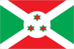
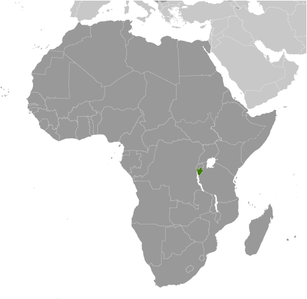
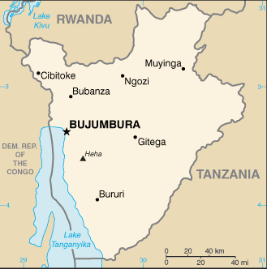

# Burundi

## Introduction

**_Background:_**   
Burundi's first democratically elected president was assassinated in October 1993 after only 100 days in office, triggering widespread ethnic violence between Hutu and Tutsi factions. More than 200,000 Burundians perished during the conflict that spanned almost a dozen years. Hundreds of thousands of Burundians were internally displaced or became refugees in neighboring countries. An internationally brokered power-sharing agreement between the Tutsi-dominated government and the Hutu rebels in 2003 paved the way for a transition process that led to an integrated defense force, established a new constitution in 2005, and elected a majority Hutu government in 2005. The government of President Pierre NKURUNZIZA, who was reelected in 2010, continues to face many political and economic challenges.

## Geography

**_Location:_**   
Central Africa, east of Democratic Republic of the Congo

**_Geographic coordinates:_**   
3 30 S, 30 00 E

**_Map references:_**   
Africa

**_Area:_**   
**total:** 27,830 sq km   
**land:** 25,680 sq km   
**water:** 2,150 sq km

**_Area - comparative:_**   
slightly smaller than Maryland

**_Land boundaries:_**   
**total:** 1,140 km   
**border countries:** Democratic Republic of the Congo 236 km, Rwanda 315 km, Tanzania 589 km

**_Coastline:_**   
0 km (landlocked)

**_Maritime claims:_**   
none (landlocked)

**_Climate:_**   
equatorial; high plateau with considerable altitude variation (772 m to 2,670 m above sea level); average annual temperature varies with altitude from 23 to 17 degrees centigrade but is generally moderate as the average altitude is about 1,700 m; average annual rainfall is about 150 cm; two wet seasons (February to May and September to November), and two dry seasons (June to August and December to January)

**_Terrain:_**   
hilly and mountainous, dropping to a plateau in east, some plains

**_Elevation extremes:_**   
**lowest point:** Lake Tanganyika 772 m   
**highest point:** Heha 2,670 m

**_Natural resources:_**   
nickel, uranium, rare earth oxides, peat, cobalt, copper, platinum, vanadium, arable land, hydropower, niobium, tantalum, gold, tin, tungsten, kaolin, limestone

**_Land use:_**   
**arable land:** 33.06%   
**permanent crops:** 14.37%   
**other:** 52.57% (2011)

**_Irrigated land:_**   
214.3 sq km (2003)

**_Total renewable water resources:_**   
12.54 cu km (2011)

**_Freshwater withdrawal (domestic/industrial/agricultural):_**   
**total:** 0.29 cu km/yr (15%/5%/79%)   
**per capita:** 43.27 cu m/yr (2005)

**_Natural hazards:_**   
flooding; landslides; drought

**_Environment - current issues:_**   
soil erosion as a result of overgrazing and the expansion of agriculture into marginal lands; deforestation (little forested land remains because of uncontrolled cutting of trees for fuel); habitat loss threatens wildlife populations

**_Environment - international agreements:_**   
**party to:** Biodiversity, Climate Change, Climate Change-Kyoto Protocol, Desertification, Endangered Species, Hazardous Wastes, Ozone Layer Protection, Wetlands   
**signed, but not ratified:** Law of the Sea

**_Geography - note:_**   
landlocked; straddles crest of the Nile-Congo watershed; the Kagera, which drains into Lake Victoria, is the most remote headstream of the White Nile

## People and Society

**_Nationality:_**   
**noun:** Burundian(s)   
**adjective:** Burundian

**_Ethnic groups:_**   
Hutu (Bantu) 85%, Tutsi (Hamitic) 14%, Twa (Pygmy) 1%, Europeans 3,000, South Asians 2,000

**_Languages:_**   
Kirundi 29.7% (official), Kirundi and other language 9.1%, French (official) and French and other language 0.3%, Swahili and Swahili and other language 0.2% (along Lake Tanganyika and in the Bujumbura area), English and English and other language 0.06%, more than 2 languages 3.7%, unspecified 56.9% (2008 est.)

**_Religions:_**   
Catholic 62.1%, Protestant 23.9% (includes Adventist 2.3% and other Protestant 21.6%), Muslim 2.5%, other 3.6%, unspecified 7.9% (2008 est.)

**_Population:_**   
10,395,931   
**note:** estimates for this country explicitly take into account the effects of excess mortality due to AIDS; this can result in lower life expectancy, higher infant mortality, higher death rates, lower population growth rates, and changes in the distribution of population by age and sex than would otherwise be expected (July 2014 est.)

**_Age structure:_**   
**0-14 years:** 45.7% (male 2,385,571/female 2,361,367)   
**15-24 years:** 19.3% (male 1,001,486/female 1,005,617)   
**25-54 years:** 28.6% (male 1,483,936/female 1,491,401)   
**55-64 years:** 3.9% (male 190,707/female 216,983)   
**65 years and over:** 2.5% (male 109,434/female 149,429) (2014 est.)

**_Dependency ratios:_**   
**total dependency ratio:** 89.2 %   
**youth dependency ratio:** 84.7 %   
**elderly dependency ratio:** 4.5 %   
**potential support ratio:** 22.2 (2014 est.)

**_Median age:_**   
**total:** 17 years   
**male:** 16.7 years   
**female:** 17.2 years (2014 est.)

**_Population growth rate:_**   
3.28% (2014 est.)

**_Birth rate:_**   
42.33 births/1,000 population (2014 est.)

**_Death rate:_**   
9.54 deaths/1,000 population (2014 est.)

**_Net migration rate:_**   
0 migrant(s)/1,000 population (2014 est.)

**_Urbanization:_**   
**urban population:** 10.9% of total population (2011)   
**rate of urbanization:** 4.12% annual rate of change (2010-15 est.)

**_Major urban areas - population:_**   
BUJUMBURA (capital) 605,000 (2011)

**_Sex ratio:_**   
**at birth:** 1.03 male(s)/female   
**0-14 years:** 1.01 male(s)/female   
**15-24 years:** 1 male(s)/female   
**25-54 years:** 1 male(s)/female   
**55-64 years:** 0.99 male(s)/female   
**65 years and over:** 0.67 male(s)/female   
**total population:** 0.98 male(s)/female (2014 est.)

**_Mother's mean age at first birth:_**   
21.3   
**note:** median age at first birth among women 25-29 (2010 est.)

**_Maternal mortality rate:_**   
800 deaths/100,000 live births (2010)

**_Infant mortality rate:_**   
**total:** 63.44 deaths/1,000 live births   
**male:** 70.22 deaths/1,000 live births   
**female:** 56.46 deaths/1,000 live births (2014 est.)

**_Life expectancy at birth:_**   
**total population:** 59.55 years   
**male:** 57.94 years   
**female:** 61.22 years (2014 est.)

**_Total fertility rate:_**   
6.14 children born/woman (2014 est.)

**_Contraceptive prevalence rate:_**   
21.9% (2010/11)

**_Health expenditures:_**   
8.7% of GDP (2011)

**_Physicians density:_**   
0.03 physicians/1,000 population (2004)

**_Hospital bed density:_**   
1.9 beds/1,000 population (2011)

**_Drinking water source:_**   
**improved:** urban: 91.5% of population; rural: 73.2% of population; total: 75.3% of population   
**unimproved:** urban: 8.5% of population; rural: 26.8% of population; total: 24.7% of population (2012 est.)

**_Sanitation facility access:_**   
**improved:** urban: 42.7% of population; rural: 48.1% of population; total: 47.5% of population   
**unimproved:** urban: 57.3% of population; rural: 51.9% of population; total: 52.5% of population (2012 est.)

**_HIV/AIDS - adult prevalence rate:_**   
1.3% (2012 est.)

**_HIV/AIDS - people living with HIV/AIDS:_**   
89,500 (2012 est.)

**_HIV/AIDS - deaths:_**   
4,800 (2012 est.)

**_Major infectious diseases:_**   
**degree of risk:** very high   
**food or waterborne diseases:** bacterial and protozoal diarrhea, hepatitis A, and typhoid fever   
**vectorborne diseases:** malaria and dengue fever   
**water contact disease:** schistosomiasis   
**animal contact disease:** rabies (2013)

**_Obesity - adult prevalence rate:_**   
2.9% (2008)

**_Children under the age of 5 years underweight:_**   
29.1% (2011)

**_Education expenditures:_**   
5.8% of GDP (2012)

**_Literacy:_**   
**definition:** age 15 and over can read and write   
**total population:** 67.2%   
**male:** 72.9%   
**female:** 61.8% (2010 est.)

**_School life expectancy (primary to tertiary education):_**   
**total:** 10 years   
**male:** 11 years   
**female:** 10 years (2010)

**_Child labor - children ages 5-14:_**   
**total number:** 433,187   
**percentage:** 19 % (2005 est.)

## Government

**_Country name:_**   
**conventional long form:** Republic of Burundi   
**conventional short form:** Burundi   
**local long form:** Republique du Burundi/Republika y'u Burundi   
**local short form:** Burundi   
**former:** Urundi

**_Government type:_**   
republic

**_Capital:_**   
**name:** Bujumbura   
**geographic coordinates:** 3 22 S, 29 21 E   
**time difference:** UTC+2 (7 hours ahead of Washington, DC, during Standard Time)

**_Administrative divisions:_**   
17 provinces; Bubanza, Bujumbura Mairie, Bujumbura Rural, Bururi, Cankuzo, Cibitoke, Gitega, Karuzi, Kayanza, Kirundo, Makamba, Muramvya, Muyinga, Mwaro, Ngozi, Rutana, Ruyigi

**_Independence:_**   
1 July 1962 (from UN trusteeship under Belgian administration)

**_National holiday:_**   
Independence Day, 1 July (1962)

**_Constitution:_**   
several previous; latest ratified by popular referendum 28 February 2005 (2012)

**_Legal system:_**   
mixed legal system of Belgian civil law and customary law

**_International law organization participation:_**   
has not submitted an ICJ jurisdiction declaration; accepts ICCt jurisdiction

**_Suffrage:_**   
18 years of age; universal

**_Executive branch:_**   
**chief of state:** President Pierre NKURUNZIZA - Hutu (since 26 August 2005); First Vice President Prosper BAZOMBAZA (since 13 February 2014); Second Vice President Gervais RUFYIKIRI - Hutu (since 29 August 2010); note - the president is both chief of state and head of government   
**head of government:** President Pierre NKURUNZIZA - Hutu (since 26 August 2005); First Vice President Prosper BAZOMBAZA (since 13 February 2014); Second Vice President Gervais RUFYIKIRI - Hutu (since 29 August 2010)   
**cabinet:** Council of Ministers appointed by president   
**elections:** the president elected by popular vote for a five-year term (eligible for a second term); elections last held on 28 June 2010 (next to be held in 2015); vice presidents nominated by the president, endorsed by parliament   
**election results:** Pierre NKURUNZIZA elected president by popular vote; Pierre NKURUNZIZA 91.6%, other 8.4%; note - opposition parties withdrew from the election due to alleged government interference in the electoral process

**_Legislative branch:_**   
bicameral Parliament or Parlement, consists of a Senate (54 seats; 34 members elected by indirect vote to serve five-year terms, with remaining seats assigned to ethnic groups and former chiefs of state) and a National Assembly or Assemblee Nationale (minimum 100 seats, 60% Hutu and 40% Tutsi with at least 30% being women; additional seats appointed by a National Independent Electoral Commission to ensure ethnic representation; members are elected by popular vote to serve five-year terms)   
**elections:** last held on 23 July 2010 (next to be held in 2015)   
**election results:** Senate - percent of vote by party - NA%; seats by party - TBD; National Assembly - percent of vote by party - CNDD-FDD 81.2%, UPRONA 11.6%, FRODEBU 5.9%, others 1.3%; seats by party - CNDD-FDD 81, UPRONA 17, FRODEBU 5, other 3

**_Judicial branch:_**   
**highest court(s):** Supreme Court (consists of 9 judges and organized into Judicial, administrative, and cassation chambers)   
**judge selection and term of office:** judges nominated by the Judicial Service Commission, a 15-member independent body of judicial and legal profession officials); judges appointed by the president with the approval of the Senate; judge tenure NA   
**subordinate courts:** Courts of Appeal; County Courts; Courts of Residence

**_Political parties and leaders:_**   
**governing parties:** Burundi Democratic Front or FRODEBU [Leonce NGENDAKUMANA]; National Council for the Defense of Democracy - Front for the Defense of Democracy or CNDD-FDD [Jeremie NGENDAKUMANA]; Union for National Progress (Union pour le Progress Nationale) or UPRONA [Bonaventure NIYOYANKANA]   
**note:** a multiparty system introduced in 1998 includes:; National Council for the Defense of Democracy or CNDD [Leonard NYANGOMA]; National Resistance Movement for the Rehabilitation of the Citizen or MRC-Rurenzangemero [Epitace BANYAGANAKANDI]; Party for National Redress or PARENA [Jean-Baptiste BAGAZA]

**_Political pressure groups and leaders:_**   
Forum for the Strengthening of Civil Society or FORSC [Pacifique NININAHAZWE] (civil society umbrella organization)   
Observatoire de lutte contre la corruption et les malversations economiques or OLUCOME [Gabriel RUFYIRI] (anti-corruption pressure group)   
**other:** Hutu and Tutsi militias (loosely organized)

**_International organization participation:_**   
ACP, AfDB, AU, CEPGL, COMESA, EAC, FAO, G-77, IAEA, IBRD, ICAO, ICRM, IDA, IFAD, IFC, IFRCS, ILO, IMF, Interpol, IOC, IOM, IPU, ISO (correspondent), ITU, ITUC (NGOs), MIGA, NAM, OIF, OPCW, UN, UNAMID, UNCTAD, UNESCO, UNIDO, UNISFA, UNWTO, UPU, WCO, WHO, WIPO, WMO, WTO

**_Diplomatic representation in the US:_**   
**chief of mission:** Ambassador Ernest NDABASHINZE (since 21 May 2014)   
**chancery:** Suite 408, 2233 Wisconsin Avenue NW, Washington, DC 20007   
**telephone:** [1] (202) 342-2574   
**FAX:** [1] (202) 342-2578

**_Diplomatic representation from the US:_**   
**chief of mission:** Ambassador Dawn M. LIBERI (since 10 July 2012)   
**embassy:** Avenue des Etats-Unis, Bujumbura   
**mailing address:** B. P. 1720, Bujumbura   
**telephone:** [257] 22-207-000   
**FAX:** [257] 22-222-926

**_Flag description:_**   
divided by a white diagonal cross into red panels (top and bottom) and green panels (hoist side and fly side) with a white disk superimposed at the center bearing three red six-pointed stars outlined in green arranged in a triangular design (one star above, two stars below); green symbolizes hope and optimism, white purity and peace, and red the blood shed in the struggle for independence; the three stars in the disk represent the three major ethnic groups: Hutu, Twa, Tutsi, as well as the three elements in the national motto: unity, work, progress

**_National symbol(s):_**   
lion

**_National anthem:_**   
**name:** "Burundi Bwacu" (Our Beloved Burundi)   
**lyrics/music:** Jean-Baptiste NTAHOKAJA/Marc BARENGAYABO   
**note:** adopted 1962

## Economy

**_Economy - overview:_**   
Burundi is a landlocked, resource-poor country with an underdeveloped manufacturing sector. The economy is predominantly agricultural; agriculture accounts for just over 30% of GDP and employs more than 90% of the population. Burundi's primary exports are coffee and tea, which account for 90% of foreign exchange earnings, though exports are a relatively small share of GDP. Burundi's export earnings - and its ability to pay for imports - rests primarily on weather conditions and international coffee and tea prices. An ethnic-based war that lasted for over a decade resulted in more than 200,000 deaths, forced more than 48,000 refugees into Tanzania, and displaced 140,000 others internally. Only one in two children go to school, and approximately one in 15 adults has HIV/AIDS. Food, medicine, and electricity remain in short supply. Less than 2% of the population has electricity in its homes. Burundi's GDP grew around 4% annually in 2006-13. Political stability and the end of the civil war have improved aid flows and economic activity has increased, but underlying weaknesses - a high poverty rate, poor education rates, a weak legal system, a poor transportation network, overburdened utilities, and low administrative capacity - risk undermining planned economic reforms. The purchasing power of most Burundians has decreased as wage increases have not kept up with inflation. Burundi will remain heavily dependent on aid from bilateral and multilateral donors - foreign aid represents 42% of Burundi's national income, the second highest rate in Sub-Saharan Africa. Burundi joined the East African Community in 2009. Government corruption is hindering the development of a healthy private sector as companies seek to navigate an environment with ever changing rules.

**_GDP (purchasing power parity):_**   
$5.75 billion (2013 est.)   
$5.504 billion (2012 est.)   
$5.291 billion (2011 est.)   
**note:** data are in 2013 US dollars

**_GDP (official exchange rate):_**   
$2.676 billion (2013 est.)

**_GDP - real growth rate:_**   
4.5% (2013 est.)   
4% (2012 est.)   
4.2% (2011 est.)

**_GDP - per capita (PPP):_**   
$600 (2013 est.)   
$600 (2012 est.)   
$600 (2011 est.)   
**note:** data are in 2013 US dollars

**_Gross national saving:_**   
-0.9% of GDP (2013 est.)   
-0.8% of GDP (2012 est.)   
6.3% of GDP (2011 est.)

**_GDP - composition, by end use:_**   
**household consumption:** 88.8%   
**government consumption:** 22.4%   
**investment in fixed capital:** 22.1%   
**investment in inventories:** -4.6%   
**exports of goods and services:** 7.2%   
**imports of goods and services:** -35.9%; (2013 est.)

**_GDP - composition, by sector of origin:_**   
**agriculture:** 34.4%   
**industry:** 18.4%   
**services:** 47.2% (2013 est.)

**_Agriculture - products:_**   
coffee, cotton, tea, corn, sorghum, sweet potatoes, bananas, cassava (manioc, tapioca); beef, milk, hides

**_Industries:_**   
light consumer goods (blankets, shoes, soap, beer); assembly of imported components; public works construction; food processing

**_Industrial production growth rate:_**   
4.5% (2013 est.)

**_Labor force:_**   
4.245 million (2007)

**_Labor force - by occupation:_**   
**agriculture:** 93.6%   
**industry:** 2.3%   
**services:** 4.1% (2002 est.)

**_Unemployment rate:_**   
NA%

**_Population below poverty line:_**   
68% (2002 est.)

**_Household income or consumption by percentage share:_**   
**lowest 10%:** 4.1%   
**highest 10%:** 28% (2006)

**_Distribution of family income - Gini index:_**   
42.4 (1998)

**_Budget:_**   
**revenues:** $766.9 million   
**expenditures:** $855.8 million (2013 est.)

**_Taxes and other revenues:_**   
28.7% of GDP (2013 est.)

**_Budget surplus (+) or deficit (-):_**   
-3.3% of GDP (2013 est.)

**_Public debt:_**   
47.6% of GDP (2013 est.)   
50.3% of GDP (2012 est.)

**_Fiscal year:_**   
calendar year

**_Inflation rate (consumer prices):_**   
9.3% (2013 est.)   
18% (2012 est.)

**_Central bank discount rate:_**   
11.25% (31 December 2010 est.)   
10% (31 December 2009 est.)

**_Commercial bank prime lending rate:_**   
13.7% (31 December 2013 est.)   
14.32% (31 December 2012 est.)

**_Stock of narrow money:_**   
$339.4 million (31 December 2013 est.)   
$332.5 million (31 December 2012 est.)

**_Stock of broad money:_**   
$471.1 million (31 December 2013 est.)   
$458.3 million (31 December 2012 est.)

**_Stock of domestic credit:_**   
$597.2 million (31 December 2013 est.)   
$572.2 million (31 December 2012 est.)

**_Market value of publicly traded shares:_**   
$NA

**_Current account balance:_**   
-$492.5 million (2013 est.)   
-$432.1 million (2012 est.)

**_Exports:_**   
$122.8 million (2013 est.)   
$134.7 million (2012 est.)

**_Exports - commodities:_**   
coffee, tea, sugar, cotton, hides

**_Exports - partners:_**   
Switzerland 23.9%, UK 12.9%, Belgium 7.4%, Pakistan 7.4%, Democratic Republic of the Congo 7.4%, Uganda 5.6%, Germany 5.2%, China 4.9%, Egypt 4.7% (2012)

**_Imports:_**   
$867.2 million (2013 est.)   
$886.2 million (2012 est.)

**_Imports - commodities:_**   
capital goods, petroleum products, foodstuffs

**_Imports - partners:_**   
Saudi Arabia 11.3%, Belgium 10.1%, China 9.1%, India 7.9%, Tanzania 6.5%, Kenya 6%, Uganda 5.7%, Zambia 4.6%, US 4.1% (2012)

**_Reserves of foreign exchange and gold:_**   
$314.6 million (31 December 2013 est.)   
$308.8 million (31 December 2012 est.)

**_Debt - external:_**   
$677.2 million (31 December 2013 est.)   
$641.9 million (31 December 2012 est.)

**_Exchange rates:_**   
Burundi francs (BIF) per US dollar -   
1,556.5 (2013 est.)   
1,442.51 (2012 est.)   
1,230.8 (2010 est.)   
1,230.18 (2009)   
1,198 (2008)

## Energy

**_Electricity - production:_**   
152 million kWh (2010 est.)

**_Electricity - consumption:_**   
221.4 million kWh (2010 est.)

**_Electricity - exports:_**   
0 kWh (2012 est.)

**_Electricity - imports:_**   
80 million kWh (2010 est.)

**_Electricity - installed generating capacity:_**   
52,000 kW (2010 est.)

**_Electricity - from fossil fuels:_**   
1.9% of total installed capacity (2010 est.)

**_Electricity - from nuclear fuels:_**   
0% of total installed capacity (2010 est.)

**_Electricity - from hydroelectric plants:_**   
98.1% of total installed capacity (2010 est.)

**_Electricity - from other renewable sources:_**   
0% of total installed capacity (2010 est.)

**_Crude oil - production:_**   
0 bbl/day (2012 est.)

**_Crude oil - exports:_**   
0 bbl/day (2010 est.)

**_Crude oil - imports:_**   
0 bbl/day (2010 est.)

**_Crude oil - proved reserves:_**   
0 bbl (1 January 2013 est.)

**_Refined petroleum products - production:_**   
0 bbl/day (2010 est.)

**_Refined petroleum products - consumption:_**   
2,290 bbl/day (2011 est.)

**_Refined petroleum products - exports:_**   
0 bbl/day (2010 est.)

**_Refined petroleum products - imports:_**   
1,429 bbl/day (2010 est.)

**_Natural gas - production:_**   
0 cu m (2011 est.)

**_Natural gas - consumption:_**   
0 cu m (2010 est.)

**_Natural gas - exports:_**   
0 cu m (2011 est.)

**_Natural gas - imports:_**   
0 cu m (2011 est.)

**_Natural gas - proved reserves:_**   
0 cu m (1 January 2013 est.)

**_Carbon dioxide emissions from consumption of energy:_**   
204,700 Mt (2011 est.)

## Communications

**_Telephones - main lines in use:_**   
17,400 (2012)

**_Telephones - mobile cellular:_**   
2.247 million (2012)

**_Telephone system:_**   
**general assessment:** sparse system of open-wire, radiotelephone communications, and low-capacity microwave radio relays   
**domestic:** telephone density one of the lowest in the world; fixed-line connections stand at well less than 1 per 100 persons; mobile-cellular usage is increasing but remains at roughly 20 per 100 persons   
**international:** country code - 257; satellite earth station - 1 Intelsat (Indian Ocean) (2011)

**_Broadcast media:_**   
state-controlled La Radiodiffusion et Television Nationale de Burundi (RTNB) operates the lone TV station and the only national radio network; about 10 privately owned radio stations; transmissions of several international broadcasters are available in Bujumbura (2007)

**_Internet country code:_**   
.bi

**_Internet hosts:_**   
229 (2012)

**_Internet users:_**   
157,800 (2009)

## Transportation

**_Airports:_**   
7 (2013)

**_Airports - with paved runways:_**   
**total:** 1   
**over 3,047 m:** 1 (2013)

**_Airports - with unpaved runways:_**   
**total:** 6   
**914 to 1,523 m:** 4   
**under 914 m:** 2 (2013)

**_Heliports:_**   
1 (2012)

**_Roadways:_**   
**total:** 12,322 km   
**paved:** 1,286 km   
**unpaved:** 11,036 km (2004)

**_Waterways:_**   
(mainly on Lake Tanganyika between Bujumbura, Burundi's principal port, and lake ports in Tanzania, Zambia, and the Democratic Republic of Congo) (2011)

**_Ports and terminals:_**   
**lake port(s):** Bujumbura (Lake Tanganyika)

## Military

**_Military branches:_**   
National Defense Forces (Forces de Defense Nationale, FDN): Army (includes maritime wing, Air Wing), National Gendarmerie (2013)

**_Military service age and obligation:_**   
18 years of age for voluntary military service; the armed forces law of 31 December 2004 did not specify a minimum age for enlistment, but the government claimed that no one younger than 18 was being recruited; mandatory retirement age 45 (enlisted), 50 (NCOs), and 55 (officers) (2012)

**_Manpower available for military service:_**   
**males age 16-49:** 2,182,327   
**females age 16-49:** 2,202,125 (2010 est.)

**_Manpower fit for military service:_**   
**males age 16-49:** 1,398,769   
**females age 16-49:** 1,481,417 (2010 est.)

**_Manpower reaching militarily significant age annually:_**   
**male:** 117,956   
**female:** 116,956 (2010 est.)

**_Military expenditures:_**   
2.39% of GDP (2012)   
NA% (2011)   
2.39% of GDP (2010)

## Transnational Issues

**_Disputes - international:_**   
Burundi and Rwanda dispute two sq km (0.8 sq mi) of Sabanerwa, a farmed area in the Rukurazi Valley where the Akanyaru/Kanyaru River shifted its course southward after heavy rains in 1965; cross-border conflicts persist among Tutsi, Hutu, other ethnic groups, associated political rebels, armed gangs, and various government forces in the Great Lakes region

**_Refugees and internally displaced persons:_**   
**refugees (country of origin):** 45,124 (Democratic Republic of the Congo) (2013)   
**IDPs:** up to 78,900 (the majority are ethnic Tutsi displaced by inter-communal violence that broke out after the 1993 coup and fighting between government forces and rebel groups; no new displacements since 2008 when the last rebel group laid down its arms) (2013)   
**stateless persons:** 1,302 (2012)

**_Trafficking in persons:_**   
**current situation:** Burundi is a source country for children and possibly women subjected to forced labor and sex trafficking; business people recruit Burundian girls for prostitution domestically, as well as in Rwanda, Kenya, Uganda, and the Middle East, and recruit boys and girls for forced labor in Burundi and Tanzania; children and young adults are coerced into forced labor in farming, mining, construction, or informal commerce; some family members, friends, and neighbors are complicit in exploiting children, luring them in with offers of educational or job opportunities

............................................................   
_Page last updated on June 23, 2014_
