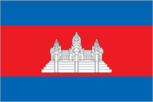
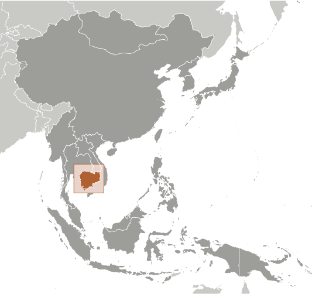
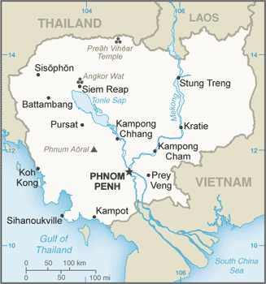

# Cambodia

## Introduction

**_Background:_**   
Most Cambodians consider themselves to be Khmers, descendants of the Angkor Empire that extended over much of Southeast Asia and reached its zenith between the 10th and 13th centuries. Attacks by the Thai and Cham (from present-day Vietnam) weakened the empire, ushering in a long period of decline. The king placed the country under French protection in 1863, and it became part of French Indochina in 1887. Following Japanese occupation in World War II, Cambodia gained full independence from France in 1953. In April 1975, after a five-year struggle, communist Khmer Rouge forces captured Phnom Penh and evacuated all cities and towns. At least 1.5 million Cambodians died from execution, forced hardships, or starvation during the Khmer Rouge regime under POL POT. A December 1978 Vietnamese invasion drove the Khmer Rouge into the countryside, began a 10-year Vietnamese occupation, and touched off almost 13 years of civil war. The 1991 Paris Peace Accords mandated democratic elections and a ceasefire, which was not fully respected by the Khmer Rouge. UN-sponsored elections in 1993 helped restore some semblance of normalcy under a coalition government. Factional fighting in 1997 ended the first coalition government, but a second round of national elections in 1998 led to the formation of another coalition government and renewed political stability. The remaining elements of the Khmer Rouge surrendered in early 1999. Some of the surviving Khmer Rouge leaders have been tried or are awaiting trial for crimes against humanity by a hybrid UN-Cambodian tribunal supported by international assistance. Elections in July 2003 were relatively peaceful, but it took one year of negotiations between contending political parties before a coalition government was formed. In October 2004, King Norodom SIHANOUK abdicated the throne and his son, Prince Norodom SIHAMONI, was selected to succeed him. Local elections were held in Cambodia in April 2007, with little of the pre-election violence that preceded prior elections. National elections in July 2008 were relatively peaceful, as were commune council elections in June 2012.

## Geography

**_Location:_**   
Southeastern Asia, bordering the Gulf of Thailand, between Thailand, Vietnam, and Laos

**_Geographic coordinates:_**   
13 00 N, 105 00 E

**_Map references:_**   
Southeast Asia

**_Area:_**   
**total:** 181,035 sq km   
**land:** 176,515 sq km   
**water:** 4,520 sq km

**_Area - comparative:_**   
slightly smaller than Oklahoma

**_Land boundaries:_**   
**total:** 2,530 km   
**border countries:** Laos 555 km, Thailand 817 km, Vietnam 1,158 km

**_Coastline:_**   
443 km

**_Maritime claims:_**   
**territorial sea:** 12 nm   
**contiguous zone:** 24 nm   
**exclusive economic zone:** 200 nm   
**continental shelf:** 200 nm

**_Climate:_**   
tropical; rainy, monsoon season (May to November); dry season (December to April); little seasonal temperature variation

**_Terrain:_**   
mostly low, flat plains; mountains in southwest and north

**_Elevation extremes:_**   
**lowest point:** Gulf of Thailand 0 m   
**highest point:** Phnum Aoral 1,810 m

**_Natural resources:_**   
oil and gas, timber, gemstones, iron ore, manganese, phosphates, hydropower potential

**_Land use:_**   
**arable land:** 22.09%   
**permanent crops:** 0.86%   
**other:** 77.05% (2011)

**_Irrigated land:_**   
3,536 sq km (2006)

**_Total renewable water resources:_**   
476.1 cu km (2011)

**_Freshwater withdrawal (domestic/industrial/agricultural):_**   
**total:** 2.18 cu km/yr (4%/2%/94%)   
**per capita:** 159.8 cu m/yr (2006)

**_Natural hazards:_**   
monsoonal rains (June to November); flooding; occasional droughts

**_Environment - current issues:_**   
illegal logging activities throughout the country and strip mining for gems in the western region along the border with Thailand have resulted in habitat loss and declining biodiversity (in particular, destruction of mangrove swamps threatens natural fisheries); soil erosion; in rural areas, most of the population does not have access to potable water; declining fish stocks because of illegal fishing and overfishing

**_Environment - international agreements:_**   
**party to:** Biodiversity, Climate Change, Climate Change-Kyoto Protocol, Desertification, Endangered Species, Hazardous Wastes, Marine Life Conservation, Ozone Layer Protection, Ship Pollution, Tropical Timber 94, Wetlands, Whaling   
**signed, but not ratified:** Law of the Sea

**_Geography - note:_**   
a land of paddies and forests dominated by the Mekong River and Tonle Sap (Southeast Asia's largest freshwater lake)

## People and Society

**_Nationality:_**   
**noun:** Cambodian(s)   
**adjective:** Cambodian

**_Ethnic groups:_**   
Khmer 90%, Vietnamese 5%, Chinese 1%, other 4%

**_Languages:_**   
Khmer (official) 96.3%, other 3.7% (2008 est.)

**_Religions:_**   
Buddhist (official) 96.9%, Muslim 1.9%, Christian 0.4%, other 0.8% (2008 est.)

**_Population:_**   
15,458,332   
**note:** estimates for this country take into account the effects of excess mortality due to AIDS; this can result in lower life expectancy, higher infant mortality, higher death rates, lower population growth rates, and changes in the distribution of population by age and sex than would otherwise be expected (July 2014 est.)

**_Age structure:_**   
**0-14 years:** 31.6% (male 2,460,659/female 2,423,619)   
**15-24 years:** 20.5% (male 1,565,135/female 1,596,099)   
**25-54 years:** 38.9% (male 2,938,366/female 3,082,496)   
**55-64 years:** 5.1% (male 298,733/female 482,588)   
**65 years and over:** 4% (male 229,684/female 380,953) (2014 est.)

**_Dependency ratios:_**   
**total dependency ratio:** 57.6 %   
**youth dependency ratio:** 49 %   
**elderly dependency ratio:** 8.6 %   
**potential support ratio:** 11.6 (2014 est.)

**_Median age:_**   
**total:** 24.1 years   
**male:** 23.4 years   
**female:** 24.8 years (2014 est.)

**_Population growth rate:_**   
1.63% (2014 est.)

**_Birth rate:_**   
24.4 births/1,000 population (2014 est.)

**_Death rate:_**   
7.78 deaths/1,000 population (2014 est.)

**_Net migration rate:_**   
-0.32 migrant(s)/1,000 population (2014 est.)

**_Urbanization:_**   
**urban population:** 20% of total population (2011)   
**rate of urbanization:** 2.13% annual rate of change (2010-15 est.)

**_Major urban areas - population:_**   
PHNOM PENH (capital) 1.55 million (2011)

**_Sex ratio:_**   
**at birth:** 1.05 male(s)/female   
**0-14 years:** 1.02 male(s)/female   
**15-24 years:** 0.98 male(s)/female   
**25-54 years:** 0.95 male(s)/female   
**55-64 years:** 0.94 male(s)/female   
**65 years and over:** 0.6 male(s)/female   
**total population:** 0.94 male(s)/female (2014 est.)

**_Mother's mean age at first birth:_**   
22.8   
**note:** median age at first birth among women 25-29 (2010 est.)

**_Maternal mortality rate:_**   
250 deaths/100,000 live births (2010)

**_Infant mortality rate:_**   
**total:** 51.36 deaths/1,000 live births   
**male:** 58.1 deaths/1,000 live births   
**female:** 44.31 deaths/1,000 live births (2014 est.)

**_Life expectancy at birth:_**   
**total population:** 63.78 years   
**male:** 61.35 years   
**female:** 66.32 years (2014 est.)

**_Total fertility rate:_**   
2.66 children born/woman (2014 est.)

**_Contraceptive prevalence rate:_**   
50.5% (2010/11)

**_Health expenditures:_**   
5.7% of GDP (2011)

**_Physicians density:_**   
0.23 physicians/1,000 population (2008)

**_Hospital bed density:_**   
0.7 beds/1,000 population (2011)

**_Drinking water source:_**   
**improved:** urban: 93.9% of population; rural: 65.6% of population; total: 71.3% of population   
**unimproved:** urban: 6.1% of population; rural: 34.4% of population; total: 28.7% of population (2012 est.)

**_Sanitation facility access:_**   
**improved:** urban: 81.6% of population; rural: 25.5% of population; total: 36.8% of population   
**unimproved:** urban: 18.4% of population; rural: 74.5% of population; total: 63.2% of population (2012 est.)

**_HIV/AIDS - adult prevalence rate:_**   
0.8% (2012 est.)

**_HIV/AIDS - people living with HIV/AIDS:_**   
76,400 (2012 est.)

**_HIV/AIDS - deaths:_**   
2,700 (2012 est.)

**_Major infectious diseases:_**   
**degree of risk:** very high   
**food or waterborne diseases:** bacterial diarrhea, hepatitis A, and typhoid fever   
**vectorborne diseases:** dengue fever, Japanese encephalitis, and malaria   
**note:** highly pathogenic H5N1 avian influenza has been identified in this country; it poses a negligible risk with extremely rare cases possible among US citizens who have close contact with birds (2013)

**_Obesity - adult prevalence rate:_**   
2.1% (2008)

**_Children under the age of 5 years underweight:_**   
29% (2011)

**_Education expenditures:_**   
2.6% of GDP (2010)

**_Literacy:_**   
**definition:** age 15 and over can read and write   
**total population:** 73.9%   
**male:** 82.8%   
**female:** 65.9% (2009 est.)

**_School life expectancy (primary to tertiary education):_**   
**total:** 11 years   
**male:** 12 years   
**female:** 10 years (2008)

**_Child labor - children ages 5-14:_**   
**total number:** 1,345,269   
**percentage:** 39 % (2001 est.)

**_Unemployment, youth ages 15-24:_**   
**total:** 3.4%   
**male:** 3.5%   
**female:** 3.3% (2008)

## Government

**_Country name:_**   
**conventional long form:** Kingdom of Cambodia   
**conventional short form:** Cambodia   
**local long form:** Preahreacheanachakr Kampuchea (phonetic pronunciation)   
**local short form:** Kampuchea   
**former:** Khmer Republic, Democratic Kampuchea, People's Republic of Kampuchea, State of Cambodia

**_Government type:_**   
multiparty democracy under a constitutional monarchy

**_Capital:_**   
**name:** Phnom Penh   
**geographic coordinates:** 11 33 N, 104 55 E   
**time difference:** UTC+7 (12 hours ahead of Washington, DC, during Standard Time)

**_Administrative divisions:_**   
23 provinces (khett, singular and plural) and 1 municipality (krong, singular and plural)   
**provinces:** Banteay Meanchey, Battambang, Kampong Cham, Kampong Chhnang, Kampong Speu, Kampong Thom, Kampot, Kandal, Kep, Koh Kong, Kratie, Mondolkiri, Oddar Meanchey, Pailin, Preah Vihear, Prey Veng, Pursat, Ratanakiri, Siem Reap, Sihanoukville, Stung Treng, Svay Rieng, Takeo   
**municipalities:** Phnom Penh (Phnum Penh)

**_Independence:_**   
9 November 1953 (from France)

**_National holiday:_**   
Independence Day, 9 November (1953)

**_Constitution:_**   
previous 1947; latest promulgated 21 September 1993; amended 1999, 2008 (2008)

**_Legal system:_**   
civil law system (influenced by the UN Transitional Authority in Cambodia) customary law, Communist legal theory, and common law

**_International law organization participation:_**   
accepts compulsory ICJ jurisdiction with reservations; accepts ICCt jurisdiction

**_Suffrage:_**   
18 years of age; universal

**_Executive branch:_**   
**chief of state:** King Norodom SIHAMONI (since 29 October 2004)   
**head of government:** Prime Minister HUN SEN (since 14 January 1985) [co-prime minister from 1993 to 1997]; Permanent Deputy Prime Minister MEN SAM AN (since 25 September 2008); Deputy Prime Ministers SAR KHENG (since 3 February 1992); SOK AN, TEA BANH, HOR NAMHONG, NHEK BUNCHHAY (since 16 July 2004); BIN CHHIN (since 5 September 2007); KEAT CHHON, YIM CHHAI LY (since 24 September 2008); KE KIMYAN (since 12 March 2009)   
**cabinet:** Council of Ministers named by the prime minister and appointed by the monarch   
**elections:** the king chosen by a Royal Throne Council from among all eligible males of royal descent; following legislative elections, a member of the majority party or majority coalition named prime minister by the Chairman of the National Assembly and appointed by the king

**_Legislative branch:_**   
bicameral, consists of the Senate (61 seats; 2 members appointed by the monarch, 2 elected by the National Assembly, and 57 elected by parliamentarians and commune councils; members serve five-year terms) and the National Assembly (123 seats; members elected by popular vote to serve five-year terms)   
**elections:** Senate - last held on 4 February 2012 (next to be held in February 2018); National Assembly - last held on 28 July 2013 (next to be held in July 2018)   
**election results:** Senate - percent of vote by party - CPP 77.8%, CNRP (SRP) 22.2%; seats by party - CPP 46, CNRP (SRP) 11; National Assembly - percent of vote by party - CPP 48.8%, NRP 44.5%, FUNCINPEC 3.9%, others 2.8%; seats by party - CPP 68, CNRP 55

**_Judicial branch:_**   
**highest court(s):** Supreme Court (organized into 5- and 9-judge panels and includes a court chief and deputy chief); Constitutional Court (consists of 9 members); note - in 1997, the Cambodian Government requested UN assistance in establishing trials to prosecute former Khmer Rouge senior leaders for crimes against humanity committed during the 1975-1979 Khmer Rouge regime; the Extraordinary Chambers of the Courts in Cambodia were established and began hearings for the first case in 2009   
**judge selection and term of office:** Supreme Court and Constitutional Court judge candidates recommended by the Supreme Council of Magistracy, a 9-member body chaired by the monarch and includes other high-level judicial officers; judges of both courts appointed by the monarch; Supreme Court judge tenure NA; Constitutional Court judges appointed for 9-year terms with one-third of the court renewed every 3 years   
**subordinate courts:** municipal and provincial courts; appellate courts; military court

**_Political parties and leaders:_**   
Cambodian People's Party or CPP [CHEA SIM]   
Cambodian National Rescue Party or CNRP [SAM RANGSI also spelled SAM RAINSY]   
National United Front for an Independent, Neutral, Peaceful, and Cooperative Cambodia or FUNCINPEC [KEV PUT REAKSMEI]   
Nationalist Party or NP former Norodom Ranariddh Party or NRP [SAO RANY]   
**note:** the CNRP is a merger between the former Human Rights Party or HRP [KHEM SOKHA, also spelled KEM SOKHA] and the Sam Rangsi Party or SRP

**_Political pressure groups and leaders:_**   
Cambodian Freedom Fighters or CFF   
Partnership for Transparency Fund or PTF (anti-corruption organization)   
Students Movement for Democracy   
The Committee for Free and Fair Elections or Comfrel   
**other:** human rights organizations; vendors

**_International organization participation:_**   
ADB, ARF, ASEAN, CICA, CICA (observer), EAS, FAO, G-77, IAEA, IBRD, ICAO, ICRM, IDA, IFAD, IFC, IFRCS, ILO, IMF, IMO, Interpol, IOC, IOM, IPU, ISO (correspondent), ITU, MINUSMA, MIGA, NAM, OIF, OPCW, PCA, UN, UNCTAD, UNESCO, UNIDO, UNIFIL, UNMISS, UNWTO, UPU, WCO, WFTU (NGOs), WHO, WIPO, WMO, WTO

**_Diplomatic representation in the US:_**   
**chief of mission:** Ambassador HENG HEM (since 29 January 2009)   
**chancery:** 4530 16th Street NW, Washington, DC 20011   
**telephone:** [1] (202) 726-7742   
**FAX:** [1] (202) 726-8381

**_Diplomatic representation from the US:_**   
**chief of mission:** Ambassador William E. TODD (since 17 April 2012)   
**embassy:** #1, Street 96, Sangkat Wat Phnom, Khan Daun Penh, Phnom Penh   
**mailing address:** Box P, APO AP 96546   
**telephone:** [855] (23) 728-000   
**FAX:** [855] (23) 728-600

**_Flag description:_**   
three horizontal bands of blue (top), red (double width), and blue with a white three-towered temple representing Angkor Wat outlined in black in the center of the red band; red and blue are traditional Cambodian colors   
**note:** only national flag to incorporate an actual building in its design

**_National symbol(s):_**   
Angkor Wat temple; kouprey (wild ox)

**_National anthem:_**   
**name:** "Nokoreach" (Royal Kingdom)   
**lyrics/music:** CHUON NAT/F. PERRUCHOT and J. JEKYLL   
**note:** adopted 1941, restored 1993; the anthem, based on a Cambodian folk tune, was restored after the defeat of the Communist regime

## Economy

**_Economy - overview:_**   
Since 2004, garments, construction, agriculture, and tourism have driven Cambodia's growth. GDP climbed more than 7% per year between 2010 and 2013. The garment industry currently employs more about 400,000 people and accounts for about 70% of Cambodia's total exports. In 2005, exploitable oil deposits were found beneath Cambodia's territorial waters, representing a potential revenue stream for the government, if commercial extraction becomes feasible. Mining also is attracting some investor interest and the government has touted opportunities for mining bauxite, gold, iron and gems. The tourism industry has continued to grow rapidly with foreign arrivals exceeding 2 million per year since 2007 and reaching over 3 million visitors in 2012. Cambodia, nevertheless, remains one of the poorest countries in Asia and long-term economic development remains a daunting challenge, inhibited by endemic corruption, limited educational opportunities, high income inequality, and poor job prospects. Approximately 4 million people live on less than $1.25 per day, and 37% of Cambodian children under the age of 5 suffer from chronic malnutrition. More than 50% of the population is less than 25 years old. The population lacks education and productive skills, particularly in the impoverished countryside, which also lacks basic infrastructure. The Cambodian Government is working with bilateral and multilateral donors, including the Asian Development Bank, the World Bank and IMF, to address the country's many pressing needs; more than 50% of the government budget comes from donor assistance. The major economic challenge for Cambodia over the next decade will be fashioning an economic environment in which the private sector can create enough jobs to handle Cambodia's demographic imbalance.

**_GDP (purchasing power parity):_**   
$39.64 billion (2013 est.)   
$37.04 billion (2012 est.)   
$34.52 billion (2011 est.)   
**note:** data are in 2013 US dollars

**_GDP (official exchange rate):_**   
$15.64 billion (2013 est.)

**_GDP - real growth rate:_**   
7% (2013 est.)   
7.3% (2012 est.)   
7.1% (2011 est.)

**_GDP - per capita (PPP):_**   
$2,600 (2013 est.)   
$2,400 (2012 est.)   
$2,300 (2011 est.)   
**note:** data are in 2013 US dollars

**_Gross national saving:_**   
9.6% of GDP (2013 est.)   
9.1% of GDP (2012 est.)   
12% of GDP (2011 est.)

**_GDP - composition, by end use:_**   
**household consumption:** 74.7%   
**government consumption:** 7.7%   
**investment in fixed capital:** 16.4%   
**investment in inventories:** 2.1%   
**exports of goods and services:** 65.3%   
**imports of goods and services:** -66.2%; (2013 est.)

**_GDP - composition, by sector of origin:_**   
**agriculture:** 34.8%   
**industry:** 24.5%   
**services:** 40.7% (2013 est.)

**_Agriculture - products:_**   
rice, rubber, corn, vegetables, cashews, cassava (manioc, tapioca), silk

**_Industries:_**   
tourism, garments, construction, rice milling, fishing, wood and wood products, rubber, cement, gem mining, textiles

**_Industrial production growth rate:_**   
9.5% (2013 est.)

**_Labor force:_**   
7.9 million (2011 est.)

**_Labor force - by occupation:_**   
**agriculture:** 55.8%   
**industry:** 16.9%   
**services:** 27.3% (2010 est.)

**_Unemployment rate:_**   
0% (2011 est.)   
0.3% (2010 est.)

**_Population below poverty line:_**   
20% (2012 est.)

**_Household income or consumption by percentage share:_**   
**lowest 10%:** 3%   
**highest 10%:** 37.3% (2007)

**_Distribution of family income - Gini index:_**   
37.9 (2008 est.)   
41.9 (2004 est.)

**_Budget:_**   
**revenues:** $2.685 billion   
**expenditures:** $3.1 billion (2013 est.)

**_Taxes and other revenues:_**   
17.2% of GDP (2013 est.)

**_Budget surplus (+) or deficit (-):_**   
-2.7% of GDP (2013 est.)

**_Public debt:_**   
NA% of GDP

**_Fiscal year:_**   
calendar year

**_Inflation rate (consumer prices):_**   
3.2% (2013 est.)   
2.9% (2012 est.)

**_Central bank discount rate:_**   
NA% (31 December 2012)   
5.25% (31 December 2007)

**_Commercial bank prime lending rate:_**   
13% (31 December 2013 est.)   
12.98% (31 December 2012 est.)

**_Stock of narrow money:_**   
$1.206 billion (31 December 2013 est.)   
$995.1 million (31 December 2012 est.)

**_Stock of broad money:_**   
$8.373 billion (31 December 2013 est.)   
$7.1 billion (31 December 2012 est.)

**_Stock of domestic credit:_**   
$5.705 billion (31 December 2013 est.)   
$4.801 billion (31 December 2012 est.)

**_Market value of publicly traded shares:_**   
$NA

**_Current account balance:_**   
-$1.262 billion (2013 est.)   
-$1.208 billion (2012 est.)

**_Exports:_**   
$6.781 billion (2013 est.)   
$6.016 billion (2012 est.)

**_Exports - commodities:_**   
clothing, timber, rubber, rice, fish, tobacco, footwear

**_Exports - partners:_**   
US 32.6%, UK 8.3%, Germany 7.7%, Canada 7.7%, Singapore 6.6%, Vietnam 5.7%, Japan 4.7% (2012)

**_Imports:_**   
$8.895 billion (2013 est.)   
$7.965 billion (2012 est.)

**_Imports - commodities:_**   
petroleum products, cigarettes, gold, construction materials, machinery, motor vehicles, pharmaceutical products

**_Imports - partners:_**   
Thailand 27.1%, Vietnam 20.3%, China 19.5%, Singapore 7.1%, Hong Kong 5.8%, South Korea 4.3% (2012)

**_Reserves of foreign exchange and gold:_**   
$5.415 billion (31 December 2013 est.)   
$4.938 billion (31 December 2012 est.)

**_Debt - external:_**   
$4.912 billion (31 December 2013 est.)   
$4.567 billion (31 December 2012 est.)

**_Exchange rates:_**   
riels (KHR) per US dollar -   
4,037.6 (2013 est.)   
4,033 (2012 est.)   
4,184.9 (2010 est.)   
4,139 (2009)   
4,070.94 (2008)

## Energy

**_Electricity - production:_**   
1.019 billion kWh (2011 est.)

**_Electricity - consumption:_**   
2.573 billion kWh (2011 est.)

**_Electricity - exports:_**   
0 kWh (2012 est.)

**_Electricity - imports:_**   
1.83 billion kWh (2011 est.)

**_Electricity - installed generating capacity:_**   
359,900 kW (2010 est.)

**_Electricity - from fossil fuels:_**   
94.8% of total installed capacity (2010 est.)

**_Electricity - from nuclear fuels:_**   
0% of total installed capacity (2010 est.)

**_Electricity - from hydroelectric plants:_**   
3.6% of total installed capacity (2010 est.)

**_Electricity - from other renewable sources:_**   
1.6% of total installed capacity (2010 est.)

**_Crude oil - production:_**   
0.5 bbl/day (2012 est.)

**_Crude oil - exports:_**   
0 bbl/day (2010 est.)

**_Crude oil - imports:_**   
0 bbl/day (2010 est.)

**_Crude oil - proved reserves:_**   
0 bbl (1 January 2013 est.)

**_Refined petroleum products - production:_**   
0 bbl/day (2010 est.)

**_Refined petroleum products - consumption:_**   
39,350 bbl/day (2011 est.)

**_Refined petroleum products - exports:_**   
0 bbl/day (2010 est.)

**_Refined petroleum products - imports:_**   
26,250 bbl/day (2010 est.)

**_Natural gas - production:_**   
0 cu m (2011 est.)

**_Natural gas - consumption:_**   
0 cu m (2010 est.)

**_Natural gas - exports:_**   
0 cu m (2011 est.)

**_Natural gas - imports:_**   
0 cu m (2011 est.)

**_Natural gas - proved reserves:_**   
0 cu m (1 January 2013 est.)

**_Carbon dioxide emissions from consumption of energy:_**   
4.39 million Mt (2011 est.)

## Communications

**_Telephones - main lines in use:_**   
584,000 (2012)

**_Telephones - mobile cellular:_**   
19.1 million (2012)

**_Telephone system:_**   
**general assessment:** adequate fixed-line and/or cellular service in Phnom Penh and other provincial cities; mobile-cellular phone systems are widely used in urban areas to bypass deficiencies in the fixed-line network; mobile-phone coverage is rapidly expanding in rural areas   
**domestic:** fixed-line connections stand at about 4 per 100 persons; mobile-cellular usage, aided by competition among service providers, is increasing rapidly and stands at 92 per 100 persons   
**international:** country code - 855; adequate but expensive landline and cellular service available to all countries from Phnom Penh and major provincial cities; satellite earth station - 1 Intersputnik (Indian Ocean region) (2011)

**_Broadcast media:_**   
mixture of state-owned, joint public-private, and privately owned broadcast media; 9 TV broadcast stations with most operating on multiple channels, including 1 state-operated station broadcasting from multiple locations, 6 stations either jointly operated or privately owned with some broadcasting from several locations, and 2 TV relay stations - one relaying a French TV station and the other relaying a Vietnamese TV station; multi-channel cable and satellite systems are available; roughly 50 radio broadcast stations - 1 state-owned broadcaster with multiple stations and a large mixture of public and private broadcasters; several international broadcasters are available (2009)

**_Internet country code:_**   
.kh

**_Internet hosts:_**   
13,784 (2012)

**_Internet users:_**   
78,500 (2009)

## Transportation

**_Airports:_**   
16 (2013)

**_Airports - with paved runways:_**   
**total:** 6   
**2,438 to 3,047 m:** 3   
**1,524 to 2,437 m:** 2   
**914 to 1,523 m:** 1 (2013)

**_Airports - with unpaved runways:_**   
**total:** 10   
**1,524 to 2,437 m:** 2   
**914 to 1,523 m:** 7   
**under 914 m:** 1 (2013)

**_Heliports:_**   
1 (2013)

**_Railways:_**   
**total:** 690 km   
**narrow gauge:** 690 km 1.000-m gauge   
**note:** under restoration (2010)

**_Roadways:_**   
**total:** 39,618 km   
**paved:** 2,492 km   
**unpaved:** 37,126 km (2009)

**_Waterways:_**   
3,700 km (mainly on Mekong River) (2012)

**_Merchant marine:_**   
**total:** 544   
**by type:** bulk carrier 38, cargo 459, carrier 7, chemical tanker 4, container 4, liquefied gas 1, passenger 1, passenger/cargo 6, petroleum tanker 8, refrigerated cargo 11, roll on/roll off 4, vehicle carrier 1   
**foreign-owned:** 352 (Belgium 1, Canada 2, China 177, Cyprus 4, Egypt 4, Estonia 1, French Polynesia 1, Gabon 1, Greece 2, Hong Kong 10, Indonesia 2, Ireland 1, Japan 1, Lebanon 5, Russia 50, Singapore 3, South Korea 10, Syria 22, Taiwan 1, Turkey 15, UAE 2, UK 1, Ukraine 35, Vietnam 1) (2010)

**_Ports and terminals:_**   
**major seaport(s):** Sihanoukville (Kampong Saom)   
**river port(s):** Phnom Penh (Mekong)

## Military

**_Military branches:_**   
Royal Cambodian Armed Forces: Royal Cambodian Army, Royal Khmer Navy, Royal Cambodian Air Force (2013)

**_Military service age and obligation:_**   
18 is the legal minimum age for compulsory and voluntary military service (2012)

**_Manpower available for military service:_**   
**males age 16-49:** 3,883,724   
**females age 16-49:** 4,003,585 (2010 est.)

**_Manpower fit for military service:_**   
**males age 16-49:** 2,638,167   
**females age 16-49:** 2,965,328 (2010 est.)

**_Manpower reaching militarily significant age annually:_**   
**male:** 151,143   
**female:** 154,542 (2010 est.)

**_Military expenditures:_**   
1.54% of GDP (2012)   
1.5% of GDP (2011)   
1.54% of GDP (2010)

## Transnational Issues

**_Disputes - international:_**   
Cambodia is concerned about Laos' extensive upstream dam construction; Cambodia and Thailand dispute sections of boundary; in 2011 Thailand and Cambodia resorted to arms in the dispute over the location of the boundary on the precipice surmounted by Preah Vihear Temple ruins, awarded to Cambodia by ICJ decision in 1962 and part of a UN World Heritage site; Cambodia accuses Vietnam of a wide variety of illicit cross-border activities; progress on a joint development area with Vietnam is hampered by an unresolved dispute over sovereignty of offshore islands

**_Trafficking in persons:_**   
**current situation:** Cambodia is a source, transit, and destination country for men, women, and children subjected to forced labor and sex trafficking; Cambodian men, women, and children migrate to countries within the region for legitimate work but are subsequently subjected to sex trafficking, domestic servitude, debt bondage, or forced labor; the inability to understand formal obligations, read contracts, or pay processing fees, and inadequate government regulatory oversight renders some Cambodian migrant workers vulnerable to such exploitation; poor Cambodian children are subject to forced labor, including forced begging in Thailand and Vietnam; Cambodian and ethnic Vietnamese women and girls are trafficked from rural areas to urban centers for sexual exploitation; Cambodian men are the main exploiters of child prostitutes, but men from other Asian countries, the US, and Europe travel to Cambodia for child sex tourism   
**tier rating:** Tier 2 Watch List - Cambodia does not fully comply with the minimum standards for the elimination of trafficking; however, it is making significant efforts to do so; the government has prosecuted and convicted fewer trafficking offenders and identified fewer victims than in the previous year; corruption continues to impede anti-trafficking endeavors; authorities systematically refer identified victims to NGO shelters, which provide the majority of services but lack long-term care services, making victims, particularly children, vulnerable to re-trafficking; the government has established a migration working group within its anti-trafficking committee to better address the exploitation of Cambodian workers abroad, but laws governing migrant workers abroad remain weak (2013)

**_Illicit drugs:_**   
narcotics-related corruption reportedly involving some in the government, military, and police; limited methamphetamine production; vulnerable to money laundering due to its cash-based economy and porous borders

............................................................   
_Page last updated on June 23, 2014_
