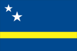
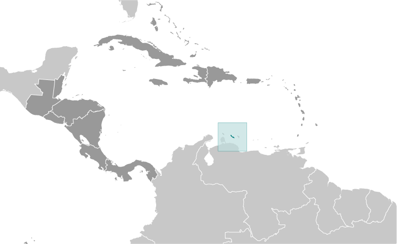
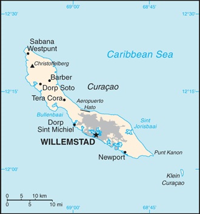

# Curacao

_part of the Kingdom of the Netherlands_

## Introduction

**_Background:_**   
Originally settled by Arawak Indians, Curacao was seized by the Dutch in 1634 along with the neighboring island of Bonaire. Once the center of the Caribbean slave trade, Curacao was hard hit economically by the abolition of slavery in 1863. Its prosperity (and that of neighboring Aruba) was restored in the early 20th century with the construction of the Isla Refineria to service the newly discovered Venezuelan oil fields. In 1954, Curacao and several other Dutch Caribbean possessions were reorganized as the Netherlands Antilles, part of the Kingdom of the Netherlands. In referenda in 2005 and 2009, the citizens of Curacao voted to become a self-governing country within the Kingdom of the Netherlands. The change in status became effective in October 2010 with the dissolution of the Netherlands Antilles.

## Geography

**_Location:_**   
Caribbean, an island in the Caribbean Sea - 55 km off the coast of Venezuela

**_Geographic coordinates:_**   
12 10 N, 69 00 W

**_Map references:_**   
Central America and the Caribbean

**_Area:_**   
**total:** 444 sq km   
**land:** 444 sq km   
**water:** 0 sq km

**_Area - comparative:_**   
more than twice the size of Washington, DC

**_Land boundaries:_**   
0 km

**_Coastline:_**   
364 km

**_Maritime claims:_**   
**territorial sea:** 12 nm   
**exclusive fishing zone:** 12 nm

**_Climate:_**   
tropical marine climate, ameliorated by northeast trade winds, results in mild temperatures; semiarid with average rainfall of 600 mm/year

**_Terrain:_**   
generally low, hilly terrain

**_Elevation extremes:_**   
**lowest point:** Caribbean Sea 0 m   
**highest point:** Mt. Christoffel, 372m

**_Natural resources:_**   
calcium phosphates, aloes, sorghum, peanuts, vegetables, tropical fruit

**_Land use:_**   
**arable land:** 10%   
**permanent crops:** 0%   
**other:** 90% (2011)

**_Irrigated land:_**   
NA

**_Total renewable water resources:_**   
NA

**_Natural hazards:_**   
Curacao is south of the Caribbean hurricane belt and is rarely threatened

**_Environment - current issues:_**   
NA

**_Geography - note:_**   
Curacao is a part of the Windward Islands (southern) group

## People and Society

**_Nationality:_**   
**noun:** Curacaoan   
**adjective:** Curacaoan; Dutch

**_Ethnic groups:_**   
Afro-Caribbean majority; Dutch, French, Latin American, East Asian, South Asian, Jewish minorities

**_Languages:_**   
Papiamentu (a Spanish-Portuguese-Dutch-English dialect) 81.2%, Dutch (official) 8%, Spanish 4%, English 2.9%, other 3.9% (2001 census)

**_Religions:_**   
Roman Catholic 72.8%, Pentecostal 6.6%, Protestant 3.2%, Adventist 3%, Jehovah's Witness 2%, Evangelical 1.9%, other 3.8%, none 6%, unspecified 0.6% (2011 est.)

**_Population:_**   
146,836 (July 2013 est.)

**_Age structure:_**   
**0-14 years:** 20.6% (male 15,342/female 14,645)   
**15-24 years:** 15.4% (male 11,599/female 10,790)   
**25-54 years:** 38.5% (male 26,869/female 29,348)   
**55-64 years:** 12.6% (male 8,059/female 10,259)   
**65 years and over:** 13% (male 7,833/female 11,090) (2013 est.)

**_Dependency ratios:_**   
**total dependency ratio:** 50.6 %   
**youth dependency ratio:** 29 %   
**elderly dependency ratio:** 21.6 %   
**potential support ratio:** 4.6 (2014 est.)

**_Median age:_**   
**total:** 36.2 years   
**male:** 32.7 years   
**female:** 39.9 years (2013 est.)

**_Population growth rate:_**   
NA

**_Birth rate:_**   
NA

**_Death rate:_**   
8 deaths/1,000 population (2009)

**_Net migration rate:_**   
1.27 migrant(s)/1,000 population (2008)

**_Sex ratio:_**   
**at birth:** 1.15 male(s)/female   
**0-14 years:** 1.05 male(s)/female   
**15-24 years:** 1.08 male(s)/female   
**25-54 years:** 0.92 male(s)/female   
**55-64 years:** 0.79 male(s)/female   
**65 years and over:** 0.71 male(s)/female   
**total population:** 0.92 male(s)/female (2013 est.)

**_Life expectancy at birth:_**   
**total:** NA   
**males:** 72.4 years   
**females:** 80.1 years (2009)

**_Total fertility rate:_**   
2.09 children born/woman (2013 est.)

**_HIV/AIDS - adult prevalence rate:_**   
NA

**_HIV/AIDS - people living with HIV/AIDS:_**   
NA

**_HIV/AIDS - deaths:_**   
NA

## Government

**_Country name:_**   
**Dutch long form:** Land Curacao   
**Dutch short form:** Curacao   
**Papiamentu long form:** Pais Korsou   
**Papiamentu short form:** Korsou   
**former:** Netherlands Antilles; Curacao and Dependencies

**_Dependency status:_**   
constituent country within the Kingdom of the Netherlands; full autonomy in internal affairs granted in 2010; Dutch Government responsible for defense and foreign affairs

**_Government type:_**   
parliamentary

**_Capital:_**   
**name:** Willemstad   
**geographic coordinates:** 12 06 N, 68 55 W   
**time difference:** UTC-4 (1 hour ahead of Washington, DC, during Standard Time)

**_Administrative divisions:_**   
none (part of the Kingdom of the Netherlands)

**_Independence:_**   
none (part of the Kingdom of the Netherlands)

**_National holiday:_**   
Queen's Day (Birthday of Queen-Mother JULIANA and accession to the throne of her oldest daughter BEATRIX), 30 April (1909 and 1980)

**_Constitution:_**   
previous 1947, 1955; latest adopted 5 September 2010, entered into force 10 October 2010 (regulates governance of Curacao but is subordinate to the Charter for the Kingdom of the Netherlands); note - in October 2010, with the dissolution of the Netherlands Antilles, Curacao became a constituent country within the Kingdom of the Netherlands (2013)

**_Legal system:_**   
based on Dutch civil law system with some English common law influence

**_Suffrage:_**   
18 years of age; universal

**_Executive branch:_**   
**chief of state:** King WILLEM-ALEXANDER of the Netherlands (since 30 April 2013); represented by Governor Lucille A. GEORGE-WOUT (since 4 November 2013)   
**head of government:** Prime Minister Ivar ASJES (since 7 June 2013)   
**cabinet:** Cabinet appointed by the governor   
**elections:** the monarch is hereditary; governor general appointed by the monarch; following legislative elections, the leader of the majority party is usually elected prime minister by the parliament; next election is scheduled for 2016

**_Legislative branch:_**   
unicameral Estates of Curacao (21 seats; members elected by popular vote for four year terms)   
**elections:** last held 19 October 2012 (next to be held in 2016)   
**election results:** percent of vote by party - PS 22.6%, MFK 21.2%, PAR 19.7%, PAIS 17.7%, MAN 9.5%, PNP 5.9%, other 3.4%; seats by party - PS 5, MFK 5, PAR 4, PAIS 4, MAN 2, PNP 1

**_Judicial branch:_**   
**highest court(s):** 

**_Political parties and leaders:_**   
Frente Obrero Liberashon (Workers' Liberation Front) or FOL [Anthony GODETT]   
Movementu Futuro Korsou or MFK [Gerrit SCHOTTE]   
Movishon Antia Nobo or MAN [Eunice EISDEN]   
Partido Antia Restruktura or PAR [Emily DE JONGH-ELHAGE]   
Partido pa Adelanto I Inovashon Soshal or PAIS [Alex ROSARIA]   
Partido Nashonal di Pueblo or PNP [Humphrey DAVELAAR]   
Pueblo Soberano or PS [Helmin WIELS]

**_Diplomatic representation in the US:_**   
none (represented by the Kingdom of the Netherlands)

**_Diplomatic representation from the US:_**   
**chief of mission:** Consul General James R. Moore (since June 2013); note - also accredited to Aruba and Sint Martin   
**consulate(s) general:** J. B. Gorsiraweg #1, Willemstad, Curacao   
**mailing address:** P. O. Box 158, Willemstad, Curacao   
**telephone:** [599] (9) 4613066   
**FAX:** [599] (9) 4616489

**_Flag description:_**   
on a blue field a horizontal yellow band somewhat below the center divides the flag into proportions of 5:1:2; two five-pointed white stars - the smaller above and to the left of the larger - appear in the canton; the blue of the upper and lower sections symbolizes the sky and sea respectively; yellow represents the sun; the stars symbolize Curacao and its uninhabited smaller sister island of Klein Curacao; the five star points signify the five continents from which Curacao's people derive

**_National anthem:_**   
**name:** Himmo di Korsou (Anthem of Curacao)   
**lyrics/music:** Guillermo ROSARIO, Mae HENRIQUEZ, Enrique MULLER, Betty DORAN/Frater Candidus NOWENS, Errol "El Toro" COLINA   
**note:** adapted 1978; the lyrics, originally written in 1899, were rewritten in 1978 to make them less colonial in nature

## Economy

**_Economy - overview:_**   
Tourism, petroleum refining, offshore finance, and trade and transport are the mainstays of this small economy, which is closely tied to the outside world. Although GDP grew slightly during the past decade, the island enjoys a high per capita income and a well-developed infrastructure compared with other countries in the region. Curacao has an excellent natural harbor that can accommodate large oil tankers. Venezuelan state oil company PdVSA, under a contract in effect until 2019, leases the single refinery on the island from the government, employing some 1,500 people; most of the oil for the refinery is imported from Venezuela; most of the refined products are exported to the US. Almost all consumer and capital goods are imported, with the US, Brazil, Italy, and Mexico being the major suppliers. The government is attempting to diversify its industry and trade and has signed an Association Agreement with the EU to expand business there. Most of Curacao’s GDP results from services. Curacao has limited natural resources, poor soils, and inadequate water supplies, and budgetary problems complicate reform of the health and education systems. In 2013 the government implemented changes to the sales tax and reformed the public pension and health care systems, including increasing the sales tax from 5% to as high as 9% on some products, raising the age for public pension withdrawals to 65, and requiring citizens to pay higher premiums.

**_GDP (purchasing power parity):_**   
$3.128 billion (2012 est.)   
$3.02 billion (2011 est.)   
$2.96 billion (2010 est.)   
**note:** data are in 2012 US dollars

**_GDP (official exchange rate):_**   
$5.6 billion (2012 est.)

**_GDP - real growth rate:_**   
3.6% (2012 est.)   
2% (2011 est.)   
0.1% (2010 est.)

**_GDP - per capita (PPP):_**   
$15,000 (2004 est.)

**_GDP - composition, by sector of origin:_**   
**agriculture:** 0.7%   
**industry:** 15.5%   
**services:** 83.8% (2012 est.)

**_Agriculture - products:_**   
aloe, sorghum, peanuts, vegetables, tropical fruit

**_Industries:_**   
tourism, petroleum refining, petroleum transshipment, light manufacturing

**_Industrial production growth rate:_**   
NA%

**_Labor force:_**   
73,010 (2013)

**_Labor force - by occupation:_**   
**agriculture:** 1.2%   
**industry:** 16.9%   
**services:** 81.8% (2008 est.)

**_Unemployment rate:_**   
13% (2013 est.)   
9.8% (2011 est.)

**_Taxes and other revenues:_**   
16.6% of GDP (2012 est.)

**_Budget surplus (+) or deficit (-):_**   
-0.4% of GDP (2012 est.)

**_Public debt:_**   
33.2% of GDP (2012 est.)   
40.6% of GDP (2011 est.)

**_Inflation rate (consumer prices):_**   
3.2% (2012 est.)   
2.3% (2011 est.)

**_Exports:_**   
$1.607 billion (2011 est.)   
$1.44 billion (2010 est.)

**_Exports - commodities:_**   
petroleum products

**_Imports:_**   
$1.285 billion (2011 est.)   
$1.275 billion (2010 est.)

**_Imports - commodities:_**   
crude petroleum, food, manufactures

**_Exchange rates:_**   
Netherlands Antillean guilders (ANG) per US dollar -   
1.79 (2011)   
1.79 (2011 est.)   
1.79 (2010 est.)   
1.79 (2009)   
1.79 (2008)   
**note:** the Netherland Antillean guilder was replaced by the newly created Caribbean guilder in 2013

## Energy

**_Electricity - production:_**   
1.785 billion kWh (2012 est.)

**_Electricity - consumption:_**   
968 million kWh (2008 est.)

**_Electricity - exports:_**   
0 kWh (2009 est.)

**_Electricity - imports:_**   
0 kWh (2009 est.)

**_Crude oil - proved reserves:_**   
0 bbl (1 January 2011 est.)

**_Refined petroleum products - production:_**   
531 bbl/day (2010 est.)

**_Refined petroleum products - consumption:_**   
72,000 bbl/day (2010 est.)

**_Refined petroleum products - exports:_**   
211,100 bbl/day (2009 est.)

**_Refined petroleum products - imports:_**   
291,700 bbl/day (2009 est.)

**_Natural gas - production:_**   
0 cu m (2009 est.)

**_Natural gas - consumption:_**   
0 cu m (2009 est.)

**_Natural gas - exports:_**   
0 cu m (2009 est.)

**_Natural gas - imports:_**   
0 cu m (2009 est.)

**_Natural gas - proved reserves:_**   
0 cu m (1 January 2011 est.)

## Communications

**_Telephone system:_**   
**international:** country code - 599

**_Broadcast media:_**   
government-run Telecuracao operates a TV station and a radio station; several privately-owned radio stations

**_Internet country code:_**   
.cw

**_Internet hosts:_**   
NA

**_Internet users:_**   
NA

## Transportation

**_Roadways:_**   
**total:** 550 km

**_Ports and terminals:_**   
**major seaport(s):** Willemstad   
**oil/gas terminal(s):** Bullen Baai (Curacao Terminal)   
**bulk cargo port(s):** Fuik Bay (phosphate rock)

## Military

**_Military branches:_**   
no regular military forces; the Dutch Government controls foreign and defense policy (2012)

**_Military service age and obligation:_**   
no conscription (2010)

**_Military - note:_**   
defense is the responsibility of the Kingdom of the Netherlands

............................................................   
_Page last updated on June 18, 2014_
