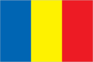
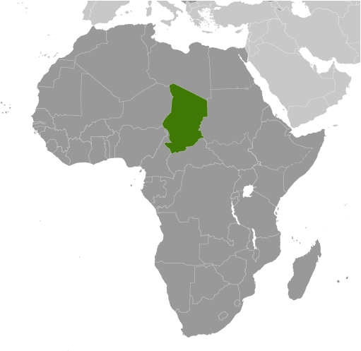
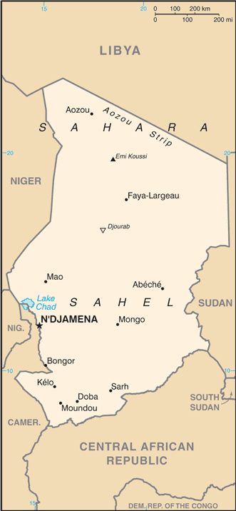

# Chad

## Introduction

**_Background:_**   
Chad, part of France's African holdings until 1960, endured three decades of civil warfare, as well as invasions by Libya, before a semblance of peace was finally restored in 1990. The government eventually drafted a democratic constitution and held flawed presidential elections in 1996 and 2001. In 1998, a rebellion broke out in northern Chad, which has sporadically flared up despite several peace agreements between the government and the insurgents. In 2005, new rebel groups emerged in western Sudan and made probing attacks into eastern Chad despite signing peace agreements in December 2006 and October 2007. In June 2005, President Idriss DEBY held a referendum successfully removing constitutional term limits and won another controversial election in 2006. Sporadic rebel campaigns continued throughout 2006 and 2007. The capital experienced a significant insurrection in early 2008, but has had no significant rebel threats since then, in part due to Chad's 2010 rapprochement with Sudan, which previously used Chadian rebels as proxies. DEBY in 2011 was reelected to his fourth term in an election that international observers described as proceeding without incident. Power remains in the hands of an ethnic minority. In January 2014, Chad began a two year rotation on the UN Security Council.

## Geography

**_Location:_**   
Central Africa, south of Libya

**_Geographic coordinates:_**   
15 00 N, 19 00 E

**_Map references:_**   
Africa

**_Area:_**   
**total:** 1.284 million sq km   
**land:** 1,259,200 sq km   
**water:** 24,800 sq km

**_Area - comparative:_**   
slightly more than three times the size of California

**_Land boundaries:_**   
**total:** 6,406 km   
**border countries:** Cameroon 1,116 km, Central African Republic 1,556 km, Libya 1,050 km, Niger 1,196 km, Nigeria 85 km, Sudan 1,403 km

**_Coastline:_**   
0 km (landlocked)

**_Maritime claims:_**   
none (landlocked)

**_Climate:_**   
tropical in south, desert in north

**_Terrain:_**   
broad, arid plains in center, desert in north, mountains in northwest, lowlands in south

**_Elevation extremes:_**   
**lowest point:** Djourab 160 m   
**highest point:** Emi Koussi 3,415 m

**_Natural resources:_**   
petroleum, uranium, natron, kaolin, fish (Lake Chad), gold, limestone, sand and gravel, salt

**_Land use:_**   
**arable land:** 3.82%   
**permanent crops:** 0.02%   
**other:** 96.16% (2011)

**_Irrigated land:_**   
302.7 sq km (2003)

**_Total renewable water resources:_**   
43 cu km (2011)

**_Freshwater withdrawal (domestic/industrial/agricultural):_**   
**total:** 0.88 cu km/yr (12%/12%/76%)   
**per capita:** 84.81 cu m/yr (2005)

**_Natural hazards:_**   
hot, dry, dusty harmattan winds occur in north; periodic droughts; locust plagues

**_Environment - current issues:_**   
inadequate supplies of potable water; improper waste disposal in rural areas contributes to soil and water pollution; desertification

**_Environment - international agreements:_**   
**party to:** Biodiversity, Climate Change, Desertification, Endangered Species, Hazardous Wastes, Ozone Layer Protection, Wetlands   
**signed, but not ratified:** Law of the Sea, Marine Dumping

**_Geography - note:_**   
**note 1:** Chad is largest of Africa's 16 landlocked countries   
**note 2:** not long ago - geologically speaking - what is today the Sahara was green savanah teeming with wildlife; during the African Humid Period, roughly 11,000 to 5,000 years ago, a vibrant animal community, including elephants, giraffes, hippos, and antelope lived there; the last remnant of the "Green Sahara" exists in the Lakes of Ounianga (oo-nee-ahn-ga) in northern Chad, a series of 18 interconnected freshwater, saline, and hypersaline lakes now protected as a World Heritage site   
**note 3:** Lake Chad, the most significant water body in the Sahel, is a remnant of a former inland sea, paleolake Mega-Chad; at its greatest extent, sometime before 5000 B.C., Lake Mega-Chad was the largest of four Saharan paleolakes that existed during the African Humid Period; it covered an area of about 400,000 sq km (150,000 sq mi), i.e., roughly the size of today's Caspian Sea

## People and Society

**_Nationality:_**   
**noun:** Chadian(s)   
**adjective:** Chadian

**_Ethnic groups:_**   
Sara 27.7%, Arab 12.3%, Mayo-Kebbi 11.5%, Kanem-Bornou 9%, Ouaddai 8.7%, Hadjarai 6.7%, Tandjile 6.5%, Gorane 6.3%, Fitri-Batha 4.7%, other 6.4%, unknown 0.3% (1993 census)

**_Languages:_**   
French (official), Arabic (official), Sara (in south), more than 120 different languages and dialects

**_Religions:_**   
Muslim 53.1%, Catholic 20.1%, Protestant 14.2%, animist 7.3%, other 0.5%, unknown 1.7%, atheist 3.1% (1993 census)

**_Population:_**   
11,412,107 (July 2014 est.)

**_Age structure:_**   
**0-14 years:** 44.7% (male 2,588,424/female 2,515,935)   
**15-24 years:** 20.6% (male 1,143,812/female 1,211,136)   
**25-54 years:** 27.8% (male 1,436,018/female 1,737,901)   
**55-64 years:** 3.9% (male 193,173/female 247,584)   
**65 years and over:** 3% (male 140,592/female 197,532) (2014 est.)

**_Dependency ratios:_**   
**total dependency ratio:** 102.2 %   
**youth dependency ratio:** 97.4 %   
**elderly dependency ratio:** 4.8 %   
**potential support ratio:** 20.7 (2014 est.)

**_Median age:_**   
**total:** 17.2 years   
**male:** 16.1 years   
**female:** 18.2 years (2014 est.)

**_Population growth rate:_**   
1.92% (2014 est.)

**_Birth rate:_**   
37.29 births/1,000 population (2014 est.)

**_Death rate:_**   
14.56 deaths/1,000 population (2014 est.)

**_Net migration rate:_**   
-3.54 migrant(s)/1,000 population (2014 est.)

**_Urbanization:_**   
**urban population:** 21.8% of total population (2011)   
**rate of urbanization:** 3% annual rate of change (2010-15 est.)

**_Major urban areas - population:_**   
N'DJAMENA (capital) 1.079 million (2011)

**_Sex ratio:_**   
**at birth:** 1.04 male(s)/female   
**0-14 years:** 1.03 male(s)/female   
**15-24 years:** 0.94 male(s)/female   
**25-54 years:** 0.83 male(s)/female   
**55-64 years:** 0.93 male(s)/female   
**65 years and over:** 0.72 male(s)/female   
**total population:** 0.93 male(s)/female (2014 est.)

**_Mother's mean age at first birth:_**   
18.2   
**note:** median age at first birth among women 25-29 (2004 est.)

**_Maternal mortality rate:_**   
1,100 deaths/100,000 live births (2010)

**_Infant mortality rate:_**   
**total:** 90.3 deaths/1,000 live births   
**male:** 95.92 deaths/1,000 live births   
**female:** 84.46 deaths/1,000 live births (2014 est.)

**_Life expectancy at birth:_**   
**total population:** 49.44 years   
**male:** 48.3 years   
**female:** 50.63 years (2014 est.)

**_Total fertility rate:_**   
4.68 children born/woman (2014 est.)

**_Contraceptive prevalence rate:_**   
4.8% (2010)

**_Health expenditures:_**   
4.3% of GDP (2011)

**_Physicians density:_**   
0.04 physicians/1,000 population (2006)

**_Hospital bed density:_**   
0.43 beds/1,000 population (2005)

**_Drinking water source:_**   
**improved:** urban: 71.8% of population; rural: 44.8% of population; total: 50.7% of population   
**unimproved:** urban: 28.2% of population; rural: 55.2% of population; total: 49.3% of population (2012 est.)

**_Sanitation facility access:_**   
**improved:** urban: 31.4% of population; rural: 6.5% of population; total: 11.9% of population   
**unimproved:** urban: 68.6% of population; rural: 93.5% of population; total: 88.1% of population (2012 est.)

**_HIV/AIDS - adult prevalence rate:_**   
2.7% (2012 est.)

**_HIV/AIDS - people living with HIV/AIDS:_**   
213,100 (2012 est.)

**_HIV/AIDS - deaths:_**   
14,400 (2012 est.)

**_Major infectious diseases:_**   
**degree of risk:** very high   
**food or waterborne diseases:** bacterial and protozoal diarrhea, hepatitis A and E, and typhoid fever   
**vectorborne diseases:** malaria and dengue fever   
**water contact disease:** schistosomiasis   
**respiratory disease:** meningococcal meningitis   
**animal contact disease:** rabies (2013)

**_Obesity - adult prevalence rate:_**   
2.7% (2008)

**_Children under the age of 5 years underweight:_**   
33.9% (2004)

**_Education expenditures:_**   
2.3% of GDP (2011)

**_Literacy:_**   
**definition:** age 15 and over can read and write French or Arabic   
**total population:** 35.4%   
**male:** 45.6%   
**female:** 25.4% (2011 est.)

**_School life expectancy (primary to tertiary education):_**   
**total:** 7 years   
**male:** 9 years   
**female:** 6 years (2011)

**_Child labor - children ages 5-14:_**   
**total number:** 1,475,960   
**percentage:** 48 % (2010 est.)

## Government

**_Country name:_**   
**conventional long form:** Republic of Chad   
**conventional short form:** Chad   
**local long form:** Republique du Tchad/Jumhuriyat Tshad   
**local short form:** Tchad/Tshad

**_Government type:_**   
republic

**_Capital:_**   
**name:** N'Djamena   
**geographic coordinates:** 12 06 N, 15 02 E   
**time difference:** UTC+1 (6 hours ahead of Washington, DC, during Standard Time)

**_Administrative divisions:_**   
23 regions (regions, singular - region); Barh el Gazel, Batha, Borkou, Chari-Baguirmi, Ennedi-Est, Ennedi-Quest, Guera, Hadjer-Lamis, Kanem, Lac, Logone Occidental, Logone Oriental, Mandoul, Mayo-Kebbi Est, Mayo-Kebbi Ouest, Moyen-Chari, Ouaddai, Salamat, Sila, Tandjile, Tibesti, Ville de N'Djamena, Wadi Fira

**_Independence:_**   
11 August 1960 (from France)

**_National holiday:_**   
Independence Day, 11 August (1960)

**_Constitution:_**   
several previous; latest passed by referendum 31 March 1996, entered into force 8 April 1996; amended 2005 (2010)

**_Legal system:_**   
mixed legal system of civil and customary law

**_International law organization participation:_**   
has not submitted an ICJ jurisdiction declaration; accepts ICCt jurisdiction

**_Suffrage:_**   
18 years of age; universal

**_Executive branch:_**   
**chief of state:** President Idriss DEBY Itno, Lt. Gen. (since 4 December 1990)   
**head of government:** Prime Minister Kalzeube Pahimi DEUBET (since 21 November 2013)   
**cabinet:** Council of State; members are appointed by the president on the recommendation of the prime minister   
**elections:** president elected by popular vote for a five-year term; if no candidate receives at least 50% of the total vote, the two candidates receiving the most votes must stand for a second round of voting; last election held on 25 April 2011 (next to be held by 2016); prime minister appointed by the president   
**election results:** Lt. Gen. Idriss DEBY Itno reelected president; percent of vote - Lt. Gen. Idriss DEBY 83.6%, Albert Pahimi PADACKE 8.6%, Nadji MADOU 7.8%

**_Legislative branch:_**   
unicameral National Assembly (188 seats; members elected by popular vote to serve four-year terms)   
**elections:** National Assembly - last held on 13 February 2011 (next to be held by 2015); note - legislative elections, originally scheduled for 2006, were first delayed by National Assembly action and subsequently by an accord, signed in August 2007, between government and opposition parties   
**election results:** percent of vote by party - NA; seats by party - ART 133, UNDR 11, others 44

**_Judicial branch:_**   
**highest court(s):** Supreme Court (consists of a chief justice and 15 judges or councilors and divided into 3 chambers); Constitutional Council (consists of 3 judges and 6 jurists)   
**judge selection and term of office:** Supreme Court chief justice selected by the president; councilors - 8 designated by the president and 7 by the speaker of the National Assembly; chief justice and councilors appointed for life; Constitutional Council judges - 2 appointed by the president and 1 by the speaker of the National Assembly; jurists - 3 each by the president and by the speaker of the National Assembly; judges term NA   
**subordinate courts:** High Court of Justice; Courts of Appeal; tribunals; justices of the peace

**_Political parties and leaders:_**   
Alliance for the Renaissance of Chad or ART, an alliance among the ruling MPS, RDP, and Viva-RNDP   
Federation Action for the Republic or FAR [Ngarledjy YORONGAR]   
National Rally for Development and Progress or Viva-RNDP [Dr. Nouradine Delwa Kassire COUMAKOYE]   
National Union for Democracy and Renewal or UNDR [Saleh KEBZABO]   
Party for Liberty and Development or PLD [Jean-Baptiste LAOKOLE]   
Patriotic Salvation Movement or MPS [Mahamat Saleh AHMAT, chairman]   
Rally for Democracy and Progress or RDP [Lol Mahamat CHOUA]   
Union for Renewal and Democracy or URD [Sande NGARYIMBE]

**_Political pressure groups and leaders:_**   
rebel groups

**_International organization participation:_**   
ACP, AfDB, AU, BDEAC, CEMAC, EITI (candidate country), FAO, FZ, G-77, IAEA, IBRD, ICAO, ICRM, IDA, IDB, IFAD, IFC, IFRCS, ILO, IMF, Interpol, IOC, IOM, IPU, ITSO, ITU, ITUC (NGOs), MIGA, MINUSMA, NAM, OIC, OIF, OPCW, UN, UN Security Council (temporary), UNCTAD, UNESCO, UNIDO, UNOCI, UNWTO, UPU, WCO, WHO, WIPO, WMO, WTO

**_Diplomatic representation in the US:_**   
**chief of mission:** Ambassador Mahamat NASSER (since 21 May 2014)   
**chancery:** 2401 Massachusetts Avenue NW, Washington, DC 20008   
**telephone:** [1] (202) 462-4009   
**FAX:** [1] (202) 265-1937

**_Diplomatic representation from the US:_**   
**chief of mission:** Ambassador James KNIGHT (since 13 March 2013)   
**embassy:** Avenue Felix Eboue, N'Djamena   
**mailing address:** B. P. 413, N'Djamena   
**telephone:** [235] 2251-70-09   
**FAX:** [235] 2251-56-54

**_Flag description:_**   
three equal vertical bands of blue (hoist side), yellow, and red; the flag combines the blue and red French (former colonial) colors with the red and yellow of the Pan-African colors; blue symbolizes the sky, hope, and the south of the country, which is relatively well-watered; yellow represents the sun, as well as the desert in the north of the country; red stands for progress, unity, and sacrifice   
**note:** similar to the flag of Romania; also similar to the flags of Andorra and Moldova, both of which have a national coat of arms centered in the yellow band; design was based on the flag of France

**_National symbol(s):_**   
goat (north); lion (south)

**_National anthem:_**   
**name:** "La Tchadienne" (The Chadian)   
**lyrics/music:** Louis GIDROL and his students/Paul VILLARD   
**note:** adopted 1960

## Economy

**_Economy - overview:_**   
Oil and agriculture drive Chad’s economy. At least 80% of Chad's population relies for its livelihood on subsistence farming and livestock raising and oil provides the bulk of export revenues. Cotton, cattle, and gum arabic provide the bulk of Chad's non-oil export earnings. Remittances have also been an important source of income and Chad relies on foreign assistance and foreign capital for most public and private sector investment. Oil production came on stream in late 2003 and Chad began to export oil in 2004. Economic growth has been positive in recent years due to high oil prices and strong local harvests, but Chad’s fiscal situation is repeatedly exposed to declining oil prices and drought . Recently, the economy has been strained by the costs of repatriating Chadians fleeing the violence in South Sudan and the Central African Republic. Chad's investment climate remains challenging due to limited infrastructure, a lack of trained workers, extensive government bureaucracy, and corruption.

**_GDP (purchasing power parity):_**   
$28 billion (2013 est.)   
$26.94 billion (2012 est.)   
$24.74 billion (2011 est.)   
**note:** data are in 2013 US dollars

**_GDP (official exchange rate):_**   
$13.59 billion (2013 est.)

**_GDP - real growth rate:_**   
3.9% (2013 est.)   
8.9% (2012 est.)   
0.1% (2011 est.)

**_GDP - per capita (PPP):_**   
$2,500 (2013 est.)   
$2,500 (2012 est.)   
$2,400 (2011 est.)   
**note:** data are in 2013 US dollars

**_Gross national saving:_**   
46.4% of GDP (2013 est.)   
45.6% of GDP (2012 est.)   
45.4% of GDP (2011 est.)

**_GDP - composition, by end use:_**   
**household consumption:** 25.9%   
**government consumption:** 12.2%   
**investment in fixed capital:** 53%   
**investment in inventories:** 0.3%   
**exports of goods and services:** 32%   
**imports of goods and services:** -23.4%; (2013 est.)

**_GDP - composition, by sector of origin:_**   
**agriculture:** 46.3%   
**industry:** 9.9%   
**services:** 43.8% (2013 est.)

**_Agriculture - products:_**   
cotton, sorghum, millet, peanuts, rice, potatoes, cassava (manioc, tapioca), cattle, sheep, goats, camels

**_Industries:_**   
oil, cotton textiles, meatpacking, brewing, natron (sodium carbonate), soap, cigarettes, construction materials

**_Industrial production growth rate:_**   
10% (2013 est.)

**_Labor force:_**   
4.293 million (2007)

**_Labor force - by occupation:_**   
**agriculture:** 80%   
**industry and services:** 20% (2006 est.)

**_Unemployment rate:_**   
NA%

**_Population below poverty line:_**   
80% (2001 est.)

**_Household income or consumption by percentage share:_**   
**lowest 10%:** 2.6%   
**highest 10%:** 30.8% (2003)

**_Budget:_**   
**revenues:** $2.753 billion   
**expenditures:** $3.557 billion (2013 est.)

**_Taxes and other revenues:_**   
20.3% of GDP (2013 est.)

**_Budget surplus (+) or deficit (-):_**   
-5.9% of GDP (2013 est.)

**_Public debt:_**   
30.5% of GDP (2013 est.)   
31.3% of GDP (2012 est.)

**_Fiscal year:_**   
calendar year

**_Inflation rate (consumer prices):_**   
4.5% (2013 est.)   
10.2% (2012 est.)

**_Central bank discount rate:_**   
4.25% (31 December 2009)   
4.75% (31 December 2008)

**_Commercial bank prime lending rate:_**   
15.5% (31 December 2013 est.)   
15.5% (31 December 2012 est.)

**_Stock of narrow money:_**   
$1.598 billion (31 December 2013 est.)   
$1.442 billion (31 December 2012 est.)

**_Stock of broad money:_**   
$1.804 billion (31 December 2013 est.)   
$1.559 billion (31 December 2012 est.)

**_Stock of domestic credit:_**   
$832.4 million (31 December 2013 est.)   
NA% (31 December 2012 est.)

**_Market value of publicly traded shares:_**   
$NA

**_Current account balance:_**   
-$827.1 million (2013 est.)   
-$378.9 million (2012 est.)

**_Exports:_**   
$3.865 billion (2013 est.)   
$4.126 billion (2012 est.)

**_Exports - commodities:_**   
oil, cattle, cotton, gum arabic

**_Exports - partners:_**   
US 81.9%, China 6.7% (2012)

**_Imports:_**   
$2.701 billion (2013 est.)   
$NA (2012 est.)

**_Imports - commodities:_**   
machinery and transportation equipment, industrial goods, foodstuffs, textiles

**_Imports - partners:_**   
China 20.2%, Cameroon 18.2%, France 16.1%, Saudi Arabia 5.6%, US 4.2% (2012)

**_Reserves of foreign exchange and gold:_**   
$1.304 billion (31 December 2013 est.)   
$1.174 billion (31 December 2012 est.)

**_Debt - external:_**   
$1.828 billion (31 December 2013 est.)   
$1.794 billion (31 December 2012 est.)

**_Stock of direct foreign investment - at home:_**   
$NA   
$4.5 billion (2006 est.)

**_Stock of direct foreign investment - abroad:_**   
$NA

**_Exchange rates:_**   
Cooperation Financiere en Afrique Centrale francs (XAF) per US dollar -   
500.7 (2013 est.)   
510.53 (2012 est.)   
495.28 (2010 est.)   
472.19 (2009)   
447.81 (2008)

## Energy

**_Electricity - production:_**   
98 million kWh (2010 est.)

**_Electricity - consumption:_**   
91.14 million kWh (2010 est.)

**_Electricity - exports:_**   
0 kWh (2012 est.)

**_Electricity - imports:_**   
0 kWh (2012 est.)

**_Electricity - installed generating capacity:_**   
31,000 kW (2010 est.)

**_Electricity - from fossil fuels:_**   
100% of total installed capacity (2010 est.)

**_Electricity - from nuclear fuels:_**   
0% of total installed capacity (2010 est.)

**_Electricity - from hydroelectric plants:_**   
0% of total installed capacity (2010 est.)

**_Electricity - from other renewable sources:_**   
0% of total installed capacity (2010 est.)

**_Crude oil - production:_**   
104,500 bbl/day (2012 est.)

**_Crude oil - exports:_**   
125,700 bbl/day (2010 est.)

**_Crude oil - imports:_**   
0 bbl/day (2010 est.)

**_Crude oil - proved reserves:_**   
1.5 billion bbl (1 January 2013 est.)

**_Refined petroleum products - production:_**   
0 bbl/day (2010 est.)

**_Refined petroleum products - consumption:_**   
1,817 bbl/day (2011 est.)

**_Refined petroleum products - exports:_**   
0 bbl/day (2010 est.)

**_Refined petroleum products - imports:_**   
1,754 bbl/day (2010 est.)

**_Natural gas - production:_**   
0 cu m (2011 est.)

**_Natural gas - consumption:_**   
0 cu m (2010 est.)

**_Natural gas - exports:_**   
0 cu m (2011 est.)

**_Natural gas - imports:_**   
0 cu m (2011 est.)

**_Natural gas - proved reserves:_**   
999.5 billion cu m (1 January 2012 est.)

**_Carbon dioxide emissions from consumption of energy:_**   
289,800 Mt (2011 est.)

## Communications

**_Telephones - main lines in use:_**   
29,900 (2012)

**_Telephones - mobile cellular:_**   
4.2 million (2012)

**_Telephone system:_**   
**general assessment:** inadequate system of radiotelephone communication stations with high costs and low telephone density   
**domestic:** fixed-line connections for less than 1 per 100 persons coupled with mobile-cellular subscribership base of only about 35 per 100 persons   
**international:** country code - 235; satellite earth station - 1 Intelsat (Atlantic Ocean) (2011)

**_Broadcast media:_**   
1 state-owned TV station; state-owned radio network, Radiodiffusion Nationale Tchadienne (RNT), operates national and regional stations; about 10 private radio stations; some stations rebroadcast programs from international broadcasters (2007)

**_Internet country code:_**   
.td

**_Internet hosts:_**   
6 (2012)

**_Internet users:_**   
168,100 (2009)

## Transportation

**_Airports:_**   
59 (2013)

**_Airports - with paved runways:_**   
**total:** 9   
**over 3,047 m:** 2   
**2,438 to 3,047 m:** 4   
**1,524 to 2,437 m:** 2   
**under 914 m:** 1 (2013)

**_Airports - with unpaved runways:_**   
**total:** 50   
**over 3,047 m:** 1   
**2,438 to 3,047 m:** 2   
**1,524 to 2,437 m:** 14   
**914 to 1,523 m:** 22   
**under 914 m:** 11 (2013)

**_Pipelines:_**   
oil 582 km (2013)

**_Roadways:_**   
**total:** 40,000 km   
**note:** consists of 25,000 km of national and regional roads and 15,000 km of local roads; 206 km of urban roads are paved (2011)

**_Waterways:_**   
(Chari and Legone rivers are navigable only in wet season) (2012)

## Military

**_Military branches:_**   
Chadian National Army (Armee Nationale du Tchad, ANT): Ground Forces (l'Armee de Terre, AdT), Chadian Air Force (l'Armee de l'Air Tchadienne, AAT), National Gendarmerie, National and Nomadic Guard of Chad (GNNT) (2013)

**_Military service age and obligation:_**   
20 is the legal minimum age for compulsory military service, with a 3-year service obligation; 18 is the legal minimum age for voluntary service; no minimum age restriction for volunteers with consent from a parent or guardian; women are subject to 1 year of compulsory military or civic service at age of 21 (2012)

**_Manpower available for military service:_**   
**males age 16-49:** 2,090,244   
**females age 16-49:** 2,441,321 (2010 est.)

**_Manpower fit for military service:_**   
**males age 16-49:** 1,183,242   
**females age 16-49:** 1,395,811 (2010 est.)

**_Manpower reaching militarily significant age annually:_**   
**male:** 128,723   
**female:** 128,244 (2010 est.)

**_Military expenditures:_**   
NA% (2012)   
2.28% of GDP (2011)   
NA% (2010)

## Transnational Issues

**_Disputes - international:_**   
since 2003, ad hoc armed militia groups and the Sudanese military have driven hundreds of thousands of Darfur residents into Chad; Chad wishes to be a helpful mediator in resolving the Darfur conflict, and in 2010 established a joint border monitoring force with Sudan, which has helped to reduce cross-border banditry and violence; only Nigeria and Cameroon have heeded the Lake Chad Commission's admonition to ratify the delimitation treaty, which also includes the Chad-Niger and Niger-Nigeria boundaries

**_Refugees and internally displaced persons:_**   
**refugees (country of origin):** 352,948 (Sudan); 110,000 (Central African Republic) (2014)   
**IDPs:** 90,000 (majority are in the east) (2013)

**_Trafficking in persons:_**   
**current situation:** Chad is a source, transit, and destination country for children subjected to forced labor and sex trafficking; the trafficking problem is mainly internal and frequently involves family members entrusting children to relatives or intermediaries in return for promises of education, apprenticeships, goods, or money; child trafficking victims are subjected to involuntary domestic servitude, forced cattle herding, forced begging, involuntary agricultural labor, or commercial sexual exploitation; some Chadian girls who travel to larger towns in search of work are forced into prostitution; in 2012, Chadian children were identified in some government military training centers and among rebel groups

............................................................   
_Page last updated on June 23, 2014_
