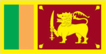
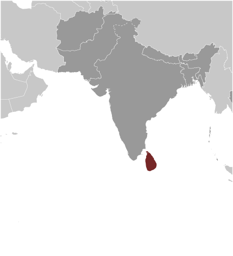
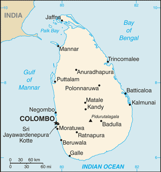

# Sri Lanka

## Introduction

**_Background:_**   
The first Sinhalese arrived in Sri Lanka late in the 6th century B.C., probably from northern India. Buddhism was introduced in about the mid-third century B.C., and a great civilization developed at the cities of Anuradhapura (kingdom from circa 200 B.C. to circa A.D. 1000) and Polonnaruwa (from about 1070 to 1200). In the 14th century, a south Indian dynasty established a Tamil kingdom in northern Sri Lanka. The coastal areas of the island were controlled by the Portuguese in the 16th century and by the Dutch in the 17th century. The island was ceded to the British in 1796, became a crown colony in 1802, and was formally united under British rule by 1815. As Ceylon, it became independent in 1948; its name was changed to Sri Lanka in 1972. Tensions between the Sinhalese majority and Tamil separatists erupted into war in 1983. After two decades of fighting, the government and Liberation Tigers of Tamil Eelam (LTTE) formalized a cease-fire in February 2002 with Norway brokering peace negotiations. Violence between the LTTE and government forces intensified in 2006, but the government regained control of the Eastern Province in 2007. By May 2009, the government announced that its military had defeated the remnants of the LTTE. Since the end of the conflict, the government has enacted an ambitious program of economic development projects, many of which are financed by loans from the Government of China. In addition to efforts to reconstruct its economy, the government has resettled more than 95% of those civilians who were displaced during the final phase of the conflict and released the vast majority of former LTTE combatants captured by Government Security Forces. At the same time, there has been little progress on more contentious and politically difficult issues such as reaching a political settlement with Tamil elected representatives and holding accountable those alleged to have been involved in human rights violations and other abuses during the conflict.

## Geography

**_Location:_**   
Southern Asia, island in the Indian Ocean, south of India

**_Geographic coordinates:_**   
7 00 N, 81 00 E

**_Map references:_**   
Asia

**_Area:_**   
**total:** 65,610 sq km   
**land:** 64,630 sq km   
**water:** 980 sq km

**_Area - comparative:_**   
slightly larger than West Virginia

**_Land boundaries:_**   
0 km

**_Coastline:_**   
1,340 km

**_Maritime claims:_**   
**territorial sea:** 12 nm   
**contiguous zone:** 24 nm   
**exclusive economic zone:** 200 nm   
**continental shelf:** 200 nm or to the edge of the continental margin

**_Climate:_**   
tropical monsoon; northeast monsoon (December to March); southwest monsoon (June to October)

**_Terrain:_**   
mostly low, flat to rolling plain; mountains in south-central interior

**_Elevation extremes:_**   
**lowest point:** Indian Ocean 0 m   
**highest point:** Pidurutalagala 2,524 m

**_Natural resources:_**   
limestone, graphite, mineral sands, gems, phosphates, clay, hydropower

**_Land use:_**   
**arable land:** 18.29%   
**permanent crops:** 14.94%   
**other:** 66.77% (2011)

**_Irrigated land:_**   
5,700 sq km (2003)

**_Total renewable water resources:_**   
52.8 cu km (2011)

**_Freshwater withdrawal (domestic/industrial/agricultural):_**   
**total:** 12.95 cu km/yr (6%/6%/87%)   
**per capita:** 638.8 cu m/yr (2005)

**_Natural hazards:_**   
occasional cyclones and tornadoes

**_Environment - current issues:_**   
deforestation; soil erosion; wildlife populations threatened by poaching and urbanization; coastal degradation from mining activities and increased pollution; freshwater resources being polluted by industrial wastes and sewage runoff; waste disposal; air pollution in Colombo

**_Environment - international agreements:_**   
**party to:** Biodiversity, Climate Change, Climate Change-Kyoto Protocol, Desertification, Endangered Species, Environmental Modification, Hazardous Wastes, Law of the Sea, Ozone Layer Protection, Ship Pollution, Wetlands   
**signed, but not ratified:** Marine Life Conservation

**_Geography - note:_**   
strategic location near major Indian Ocean sea lanes

## People and Society

**_Nationality:_**   
**noun:** Sri Lankan(s)   
**adjective:** Sri Lankan

**_Ethnic groups:_**   
Sinhalese 73.8%, Sri Lankan Moors 7.2%, Indian Tamil 4.6%, Sri Lankan Tamil 3.9%, other 0.5%, unspecified 10% (2001 census provisional data)

**_Languages:_**   
Sinhala (official and national language) 74%, Tamil (national language) 18%, other 8%   
**note:** English, spoken competently by about 10% of the population, is commonly used in government and is referred to as the link language in the constitution

**_Religions:_**   
Buddhist (official) 69.1%, Muslim 7.6%, Hindu 7.1%, Christian 6.2%, unspecified 10% (2001 census provisional data)

**_Population:_**   
21,866,445 (July 2014 est.)

**_Age structure:_**   
**0-14 years:** 24.7% (male 2,758,360/female 2,648,073)   
**15-24 years:** 14.9% (male 1,651,901/female 1,606,465)   
**25-54 years:** 42.1% (male 4,504,395/female 4,708,288)   
**55-64 years:** 9.5% (male 966,295/female 1,117,310)   
**65 years and over:** 8.7% (male 812,669/female 1,092,689) (2014 est.)

**_Dependency ratios:_**   
**total dependency ratio:** 51.3 %   
**youth dependency ratio:** 38.1 %   
**elderly dependency ratio:** 13.2 %   
**potential support ratio:** 7.6 (2014 est.)

**_Median age:_**   
**total:** 31.8 years   
**male:** 30.6 years   
**female:** 32.9 years (2014 est.)

**_Population growth rate:_**   
0.86% (2014 est.)

**_Birth rate:_**   
16.24 births/1,000 population (2014 est.)

**_Death rate:_**   
6.06 deaths/1,000 population (2014 est.)

**_Net migration rate:_**   
-1.54 migrant(s)/1,000 population (2014 est.)

**_Urbanization:_**   
**urban population:** 15.1% of total population (2011)   
**rate of urbanization:** 1.36% annual rate of change (2010-15 est.)

**_Major urban areas - population:_**   
COLOMBO (capital) 693,000; Sri Jayewardenepura Kotte (legislative capital) 126,000 (2011)

**_Sex ratio:_**   
**at birth:** 1.04 male(s)/female   
**0-14 years:** 1.04 male(s)/female   
**15-24 years:** 1.03 male(s)/female   
**25-54 years:** 0.96 male(s)/female   
**55-64 years:** 0.96 male(s)/female   
**65 years and over:** 0.75 male(s)/female   
**total population:** 0.96 male(s)/female (2014 est.)

**_Mother's mean age at first birth:_**   
25.4   
**note:** median age at first birth among women 30-34 (2006-07 est.)

**_Maternal mortality rate:_**   
35 deaths/100,000 live births (2010)

**_Infant mortality rate:_**   
**total:** 9.02 deaths/1,000 live births   
**male:** 9.98 deaths/1,000 live births   
**female:** 8.02 deaths/1,000 live births (2014 est.)

**_Life expectancy at birth:_**   
**total population:** 76.35 years   
**male:** 72.85 years   
**female:** 79.99 years (2014 est.)

**_Total fertility rate:_**   
2.13 children born/woman (2014 est.)

**_Contraceptive prevalence rate:_**   
68% (2006/07)

**_Health expenditures:_**   
3.4% of GDP (2011)

**_Physicians density:_**   
0.49 physicians/1,000 population (2006)

**_Hospital bed density:_**   
3.1 beds/1,000 population (2004)

**_Drinking water source:_**   
**improved:** urban: 99.1% of population; rural: 92.9% of population; total: 93.8% of population   
**unimproved:** urban: 0.9% of population; rural: 7.1% of population; total: 6.2% of population (2012 est.)

**_Sanitation facility access:_**   
**improved:** urban: 82.9% of population; rural: 93.9% of population; total: 92.3% of population   
**unimproved:** urban: 17.1% of population; rural: 6.1% of population; total: 7.7% of population (2012 est.)

**_HIV/AIDS - adult prevalence rate:_**   
0.1% (2012 est.)

**_HIV/AIDS - people living with HIV/AIDS:_**   
3,000 (2012 est.)

**_HIV/AIDS - deaths:_**   
200 (2012 est.)

**_Major infectious diseases:_**   
**degree of risk:** high   
**food or waterborne diseases:** bacterial diarrhea and hepatitis A   
**vectorborne disease:** dengue fever   
**water contact disease:** leptospirosis   
**animal contact disease:** rabies (2013)

**_Obesity - adult prevalence rate:_**   
5.1% (2008)

**_Children under the age of 5 years underweight:_**   
21.6% (2009)

**_Education expenditures:_**   
1.7% of GDP (2012)

**_Literacy:_**   
**definition:** age 15 and over can read and write   
**total population:** 91.2%   
**male:** 92.6%   
**female:** 90% (2010 census)

**_School life expectancy (primary to tertiary education):_**   
**total:** 14 years   
**male:** 13 years   
**female:** 14 years (2012)

**_Unemployment, youth ages 15-24:_**   
**total:** 17.3%   
**male:** 14%   
**female:** 23.5% (2012)

## Government

**_Country name:_**   
**conventional long form:** Democratic Socialist Republic of Sri Lanka   
**conventional short form:** Sri Lanka   
**local long form:** Shri Lanka Prajatantrika Samajavadi Janarajaya/Ilankai Jananayaka Choshalichak Kutiyarachu   
**local short form:** Shri Lanka/Ilankai   
**former:** Serendib, Ceylon

**_Government type:_**   
republic

**_Capital:_**   
**name:** Colombo; note - Sri Jayewardenepura Kotte is the legislative capital   
**geographic coordinates:** 6 55 N, 79 50 E   
**time difference:** UTC+5.5 (10.5 hours ahead of Washington, DC, during Standard Time)

**_Administrative divisions:_**   
9 provinces; Central, Eastern, North Central, Northern, North Western, Sabaragamuwa, Southern, Uva, Western

**_Independence:_**   
4 February 1948 (from the UK)

**_National holiday:_**   
Independence Day, 4 February (1948)

**_Constitution:_**   
several previous; latest adopted 16 August 1978, certified 31 August 1978; amended many times, last in 2010 (2010)

**_Legal system:_**   
mixed legal system of Roman-Dutch civil law, English common law, and Jaffna Tamil customary law

**_International law organization participation:_**   
has not submitted an ICJ jurisdiction declaration; non-party state to the ICCt

**_Suffrage:_**   
18 years of age; universal

**_Executive branch:_**   
**chief of state:** President Mahinda Percy RAJAPAKSA (since 19 November 2005); note - the president is both chief of state and head of government; Dissanayake Mudiyanselage JAYARATNE holds the largely ceremonial title of prime minister (since 21 April 2010)   
**head of government:** President Mahinda Percy RAJAPAKSA (since 19 November 2005)   
**cabinet:** Cabinet appointed by the president in consultation with the prime minister   
**elections:** president elected by popular vote for a six-year term, eligible for a second term; election last held on 26 January 2010 (next to be held in 2016)   
**election results:** Mahinda Percy RAJAPAKSA re-elected president; percent of vote - Mahinda Percy RAJAPAKSA 57.88%, Sarath FONSEKA 40.15%, other 1.97%

**_Legislative branch:_**   
unicameral Parliament (225 seats; members elected by popular vote on the basis of an open-list, proportional representation system by electoral district to serve six-year terms)   
**elections:** last held on 8 April 2010 with a repoll in two electorates held on 20 April 2010 (next to be held by April 2016)   
**election results:** percent of vote by alliance or party - United People's Freedom Alliance 60.93%, United National Party 29.34%, Democratic National Alliance 5.49%, Tamil National Alliance 2.9%, other 1.34%; seats by alliance or party - United People's Freedom Alliance 144, United National Party 60, Tamil National Alliance 14, Democratic National Alliance 7

**_Judicial branch:_**   
**highest court(s):** Supreme Court of the Republic (consists of the chief justice and 10 justices); note - the court has exclusive jurisdiction to review legislation   
**judge selection and term of office:** the chief justice appointed by the president; the other justices appointed by the president with the advice of the chief justice; all justices hold office until age 65   
**subordinate courts:** Court of Appeals; High Courts; Magistrate's Courts; municipal and primary courts

**_Political parties and leaders:_**   
Coalitions and leaders: Democratic National Alliance, led by General (Retired) Sarath FONSEKA   
Janatha Vimukthi Peramuna or JVP [Somawansa AMARASINGHE]   
Tamil National Alliance led by Illandai Tamil Arasu Kachchi [R. SAMPANTHAN]   
United National Front led by United National Party [Ranil WICKREMESINGHE]   
United People's Freedom Alliance led by Sri Lanka Freedom Party [Mahinda RAJAPAKSA]

**_Political pressure groups and leaders:_**   
Buddhist clergy   
labor unions   
hard-line nationalist Sinhalese groups such as the National Movement Against Terrorism   
Sinhalese Buddhist lay groups

**_International organization participation:_**   
ABEDA, ADB, ARF, BIMSTEC, C, CD, CP, FAO, G-11, G-15, G-24, G-77, IAEA, IBRD, ICAO, ICC (national committees), ICRM, IDA, IFAD, IFC, IFRCS, IHO, ILO, IMF, IMO, IMSO, Interpol, IOC, IOM, IPU, ISO, ITSO, ITU, ITUC (NGOs), MIGA, MINURSO, MINUSTAH, MONUSCO, NAM, OAS (observer), OPCW, PCA, SAARC, SACEP, SCO (dialogue member), UN, UNCTAD, UNESCO, UNIDO, UNIFIL, UNISFA, UNMISS, UNWTO, UPU, WCO, WFTU (NGOs), WHO, WIPO, WMO, WTO

**_Diplomatic representation in the US:_**   
**chief of mission:** Ambassador Designate Prasad KARIYAWASAM (since 2014)   
**chancery:** 2148 Wyoming Avenue NW, Washington, DC 20008   
**telephone:** [1] (202) 483-4025 through 4028   
**FAX:** [1] (202) 232-7181   
**consulate(s) general:** Los Angeles   
**consulate(s):** New York

**_Diplomatic representation from the US:_**   
**chief of mission:** Ambassador Michele J. SISON (since 29 September 2012); note - also accredited to Maldives   
**embassy:** 210 Galle Road, Colombo 3   
**mailing address:** P. O. Box 106, Colombo   
**telephone:** [94] (11) 249-8500   
**FAX:** [94] (11) 243-7345

**_Flag description:_**   
yellow with two panels; the smaller hoist-side panel has two equal vertical bands of green (hoist side) and orange; the other larger panel depicts a yellow lion holding a sword on a dark red rectangular field that also displays a yellow bo leaf in each corner; the yellow field appears as a border around the entire flag and extends between the two panels; the lion represents Sinhalese ethnicity, the strength of the nation, and bravery; the sword demonstrates the sovereignty of the nation; the four bo leaves - symbolizing Buddhism and its influence on the country - stand for the four virtues of kindness, friendliness, happiness, and equanimity; orange signifies Sri Lankan Tamils, green the Sri Lankan Moors; dark red represents the European Burghers, but also refers to the rich colonial background of the country; yellow denotes other ethnic groups; also referred to as the Lion Flag

**_National symbol(s):_**   
lion

**_National anthem:_**   
**name:** "Sri Lanka Matha" (Mother Sri Lanka)   
**lyrics/music:** Ananda SAMARKONE   
**note:** adopted 1951

## Economy

**_Economy - overview:_**   
Sri Lanka continues to experience strong economic growth following the end of the 26-year conflict with the Liberation Tigers of Tamil Eelam. The government has been pursuing large-scale reconstruction and development projects in its efforts to spur growth in war-torn and disadvantaged areas, develop small and medium enterprises and increase agricultural productivity. The government's high debt payments and bloated civil service have contributed to historically high budget deficits, but fiscal consolidation efforts and strong GDP growth in recent years have helped bring down the government's fiscal deficit. However, low tax revenues are a major concern. The 2008-09 global financial crisis and recession exposed Sri Lanka's economic vulnerabilities and nearly caused a balance of payments crisis. Agriculture slowed due to a drought and weak global demand affected exports and trade. In early 2012, Sri Lanka floated the rupee, resulting in a sharp depreciation, and took steps to curb imports. A large trade deficit remains a concern, but strong remittances from Sri Lankan workers abroad help offset the trade deficit. Government debt of about 80% of GDP remains among the highest in emerging markets.

**_GDP (purchasing power parity):_**   
$134.5 billion (2013 est.)   
$126.6 billion (2012 est.)   
$119 billion (2011 est.)   
**note:** data are in 2013 US dollars

**_GDP (official exchange rate):_**   
$65.12 billion (2013 est.)

**_GDP - real growth rate:_**   
6.3% (2013 est.)   
6.4% (2012 est.)   
8.2% (2011 est.)

**_GDP - per capita (PPP):_**   
$6,500 (2013 est.)   
$6,100 (2012 est.)   
$5,800 (2011 est.)   
**note:** data are in 2013 US dollars

**_Gross national saving:_**   
27% of GDP (2013 est.)   
24% of GDP (2012 est.)   
22.1% of GDP (2011 est.)

**_GDP - composition, by end use:_**   
**household consumption:** 69.7%   
**government consumption:** 13.2%   
**investment in fixed capital:** 29%   
**investment in inventories:** 1.7%   
**exports of goods and services:** 20.1%   
**imports of goods and services:** -33.7%; (2013 est.)

**_GDP - composition, by sector of origin:_**   
**agriculture:** 10.6%   
**industry:** 32.4%   
**services:** 57% (2013 est.)

**_Agriculture - products:_**   
rice, sugarcane, grains, pulses, oilseed, spices, vegetables, fruit, tea, rubber, coconuts; milk, eggs, hides, beef; fish

**_Industries:_**   
processing of rubber, tea, coconuts, tobacco and other agricultural commodities; telecommunications, insurance, banking; tourism, shipping; clothing, textiles; cement, petroleum refining, information technology services, construction

**_Industrial production growth rate:_**   
10% (2013 est.)

**_Labor force:_**   
8.528 million (2013 est.)

**_Labor force - by occupation:_**   
**agriculture:** 31.8%   
**industry:** 25.8%   
**services:** 42.4% (June 2012)

**_Unemployment rate:_**   
5.1% (2013 est.)   
4% (2012 est.)

**_Population below poverty line:_**   
8.9% (2010 est.)

**_Household income or consumption by percentage share:_**   
**lowest 10%:** 1.6%   
**highest 10%:** 39.5% (2009)

**_Distribution of family income - Gini index:_**   
49 (2010)   
46 (1995)

**_Budget:_**   
**revenues:** $8.43 billion   
**expenditures:** $12.57 billion (2013 est.)

**_Taxes and other revenues:_**   
12.9% of GDP (2013 est.)

**_Budget surplus (+) or deficit (-):_**   
-6.4% of GDP (2013 est.)

**_Public debt:_**   
78.4% of GDP (2013 est.)   
79.1% of GDP (2012 est.)   
**note:** covers central government debt, and excludes debt instruments directly owned by government entities other than the treasury (e.g. commercial bank borrowings of a government corporation); the data includes treasury debt held by foreign entities as well as intra-governmental debt; intra-governmental debt consists of treasury borrowings from surpluses in the social funds, such as for retirement; sub-national entities are usually not permitted to sell debt instruments

**_Fiscal year:_**   
calendar year

**_Inflation rate (consumer prices):_**   
4.7% (2013 est.)   
9.2% (2012 est.)

**_Central bank discount rate:_**   
6.5% (31 December 2013 est.)   
7.5% (19 December 2012 est.)

**_Commercial bank prime lending rate:_**   
9.88% (31 December 2013 est.)   
14.4% (31 December 2012 est.)

**_Stock of narrow money:_**   
$3.629 billion (31 December 2013 est.)   
$3.539 billion (31 December 2012 est.)

**_Stock of broad money:_**   
$23.55 billion (31 December 2013 est.)   
$20.39 billion (31 December 2012 est.)

**_Stock of domestic credit:_**   
$32.98 billion (31 December 2013 est.)   
$28.86 billion (31 December 2012 est.)

**_Market value of publicly traded shares:_**   
$18.48 billion (31 November 2013 est.)   
$17.05 billion (31 December 2012)   
$19.44 billion (31 December 2011 est.)

**_Current account balance:_**   
-$2.452 billion (2013 est.)   
-$3.931 billion (2012 est.)

**_Exports:_**   
$10.39 billion (2013 est.)   
$9.774 billion (2012 est.)

**_Exports - commodities:_**   
textiles and apparel, tea and spices; rubber manufactures; precious stones; coconut products, fish

**_Exports - partners:_**   
US 20.4%, UK 9.9%, India 5.8%, Italy 4.7%, Belgium 4.3%, Germany 4.3% (2012)

**_Imports:_**   
$18 billion (2013 est.)   
$19.19 billion (2012 est.)

**_Imports - commodities:_**   
petroleum, textiles, machinery and transportation equipment, building materials, mineral products, foodstuffs

**_Imports - partners:_**   
India 22.7%, Singapore 8.8%, UAE 7.7%, China 7%, Iran 6.1%, Malaysia 4.5% (2012)

**_Reserves of foreign exchange and gold:_**   
$7.2 billion (31 December 2013 est.)   
$6.9 billion (31 December 2012 est.)

**_Debt - external:_**   
$33.67 billion (31 December 2013 est.)   
$29.39 billion (31 December 2012 est.)

**_Stock of direct foreign investment - at home:_**   
$NA

**_Stock of direct foreign investment - abroad:_**   
$NA

**_Exchange rates:_**   
Sri Lankan rupees (LKR) per US dollar -   
129.6 (2013 est.)   
127.6 (2012 est.)   
113.06 (2010 est.)   
114.95 (2009)   
108.33 (2008)

## Energy

**_Electricity - production:_**   
11.8 billion kWh (2012 est.)

**_Electricity - consumption:_**   
8.927 billion kWh (2011 est.)

**_Electricity - exports:_**   
0 kWh (2012 est.)

**_Electricity - imports:_**   
0 kWh (2012 est.)

**_Electricity - installed generating capacity:_**   
2.685 million kW (2010 est.)

**_Electricity - from fossil fuels:_**   
53.8% of total installed capacity (2011 est.)

**_Electricity - from nuclear fuels:_**   
0% of total installed capacity (2011 est.)

**_Electricity - from hydroelectric plants:_**   
44.6% of total installed capacity (2011 est.)

**_Electricity - from other renewable sources:_**   
1.6% of total installed capacity (2011 est.)

**_Crude oil - production:_**   
0 bbl/day (2012 est.)

**_Crude oil - exports:_**   
0 bbl/day (2010 est.)

**_Crude oil - imports:_**   
36,380 bbl/day (2010 est.)

**_Crude oil - proved reserves:_**   
0 bbl (1 January 2013 est.)

**_Refined petroleum products - production:_**   
35,440 bbl/day (2010 est.)

**_Refined petroleum products - consumption:_**   
89,620 bbl/day (2011 est.)

**_Refined petroleum products - exports:_**   
0 bbl/day (2010 est.)

**_Refined petroleum products - imports:_**   
44,270 bbl/day (2010 est.)

**_Natural gas - production:_**   
0 cu m (2012 est.)

**_Natural gas - consumption:_**   
0 cu m (2012 est.)

**_Natural gas - exports:_**   
0 cu m (2012 est.)

**_Natural gas - imports:_**   
0 cu m (2012 est.)

**_Natural gas - proved reserves:_**   
0 cu m (1 January 2013 est.)

**_Carbon dioxide emissions from consumption of energy:_**   
13.1 million Mt (2011 est.)

## Communications

**_Telephones - main lines in use:_**   
2.796 million (2013)

**_Telephones - mobile cellular:_**   
19.533 million (2013)

**_Telephone system:_**   
**general assessment:** telephone services have improved significantly and are available in most parts of the country   
**domestic:** national trunk network consists mostly of digital microwave radio relay; fiber-optic links now in use in Colombo area and fixed wireless local loops have been installed; competition is strong in mobile cellular systems and mobile cellular subscribership is increasing   
**international:** country code - 94; the SEA-ME-WE-3 and SEA-ME-WE-4 submarine cables provide connectivity to Asia, Australia, Middle East, Europe, US; satellite earth stations - 2 Intelsat (Indian Ocean) (2011)

**_Broadcast media:_**   
government operates 8 TV channels and a radio network; multi-channel satellite and cable TV subscription services available; 35 private TV stations and about 50 radio stations (2012)

**_Internet country code:_**   
.lk

**_Internet hosts:_**   
9,552 (2012)

**_Internet users:_**   
1.777 million (2009)

## Transportation

**_Airports:_**   
19 (2013)

**_Airports - with paved runways:_**   
**total:** 15   
**over 3,047 m:** 2   
**1,524 to 2,437 m:** 6   
**914 to 1,523 m:** 7 (2013)

**_Airports - with unpaved runways:_**   
**total:** 4   
**914 to 1,523 m:** 1   
**under 914 m:** 3 (2013)

**_Heliports:_**   
1 (2013)

**_Railways:_**   
**total:** 1,449 km   
**broad gauge:** 1,449 km 1.676-m gauge (2007)

**_Roadways:_**   
**total:** 114,093 km   
**paved:** 16,977 km   
**unpaved:** 97,116 km (2010)

**_Waterways:_**   
160 km (primarily on rivers in southwest) (2012)

**_Merchant marine:_**   
**total:** 21   
**by type:** bulk carrier 4, cargo 13, chemical tanker 1, container 1, petroleum tanker 2   
**foreign-owned:** 8 (Germany 8) (2010)

**_Ports and terminals:_**   
**major seaport(s):** Colombo   
**container port(s) (TEUs):** Colombo (3,651,963)

## Military

**_Military branches:_**   
Sri Lanka Army, Sri Lanka Navy, Sri Lanka Air Force (2013)

**_Military service age and obligation:_**   
18-22 years of age for voluntary military service; no conscription; 5-year service obligation (Air Force) (2012)

**_Manpower available for military service:_**   
**males age 16-49:** 5,342,147   
**females age 16-49:** 5,466,409 (2010 est.)

**_Manpower fit for military service:_**   
**males age 16-49:** 4,177,432   
**females age 16-49:** 4,574,833 (2010 est.)

**_Manpower reaching militarily significant age annually:_**   
**male:** 167,026   
**female:** 162,587 (2010 est.)

**_Military expenditures:_**   
2.43% of GDP (2012)   
2.89% of GDP (2011)   
2.43% of GDP (2010)

## Transnational Issues

**_Disputes - international:_**   
none

**_Refugees and internally displaced persons:_**   
**IDPs:** up to 90,000 (civil war; more than half displaced prior to 2008; many of the more than 480,000 IDPs registered as returnees have not reached durable solutions) (2014)

**_Trafficking in persons:_**   
**current situation:** Sri Lanka is primarily a source and, to a much lesser extent, a destination country for men, women, and children subjected to forced labor and sex trafficking; some Sri Lankan adults and children who migrate willingly to Saudi Arabia, Kuwait, Qatar, the United Arab Emirates, Jordan, Bahrain, Lebanon, Iraq, Afghanistan, Malaysia, and Singapore to work as domestic servants, construction workers, or garment factory workers face conditions indicative of forced labor; some Sri Lankan women are forced into prostitution in Jordan, Singapore, Maldives, and other countries; within Sri Lanka, women and children are subjected to sex trafficking in brothels, while other children are forced to work in the agriculture, fireworks, and fish-drying industries

............................................................   
_Page last updated on June 23, 2014_
