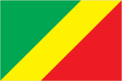
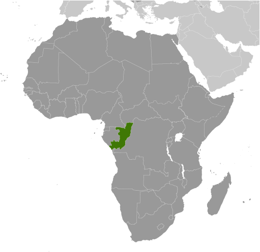
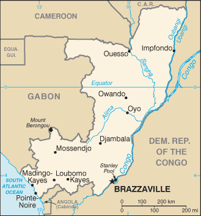

# Congo, Republic of the

## Introduction

**_Background:_**   
Upon independence in 1960, the former French region of Middle Congo became the Republic of the Congo. A quarter century of experimentation with Marxism was abandoned in 1990 and a democratically elected government took office in 1992. A brief civil war in 1997 restored former Marxist President Denis SASSOU-Nguesso, and ushered in a period of ethnic and political unrest. Southern-based rebel groups agreed to a final peace accord in March 2003, but the calm is tenuous and refugees continue to present a humanitarian crisis. The Republic of Congo is one of Africa's largest petroleum producers, but with declining production it will need new offshore oil finds to sustain its oil earnings over the long term.

## Geography

**_Location:_**   
Central Africa, bordering the South Atlantic Ocean, between Angola and Gabon

**_Geographic coordinates:_**   
1 00 S, 15 00 E

**_Map references:_**   
Africa

**_Area:_**   
**total:** 342,000 sq km   
**land:** 341,500 sq km   
**water:** 500 sq km

**_Area - comparative:_**   
slightly smaller than Montana

**_Land boundaries:_**   
**total:** 5,008 km   
**border countries:** Angola 231 km, Cameroon 494 km, Central African Republic 487 km, Democratic Republic of the Congo 1,229 km, Gabon 2,567 km

**_Coastline:_**   
169 km

**_Maritime claims:_**   
**territorial sea:** 200 nm

**_Climate:_**   
tropical; rainy season (March to June); dry season (June to October); persistent high temperatures and humidity; particularly enervating climate astride the Equator

**_Terrain:_**   
coastal plain, southern basin, central plateau, northern basin

**_Elevation extremes:_**   
**lowest point:** Atlantic Ocean 0 m   
**highest point:** Mount Berongou 903 m

**_Natural resources:_**   
petroleum, timber, potash, lead, zinc, uranium, copper, phosphates, gold, magnesium, natural gas, hydropower

**_Land use:_**   
**arable land:** 1.46%   
**permanent crops:** 0.18%   
**other:** 98.36% (2011)

**_Irrigated land:_**   
20 sq km (2003)

**_Total renewable water resources:_**   
832 cu km (2011)

**_Freshwater withdrawal (domestic/industrial/agricultural):_**   
**total:** 0.05 cu km/yr (69%/26%/4%)   
**per capita:** 13.99 cu m/yr (2005)

**_Natural hazards:_**   
seasonal flooding

**_Environment - current issues:_**   
air pollution from vehicle emissions; water pollution from the dumping of raw sewage; tap water is not potable; deforestation

**_Environment - international agreements:_**   
**party to:** Biodiversity, Climate Change, Climate Change-Kyoto Protocol, Desertification, Endangered Species, Hazardous Wastes, Law of the Sea, Ozone Layer Protection, Ship Pollution, Tropical Timber 83, Tropical Timber 94, Wetlands   
**signed, but not ratified:** none of the selected agreements

**_Geography - note:_**   
about 70% of the population lives in Brazzaville, Pointe-Noire, or along the railroad between them

## People and Society

**_Nationality:_**   
**noun:** Congolese (singular and plural)   
**adjective:** Congolese or Congo

**_Ethnic groups:_**   
Kongo 48%, Sangha 20%, M'Bochi 12%, Teke 17%, Europeans and other 3%

**_Languages:_**   
French (official), Lingala and Monokutuba (lingua franca trade languages), many local languages and dialects (of which Kikongo is the most widespread)

**_Religions:_**   
Roman Catholic 33.1%, Awakening Churches/Christian Revival 22.3%, Protestant 19.9%, Salutiste 2.2%, Muslim 1.6%, Kimbanguiste 1.5%, other 8.1%, none 11.3% (2010 est.)

**_Population:_**   
4,662,446   
**note:** estimates for this country explicitly take into account the effects of excess mortality due to AIDS; this can result in lower life expectancy, higher infant mortality, higher death rates, lower population growth rates, and changes in the distribution of population by age and sex than would otherwise be expected (July 2014 est.)

**_Age structure:_**   
**0-14 years:** 41.1% (male 966,852/female 950,411)   
**15-24 years:** 17.7% (male 411,263/female 413,594)   
**25-54 years:** 34.2% (male 808,181/female 787,554)   
**55-64 years:** 4% (male 90,795/female 94,837)   
**65 years and over:** 2.7% (male 60,400/female 78,559) (2014 est.)

**_Dependency ratios:_**   
**total dependency ratio:** 85 %   
**youth dependency ratio:** 78.7 %   
**elderly dependency ratio:** 6.3 %   
**potential support ratio:** 16 (2014 est.)

**_Median age:_**   
**total:** 19.8 years   
**male:** 19.7 years   
**female:** 20 years (2014 est.)

**_Population growth rate:_**   
1.94% (2014 est.)

**_Birth rate:_**   
36.59 births/1,000 population (2014 est.)

**_Death rate:_**   
10.17 deaths/1,000 population (2014 est.)

**_Net migration rate:_**   
-7.02 migrant(s)/1,000 population (2014 est.)

**_Urbanization:_**   
**urban population:** 63.7% of total population (2011)   
**rate of urbanization:** 2.84% annual rate of change (2010-15 est.)

**_Major urban areas - population:_**   
BRAZZAVILLE (capital) 1.611 million; Pointe-Noire 834,000 (2011)

**_Sex ratio:_**   
**at birth:** 1.03 male(s)/female   
**0-14 years:** 1.02 male(s)/female   
**15-24 years:** 0.99 male(s)/female   
**25-54 years:** 1.03 male(s)/female   
**55-64 years:** 1.01 male(s)/female   
**65 years and over:** 0.69 male(s)/female   
**total population:** 0.99 male(s)/female (2014 est.)

**_Mother's mean age at first birth:_**   
19.8   
**note:** median age at first birth among women 25-29 (2011-12 est.)

**_Maternal mortality rate:_**   
560 deaths/100,000 live births (2010)

**_Infant mortality rate:_**   
**total:** 59.34 deaths/1,000 live births   
**male:** 64.49 deaths/1,000 live births   
**female:** 54.04 deaths/1,000 live births (2014 est.)

**_Life expectancy at birth:_**   
**total population:** 58.52 years   
**male:** 57.38 years   
**female:** 59.7 years (2014 est.)

**_Total fertility rate:_**   
4.73 children born/woman (2014 est.)

**_Contraceptive prevalence rate:_**   
44.7% (2011/12)

**_Health expenditures:_**   
2.5% of GDP (2011)

**_Physicians density:_**   
0.1 physicians/1,000 population (2007)

**_Hospital bed density:_**   
1.6 beds/1,000 population (2005)

**_Drinking water source:_**   
**improved:** urban: 95.7% of population; rural: 38.8% of population; total: 75.3% of population   
**unimproved:** urban: 4.3% of population; rural: 61.2% of population; total: 24.7% of population (2012 est.)

**_Sanitation facility access:_**   
**improved:** urban: 19.6% of population; rural: 5.6% of population; total: 14.6% of population   
**unimproved:** urban: 80.4% of population; rural: 94.4% of population; total: 85.4% of population (2012 est.)

**_HIV/AIDS - adult prevalence rate:_**   
2.8% (2012 est.)

**_HIV/AIDS - people living with HIV/AIDS:_**   
74,500 (2012 est.)

**_HIV/AIDS - deaths:_**   
5,200 (2012 est.)

**_Major infectious diseases:_**   
**degree of risk:** very high   
**food or waterborne diseases:** bacterial and protozoal diarrhea, hepatitis A, and typhoid fever   
**vectorborne disease:** malaria and dengue fever   
**animal contact disease:** rabies   
**water contact disease:** schistosomiasis (2013)

**_Obesity - adult prevalence rate:_**   
4.7% (2008)

**_Children under the age of 5 years underweight:_**   
11.8% (2005)

**_Education expenditures:_**   
6.2% of GDP (2010)

**_Literacy:_**   
**definition:** age 15 and over can read and write   
**total population:** 83.8%   
**male:** 89.6%   
**female:** 78.4% (2003 est.)

**_School life expectancy (primary to tertiary education):_**   
**total:** 11 years   
**male:** 11 years   
**female:** 11 years (2012)

**_Child labor - children ages 5-14:_**   
**total number:** 252,171   
**percentage:** 25 % (2005 est.)

## Government

**_Country name:_**   
**conventional long form:** Republic of the Congo   
**conventional short form:** Congo (Brazzaville)   
**local long form:** Republique du Congo   
**local short form:** none   
**former:** Middle Congo, Congo/Brazzaville, Congo

**_Government type:_**   
republic

**_Capital:_**   
**name:** Brazzaville   
**geographic coordinates:** 4 15 S, 15 17 E   
**time difference:** UTC+1 (6 hours ahead of Washington, DC, during Standard Time)

**_Administrative divisions:_**   
12 departments (departments, singular - department); Bouenza, Brazzaville, Cuvette, Cuvette-Ouest, Kouilou, Lekoumou, Likouala, Niari, Plateaux, Pointe-Noire, Pool, Sangha

**_Independence:_**   
15 August 1960 (from France)

**_National holiday:_**   
Independence Day, 15 August (1960)

**_Constitution:_**   
previous 1992; latest approved by referendum 20 January 2002 (2002)

**_Legal system:_**   
mixed legal system of French civil law and customary law

**_International law organization participation:_**   
has not submitted an ICJ jurisdiction declaration; accepts ICCt jurisdiction

**_Suffrage:_**   
18 years of age; universal

**_Executive branch:_**   
**chief of state:** President Denis SASSOU-Nguesso (since 25 October 1997, following the civil war in which he toppled elected president Pascal LISSOUBA); note - the president is both chief of state and head of government   
**head of government:** President Denis SASSOU-Nguesso (since 25 October 1997); note - the position of prime minister was abolished in September 2009   
**cabinet:** Council of Ministers appointed by the president   
**elections:** president elected by popular vote for a seven-year term (eligible for a second term); election last held on 12 July 2009 (next to be held in 2016)   
**election results:** Denis SASSOU-Nguesso reelected president; percent of vote - Denis SASSOU-Nguesso 78.6%, Joseph Kignoumbi Kia MBOUNGOU 7.5%, Nicephore Fylla de SAINT-EUDES 7%, other 6.9%

**_Legislative branch:_**   
bicameral Parliament consists of the Senate (72 seats; members elected by indirect vote to serve five-year terms) and the National Assembly (139 seats; members elected by popular vote to serve six-year terms)   
**elections:** Senate - last held on 5 August 2008 (next to be held in July 2014); National Assembly - last held on 15 July and 5 August 2012 (next to be held in 2018)   
**election results:** Senate - percent of vote by party - NA; seats by party - RMP 33, FDU 23, UPADS 2, independents 7, other 7; National Assembly - percent of vote by party - NA; seats by party - PCT (and allies) 117, UPADS 7, independents 12, vacant 3

**_Judicial branch:_**   
**highest court(s):** Supreme Court or Cour Supreme (consists of NA judges); note - the High Court of Justice, outside the judicial authority, tries cases involving treason by the president of the republic   
**judge selection and term of office:** judges elected by parliament and serve until retirement age   
**subordinate courts:** courts of appeal; regional and district courts; employment tribunals; juvenile courts

**_Political parties and leaders:_**   
Action Movement for Renewal or MAR   
Congolese Labour Party or PCT   
Congolese Movement for Democracy and Integral Development or MCDDI [Michel MAMPOUYA]   
Movement for Solidarity and Development or MSD   
Pan-African Union for Social Development or UPADS [Martin MBERI]   
Rally for Democracy and the Republic or RDR [Raymond Damasge NGOLLO]   
Rally for Democracy and Social Progress or RDPS [Jean-Pierre Thystere TCHICAYA, president]   
Rally of the Presidential Majority or RMP   
Union for Democracy and Republic or UDR   
United Democratic Forces or FDU [Sebastian EBAO]   
many smaller parties

**_Political pressure groups and leaders:_**   
Congolese Trade Union Congress or CSC   
General Union of Congolese Pupils and Students or UGEEC   
Revolutionary Union of Congolese Women or URFC   
Union of Congolese Socialist Youth or UJSC

**_International organization participation:_**   
ACP, AfDB, AU, BDEAC, CEMAC, EITI (candidate country), FAO, FZ, G-77, IAEA, IBRD, ICAO, ICRM, IDA, IFAD, IFC, IFRCS, ILO, IMF, IMO, Interpol, IOC, IOM, IPU, ISO (correspondent), ITSO, ITU, ITUC (NGOs), MIGA, NAM, OIF, OPCW, UN, UNCTAD, UNESCO, UNHCR, UNIDO, UNITAR, UNWTO, UPU, WCO, WFTU (NGOs), WHO, WIPO, WMO, WTO

**_Diplomatic representation in the US:_**   
**chief of mission:** Ambassador Serge MOMBOULI (since 31 July 2001)   
**chancery:** 1720 16th Street NW, Washington, DC 20009   
**telephone:** [1] (202) 726-5500   
**FAX:** [1] (202) 726-1860

**_Diplomatic representation from the US:_**   
**chief of mission:** Ambassador Stephanie S. Sullivan (since 12 August 2013)   
**embassy:** 70-83 Section D, Maya-Maya Boulevard, Brazzaville;   
**mailing address:** B.P. 1015, Brazzaville   
**telephone:** [242] 06 612-200

**_Flag description:_**   
divided diagonally from the lower hoist side by a yellow band; the upper triangle (hoist side) is green and the lower triangle is red; green symbolizes agriculture and forests, yellow the friendship and nobility of the people, red is unexplained but has been associated with the struggle for independence   
**note:** uses the popular Pan-African colors of Ethiopia

**_National symbol(s):_**   
lion; elephant

**_National anthem:_**   
**name:** "La Congolaise" (The Congolese)   
**lyrics/music:** Jacques TONDRA and Georges KIBANGHI/Jean ROYER and Joseph SPADILIERE   
**note:** originally adopted 1959, restored 1991

## Economy

**_Economy - overview:_**   
The economy is a mixture of subsistence hunting and agriculture, an industrial sector based largely on oil and support services, and government spending. Oil has supplanted forestry as the mainstay of the economy, providing a major share of government revenues and exports. Natural gas is increasingly being converted to electricity rather than being flared, greatly improving energy prospects. New mining projects, particularly iron ore, that entered production in late 2013 may add as much as $1 billion to annual government revenue. Economic reform efforts have been undertaken with the support of international organizations, notably the World Bank and the IMF, including recently concluded Article IV consultations. The current administration faces difficult economic challenges of stimulating recovery and reducing poverty. The drop in oil prices during the global crisis reduced oil revenue by about 30%, but the subsequent recovery of oil prices boosted the economy's GDP from 2009-13. Officially the country became a net external creditor as of 2011, with external debt representing only about 16% of GDP and debt servicing less than 3% of government revenue.

**_GDP (purchasing power parity):_**   
$20.26 billion (2013 est.)   
$19.15 billion (2012 est.)   
$18.44 billion (2011 est.)   
**note:** data are in 2013 US dollars

**_GDP (official exchange rate):_**   
$14.25 billion (2013 est.)

**_GDP - real growth rate:_**   
5.8% (2013 est.)   
3.8% (2012 est.)   
3.4% (2011 est.)

**_GDP - per capita (PPP):_**   
$4,800 (2013 est.)   
$4,700 (2012 est.)   
$4,600 (2011 est.)   
**note:** data are in 2013 US dollars

**_Gross national saving:_**   
61.4% of GDP (2013 est.)   
56.2% of GDP (2012 est.)   
61.3% of GDP (2011 est.)

**_GDP - composition, by end use:_**   
**household consumption:** 24.8%   
**government consumption:** 11.1%   
**investment in fixed capital:** 55.4%   
**investment in inventories:** 0.9%   
**exports of goods and services:** 91.8%   
**imports of goods and services:** -84.1%; (2013 est.)

**_GDP - composition, by sector of origin:_**   
**agriculture:** 3.3%   
**industry:** 73.9%   
**services:** 22.9% (2013 est.)

**_Agriculture - products:_**   
cassava (manioc, tapioca), sugar, rice, corn, peanuts, vegetables, coffee, cocoa; forest products

**_Industries:_**   
petroleum extraction, cement, lumber, brewing, sugar, palm oil, soap, flour, cigarettes

**_Industrial production growth rate:_**   
2% (2013 est.)

**_Labor force:_**   
2.89 million (2011 est.)

**_Unemployment rate:_**   
53% (2012 est.)

**_Population below poverty line:_**   
46.5% (2011 est.)

**_Household income or consumption by percentage share:_**   
**lowest 10%:** 2.1%   
**highest 10%:** 37.1% (2005)

**_Budget:_**   
**revenues:** $6.608 billion   
**expenditures:** $4.618 billion (2013 est.)

**_Taxes and other revenues:_**   
46.4% of GDP (2013 est.)

**_Budget surplus (+) or deficit (-):_**   
14% of GDP (2013 est.)

**_Public debt:_**   
32.1% of GDP (2013 est.)   
31.8% of GDP (2012 est.)

**_Fiscal year:_**   
calendar year

**_Inflation rate (consumer prices):_**   
1.7% (2013 est.)   
3.9% (2012 est.)

**_Central bank discount rate:_**   
4.25% (31 December 2009)   
4.75% (31 December 2008)

**_Commercial bank prime lending rate:_**   
14.8% (31 December 2013 est.)   
14.8% (31 December 2012 est.)

**_Stock of narrow money:_**   
$4.678 billion (31 December 2013 est.)   
$4.403 billion (31 December 2012 est.)

**_Stock of broad money:_**   
$5.119 billion (31 December 2013 est.)   
$4.795 billion (31 December 2012 est.)

**_Stock of domestic credit:_**   
$-1.053 billion (31 December 2013 est.)   
$-1.448 billion (31 December 2012 est.)

**_Market value of publicly traded shares:_**   
$NA

**_Current account balance:_**   
$638.2 million (2013 est.)   
$187.9 million (2012 est.)

**_Exports:_**   
$9.912 billion (2013 est.)   
$10.53 billion (2012 est.)

**_Exports - commodities:_**   
petroleum, lumber, plywood, sugar, cocoa, coffee, diamonds

**_Exports - partners:_**   
China 39%, US 13%, France 9.5%, Australia 8.8%, Netherlands 6.8%, Spain 5.3%, India 5.2% (2012)

**_Imports:_**   
$4.297 billion (2013 est.)   
$4.45 billion (2012 est.)

**_Imports - commodities:_**   
capital equipment, construction materials, foodstuffs

**_Imports - partners:_**   
France 19.5%, China 13.5%, Brazil 9.1%, US 6.1%, India 5.8%, Italy 4.8%, Belgium 4.4% (2012)

**_Reserves of foreign exchange and gold:_**   
$5.239 billion (31 December 2013 est.)   
$5.568 billion (31 December 2012 est.)

**_Debt - external:_**   
$3.274 billion (31 December 2013 est.)   
$2.999 billion (31 December 2012 est.)

**_Exchange rates:_**   
Cooperation Financiere en Afrique Centrale francs (XAF) per US dollar -   
500.7 (2013 est.)   
510.53 (2012 est.)   
495.28 (2010 est.)   
472.19 (2009)   
447.81 (2008)

## Energy

**_Electricity - production:_**   
559 million kWh (2012 est.)

**_Electricity - consumption:_**   
588 million kWh (2012 est.)

**_Electricity - exports:_**   
0 kWh (2012 est.)

**_Electricity - imports:_**   
495 million kWh (2010 est.)

**_Electricity - installed generating capacity:_**   
559,000 kW (2012 est.)

**_Electricity - from fossil fuels:_**   
51.2% of total installed capacity (2012 est.)

**_Electricity - from nuclear fuels:_**   
0% of total installed capacity (2012 est.)

**_Electricity - from hydroelectric plants:_**   
48.8% of total installed capacity (2012 est.)

**_Electricity - from other renewable sources:_**   
0% of total installed capacity (2012 est.)

**_Crude oil - production:_**   
291,900 bbl/day (2012 est.)

**_Crude oil - exports:_**   
290,000 bbl/day (2011 est.)

**_Crude oil - imports:_**   
0 bbl/day (2011 est.)

**_Crude oil - proved reserves:_**   
1.6 billion bbl (1 January 2013 est.)

**_Refined petroleum products - production:_**   
13,820 bbl/day (2010 est.)

**_Refined petroleum products - consumption:_**   
10,710 bbl/day (2011 est.)

**_Refined petroleum products - exports:_**   
4,288 bbl/day (2010 est.)

**_Refined petroleum products - imports:_**   
4,156 bbl/day (2010 est.)

**_Natural gas - production:_**   
946 million cu m (2012 est.)

**_Natural gas - consumption:_**   
930 million cu m (2010 est.)

**_Natural gas - exports:_**   
39 million cu m (2012 est.)

**_Natural gas - imports:_**   
0 cu m (2012 est.)

**_Natural gas - proved reserves:_**   
90.61 billion cu m (1 January 2013 est.)

**_Carbon dioxide emissions from consumption of energy:_**   
6.858 million Mt (2011 est.)

## Communications

**_Telephones - main lines in use:_**   
14,900 (2012)

**_Telephones - mobile cellular:_**   
4.283 million (2012)

**_Telephone system:_**   
**general assessment:** primary network consists of microwave radio relay and coaxial cable with services barely adequate for government use; key exchanges are in Brazzaville, Pointe-Noire, and Loubomo; intercity lines frequently out of order   
**domestic:** fixed-line infrastructure inadequate providing less than 1 connection per 100 persons; in the absence of an adequate fixed line infrastructure, mobile-cellular subscribership has surged to 90 per 100 persons   
**international:** country code - 242; satellite earth station - 1 Intelsat (Atlantic Ocean) (2011)

**_Broadcast media:_**   
1 state-owned TV and 3 state-owned radio stations; several privately owned TV and radio stations; satellite TV service is available; rebroadcasts of several international broadcasters are available (2007)

**_Internet country code:_**   
.cg

**_Internet hosts:_**   
45 (2012)

**_Internet users:_**   
245,200 (2009)

## Transportation

**_Airports:_**   
27 (2013)

**_Airports - with paved runways:_**   
**total:** 8   
**over 3,047 m:** 2   
**2,438 to 3,047 m:** 1   
**1,524 to 2,437 m:** 5 (2013)

**_Airports - with unpaved runways:_**   
**total:** 19   
**1,524 to 2,437 m:** 8   
**914 to 1,523 m:** 9   
**under 914 m:** 2 (2013)

**_Pipelines:_**   
gas 232 km; liquid petroleum gas 4 km; oil 982 km (2013)

**_Railways:_**   
**total:** 886 km   
**narrow gauge:** 886 km 1.067-m gauge (2008)

**_Roadways:_**   
**total:** 17,289 km   
**paved:** 864 km   
**unpaved:** 16,425 km (2004)

**_Waterways:_**   
1,120 km (commercially navigable on Congo and Oubanqui rivers above Brazzaville; there are many ferries across the river to Kinshasa; the Congo south of Brazzaville-Kinshasa to the coast is not navigable because of rapids, thereby necessitating a rail connection to Pointe Noire; other rivers are used for local traffic only) (2011)

**_Merchant marine:_**   
**registered in other countries:** 1 (Democratic Republic of the Congo 1) (2010)

**_Ports and terminals:_**   
**major seaport(s):** Pointe-Noire   
**river port(s):** Brazzaville (Congo); Impfondo (Oubangi); Ouesso (Sangha); Oyo (Alima)   
**oil/gas terminal(s):** Djeno

## Military

**_Military branches:_**   
Congolese Armed Forces (Forces Armees Congolaises, FAC): Army (Armee de Terre), Navy, Congolese Air Force (Armee de l'Air Congolaise); Gendarmerie; Special Presidential Security Guard (GSSP) (2013)

**_Military service age and obligation:_**   
18 years of age for voluntary military service; women can serve in the Armed Forces (2012)

**_Manpower available for military service:_**   
**males age 16-49:** 928,664   
**females age 16-49:** 914,265 (2010 est.)

**_Manpower fit for military service:_**   
**males age 16-49:** 577,944   
**females age 16-49:** 566,587 (2010 est.)

**_Manpower reaching militarily significant age annually:_**   
**male:** 50,000   
**female:** 49,641 (2010 est.)

## Transnational Issues

**_Disputes - international:_**   
the location of the boundary in the broad Congo River with the Democratic Republic of the Congo is undefined except in the Pool Malebo/Stanley Pool area

**_Refugees and internally displaced persons:_**   
**refugees (country of origin):** 31,936 (Democratic Republic of Congo); 8,496 (Rwanda) (2013); 16,750 (Central African Republic) (2014)

............................................................   
_Page last updated on June 22, 2014_
