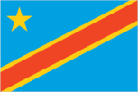
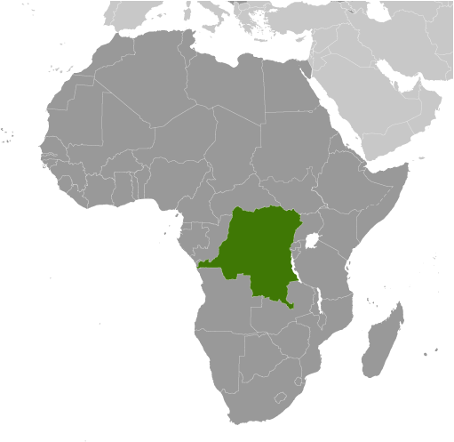
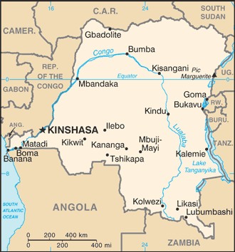

# Congo, Democratic Republic of the

## Introduction

**_Background:_**   
Established as a Belgian colony in 1908, the then-Republic of the Congo gained its independence in 1960, but its early years were marred by political and social instability. Col. Joseph MOBUTU seized power and declared himself president in a November 1965 coup. He subsequently changed his name - to MOBUTU Sese Seko - as well as that of the country - to Zaire. MOBUTU retained his position for 32 years through several sham elections, as well as through brutal force. Ethnic strife and civil war, touched off by a massive inflow of refugees in 1994 from fighting in Rwanda and Burundi, led in May 1997 to the toppling of the MOBUTU regime by a rebellion backed by Rwanda and Uganda and fronted by Laurent KABILA. He renamed the country the Democratic Republic of the Congo (DRC), but in August 1998 his regime was itself challenged by a second insurrection again backed by Rwanda and Uganda. Troops from Angola, Chad, Namibia, Sudan, and Zimbabwe intervened to support KABILA's regime. In January 2001, KABILA was assassinated and his son, Joseph KABILA, was named head of state. In October 2002, the new president was successful in negotiating the withdrawal of Rwandan forces occupying the eastern DRC; two months later, the Pretoria Accord was signed by all remaining warring parties to end the fighting and establish a government of national unity. A transitional government was set up in July 2003; it held a successful constitutional referendum in December 2005 and elections for the presidency, National Assembly, and provincial legislatures took place in 2006. In 2009, following a resurgence of conflict in the eastern DRC, the government signed a peace agreement with the National Congress for the Defense of the People (CNDP), a primarily Tutsi rebel group. An attempt to integrate CNDP members into the Congolese military failed, prompting their defection in 2012 and the formation of the M23 armed group - named after the 23 March 2009 peace agreements. Renewed conflict has lead to the displacement of large numbers of people and significant human rights abuses. As of February 2013, peace talks between the Congolese government and the M23 were on-going. In addition, the DRC continues to experience violence committed by other armed groups including the Democratic Forces for the Liberation of Rwanda and Mai Mai groups. In the most recent national elections, held in November 2011, disputed results allowed Joseph KABILA to be reelected to the presidency.

## Geography

**_Location:_**   
Central Africa, northeast of Angola

**_Geographic coordinates:_**   
0 00 N, 25 00 E

**_Map references:_**   
Africa

**_Area:_**   
**total:** 2,344,858 sq km   
**land:** 2,267,048 sq km   
**water:** 77,810 sq km

**_Area - comparative:_**   
slightly less than one-fourth the size of the US

**_Land boundaries:_**   
**total:** 10,481 km   
**border countries:** Angola 2,646 km (of which 225 km is the boundary of Angola's discontiguous Cabinda Province), Burundi 236 km, Central African Republic 1,747 km, Republic of the Congo 1,229 km, Rwanda 221 km, South Sudan 714 km, Tanzania 479 km, Uganda 877 km, Zambia 2,332 km

**_Coastline:_**   
37 km

**_Maritime claims:_**   
**territorial sea:** 12 nm   
**exclusive economic zone:** boundaries with neighbors

**_Climate:_**   
tropical; hot and humid in equatorial river basin; cooler and drier in southern highlands; cooler and wetter in eastern highlands; north of Equator - wet season (April to October), dry season (December to February); south of Equator - wet season (November to March), dry season (April to October)

**_Terrain:_**   
vast central basin is a low-lying plateau; mountains in east

**_Elevation extremes:_**   
**lowest point:** Atlantic Ocean 0 m   
**highest point:** Pic Marguerite on Mont Ngaliema (Mount Stanley) 5,110 m

**_Natural resources:_**   
cobalt, copper, niobium, tantalum, petroleum, industrial and gem diamonds, gold, silver, zinc, manganese, tin, uranium, coal, hydropower, timber

**_Land use:_**   
**arable land:** 2.9%   
**permanent crops:** 0.32%   
**other:** 96.78% (2011)

**_Irrigated land:_**   
105 sq km (2003)

**_Total renewable water resources:_**   
1,283 cu km (2011)

**_Freshwater withdrawal (domestic/industrial/agricultural):_**   
**total:** 0.68 cu km/yr (68%/21%/11%)   
**per capita:** 11.25 cu m/yr (2005)

**_Natural hazards:_**   
periodic droughts in south; Congo River floods (seasonal); active volcanoes in the east along the Great Rift Valley   
**volcanism:** Nyiragongo (elev. 3,470 m), which erupted in 2002 and is experiencing ongoing activity, poses a major threat to the city of Goma, home to a quarter million people; the volcano produces unusually fast-moving lava, known to travel up to 100 km /hr; Nyiragongo has been deemed a Decade Volcano by the International Association of Volcanology and Chemistry of the Earth's Interior, worthy of study due to its explosive history and close proximity to human populations; its neighbor, Nyamuragira, which erupted in 2010, is Africa's most active volcano; Visoke is the only other historically active volcano

**_Environment - current issues:_**   
poaching threatens wildlife populations; water pollution; deforestation; refugees responsible for significant deforestation, soil erosion, and wildlife poaching; mining of minerals (coltan - a mineral used in creating capacitors, diamonds, and gold) causing environmental damage

**_Environment - international agreements:_**   
**party to:** Biodiversity, Climate Change, Climate Change-Kyoto Protocol, Desertification, Endangered Species, Hazardous Wastes, Law of the Sea, Marine Dumping, Ozone Layer Protection, Tropical Timber 83, Tropical Timber 94, Wetlands   
**signed, but not ratified:** Environmental Modification

**_Geography - note:_**   
second largest country in Africa (after Algeria) and largest country in Sub-Saharan Africa; straddles the equator; has narrow strip of land that controls the lower Congo River and is only outlet to South Atlantic Ocean; dense tropical rain forest in central river basin and eastern highlands

## People and Society

**_Nationality:_**   
**noun:** Congolese (singular and plural)   
**adjective:** Congolese or Congo

**_Ethnic groups:_**   
over 200 African ethnic groups of which the majority are Bantu; the four largest tribes - Mongo, Luba, Kongo (all Bantu), and the Mangbetu-Azande (Hamitic) make up about 45% of the population

**_Languages:_**   
French (official), Lingala (a lingua franca trade language), Kingwana (a dialect of Kiswahili or Swahili), Kikongo, Tshiluba

**_Religions:_**   
Roman Catholic 50%, Protestant 20%, Kimbanguist 10%, Muslim 10%, other (includes syncretic sects and indigenous beliefs) 10%

**_Population:_**   
77,433,744   
**note:** estimates for this country explicitly take into account the effects of excess mortality due to AIDS; this can result in lower life expectancy, higher infant mortality, higher death rates, lower population growth rates, and changes in the distribution of population by age and sex than would otherwise be expected (July 2014 est.)

**_Age structure:_**   
**0-14 years:** 43.1% (male 16,810,549/female 16,552,685)   
**15-24 years:** 21.4% (male 8,292,444/female 8,248,326)   
**25-54 years:** 29.4% (male 11,359,385/female 11,405,442)   
**55-64 years:** 3.5% (male 1,287,895/female 1,457,499)   
**65 years and over:** 2.6% (male 849,840/female 1,169,679) (2014 est.)

**_Dependency ratios:_**   
**total dependency ratio:** 91.1 %   
**youth dependency ratio:** 85.6 %   
**elderly dependency ratio:** 5.5 %   
**potential support ratio:** 18.3 (2014 est.)

**_Median age:_**   
**total:** 17.9 years   
**male:** 17.7 years   
**female:** 18.1 years (2014 est.)

**_Population growth rate:_**   
2.5% (2014 est.)

**_Birth rate:_**   
35.62 births/1,000 population (2014 est.)

**_Death rate:_**   
10.3 deaths/1,000 population (2014 est.)

**_Net migration rate:_**   
-0.33 migrant(s)/1,000 population (2014 est.)

**_Urbanization:_**   
**urban population:** 34.3% of total population (2011)   
**rate of urbanization:** 4.19% annual rate of change (2010-15 est.)

**_Major urban areas - population:_**   
KINSHASA (capital) 8.798 million; Lubumbashi 1.556 million; Mbuji-Mayi 1.504 million; Kananga 888,000; Kisangani 820,000 (2011)

**_Sex ratio:_**   
**at birth:** 1.03 male(s)/female   
**0-14 years:** 1.02 male(s)/female   
**15-24 years:** 1.01 male(s)/female   
**25-54 years:** 1 male(s)/female   
**55-64 years:** 0.99 male(s)/female   
**65 years and over:** 0.72 male(s)/female   
**total population:** 0.99 male(s)/female (2014 est.)

**_Mother's mean age at first birth:_**   
20.2   
**note:** median age at first birth among women 25-29 (2007 est.)

**_Maternal mortality rate:_**   
540 deaths/100,000 live births (2010)

**_Infant mortality rate:_**   
**total:** 73.15 deaths/1,000 live births   
**male:** 76.8 deaths/1,000 live births   
**female:** 69.39 deaths/1,000 live births (2014 est.)

**_Life expectancy at birth:_**   
**total population:** 56.54 years   
**male:** 55.03 years   
**female:** 58.09 years (2014 est.)

**_Total fertility rate:_**   
4.8 children born/woman (2014 est.)

**_Contraceptive prevalence rate:_**   
17.7% (2010)

**_Health expenditures:_**   
8.5% of GDP (2011)

**_Physicians density:_**   
0.11 physicians/1,000 population (2004)

**_Hospital bed density:_**   
0.8 beds/1,000 population (2006)

**_Drinking water source:_**   
**improved:** urban: 79.1% of population; rural: 29% of population; total: 46.5% of population   
**unimproved:** urban: 20.9% of population; rural: 71% of population; total: 53.5% of population (2012 est.)

**_Sanitation facility access:_**   
**improved:** urban: 29.1% of population; rural: 32.6% of population; total: 31.4% of population   
**unimproved:** urban: 70.9% of population; rural: 67.4% of population; total: 68.6% of population (2012 est.)

**_HIV/AIDS - adult prevalence rate:_**   
1.1% (2012 est.)

**_HIV/AIDS - people living with HIV/AIDS:_**   
481,500 (2012 est.)

**_HIV/AIDS - deaths:_**   
31,700 (2012 est.)

**_Major infectious diseases:_**   
**degree of risk:** very high   
**food or waterborne diseases:** bacterial and protozoal diarrhea, hepatitis A, and typhoid fever   
**vectorborne diseases:** malaria, dengue fever, and trypanosomiasis-gambiense (African sleeping sickness)   
**water contact disease:** schistosomiasis   
**animal contact disease:** rabies (2013)

**_Obesity - adult prevalence rate:_**   
1.7% (2008)

**_Children under the age of 5 years underweight:_**   
28.2% (2007)

**_Education expenditures:_**   
2.5% of GDP (2010)

**_Literacy:_**   
**definition:** age 15 and over can read and write French, Lingala, Kingwana, or Tshiluba   
**total population:** 66.8%   
**male:** 76.9%   
**female:** 57% (2010 est.)

**_School life expectancy (primary to tertiary education):_**   
**total:** 10 years   
**male:** 11 years   
**female:** 8 years (2012)

**_Child labor - children ages 5-14:_**   
**total number:** 8,284,395   
**percentage:** 42 % (2010 est.)

## Government

**_Country name:_**   
**conventional long form:** Democratic Republic of the Congo   
**conventional short form:** DRC   
**local long form:** Republique Democratique du Congo   
**local short form:** RDC   
**former:** Congo Free State, Belgian Congo, Congo/Leopoldville, Congo/Kinshasa, Zaire   
**abbreviation:** DRC

**_Government type:_**   
republic

**_Capital:_**   
**name:** Kinshasa   
**geographic coordinates:** 4 19 S, 15 18 E   
**time difference:** UTC+1 (6 hours ahead of Washington, DC, during Standard Time)

**_Administrative divisions:_**   
10 provinces (provinces, singular - province) and 1 city\* (ville); Bandundu, Bas-Congo (Lower Congo), Equateur, Kasai-Occidental (West Kasai), Kasai-Oriental (East Kasai), Katanga, Kinshasa\*, Maniema, Nord-Kivu (North Kivu), Orientale, Sud-Kivu (South Kivu)   
**note:** according to the Constitution adopted in December 2005, the current administrative divisions were to be subdivided into 26 new provinces by 2009 but this has yet to be implemented

**_Independence:_**   
30 June 1960 (from Belgium)

**_National holiday:_**   
Independence Day, 30 June (1960)

**_Constitution:_**   
several previous; latest adopted 13 May 2005, approved by referendum 18-19 December 2005, promulgated 18 February 2006; revised 2011 (2011)

**_Legal system:_**   
civil legal system based on Belgian version of French civil law

**_International law organization participation:_**   
accepts compulsory ICJ jurisdiction with reservations; accepts ICCt jurisdiction

**_Suffrage:_**   
18 years of age; universal and compulsory

**_Executive branch:_**   
**chief of state:** President Joseph KABILA (since 17 January 2001)   
**head of government:** Prime Minister Augustin MATATA PONYO Mapon (since 18 April 2012)   
**cabinet:** Ministers of State appointed by the president   
**elections:** under the new constitution, the president elected by popular vote for a five-year term (eligible for a second term); election last held on 28 November 2011 (next to be held in November 2016); prime minister appointed by the president   
**election results:** Joseph KABILA reelected president; percent of vote - Joseph KABILA 49%, Etienne TSHISEKEDI 32.3%, other 18.7%; note - election marred by serious voting irregularities   
**note:** Joseph KABILA succeeded his father, Laurent Desire KABILA, following the latter's assassination in January 2001; negotiations with rebel leaders led to the establishment of a transitional government in July 2003 with free elections held on 30 July 2006 and a run-off on 29 October 2006 confirming Joseph KABILA as president

**_Legislative branch:_**   
bicameral legislature consists of a Senate (108 seats; members elected by provincial assemblies to serve five-year terms) and a National Assembly (500 seats; 61 members elected by majority vote in single-member constituencies, 439 members elected by open list proportional-representation in multi-member constituencies to serve five-year terms)   
**elections:** Senate - last held on 19 January 2007 (next scheduled for 5 June 2013; though likely to be delayed); National Assembly - last held on 28 November 2011 (next to be held in 2016)   
**election results:** Senate - percent of vote by party - NA; seats by party - PPRD 22, MLC 14, FR 7, RCD 7, PDC 6, CDC 3, MSR 3, PALU 2, independents 26, others 18 (political parties that won a single seat); National Assembly - percent of vote by party - NA; seats by party - PPRD 62, UDPS 41, PPPD 29, MSR 27, MLC 22, PALU 19, UNC 17, ARC 16, AFDC 15, ECT 11, RRC 11, independents 16, others 214 (includes numerous political parties that won 10 or fewer seats and 2 constituencies where voting was halted); note - the November 2011 elections were married by violence including the destruction of ballots in two constituencies resulting in the closure of polling sites; election results were delayed three months, stongly contested, and continue to be unresolved

**_Judicial branch:_**   
**highest court(s):** Supreme Court of Justice (organized into legislative and judiciary sections and consists of 26 justices); Constitutional Court (consists of 9 judges)   
**judge selection and term of office:** Supreme Court of Justice judges nominated by the Judicial Service Council, an independent body of public prosecutors and selected judges of the lower courts; judges tenure NA; Constitutional Court judges - 3 nominated by the president, 3 by the Judicial Service Council, and 3 by the legislature; judges appointed by the president to serve 9-year non-renewable terms   
**subordinate courts:** State Security Court; Court of Appeals (organized into administrative and judiciary sections); Tribunal de Grande; magistrates' courts; customary courts

**_Political parties and leaders:_**   
Christian Democrat Party or PDC [Jose ENDUNDO]   
Congolese Rally for Democracy or RCD [Azarias RUBERWA]   
Convention of Christian Democrats or CDC   
Forces of Renewal or FR [Mbusa NYAMWISI]   
Movement for the Liberation of the Congo or MLC [Jean-Pierre BEMBA]   
People's Party for Reconstruction and Democracy or PPRD [Evariste BOSHAB]   
Social Movement for Renewal or MSR [Pierre LUMBI]   
Unified Lumumbist Party or PALU [Antoine GIZENGA]   
Union for the Congolese Nation or UNC [Vital KAMERHE]   
Union for Democracy and Social Progress or UDPS [Etienne TSHISEKEDI]   
Union of Mobutuist Democrats or UDEMO [MOBUTU Nzanga]

**_Political pressure groups and leaders:_**   
FARDC (Forces Armées de la République Démocratique du Congo) - Army of the Democratic Republic of the Congo, which commits atrocities on citizens   
FDLR (Forces Democratiques de Liberation du Rwanda) - Rwandan militia group made up of some of the perpetrators of Rwanda's Genocide in 1994   
CNDP (National Congress for the Defense of the People) - mainly Congolese Tutsis who want refugees returned and more representation in government   
M23 - rebel group comprised largely from ex-CNDP forces

**_International organization participation:_**   
ACP, AfDB, AU, CEPGL, COMESA, EITI (candidate country), FAO, G-24, G-77, IAEA, IBRD, ICAO, ICRM, IDA, IFAD, IFC, IFRCS, IHO, ILO, IMF, IMO, Interpol, IOC, IOM, IPU, ISO, ITSO, ITU, ITUC (NGOs), MIGA, NAM, OIF, OPCW, PCA, SADC, UN, UNCTAD, UNESCO, UNHCR, UNIDO, UNWTO, UPU, WCO, WFTU (NGOs), WHO, WIPO, WMO, WTO

**_Diplomatic representation in the US:_**   
**chief of mission:** Ambassador Faida Maramuke MITIFU (since 3 February 2000)   
**chancery:** Suite 601, 1726 M Street, NW, Washington, DC, 20036   
**telephone:** [1] (202) 234-7690 through 7691   
**FAX:** [1] (202) 234-2609   
**consulate(s) general:** New York

**_Diplomatic representation from the US:_**   
**chief of mission:** Ambassador James C. SWAN (since 5 September 2013)   
**embassy:** 310 Avenue des Aviateurs, Kinshasa   
**mailing address:** Unit 2220, DPO AE 09828   
**telephone:** [243] (081) 556-0151   
**FAX:** [243] (081) 556-0175

**_Flag description:_**   
sky blue field divided diagonally from the lower hoist corner to upper fly corner by a red stripe bordered by two narrow yellow stripes; a yellow, five-pointed star appears in the upper hoist corner; blue represents peace and hope, red the blood of the country's martyrs, and yellow the country's wealth and prosperity; the star symbolizes unity and the brilliant future for the country

**_National symbol(s):_**   
leopard

**_National anthem:_**   
**name:** "Debout Congolaise" (Arise Congolese)   
**lyrics/music:** Joseph LUTUMBA/Simon-Pierre BOKA di Mpasi Londi   
**note:** adopted 1960; the anthem was replaced during the period in which the country was known as Zaire, but was readopted in 1997

## Economy

**_Economy - overview:_**   
The economy of the Democratic Republic of the Congo - a nation endowed with vast natural resource wealth - is slowly recovering after decades of decline. Systemic corruption since independence in 1960, combined with country-wide instability and conflict that began in the mid-90s has dramatically reduced national output and government revenue and increased external debt. With the installation of a transitional government in 2003 after peace accords, economic conditions slowly began to improve as the transitional government reopened relations with international financial institutions and international donors, and President KABILA began implementing reforms. Progress has been slow to reach the interior of the country although clear changes are evident in Kinshasa and Lubumbashi. An uncertain legal framework, corruption, and a lack of transparency in government policy are long-term problems for the mining sector and for the economy as a whole. Much economic activity still occurs in the informal sector and is not reflected in GDP data. Renewed activity in the mining sector, the source of most export income, has boosted Kinshasa's fiscal position and GDP growth in recent years. The global recession cut economic growth in 2009 to less than half its 2008 level, but growth returned to around 7% per year in 2010-12. The DRC signed a Poverty Reduction and Growth Facility with the IMF in 2009 and received $12 billion in multilateral and bilateral debt relief in 2010, but the IMF at the end of 2012 suspended the last three payments under the loan facility - worth $240 million - because of concerns about the lack of transparency in mining contracts. In 2012, the DRC updated its business laws by adhering to OHADA, the Organization for the Harmonization of Business Law in Africa. The country marked its tenth consecutive year of positive economic expansion in 2012.

**_GDP (purchasing power parity):_**   
$29.39 billion (2013 est.)   
$27.66 billion (2012 est.)   
$25.82 billion (2011 est.)   
**note:** data are in 2013 US dollars

**_GDP (official exchange rate):_**   
$18.56 billion (2013 est.)

**_GDP - real growth rate:_**   
6.2% (2013 est.)   
7.2% (2012 est.)   
6.9% (2011 est.)

**_GDP - per capita (PPP):_**   
$400 (2013 est.)   
$400 (2012 est.)   
$400 (2011 est.)   
**note:** data are in 2013 US dollars

**_GDP - composition, by end use:_**   
**household consumption:** 65.9%   
**government consumption:** 12.5%   
**investment in fixed capital:** 27.9%   
**investment in inventories:** 1%   
**exports of goods and services:** 49.9%   
**imports of goods and services:** -56.3%; (2013 est.)

**_GDP - composition, by sector of origin:_**   
**agriculture:** 44.3%   
**industry:** 21.7%   
**services:** 34% (2013 est.)

**_Agriculture - products:_**   
coffee, sugar, palm oil, rubber, tea, cotton, cocoa, quinine, cassava (manioc), bananas, plantains, peanuts, root crops, corn, fruits; wood products

**_Industries:_**   
mining (copper, cobalt, gold, diamonds, coltan, zinc, tin, tungsten), mineral processing, consumer products (textiles, plastics, footwear, cigarettes), metal products, processed foods and beverages, timber, cement, commercial ship repair

**_Industrial production growth rate:_**   
12% (2013 est.)

**_Labor force:_**   
35.18 million (2013 est.)

**_Labor force - by occupation:_**   
**agriculture:** NA%   
**industry:** NA%   
**services:** NA%

**_Unemployment rate:_**   
NA%

**_Population below poverty line:_**   
71% (2006 est.)

**_Household income or consumption by percentage share:_**   
**lowest 10%:** 2.3%   
**highest 10%:** 34.7% (2006)

**_Budget:_**   
**revenues:** $5.817 billion   
**expenditures:** $6.472 billion (2013 est.)

**_Taxes and other revenues:_**   
31.3% of GDP (2013 est.)

**_Budget surplus (+) or deficit (-):_**   
-3.5% of GDP (2013 est.)

**_Fiscal year:_**   
calendar year

**_Inflation rate (consumer prices):_**   
7.1% (2013 est.)   
9.5% (2012 est.)

**_Central bank discount rate:_**   
4% (31 December 2012 est.)   
20% (31 December 2011 est.)

**_Commercial bank prime lending rate:_**   
18.6% (31 December 2013 est.)   
28.45% (31 December 2012 est.)

**_Stock of narrow money:_**   
$1.06 billion (31 December 2013 est.)   
$986.6 million (31 December 2012 est.)

**_Stock of broad money:_**   
$3.502 billion (31 December 2013 est.)   
$3.042 billion (31 December 2012 est.)

**_Stock of domestic credit:_**   
$1.862 billion (31 December 2013 est.)   
$1.708 billion (31 December 2012 est.)

**_Market value of publicly traded shares:_**   
$NA

**_Current account balance:_**   
-$2.544 billion (2013 est.)   
-$2.254 billion (2012 est.)

**_Exports:_**   
$9.936 billion (2013 est.)   
$8.872 billion (2012 est.)

**_Exports - commodities:_**   
diamonds, copper, gold, cobalt, wood products, crude oil, coffee

**_Exports - partners:_**   
China 54.3%, Zambia 22.6%, Belgium 5.7% (2012)

**_Imports:_**   
$8.924 billion (2013 est.)   
$8.187 billion (2012 est.)

**_Imports - commodities:_**   
foodstuffs, mining and other machinery, transport equipment, fuels

**_Imports - partners:_**   
South Africa 22.3%, China 15.3%, Belgium 8%, Zambia 6.9%, Zimbabwe 5.6%, France 4.9%, Kenya 4.7% (2012)

**_Reserves of foreign exchange and gold:_**   
$1.582 billion (31 December 2013 est.)   
$1.633 billion (31 December 2012 est.)

**_Debt - external:_**   
$6.874 billion (31 December 2013 est.)   
$6.087 billion (31 December 2012 est.)

**_Exchange rates:_**   
Congolese francs (CDF) per US dollar -   
918 (2013 est.)   
920.25 (2012 est.)   
905.91 (2010 est.)   
472.19 (2009)   
559 (2008)

## Energy

**_Electricity - production:_**   
7.804 billion kWh (2010 est.)

**_Electricity - consumption:_**   
6.197 billion kWh (2010 est.)

**_Electricity - exports:_**   
916 million kWh (2010 est.)

**_Electricity - imports:_**   
161 million kWh (2010 est.)

**_Electricity - installed generating capacity:_**   
2.437 million kW (2010 est.)

**_Electricity - from fossil fuels:_**   
1.4% of total installed capacity (2010 est.)

**_Electricity - from nuclear fuels:_**   
0% of total installed capacity (2010 est.)

**_Electricity - from hydroelectric plants:_**   
98.6% of total installed capacity (2010 est.)

**_Electricity - from other renewable sources:_**   
0% of total installed capacity (2010 est.)

**_Crude oil - production:_**   
20,000 bbl/day (2012 est.)

**_Crude oil - exports:_**   
22,240 bbl/day (2010 est.)

**_Crude oil - imports:_**   
0 bbl/day (2010 est.)

**_Crude oil - proved reserves:_**   
180 million bbl (1 January 2013 est.)

**_Refined petroleum products - production:_**   
0 bbl/day (2010 est.)

**_Refined petroleum products - consumption:_**   
10,240 bbl/day (2011 est.)

**_Refined petroleum products - exports:_**   
0 bbl/day (2010 est.)

**_Refined petroleum products - imports:_**   
16,200 bbl/day (2010 est.)

**_Natural gas - production:_**   
0 cu m (2011 est.)

**_Natural gas - consumption:_**   
0 cu m (2010 est.)

**_Natural gas - exports:_**   
0 cu m (2011 est.)

**_Natural gas - imports:_**   
0 cu m (2011 est.)

**_Natural gas - proved reserves:_**   
991.1 million cu m (1 January 2013 est.)

**_Carbon dioxide emissions from consumption of energy:_**   
2.721 million Mt (2011 est.)

## Communications

**_Telephones - main lines in use:_**   
58,200 (2012)

**_Telephones - mobile cellular:_**   
19.487 million (2012)

**_Telephone system:_**   
**general assessment:** barely adequate wire and microwave radio relay service in and between urban areas; domestic satellite system with 14 earth stations; inadequate fixed line infrastructure   
**domestic:** state-owned operator providing less than 1 fixed-line connection per 100 persons; given the backdrop of a wholly inadequate fixed-line infrastructure, the use of mobile-cellular services has surged and mobile teledensity is roughly 20 per 100 persons   
**international:** country code - 243; satellite earth station - 1 Intelsat (Atlantic Ocean) (2011)

**_Broadcast media:_**   
state-owned TV broadcast station with near national coverage; more than a dozen privately owned TV stations with 2 having near national coverage; 2 state-owned radio stations are supplemented by more than 100 private radio stations; transmissions of at least 2 international broadcasters are available (2007)

**_Internet country code:_**   
.cd

**_Internet hosts:_**   
2,515 (2012)

**_Internet users:_**   
290,000 (2008)

## Transportation

**_Airports:_**   
198 (2013)

**_Airports - with paved runways:_**   
**total:** 26   
**over 3,047 m:** 3   
**2,438 to 3,047 m:** 3   
**1,524 to 2,437 m:** 17   
**914 to 1,523 m:** 2   
**under 914 m:** 1 (2013)

**_Airports - with unpaved runways:_**   
**total:** 172   
**1,524 to 2,437 m:** 20   
**914 to 1,523 m:** 87   
**under 914 m:** 65 (2013)

**_Heliports:_**   
1 (2013)

**_Pipelines:_**   
gas 62 km; oil 77 km; refined products 756 km (2013)

**_Railways:_**   
**total:** 4,007 km   
**narrow gauge:** 3,882 km 1.067-m gauge (858 km electrified); 125 km 1.000-m gauge (2008)

**_Roadways:_**   
**total:** 153,497 km   
**paved:** 2,794 km   
**unpaved:** 150,703 km (2004)

**_Waterways:_**   
15,000 km (including the Congo, its tributaries, and unconnected lakes) (2011)

**_Merchant marine:_**   
**total:** 1   
**by type:** petroleum tanker 1   
**foreign-owned:** 1 (Republic of the Congo 1) (2010)

**_Ports and terminals:_**   
**major seaport(s):** Banana   
**river or lake port(s):** Boma, Bumba, Kinshasa, Kisangani, Matadi, Mbandaka (Congo); Kindu (Lualaba); Bukavu, Goma (Lake Kivu); Kalemie (Lake Tanganyika)

## Military

**_Military branches:_**   
Armed Forces of the Democratic Republic of the Congo (Forces d'Armees de la Republique Democratique du Congo, FARDC): Army, National Navy (La Marine Nationale), Congolese Air Force (Force Aerienne Congolaise, FAC) (2011)

**_Military service age and obligation:_**   
18-45 years of age for voluntary and compulsory military service (2012)

**_Manpower available for military service:_**   
**males age 16-49:** 15,980,106 (2010 est.)

**_Manpower fit for military service:_**   
**males age 16-49:** 10,168,258   
**females age 16-49:** 10,331,693 (2010 est.)

**_Manpower reaching militarily significant age annually:_**   
**male:** 877,684   
**female:** 871,880 (2010 est.)

**_Military expenditures:_**   
1.72% of GDP (2012)   
1.53% of GDP (2011)   
1.72% of GDP (2010)

## Transnational Issues

**_Disputes - international:_**   
heads of the Great Lakes states and UN pledged in 2004 to abate tribal, rebel, and militia fighting in the region, including northeast Congo, where the UN Organization Mission in the Democratic Republic of the Congo (MONUC), organized in 1999, maintains over 16,500 uniformed peacekeepers; members of Uganda's Lords Resistance Army forces continue to seek refuge in Congo's Garamba National Park as peace talks with the Uganda government evolve; the location of the boundary in the broad Congo River with the Republic of the Congo is indefinite except in the Pool Malebo/Stanley Pool area; Uganda and DRC dispute Rukwanzi Island in Lake Albert and other areas on the Semliki River with hydrocarbon potential; boundary commission continues discussions over Congolese-administered triangle of land on the right bank of the Lunkinda River claimed by Zambia near the DRC village of Pweto; DRC accuses Angola of shifting monuments

**_Refugees and internally displaced persons:_**   
**refugees (country of origin):** 43,674 (Rwanda); 9,762 (Burundi) (2013); 56,150 (Central African Republic) (2014)   
**IDPs:** 2,634,872 (fighting between government forces and rebels since mid-1990s; most IDPs are in eastern provinces) (2014)

**_Trafficking in persons:_**   
**current situation:** Democratic Republic of the Congo is a source, destination, and possibly a transit country for men, women, and children subjected to forced labor and sex trafficking; the majority of this trafficking is internal, and much of it is perpetrated by armed groups and government forces outside government control within the country's unstable eastern provinces; Congolese women and children have been exploited internally as domestic servants, while others migrate to Angola, South Africa, Republic of the Congo, and South Sudan, as well as East African, Middle Eastern, and European nations where they are subjected to forced prostitution, domestic servitude, and forced labor in agriculture and diamond mines; indigenous and foreign armed groups (including the Lord's Resistance Army) abduct and forcibly recruit Congolese adults and children to serve as laborers, porters, domestics, combatants, and sex slaves; some commanders of the Congolese national army also recruit, at times through force, men and children for use as combatants, escorts, and porters   
**tier rating:** Tier 3 - The Democratic Republic of the Congo does not fully comply with the minimum standards for the elimination of trafficking and is not making significant efforts to do so; the government signed a UN-backed action plan to end the recruitment and use of child soldiers within its armed forces but has not applied legal sanctions against those who recruit and use child soldiers and has not reported any law enforcement efforts to combat any other forms of trafficking; besides child soldiers, the government has not reported identifying any other victims of forced labor or sex trafficking or providing protective services or referrals to NGO-operated care facilities; NGOs continue to provide the vast majority of the limited shelter, legal, medical, and psychological services available to victims (2013)

**_Illicit drugs:_**   
one of Africa's biggest producers of cannabis, but mostly for domestic consumption; traffickers exploit lax shipping controls to transit pseudoephedrine through the capital; while rampant corruption and inadequate supervision leaves the banking system vulnerable to money laundering, the lack of a well-developed financial system limits the country's utility as a money-laundering center (2008)

............................................................   
_Page last updated on June 22, 2014_
