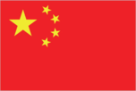
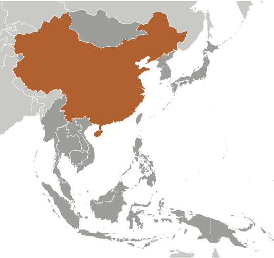
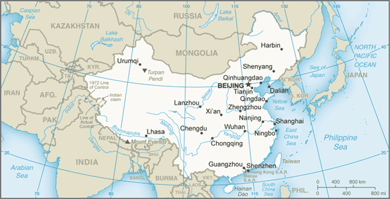

# China

_also see separate Hong Kong, Macau, and Taiwan entries_

## Introduction

**_Background:_**   
For centuries China stood as a leading civilization, outpacing the rest of the world in the arts and sciences, but in the 19th and early 20th centuries, the country was beset by civil unrest, major famines, military defeats, and foreign occupation. After World War II, the communists under MAO Zedong established an autocratic socialist system that, while ensuring China's sovereignty, imposed strict controls over everyday life and cost the lives of tens of millions of people. After 1978, MAO's successor DENG Xiaoping and other leaders focused on market-oriented economic development and by 2000 output had quadrupled. For much of the population, living standards have improved dramatically and the room for personal choice has expanded, yet political controls remain tight. Since the early 1990s, China has increased its global outreach and participation in international organizations.

## Geography

**_Location:_**   
Eastern Asia, bordering the East China Sea, Korea Bay, Yellow Sea, and South China Sea, between North Korea and Vietnam

**_Geographic coordinates:_**   
35 00 N, 105 00 E

**_Map references:_**   
Asia

**_Area:_**   
**total:** 9,596,960 sq km   
**land:** 9,326,410 sq km   
**water:** 270,550 sq km

**_Area - comparative:_**   
slightly smaller than the US

**_Land boundaries:_**   
**total:** 22,457 km   
**border countries:** Afghanistan 91 km, Bhutan 477 km, Burma 2,129 km, India 2,659 km, Kazakhstan 1,765 km, North Korea 1,352 km, Kyrgyzstan 1,063 km, Laos 475 km, Mongolia 4,630 km, Nepal 1,389 km, Pakistan 438 km, Russia (northeast) 4,139 km, Russia (northwest) 40 km, Tajikistan 477 km, Vietnam 1,297 km   
**regional borders:** Hong Kong 33 km, Macau 3 km

**_Coastline:_**   
14,500 km

**_Maritime claims:_**   
**territorial sea:** 12 nm   
**contiguous zone:** 24 nm   
**exclusive economic zone:** 200 nm   
**continental shelf:** 200 nm or to the edge of the continental margin

**_Climate:_**   
extremely diverse; tropical in south to subarctic in north

**_Terrain:_**   
mostly mountains, high plateaus, deserts in west; plains, deltas, and hills in east

**_Elevation extremes:_**   
**lowest point:** Turpan Pendi -154 m   
**highest point:** Mount Everest 8,850 m (highest point in Asia)

**_Natural resources:_**   
coal, iron ore, petroleum, natural gas, mercury, tin, tungsten, antimony, manganese, molybdenum, vanadium, magnetite, aluminum, lead, zinc, rare earth elements, uranium, hydropower potential (world's largest)

**_Land use:_**   
**arable land:** 11.62%   
**permanent crops:** 1.53%   
**other:** 86.84% (2011)

**_Irrigated land:_**   
629,380 sq km (2006)

**_Total renewable water resources:_**   
2,840 cu km (2011)

**_Freshwater withdrawal (domestic/industrial/agricultural):_**   
**total:** 554.1 cu km/yr (12%/23%/65%)   
**per capita:** 409.9 cu m/yr (2005)

**_Natural hazards:_**   
frequent typhoons (about five per year along southern and eastern coasts); damaging floods; tsunamis; earthquakes; droughts; land subsidence   
**volcanism:** China contains some historically active volcanoes including Changbaishan (also known as Baitoushan, Baegdu, or P'aektu-san), Hainan Dao, and Kunlun although most have been relatively inactive in recent centuries

**_Environment - current issues:_**   
air pollution (greenhouse gases, sulfur dioxide particulates) from reliance on coal produces acid rain; China is the world's largest single emitter of carbon dioxide from the burning of fossil fuels; water shortages, particularly in the north; water pollution from untreated wastes; deforestation; estimated loss of one-fifth of agricultural land since 1949 to soil erosion and economic development; desertification; trade in endangered species

**_Environment - international agreements:_**   
**party to:** Antarctic-Environmental Protocol, Antarctic Treaty, Biodiversity, Climate Change, Climate Change-Kyoto Protocol, Desertification, Endangered Species, Environmental Modification, Hazardous Wastes, Law of the Sea, Marine Dumping, Ozone Layer Protection, Ship Pollution, Tropical Timber 83, Tropical Timber 94, Wetlands, Whaling   
**signed, but not ratified:** none of the selected agreements

**_Geography - note:_**   
world's fourth largest country (after Russia, Canada, and US) and largest country situated entirely in Asia; Mount Everest on the border with Nepal is the world's tallest peak

## People and Society

**_Nationality:_**   
**noun:** Chinese (singular and plural)   
**adjective:** Chinese

**_Ethnic groups:_**   
Han Chinese 91.6%, Zhuang 1.3%, other (includes Hui, Manchu, Uighur, Miao, Yi, Tujia, Tibetan, Mongol, Dong, Buyei, Yao, Bai, Korean, Hani, Li, Kazakh, Dai and other nationalities) 7.1%   
**note:** the Chinese government officially recognizes 56 ethnic groups (2010 est.)

**_Languages:_**   
Standard Chinese or Mandarin (official; Putonghua, based on the Beijing dialect), Yue (Cantonese), Wu (Shanghainese), Minbei (Fuzhou), Minnan (Hokkien-Taiwanese), Xiang, Gan, Hakka dialects, minority languages (see Ethnic groups entry)   
**note:** Zhuang is official in Guangxi Zhuang, Yue is official in Guangdong, Mongolian is official in Nei Mongol, Uighur is official in Xinjiang Uygur, Kyrgyz is official in Xinjiang Uyghur, and Tibetan is official in Xizang (Tibet)

**_Religions:_**   
Buddhist 18.2%, Christian 5.1%, Muslim 1.8%, folk religion 21.9%, Hindu note: officially atheist (2010 est.)   
**note:** officially atheist (2010 est.)

**_Population:_**   
1,355,692,576 (July 2014 est.)

**_Age structure:_**   
**0-14 years:** 17.1% (male 124,340,516/female 107,287,324)   
**15-24 years:** 14.7% (male 105,763,058/female 93,903,845)   
**25-54 years:** 47.2% (male 327,130,324/female 313,029,536)   
**55-64 years:** 11.3% (male 77,751,100/female 75,737,968)   
**65 years and over:** 9.4% (male 62,646,075/female 68,102,830) (2014 est.)

**_Dependency ratios:_**   
**total dependency ratio:** 37.4 %   
**youth dependency ratio:** 24.9 %   
**elderly dependency ratio:** 12.5 %   
**potential support ratio:** 8 (2014 est.)

**_Median age:_**   
**total:** 36.7 years   
**male:** 35.8 years   
**female:** 37.5 years (2014 est.)

**_Population growth rate:_**   
0.44% (2014 est.)

**_Birth rate:_**   
12.17 births/1,000 population (2014 est.)

**_Death rate:_**   
7.44 deaths/1,000 population (2014 est.)

**_Net migration rate:_**   
-0.32 migrant(s)/1,000 population (2014 est.)

**_Urbanization:_**   
**urban population:** 50.6% of total population (2011)   
**rate of urbanization:** 2.85% annual rate of change (2010-15 est.)

**_Major urban areas - population:_**   
Shanghai 20.208 million; BEIJING (capital) 15.594 million; Guangzhou 10.849 million; Shenzhen 10.63 million; Chongqing 9.977 million; Wuhan 9.158 million (2011)

**_Sex ratio:_**   
**at birth:** 1.11 male(s)/female   
**0-14 years:** 1.16 male(s)/female   
**15-24 years:** 1.13 male(s)/female   
**25-54 years:** 1.05 male(s)/female   
**55-64 years:** 1.06 male(s)/female   
**65 years and over:** 0.92 male(s)/female   
**total population:** 1.06 male(s)/female (2014 est.)

**_Maternal mortality rate:_**   
37 deaths/100,000 live births (2010)

**_Infant mortality rate:_**   
**total:** 14.79 deaths/1,000 live births   
**male:** 14.93 deaths/1,000 live births   
**female:** 14.63 deaths/1,000 live births (2014 est.)

**_Life expectancy at birth:_**   
**total population:** 75.15 years   
**male:** 73.09 years   
**female:** 77.43 years (2014 est.)

**_Total fertility rate:_**   
1.55 children born/woman (2014 est.)

**_Contraceptive prevalence rate:_**   
84.6% (2006)

**_Health expenditures:_**   
5.2% of GDP (2011)

**_Physicians density:_**   
1.46 physicians/1,000 population (2010)

**_Hospital bed density:_**   
3.8 beds/1,000 population (2011)

**_Drinking water source:_**   
**improved:** urban: 98.4% of population; rural: 84.9% of population; total: 91.9% of population   
**unimproved:** urban: 1.6% of population; rural: 15.1% of population; total: 8.1% of population (2012 est.)

**_Sanitation facility access:_**   
**improved:** urban: 74.1% of population; rural: 55.8% of population; total: 65.3% of population   
**unimproved:** urban: 25.9% of population; rural: 44.2% of population; total: 34.7% of population (2012 est.)

**_HIV/AIDS - adult prevalence rate:_**   
0.1% (2012 est.)

**_HIV/AIDS - people living with HIV/AIDS:_**   
780,000 (2012 est.)

**_HIV/AIDS - deaths:_**   
26,000 (2009 est.)

**_Major infectious diseases:_**   
**degree of risk:** intermediate   
**food or waterborne diseases:** bacterial diarrhea, hepatitis A, and typhoid fever   
**vectorborne disease:** Japanese encephalitis   
**soil contact disease:** hantaviral hemorrhagic fever with renal syndrome (HFRS)   
**note:** highly pathogenic H5N1 avian influenza has been identified in this country; it poses a negligible risk with extremely rare cases possible among US citizens who have close contact with birds (2013)

**_Obesity - adult prevalence rate:_**   
5.7% (2008)

**_Children under the age of 5 years underweight:_**   
3.4% (2010)

**_Education expenditures:_**   
NA

**_Literacy:_**   
**definition:** age 15 and over can read and write   
**total population:** 95.1%   
**male:** 97.5%   
**female:** 92.7% (2010 est.)

**_School life expectancy (primary to tertiary education):_**   
**total:** 13 years   
**male:** 13 years   
**female:** 13 years (2012)

## Government

**_Country name:_**   
**conventional long form:** People's Republic of China   
**conventional short form:** China   
**local long form:** Zhonghua Renmin Gongheguo   
**local short form:** Zhongguo   
**abbreviation:** PRC

**_Government type:_**   
Communist state

**_Capital:_**   
**name:** Beijing   
**geographic coordinates:** 39 55 N, 116 23 E   
**time difference:** UTC+8 (13 hours ahead of Washington, DC, during Standard Time)   
**note:** despite its size, all of China falls within one time zone; many people in Xinjiang Province observe an unofficial "Xinjiang time zone" of UTC+6, two hours behind Beijing

**_Administrative divisions:_**   
23 provinces (sheng, singular and plural), 5 autonomous regions (zizhiqu, singular and plural), and 4 municipalities (shi, singular and plural)   
**provinces:** Anhui, Fujian, Gansu, Guangdong, Guizhou, Hainan, Hebei, Heilongjiang, Henan, Hubei, Hunan, Jiangsu, Jiangxi, Jilin, Liaoning, Qinghai, Shaanxi, Shandong, Shanxi, Sichuan, Yunnan, Zhejiang; (see note on Taiwan)   
**autonomous regions:** Guangxi, Nei Mongol (Inner Mongolia), Ningxia, Xinjiang Uygur, Xizang (Tibet)   
**municipalities:** Beijing, Chongqing, Shanghai, Tianjin   
**note:** China considers Taiwan its 23rd province; see separate entries for the special administrative regions of Hong Kong and Macau

**_Independence:_**   
1 October 1949 (People's Republic of China established); notable earlier dates: 221 B.C. (unification under the Qin Dynasty); 1 January 1912 (Qing Dynasty replaced by the Republic of China)

**_National holiday:_**   
anniversary of the founding of the People's Republic of China, 1 October (1949)

**_Constitution:_**   
several previous; latest promulgated 4 December 1982; amended several times, last in 2005 (2005)

**_Legal system:_**   
civil law influenced by Soviet and continental European civil law systems; legislature retains power to interpret statutes; note - criminal procedure law revised in early 2012

**_International law organization participation:_**   
has not submitted an ICJ jurisdiction declaration; non-party state to the ICCt

**_Suffrage:_**   
18 years of age; universal

**_Executive branch:_**   
**chief of state:** President XI Jinping (since 14 March 2013); Vice President LI Yuanchao (since 14 March 2013)   
**head of government:** Premier LI Keqiang (since 16 March 2013); Executive Vice Premier ZHANG Gaoli (since 16 March 2013); Vice Premier LIU Yandong (since 16 March 2013); Vice Premier MA Kai (since 16 March 2013); Vice Premier WANG Yang (since 16 March 2013)   
**cabinet:** State Council appointed by National People's Congress   
**elections:** president and vice president elected by National People's Congress for a five-year term (eligible for a second term); election last held on 5-17 March 2013 (next to be held in March 2018); premier nominated by president, confirmed by National People's Congress   
**election results:** XI Jinping elected president by National People's Congress with 2,952 votes; LI Yuanchao elected vice president with 2,940 votes

**_Legislative branch:_**   
unicameral National People's Congress or Quanguo Renmin Daibiao Dahui (2,987 seats; members elected by municipal, regional, and provincial people's congresses, and People's Liberation Army to serve five-year terms)   
**elections:** last held in December 2012-February 2013 (next to be held in late 2017 to early 2018)   
**election results:** percent of vote - NA; seats - 2,987   
**note:** in practice, only members of the CCP, its eight allied parties, and CCP-approved independent candidates are elected

**_Judicial branch:_**   
**highest court(s):** Supreme People's Court (consists of over 340 judges including the chief justice, 13 grand justices organized into a civil committee and tribunals for civil, economic, administrative, complaint and appeal, and communication and transportation cases)   
**judge selection and term of office:** chief justice appointed by the People's National Congress; term limited to two consecutive 5-year terms; other justices and judges nominated by the chief justice and appointed by the Standing Committee of the People's National Congress; term of other justices and judges NA   
**subordinate courts:** Higher People's Courts; Intermediate People's Courts; District and County People's Courts; Autonomous Region People's Courts; Special People's Courts for military, maritime, transportation, and forestry issues; note - in October 2012, China issued a white paper on planned judicial reform

**_Political parties and leaders:_**   
Chinese Communist Party or CCP [XI Jinping]   
eight nominally independent small parties ultimately controlled by the CCP

**_Political pressure groups and leaders:_**   
no substantial political opposition groups exist

**_International organization participation:_**   
ADB, AfDB (nonregional member), APEC, ARF, ASEAN (dialogue partner), BIS, CDB, CICA, EAS, FAO, FATF, G-20, G-24 (observer), G-77, IADB, IAEA, IBRD, ICAO, ICC (national committees), ICRM, IDA, IFAD, IFC, IFRCS, IHO, ILO, IMF, IMO, IMSO, Interpol, IOC, IOM (observer), IPU, ISO, ITSO, ITU, LAIA (observer), MIGA, MINURSO, MINUSMA, MONUSCO, NAM (observer), NSG, OAS (observer), OPCW, Pacific Alliance (observer), PCA, PIF (partner), SAARC (observer), SCO, SICA (observer), UN, UNAMID, UNCTAD, UNESCO, UNFICYP, UNHCR, UNIDO, UNIFIL, UNISFA, UNMIL, UNMISS, UNMIT, UNOCI, UNSC (permanent), UNTSO, UNWTO, UPU, WCO, WHO, WIPO, WMO, WTO, ZC

**_Diplomatic representation in the US:_**   
**chief of mission:** Ambassador CUI Tiankai (since 3 April 2013)   
**chancery:** 3505 International Place NW, Washington, DC 20008   
**telephone:** [1] (202) 495-2266   
**FAX:** [1] (202) 495-2138   
**consulate(s) general:** Chicago, Houston, Los Angeles, New York, San Francisco

**_Diplomatic representation from the US:_**   
**chief of mission:** Ambassador Max Sieben BAUCUS (since 21 February 2014)   
**embassy:** 55 An Jia Lou Lu, 100600 Beijing   
**mailing address:** PSC 461, Box 50, FPO AP 96521-0002   
**telephone:** [86] (10) 8531-3000   
**FAX:** [86] (10) 8531-3300   
**consulate(s) general:** Chengdu, Guangzhou, Shanghai, Shenyang, Wuhan

**_Flag description:_**   
red with a large yellow five-pointed star and four smaller yellow five-pointed stars (arranged in a vertical arc toward the middle of the flag) in the upper hoist-side corner; the color red represents revolution, while the stars symbolize the four social classes - the working class, the peasantry, the urban petty bourgeoisie, and the national bourgeoisie (capitalists) - united under the Communist Party of China

**_National symbol(s):_**   
dragon

**_National anthem:_**   
**name:** "Yiyongjun Jinxingqu" (The March of the Volunteers)   
**lyrics/music:** TIAN Han/NIE Er   
**note:** adopted 1949; the anthem, though banned during the Cultural Revolution, is more commonly known as "Zhongguo Guoge" (Chinese National Song); it was originally the theme song to the 1935 Chinese movie, "Sons and Daughters in a Time of Storm"

## Economy

**_Economy - overview:_**   
Since the late 1970s China has moved from a closed, centrally planned system to a more market-oriented one that plays a major global role - in 2010 China became the world's largest exporter. Reforms began with the phasing out of collectivized agriculture, and expanded to include the gradual liberalization of prices, fiscal decentralization, increased autonomy for state enterprises, growth of the private sector, development of stock markets and a modern banking system, and opening to foreign trade and investment. China has implemented reforms in a gradualist fashion. In recent years, China has renewed its support for state-owned enterprises in sectors considered important to "economic security," explicitly looking to foster globally competitive industries. After keeping its currency tightly linked to the US dollar for years, in July 2005 China moved to an exchange rate system that references a basket of currencies. From mid 2005 to late 2008 cumulative appreciation of the renminbi against the US dollar was more than 20%, but the exchange rate remained virtually pegged to the dollar from the onset of the global financial crisis until June 2010, when Beijing allowed resumption of a gradual appreciation and expanded the daily trading band within which the RMB is permitted to fluctuate. The restructuring of the economy and resulting efficiency gains have contributed to a more than tenfold increase in GDP since 1978. Measured on a purchasing power parity (PPP) basis that adjusts for price differences, China in 2013 stood as the second-largest economy in the world after the US, having surpassed Japan in 2001. The dollar values of China's agricultural and industrial output each exceed those of the US; China is second to the US in the value of services it produces. Still, per capita income is below the world average. The Chinese government faces numerous economic challenges, including: (a) reducing its high domestic savings rate and correspondingly low domestic consumption; (b) facilitating higher-wage job opportunities for the aspiring middle class, including rural migrants and increasing numbers of college graduates; (c) reducing corruption and other economic crimes; and (d) containing environmental damage and social strife related to the economy's rapid transformation. Economic development has progressed further in coastal provinces than in the interior, and by 2011 more than 250 million migrant workers and their dependents had relocated to urban areas to find work. One consequence of population control policy is that China is now one of the most rapidly aging countries in the world. Deterioration in the environment - notably air pollution, soil erosion, and the steady fall of the water table, especially in the North - is another long-term problem. China continues to lose arable land because of erosion and economic development. The Chinese government is seeking to add energy production capacity from sources other than coal and oil, focusing on nuclear and alternative energy development. Several factors are converging to slow China's growth, including debt overhang from its credit-fueled stimulus program, industrial overcapacity, inefficient allocation of capital by state-owned banks, and the slow recovery of China's trading partners. The government's 12th Five-Year Plan, adopted in March 2011 and reiterated at the Communist Party's "Third Plenum" meeting in November 2013, emphasizes continued economic reforms and the need to increase domestic consumption in order to make the economy less dependent in the future on fixed investments, exports, and heavy industry. However, China has made only marginal progress toward these rebalancing goals. The new government of President XI Jinping has signaled a greater willingness to undertake reforms that focus on China's long-term economic health, including giving the market a more decisive role in allocating resources.

**_GDP (purchasing power parity):_**   
$13.39 trillion (2013 est.)   
$12.43 trillion (2012 est.)   
$11.54 trillion (2011 est.)   
**note:** data are in 2013 US dollars

**_GDP (official exchange rate):_**   
$9.33 trillion   
**note:** because China's exchange rate is determine by fiat, rather than by market forces, the official exchange rate measure of GDP is not an accurate measure of China's output; GDP at the official exchange rate substantially understates the actual level of China's output vis-a-vis the rest of the world; in China's situation, GDP at purchasing power parity provides the best measure for comparing output across countries (2013 est.)

**_GDP - real growth rate:_**   
7.7% (2013 est.)   
7.7% (2012 est.)   
9.3% (2011 est.)

**_GDP - per capita (PPP):_**   
$9,800 (2013 est.)   
$9,100 (2012 est.)   
$8,300 (2011 est.)   
**note:** data are in 2013 US dollars

**_Gross national saving:_**   
50% of GDP (2013 est.)   
51.2% of GDP (2012 est.)   
50.1% of GDP (2011 est.)

**_GDP - composition, by end use:_**   
**household consumption:** 36.3%   
**government consumption:** 13.7%   
**investment in fixed capital:** 46%   
**investment in inventories:** 1.2%   
**exports of goods and services:** 25.1%   
**imports of goods and services:** -22.2%; (2013 est.)

**_GDP - composition, by sector of origin:_**   
**agriculture:** 10%   
**industry:** 43.9%   
**services:** 46.1%; (2013 est.)

**_Agriculture - products:_**   
world leader in gross value of agricultural output; rice, wheat, potatoes, corn, peanuts, tea, millet, barley, apples, cotton, oilseed; pork; fish

**_Industries:_**   
world leader in gross value of industrial output; mining and ore processing, iron, steel, aluminum, and other metals, coal; machine building; armaments; textiles and apparel; petroleum; cement; chemicals; fertilizers; consumer products (including footwear, toys, and electronics); food processing; transportation equipment, including automobiles, rail cars and locomotives, ships, aircraft; telecommunications equipment, commercial space launch vehicles, satellites

**_Industrial production growth rate:_**   
7.6% (2013 est.)

**_Labor force:_**   
797.6 million   
**note:** by the end of 2012, China's population at working age (15-64 years) was 1.0040 billion (2013 est.)

**_Labor force - by occupation:_**   
**agriculture:** 33.6%   
**industry:** 30.3%   
**services:** 36.1%; (2012 est.)

**_Unemployment rate:_**   
4.1% (2013 est.)   
4.1% (2012 est.)   
**note:** data are for registered urban unemployment, which excludes private enterprises and migrants

**_Population below poverty line:_**   
6.1%   
**note:** in 2011, China set a new poverty line at RMB 2300 (approximately US $3,630); (2013)

**_Household income or consumption by percentage share:_**   
**lowest 10%:** 1.7%   
**highest 10%:** 30%   
**note:** data are for urban households only (2009)

**_Distribution of family income - Gini index:_**   
47.3 (2013)   
47.4 (2012)

**_Budget:_**   
**revenues:** $2.118 trillion   
**expenditures:** $2.292 trillion (2013 est.)

**_Taxes and other revenues:_**   
19.4% of GDP (2013 est.)

**_Budget surplus (+) or deficit (-):_**   
-2.1% of GDP (2013 est.)

**_Public debt:_**   
22.4% of GDP (2013 est.)   
26.1% of GDP (2012)   
**note:** official data; data cover both central government debt and local government debt, which China's National Audit Office estimated at RMB 10.72 trillion (approximately US$1.66 trillion) in 2011; data exclude policy bank bonds, Ministry of Railway debt, China Asset Management Company debt, and non-performing loans

**_Fiscal year:_**   
calendar year

**_Inflation rate (consumer prices):_**   
2.6% (2013 est.)   
2.6% (2012 est.)

**_Central bank discount rate:_**   
2.25% (31 December 2013 est.)   
2.25% (31 December 2012 est.)

**_Commercial bank prime lending rate:_**   
5.73% (31 December 2013 est.)   
6% (31 December 2012 est.)

**_Stock of narrow money:_**   
$5.532 trillion (31 December 2013 est.)   
$4.911 trillion (31 December 2012 est.)

**_Stock of broad money:_**   
$18.15 trillion (31 December 2013 est.)   
$15.5 trillion (31 December 2012 est.)

**_Stock of domestic credit:_**   
$11.79 trillion (31 December 2013 est.)   
$10.02 trillion (31 December 2012 est.)

**_Market value of publicly traded shares:_**   
$6.499 trillion (31 December 2013 est.)   
$5.753 trillion (31 December 2012)   
$3.389 trillion (31 December 2011 est.)

**_Current account balance:_**   
$182.8 billion (2013 est.)   
$215.4 billion (2012 est.)

**_Exports:_**   
$2.21 trillion (2013 est.)   
$2.049 trillion (2012 est.)

**_Exports - commodities:_**   
electrical and other machinery, including data processing equipment, apparel, radio telephone handsets, textiles, integrated circuits

**_Exports - partners:_**   
Hong Kong 17.4%, US 16.7%, Japan 6.8%, South Korea 4.1% (2013 est.)

**_Imports:_**   
$1.95 trillion (2013 est.)   
$1.818 trillion (2012 est.)

**_Imports - commodities:_**   
electrical and other machinery, oil and mineral fuels; nuclear reactor, boiler, and machinery components; optical and medical equipment, metal ores, motor vehicles; soybeans

**_Imports - partners:_**   
South Korea 9.4%, Japan 8.3%, Taiwan 8%, United States 7.8%, Australia 5%, Germany 4.8% (2013 est.)

**_Reserves of foreign exchange and gold:_**   
$3.821 trillion (31 December 2013 est.)   
$3.388 trillion (31 December 2012 est.)

**_Debt - external:_**   
$863.2 billion (31 December 2013 est.)   
$737 billion (31 December 2012 est.)

**_Stock of direct foreign investment - at home:_**   
$1.344 trillion (31 December 2012 est.)   
$1.232 trillion (31 December 2011 est.)

**_Stock of direct foreign investment - abroad:_**   
$541 billion (31 December 2013 est.)   
$531.9 billion (31 December 2012 est.)

**_Exchange rates:_**   
Renminbi yuan (RMB) per US dollar -   
6.2 (2013 est.)   
6.3123 (2012 est.)   
6.7703 (2010 est.)   
6.8314 (2009)   
6.9385 (2008)

## Energy

**_Electricity - production:_**   
5.398 trillion kWh (2013)

**_Electricity - consumption:_**   
5.322 trillion kWh (2013)

**_Electricity - exports:_**   
18.67 billion kWh (2013)

**_Electricity - imports:_**   
7.438 billion kWh (2013)

**_Electricity - installed generating capacity:_**   
1.247 billion kW (2013 est.)

**_Electricity - from fossil fuels:_**   
69.1% of total installed capacity (2013 est.)

**_Electricity - from nuclear fuels:_**   
1.2% of total installed capacity (2013 est.)

**_Electricity - from hydroelectric plants:_**   
22.5% of total installed capacity (2013 est.)

**_Electricity - from other renewable sources:_**   
7.2% of total installed capacity (2013 est.)

**_Crude oil - production:_**   
4.197 million bbl/day (2013 est.)

**_Crude oil - exports:_**   
33,000 bbl/day (2013 est.)

**_Crude oil - imports:_**   
5.664 million bbl/day (2013 est.)

**_Crude oil - proved reserves:_**   
17.3 billion bbl (1 January 2013 est.)

**_Refined petroleum products - production:_**   
9.371 million bbl/day (2012 est.)

**_Refined petroleum products - consumption:_**   
9.79 million bbl/day (2011 est.)

**_Refined petroleum products - exports:_**   
664,000 bbl/day (2013 est.)

**_Refined petroleum products - imports:_**   
922,000 bbl/day (2013 est.)

**_Natural gas - production:_**   
117.1 billion cu m (2013 est.)

**_Natural gas - consumption:_**   
150 billion cu m (2013 est.)

**_Natural gas - exports:_**   
2.4 billion cu m (2013 est.)

**_Natural gas - imports:_**   
53 billion cu m (2013 est.)

**_Natural gas - proved reserves:_**   
3.1 trillion cu m (1 January 2013 est.)

**_Carbon dioxide emissions from consumption of energy:_**   
10 billion Mt (2013 est.)

## Communications

**_Telephones - main lines in use:_**   
278.86 million (2012)

**_Telephones - mobile cellular:_**   
1.1 billion (2012)

**_Telephone system:_**   
**general assessment:** domestic and international services are increasingly available for private use; unevenly distributed domestic system serves principal cities, industrial centers, and many towns; China continues to develop its telecommunications infrastructure; China in the summer of 2008 began a major restructuring of its telecommunications industry, resulting in the consolidation of its six telecom service operators to three, China Telecom, China Mobile and China Unicom, each providing both fixed-line and mobile services   
**domestic:** interprovincial fiber-optic trunk lines and cellular telephone systems have been installed; mobile-cellular subscribership is increasing rapidly; the number of Internet users exceeded 564 million by the end of 2012; a domestic satellite system with several earth stations is in place   
**international:** country code - 86; a number of submarine cables provide connectivity to Asia, the Middle East, Europe, and the US; satellite earth stations - 7 (5 Intelsat - 4 Pacific Ocean and 1 Indian Ocean; 1 Intersputnik - Indian Ocean region; and 1 Inmarsat - Pacific and Indian Ocean regions) (2012)

**_Broadcast media:_**   
all broadcast media are owned by, or affiliated with, the Communist Party of China or a government agency; no privately owned TV or radio stations; state-run Chinese Central TV, provincial, and municipal stations offer more than 2,000 channels; the Central Propaganda Department lists subjects that are off limits to domestic broadcast media with the government maintaining authority to approve all programming; foreign-made TV programs must be approved prior to broadcast

**_Internet country code:_**   
.cn

**_Internet hosts:_**   
20.602 million (2012)

**_Internet users:_**   
389 million (2009)

## Transportation

**_Airports:_**   
507 (2013)

**_Airports - with paved runways:_**   
**total:** 463   
**over 3,047 m:** 71   
**2,438 to 3,047 m:** 158   
**1,524 to 2,437 m:** 123   
**914 to 1,523 m:** 25   
**under 914 m:** 86 (2013)

**_Airports - with unpaved runways:_**   
**total:** 44   
**over 3,047 m:** 4   
**2,438 to 3,047 m:** 7   
**1,524 to 2,437 m:** 6   
**914 to 1,523 m:** 9   
**under 914 m:** 18 (2013)

**_Heliports:_**   
47 (2013)

**_Pipelines:_**   
condensate 9 km; gas 48,502 km; oil 23,072 km; oil/gas/water 31 km; refined products 15,298 km; water 9 km (2013)

**_Railways:_**   
**total:** 86,000 km   
**standard gauge:** 86,000 km 1.435-m gauge (36,000 km electrified) (2008)

**_Roadways:_**   
**total:** 4,106,387 km   
**paved:** 3,453,890 km (includes 84,946 km of expressways)   
**unpaved:** 652,497 km (2011)

**_Waterways:_**   
110,000 km (navigable waterways) (2011)

**_Merchant marine:_**   
**total:** 2,030   
**by type:** barge carrier 7, bulk carrier 621, cargo 566, carrier 10, chemical tanker 140, container 206, liquefied gas 60, passenger 9, passenger/cargo 81, petroleum tanker 264, refrigerated cargo 33, roll on/roll off 8, specialized tanker 2, vehicle carrier 23   
**foreign-owned:** 22 (Hong Kong 18, Indonesia 2, Japan 2)   
**registered in other countries:** 1,559 (Bangladesh 1, Belize 61, Cambodia 177, Comoros 1, Cyprus 6, Georgia 10, Honduras 2, Hong Kong 500, India 1, Indonesia 1, Kiribati 26, Liberia 4, Malta 6, Marshall Islands 14, North Korea 3, Panama 534, Philippines 4, Saint Kitts and Nevis 1, Saint Vincent and the Grenadines 65, Sao Tome and Principe 1, Sierra Leone 19, Singapore 29, South Korea 6, Thailand 1, Togo 1, Tuvalu 4, UK 7, Vanuatu 1, unknown 73) (2010)

**_Ports and terminals:_**   
**major seaport(s):** Dalian, Ningbo, Qingdao, Qinhuangdao, Shanghai, Shenzhen, Tianjin   
**river port(s):** Guangzhou (Pearl)   
**container port(s) (TEUs):** Dalian (6,400,300), Guangzhou (14,260,400), Ningbo (14,719,200), Qingdao (13,020,100), Shanghai (31,739,000), Shenzhen (22,570,800), Tianjin (11,587,600)(2011)

## Military

**_Military branches:_**   
People's Liberation Army (PLA): Ground Forces, Navy (PLAN; includes marines and naval aviation), Air Force (Zhongguo Renmin Jiefangjun Kongjun, PLAAF; includes Airborne Forces), and Second Artillery Corps (strategic missile force); People's Armed Police (Renmin Wuzhuang Jingcha Budui, PAP); PLA Reserve Force (2012)

**_Military service age and obligation:_**   
18-24 years of age for selective compulsory military service, with a 2-year service obligation; no minimum age for voluntary service (all officers are volunteers); 18-19 years of age for women high school graduates who meet requirements for specific military jobs; a recent military decision allows women in combat roles; the first class of women warship commanders was in 2011 (2012)

**_Manpower available for military service:_**   
**males age 16-49:** 385,821,101   
**females age 16-49:** 363,789,674 (2010 est.)

**_Manpower fit for military service:_**   
**males age 16-49:** 318,265,016   
**females age 16-49:** 300,323,611 (2010 est.)

**_Manpower reaching militarily significant age annually:_**   
**male:** 10,406,544   
**female:** 9,131,990 (2010 est.)

**_Military expenditures:_**   
1.99% of GDP (2012)   
2% of GDP (2011)   
1.99% of GDP (2010)

## Transnational Issues

**_Disputes - international:_**   
continuing talks and confidence-building measures work toward reducing tensions over Kashmir that nonetheless remains militarized with portions under the de facto administration of China (Aksai Chin), India (Jammu and Kashmir), and Pakistan (Azad Kashmir and Northern Areas); India does not recognize Pakistan's ceding historic Kashmir lands to China in 1964; China and India continue their security and foreign policy dialogue started in 2005 related to the dispute over most of their rugged, militarized boundary, regional nuclear proliferation, and other matters; China claims most of India's Arunachal Pradesh to the base of the Himalayas; lacking any treaty describing the boundary, Bhutan and China continue negotiations to establish a common boundary alignment to resolve territorial disputes arising from substantial cartographic discrepancies, the largest of which lie in Bhutan's northwest and along the Chumbi salient; Burmese forces attempting to dig in to the largely autonomous Shan State to rout local militias tied to the drug trade, prompts local residents to periodically flee into neighboring Yunnan Province in China; Chinese maps show an international boundary symbol off the coasts of the littoral states of the South China Seas, where China has interrupted Vietnamese hydrocarbon exploration; China asserts sovereignty over Scarborough Reef along with the Philippines and Taiwan, and over the Spratly Islands together with Malaysia, the Philippines, Taiwan, Vietnam, and Brunei; the 2002 Declaration on the Conduct of Parties in the South China Sea eased tensions in the Spratlys but is not the legally binding code of conduct sought by some parties; Vietnam and China continue to expand construction of facilities in the Spratlys and in March 2005, the national oil companies of China, the Philippines, and Vietnam signed a joint accord on marine seismic activities in the Spratly Islands; China occupies some of the Paracel Islands also claimed by Vietnam and Taiwan; China and Taiwan continue to reject both Japan's claims to the uninhabited islands of Senkaku-shoto (Diaoyu Tai) and Japan's unilaterally declared equidistance line in the East China Sea, the site of intensive hydrocarbon exploration and exploitation; certain islands in the Yalu and Tumen rivers are in dispute with North Korea; North Korea and China seek to stem illegal migration to China by North Koreans, fleeing privations and oppression, by building a fence along portions of the border and imprisoning North Koreans deported by China; China and Russia have demarcated the once disputed islands at the Amur and Ussuri confluence and in the Argun River in accordance with their 2004 Agreement; China and Tajikistan have begun demarcating the revised boundary agreed to in the delimitation of 2002; the decade-long demarcation of the China-Vietnam land boundary was completed in 2009; citing environmental, cultural, and social concerns, China has reconsidered construction of 13 dams on the Salween River, but energy-starved Burma, with backing from Thailand, remains intent on building five hydro-electric dams downstream despite regional and international protests; Chinese and Hong Kong authorities met in March 2008 to resolve ownership and use of lands recovered in Shenzhen River channelization, including 96-hectare Lok Ma Chau Loop;

**_Refugees and internally displaced persons:_**   
**refugees (country of origin):** estimated 30,000-50,000 (North Korea) (2012); 300,896 (Vietnam) (2013)   
**IDPs:** 90,000 (2010)

**_Trafficking in persons:_**   
**current situation:** China is a source, transit, and destination country for men, women, and children trafficked for the purposes of sexual exploitation and forced labor; the majority of trafficking in China occurs within the country's borders, there are many reports that Chinese men, women, and children may be subjected to conditions of sex trafficking and forced labor in numerous countries and territories worldwide; women and children are trafficked to China from Burma, Vietnam, Laos, Mongolia, Russia, North Korea, and even as far away as Europe and Africa for forced labor and prostitution; some Chinese adults and children are forced into prostitution and various forms of forced labor, including begging, stealing, and working in brick kilns, coal mines, and factories   
**tier rating:** Tier 3 - China does not fully comply with the minimum standards for the elimination of trafficking and was downgraded to Tier 3 after the maximum of two consecutive annual waivers; the government has not demonstrated significant efforts to comprehensively prohibit and punish all forms of trafficking and to prosecute traffickers; the government also has not reported providing comprehensive victim protection services to domestic or foreign, male or female victims of trafficking; in 2013, the government released an eight-year national action plan, which includes measures to improve interagency and other internal coordination among anti-trafficking stakeholders and victim protection (2013)

**_Illicit drugs:_**   
major transshipment point for heroin produced in the Golden Triangle region of Southeast Asia; growing domestic consumption of synthetic drugs, and heroin from Southeast and Southwest Asia; source country for methamphetamine and heroin chemical precursors, despite new regulations on its large chemical industry (2008)

............................................................   
_Page last updated on June 22, 2014_
