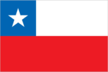
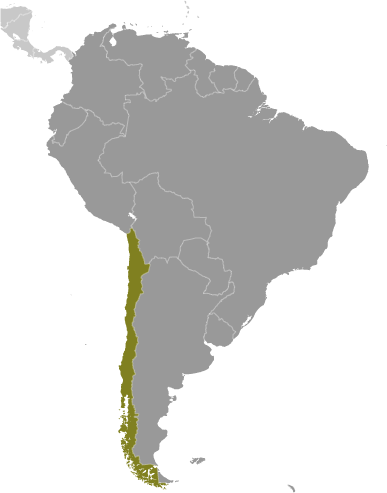
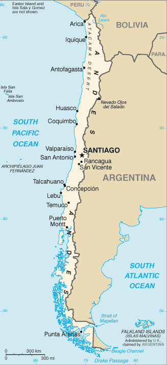

# Chile

## Introduction

**_Background:_**   
Prior to the arrival of the Spanish in the 16th century, the Inca ruled northern Chile while the Mapuche inhabited central and southern Chile. Although Chile declared its independence in 1810, decisive victory over the Spanish was not achieved until 1818. In the War of the Pacific (1879-83), Chile defeated Peru and Bolivia and won its present northern regions. It was not until the 1880s that the Mapuche were brought under central government control. After a series of elected governments, the three-year-old Marxist government of Salvador ALLENDE was overthrown in 1973 by a military coup led by Augusto PINOCHET, who ruled until a freely elected president was inaugurated in 1990. Sound economic policies, maintained consistently since the 1980s, contributed to steady growth, reduced poverty rates by over half, and helped secure the country's commitment to democratic and representative government. Chile has increasingly assumed regional and international leadership roles befitting its status as a stable, democratic nation. In January 2014, Chile assumed a nonpermanent seat on the UN Security Council for the 2014-15 term.

## Geography

**_Location:_**   
Southern South America, bordering the South Pacific Ocean, between Argentina and Peru

**_Geographic coordinates:_**   
30 00 S, 71 00 W

**_Map references:_**   
South America

**_Area:_**   
**total:** 756,102 sq km   
**land:** 743,812 sq km   
**water:** 12,290 sq km   
**note:** includes Easter Island (Isla de Pascua) and Isla Sala y Gomez

**_Area - comparative:_**   
slightly smaller than twice the size of Montana

**_Land boundaries:_**   
**total:** 7,801 km   
**border countries:** Argentina 6,691 km, Bolivia 942 km, Peru 168 km

**_Coastline:_**   
6,435 km

**_Maritime claims:_**   
**territorial sea:** 12 nm   
**contiguous zone:** 24 nm   
**exclusive economic zone:** 200 nm   
**continental shelf:** 200/350 nm

**_Climate:_**   
temperate; desert in north; Mediterranean in central region; cool and damp in south

**_Terrain:_**   
low coastal mountains; fertile central valley; rugged Andes in east

**_Elevation extremes:_**   
**lowest point:** Pacific Ocean 0 m   
**highest point:** Nevado Ojos del Salado 6,880 m

**_Natural resources:_**   
copper, timber, iron ore, nitrates, precious metals, molybdenum, hydropower

**_Land use:_**   
**arable land:** 1.74%   
**permanent crops:** 0.6%   
**other:** 97.65% (2011)

**_Irrigated land:_**   
11,990 sq km (2003)

**_Total renewable water resources:_**   
922 cu km (2011)

**_Freshwater withdrawal (domestic/industrial/agricultural):_**   
**total:** 26.67 cu km/yr (4%/10%/86%)   
**per capita:** 1,603 cu m/yr (2007)

**_Natural hazards:_**   
severe earthquakes; active volcanism; tsunamis   
**volcanism:** significant volcanic activity due to more than three-dozen active volcanoes along the Andes Mountains; Lascar (elev. 5,592 m), which last erupted in 2007, is the most active volcano in the northern Chilean Andes; Llaima (elev. 3,125 m) in central Chile, which last erupted in 2009, is another of the country's most active; Chaiten's 2008 eruption forced major evacuations; other notable historically active volcanoes include Cerro Hudson, Copahue, Guallatiri, Llullaillaco, Nevados de Chillan, Puyehue, San Pedro, and Villarrica

**_Environment - current issues:_**   
widespread deforestation and mining threaten natural resources; air pollution from industrial and vehicle emissions; water pollution from raw sewage

**_Environment - international agreements:_**   
**party to:** Antarctic-Environmental Protocol, Antarctic-Marine Living Resources, Antarctic Seals, Antarctic Treaty, Biodiversity, Climate Change, Climate Change-Kyoto Protocol, Desertification, Endangered Species, Environmental Modification, Hazardous Wastes, Law of the Sea, Marine Dumping, Ozone Layer Protection, Ship Pollution, Wetlands, Whaling   
**signed, but not ratified:** none of the selected agreements

**_Geography - note:_**   
the longest north-south trending country in the world, extending across 38 degrees of latitude; strategic location relative to sea lanes between the Atlantic and Pacific Oceans (Strait of Magellan, Beagle Channel, Drake Passage); Atacama Desert - the driest desert in the world - spreads across the northern part of the country; the crater lake of Ojos del Salado is the world's highest lake (at 6,390 m)

## People and Society

**_Nationality:_**   
**noun:** Chilean(s)   
**adjective:** Chilean

**_Ethnic groups:_**   
white and non-indigenous 88.9%, Mapuche 9.1%, Aymara 0.7%, other indigenous groups 1% (includes Rapa Nui, Likan Antai, Quechua, Colla, Diaguita, Kawesqar, Yagan or Yamana), unspecified 0.3% (2012 est.)

**_Languages:_**   
Spanish 99.5% (official), English 10.2%, indigenous 1% (includes Mapudungun, Aymara, Quechua, Rapa Nui), other 2.3%, unspecified 0.2%   
**note:** shares sum to more than 100% because some respondents gave more than one answer on the census (2012 est.)

**_Religions:_**   
Roman Catholic 66.7%, Evangelical or Protestant 16.4%, Jehovah's Witnesses 1%, other 3.4%, none 11.5%, unspecified 1.1% (2012 est.)

**_Demographic profile:_**   
Chile is in the advanced stages of demographic transition and is becoming an aging society - with fertility below replacement level, low mortality rates, and life expectancy on par with developed countries. Nevertheless, with its dependency ratio nearing its low point, Chile could benefit from its favorable age structure. It will need to keep its large working-age population productively employed, while preparing to provide for the needs of its growing proportion of elderly people, especially as women - the traditional caregivers - increasingly enter the workforce. Over the last two decades, Chile has made great strides in reducing its poverty rate, which is now lower than most Latin American countries. However, its severe income inequality ranks as the worst among members of the Organization for Economic Cooperation and Development. Unequal access to quality education perpetuates this uneven income distribution.   
Chile has historically been a country of emigration but has slowly become more attractive to immigrants since transitioning to democracy in 1990 and improving its economic stability (other regional destinations have concurrently experienced deteriorating economic and political conditions). Most of Chile's small but growing foreign-born population consists of transplants from other Latin American countries, especially Peru.

**_Population:_**   
17,363,894 (July 2014 est.)

**_Age structure:_**   
**0-14 years:** 20.7% (male 1,834,247/female 1,760,315)   
**15-24 years:** 16.3% (male 1,442,610/female 1,383,738)   
**25-54 years:** 43.2% (male 3,733,261/female 3,766,912)   
**55-64 years:** 9.9% (male 806,044/female 910,818)   
**65 years and over:** 9.7% (male 720,681/female 1,005,268) (2014 est.)

**_Dependency ratios:_**   
**total dependency ratio:** 45.1 %   
**youth dependency ratio:** 30.2 %   
**elderly dependency ratio:** 14.9 %   
**potential support ratio:** 6.7 (2014 est.)

**_Median age:_**   
**total:** 33.3 years   
**male:** 32.2 years   
**female:** 34.6 years (2014 est.)

**_Population growth rate:_**   
0.84% (2014 est.)

**_Birth rate:_**   
13.97 births/1,000 population (2014 est.)

**_Death rate:_**   
5.93 deaths/1,000 population (2014 est.)

**_Net migration rate:_**   
0.35 migrant(s)/1,000 population (2014 est.)

**_Urbanization:_**   
**urban population:** 89.2% of total population (2011)   
**rate of urbanization:** 1.09% annual rate of change (2010-15 est.)

**_Major urban areas - population:_**   
SANTIAGO (capital) 6.034 million; Valparaiso 883,000; Concepcion 770,000 (2011)

**_Sex ratio:_**   
**at birth:** 1.04 male(s)/female   
**0-14 years:** 1.04 male(s)/female   
**15-24 years:** 1.04 male(s)/female   
**25-54 years:** 0.99 male(s)/female   
**55-64 years:** 0.97 male(s)/female   
**65 years and over:** 0.71 male(s)/female   
**total population:** 0.97 male(s)/female (2014 est.)

**_Mother's mean age at first birth:_**   
23.7 (2004 est.)

**_Maternal mortality rate:_**   
25 deaths/100,000 live births (2010)

**_Infant mortality rate:_**   
**total:** 7.02 deaths/1,000 live births   
**male:** 7.51 deaths/1,000 live births   
**female:** 6.52 deaths/1,000 live births (2014 est.)

**_Life expectancy at birth:_**   
**total population:** 78.44 years   
**male:** 75.42 years   
**female:** 81.59 years (2014 est.)

**_Total fertility rate:_**   
1.84 children born/woman (2014 est.)

**_Contraceptive prevalence rate:_**   
64.2%   
**note:** percent of women aged 15-44 (2006)

**_Health expenditures:_**   
7.5% of GDP (2011)

**_Physicians density:_**   
1.03 physicians/1,000 population (2009)

**_Hospital bed density:_**   
2 beds/1,000 population (2010)

**_Drinking water source:_**   
**improved:** urban: 99.6% of population; rural: 91.3% of population; total: 98.8% of population   
**unimproved:** urban: 0.4% of population; rural: 8.7% of population; total: 1.2% of population (2012 est.)

**_Sanitation facility access:_**   
**improved:** urban: 100% of population; rural: 89.3% of population; total: 98.9% of population   
**unimproved:** urban: 0% of population; rural: 10.7% of population; total: 1.1% of population (2012 est.)

**_HIV/AIDS - adult prevalence rate:_**   
0.4% (2012 est.)

**_HIV/AIDS - people living with HIV/AIDS:_**   
38,700 (2012 est.)

**_HIV/AIDS - deaths:_**   
NA

**_Obesity - adult prevalence rate:_**   
29.4% (2008)

**_Children under the age of 5 years underweight:_**   
0.5% (2008)

**_Education expenditures:_**   
4.5% of GDP (2012)

**_Literacy:_**   
**definition:** age 15 and over can read and write   
**total population:** 98.6%   
**male:** 98.6%   
**female:** 98.5% (2009 est.)

**_School life expectancy (primary to tertiary education):_**   
**total:** 15 years   
**male:** 15 years   
**female:** 16 years (2012)

**_Child labor - children ages 5-14:_**   
**total number:** 82,882   
**percentage:** 3 % (2003 est.)

**_Unemployment, youth ages 15-24:_**   
**total:** 16.3%   
**male:** 14.3%   
**female:** 19.1% (2012)

## Government

**_Country name:_**   
**conventional long form:** Republic of Chile   
**conventional short form:** Chile   
**local long form:** Republica de Chile   
**local short form:** Chile

**_Government type:_**   
republic

**_Capital:_**   
**name:** Santiago; note - Valparaiso is the seat of the national legislature   
**geographic coordinates:** 33 27 S, 70 40 W   
**time difference:** UTC-4 (1 hour ahead of Washington, DC, during Standard Time)   
**daylight saving time:** +1hr, under a new pilot program that begins second Sunday in September and ends fourth Sunday in April

**_Administrative divisions:_**   
15 regions (regiones, singular - region); Aysen, Antofagasta, Araucania, Arica y Parinacota, Atacama, Biobio, Coquimbo, Libertador General Bernardo O'Higgins, Los Lagos, Los Rios, Magallanes y de la Antartica Chilena, Maule, Region Metropolitana (Santiago), Tarapaca, Valparaiso   
**note:** the US does not recognize claims to Antarctica

**_Independence:_**   
18 September 1810 (from Spain)

**_National holiday:_**   
Independence Day, 18 September (1810)

**_Constitution:_**   
many previous; latest adopted 11 September 1980, effective 11 March 1981; amended many times, last in 2011 (2011)

**_Legal system:_**   
civil law system influenced by several West European civil legal systems; judicial review of legislative acts by the Constitutional Tribunal

**_International law organization participation:_**   
has not submitted an ICJ jurisdiction declaration; accepts ICCt jurisdiction

**_Suffrage:_**   
18 years of age; universal

**_Executive branch:_**   
**chief of state:** President Michelle BACHELET Jeria (since 11 March 2014); note - the president is both the chief of state and head of government   
**head of government:** President Michelle BACHELET Jeria (since 11 March 2014)   
**cabinet:** Cabinet appointed by the president   
**elections:** president elected by popular vote for a single four-year term; election last held on 17 November 2013 with a runoff election held on 15 December 2013 (next to be held on 19 November 2017)   
**election results:** Michelle BACHELET Jeria elected president; percent of vote - Michelle BACHELET Jeria 62.2%; Evelyn Rose MATTHEI Fornet 37.8%

**_Legislative branch:_**   
bicameral National Congress or Congreso Nacional consists of the Senate or Senado (38 seats; members elected by popular vote to serve eight-year terms; one-half elected every four years) and the Chamber of Deputies or Camara de Diputados (120 seats; members are elected by popular vote to serve four-year terms)   
**elections:** Senate - last held on 13 December 2009 (next to be held in November 2013); Chamber of Deputies - last held on 13 December 2009 (next to be held in November 2013)   
**election results:** Senate - percent of vote by party - NA; seats by party - CPD 9 (PDC 4, PPD 3, PS 2), APC 9 (RN 6, UDI 3); Chamber of Deputies - percent of vote by party - NA; seats by party - APC 58 (UDI 37, RN 18, other 3), CPD 57 (PDC 19, PPD 18, PS 11, PRSD 5, PC 3, other 1), PRI 3, independent 2; note - as of 19 February 2013, the composition of the entire legislature is as follows: Senate - seats by party - CPD 19 (PDC 9, PPD 4, PS 5, PRSD 1), Coalition for Change (former APC) 16 (RN 8, UDI 8), independent 2, MAS 1; Chamber of Deputies - seats by party - Coalition for Change (former APC) 56 (UDI 39, RN 17), CPD 53 (PDC 19, PPD 18, PS 11, PRSD 5), independent 5, PC 3, PRI 2, IC 1

**_Judicial branch:_**   
**highest court(s):** Supreme Court or Corte Suprema (consists of a court president and 20 members or ministros); Constitutional Court (consists of 7 members); Electoral Court (consists of 5 members)   
**judge selection and term of office:** Supreme Court judges appointed by the president and ratified by the Senate from lists of candidates provided by the court itself; judges appointed for life with mandatory retirement at age 70; Constitutional Court members appointed - 3 by the Supreme Court, 1 by the president of the republic, 2 by the National Security Council, and 1 by the Senate; members serve 8-year terms with partial court replacement every 4 years (the court reviews constitutionality of legislation); Electoral Court member appointments - 4 by the Supreme Court and 1 a former president or vice-president of the Senate or Chamber of Deputies selected by the Supreme Court; member term NA   
**subordinate courts:** Courts of Appeal; oral criminal tribunals; military tribunals; local police courts; specialized tribunals and courts in matters such as family, labor, customs, taxes, and electoral affairs

**_Political parties and leaders:_**   
Broad Social Movement or MAS [Alejandro NAVARRO Brain]   
Citizen Left or IC   
Equality Party [Lautaro GUANCA Vallejos]   
Coalition for Change or CC (also known as the Alliance for Chile (Alianza) or APC) (including National Renewal or RN [Carlos LARRAIN Pena], and Independent Democratic Union or UDI [Patricio MELERO]   
Coalition of Parties for Democracy (Concertacion) or CPD (including Christian Democratic Party or PDC [Ignacio WALKER Prieto], Party for Democracy or PPD [Jaime Daniel QUINTANA Leal], Radical Social Democratic Party or PRSD [Jose Antonio GOMEZ Urrutia], and Socialist Party or PS [Osvaldo ANDRADE Lara])   
Communist Party of Chile (Partido Comunista de Chile) or PC [Guillermo TEILLIER del Valle]   
Ecological Green Party [Cristian VILLAROEL Novoa]   
Humanist Party or PH [Danilo MONTEVERDE Reyes]   
Independent Regionalist Party or PRI [Carlos OLIVARES Zepeda]   
Progressive Party or PRO [Marco ENRIQUEZ-OMINAMI Gumucio]

**_Political pressure groups and leaders:_**   
Roman Catholic Church, particularly conservative groups such as Opus Dei   
United Labor Central or CUT includes trade unionists from the country's five largest labor confederations   
**other:** university student federations at all major universities

**_International organization participation:_**   
APEC, BIS, BRICS, CAN (associate), CD, CELAC, FAO, G-15, G-77, IADB, IAEA, IBRD, ICAO, ICC (national committees), ICRM, IDA, IFAD, IFC, IFRCS, IHO, ILO, IMF, IMO, IMSO, Interpol, IOC, IOM, IPU, ISO, ITSO, ITU, ITUC (NGOs), LAES, LAIA, Mercosur (associate), MIGA, MINUSTAH, NAM, OAS, OECD (Enhanced Engagement, OPANAL, OPCW, Pacific Alliance, PCA, SICA (observer), UN, UN Security Council (temporary), UNASUR, UNCTAD, UNESCO, UNFICYP, UNHCR, UNIDO, Union Latina, UNMOGIP, UNTSO, UNWTO, UPU, WCO, WFTU (NGOs), WHO, WIPO, WMO, WTO

**_Diplomatic representation in the US:_**   
**chief of mission:** Ambassador Juan Gabriel VALDES Soublette (since 21 May 2014)   
**chancery:** 1732 Massachusetts Avenue NW, Washington, DC 20036   
**telephone:** [1] (202) 785-1746   
**FAX:** [1] (202) 887-5579   
**consulate(s) general:** Chicago, Los Angeles, Miami, New York, Philadelphia, San Francisco

**_Diplomatic representation from the US:_**   
**chief of mission:** Ambassador (vacant); Charge d'Affaires Stephen M. LISTON   
**embassy:** Avenida Andres Bello 2800, Las Condes, Santiago   
**mailing address:** APO AA 34033   
**telephone:** [56] (2) 330-3000   
**FAX:** [56] (2) 330-3710, 330-3160

**_Flag description:_**   
two equal horizontal bands of white (top) and red; a blue square the same height as the white band at the hoist-side end of the white band; the square bears a white five-pointed star in the center representing a guide to progress and honor; blue symbolizes the sky, white is for the snow-covered Andes, and red represents the blood spilled to achieve independence   
**note:** design was influenced by the US flag

**_National symbol(s):_**   
huemul (mountain deer); Andean condor

**_National anthem:_**   
**name:** "Himno Nacional de Chile" (National Anthem of Chile)   
**lyrics/music:** Eusebio LILLO Robles and Bernardo DE VERA y Pintado/Ramon CARNICER y Battle   
**note:** music adopted 1828, original lyrics adopted 1818, adapted lyrics adopted 1847; under Augusto PINOCHET"s military rule, a verse glorifying the army was added; however, as a protest, some citizens refused to sing this verse; it was removed when democracy was restored in 1990

## Economy

**_Economy - overview:_**   
Chile has a market-oriented economy characterized by a high level of foreign trade and a reputation for strong financial institutions and sound policy that have given it the strongest sovereign bond rating in South America. Exports of goods and services account for approximately one-third of GDP, with commodities making up some three-quarters of total exports. Copper alone provides 19% of government revenue. From 2003 through 2013, real growth averaged almost 5% per year, despite the slight contraction in 2009 that resulted from the global financial crisis. Chile deepened its longstanding commitment to trade liberalization with the signing of a free trade agreement with the US, which took effect on 1 January 2004. Chile has 22 trade agreements covering 60 countries including agreements with the European Union, Mercosur, China, India, South Korea, and Mexico. Chile has joined the United States and nine other countries in negotiating the Trans-Pacific-Partnership trade agreement. The Chilean Government has generally followed a countercyclical fiscal policy, accumulating surpluses in sovereign wealth funds during periods of high copper prices and economic growth, and generally allowing deficit spending only during periods of low copper prices and growth. As of 31 December 2012, those sovereign wealth funds - kept mostly outside the country and separate from Central Bank reserves - amounted to more than $20.9 billion. Chile used these funds to finance fiscal stimulus packages during the 2009 economic downturn. In May 2010 Chile signed the OECD Convention, becoming the first South American country to join the OECD.

**_GDP (purchasing power parity):_**   
$335.4 billion (2013 est.)   
$321.3 billion (2012 est.)   
$304.2 billion (2011 est.)   
**note:** data are in 2013 US dollars

**_GDP (official exchange rate):_**   
$281.7 billion (2013 est.)

**_GDP - real growth rate:_**   
4.4% (2013 est.)   
5.6% (2012 est.)   
5.8% (2011 est.)

**_GDP - per capita (PPP):_**   
$19,100 (2013 est.)   
$18,500 (2012 est.)   
$17,600 (2011 est.)   
**note:** data are in 2013 US dollars

**_Gross national saving:_**   
20.8% of GDP (2013 est.)   
21.4% of GDP (2012 est.)   
22.2% of GDP (2011 est.)

**_GDP - composition, by end use:_**   
**household consumption:** 63.2%   
**government consumption:** 12%   
**investment in fixed capital:** 25%   
**investment in inventories:** 0.6%   
**exports of goods and services:** 32.7%   
**imports of goods and services:** -33.5%; (2013 est.)

**_GDP - composition, by sector of origin:_**   
**agriculture:** 3.6%   
**industry:** 35.4%   
**services:** 61% (2013 est.)

**_Agriculture - products:_**   
grapes, apples, pears, onions, wheat, corn, oats, peaches, garlic, asparagus, beans; beef, poultry, wool; fish; timber

**_Industries:_**   
copper, lithium, other minerals, foodstuffs, fish processing, iron and steel, wood and wood products, transport equipment, cement, textiles

**_Industrial production growth rate:_**   
3% (2013 est.)

**_Labor force:_**   
8.367 million (2013 est.)

**_Labor force - by occupation:_**   
**agriculture:** 13.2%   
**industry:** 23%   
**services:** 63.9% (2005)

**_Unemployment rate:_**   
6% (2013 est.)   
6.3% (2012 est.)

**_Population below poverty line:_**   
15.1% (2009 est.)

**_Household income or consumption by percentage share:_**   
**lowest 10%:** 1.5%   
**highest 10%:** 42.8% (2009 est.)

**_Distribution of family income - Gini index:_**   
52.1 (2009)   
57.1 (2000)

**_Budget:_**   
**revenues:** $58.49 billion   
**expenditures:** $61.26 billion (2013 est.)

**_Taxes and other revenues:_**   
20.8% of GDP (2013 est.)

**_Budget surplus (+) or deficit (-):_**   
-1% of GDP (2013 est.)

**_Public debt:_**   
13.9% of GDP (2013 est.)   
11.9% of GDP (2012 est.)

**_Fiscal year:_**   
calendar year

**_Inflation rate (consumer prices):_**   
1.7% (2013 est.)   
3% (2012 est.)

**_Central bank discount rate:_**   
3.12% (31 December 2010 est.)   
0.5% (31 December 2009 est.)

**_Commercial bank prime lending rate:_**   
9.5% (31 December 2013 est.)   
10.06% (31 December 2012 est.)

**_Stock of narrow money:_**   
$41.61 billion (31 December 2013 est.)   
$40.95 billion (31 December 2012 est.)

**_Stock of broad money:_**   
$159 billion (31 December 2013 est.)   
$150.5 billion (31 December 2012 est.)

**_Stock of domestic credit:_**   
$214 billion (31 December 2013 est.)   
$202.5 billion (31 December 2012 est.)

**_Market value of publicly traded shares:_**   
$313.3 billion (31 December 2012 est.)   
$270.3 billion (31 December 2011)   
$341.6 billion (31 December 2010 est.)

**_Current account balance:_**   
-$10.97 billion (2013 est.)   
-$9.499 billion (2012 est.)

**_Exports:_**   
$77.94 billion (2013 est.)   
$78.28 billion (2012 est.)

**_Exports - commodities:_**   
copper, fruit, fish products, paper and pulp, chemicals, wine

**_Exports - partners:_**   
China 23.3%, US 12.3%, Japan 10.7%, South Korea 5.8%, Brazil 5.5% (2012)

**_Imports:_**   
$75.7 billion (2013 est.)   
$74.86 billion (2012 est.)

**_Imports - commodities:_**   
petroleum and petroleum products, chemicals, electrical and telecommunications equipment, industrial machinery, vehicles, natural gas

**_Imports - partners:_**   
US 22.9%, China 18.2%, Argentina 6.6%, Brazil 6.5% (2012)

**_Reserves of foreign exchange and gold:_**   
$39.89 billion (31 December 2013 est.)   
$41.65 billion (31 December 2012 est.)

**_Debt - external:_**   
$119 billion (31 December 2013 est.)   
$112.7 billion (31 December 2012 est.)

**_Stock of direct foreign investment - at home:_**   
$214.8 billion (31 December 2013 est.)   
$NA (31 December 2012 est.)

**_Stock of direct foreign investment - abroad:_**   
$109.2 billion (31 December 2013 est.)   
$91.3 billion (31 December 2012 est.)

**_Exchange rates:_**   
Chilean pesos (CLP) per US dollar -   
491.7 (2013 est.)   
486.49 (2012 est.)   
510.25 (2010 est.)   
560.86 (2009)   
509.02 (2008)

## Energy

**_Electricity - production:_**   
62.86 billion kWh (2011 est.)

**_Electricity - consumption:_**   
53.93 billion kWh (2010 est.)

**_Electricity - exports:_**   
0 kWh (2012 est.)

**_Electricity - imports:_**   
734 million kWh (2011 est.)

**_Electricity - installed generating capacity:_**   
16.21 million kW (2010 est.)

**_Electricity - from fossil fuels:_**   
62% of total installed capacity (2010 est.)

**_Electricity - from nuclear fuels:_**   
0% of total installed capacity (2010 est.)

**_Electricity - from hydroelectric plants:_**   
33.7% of total installed capacity (2010 est.)

**_Electricity - from other renewable sources:_**   
4.3% of total installed capacity (2010 est.)

**_Crude oil - production:_**   
17,340 bbl/day (2012 est.)

**_Crude oil - exports:_**   
0 bbl/day (2010 est.)

**_Crude oil - imports:_**   
169,700 bbl/day (2010 est.)

**_Crude oil - proved reserves:_**   
150 million bbl (1 January 2013 est.)

**_Refined petroleum products - production:_**   
187,200 bbl/day (2010 est.)

**_Refined petroleum products - consumption:_**   
321,700 bbl/day (2011 est.)

**_Refined petroleum products - exports:_**   
13,040 bbl/day (2010 est.)

**_Refined petroleum products - imports:_**   
154,100 bbl/day (2010 est.)

**_Natural gas - production:_**   
1.144 billion cu m (2012 est.)

**_Natural gas - consumption:_**   
5.296 billion cu m (2010 est.)

**_Natural gas - exports:_**   
0 cu m (2011 est.)

**_Natural gas - imports:_**   
3.83 billion cu m (2012 est.)

**_Natural gas - proved reserves:_**   
97.97 billion cu m (1 January 2013 est.)

**_Carbon dioxide emissions from consumption of energy:_**   
80.1 million Mt (2011 est.)

## Communications

**_Telephones - main lines in use:_**   
3.276 million (2012)

**_Telephones - mobile cellular:_**   
24.13 million (2012)

**_Telephone system:_**   
**general assessment:** privatization began in 1988; most advanced telecommunications infrastructure in South America; modern system based on extensive microwave radio relay facilities; domestic satellite system with 3 earth stations   
**domestic:** number of fixed-line connections have stagnated in recent years as mobile-cellular usage continues to increase, reaching 130 telephones per 100 persons   
**international:** country code - 56; landing points for the Pan American, South America-1, and South American Crossing/Latin America Nautilus submarine cables providing links to the US and to Central and South America; satellite earth stations - 2 Intelsat (Atlantic Ocean) (2011)

**_Broadcast media:_**   
national and local terrestrial TV channels, coupled with extensive cable TV networks; the state-owned Television Nacional de Chile (TVN) network is self financed through commercial advertising revenues and is not under direct government control; large number of privately owned TV stations; about 250 radio stations (2007)

**_Internet country code:_**   
.cl

**_Internet hosts:_**   
2.152 million (2012)

**_Internet users:_**   
7.009 million (2009)

## Transportation

**_Airports:_**   
481 (2013)

**_Airports - with paved runways:_**   
**total:** 90   
**over 3,047 m:** 5   
**2,438 to 3,047 m:** 7   
**1,524 to 2,437 m:** 23   
**914 to 1,523 m:** 31   
**under 914 m:** 24 (2013)

**_Airports - with unpaved runways:_**   
**total:** 391   
**2,438 to 3,047 m:** 5   
**1,524 to 2,437 m:** 11   
**914 to 1,523 m:** 56   
**under 914 m:** 319 (2013)

**_Heliports:_**   
1 (2013)

**_Pipelines:_**   
gas 3,160 km; liquid petroleum gas 781 km; oil 985 km; refined products 722 km (2013)

**_Railways:_**   
**total:** 7,082 km   
**broad gauge:** 3,435 km 1.676-m gauge (850 km electrified)   
**narrow gauge:** 3,647 km 1.000-m gauge (2008)

**_Roadways:_**   
**total:** 77,764 km   
**paved:** 18,119 km (includes 2,387 km of expressways)   
**unpaved:** 59,645 km (2010)

**_Merchant marine:_**   
**total:** 42   
**by type:** bulk carrier 13, cargo 5, chemical tanker 7, container 2, liquefied gas 1, passenger 3, passenger/cargo 2, petroleum tanker 8, roll on/roll off 1   
**foreign-owned:** 1 (Norway 1)   
**registered in other countries:** 52 (Argentina 6, Brazil 1, Honduras 1, Isle of Man 9, Liberia 9, Panama 14, Peru 6, Singapore 6) (2010)

**_Ports and terminals:_**   
**major seaport(s):** Coronel, Huasco, Lirquen, Puerto Ventanas, San Antonio, San Vicente, Valparaiso

## Military

**_Military branches:_**   
Army of the Nation, Chilean Navy (Armada de Chile, includes Naval Aviation, Marine Corps, and Maritime Territory and Merchant Marine Directorate (Directemar)), Chilean Air Force (Fuerza Aerea de Chile, FACh), Carabineros Corps (Cuerpo de Carabineros) (2011)

**_Military service age and obligation:_**   
18-45 years of age for voluntary male and female military service, although the right to compulsory recruitment of males 18-45 is retained; service obligation is 12 months for Army and 22 months for Navy and Air Force (2012)

**_Manpower available for military service:_**   
**males age 16-49:** 4,324,732   
**females age 16-49:** 4,251,954 (2010 est.)

**_Manpower fit for military service:_**   
**males age 16-49:** 3,621,475   
**females age 16-49:** 3,561,099 (2010 est.)

**_Manpower reaching militarily significant age annually:_**   
**male:** 141,500   
**female:** 135,709 (2010 est.)

**_Military expenditures:_**   
2.04% of GDP (2012)   
2.17% of GDP (2011)   
2.04% of GDP (2010)

## Transnational Issues

**_Disputes - international:_**   
Chile and Peru rebuff Bolivia's reactivated claim to restore the Atacama corridor, ceded to Chile in 1884, but Chile has offered instead unrestricted but not sovereign maritime access through Chile to Bolivian natural gas; Chile rejects Peru's unilateral legislation to change its latitudinal maritime boundary with Chile to an equidistance line with a southwestern axis favoring Peru; in October 2007, Peru took its maritime complaint with Chile to the ICJ; territorial claim in Antarctica (Chilean Antarctic Territory) partially overlaps Argentine and British claims; the joint boundary commission, established by Chile and Argentina in 2001, has yet to map and demarcate the delimited boundary in the inhospitable Andean Southern Ice Field (Campo de Hielo Sur)

**_Illicit drugs:_**   
transshipment country for cocaine destined for Europe and the region; some money laundering activity, especially through the Iquique Free Trade Zone; imported precursors passed on to Bolivia; domestic cocaine consumption is rising, making Chile a significant consumer of cocaine (2008)

............................................................   
_Page last updated on June 22, 2014_
