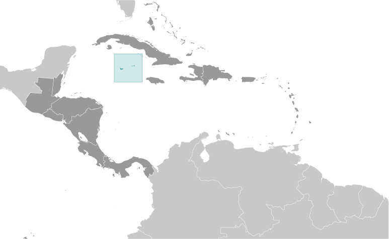

# Cayman Islands

_overseas territory of the UK_

## Introduction

**_Background:_**   
The Cayman Islands were colonized from Jamaica by the British during the 18th and 19th centuries and were administered by Jamaica after 1863. In 1959, the islands became a territory within the Federation of the West Indies. When the Federation dissolved in 1962, the Cayman Islands chose to remain a British dependency.

## Geography

**_Location:_**   
Caribbean, three-island group (Grand Cayman, Cayman Brac, Little Cayman) in Caribbean Sea, 240 km south of Cuba and 268 km northwest of Jamaica

**_Geographic coordinates:_**   
19 30 N, 80 30 W

**_Map references:_**   
Central America and the Caribbean

**_Area:_**   
**total:** 264 sq km   
**land:** 264 sq km   
**water:** 0 sq km

**_Area - comparative:_**   
1.5 times the size of Washington, DC

**_Land boundaries:_**   
0 km

**_Coastline:_**   
160 km

**_Maritime claims:_**   
**territorial sea:** 12 nm   
**exclusive fishing zone:** 200 nm

**_Climate:_**   
tropical marine; warm, rainy summers (May to October) and cool, relatively dry winters (November to April)

**_Terrain:_**   
low-lying limestone base surrounded by coral reefs

**_Elevation extremes:_**   
**lowest point:** Caribbean Sea 0 m   
**highest point:** The Bluff on Cayman Brac 43 m

**_Natural resources:_**   
fish, climate and beaches that foster tourism

**_Land use:_**   
**arable land:** 0.83%   
**permanent crops:** 2.08%   
**other:** 97.08% (2011)

**_Irrigated land:_**   
NA

**_Natural hazards:_**   
hurricanes (July to November)

**_Environment - current issues:_**   
no natural freshwater resources; drinking water supplies must be met by rainwater catchments

**_Geography - note:_**   
important location between Cuba and Central America

## People and Society

**_Nationality:_**   
**noun:** Caymanian(s)   
**adjective:** Caymanian

**_Ethnic groups:_**   
mixed 40%, white 20%, black 20%, expatriates of various ethnic groups 20%

**_Languages:_**   
English (official) 90.9%, Spanish 4%, Filipino 3.3%, other 1.7%, unspecified 0.1% (2010 est.)

**_Religions:_**   
Protestant 67.8% (includes Church of God 22.6%, Seventh Day Adventist 9.4%, Presbyterian/United Church 8.6%, Baptist 8.3%,Pentecostal 7.1%, non-denominational 5.3%, Anglican 4.1%, Wesleyan Holiness 2.4%), Roman Catholic 14.1%, Jehovah's Witness 1.1%, other 7%, none 9.3%, unspecified 0.7% (2010 est.)

**_Population:_**   
54,914 (July 2013 est.)   
**note:** most of the population lives on Grand Cayman (July 2014 est.)

**_Age structure:_**   
**0-14 years:** 18.4% (male 5,093/female 5,022)   
**15-24 years:** 12.9% (male 3,505/female 3,579)   
**25-54 years:** 44% (male 11,771/female 12,384)   
**55-64 years:** 13.6% (male 3,549/female 3,922)   
**65 years and over:** 10.7% (male 2,870/female 3,219) (2014 est.)

**_Median age:_**   
**total:** 39.5 years   
**male:** 38.8 years   
**female:** 40.1 years (2014 est.)

**_Population growth rate:_**   
2.14% (2014 est.)

**_Birth rate:_**   
12.13 births/1,000 population (2014 est.)

**_Death rate:_**   
5.41 deaths/1,000 population (2014 est.)

**_Net migration rate:_**   
14.71 migrant(s)/1,000 population   
**note:** major destination for Cubans trying to migrate to the US (2014 est.)

**_Urbanization:_**   
**urban population:** 100% of total population (2011)   
**rate of urbanization:** 0.82% annual rate of change (2010-15 est.)

**_Major urban areas - population:_**   
GEORGE TOWN (capital) 28,000 (2011)

**_Sex ratio:_**   
**at birth:** 1.02 male(s)/female   
**0-14 years:** 1.01 male(s)/female   
**15-24 years:** 0.98 male(s)/female   
**25-54 years:** 0.95 male(s)/female   
**55-64 years:** 0.95 male(s)/female   
**65 years and over:** 0.9 male(s)/female   
**total population:** 0.95 male(s)/female (2014 est.)

**_Infant mortality rate:_**   
**total:** 6.21 deaths/1,000 live births   
**male:** 7.1 deaths/1,000 live births   
**female:** 5.31 deaths/1,000 live births (2014 est.)

**_Life expectancy at birth:_**   
**total population:** 81.02 years   
**male:** 78.33 years   
**female:** 83.76 years (2014 est.)

**_Total fertility rate:_**   
1.86 children born/woman (2014 est.)

**_Drinking water source:_**   
**improved:** urban: 95.6% of population; total: 95.6% of population   
**unimproved:** urban: 4.4% of population; total: 4.4% of population (2012 est.)

**_Sanitation facility access:_**   
**improved:** urban: 96.2% of population; total: 96.2% of population   
**unimproved:** urban: 3.8% of population; total: 3.8% of population (2012 est.)

**_HIV/AIDS - adult prevalence rate:_**   
NA

**_HIV/AIDS - people living with HIV/AIDS:_**   
NA

**_HIV/AIDS - deaths:_**   
NA

**_Education expenditures:_**   
NA

**_Literacy:_**   
**definition:** age 15 and over has ever attended school   
**total population:** 98.9%   
**male:** 98.7%   
**female:** 99% (2007 est.)

**_Unemployment, youth ages 15-24:_**   
**total:** 13.5%   
**male:** 13.6%   
**female:** 13.3% (2008)

## Government

**_Country name:_**   
**conventional long form:** none   
**conventional short form:** Cayman Islands

**_Dependency status:_**   
overseas territory of the UK

**_Government type:_**   
parliamentary democracy

**_Capital:_**   
**name:** George Town (on Grand Cayman)   
**geographic coordinates:** 19 18 N, 81 23 W   
**time difference:** UTC-5 (same time as Washington, DC, during Standard Time)

**_Administrative divisions:_**   
6 districts; Bodden Town, Cayman Brac and Little Cayman, East End, George Town, North Side, West Bay

**_Independence:_**   
none (overseas territory of the UK)

**_National holiday:_**   
Constitution Day, first Monday in July

**_Constitution:_**   
several previous; latest approved 10 June 2009, entered into force 6 November 2009 (The Cayman Islands Constitution Order 2009) (2013)

**_Legal system:_**   
English common law and local statutes

**_Suffrage:_**   
18 years of age; universal

**_Executive branch:_**   
**chief of state:** Queen ELIZABETH II (since 6 February 1952); represented by Governor Helen KILPATRICK (since 6 September 2013)   
**head of government:** Premier Alden MCLAUGHLIN (since 29 May 2013)   
**cabinet:** The Cabinet (six members are appointed by the governor on the advice of the premier, selected from among the elected members of the Legislative Assembly)   
**elections:** the monarchy is hereditary; the governor appointed by the monarch; following legislative elections, the leader of the majority party or coalition appointed by the governor as premier

**_Legislative branch:_**   
unicameral Legislative Assembly (21 seats; 18 members elected by popular vote, Speaker, and 2 ex officio members - Deputy Governor and Attorney General; to serve four-year terms)   
**elections:** last held on 22 May 2013 (next to be held in 2017)   
**election results:** percent of vote by party - PPM 36.1%, UDP 27.8%, C4C 18.6%, independents 11.9%, PNA 5.7%; seats by party - PPM 9, UDP 3, C4C 3, independent 2, PNA 1

**_Judicial branch:_**   
**highest court(s):** Court of Appeal (consists of the court president and at least 2 judges); Grand Court (consists of the court president and at least 2 judges); note - appeals beyond the Court of Appeal are heard by the Judicial Committee of the Privy Council (in London)   
**judge selection and term of office:** Court of Appeal and Grand Court judges appointed by the governor on the advice of the Judicial and Legal Services Commission, an 8-member independent body consisting of governor appointees, Court of Appeal president, and attorneys; Court of Appeal judges' tenure based on their individual instruments of appointment; Grand Court judges normally appointed until retirement at age 65 but can be extended until age 70   
**subordinate courts:** Summary Court

**_Political parties and leaders:_**   
People's Progressive Movement or PPM [Kurt TIBBETTS]   
United Democratic Party or UDP [McKeeva BUSH]

**_Political pressure groups and leaders:_**   
Coalition for Cayman or C4C   
National People's Alliance or PNA   
National Trust   
**other:** environmentalists

**_International organization participation:_**   
Caricom (associate), CDB, Interpol (subbureau), IOC, UNESCO (associate), UPU

**_Diplomatic representation in the US:_**   
none (overseas territory of the UK)

**_Diplomatic representation from the US:_**   
none (overseas territory of the UK); consular services provided through the US Embassy in Jamaica

**_Flag description:_**   
a blue field, with the flag of the UK in the upper hoist-side quadrant and the Caymanian coat of arms centered on the outer half of the flag; the coat of arms includes a crest with a pineapple, representing the connection with Jamaica, and a turtle, representing Cayman's seafaring tradition, above a shield bearing a golden lion, symbolizing Great Britain, below which are three green stars (representing the three islands) surmounting white and blue wavy lines representing the sea and a scroll at the bottom bearing the motto HE HATH FOUNDED IT UPON THE SEAS

**_National anthem:_**   
**name:** "Beloved Isle Cayman"   
**lyrics/music:** Leila E. ROSS   
**note:** adopted 1993; served as an unofficial anthem since 1930; as a territory of the United Kingdom, in addition to the local anthem, "God Save the Queen" is official (see United Kingdom)

## Economy

**_Economy - overview:_**   
With no direct taxation, the islands are a thriving offshore financial center. More than 93,000 companies were registered in the Cayman Islands as of 2008, including almost 300 banks, 800 insurers, and 10,000 mutual funds. A stock exchange was opened in 1997. Tourism is also a mainstay, accounting for about 70% of GDP and 75% of foreign currency earnings. The tourist industry is aimed at the luxury market and caters mainly to visitors from North America. Total tourist arrivals exceeded 1.9 million in 2008, with about half from the US. Nearly 90% of the islands' food and consumer goods must be imported. The Caymanians enjoy a standard of living comparable to that of Switzerland.

**_GDP (purchasing power parity):_**   
$2.25 billion (2008 est.)   
$2.23 billion (2003 est.)

**_GDP (official exchange rate):_**   
$2.25 billion (2008 est.)

**_GDP - real growth rate:_**   
1.1% (2008 est.)   
0.9% (2004 est.)

**_GDP - per capita (PPP):_**   
$43,800 (2004 est.)

**_GDP - composition, by end use:_**   
**household consumption:** 62.7%   
**government consumption:** 14.8%   
**investment in fixed capital:** 22.3%   
**exports of goods and services:** 57.4%   
**imports of goods and services:** -57.1%; (2013 est.)

**_GDP - composition, by sector of origin:_**   
**agriculture:** 0.3%   
**industry:** 27.4%   
**services:** 72.3% (2013 est.)

**_Agriculture - products:_**   
vegetables, fruit; livestock; turtle farming

**_Industries:_**   
tourism, banking, insurance and finance, construction, construction materials, furniture

**_Industrial production growth rate:_**   
1.5% (2013 est.)

**_Labor force:_**   
39,000   
**note:** nearly 55% are non-nationals (2007)

**_Labor force - by occupation:_**   
**agriculture:** 1.9%   
**industry:** 19.1%   
**services:** 79% (2008 est.)

**_Unemployment rate:_**   
4% (2008)   
4.4% (2004)

**_Population below poverty line:_**   
NA%

**_Household income or consumption by percentage share:_**   
**lowest 10%:** NA%   
**highest 10%:** NA%

**_Budget:_**   
**revenues:** $700.5 million   
**expenditures:** $757.5 million (2013 est.)

**_Taxes and other revenues:_**   
31.1% of GDP (2013 est.)

**_Budget surplus (+) or deficit (-):_**   
-2.5% of GDP (2013 est.)

**_Fiscal year:_**   
1 April - 31 March

**_Inflation rate (consumer prices):_**   
1.8% (2013 est.)   
1.2% (2012 est.)

**_Stock of narrow money:_**   
$334.3 million (31 December 2008)

**_Stock of broad money:_**   
$5.564 billion (31 December 2008 est.)

**_Market value of publicly traded shares:_**   
$NA (31 December 2008)   
$183.5 million (31 December 2007)   
$188.4 million (31 December 2006)

**_Exports:_**   
$13.9 million (2013 est.)   
$15 million (2012 est.)

**_Exports - commodities:_**   
turtle products, manufactured consumer goods

**_Imports:_**   
$719 million (2013 est.)   
$698.1 million (2012 est.)

**_Imports - commodities:_**   
foodstuffs, manufactured goods, fuels

**_Stock of direct foreign investment - at home:_**   
$NA

**_Stock of direct foreign investment - abroad:_**   
$NA

**_Exchange rates:_**   
Caymanian dollars (KYD) per US dollar -   
0.83 (2013 est.)   
0.83 (2012 est.)   
0.83 (2010 est.)

## Energy

**_Electricity - production:_**   
594 million kWh (2011 est.)

**_Electricity - consumption:_**   
552 million kWh (2010 est.)

**_Electricity - exports:_**   
0 kWh (2012 est.)

**_Electricity - imports:_**   
0 kWh (2012 est.)

**_Electricity - installed generating capacity:_**   
151,000 kW (2010 est.)

**_Electricity - from fossil fuels:_**   
100% of total installed capacity (2010 est.)

**_Electricity - from nuclear fuels:_**   
0% of total installed capacity (2010 est.)

**_Electricity - from hydroelectric plants:_**   
0% of total installed capacity (2010 est.)

**_Electricity - from other renewable sources:_**   
0% of total installed capacity (2010 est.)

**_Crude oil - production:_**   
0 bbl/day (2012 est.)

**_Crude oil - exports:_**   
0 bbl/day (2010 est.)

**_Crude oil - imports:_**   
0 bbl/day (2010 est.)

**_Crude oil - proved reserves:_**   
0 bbl (1 January 2013 est.)

**_Refined petroleum products - production:_**   
0 bbl/day (2010 est.)

**_Refined petroleum products - consumption:_**   
3,141 bbl/day (2011 est.)

**_Refined petroleum products - exports:_**   
0 bbl/day (2010 est.)

**_Refined petroleum products - imports:_**   
3,754 bbl/day (2010 est.)

**_Natural gas - production:_**   
0 cu m (2011 est.)

**_Natural gas - consumption:_**   
0 cu m (2010 est.)

**_Natural gas - exports:_**   
0 cu m (2011 est.)

**_Natural gas - imports:_**   
0 cu m (2011 est.)

**_Natural gas - proved reserves:_**   
0 cu m (1 January 2013 est.)

**_Carbon dioxide emissions from consumption of energy:_**   
592,800 Mt (2011 est.)

## Communications

**_Telephones - main lines in use:_**   
37,400 (2012)

**_Telephones - mobile cellular:_**   
96,300 (2012)

**_Telephone system:_**   
**general assessment:** reasonably good overall telephone system with a high fixed-line teledensity   
**domestic:** liberalization of telecom market in 2003; introduction of competition in the mobile-cellular market in 2004   
**international:** country code - 1-345; landing points for the Maya-1, Eastern Caribbean Fiber System (ECFS), and the Cayman-Jamaica Fiber System submarine cables that provide links to the US and parts of Central and South America; satellite earth station - 1 Intelsat (Atlantic Ocean) (2011)

**_Broadcast media:_**   
4 TV stations; cable and satellite subscription services offer a variety of international programming; government-owned Radio Cayman operates 2 networks broadcasting on 5 stations; 10 privately owned radio stations operate alongside Radio Cayman (2007)

**_Internet country code:_**   
.ky

**_Internet hosts:_**   
23,472 (2012)

**_Internet users:_**   
23,000 (2008)

## Transportation

**_Airports:_**   
3 (2013)

**_Airports - with paved runways:_**   
**total:** 3   
**1,524 to 2,437 m:** 2   
**914 to 1,523 m:** 1 (2013)

**_Airports - with unpaved runways:_**   
**total:** 1   
**914 to 1,523 m:** 1 (2012)

**_Roadways:_**   
**total:** 785 km   
**paved:** 785 km (2007)

**_Merchant marine:_**   
**total:** 116   
**by type:** bulk carrier 19, cargo 3, chemical tanker 61, liquefied gas 1, passenger 1, petroleum tanker 5, refrigerated cargo 10, vehicle carrier 16   
**foreign-owned:** 102 (Germany 3, Greece 9, Italy 7, Japan 23, Switzerland 1, UK 2, US 57) (2010)

**_Ports and terminals:_**   
**major seaport(s):** Cayman Brac, George Town

## Military

**_Military branches:_**   
no regular military forces; Royal Cayman Islands Police Force (2012)

**_Manpower available for military service:_**   
**males age 16-49:** 12,238 (2010 est.)

**_Manpower fit for military service:_**   
**males age 16-49:** 9,981   
**females age 16-49:** 10,417 (2010 est.)

**_Manpower reaching militarily significant age annually:_**   
**male:** 333   
**female:** 342 (2010 est.)

**_Military - note:_**   
defense is the responsibility of the UK

## Transnational Issues

**_Disputes - international:_**   
none

**_Illicit drugs:_**   
major offshore financial center; vulnerable to drug transshipment to the US and Europe (2008)

............................................................   
_Page last updated on June 20, 2014_
