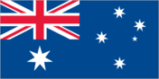
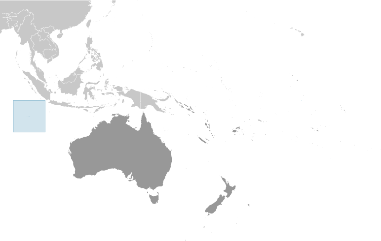

# Cocos (Keeling) Islands

_territory of Australia_

## Introduction

**_Background:_**   
There are 27 coral islands in the group. Captain William KEELING discovered the islands in 1609, but they remained uninhabited until the 19th century. From the 1820s to 1978, members of the CLUNIE-ROSS family controlled the islands and the copra produced from local coconuts. Annexed by the UK in 1857, the Cocos Islands were transferred to the Australian Government in 1955. Apart from North Keeling Island, which lies 30 kilometers north of the main group, the islands form a horseshoe-shaped atoll surrounding a lagoon. North Keeling Island was declared a national park in 1995 and is administered by Parks Australia. The population on the two inhabited islands generally is split between the ethnic Europeans on West Island and the ethnic Malays on Home Island.

## Geography

**_Location:_**   
Southeastern Asia, group of islands in the Indian Ocean, southwest of Indonesia, about halfway between Australia and Sri Lanka

**_Geographic coordinates:_**   
12 30 S, 96 50 E

**_Map references:_**   
Oceania

**_Area:_**   
**total:** 14 sq km   
**land:** 14 sq km   
**water:** 0 sq km   
**note:** includes the two main islands of West Island and Home Island

**_Area - comparative:_**   
about 24 times the size of The Mall in Washington, DC

**_Land boundaries:_**   
0 km

**_Coastline:_**   
26 km

**_Maritime claims:_**   
**territorial sea:** 12 nm   
**exclusive fishing zone:** 200 nm

**_Climate:_**   
tropical with high humidity, moderated by the southeast trade winds for about nine months of the year

**_Terrain:_**   
flat, low-lying coral atolls

**_Elevation extremes:_**   
**lowest point:** Indian Ocean 0 m   
**highest point:** unnamed location 5 m

**_Natural resources:_**   
fish

**_Land use:_**   
**arable land:** 0%   
**permanent crops:** 0%   
**other:** 100% (2011)

**_Irrigated land:_**   
NA

**_Natural hazards:_**   
cyclone season is October to April

**_Environment - current issues:_**   
freshwater resources are limited to rainwater accumulations in natural underground reservoirs

**_Geography - note:_**   
islands are thickly covered with coconut palms and other vegetation; site of a World War I naval battle in November 1914 between the Australian light cruiser HMAS Sydney and the German raider SMS Emden; after being heavily damaged in the engagement, the Emden was beached by her captain on North Keeling Island

## People and Society

**_Nationality:_**   
**noun:** Cocos Islander(s)   
**adjective:** Cocos Islander

**_Ethnic groups:_**   
Europeans, Cocos Malays

**_Languages:_**   
Malay (Cocos dialect), English

**_Religions:_**   
Sunni Muslim 80%, other 20% (2002 est.)

**_Population:_**   
596 (July 2014 est.)

**_Population growth rate:_**   
0% (2014 est.)

**_Infant mortality rate:_**   
**total:** NA   
**male:** NA   
**female:** NA

**_Life expectancy at birth:_**   
**total population:** NA   
**male:** NA   
**female:** NA

**_Total fertility rate:_**   
NA (2014 est.)

**_HIV/AIDS - adult prevalence rate:_**   
NA

**_HIV/AIDS - people living with HIV/AIDS:_**   
NA

**_HIV/AIDS - deaths:_**   
NA

**_Literacy:_**   
NA

## Government

**_Country name:_**   
**conventional long form:** Territory of Cocos (Keeling) Islands   
**conventional short form:** Cocos (Keeling) Islands

**_Dependency status:_**   
non-self governing territory of Australia; administered from Canberra by the Department of Regional Australia, Local Government, Arts and Sport

**_Government type:_**   
NA

**_Capital:_**   
**name:** West Island   
**geographic coordinates:** 12 10 S, 96 50 E   
**time difference:** UTC+6.5 (11.5 hours ahead of Washington, DC, during Standard Time)

**_Administrative divisions:_**   
none (territory of Australia)

**_Independence:_**   
none (territory of Australia)

**_National holiday:_**   
Australia Day, 26 January (1788)

**_Constitution:_**   
23 November 1955 (Cocos (Keeling) Islands Act 1955); amended many times, last in 2010 (2010)

**_Legal system:_**   
common law based on the Australian model

**_Suffrage:_**   
18 years of age

**_Executive branch:_**   
**chief of state:** Queen ELIZABETH II (since 6 February 1952) represented by the Australian governor general   
**head of government:** Administrator (nonresident) Jon STANHOPE (since 5 October 2012)   
**cabinet:** NA   
**elections:** the monarchy is hereditary; governor general appointed by the monarch on the recommendation of the Australian prime minister; administrator appointed by the governor general of Australia for a two-year term and represents the monarch and Australia

**_Legislative branch:_**   
unicameral Cocos (Keeling) Islands Shire Council (7 seats)   
**elections:** held every two years with half the members standing for election; last held in October 2011 (next to be held in October 2013)

**_Judicial branch:_**   
**highest court(s):** under the terms of the Territorial Law Reform Act 1992, Western Australia provides court services as needed for the island including the Supreme Court and subordinate courts (District Court, Magistrate Court, Family Court, Children's Court, and Coroners' Court)   
**judge selection and term of office:** NA   
**subordinate courts:** NA

**_Political parties and leaders:_**   
none

**_Political pressure groups and leaders:_**   
The Cocos Islands Youth Support Centre

**_International organization participation:_**   
none

**_Diplomatic representation in the US:_**   
none (territory of Australia)

**_Diplomatic representation from the US:_**   
none (territory of Australia)

**_Flag description:_**   
the flag of Australia is used

**_National anthem:_**   
**note:** as a territory of Australia, "Advance Australia Fair" remains official as the national anthem, while "God Save the Queen" serves as the royal anthem (see Australia)

## Economy

**_Economy - overview:_**   
Coconuts, grown throughout the islands, are the sole cash crop. Small local gardens and fishing contribute to the food supply, but additional food and most other necessities must be imported from Australia. There is a small tourist industry.

**_GDP (purchasing power parity):_**   
$NA

**_GDP - real growth rate:_**   
1% (2003)

**_Agriculture - products:_**   
vegetables, bananas, pawpaws, coconuts

**_Industries:_**   
copra products, tourism

**_Labor force:_**   
NA

**_Labor force - by occupation:_**   
**note:** the Cocos Islands Cooperative Society Ltd. employs construction workers, stevedores, and lighterage workers; tourism is the other main source of employment

**_Unemployment rate:_**   
60% (2000 est.)

**_Budget:_**   
**revenues:** $NA   
**expenditures:** $NA

**_Fiscal year:_**   
1 July - 30 June

**_Exports:_**   
$NA

**_Exports - commodities:_**   
copra

**_Imports:_**   
$NA

**_Imports - commodities:_**   
foodstuffs

**_Exchange rates:_**   
Australian dollars (AUD) per US dollar -   
1.031 (2013)   
0.9658 (2012)   
1.0902 (2010)   
1.2822 (2009)   
1.2059 (2008)

## Communications

**_Telephone system:_**   
**general assessment:** telephone service is part of the Australian network; an operational local mobile-cellular network available; wireless Internet connectivity available   
**domestic:** NA   
**international:** country code - 61; telephone, telex, and facsimile communications with Australia and elsewhere via satellite; satellite earth station - 1 (Intelsat) (2001)

**_Broadcast media:_**   
1 local radio station staffed by community volunteers; satellite broadcasts of several Australian radio and TV stations available (2009)

**_Internet country code:_**   
.cc

**_Internet hosts:_**   
42,820 (2012)

## Transportation

**_Airports:_**   
1 (2013)

**_Airports - with paved runways:_**   
**total:** 1   
**2,438 to 3,047 m:** 1 (2013)

**_Roadways:_**   
**total:** 22 km   
**paved:** 10 km   
**unpaved:** 12 km (2007)

**_Ports and terminals:_**   
**major seaport(s):** Port Refuge

## Military

**_Military - note:_**   
defense is the responsibility of Australia; the territory has a five-person police force

## Transnational Issues

**_Disputes - international:_**   
none

............................................................   
_Page last updated on June 16, 2014_
