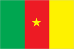
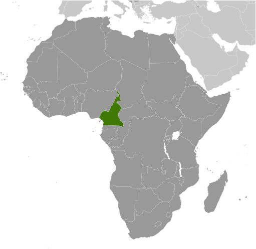
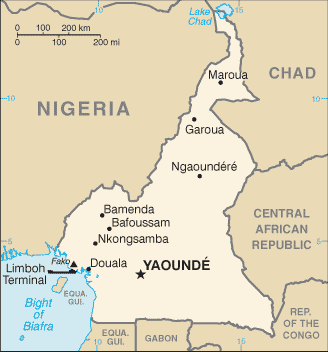

# Cameroon

## Introduction

**_Background:_**   
French Cameroon became independent in 1960 as the Republic of Cameroon. The following year the southern portion of neighboring British Cameroon voted to merge with the new country to form the Federal Republic of Cameroon. In 1972, a new constitution replaced the federation with a unitary state, the United Republic of Cameroon. The country has generally enjoyed stability, which has permitted the development of agriculture, roads, and railways, as well as a petroleum industry. Despite slow movement toward democratic reform, political power remains firmly in the hands of President Paul BIYA.

## Geography

**_Location:_**   
Central Africa, bordering the Bight of Biafra, between Equatorial Guinea and Nigeria

**_Geographic coordinates:_**   
6 00 N, 12 00 E

**_Map references:_**   
Africa

**_Area:_**   
**total:** 475,440 sq km   
**land:** 472,710 sq km   
**water:** 2,730 sq km

**_Area - comparative:_**   
slightly larger than California

**_Land boundaries:_**   
**total:** 5,018 km   
**border countries:** Central African Republic 901 km, Chad 1,116 km, Republic of the Congo 494 km, Equatorial Guinea 183 km, Gabon 349 km, Nigeria 1,975 km

**_Coastline:_**   
402 km

**_Maritime claims:_**   
**territorial sea:** 12 nm   
**contiguous zone:** 24 nm

**_Climate:_**   
varies with terrain, from tropical along coast to semiarid and hot in north

**_Terrain:_**   
diverse, with coastal plain in southwest, dissected plateau in center, mountains in west, plains in north

**_Elevation extremes:_**   
**lowest point:** Atlantic Ocean 0 m   
**highest point:** Fako 4,095 m (on Mt. Cameroon)

**_Natural resources:_**   
petroleum, bauxite, iron ore, timber, hydropower

**_Land use:_**   
**arable land:** 13.04%   
**permanent crops:** 2.94%   
**other:** 84.01% (2011)

**_Irrigated land:_**   
256.5 sq km (2003)

**_Total renewable water resources:_**   
285.5 cu km (2011)

**_Freshwater withdrawal (domestic/industrial/agricultural):_**   
**total:** 0.97 cu km/yr (23%/10%/68%)   
**per capita:** 58.9 cu m/yr (2005)

**_Natural hazards:_**   
volcanic activity with periodic releases of poisonous gases from Lake Nyos and Lake Monoun volcanoes   
**volcanism:** Mt. Cameroon (elev. 4,095 m), which last erupted in 2000, is the most frequently active volcano in West Africa; lakes in Oku volcanic field have released fatal levels of gas on occasion, killing some 1,700 people in 1986

**_Environment - current issues:_**   
waterborne diseases are prevalent; deforestation; overgrazing; desertification; poaching; overfishing

**_Environment - international agreements:_**   
**party to:** Biodiversity, Climate Change, Climate Change-Kyoto Protocol, Desertification, Endangered Species, Hazardous Wastes, Law of the Sea, Ozone Layer Protection, Tropical Timber 83, Tropical Timber 94, Wetlands, Whaling   
**signed, but not ratified:** none of the selected agreements

**_Geography - note:_**   
sometimes referred to as the hinge of Africa; throughout the country there are areas of thermal springs and indications of current or prior volcanic activity; Mount Cameroon, the highest mountain in Sub-Saharan west Africa, is an active volcano

## People and Society

**_Nationality:_**   
**noun:** Cameroonian(s)   
**adjective:** Cameroonian

**_Ethnic groups:_**   
Cameroon Highlanders 31%, Equatorial Bantu 19%, Kirdi 11%, Fulani 10%, Northwestern Bantu 8%, Eastern Nigritic 7%, other African 13%, non-African less than 1%

**_Languages:_**   
24 major African language groups, English (official), French (official)

**_Religions:_**   
indigenous beliefs 40%, Christian 40%, Muslim 20%

**_Population:_**   
23,130,708   
**note:** estimates for this country explicitly take into account the effects of excess mortality due to AIDS; this can result in lower life expectancy, higher infant mortality, higher death rates, lower population growth rates, and changes in the distribution of population by age and sex than would otherwise be expected (July 2014 est.)

**_Age structure:_**   
**0-14 years:** 42.9% (male 5,001,984/female 4,927,122)   
**15-24 years:** 19.6% (male 2,286,244/female 2,257,231)   
**25-54 years:** 30.4% (male 3,529,203/female 3,491,125)   
**55-64 years:** 3.9% (male 445,181/female 468,388)   
**65 years and over:** 3.4% (male 337,490/female 386,740) (2014 est.)

**_Dependency ratios:_**   
**total dependency ratio:** 85.1 %   
**youth dependency ratio:** 79.1 %   
**elderly dependency ratio:** 6 %   
**potential support ratio:** 16.8 (2014 est.)

**_Median age:_**   
**total:** 18.3 years   
**male:** 18.2 years   
**female:** 18.4 years (2014 est.)

**_Population growth rate:_**   
2.6% (2014 est.)

**_Birth rate:_**   
36.58 births/1,000 population (2014 est.)

**_Death rate:_**   
10.4 deaths/1,000 population (2014 est.)

**_Net migration rate:_**   
-0.15 migrant(s)/1,000 population (2014 est.)

**_Urbanization:_**   
**urban population:** 52.1% of total population (2011)   
**rate of urbanization:** 3.23% annual rate of change (2010-15 est.)

**_Major urban areas - population:_**   
Douala 2.449 million; YAOUNDE (capital) 2.432 million (2011)

**_Sex ratio:_**   
**at birth:** 1.03 male(s)/female   
**0-14 years:** 1.02 male(s)/female   
**15-24 years:** 1.01 male(s)/female   
**25-54 years:** 1.01 male(s)/female   
**55-64 years:** 1.01 male(s)/female   
**65 years and over:** 0.84 male(s)/female   
**total population:** 1.01 male(s)/female (2014 est.)

**_Mother's mean age at first birth:_**   
19.7   
**note:** median age at first birth among women 25-29 (2011 est.)

**_Maternal mortality rate:_**   
690 deaths/100,000 live births (2010)

**_Infant mortality rate:_**   
**total:** 55.1 deaths/1,000 live births   
**male:** 58.78 deaths/1,000 live births   
**female:** 51.31 deaths/1,000 live births (2014 est.)

**_Life expectancy at birth:_**   
**total population:** 57.35 years   
**male:** 56.09 years   
**female:** 58.65 years (2014 est.)

**_Total fertility rate:_**   
4.82 children born/woman (2014 est.)

**_Contraceptive prevalence rate:_**   
23.4% (2011)

**_Health expenditures:_**   
5.2% of GDP (2011)

**_Physicians density:_**   
0.08 physicians/1,000 population (2009)

**_Hospital bed density:_**   
1.3 beds/1,000 population (2010)

**_Drinking water source:_**   
**improved:** urban: 94.1% of population; rural: 51.9% of population; total: 74.1% of population   
**unimproved:** urban: 5.9% of population; rural: 48.1% of population; total: 25.9% of population (2012 est.)

**_Sanitation facility access:_**   
**improved:** urban: 61.7% of population; rural: 26.8% of population; total: 45.2% of population   
**unimproved:** urban: 38.3% of population; rural: 73.2% of population; total: 54.8% of population (2012 est.)

**_HIV/AIDS - adult prevalence rate:_**   
4.5% (2012 est.)

**_HIV/AIDS - people living with HIV/AIDS:_**   
600,500 (2012 est.)

**_HIV/AIDS - deaths:_**   
34,600 (2012 est.)

**_Major infectious diseases:_**   
**degree of risk:** very high   
**food or waterborne diseases:** bacterial and protozoal diarrhea, hepatitis A, and typhoid fever   
**vectorborne diseases:** malaria, dengue fever, and yellow fever   
**water contact disease:** schistosomiasis   
**respiratory disease:** meningococcal meningitis   
**animal contact disease:** rabies (2013)

**_Obesity - adult prevalence rate:_**   
10.3% (2008)

**_Children under the age of 5 years underweight:_**   
15.1% (2011)

**_Education expenditures:_**   
3.2% of GDP (2011)

**_Literacy:_**   
**definition:** age 15 and over can read and write   
**total population:** 71.3%   
**male:** 78.3%   
**female:** 64.8% (2010 est.)

**_School life expectancy (primary to tertiary education):_**   
**total:** 10 years   
**male:** 11 years   
**female:** 10 years (2011)

**_Child labor - children ages 5-14:_**   
**total number:** 1,396,281   
**percentage:** 31 % (2006 est.)

## Government

**_Country name:_**   
**conventional long form:** Republic of Cameroon   
**conventional short form:** Cameroon   
**local long form:** Republique du Cameroun/Republic of Cameroon   
**local short form:** Cameroun/Cameroon   
**former:** French Cameroon, British Cameroon, Federal Republic of Cameroon, United Republic of Cameroon

**_Government type:_**   
republic; multiparty presidential regime

**_Capital:_**   
**name:** Yaounde   
**geographic coordinates:** 3 52 N, 11 31 E   
**time difference:** UTC+1 (6 hours ahead of Washington, DC, during Standard Time)

**_Administrative divisions:_**   
10 regions (regions, singular - region); Adamaoua, Centre, East (Est), Far North (Extreme-Nord), Littoral, North (Nord), North-West (Nord-Ouest), West (Ouest), South (Sud), South-West (Sud-Ouest)

**_Independence:_**   
1 January 1960 (from French-administered UN trusteeship)

**_National holiday:_**   
Republic Day (National Day), 20 May (1972)

**_Constitution:_**   
several previous; latest effective 18 January 1996; amended 2008 (2008)

**_Legal system:_**   
mixed legal system of English common law, French civil law, and customary law

**_International law organization participation:_**   
accepts compulsory ICJ jurisdiction; non-party state to the ICCt

**_Suffrage:_**   
20 years of age; universal

**_Executive branch:_**   
**chief of state:** President Paul BIYA (since 6 November 1982)   
**head of government:** Prime Minister Philemon YANG (since 30 June 2009)   
**cabinet:** Cabinet appointed by the president from proposals submitted by the prime minister   
**elections:** president elected by popular vote for a seven-year term (with no term limits per 2008 constitutional amendment); election last held on 9 October 2011 (next to be held in October 2018); prime minister appointed by the president   
**election results:** President Paul BIYA reelected; percent of vote - Paul BIYA 78.0%, John FRU NDI 10.7%, Garga Haman ADJI 3.2%, Adamou Ndam NJOYA 1.7%, Paul Abine AYAH 1.3%, other 5.1%

**_Legislative branch:_**   
bicameral legislature consisting of an upper house or Senate (100 seats; 70 indirectly elected by municipal councils, 30 appointed by the President) and a National Assembly or Assemblee Nationale (180 seats; members are elected by direct popular vote to serve five-year terms); note - the president can either lengthen or shorten the term of the legislature; a senate was initially designated in 1996 by constitutional amendment but was only convened following a presidential decree in 2013   
**elections:** Senate last held on 14 April 2013 (next to be held NA); National Assembly last held on 30 September 2013 (next to be held in 2018)   
**election results:** Senate percent of vote by party - NA; seats by party - CPDM 56, SDF 14; National Assembley percent of vote by party - NA; seats by party - CPDM 148, SDF 18, UNDP 5, UDC 4, UPC 3, other 2

**_Judicial branch:_**   
**highest court(s):** Supreme Court of Cameroon (consists of 9 titular and 6 surrogate judges and organized into judicial, administrative, and audit chambers); Constitutional Council (consists of 11 members)   
**judge selection and term of office:** Supreme Court judges appointed by the president with the advice of the Higher Judicial Council of Cameroon (a body chaired by the president and includes the minister of justice, selected magistrates, and representatives of the National Assembly); judge term NA; Constitutional Council members appointed by the president for single 9-year terms   
**subordinate courts:** Parliamentary Court of Justice (jurisdiction limited to cases involving the president and prime minister); appellate and first instance courts; circuit and magistrate's courts

**_Political parties and leaders:_**   
Cameroon People's Democratic Movement or CPDM [Paul BIYA]   
Cameroon People's Party or CPP [Edith Kah WALLA]   
Cameroonian Democratic Union or UDC [Adamou Ndam NJOYA]   
Movement for the Defense of the Republic or MDR [Dakole DAISSALA]   
Movement for the Liberation and Development of Cameroon or MLDC [Marcel YONDO]   
National Union for Democracy and Progress or UNDP [Maigari BELLO BOUBA]   
Progressive Movement or MP [Jean-Jacques EKINDI]   
Social Democratic Front or SDF [John FRU NDI]   
Union of Peoples of Cameroon or UPC [The PMB, provisionary management bureau]

**_Political pressure groups and leaders:_**   
Human Rights Defense Group [Albert MUKONG, president]   
Southern Cameroon National Council [Ayamba Ette OTUN]

**_International organization participation:_**   
ACP, AfDB, AU, BDEAC, C, CEMAC, EITI (candidate country), FAO, FZ, G-77, IAEA, IBRD, ICAO, ICC (national committees), ICRM, IDA, IDB, IFAD, IFC, IFRCS, IHO, ILO, IMF, IMO, IMSO, Interpol, IOC, IOM, IPU, ISO, ITSO, ITU, ITUC (NGOs), MIGA, MONUSCO, NAM, OIC, OIF, OPCW, PCA, UN, UNAMID, UNCTAD, UNESCO, UNHCR, UNIDO, UNWTO, UPU, WCO, WFTU (NGOs), WHO, WIPO, WMO, WTO

**_Diplomatic representation in the US:_**   
**chief of mission:** Ambassador Joseph FOE-ATANGANA (since 12 September 2008)   
**chancery:** 2349 Massachusetts Avenue NW, Washington, DC 20008; current temporary address - 3400 International Drive NW, Washington, DC 20008   
**telephone:** [1] (202) 265-8790   
**FAX:** [1] (202) 387-3826

**_Diplomatic representation from the US:_**   
**chief of mission:** Ambassador (vacant); Charge d'Affaires Gregory THOME   
**embassy:** Avenue Rosa Parks, Yaounde   
**mailing address:** P. O. Box 817, Yaounde; pouch: American Embassy, US Department of State, Washington, DC 20521-2520   
**telephone:** [237] 2220 15 00; Consular: [237] 2220 16 03   
**FAX:** [237] 2220 15 00 Ext. 4531; Consular FAX: [237] 2220 17 52   
**branch office(s):** Douala

**_Flag description:_**   
three equal vertical bands of green (hoist side), red, and yellow, with a yellow five-pointed star centered in the red band; the vertical tricolor recalls the flag of France; red symbolizes unity, yellow the sun, happiness, and the savannahs in the north, and green hope and the forests in the south; the star is referred to as the "star of unity"   
**note:** uses the popular Pan-African colors of Ethiopia

**_National symbol(s):_**   
lion

**_National anthem:_**   
**name:** "O Cameroun, Berceau de nos Ancetres" (O Cameroon, Cradle of Our Forefathers)   
**lyrics/music:** Rene Djam AFAME, Samuel Minkio BAMBA, Moise Nyatte NKO'O [French], Benard Nsokika FONLON [English]/Rene Djam AFAME   
**note:** adopted 1957; Cameroon's anthem, also known as "Chant de Ralliement" (The Rallying Song), has been used unofficially since 1948 and officially adopted in 1957; the anthem has French and English versions whose lyrics differ

## Economy

**_Economy - overview:_**   
Because of its modest oil resources and favorable agricultural conditions, Cameroon has one of the best-endowed primary commodity economies in sub-Saharan Africa. Still, it faces many of the serious problems confronting other underdeveloped countries, such as stagnant per capita income, a relatively inequitable distribution of income, a top-heavy civil service, endemic corruption, and a generally unfavorable climate for business enterprise. Since 1990, the government has embarked on various IMF and World Bank programs designed to spur business investment, increase efficiency in agriculture, improve trade, and recapitalize the nation's banks. The IMF is pressing for more reforms, including increased budget transparency, privatization, and poverty reduction programs. Subsidies for electricity, food, and fuel have strained the budget. Cameroon has several large infrastructure projects under construction, including a deep sea port in Kribi and the Lom Pangar Hydropower Project. It also recently opened a natural gas powered electricity generating plant. Cameroon must attract more investment to improve its inadequate infrastructure, but its business environment is a deterrent to foreign investment.

**_GDP (purchasing power parity):_**   
$53.16 billion (2013 est.)   
$50.85 billion (2012 est.)   
$48.62 billion (2011 est.)   
**note:** data are in 2013 US dollars

**_GDP (official exchange rate):_**   
$27.88 billion (2013 est.)

**_GDP - real growth rate:_**   
4.6% (2013 est.)   
4.6% (2012 est.)   
4.1% (2011 est.)

**_GDP - per capita (PPP):_**   
$2,400 (2013 est.)   
$2,400 (2012 est.)   
$2,300 (2011 est.)   
**note:** data are in 2013 US dollars

**_Gross national saving:_**   
21.6% of GDP (2013 est.)   
21% of GDP (2012 est.)   
19.8% of GDP (2011 est.)

**_GDP - composition, by end use:_**   
**household consumption:** 65.6%   
**government consumption:** 16%   
**investment in fixed capital:** 21.7%   
**investment in inventories:** 0%   
**exports of goods and services:** 31.7%   
**imports of goods and services:** -35%; (2013 est.)

**_GDP - composition, by sector of origin:_**   
**agriculture:** 20.6%   
**industry:** 27.3%   
**services:** 52.1% (2013 est.)

**_Agriculture - products:_**   
coffee, cocoa, cotton, rubber, bananas, oilseed, grains, cassava (manioc, tapioca); livestock; timber

**_Industries:_**   
petroleum production and refining, aluminum production, food processing, light consumer goods, textiles, lumber, ship repair

**_Industrial production growth rate:_**   
4.1% (2013 est.)

**_Labor force:_**   
8.426 million (2013 est.)

**_Labor force - by occupation:_**   
**agriculture:** 70%   
**industry:** 13%   
**services:** 17% (2001 est.)

**_Unemployment rate:_**   
30% (2001 est.)

**_Population below poverty line:_**   
48% (2000 est.)

**_Household income or consumption by percentage share:_**   
**lowest 10%:** 2.3%   
**highest 10%:** 35.4% (2001)

**_Distribution of family income - Gini index:_**   
44.6 (2001)   
47.7 (1996)

**_Budget:_**   
**revenues:** $5.089 billion   
**expenditures:** $6.28 billion (2013 est.)

**_Taxes and other revenues:_**   
18.3% of GDP (2013 est.)

**_Budget surplus (+) or deficit (-):_**   
-4.3% of GDP (2013 est.)

**_Public debt:_**   
16.7% of GDP (2013 est.)   
16.1% of GDP (2012 est.)

**_Fiscal year:_**   
1 July - 30 June

**_Inflation rate (consumer prices):_**   
2.6% (2013 est.)   
2.9% (2012 est.)

**_Central bank discount rate:_**   
4.25% (31 December 2009 est.)

**_Commercial bank prime lending rate:_**   
14% (31 December 2013 est.)   
14% (31 December 2012 est.)

**_Stock of narrow money:_**   
$3.764 billion (31 December 2013 est.)   
$3.482 billion (31 December 2012 est.)

**_Stock of broad money:_**   
$6.195 billion (31 December 2013 est.)   
$5.731 billion (31 December 2012 est.)

**_Stock of domestic credit:_**   
$2.898 billion (31 December 2013 est.)   
$2.772 billion (31 December 2012 est.)

**_Market value of publicly traded shares:_**   
$230 million (31 December 2012 est.)

**_Current account balance:_**   
-$1.461 billion (2013 est.)   
-$956.2 million (2012 est.)

**_Exports:_**   
$6.002 billion (2013 est.)   
$6.015 billion (2012 est.)

**_Exports - commodities:_**   
crude oil and petroleum products, lumber, cocoa beans, aluminum, coffee, cotton

**_Exports - partners:_**   
China 15.2%, Netherlands 9.7%, Spain 9.1%, India 8.6%, Portugal 8.1%, Italy 6%, US 5.5%, France 4% (2012)

**_Imports:_**   
$6.795 billion (2013 est.)   
$6.321 billion (2012 est.)

**_Imports - commodities:_**   
machinery, electrical equipment, transport equipment, fuel, food

**_Imports - partners:_**   
China 18.7%, France 14.9%, Nigeria 12.3%, Belgium 5.2%, US 4.4%, India 4.2% (2012)

**_Reserves of foreign exchange and gold:_**   
$3.353 billion (31 December 2013 est.)   
$3.431 billion (31 December 2012 est.)

**_Debt - external:_**   
$3.455 billion (31 December 2013 est.)   
$3.207 billion (31 December 2012 est.)

**_Exchange rates:_**   
Cooperation Financiere en Afrique Centrale francs (XAF) per dollar -   
500.7 (2013 est.)   
510.53 (2012 est.)   
495.28 (2010 est.)   
472.19 (2009)   
447.81 (2008)

## Energy

**_Electricity - production:_**   
5.761 billion kWh (2010 est.)

**_Electricity - consumption:_**   
5.181 billion kWh (2010 est.)

**_Electricity - exports:_**   
0 kWh (2012 est.)

**_Electricity - imports:_**   
0 kWh (2012 est.)

**_Electricity - installed generating capacity:_**   
1.115 million kW (2010 est.)

**_Electricity - from fossil fuels:_**   
27.8% of total installed capacity (2010 est.)

**_Electricity - from nuclear fuels:_**   
0% of total installed capacity (2010 est.)

**_Electricity - from hydroelectric plants:_**   
72.2% of total installed capacity (2010 est.)

**_Electricity - from other renewable sources:_**   
0% of total installed capacity (2010 est.)

**_Crude oil - production:_**   
63,520 bbl/day (2012 est.)

**_Crude oil - exports:_**   
55,680 bbl/day (2010 est.)

**_Crude oil - imports:_**   
34,220 bbl/day (2010 est.)

**_Crude oil - proved reserves:_**   
200 million bbl (1 January 2013 est.)

**_Refined petroleum products - production:_**   
43,500 bbl/day (2010 est.)

**_Refined petroleum products - consumption:_**   
29,410 bbl/day (2011 est.)

**_Refined petroleum products - exports:_**   
13,370 bbl/day (2010 est.)

**_Refined petroleum products - imports:_**   
6,018 bbl/day (2010 est.)

**_Natural gas - production:_**   
150 million cu m (2011 est.)

**_Natural gas - consumption:_**   
210 million cu m (2010 est.)

**_Natural gas - exports:_**   
0 cu m (2011 est.)

**_Natural gas - imports:_**   
0 cu m (2011 est.)

**_Natural gas - proved reserves:_**   
135.1 billion cu m (1 January 2013 est.)

**_Carbon dioxide emissions from consumption of energy:_**   
8.126 million Mt (2011 est.)

## Communications

**_Telephones - main lines in use:_**   
737,400 (2012)

**_Telephones - mobile cellular:_**   
13.1 million (2012)

**_Telephone system:_**   
**general assessment:** system includes cable, microwave radio relay, and tropospheric scatter; Camtel, the monopoly provider of fixed-line service, provides connections for only about 3 per 100 persons; equipment is old and outdated, and connections with many parts of the country are unreliable   
**domestic:** mobile-cellular usage, in part a reflection of the poor condition and general inadequacy of the fixed-line network, has increased sharply, reaching a subscribership base of 50 per 100 persons   
**international:** country code - 237; landing point for the SAT-3/WASC fiber-optic submarine cable that provides connectivity to Europe and Asia; satellite earth stations - 2 Intelsat (Atlantic Ocean) (2011)

**_Broadcast media:_**   
government maintains tight control over broadcast media; state-owned Cameroon Radio Television (CRTV), broadcasting on both a TV and radio network, was the only officially recognized and fully licensed broadcaster until August 2007 when the government finally issued licenses to 2 private TV broadcasters and 1 private radio broadcaster; about 70 privately owned, unlicensed radio stations operating but are subject to closure at any time; foreign news services required to partner with state-owned national station (2007)

**_Internet country code:_**   
.cm

**_Internet hosts:_**   
10,207 (2012)

**_Internet users:_**   
749,600 (2009)

## Transportation

**_Airports:_**   
33 (2013)

**_Airports - with paved runways:_**   
**total:** 11   
**over 3,047 m:** 2   
**2,438 to 3,047 m:** 5   
**1,524 to 2,437 m:** 3   
**914 to 1,523 m:** 1 (2013)

**_Airports - with unpaved runways:_**   
**total:** 22   
**1,524 to 2,437 m:** 4   
**914 to 1,523 m:** 10   
**under 914 m:** 8 (2013)

**_Pipelines:_**   
gas 53 km; liquid petroleum gas 5 km; oil 1,107 km; water 35 km (2013)

**_Railways:_**   
**total:** 1,245 km   
**narrow gauge:** 1,245 km 1.000-m gauge (2008)

**_Roadways:_**   
**total:** 51,350 km   
**paved:** 4,108 km   
**unpaved:** 47,242 km   
**note:** there are 28,857 km of national roads (2011)

**_Waterways:_**   
(major rivers in the south, such as the Wouri and the Sanaga, are largely non-navigable; in the north, the Benue, which connects through Nigeria to the Niger River, is navigable in the rainy season only to the port of Garoua) (2010)

**_Ports and terminals:_**   
**river port(s):** Douala (Wouri); Garoua (Benoue)   
**oil/gas terminal(s):** Limboh Terminal

## Military

**_Military branches:_**   
Cameroon Armed Forces (Forces Armees Camerounaises, FAC), Army (L'Armee de Terre), Navy (Marine Nationale Republique (MNR), includes naval infantry), Air Force (Armee de l'Air du Cameroun, AAC), Fire Fighter Corps, Gendarmerie (2013)

**_Military service age and obligation:_**   
18-23 years of age for male and female voluntary military service; no conscription; high school graduation required; service obligation 4 years; the government makes periodic calls for volunteers (2012)

**_Manpower available for military service:_**   
**males age 16-49:** 4,667,251   
**females age 16-49:** 4,548,909 (2010 est.)

**_Manpower fit for military service:_**   
**males age 16-49:** 2,794,998   
**females age 16-49:** 2,718,110 (2010 est.)

**_Manpower reaching militarily significant age annually:_**   
**male:** 215,248   
**female:** 211,636 (2010 est.)

**_Military expenditures:_**   
1.42% of GDP (2012)   
1.37% of GDP (2011)   
1.42% of GDP (2010)

## Transnational Issues

**_Disputes - international:_**   
Joint Border Commission with Nigeria reviewed 2002 ICJ ruling on the entire boundary and bilaterally resolved differences, including June 2006 Greentree Agreement that immediately ceded sovereignty of the Bakassi Peninsula to Cameroon with a full phase-out of Nigerian control and patriation of residents in 2008; Cameroon and Nigeria agreed on maritime delimitation in March 2008; sovereignty dispute between Equatorial Guinea and Cameroon over an island at the mouth of the Ntem River; only Nigeria and Cameroon have heeded the Lake Chad Commission's admonition to ratify the delimitation treaty, which also includes the Chad-Niger and Niger-Nigeria boundaries

............................................................   
_Page last updated on June 22, 2014_
