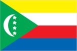
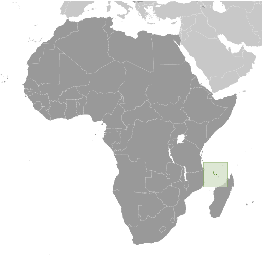
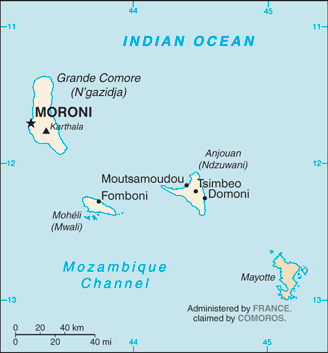

# Comoros

## Introduction

**_Background:_**   
Comoros has endured more than 20 coups or attempted coups since gaining independence from France in 1975. In 1997, the islands of Anjouan and Moheli declared independence from Comoros. In 1999, military chief Col. AZALI seized power of the entire government in a bloodless coup, and helped negotiate the 2000 Fomboni Accords power-sharing agreement in which the federal presidency rotates among the three islands, and each island maintains its local government. AZALI won the 2002 federal presidential election, and each island in the archipelago elected its president. AZALI stepped down in 2006 and President SAMBI was elected to office. In 2007, Mohamed BACAR effected Anjouan's de-facto secession from the Union of Comoros, refusing to step down when Comoros' other islands held legitimate elections in July. The African Union (AU) initially attempted to resolve the political crisis by applying sanctions and a naval blockade to Anjouan, but in March 2008 the AU and Comoran soldiers seized the island. The island's inhabitants generally welcomed the move. In May 2011, Ikililou DHOININE won the presidency in peaceful elections widely deemed to be free and fair.

## Geography

**_Location:_**   
Southern Africa, group of islands at the northern mouth of the Mozambique Channel, about two-thirds of the way between northern Madagascar and northern Mozambique

**_Geographic coordinates:_**   
12 10 S, 44 15 E

**_Map references:_**   
Africa

**_Area:_**   
**total:** 2,235 sq km   
**land:** 2,235 sq km   
**water:** 0 sq km

**_Area - comparative:_**   
slightly more than 12 times the size of Washington, DC

**_Land boundaries:_**   
0 km

**_Coastline:_**   
340 km

**_Maritime claims:_**   
**territorial sea:** 12 nm   
**exclusive economic zone:** 200 nm

**_Climate:_**   
tropical marine; rainy season (November to May)

**_Terrain:_**   
volcanic islands, interiors vary from steep mountains to low hills

**_Elevation extremes:_**   
**lowest point:** Indian Ocean 0 m   
**highest point:** Karthala 2,360 m

**_Natural resources:_**   
NEGL

**_Land use:_**   
**arable land:** 44.06%   
**permanent crops:** 31.17%   
**other:** 24.77% (2011)

**_Irrigated land:_**   
1.3 sq km NA (2003)

**_Total renewable water resources:_**   
1.2 cu km (2011)

**_Freshwater withdrawal (domestic/industrial/agricultural):_**   
**total:** 0.01 cu km/yr (48%/5%/47%)   
**per capita:** 16.86 cu m/yr (1999)

**_Natural hazards:_**   
cyclones possible during rainy season (December to April); volcanic activity on Grand Comore   
**volcanism:** Karthala (elev. 2,361 m) on Grand Comore Island last erupted in 2007; a 2005 eruption forced thousands of people to be evacuated and produced a large ash cloud

**_Environment - current issues:_**   
soil degradation and erosion results from crop cultivation on slopes without proper terracing; deforestation

**_Environment - international agreements:_**   
**party to:** Biodiversity, Climate Change, Climate Change-Kyoto Protocol, Desertification, Endangered Species, Hazardous Wastes, Law of the Sea, Ozone Layer Protection, Ship Pollution, Wetlands   
**signed, but not ratified:** none of the selected agreements

**_Geography - note:_**   
important location at northern end of Mozambique Channel

## People and Society

**_Nationality:_**   
**noun:** Comoran(s)   
**adjective:** Comoran

**_Ethnic groups:_**   
Antalote, Cafre, Makoa, Oimatsaha, Sakalava

**_Languages:_**   
Arabic (official), French (official), Shikomoro (a blend of Swahili and Arabic)

**_Religions:_**   
Sunni Muslim 98%, Roman Catholic 2%

**_Population:_**   
766,865 (July 2014 est.)

**_Age structure:_**   
**0-14 years:** 41.3% (male 157,996/female 159,088)   
**15-24 years:** 18.8% (male 69,688/female 74,418)   
**25-54 years:** 31.9% (male 116,235/female 128,647)   
**55-64 years:** 4.1% (male 14,074/female 17,700)   
**65 years and over:** 3.7% (male 13,696/female 15,323) (2014 est.)

**_Dependency ratios:_**   
**total dependency ratio:** 81 %   
**youth dependency ratio:** 75.9 %   
**elderly dependency ratio:** 5.1 %   
**potential support ratio:** 19.5 (2014 est.)

**_Median age:_**   
**total:** 19.2 years   
**male:** 18.5 years   
**female:** 19.8 years (2014 est.)

**_Population growth rate:_**   
1.87% (2014 est.)

**_Birth rate:_**   
29.05 births/1,000 population (2014 est.)

**_Death rate:_**   
7.76 deaths/1,000 population (2014 est.)

**_Net migration rate:_**   
-2.58 migrant(s)/1,000 population (2014 est.)

**_Urbanization:_**   
**urban population:** 28% of total population (2011)   
**rate of urbanization:** 2.84% annual rate of change (2010-15 est.)

**_Major urban areas - population:_**   
MORONI (capital) 54,000 (2011)

**_Sex ratio:_**   
**at birth:** 1.03 male(s)/female   
**0-14 years:** 0.99 male(s)/female   
**15-24 years:** 0.94 male(s)/female   
**25-54 years:** 0.9 male(s)/female   
**55-64 years:** 0.94 male(s)/female   
**65 years and over:** 0.92 male(s)/female   
**total population:** 0.94 male(s)/female (2014 est.)

**_Mother's mean age at first birth:_**   
24.6   
**note:** median age at first birth among women 25-29 (2012 est.)

**_Maternal mortality rate:_**   
280 deaths/100,000 live births (2010)

**_Infant mortality rate:_**   
**total:** 65.31 deaths/1,000 live births   
**male:** 76.11 deaths/1,000 live births   
**female:** 54.18 deaths/1,000 live births (2014 est.)

**_Life expectancy at birth:_**   
**total population:** 63.48 years   
**male:** 61.23 years   
**female:** 65.8 years (2014 est.)

**_Total fertility rate:_**   
3.76 children born/woman (2014 est.)

**_Contraceptive prevalence rate:_**   
25.7% (2000)

**_Health expenditures:_**   
5.3% of GDP (2011)

**_Physicians density:_**   
0.15 physicians/1,000 population (2004)

**_Hospital bed density:_**   
2.2 beds/1,000 population (2006)

**_Drinking water source:_**   
**improved:** rural: 96.7% of population   
**unimproved:** rural: 3.3% of population (2012 est.)

**_Sanitation facility access:_**   
**improved:** urban: 50% of population; rural: 29.7% of population; total: 35.4% of population   
**unimproved:** urban: 50% of population; rural: 70.3% of population; total: 64.6% of population (2010 est.)

**_HIV/AIDS - adult prevalence rate:_**   
0.1% (2009 est.)

**_HIV/AIDS - people living with HIV/AIDS:_**   
fewer than 500 (2009 est.)

**_HIV/AIDS - deaths:_**   
fewer than 100 (2009 est.)

**_Obesity - adult prevalence rate:_**   
4.4% (2008)

**_Children under the age of 5 years underweight:_**   
25% (2000)

**_Education expenditures:_**   
7.6% of GDP (2008)

**_Literacy:_**   
**definition:** age 15 and over can read and write   
**total population:** 75.5%   
**male:** 80.5%   
**female:** 70.6% (2011 est.)

**_School life expectancy (primary to tertiary education):_**   
**total:** 13 years   
**male:** 13 years   
**female:** 12 years (2012)

**_Child labor - children ages 5-14:_**   
**total number:** 39,550   
**percentage:** 27 % (2000 est.)

## Government

**_Country name:_**   
**conventional long form:** Union of the Comoros   
**conventional short form:** Comoros   
**local long form:** Udzima wa Komori (Comorian); Union des Comores (French); Jumhuriyat al Qamar al Muttahidah (Arabic)   
**local short form:** Komori (Comorian); Comores (French); Juzur al Qamar (Arabic)

**_Government type:_**   
republic

**_Capital:_**   
**name:** Moroni   
**geographic coordinates:** 11 42 S, 43 14 E   
**time difference:** UTC+3 (8 hours ahead of Washington, DC, during Standard Time)

**_Administrative divisions:_**   
3 islands and 4 municipalities\*; Anjouan (Ndzuwani), Domoni\*, Fomboni\*, Grande Comore (N'gazidja), Moheli (Mwali), Moroni\*, Moutsamoudou\*

**_Independence:_**   
6 July 1975 (from France)

**_National holiday:_**   
Independence Day, 6 July (1975)

**_Constitution:_**   
previous 1996; latest ratified 23 December 2001; amended 2009 and 2014 (2014)

**_Legal system:_**   
mixed legal system of Islamic religious law, the French civil code of 1975, and customary law

**_International law organization participation:_**   
has not submitted an ICJ jurisdiction declaration; accepts ICCt jurisdiction

**_Suffrage:_**   
18 years of age; universal

**_Executive branch:_**   
**chief of state:** President Ikililou DHOININE (since 26 May 2011)   
**head of government:** President Ikililou DHOININE (since 26 May 2011)   
**cabinet:** Council of Ministers appointed by the president   
**elections:** as defined by the 2001 constitution, the presidency rotates every four years among the elected presidents from the three main islands in the Union; election last held on 7 November and 26 December 2010 (next to be held in 2015)   
**election results:** Ikililou DHOININE elected president; percent of vote - Ikililou DHOININE 61.1%, Mohamed Said FAZUL 32.7%, Abdou DJABIR 6.2%

**_Legislative branch:_**   
unicameral Assembly of the Union (33 seats; 15 deputies are selected by the individual islands' local assemblies and 18 by universal suffrage to serve for five years);   
**elections:** last held on 6 and 20 December 2009 (next to be held in 2014)   
**election results:** percent of vote by party - NA; seats by party - pro-union coalition 19, autonomous coalition 4, independents 1; note - 9 additional seats are filled by deputies from local island assemblies

**_Judicial branch:_**   
**highest court(s):** Supreme Court or Cour Supreme (consists of 7 judges); Constitutional Court (consists of 8 members)   
**judge selection and term of office:** Supreme Court judges selected - 2 by the president of the Union, 2 by the Assembly of the Union, and 1 each by the 3 island councils; judges appointed for life; Constitutional Court members appointed - 1 by the president, 1 each by the 3 vice presidents, 1 by the Assembly, and 1 each by the island executives; all members serve 6-year renewable terms   
**subordinate courts:** Court of Appeals (in Moroni); Tribunal de premiere; island village (community) courts; religious courts

**_Political parties and leaders:_**   
Camp of the Autonomous Islands or CdIA (a coalition of parties organized by the islands' presidents in opposition to the Union President)   
Convention for the Renewal of the Comoros or CRC [AZALI Assowmani]   
Front National pour la Justice or FNJ [Ahmed RACHID] (Islamic party in opposition)   
Mouvement pour la Democratie et le Progress or MDP-NGDC [Abbas DJOUSSOUF]   
Parti Comorien pour la Democratie et le Progress or PCDP [Ali MROUDJAE]   
Rassemblement National pour le Development or RND [Omar TAMOU, Abdoulhamid AFFRAITANE]

**_Political pressure groups and leaders:_**   
**other:** environmentalists

**_International organization participation:_**   
ACP, AfDB, AMF, AOSIS, AU, CAEU (candidates), COMESA, FAO, FZ, G-77, IBRD, ICAO, ICRM, IDA, IDB, IFAD, IFC, IFRCS, ILO, IMF, IMO, IMSO, InOC, Interpol, IOC, IOM, ITSO, ITU, ITUC (NGOs), LAS, NAM, OIC, OIF, OPCW, UN, UNCTAD, UNESCO, UNIDO, UPU, WCO, WHO, WIPO, WMO, WTO (observer)

**_Diplomatic representation in the US:_**   
**chief of mission:** Ambassador Roubani KAAMBI (since 6 September 2012); note - also serves as Permanent Representative to the UN   
**chancery:** Mission to the US, 866 United Nations Plaza, Suite 418, New York, NY 10017   
**telephone:** [1] (212) 750-1637   
**FAX:** [1] (212) 750-1657

**_Diplomatic representation from the US:_**   
the US does not have an embassy in Comoros; the ambassador to Madagascar is accredited to Comoros

**_Flag description:_**   
four equal horizontal bands of yellow (top), white, red, and blue, with a green isosceles triangle based on the hoist; centered within the triangle is a white crescent with the convex side facing the hoist and four white, five-pointed stars placed vertically in a line between the points of the crescent; the horizontal bands and the four stars represent the four main islands of the archipelago - Mwali, N'gazidja, Ndzuwani, and Mahore (Mayotte - department of France, but claimed by Comoros)   
**note:** the crescent, stars, and color green are traditional symbols of Islam

**_National symbol(s):_**   
four stars and crescent

**_National anthem:_**   
**name:** "Udzima wa ya Masiwa" (The Union of the Great Islands)   
**lyrics/music:** Said Hachim SIDI ABDEREMANE/Said Hachim SIDI ABDEREMANE and Kamildine ABDALLAH   
**note:** adopted 1978

## Economy

**_Economy - overview:_**   
One of the world's poorest countries, Comoros is made up of three islands that have inadequate transportation links, a young and rapidly increasing population, and few natural resources. The low educational level of the labor force contributes to a subsistence level of economic activity, high unemployment, and a heavy dependence on foreign grants and technical assistance. Agriculture, including fishing, hunting, and forestry, contributes 50% to GDP, employs 80% of the labor force, and provides most of the exports. Export income is heavily reliant on the three main crops of vanilla, cloves, and ylang-ylang; and Comoros' export earnings are easily disrupted by disasters such as fires. The country is not self-sufficient in food production; rice, the main staple, accounts for the bulk of imports. The government - which is hampered by internal political disputes - lacks a comprehensive strategy to attract foreign investment and is struggling to upgrade education and technical training, privatize commercial and industrial enterprises, improve health services, diversify exports, promote tourism, and reduce the high population growth rate. Political problems have inhibited growth. Remittances from 200,000 Comorans abroad help supplement GDP. In December 2012, IMF and the World Bank's International Development Association supported $176 million in debt relief for Comoros, resulting in a 59% reduction of its future external debt service over a period of 40 years.

**_GDP (purchasing power parity):_**   
$911 million (2013 est.)   
$879.9 million (2012 est.)   
$855.1 million (2011 est.)   
**note:** data are in 2013 US dollars

**_GDP (official exchange rate):_**   
$658 million (2013 est.)

**_GDP - real growth rate:_**   
3.5% (2013 est.)   
3% (2012 est.)   
2.2% (2011 est.)

**_GDP - per capita (PPP):_**   
$1,300 (2013 est.)   
$1,300 (2012 est.)   
$1,300 (2011 est.)   
**note:** data are in 2013 US dollars

**_GDP - composition, by end use:_**   
**household consumption:** 97.2%   
**government consumption:** 17.4%   
**investment in fixed capital:** 21.6%   
**investment in inventories:** 5.1%   
**exports of goods and services:** 15%   
**imports of goods and services:** -56.4%; (2013 est.)

**_GDP - composition, by sector of origin:_**   
**agriculture:** 51%   
**industry:** 10%   
**services:** 39% (2012 est.)

**_Agriculture - products:_**   
vanilla, cloves, ylang-ylang (perfume essence), copra, coconuts, bananas, cassava (manioc)

**_Industries:_**   
fishing, tourism, perfume distillation

**_Industrial production growth rate:_**   
4% (2013 est.)

**_Labor force:_**   
233,500 (2011 est.)

**_Labor force - by occupation:_**   
**agriculture:** 80%   
**industry and services:** 20% (1996 est.)

**_Unemployment rate:_**   
20% (1996 est.)

**_Population below poverty line:_**   
60% (2002 est.)

**_Household income or consumption by percentage share:_**   
**lowest 10%:** 0.9%   
**highest 10%:** 55.2% (2004)

**_Budget:_**   
**revenues:** $170.1 million   
**expenditures:** $167.4 million (2013 est.)

**_Taxes and other revenues:_**   
25.8% of GDP (2013 est.)

**_Budget surplus (+) or deficit (-):_**   
0.4% of GDP (2013 est.)

**_Fiscal year:_**   
calendar year

**_Inflation rate (consumer prices):_**   
2.5% (2013 est.)   
6.3% (2012 est.)

**_Central bank discount rate:_**   
1.93% (31 December 2010 est.)   
2.21% (31 December 2009 est.)

**_Commercial bank prime lending rate:_**   
9% (31 December 2013 est.)   
10.5% (31 December 2012 est.)

**_Stock of narrow money:_**   
$162.2 million (31 December 2013 est.)   
$151.6 million (31 December 2012 est.)

**_Stock of broad money:_**   
$261.6 million (31 December 2013 est.)   
$234.4 million (31 December 2012 est.)

**_Stock of domestic credit:_**   
$156.8 million (31 December 2013 est.)   
$132.4 million (31 December 2012 est.)

**_Current account balance:_**   
-$45.2 million (2013 est.)   
-$40.9 million (2012 est.)

**_Exports:_**   
$19.7 million (2013 est.)   
$19.6 million (2012 est.)

**_Exports - commodities:_**   
vanilla, ylang-ylang (perfume essence), cloves, copra

**_Exports - partners:_**   
Netherlands 58.6%, Singapore 10.6%, Turkey 9.3%, France 5.6%, India 5% (2012)

**_Imports:_**   
$208.8 million (2013 est.)   
$208 million (2012 est.)

**_Imports - commodities:_**   
rice and other foodstuffs, consumer goods, petroleum products, cement, transport equipment

**_Imports - partners:_**   
Pakistan 15.7%, France 14.2%, UAE 11.5%, India 8.5%, China 6.7%, Kenya 5.3%, Singapore 5.2% (2012)

**_Debt - external:_**   
$142.9 million (31 December 2013 est.)   
$136.1 million (31 December 2012 est.)

**_Exchange rates:_**   
Comoran francs (KMF) per US dollar -   
378.7 (2013 est.)   
382.9 (2012 est.)   
371.46 (2010 est.)

## Energy

**_Electricity - production:_**   
40 million kWh (2010 est.)

**_Electricity - consumption:_**   
37.2 million kWh (2010 est.)

**_Electricity - exports:_**   
0 kWh (2012 est.)

**_Electricity - imports:_**   
0 kWh (2012 est.)

**_Electricity - installed generating capacity:_**   
6,000 kW (2010 est.)

**_Electricity - from fossil fuels:_**   
83.3% of total installed capacity (2010 est.)

**_Electricity - from nuclear fuels:_**   
0% of total installed capacity (2010 est.)

**_Electricity - from hydroelectric plants:_**   
16.7% of total installed capacity (2010 est.)

**_Electricity - from other renewable sources:_**   
0% of total installed capacity (2010 est.)

**_Crude oil - production:_**   
0 bbl/day (2012 est.)

**_Crude oil - exports:_**   
0 bbl/day (2010 est.)

**_Crude oil - imports:_**   
0 bbl/day (2010 est.)

**_Crude oil - proved reserves:_**   
0 bbl (1 January 2013 est.)

**_Refined petroleum products - production:_**   
0 bbl/day (2010 est.)

**_Refined petroleum products - consumption:_**   
1,025 bbl/day (2011 est.)

**_Refined petroleum products - exports:_**   
0 bbl/day (2010 est.)

**_Refined petroleum products - imports:_**   
877 bbl/day (2010 est.)

**_Natural gas - production:_**   
0 cu m (2011 est.)

**_Natural gas - consumption:_**   
0 cu m (2010 est.)

**_Natural gas - exports:_**   
0 cu m (2011 est.)

**_Natural gas - imports:_**   
0 cu m (2011 est.)

**_Natural gas - proved reserves:_**   
0 cu m (1 January 2013 est.)

**_Carbon dioxide emissions from consumption of energy:_**   
148,400 Mt (2011 est.)

## Communications

**_Telephones - main lines in use:_**   
24,000 (2012)

**_Telephones - mobile cellular:_**   
250,000 (2012)

**_Telephone system:_**   
**general assessment:** sparse system of microwave radio relay and HF radiotelephone communication stations   
**domestic:** fixed-line connections only about 3 per 100 persons; mobile cellular usage about 30 per 100 persons   
**international:** country code - 269; landing point for the EASSy fiber-optic submarine cable system connecting East Africa with Europe and North America; HF radiotelephone communications to Madagascar and Reunion (2010)

**_Broadcast media:_**   
national state-owned TV station and a TV station run by Anjouan regional government; national state-owned radio; regional governments on the islands of Grande Comore and Anjouan each operate a radio station; a few independent and small community radio stations operate on the islands of Grande Comore and Moheli, and these two islands have access to Mayotte Radio and French TV (2007)

**_Internet country code:_**   
.km

**_Internet hosts:_**   
14 (2012)

**_Internet users:_**   
24,300 (2009)

## Transportation

**_Airports:_**   
4 (2013)

**_Airports - with paved runways:_**   
**total:** 4   
**2,438 to 3,047 m:** 1   
**914 to 1,523 m:** 3 (2013)

**_Roadways:_**   
**total:** 880 km   
**paved:** 673 km   
**unpaved:** 207 km (2002)

**_Merchant marine:_**   
**total:** 149   
**by type:** bulk carrier 16, cargo 83, carrier 5, chemical tanker 5, container 2, passenger 2, passenger/cargo 1, petroleum tanker 17, refrigerated cargo 10, roll on/roll off 8   
**foreign-owned:** 73 (Bangladesh 1, Bulgaria 4, China 1, Cyprus 2, Greece 4, Kenya 2, Kuwait 1, Latvia 2, Lebanon 2, Lithuania 1, Nigeria 1, Norway 1, Pakistan 5, Russia 12, Syria 5, Turkey 8, UAE 8, UK 1, Ukraine 10, US 2) (2010)

**_Ports and terminals:_**   
**major seaport(s):** Moroni, Mutsamudu

## Military

**_Military branches:_**   
Army of National Development (l'Armee du Developpement Nationale, AND): Comoran Security Force (also called Comoran Defense Force (Force Comorienne de Defense, FCD), includes Gendarmerie), Comoran Coast Guard, Comoran Federal Police (2013)

**_Military service age and obligation:_**   
18 years of age for 2-year voluntary military service; no conscription; women first inducted into the Army in 2004 (2012)

**_Manpower available for military service:_**   
**males age 16-49:** 184,236   
**females age 16-49:** 183,363 (2010 est.)

**_Manpower fit for military service:_**   
**males age 16-49:** 134,562   
**females age 16-49:** 145,797 (2010 est.)

**_Manpower reaching militarily significant age annually:_**   
**male:** 8,831   
**female:** 8,809 (2010 est.)

## Transnational Issues

**_Disputes - international:_**   
claims French-administered Mayotte and challenges France's and Madagascar's claims to Banc du Geyser, a drying reef in the Mozambique Channel; in May 2008, African Union forces were called in to assist the Comoros military recapture Anjouan Island from rebels who seized it in 2001

**_Trafficking in persons:_**   
**current situation:** Comoros is a source country for children subjected to forced labor and reportedly sex trafficking; Comoran children are forced to labor within the country in domestic service, roadside and street vending, baking, agriculture, and sometimes criminal activities; some Comoran students at Koranic schools are exploited for forced agricultural or domestic labor, sometimes being subjected to physical and sexual abuse; Comoros may be particularly vulnerable to transnational trafficking because of inadequate border controls, government corruption, and the presence of criminal networks

............................................................   
_Page last updated on June 20, 2014_
