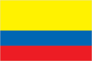
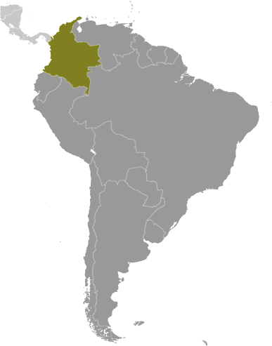
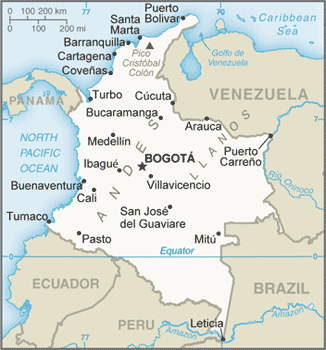

# Colombia

## Introduction

**_Background:_**   
Colombia was one of the three countries that emerged from the collapse of Gran Colombia in 1830 (the others are Ecuador and Venezuela). A nearly five-decade long conflict between government forces and anti-government insurgent groups, principally the Revolutionary Armed Forces of Colombia (FARC) heavily funded by the drug trade, escalated during the 1990s. More than 31,000 former paramilitaries had demobilized by the end of 2006 and the United Self Defense Forces of Colombia as a formal organization had ceased to function. In the wake of the paramilitary demobilization, emerging criminal groups arose, whose members include some former paramilitaries. The insurgents lack the military or popular support necessary to overthrow the government, but continue attacks against civilians. Large areas of the countryside are under guerrilla influence or are contested by security forces. In November 2012, the Colombian Government started formal peace negotiations with the FARC aimed at reaching a definitive bilateral ceasefire and incorporating demobilized FARC members into mainstream society and politics. The Colombian Government has stepped up efforts to reassert government control throughout the country, and now has a presence in every one of its administrative departments. Despite decades of internal conflict and drug related security challenges, Colombia maintains relatively strong democratic institutions characterized by peaceful, transparent elections and the protection of civil liberties.

## Geography

**_Location:_**   
Northern South America, bordering the Caribbean Sea, between Panama and Venezuela, and bordering the North Pacific Ocean, between Ecuador and Panama

**_Geographic coordinates:_**   
4 00 N, 72 00 W

**_Map references:_**   
South America

**_Area:_**   
**total:** 1,138,910 sq km   
**land:** 1,038,700 sq km   
**water:** 100,210 sq km   
**note:** includes Isla de Malpelo, Roncador Cay, and Serrana Bank

**_Area - comparative:_**   
slightly less than twice the size of Texas

**_Land boundaries:_**   
**total:** 6,672 km   
**border countries:** Brazil 1,790 km, Ecuador 708 km, Panama 339 km, Peru 1,494 km, Venezuela 2,341 km

**_Coastline:_**   
3,208 km (Caribbean Sea 1,760 km, North Pacific Ocean 1,448 km)

**_Maritime claims:_**   
**territorial sea:** 12 nm   
**exclusive economic zone:** 200 nm   
**continental shelf:** 200 m depth or to the depth of exploitation

**_Climate:_**   
tropical along coast and eastern plains; cooler in highlands

**_Terrain:_**   
flat coastal lowlands, central highlands, high Andes Mountains, eastern lowland plains (Llanos)

**_Elevation extremes:_**   
**lowest point:** Pacific Ocean 0 m   
**highest point:** Pico Cristobal Colon 5,775 m   
**note:** nearby Pico Simon Bolivar also has the same elevation

**_Natural resources:_**   
petroleum, natural gas, coal, iron ore, nickel, gold, copper, emeralds, hydropower

**_Land use:_**   
**arable land:** 1.84%   
**permanent crops:** 1.66%   
**other:** 96.5% (2011)

**_Irrigated land:_**   
10,870 sq km (2011)

**_Total renewable water resources:_**   
2,132 cu km (2011)

**_Freshwater withdrawal (domestic/industrial/agricultural):_**   
**total:** 12.65 cu km/yr (55%/4%/41%)   
**per capita:** 308 cu m/yr (2010)

**_Natural hazards:_**   
highlands subject to volcanic eruptions; occasional earthquakes; periodic droughts   
**volcanism:** Galeras (elev. 4,276 m) is one of Colombia's most active volcanoes, having erupted in 2009 and 2010 causing major evacuations; it has been deemed a Decade Volcano by the International Association of Volcanology and Chemistry of the Earth's Interior, worthy of study due to its explosive history and close proximity to human populations; Nevado del Ruiz (elev. 5,321 m), 129 km (80 mi) west of Bogota, erupted in 1985 producing lahars that killed 23,000 people; the volcano last erupted in 1991; additionally, after 500 years of dormancy, Nevado del Huila reawakened in 2007 and has experienced frequent eruptions since then; other historically active volcanoes include Cumbal, Dona Juana, Nevado del Tolima, and Purace

**_Environment - current issues:_**   
deforestation; soil and water quality damage from overuse of pesticides; air pollution, especially in Bogota, from vehicle emissions

**_Environment - international agreements:_**   
**party to:** Antarctic Treaty, Biodiversity, Climate Change, Climate Change-Kyoto Protocol, Desertification, Endangered Species, Hazardous Wastes, Marine Life Conservation, Ozone Layer Protection, Ship Pollution, Tropical Timber 83, Tropical Timber 94, Wetlands   
**signed, but not ratified:** Law of the Sea

**_Geography - note:_**   
only South American country with coastlines on both the North Pacific Ocean and Caribbean Sea

## People and Society

**_Nationality:_**   
**noun:** Colombian(s)   
**adjective:** Colombian

**_Ethnic groups:_**   
mestizo 58%, white 20%, mulatto 14%, black 4%, mixed black-Amerindian 3%, Amerindian 1%

**_Languages:_**   
Spanish (official)

**_Religions:_**   
Roman Catholic 90%, other 10%

**_Demographic profile:_**   
Colombia is in the midst of a demographic transition resulting from steady declines in its fertility, mortality, and population growth rates. The birth rate has fallen from more than 6 children per woman in the 1960s to just above replacement level today as a result of increased literacy, family planning services, and urbanization. However, income inequality is among the worst in the world, and more than a third of the population lives below the poverty line.   
Colombia experiences significant legal and illegal economic emigration and refugee flows. Large-scale labor emigration dates to the 1960s; Venezuela and the United States continue to be the main host countries. Colombia is the largest source of Latin American refugees in Latin America, nearly 400,000 of whom live primarily in Venezuela and Ecuador. Forced displacement remains prevalent because of violence among guerrillas, paramilitary groups, and Colombian security forces. Afro-Colombian and indigenous populations are disproportionately affected. A leading NGO estimates that 5.2 million people have been displaced since 1985, while the Colombian Government estimates 3.6 million since 2000. These estimates may undercount actual numbers because not all internally displaced persons are registered. Historically, Colombia also has one of the world's highest levels of forced disappearances. About 30,000 cases have been recorded over the last four decades - although the number is likely to be much higher - including human rights activists, trade unionists, Afro-Colombians, indigenous people, and farmers in rural conflict zones.

**_Population:_**   
46,245,297 (July 2014 est.)

**_Age structure:_**   
**0-14 years:** 25.3% (male 5,998,645/female 5,720,229)   
**15-24 years:** 18% (male 4,243,251/female 4,099,299)   
**25-54 years:** 41.6% (male 9,515,723/female 9,720,894)   
**55-64 years:** 8.3% (male 1,796,050/female 2,051,948)   
**65 years and over:** 6.5% (male 1,293,258/female 1,806,000) (2014 est.)

**_Dependency ratios:_**   
**total dependency ratio:** 50.9 %   
**youth dependency ratio:** 41.2 %   
**elderly dependency ratio:** 9.6 %   
**potential support ratio:** 10.4 (2014 est.)

**_Median age:_**   
**total:** 28.9 years   
**male:** 27.9 years   
**female:** 29.9 years (2014 est.)

**_Population growth rate:_**   
1.07% (2014 est.)

**_Birth rate:_**   
16.73 births/1,000 population (2014 est.)

**_Death rate:_**   
5.36 deaths/1,000 population (2014 est.)

**_Net migration rate:_**   
-0.65 migrant(s)/1,000 population (2014 est.)

**_Urbanization:_**   
**urban population:** 75.3% of total population (2011)   
**rate of urbanization:** 1.65% annual rate of change (2010-15 est.)

**_Major urban areas - population:_**   
BOGOTA (capital) 8.743 million; Medellin 3.694 million; Cali 2.453 million; Barranquilla 1.9 million; Bucaramanga 1.12 million; Cartagena 988,000 (2011)

**_Sex ratio:_**   
**at birth:** 1.06 male(s)/female   
**0-14 years:** 1.05 male(s)/female   
**15-24 years:** 1.04 male(s)/female   
**25-54 years:** 0.98 male(s)/female   
**55-64 years:** 0.98 male(s)/female   
**65 years and over:** 0.72 male(s)/female   
**total population:** 0.98 male(s)/female (2014 est.)

**_Mother's mean age at first birth:_**   
21.4   
**note:** median age at first birth among women 25-29 (2010 est.)

**_Maternal mortality rate:_**   
92 deaths/100,000 live births (2010)

**_Infant mortality rate:_**   
**total:** 15.02 deaths/1,000 live births   
**male:** 18.22 deaths/1,000 live births   
**female:** 11.62 deaths/1,000 live births (2014 est.)

**_Life expectancy at birth:_**   
**total population:** 75.25 years   
**male:** 72.08 years   
**female:** 78.61 years (2014 est.)

**_Total fertility rate:_**   
2.07 children born/woman (2014 est.)

**_Contraceptive prevalence rate:_**   
79.1% (2010)

**_Health expenditures:_**   
6.1% of GDP (2011)

**_Physicians density:_**   
1.47 physicians/1,000 population (2010)

**_Hospital bed density:_**   
1.4 beds/1,000 population (2011)

**_Drinking water source:_**   
**improved:** urban: 96.9% of population; rural: 73.6% of population; total: 91.2% of population   
**unimproved:** urban: 3.1% of population; rural: 26.4% of population; total: 8.8% of population (2012 est.)

**_Sanitation facility access:_**   
**improved:** urban: 84.9% of population; rural: 65.7% of population; total: 80.2% of population   
**unimproved:** urban: 15.1% of population; rural: 34.3% of population; total: 19.8% of population (2012 est.)

**_HIV/AIDS - adult prevalence rate:_**   
0.5% (2012 est.)

**_HIV/AIDS - people living with HIV/AIDS:_**   
146,500 (2012 est.)

**_HIV/AIDS - deaths:_**   
6,500 (2012 est.)

**_Major infectious diseases:_**   
**degree of risk:** high   
**food or waterborne diseases:** bacterial diarrhea   
**vectorborne diseases:** dengue fever, malaria, and yellow fever (2013)

**_Obesity - adult prevalence rate:_**   
17.3% (2008)

**_Children under the age of 5 years underweight:_**   
3.4% (2010)

**_Education expenditures:_**   
4.4% of GDP (2012)

**_Literacy:_**   
**definition:** age 15 and over can read and write   
**total population:** 93.6%   
**male:** 93.5%   
**female:** 93.7% (2011 est.)

**_School life expectancy (primary to tertiary education):_**   
**total:** 13 years   
**male:** 13 years   
**female:** 14 years (2012)

**_Child labor - children ages 5-14:_**   
**total number:** 988,362   
**percentage:** 9 %   
**note:** data represents children ages 5-17 (2009 est.)

**_Unemployment, youth ages 15-24:_**   
**total:** 21.9%   
**male:** 17%   
**female:** 28.9% (2011)

## Government

**_Country name:_**   
**conventional long form:** Republic of Colombia   
**conventional short form:** Colombia   
**local long form:** Republica de Colombia   
**local short form:** Colombia

**_Government type:_**   
republic; executive branch dominates government structure

**_Capital:_**   
**name:** Bogota   
**geographic coordinates:** 4 36 N, 74 05 W   
**time difference:** UTC-5 (same time as Washington, DC, during Standard Time)

**_Administrative divisions:_**   
32 departments (departamentos, singular - departamento) and 1 capital district\* (distrito capital); Amazonas, Antioquia, Arauca, Atlantico, Bogota\*, Bolivar, Boyaca, Caldas, Caqueta, Casanare, Cauca, Cesar, Choco, Cordoba, Cundinamarca, Guainia, Guaviare, Huila, La Guajira, Magdalena, Meta, Narino, Norte de Santander, Putumayo, Quindio, Risaralda, Archipielago de San Andres, Providencia y Santa Catalina (colloquially San Andres y Providencia), Santander, Sucre, Tolima, Valle del Cauca, Vaupes, Vichada

**_Independence:_**   
20 July 1810 (from Spain)

**_National holiday:_**   
Independence Day, 20 July (1810)

**_Constitution:_**   
several previous; latest promulgated 5 July 1991; amended many times, last in 2011 (2013)

**_Legal system:_**   
civil law system influenced by the Spanish and French civil codes

**_International law organization participation:_**   
has not submitted an ICJ jurisdiction declaration; accepts ICCt jurisdiction

**_Suffrage:_**   
18 years of age; universal

**_Executive branch:_**   
**chief of state:** President Juan Manuel SANTOS Calderon (since 7 August 2010); Vice President Angelino GARZON (since 7 August 2010); note - the president is both chief of state and head of government   
**head of government:** President Juan Manuel SANTOS Calderon (since 7 August 2010); Vice President Angelino GARZON (since 7 August 2010)   
**cabinet:** Cabinet appointed by the president   
**elections:** president and vice president elected by popular vote for a four-year term (eligible for a second term); election last held on 30 May 2010 with a runoff election 20 June 2010 (next to be held on 25 May 2014)   
**election results:** Juan Manuel SANTOS Calderon elected president in runoff election; percent of vote - Juan Manuel SANTOS Calderon 69.06%, Antanas MOCKUS 27.52%

**_Legislative branch:_**   
bicameral Congress or Congreso consists of the Senate or Senado (102 seats; members elected by popular vote to serve four-year terms) and the Chamber of Representatives or Camara de Representantes (166 seats; members elected by popular vote to serve four-year terms)   
**elections:** Senate - last held on 9 March 2014 (next to be held in March 2018); Chamber of Representatives - last held on 9 March 2014 (next to be held in March 2018)   
**election results:** Senate - percent of vote by party - NA; seats by party - U Party 21, PC 19, CD 19, PL 17, CR 9, PDA 5, Green Party 5, other parties 7; Chamber of Representatives - percent of vote by party - NA; seats by party - U Party 39, PL 37, PC 27, CR 16, CD 12, Green Party 6, PDA 3, other parties 26

**_Judicial branch:_**   
**highest court(s):** Supreme Court of Justice or Corte Suprema de Justicia (consists of the Civil-Agrarian and Labor Chambers each with 7 judges, and the Penal Chamber with 9 judges); Constitutional Court (consists of 9 magistrates); Council of State (consists of 27 magistrates)   
**judge selection and term of office:** Supreme Court judges appointed by the Congress from candidates submitted by the president; judges appointed for life; Constitutional Court magistrates - 3 nominated by the president, 3 by the Supreme Court, and 3 elected by the Senate; judges elected for individual 2-8 year terms   
**subordinate courts:** Superior Tribunals (appellate courts for each of the judicial districts); regional courts; civil municipal courts; Superior Military Tribunal; first instance administrative courts

**_Political parties and leaders:_**   
Alternative Democratic Pole or PDA [Clara LOPEZ]   
Conservative Party or PC [Omar YEPES Alzate]   
Democratic Center Party or CD [Alvaro URIBE Velez]   
Green Party [Alfonso PRADA]   
Liberal Party or PL [Simon GAVIRIA Munoz]   
National Integration Party or PIN [Angel ALIRIO Moreno]   
Radical Change or CR [Carlos Fernando GALAN]   
Social National Unity Party or U Party [Sergio Diaz GANADOS]   
**note:** Colombia has seven major political parties, and numerous smaller movements

**_Political pressure groups and leaders:_**   
Central Union of Workers or CUT   
Colombian Confederation of Workers or CTC   
General Confederation of Workers or CGT   
National Liberation Army or ELN   
Revolutionary Armed Forces of Colombia or FARC   
**note:** FARC and ELN are the two largest insurgent groups active in Colombia

**_International organization participation:_**   
BCIE, BIS, CAN, Caricom (observer), CD, CDB, CELAC, FAO, G-3, G-24, G-77, IADB, IAEA, IBRD, ICAO, ICC (national committees), ICRM, IDA, IFAD, IFC, IFRCS, IHO, ILO, IMF, IMO, IMSO, Interpol, IOC, IOM, IPU, ISO, ITSO, ITU, ITUC (NGOs), LAES, LAIA, Mercosur (associate), MIGA, NAM, OAS, OPANAL, OPCW, Pacific Alliance, PCA, UN, UNASUR, UNCTAD, UNESCO, UNHCR, UNIDO, Union Latina, UNSC (temporary), UNWTO, UPU, WCO, WFTU (NGOs), WHO, WIPO, WMO, WTO

**_Diplomatic representation in the US:_**   
**chief of mission:** Ambassador Luis Carlos VILLEGAS Echeverri (since 3 December 2013)   
**chancery:** 2118 Leroy Place NW, Washington, DC 20008   
**telephone:** [1] (202) 387-8338   
**FAX:** [1] (202) 232-8643   
**consulate(s) general:** Atlanta, Beverly Hills (CA), Boston, Chicago, Houston, Miami, New York, San Francisco, San Juan (Puerto Rico)   
**consulate(s):** Newark (NJ)

**_Diplomatic representation from the US:_**   
**chief of mission:** Ambassador (vacant); Charge d'Affaires Benjamin ZIFF   
**embassy:** Calle 24 Bis No. 48-50, Bogota, D.C.   
**mailing address:** Carrera 45 No. 24B-27, Bogota, D.C.   
**telephone:** [57] (1) 275-2000   
**FAX:** [57] (1) 275-4600

**_Flag description:_**   
three horizontal bands of yellow (top, double-width), blue, and red; the flag retains the three main colors of the banner of Gran Colombia, the short-lived South American republic that broke up in 1830; various interpretations of the colors exist and include: yellow for the gold in Colombia's land, blue for the seas on its shores, and red for the blood spilled in attaining freedom; alternatively, the colors have been described as representing more elemental concepts such as sovereignty and justice (yellow), loyalty and vigilance (blue), and valor and generosity (red); or simply the principles of liberty, equality, and fraternity   
**note:** similar to the flag of Ecuador, which is longer and bears the Ecuadorian coat of arms superimposed in the center

**_National symbol(s):_**   
Andean condor

**_National anthem:_**   
**name:** "Himno Nacional de la Republica de Colombia" (National Anthem of the Republic of Colombia)   
**lyrics/music:** Rafael NUNEZ/Oreste SINDICI   
**note:** adopted 1920; the anthem was created from an inspirational poem written by President Rafael NUNEZ

## Economy

**_Economy - overview:_**   
Colombia's consistently sound economic policies and aggressive promotion of free trade agreements in recent years have bolstered its ability to weather external shocks. Real GDP has grown more than 4% per year for the past three years, continuing almost a decade of strong economic performance. All three major ratings agencies have upgraded Colombia's government debt to investment grade. Nevertheless, Colombia depends heavily on energy and mining exports, making it vulnerable to a drop in commodity prices. Colombia is the world's fourth largest coal exporter and Latin America’s fourth largest oil producer. Economic development is stymied by inadequate infrastructure and an uncertain security situation. Moreover, the unemployment rate of 9.7% in 2013 is still one of Latin America's highest. The SANTOS Administration's foreign policy has focused on bolstering Colombia's commercial ties and boosting investment at home. Colombia has signed or is negotiating Free Trade Agreements (FTA) with more than a dozen countries; the US-Colombia FTA went into force on May 2012. Colombia is also a founding member of the Pacific Alliance - a regional grouping formed in 2012 by Chile, Colombia, Mexico, and Peru to promote regional trade and economic integration. In 2013, Colombia began its ascension process to the OECD. The annual level of foreign direct investment - notably in the oil and gas sectors - reached a record high of $16.8 billion in 2013, an increase of 7% over 2012. Inequality, poverty, and narcotrafficking remain significant challenges, and Colombia's infrastructure requires major improvements to sustain economic expansion.

**_GDP (purchasing power parity):_**   
$526.5 billion (2013 est.)   
$505.2 billion (2012 est.)   
$484.9 billion (2011 est.)   
**note:** data are in 2013 US dollars

**_GDP (official exchange rate):_**   
$369.2 billion (2013 est.)

**_GDP - real growth rate:_**   
4.2% (2013 est.)   
4.2% (2012 est.)   
6.6% (2011 est.)

**_GDP - per capita (PPP):_**   
$11,100 (2013 est.)   
$10,800 (2012 est.)   
$10,500 (2011 est.)   
**note:** data are in 2013 US dollars

**_Gross national saving:_**   
21.9% of GDP (2013 est.)   
22.8% of GDP (2012 est.)   
20.3% of GDP (2011 est.)

**_GDP - composition, by end use:_**   
**household consumption:** 61.7%   
**government consumption:** 16.7%   
**investment in fixed capital:** 23.8%   
**investment in inventories:** -0.3%   
**exports of goods and services:** 17.3%   
**imports of goods and services:** -19.3%; (2013 est.)

**_GDP - composition, by sector of origin:_**   
**agriculture:** 6.6%   
**industry:** 37.8%   
**services:** 55.6% (2013 est.)

**_Agriculture - products:_**   
coffee, cut flowers, bananas, rice, tobacco, corn, sugarcane, cocoa beans, oilseed, vegetables; shrimp; forest products

**_Industries:_**   
textiles, food processing, oil, clothing and footwear, beverages, chemicals, cement; gold, coal, emeralds

**_Industrial production growth rate:_**   
2.5% (2013 est.)

**_Labor force:_**   
23.75 million (2013 est.)

**_Labor force - by occupation:_**   
**agriculture:** 17%   
**industry:** 21%   
**services:** 62% (2011 est.)

**_Unemployment rate:_**   
9.7% (2013 est.)   
10.4% (2012 est.)

**_Population below poverty line:_**   
32.7% (2012 est.)

**_Household income or consumption by percentage share:_**   
**lowest 10%:** 0.9%   
**highest 10%:** 44.4% (2010 est.)

**_Distribution of family income - Gini index:_**   
55.9 (2010)   
56.9 (1996)

**_Budget:_**   
**revenues:** $107.4 billion   
**expenditures:** $106 billion (2013 est.)

**_Taxes and other revenues:_**   
29.1% of GDP (2012 est.)

**_Budget surplus (+) or deficit (-):_**   
0.4% of GDP (2012 est.)

**_Public debt:_**   
39.6% of GDP (2013 est.)   
40.5% of GDP (2012 est.)   
**note:** data cover general government debt, and includes debt instruments issued (or owned) by government entities other than the treasury; the data include treasury debt held by foreign entities; the data include debt issued by subnational entities

**_Fiscal year:_**   
calendar year

**_Inflation rate (consumer prices):_**   
2.2% (2013 est.)   
3.4% (2011 est.)

**_Central bank discount rate:_**   
4.75% (31 December 2011)   
5% (31 December 2010)

**_Commercial bank prime lending rate:_**   
11% (31 December 2013 est.)   
$NA (31 December 2012 est.)

**_Stock of narrow money:_**   
$42.28 billion (31 December 2013 est.)   
$41.7 billion (31 December 2012 est.)

**_Stock of broad money:_**   
$163.2 billion (31 December 2013 est.)   
$153.1 billion (31 December 2012 est.)

**_Stock of domestic credit:_**   
$192.6 billion (31 December 2013 est.)   
$180.7 billion (31 December 2012 est.)

**_Market value of publicly traded shares:_**   
$262.1 billion (31 December 2012 est.)   
$NA (31 December 2011)   
$208.5 billion (31 December 2010 est.)

**_Current account balance:_**   
-$11.02 billion (2013 est.)   
-$12.17 billion (2012 est.)

**_Exports:_**   
$58.7 billion (2013 est.)   
$59.85 billion (2012 est.)

**_Exports - commodities:_**   
petroleum, coal, emeralds, coffee, nickel, cut flowers, bananas, apparel

**_Exports - partners:_**   
US 36.6%, China 5.5%, Spain 4.8%, Panama 4.7%, Venezuela 4.4%, Netherlands 4.1% (2012)

**_Imports:_**   
$53.5 billion (2013 est.)   
$54.64 billion (2012 est.)

**_Imports - commodities:_**   
industrial equipment, transportation equipment, consumer goods, chemicals, paper products, fuels, electricity

**_Imports - partners:_**   
US 24.2%, China 16.3%, Mexico 10.9%, Brazil 4.8% (2012)

**_Reserves of foreign exchange and gold:_**   
$43.74 billion (31 December 2013 est.)   
$37 billion (31 December 2012 est.)

**_Debt - external:_**   
$85.83 billion (31 December 2013 est.)   
$80.72 billion (31 December 2012 est.)

**_Stock of direct foreign investment - at home:_**   
$128.1 billion (31 December 2013 est.)   
$111.7 billion (31 December 2012 est.)

**_Stock of direct foreign investment - abroad:_**   
$33.7 billion (31 December 2013 est.)   
$31.65 billion (31 December 2012 est.)

**_Exchange rates:_**   
Colombian pesos (COP) per US dollar -   
1,865.8 (2013 est.)   
1,798 (2012 est.)   
1,898.6 (2010 est.)   
2,157.6 (2009)   
2,243.6 (2008)

## Energy

**_Electricity - production:_**   
61.82 billion kWh (2011 est.)

**_Electricity - consumption:_**   
45.35 billion kWh (2010 est.)

**_Electricity - exports:_**   
1.294 billion kWh (2011 est.)

**_Electricity - imports:_**   
8.22 billion kWh (2011 est.)

**_Electricity - installed generating capacity:_**   
13.54 million kW (2010 est.)

**_Electricity - from fossil fuels:_**   
32.9% of total installed capacity (2010 est.)

**_Electricity - from nuclear fuels:_**   
0% of total installed capacity (2010 est.)

**_Electricity - from hydroelectric plants:_**   
66.6% of total installed capacity (2010 est.)

**_Electricity - from other renewable sources:_**   
0.4% of total installed capacity (2010 est.)

**_Crude oil - production:_**   
969,100 bbl/day (2012 est.)

**_Crude oil - exports:_**   
777,900 bbl/day (2009)

**_Crude oil - imports:_**   
10 bbl/day (2011 est.)

**_Crude oil - proved reserves:_**   
2.2 billion bbl (1 January 2013 est.)

**_Refined petroleum products - production:_**   
313,100 bbl/day (2010 est.)

**_Refined petroleum products - consumption:_**   
287,000 bbl/day (2011 est.)

**_Refined petroleum products - exports:_**   
92,410 bbl/day (2010 est.)

**_Refined petroleum products - imports:_**   
49,790 bbl/day (2010 est.)

**_Natural gas - production:_**   
10.95 billion cu m (2011 est.)

**_Natural gas - consumption:_**   
9.08 billion cu m (2010 est.)

**_Natural gas - exports:_**   
2.11 billion cu m (2011 est.)

**_Natural gas - imports:_**   
40,290 cu m (2011 est.)

**_Natural gas - proved reserves:_**   
169.9 billion cu m (1 January 2013 est.)

**_Carbon dioxide emissions from consumption of energy:_**   
71.15 million Mt (2011 est.)

## Communications

**_Telephones - main lines in use:_**   
6.291 million (2012)

**_Telephones - mobile cellular:_**   
49.066 million (2012)

**_Telephone system:_**   
**general assessment:** modern system in many respects with a nationwide microwave radio relay system, a domestic satellite system with 41 earth stations, and a fiber-optic network linking 50 cities; telecommunications sector liberalized during the 1990s; multiple providers of both fixed-line and mobile-cellular services   
**domestic:** fixed-line connections stand at about 15 per 100 persons; mobile cellular telephone subscribership is about 100 per 100 persons; competition among cellular service providers is resulting in falling local and international calling rates and contributing to the steep decline in the market share of fixed line services   
**international:** country code - 57; multiple submarine cable systems provide links to the US, parts of the Caribbean, and Central and South America; satellite earth stations - 10 (6 Intelsat, 1 Inmarsat, 3 fully digitalized international switching centers) (2011)

**_Broadcast media:_**   
combination of state-owned and privately owned broadcast media provide service; more than 500 radio stations and many national, regional, and local TV stations (2007)

**_Internet country code:_**   
.co

**_Internet hosts:_**   
4.41 million (2012)

**_Internet users:_**   
22.538 million (2009)

## Transportation

**_Airports:_**   
836 (2013)

**_Airports - with paved runways:_**   
**total:** 121   
**over 3,047 m:** 2   
**2,438 to 3,047 m:** 9   
**1,524 to 2,437 m:** 39   
**914 to 1,523 m:** 53   
**under 914 m:** 18 (2013)

**_Airports - with unpaved runways:_**   
**total:** 715   
**over 3,047 m:** 1   
**1,524 to 2,437 m:** 25   
**914 to 1,523 m:** 201   
**under 914 m:** 488 (2013)

**_Heliports:_**   
3 (2013)

**_Pipelines:_**   
gas 4,991 km; oil 6,796 km; refined products 3,429 km (2013)

**_Railways:_**   
**total:** 874 km   
**standard gauge:** 150 km 1.435-m gauge   
**narrow gauge:** 498 km 0.950-m gauge; 226 km 0.914-m gauge (2008)

**_Roadways:_**   
**total:** 141,374 km (2010)

**_Waterways:_**   
24,725 km (18,300 km navigable; the most important waterway, the River Magdalena, of which 1,488 km is navigable, is dredged regularly to ensure the safe passage of cargo vessels and container barges) (2012)

**_Merchant marine:_**   
**total:** 12   
**by type:** cargo 9, chemical tanker 1, petroleum tanker 2   
**registered in other countries:** 4 (Antigua and Barbuda 1, Panama 2, Portugal 1) (2010)

**_Ports and terminals:_**   
**major seaport(s):** Atlantic Ocean (Caribbean) - Cartagena, Santa Marta, Turbo; Pacific Ocean - Buenaventura   
**river port(s):** Barranquilla (Rio Magdalena)   
**oil/gas terminal(s):** Covenas offshore terminal   
**dry bulk cargo port(s):** Puerto Bolivar (coal)   
**container port(s) (TEUs):** Cartagena (1,853,342)

## Military

**_Military branches:_**   
National Army (Ejercito Nacional), Republic of Colombia Navy (Armada Republica de Colombia, ARC, includes Naval Aviation, Naval Infantry (Infanteria de Marina, IM), and Coast Guard), Colombian Air Force (Fuerza Aerea de Colombia, FAC) (2012)

**_Military service age and obligation:_**   
18-24 years of age for compulsory and voluntary military service; service obligation is 18 months (2012)

**_Manpower available for military service:_**   
**males age 16-49:** 11,692,647   
**females age 16-49:** 11,727,625 (2010 est.)

**_Manpower fit for military service:_**   
**males age 16-49:** 9,150,400   
**females age 16-49:** 9,861,760 (2010 est.)

**_Manpower reaching militarily significant age annually:_**   
**male:** 430,634   
**female:** 413,974 (2010 est.)

**_Military expenditures:_**   
3.28% of GDP (2012)   
3.06% of GDP (2011)   
3.28% of GDP (2010)

## Transnational Issues

**_Disputes - international:_**   
in December 2007, ICJ allocated San Andres, Providencia, and Santa Catalina islands to Colombia under 1928 Treaty but did not rule on 82 degrees W meridian as maritime boundary with Nicaragua; managed dispute with Venezuela over maritime boundary and Venezuelan-administered Los Monjes Islands near the Gulf of Venezuela; Colombian-organized illegal narcotics, guerrilla, and paramilitary activities penetrate all neighboring borders and have caused Colombian citizens to flee mostly into neighboring countries; Colombia, Honduras, Nicaragua, Jamaica, and the US assert various claims to Bajo Nuevo and Serranilla Bank

**_Refugees and internally displaced persons:_**   
**IDPs:** 5.5 - 5.7 million (conflict between government and illegal armed groups and drug traffickers since 1985; about 300,000 new IDPs each year since 2000) (2013)   
**stateless persons:** 12 (2012)

**_Illicit drugs:_**   
illicit producer of coca, opium poppy, and cannabis; world's leading coca cultivator with 83,000 hectares in coca cultivation in 2011, a 17% decrease over 2010, producing a potential of 195 mt of pure cocaine; the world's largest producer of coca derivatives; supplies cocaine to nearly all of the US market and the great majority of other international drug markets; in 2012, aerial eradication dispensed herbicide to treat over 100,549 hectares combined with manual eradication of 30,486 hectares; a significant portion of narcotics proceeds are either laundered or invested in Colombia through the black market peso exchange; important supplier of heroin to the US market; opium poppy cultivation is estimated to have fallen to 1,100 hectares in 2009 while pure heroin production declined to 2.1 mt; most Colombian heroin is destined for the US market (2013)

............................................................   
_Page last updated on June 22, 2014_
