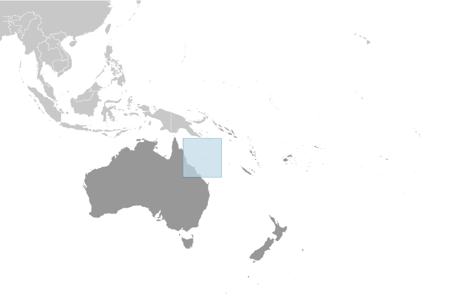
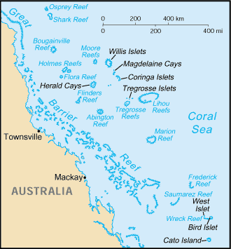

# Coral Sea Islands

_territory of Australia_

## Introduction

**_Background:_**   
Scattered over more than three-quarters of a million square kilometers of ocean, the Coral Sea Islands were declared a territory of Australia in 1969. They are uninhabited except for a small meteorological staff on the Willis Islets. Automated weather stations, beacons, and a lighthouse occupy many other islands and reefs. The Coral Sea Islands Act 1969 was amended in 1997 to extend the boundaries of the Coral Sea Islands Territory around Elizabeth and Middleton Reefs.

## Geography

**_Location:_**   
Oceania, islands in the Coral Sea, northeast of Australia

**_Geographic coordinates:_**   
18 00 S, 152 00 E

**_Map references:_**   
Oceania

**_Area:_**   
**total:** less than 3 sq km   
**land:** less than 3 sq km   
**water:** 0 sq km   
**note:** includes numerous small islands and reefs scattered over a sea area of about 780,000 sq km (300,000 sq mi) with the Willis Islets the most important

**_Area - comparative:_**   
NA

**_Land boundaries:_**   
0 km

**_Coastline:_**   
3,095 km

**_Maritime claims:_**   
**territorial sea:** 3 nm   
**exclusive fishing zone:** 200 nm

**_Climate:_**   
tropical

**_Terrain:_**   
sand and coral reefs and islands (or cays)

**_Elevation extremes:_**   
**lowest point:** Pacific Ocean 0 m   
**highest point:** unnamed location on Cato Island 6 m

**_Natural resources:_**   
NEGL

**_Land use:_**   
**arable land:** 0%   
**permanent crops:** 0%   
**other:** 100% (mostly grass or scrub cover) (2011)

**_Irrigated land:_**   
0 sq km (2011)

**_Natural hazards:_**   
occasional tropical cyclones

**_Environment - current issues:_**   
no permanent freshwater resources

**_Geography - note:_**   
important nesting area for birds and turtles

## People and Society

**_Population:_**   
no indigenous inhabitants   
**note:** there is a staff of three to four at the meteorological station on Willis Island (July 2007 est.)

## Government

**_Country name:_**   
**conventional long form:** Coral Sea Islands Territory   
**conventional short form:** Coral Sea Islands

**_Dependency status:_**   
territory of Australia; administered from Canberra by the Department of Regional Australia, Local Government, Arts and Sport

**_Legal system:_**   
the common law legal system of Australia, where applicable, applies

**_Diplomatic representation in the US:_**   
none (territory of Australia)

**_Diplomatic representation from the US:_**   
none (territory of Australia)

**_Flag description:_**   
the flag of Australia is used

## Economy

**_Economy - overview:_**   
no economic activity

## Communications

**_Communications - note:_**   
automatic weather stations on many of the isles and reefs relay data to the mainland

## Transportation

**_Ports and terminals:_**   
none; offshore anchorage only

## Military

**_Military - note:_**   
defense is the responsibility of Australia

## Transnational Issues

**_Disputes - international:_**   
none

............................................................   
_Page last updated on May 28, 2014_
