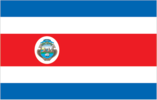
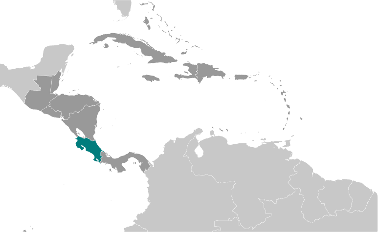
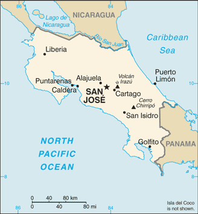

# Costa Rica

## Introduction

**_Background:_**   
Although explored by the Spanish early in the 16th century, initial attempts at colonizing Costa Rica proved unsuccessful due to a combination of factors, including disease from mosquito-infested swamps, brutal heat, resistance by natives, and pirate raids. It was not until 1563 that a permanent settlement of Cartago was established in the cooler, fertile central highlands. The area remained a colony for some two and a half centuries. In 1821, Costa Rica became one of several Central American provinces that jointly declared their independence from Spain. Two years later it joined the United Provinces of Central America, but this federation disintegrated in 1838, at which time Costa Rica proclaimed its sovereignty and independence. Since the late 19th century, only two brief periods of violence have marred the country's democratic development. In 1949, Costa Rica dissolved its armed forces. Although it still maintains a large agricultural sector, Costa Rica has expanded its economy to include strong technology and tourism industries. The standard of living is relatively high. Land ownership is widespread.

## Geography

**_Location:_**   
Central America, bordering both the Caribbean Sea and the North Pacific Ocean, between Nicaragua and Panama

**_Geographic coordinates:_**   
10 00 N, 84 00 W

**_Map references:_**   
Central America and the Caribbean

**_Area:_**   
**total:** 51,100 sq km   
**land:** 51,060 sq km   
**water:** 40 sq km   
**note:** includes Isla del Coco

**_Area - comparative:_**   
slightly smaller than West Virginia

**_Land boundaries:_**   
**total:** 661 km   
**border countries:** Nicaragua 313 km, Panama 348 km

**_Coastline:_**   
1,290 km

**_Maritime claims:_**   
**territorial sea:** 12 nm   
**exclusive economic zone:** 200 nm   
**continental shelf:** 200 nm

**_Climate:_**   
tropical and subtropical; dry season (December to April); rainy season (May to November); cooler in highlands

**_Terrain:_**   
coastal plains separated by rugged mountains including over 100 volcanic cones, of which several are major volcanoes

**_Elevation extremes:_**   
**lowest point:** Pacific Ocean 0 m   
**highest point:** Cerro Chirripo 3,810 m

**_Natural resources:_**   
hydropower

**_Land use:_**   
**arable land:** 4.89%   
**permanent crops:** 6.46%   
**other:** 88.65% (2011)

**_Irrigated land:_**   
1,031 sq km (2003)

**_Total renewable water resources:_**   
112.4 cu km (2011)

**_Freshwater withdrawal (domestic/industrial/agricultural):_**   
**total:** 5.77 cu km/yr (15%/9%/77%)   
**per capita:** 1,582 cu m/yr (2006)

**_Natural hazards:_**   
occasional earthquakes, hurricanes along Atlantic coast; frequent flooding of lowlands at onset of rainy season and landslides; active volcanoes   
**volcanism:** Arenal (elev. 1,670 m), which erupted in 2010, is the most active volcano in Costa Rica; a 1968 eruption destroyed the town of Tabacon; Irazu (elev. 3,432 m), situated just east of San Jose, has the potential to spew ash over the capital city as it did between 1963 and 1965; other historically active volcanoes include Miravalles, Poas, Rincon de la Vieja, and Turrialba

**_Environment - current issues:_**   
deforestation and land use change, largely a result of the clearing of land for cattle ranching and agriculture; soil erosion; coastal marine pollution; fisheries protection; solid waste management; air pollution

**_Environment - international agreements:_**   
**party to:** Biodiversity, Climate Change, Climate Change-Kyoto Protocol, Desertification, Endangered Species, Environmental Modification, Hazardous Wastes, Law of the Sea, Marine Dumping, Ozone Layer Protection, Wetlands, Whaling   
**signed, but not ratified:** Marine Life Conservation

**_Geography - note:_**   
four volcanoes, two of them active, rise near the capital of San Jose in the center of the country; one of the volcanoes, Irazu, erupted destructively in 1963-65

## People and Society

**_Nationality:_**   
**noun:** Costa Rican(s)   
**adjective:** Costa Rican

**_Ethnic groups:_**   
white or mestizo 83.6%, mulato 6.7%, indigenous 2.4%, black of African descent 1.1%, other 1.1%, none 2.9%, unspecified 2.2% (2011 est.)

**_Languages:_**   
Spanish (official), English

**_Religions:_**   
Roman Catholic 76.3%, Evangelical 13.7%, Jehovah's Witnesses 1.3%, other Protestant 0.7%, other 4.8%, none 3.2%

**_Demographic profile:_**   
Costa Rica's political stability, high standard of living, and well-developed social benefits system set it apart from its Central American neighbors. Through the government's sustained social spending - almost 20% of GDP annually - Costa Rica has made tremendous progress toward achieving its goal of providing universal access to education, healthcare, clean water, sanitation, and electricity. Since the 1970s, expansion of these services has led to a rapid decline in infant mortality, an increase in life expectancy at birth, and a sharp decrease in the birth rate. The average number of children born per women has fallen from about 7 in the 1960s to 3.5 in the early 1980s to below replacement level today. Costa Rica's poverty rate is lower than in most Latin American countries, but it has stalled at around 20% for almost two decades.   
Costa Rica is a popular regional immigration destination because of its job opportunities and social programs. Almost 9% of the population is foreign-born, with Nicaraguans comprising nearly three-quarters of the foreign population. Many Nicaraguans who perform unskilled seasonal labor enter Costa Rica illegally or overstay their visas, which continues to be a source of tension. Less than 3% of Costa Rica's population lives abroad. The overwhelming majority of expatriates have settled in the United States after completing a university degree or in order to work in a highly skilled field.

**_Population:_**   
4,755,234 (July 2014 est.)

**_Age structure:_**   
**0-14 years:** 23.5% (male 570,311/female 545,026)   
**15-24 years:** 17.5% (male 423,340/female 407,335)   
**25-54 years:** 43.8% (male 1,045,296/female 1,035,273)   
**55-64 years:** 8.3% (male 193,205/female 201,377)   
**65 years and over:** 6.8% (male 154,467/female 179,604) (2014 est.)

**_Dependency ratios:_**   
**total dependency ratio:** 43.6 %   
**youth dependency ratio:** 33.2 %   
**elderly dependency ratio:** 10.4 %   
**potential support ratio:** 9.6 (2014 est.)

**_Median age:_**   
**total:** 30 years   
**male:** 29.5 years   
**female:** 30.5 years (2014 est.)

**_Population growth rate:_**   
1.24% (2014 est.)

**_Birth rate:_**   
16.08 births/1,000 population (2014 est.)

**_Death rate:_**   
4.49 deaths/1,000 population (2014 est.)

**_Net migration rate:_**   
0.84 migrant(s)/1,000 population (2014 est.)

**_Urbanization:_**   
**urban population:** 64.7% of total population (2011)   
**rate of urbanization:** 2.06% annual rate of change (2010-15 est.)

**_Major urban areas - population:_**   
SAN JOSE (capital) 1.515 million (2011)

**_Sex ratio:_**   
**at birth:** 1.05 male(s)/female   
**0-14 years:** 1.05 male(s)/female   
**15-24 years:** 1.04 male(s)/female   
**25-54 years:** 1.01 male(s)/female   
**55-64 years:** 1.01 male(s)/female   
**65 years and over:** 0.86 male(s)/female   
**total population:** 1.01 male(s)/female (2014 est.)

**_Maternal mortality rate:_**   
40 deaths/100,000 live births (2010)

**_Infant mortality rate:_**   
**total:** 8.7 deaths/1,000 live births   
**male:** 9.5 deaths/1,000 live births   
**female:** 7.86 deaths/1,000 live births (2014 est.)

**_Life expectancy at birth:_**   
**total population:** 78.23 years   
**male:** 75.59 years   
**female:** 81.01 years (2014 est.)

**_Total fertility rate:_**   
1.91 children born/woman (2014 est.)

**_Contraceptive prevalence rate:_**   
82.2% (2010)

**_Health expenditures:_**   
10.9% of GDP (2011)

**_Physicians density:_**   
1.32 physicians/1,000 population (2000)

**_Hospital bed density:_**   
1.2 beds/1,000 population (2011)

**_Drinking water source:_**   
**improved:** urban: 99.6% of population; rural: 90.9% of population; total: 96.6% of population   
**unimproved:** urban: 0.4% of population; rural: 9.1% of population; total: 3.4% of population (2012 est.)

**_Sanitation facility access:_**   
**improved:** urban: 94.9% of population; rural: 92% of population; total: 93.9% of population   
**unimproved:** urban: 5.1% of population; rural: 8% of population; total: 6.1% of population (2012 est.)

**_HIV/AIDS - adult prevalence rate:_**   
0.3% (2012 est.)

**_HIV/AIDS - people living with HIV/AIDS:_**   
9,800 (2012 est.)

**_HIV/AIDS - deaths:_**   
300 (2012 est.)

**_Major infectious diseases:_**   
**degree of risk:** intermediate   
**food or waterborne diseases:** bacterial diarrhea   
**vectorborne diseases:** dengue fever (2013)

**_Obesity - adult prevalence rate:_**   
23.7% (2008)

**_Children under the age of 5 years underweight:_**   
1.1% (2009)

**_Education expenditures:_**   
6.3% of GDP (2009)

**_Literacy:_**   
**definition:** age 15 and over can read and write   
**total population:** 96.3%   
**male:** 96%   
**female:** 96.5% (2011 est.)

**_School life expectancy (primary to tertiary education):_**   
**total:** 14 years   
**male:** 13 years   
**female:** 14 years (2012)

**_Child labor - children ages 5-14:_**   
**total number:** 39,082   
**percentage:** 5 % (2002 est.)

**_Unemployment, youth ages 15-24:_**   
**total:** 18.4%   
**male:** 15%   
**female:** 24.2% (2012)

## Government

**_Country name:_**   
**conventional long form:** Republic of Costa Rica   
**conventional short form:** Costa Rica   
**local long form:** Republica de Costa Rica   
**local short form:** Costa Rica

**_Government type:_**   
democratic republic

**_Capital:_**   
**name:** San Jose   
**geographic coordinates:** 9 56 N, 84 05 W   
**time difference:** UTC-6 (1 hour behind Washington, DC, during Standard Time)

**_Administrative divisions:_**   
7 provinces (provincias, singular - provincia); Alajuela, Cartago, Guanacaste, Heredia, Limon, Puntarenas, San Jose

**_Independence:_**   
15 September 1821 (from Spain)

**_National holiday:_**   
Independence Day, 15 September (1821)

**_Constitution:_**   
previous 1825; latest adopted 7 November 1949; amended many times, last in 2005 (2005)

**_Legal system:_**   
civil law system based on Spanish civil code; judicial review of legislative acts in the Supreme Court

**_International law organization participation:_**   
accepts compulsory ICJ jurisdiction; accepts ICCt jurisdiction

**_Suffrage:_**   
18 years of age; universal and compulsory

**_Executive branch:_**   
**chief of state:** President Luis Guillermo SOLIS Rivera (since 8 May 2014); First Vice President Helio FALLAS Venega (since 8 May 2014); Second Vice President Ana Helena CHACÓN Echeverría (since 8 May 2014); note - the president is both chief of state and head of government   
**head of government:** President Luis Guillermo SOLIS Rivera (since 8 May 2014); First Vice President Helio FALLAS Venega (since 8 May 2014); Second Vice President Ana Helena CHACÓN Echeverría (since 8 May 2014)   
**cabinet:** Cabinet selected by the president   
**elections:** president and vice presidents elected on the same ticket by popular vote for a single four-year term; election last held on 2 February 2014, with a runoff on 6 April 2014 (next to be held in February 2018)   
**election results:** Luis Guillermo SOLIS Rivera elected president; percent of vote - Luis Guillermo SOLIS Rivera (PAC) 77.81%; Johnny ARAYA (PLN) 22.19%

**_Legislative branch:_**   
unicameral Legislative Assembly or Asamblea Legislativa (57 seats; members elected by direct, popular vote to serve four-year terms)   
**elections:** last held on 2 February 2014 (next to be held in February 2018)   
**election results:** percent of vote by party - NA; seats by party - PLN 18, PAC 13, FA 9, PUSC 9, PML 3, other 5

**_Judicial branch:_**   
**highest court(s):** Supreme Court of Justice (consists of 22 judges organized into 3 cassation chambers each with 5 judges, and the Constitutional Chamber with 7 judges)   
**judge selection and term of office:** Supreme Court of Justice judges elected by the National Assembly for 8-year terms with renewal decided by the National Assembly   
**subordinate courts:** appellate courts; first instance and justice of the peace courts; Superior Electoral Tribunal

**_Political parties and leaders:_**   
Accessibility Without Exclusion or PASE [Oscar Andres LOPEZ Arias]   
Citizen Action Party or PAC [Olivier PEREZ Gonzalez]   
Costa Rican Renovation Party or PRC [Gerardo Justo OROZCO Alvarez]   
Broad Front (Frente Amplio) or PFA [Ana Patricia MORA]   
Libertarian Movement Party or ML [Victor Danilo CUBERO Corrales]   
National Integration Party or PIN [Walter MUNOZ Cespedes]   
National Liberation Party or PLN [Bernal JIMENEZ]   
National Restoration Party or PRN [Carlos AVENDANO]   
Patriotic Alliance [Jorge ARAYA Westover]   
Popular Vanguard [Humberto VARGAS]   
Social Christian Unity Party or PUSC [Gerardo VARGAS]

**_Political pressure groups and leaders:_**   
Authentic Confederation of Democratic Workers or CATD (Communist Party affiliate)   
Chamber of Coffee Growers   
Confederated Union of Workers or CUT (Communist Party affiliate)   
Costa Rican Confederation of Democratic Workers or CCTD (Liberation Party affiliate)   
Costa Rican Exporter's Chamber or CADEXCO   
Costa Rican Solidarity Movement   
Costa Rican Union of Private Sector Enterprises or UCCAEP   
Federation of Public Service Workers or FTSP   
National Association for Economic Development or ANFE   
National Association of Educators or ANDE   
National Association of Public and Private Employees or ANEP   
Confederation of Workers Rerum Novarum or CTRN (PLN affiliate)

**_International organization participation:_**   
BCIE, CACM, CD, CELAC, FAO, G-77, IADB, IAEA, IBRD, ICAO, ICC (national committees), ICRM, IDA, IFAD, IFC, IFRCS, ILO, IMF, IMO, IMSO, Interpol, IOC, IOM, IPU, ISO, ITSO, ITU, ITUC (NGOs), LAES, LAIA (observer), MIGA, NAM (observer), OAS, OPANAL, OPCW, Pacific Alliance, PCA, SICA, UN, UNCTAD, UNESCO, UNHCR, UNIDO, Union Latina, UNWTO, UPU, WCO, WFTU (NGOs), WHO, WIPO, WMO, WTO

**_Diplomatic representation in the US:_**   
**chief of mission:** Ambassador Shanon Muni FIGUERES Boggs (since 7 September 2010)   
**chancery:** 2114 S Street NW, Washington, DC 20008   
**telephone:** [1] (202) 480-2200   
**FAX:** [1] (202) 265-4795   
**consulate(s) general:** Atlanta, Chicago, Houston, Los Angeles, Miami, New Orleans, New York, San Francisco, San Juan (Puerto Rico), Washington DC; note - Honorary Consulate: Dallas (Texas), Denver (Colorado), Tucson (Arizona)   
**consulate(s):** Austin

**_Diplomatic representation from the US:_**   
**chief of mission:** Ambassador (vacant); Charge d'Affaires Gonzalo GALLEGOS   
**embassy:** Calle 120 Avenida O, Pavas, San Jose   
**mailing address:** APO AA 34020   
**telephone:** [506] 2519-2000   
**FAX:** [506] 2519-2305

**_Flag description:_**   
five horizontal bands of blue (top), white, red (double width), white, and blue, with the coat of arms in a white elliptical disk toward the hoist side of the red band; Costa Rica retained the earlier blue-white-blue flag of Central America until 1848 when, in response to revolutionary activity in Europe, it was decided to incorporate the French colors into the national flag and a central red stripe was added; today the blue color is said to stand for the sky, opportunity, and perseverance, white denotes peace, happiness, and wisdom, while red represents the blood shed for freedom, as well as the generosity and vibrancy of the people   
**note:** somewhat resembles the flag of North Korea; similar to the flag of Thailand but with the blue and red colors reversed

**_National symbol(s):_**   
clay-colored robin known as Yiguirro

**_National anthem:_**   
**name:** "Himno Nacional de Costa Rica" (National Anthem of Costa Rica)   
**lyrics/music:** Jose Maria ZELEDON Brenes/Manuel Maria GUTIERREZ   
**note:** adopted 1949; the anthem's music was originally written for an 1853 welcome ceremony for diplomatic missions from the United States and United Kingdom; the lyrics were added in 1903

## Economy

**_Economy - overview:_**   
Prior to the global economic crisis, Costa Rica enjoyed stable economic growth. The economy contracted 1.3% in 2009 but resumed growth at about 4.5% per year in 2010-12. While the traditional agricultural exports of bananas, coffee, sugar, and beef are still the backbone of commodity export trade, a variety of industrial and specialized agricultural products have broadened export trade in recent years. High value-added goods and services, including microchips, have further bolstered exports. Tourism continues to bring in foreign exchange, as Costa Rica's impressive biodiversity makes it a key destination for ecotourism. Foreign investors remain attracted by the country's political stability and relatively high education levels, as well as the incentives offered in the free-trade zones; and Costa Rica has attracted one of the highest levels of foreign direct investment per capita in Latin America. However, many business impediments remain, such as high levels of bureaucracy, legal uncertainty due to overlapping and at times conflicting responsibilities between agencies, difficulty of enforcing contracts, and weak investor protection. Poverty has remained around 20-25% for nearly 20 years, and the strong social safety net that had been put into place by the government has eroded due to increased financial constraints on government expenditures. Unlike the rest of Central America, Costa Rica is not highly dependent on remittances as they only represent about 2% of GDP. Immigration from Nicaragua has increasingly become a concern for the government. The estimated 300,000-500,000 Nicaraguans in Costa Rica legally and illegally are an important source of mostly unskilled labor but also place heavy demands on the social welfare system. The US-Central American-Dominican Republic Free Trade Agreement (CAFTA-DR) entered into force on 1 January 2009 after significant delays within the Costa Rican legislature. CAFTA-DR has increased foreign direct investment in key sectors of the economy, including the insurance and telecommunications sectors recently opened to private investors. President CHINCHILLA was not able to gain legislative approval for fiscal reform, her top priority, though she continued to pursue fiscal reform in 2012. President CHINCHILLA and the PLN were successful in passing a tax on corporations to fund an increase for security services.

**_GDP (purchasing power parity):_**   
$61.43 billion (2013 est.)   
$59.35 billion (2012 est.)   
$56.45 billion (2011 est.)   
**note:** data are in 2013 US dollars

**_GDP (official exchange rate):_**   
$48.51 billion (2013 est.)

**_GDP - real growth rate:_**   
3.5% (2013 est.)   
5.1% (2012 est.)   
4.4% (2011 est.)

**_GDP - per capita (PPP):_**   
$12,900 (2013 est.)   
$12,700 (2012 est.)   
$12,200 (2011 est.)   
**note:** data are in 2013 US dollars

**_Gross national saving:_**   
16.3% of GDP (2013 est.)   
15.9% of GDP (2012 est.)   
16.2% of GDP (2011 est.)

**_GDP - composition, by end use:_**   
**household consumption:** 64.7%   
**government consumption:** 17.9%   
**investment in fixed capital:** 20.9%   
**investment in inventories:** 0.8%   
**exports of goods and services:** 35.2%   
**imports of goods and services:** -39.5%; (2013 est.)

**_GDP - composition, by sector of origin:_**   
**agriculture:** 6.2%   
**industry:** 21.3%   
**services:** 72.5% (2013 est.)

**_Agriculture - products:_**   
bananas, pineapples, coffee, melons, ornamental plants, sugar, corn, rice, beans, potatoes; beef, poultry, dairy; timber

**_Industries:_**   
microprocessors, food processing, medical equipment, textiles and clothing, construction materials, fertilizer, plastic products

**_Industrial production growth rate:_**   
4.3% (2013 est.)

**_Labor force:_**   
2.222 million   
**note:** this official estimate excludes Nicaraguans living in Costa Rica (2013 est.)

**_Labor force - by occupation:_**   
**agriculture:** 14%   
**industry:** 22%   
**services:** 64% (2006 est.)

**_Unemployment rate:_**   
7.9% (2013 est.)   
7.8% (2012 est.)

**_Population below poverty line:_**   
24.8% (2011 est.)

**_Household income or consumption by percentage share:_**   
**lowest 10%:** 1.2%   
**highest 10%:** 39.5% (2009 est.)

**_Distribution of family income - Gini index:_**   
50.3 (2009)   
45.9 (1997)

**_Budget:_**   
**revenues:** $7.197 billion   
**expenditures:** $9.621 billion (2013 est.)

**_Taxes and other revenues:_**   
14.8% of GDP (2013 est.)

**_Budget surplus (+) or deficit (-):_**   
-5% of GDP (2013 est.)

**_Public debt:_**   
55% of GDP (2013 est.)   
51.9% of GDP (2012 est.)

**_Fiscal year:_**   
calendar year

**_Inflation rate (consumer prices):_**   
5.6% (2013 est.)   
4.5% (2012 est.)

**_Central bank discount rate:_**   
$NA (31 December 2010 est.)   
23% (31 December 2009 est.)

**_Commercial bank prime lending rate:_**   
$NA (31 December 2013 est.)   
$NA (31 December 2012 est.)

**_Stock of narrow money:_**   
$4.633 billion (31 December 2013 est.)   
$4.197 billion (31 December 2012 est.)

**_Stock of broad money:_**   
$14.57 billion (31 December 2013 est.)   
$14.95 billion (31 December 2012 est.)

**_Stock of domestic credit:_**   
$22.92 billion (31 December 2013 est.)   
$21.93 billion (31 December 2012 est.)

**_Market value of publicly traded shares:_**   
$2.015 billion (31 December 2012 est.)   
$1.443 billion (31 December 2011)   
$1.445 billion (31 December 2010 est.)

**_Current account balance:_**   
-$2.673 billion (2013 est.)   
-$2.341 billion (2012 est.)

**_Exports:_**   
$11.66 billion (2013 est.)   
$11.44 billion (2012 est.)

**_Exports - commodities:_**   
bananas, pineapples, coffee, melons, ornamental plants, sugar; beef; seafood; electronic components, medical equipment

**_Exports - partners:_**   
US 38.9%, Netherlands 7.5%, Panama 5.1%, Hong Kong 4.6%, Nicaragua 4.4% (2012)

**_Imports:_**   
$17.56 billion (2013 est.)   
$16.75 billion (2012 est.)

**_Imports - commodities:_**   
raw materials, consumer goods, capital equipment, petroleum, construction materials

**_Imports - partners:_**   
US 49.8%, China 8.2%, Mexico 6.6% (2012)

**_Reserves of foreign exchange and gold:_**   
$7.406 billion (31 December 2013 est.)   
$6.857 billion (31 December 2012 est.)

**_Debt - external:_**   
$15.1 billion (31 December 2013 est.)   
$13.81 billion (31 December 2012 est.)

**_Stock of direct foreign investment - at home:_**   
$21.7 billion (31 December 2013 est.)   
$18.98 billion (31 December 2012 est.)

**_Stock of direct foreign investment - abroad:_**   
$1.681 billion (31 December 2013 est.)   
$1.481 billion (31 December 2012 est.)

**_Exchange rates:_**   
Costa Rican colones (CRC) per US dollar -   
500.9 (2013 est.)   
502.9 (2012 est.)   
525.83 (2010 est.)   
573.29 (2009)   
530.41 (2008)

## Energy

**_Electricity - production:_**   
9.473 billion kWh (2010 est.)

**_Electricity - consumption:_**   
8.532 billion kWh (2010 est.)

**_Electricity - exports:_**   
135 million kWh (2010 est.)

**_Electricity - imports:_**   
164 million kWh (2010 est.)

**_Electricity - installed generating capacity:_**   
2.8 million kW (2010 est.)

**_Electricity - from fossil fuels:_**   
32.4% of total installed capacity (2010 est.)

**_Electricity - from nuclear fuels:_**   
0% of total installed capacity (2010 est.)

**_Electricity - from hydroelectric plants:_**   
55.5% of total installed capacity (2010 est.)

**_Electricity - from other renewable sources:_**   
12.1% of total installed capacity (2010 est.)

**_Crude oil - production:_**   
290.7 bbl/day (2012 est.)

**_Crude oil - exports:_**   
0 bbl/day (2010 est.)

**_Crude oil - imports:_**   
10,040 bbl/day (2010 est.)

**_Crude oil - proved reserves:_**   
0 bbl (1 January 2013 est.)

**_Refined petroleum products - production:_**   
10,630 bbl/day (2010 est.)

**_Refined petroleum products - consumption:_**   
50,200 bbl/day (2011 est.)

**_Refined petroleum products - exports:_**   
1,898 bbl/day (2010 est.)

**_Refined petroleum products - imports:_**   
40,290 bbl/day (2010 est.)

**_Natural gas - production:_**   
0 cu m (2011 est.)

**_Natural gas - consumption:_**   
0 cu m (2010 est.)

**_Natural gas - exports:_**   
0 cu m (2011 est.)

**_Natural gas - imports:_**   
0 cu m (2011 est.)

**_Natural gas - proved reserves:_**   
0 cu m (1 January 2013 est.)

**_Carbon dioxide emissions from consumption of energy:_**   
6.806 million Mt (2011 est.)

## Communications

**_Telephones - main lines in use:_**   
1.018 million (2012)

**_Telephones - mobile cellular:_**   
6.151 million (2012)

**_Telephone system:_**   
**general assessment:** good domestic telephone service in terms of breadth of coverage; under the terms of CAFTA-DR, the state-run telecommunications monopoly is scheduled to be opened to competition from domestic and international firms, but has been slow to open to competition   
**domestic:** point-to-point and point-to-multi-point microwave, fiber-optic, and coaxial cable link rural areas; Internet service is available   
**international:** country code - 506; landing points for the Americas Region Caribbean Ring System (ARCOS-1), MAYA-1, and the Pan American Crossing submarine cables that provide links to South and Central America, parts of the Caribbean, and the US; connected to Central American Microwave System; satellite earth stations - 2 Intelsat (Atlantic Ocean) (2011)

**_Broadcast media:_**   
multiple privately owned TV stations and 1 publicly owned TV station; cable network services are widely available; more than 100 privately owned radio stations and a public radio network (2007)

**_Internet country code:_**   
.cr

**_Internet hosts:_**   
147,258 (2012)

**_Internet users:_**   
1.485 million (2009)

## Transportation

**_Airports:_**   
161 (2013)

**_Airports - with paved runways:_**   
**total:** 47   
**2,438 to 3,047 m:** 2   
**1,524 to 2,437 m:** 2   
**914 to 1,523 m:** 27   
**under 914 m:** 16 (2013)

**_Airports - with unpaved runways:_**   
**total:** 114   
**914 to 1,523 m:** 18   
**under 914 m:** 96 (2013)

**_Pipelines:_**   
refined products 662 km (2013)

**_Railways:_**   
**total:** 278 km   
**narrow gauge:** 278 km 1.067-m gauge   
**note:** none of the railway network is in use (2008)

**_Roadways:_**   
**total:** 39,018 km   
**paved:** 10,133 km   
**unpaved:** 28,885 km (2010)

**_Waterways:_**   
730 km (seasonally navigable by small craft) (2011)

**_Merchant marine:_**   
**total:** 1   
**by type:** passenger/cargo 1 (2010)

**_Ports and terminals:_**   
**major seaport(s):** Atlantic Ocean (Caribbean) Puerto Limon; Pacific Ocean - Caldera

## Military

**_Military branches:_**   
no regular military forces; Ministry of Public Security, Government, and Police (2011)

**_Manpower available for military service:_**   
**males age 16-49:** 1,255,798   
**females age 16-49:** 1,230,202 (2010 est.)

**_Manpower fit for military service:_**   
**males age 16-49:** 1,058,419   
**females age 16-49:** 1,037,053 (2010 est.)

**_Manpower reaching militarily significant age annually:_**   
**male:** 42,201   
**female:** 40,444 (2010 est.)

## Transnational Issues

**_Disputes - international:_**   
Costa Rica and Nicaragua regularly file border dispute cases over the delimitations of the San Juan River and the northern tip of Calero Island to the International Court of Justice (ICJ); in 2009, the ICJ ruled that Costa Rican vessels carrying out police activities could not use the river, but official Costa Rican vessels providing essential services to riverside inhabitants and Costa Rican tourists could travel freely on the river; in 2011, the ICJ provisionally ruled that both countries must remove personnel from the disputed area; in 2013, the ICJ rejected Nicaragua's 2012 suit to halt Costa Rica's construction of a highway paralleling the river on the grounds of irreparable environmental damage; in 2013, the ICJ, regarding the disputed territory, ordered that Nicaragua should refrain from dredging or canal construction and refill and repair damage caused by trenches connecting the river to the Caribbean and upheld its 2010 ruling that Nicaragua must remove all personnel; in early 2014, Costa Rica brought Nicaragua to the ICJ over offshore oil concessions in the disputed region

**_Refugees and internally displaced persons:_**   
**refugees (country of origin):** 16,586 (Colombia) (2013)

**_Illicit drugs:_**   
transshipment country for cocaine and heroin from South America; illicit production of cannabis in remote areas; domestic cocaine consumption, particularly crack cocaine, is rising; significant consumption of amphetamines; seizures of smuggled cash in Costa Rica and at the main border crossing to enter Costa Rica from Nicaragua have risen in recent years (2008)

............................................................   
_Page last updated on June 22, 2014_
